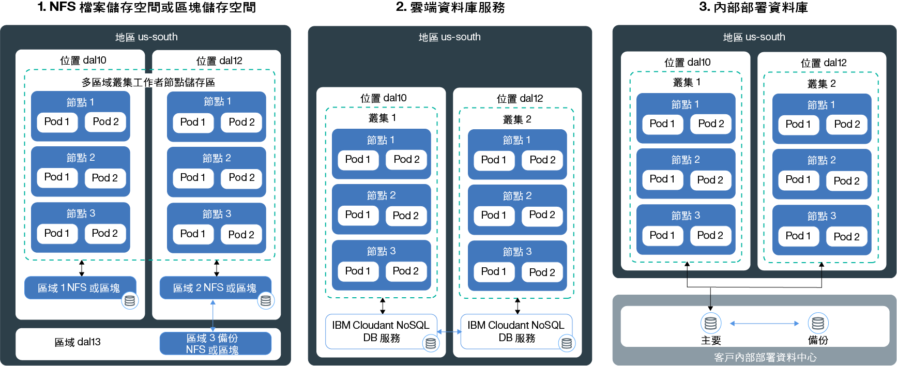

---

copyright:
  years: 2014, 2018
lastupdated: "2018-08-06"

---

{:new_window: target="_blank"}
{:shortdesc: .shortdesc}
{:screen: .screen}
{:pre: .pre}
{:table: .aria-labeledby="caption"}
{:codeblock: .codeblock}
{:tip: .tip}
{:download: .download}

# 規劃高度可用的持續性儲存空間
{: #storage_planning}

## 非持續性資料儲存空間選項
{: #non_persistent}

若您的資料不需要持續儲存，或不需要在各個應用程式實例之間共用資料，您可以使用非持續性儲存空間選項。也可以使用非持續性儲存空間選項，針對您的應用程式元件進行單元測試，或嘗試新的特性。
{: shortdesc}

下圖顯示 {{site.data.keyword.containerlong_notm}} 中可用的非持續性資料儲存空間選項。這些選項適用於免費叢集和標準叢集。

<table summary="表格顯示非持續性儲存空間選項。列應該從左到右閱讀，第一欄為選項編號，第二欄為選項的標題，第三欄為說明。" style="width: 100%">
<caption>非持續性儲存空間選項</caption>
  <thead>
  <th>選項</th>
  <th>說明</th>
  </thead>
  <tbody>
    <tr>
      <td>1. 在容器或 Pod 內</td>
      <td>容器及 Pod 在設計上是短暫存在的，且可能非預期地故障。不過，您可以將資料寫入至容器的本端檔案系統，以便在容器的整個生命週期中儲存資料。容器內的資料無法與其他容器或 Pod 共用，而且會在容器損毀或移除時遺失。如需相關資訊，請參閱[在容器中儲存資料](https://docs.docker.com/storage/)。</td>
    </tr>
  <tr>
    <td>2. 在工作者節點上
</td>
    <td>每個工作者節點都設定有主要及次要儲存空間，此儲存空間是由您為工作者節點選取的機型所決定。主要儲存空間是用來儲存作業系統中的資料，並且可使用 [Kubernetes <code>hostPath</code> 磁區 ](https://kubernetes.io/docs/concepts/storage/volumes/#hostpath) 進行存取。次要儲存空間用來儲存 `kubelet` 及容器運行環境引擎中的資料。您可以使用 [Kubernetes<code>emptyDir</code> 磁區 ](https://kubernetes.io/docs/concepts/storage/volumes/#emptydir) 來存取次要儲存空間  <code>hostPath</code> 磁區的用途是將工作者節點檔案系統上的檔案裝載至 Pod，而 <code>emptyDir</code> 則會建立一個空目錄來指派給叢集裡的 Pod。該 Pod 中的所有容器都可以對該磁區進行讀寫。因為磁區已指派給一個特定 Pod，所以無法與抄本集裡的其他 Pod 共用資料。  
在下列情況下，會移除 <code>hostPath</code> 或 <code>emptyDir</code> 磁區及其資料：<ul><li>已刪除工作者節點。</li><li>已重新載入或更新工作者節點。</li><li>已刪除叢集。</li><li>{{site.data.keyword.Bluemix_notm}} 帳戶達到暫停狀況。</li></ul>

此外，在下列情況下，會移除 <code>emptyDir</code> 磁區中的資料：<ul><li>已從工作者節點中永久地刪除指派的 Pod。</li><li>已在另一個工作者節點上排定指派的 Pod。</li></ul>

<strong>附註：</strong>如果 Pod 內的容器損毀，則在工作者節點上仍然可使用磁區中的資料。
</td>
    </tr>
    </tbody>
    </table>

## 高可用性的持續性資料儲存空間選項
{: #persistent}

當您建立高可用性且有狀態的應用程式時，主要的挑戰是在多個區域中的多個應用程式實例之間持續保存資料，並隨時讓資料保持同步。對於高可用性資料，您會想要確保有一個主要資料庫，且有多個實例分散在多個資料中心或甚至多個地區。必須持續抄寫這個主要資料庫，以維持單一的事實來源。叢集裡的所有實例都必須對這個主要資料庫進行讀寫。如果主要資料庫的某一個實例關閉，其他實例會接管工作負載，因此您不會經歷應用程式的關閉時間。
{: shortdesc}

下圖顯示您在 {{site.data.keyword.containerlong_notm}} 中具有的選項，可讓您的資料在標準叢集裡具有高可用性。適合您的選項，取決於下列因素：
  * **您具有的應用程式類型：**例如，您的應用程式可能必須根據檔案來儲存資料，而不是儲存於資料庫內。
  * **資料儲存及遞送地點的法律要求：**例如，您可能只能在美國儲存及遞送資料，而無法使用位於歐洲的服務。
  * **備份及還原選項：**每個儲存空間選項都具有備份及還原資料的功能。請檢查可用的備份及還原選項是否符合災難回復計劃的需求，例如備份的頻率，或是在主要資料中心以外儲存資料的功能。
  * **全球抄寫：**如需高可用性，建議您設定分散在全球資料中心並互相抄寫的多個儲存空間實例。

 

<table summary="表格顯示持續性儲存空間選項。列應該從左到右閱讀，第一欄為選項編號，第二欄為選項的標題，第三欄為說明。" style="width: 100%">
<caption>持續性儲存空間選項</caption>
  <thead>
  <th>選項</th>
  <th>說明</th>
  </thead>
  <tbody>
  <tr>
  <td>1. NFS 或區塊儲存空間</td>
  <td>使用此選項，您可以使用 Kubernetes 持續性磁區，在相同區域內持續保存應用程式及容器資料。  <strong>如何佈建檔案或區塊儲存空間？</strong> 若要在叢集裡佈建檔案儲存空間及區塊儲存空間，您可以[使用持續性磁區 (PV) 及持續性磁區要求 (PVC)](cs_storage_basics.html#pvc_pv)。PVC 及 PV 是使 API 抽象化以佈建實體檔案或區塊儲存裝置的 Kubernetes 概念。您可以使用[動態](cs_storage_basics.html#dynamic_provisioning)或[靜態](cs_storage_basics.html#static_provisioning)佈建來建立 PVC 及 PV。  <strong>可在多區域叢集裡使用檔案或區塊儲存空間嗎？</strong>  檔案和區塊儲存裝置是區域所特有，無法跨區域或地區共用。若要在叢集裡使用此類型的儲存空間，您必須在與儲存空間相同的區域中至少具有一個工作者節點。  如果您在跨越多個區域的叢集裡[動態佈建](cs_storage_basics.html#dynamic_provisioning)檔案及區塊儲存空間，則儲存空間只會佈建在 1 個根據循環式基準選取的區域中。若要在多區域叢集的所有區域中佈建持續性儲存空間，請重複這些步驟，為每一個區域佈建動態儲存空間。例如，如果您的叢集跨越區域 `dal10`、`dal12` 及 `dal13`，則第一次動態佈建持續性儲存空間，可能會在 `dal10` 中佈建儲存空間。請額外建立兩個 PVC 來涵蓋 `dal12` 及 `dal13`。  <strong>如果我要跨區域共用資料，該怎麼辦？</strong> 如果您要跨區域共用資料，請使用雲端資料庫服務，例如 [{{site.data.keyword.cloudant_short_notm}}](/docs/services/Cloudant/getting-started.html#getting-started-with-cloudant) 或 [{{site.data.keyword.cos_full_notm}}](/docs/services/cloud-object-storage/about-cos.html#about-ibm-cloud-object-storage)。</td>
  </tr>
  <tr id="cloud-db-service">
    <td>2. Cloud 資料庫服務</td>
    <td>使用此選項，您可以利用 {{site.data.keyword.Bluemix_notm}} 資料庫服務（例如 [IBM Cloudant NoSQL DB](/docs/services/Cloudant/getting-started.html#getting-started-with-cloudant)）來持續保存資料。  <strong>我可以對多區域叢集使用雲端資料庫服務嗎？</strong> 使用雲端資料庫服務時，資料會儲存在叢集以外的所指定服務實例中。服務實例會佈建至某一個區域。不過，每個服務實例都有一個外部介面，您可以用來存取資料。對多區域叢集使用資料庫服務時，您可以跨叢集、區域及地區來共用資料。若要讓您的服務實例更具可用性，您可以選擇跨區域設定多個實例，並在實例之間進行抄寫，以取得更高的可用性。  <strong>如何將雲端資料庫服務新增至我的叢集？</strong> 若要在您的叢集裡使用服務，您必須[將 {{site.data.keyword.Bluemix_notm}} 服務連結](cs_integrations.html#adding_app)至叢集裡的名稱空間。將服務連結至叢集時，即會建立 Kubernetes 密碼。Kubernetes 密碼會保留服務的機密資訊（例如服務的 URL、使用者名稱及密碼）。您可以將密碼以密碼磁區形式裝載至 Pod，並使用密碼中的認證來存取服務。透過將密碼磁區裝載至其他 Pod，您也可以在 Pod 之間共用資料。容器損毀或從工作者節點移除 Pod 時不會移除資料，您仍然可以透過裝載密碼磁區的其他 Pod 進行存取。  大部分 {{site.data.keyword.Bluemix_notm}} 資料庫服務會免費提供少量資料的磁碟空間，讓您可以測試其特性。
</td>
  </tr>
  <tr>
    <td>3. 內部部署資料庫</td>
    <td>如果因為法律原因而必須現場儲存資料，您可以對內部部署資料庫[設定 VPN 連線](cs_vpn.html#vpn)，並在資料中心使用現有的儲存空間、備份及抄寫機制。</td>
  </tr>
  </tbody>
  </table>

{: caption="表.Kubernetes 叢集裡部署的持續性資料儲存空間選項" caption-side="top"}
