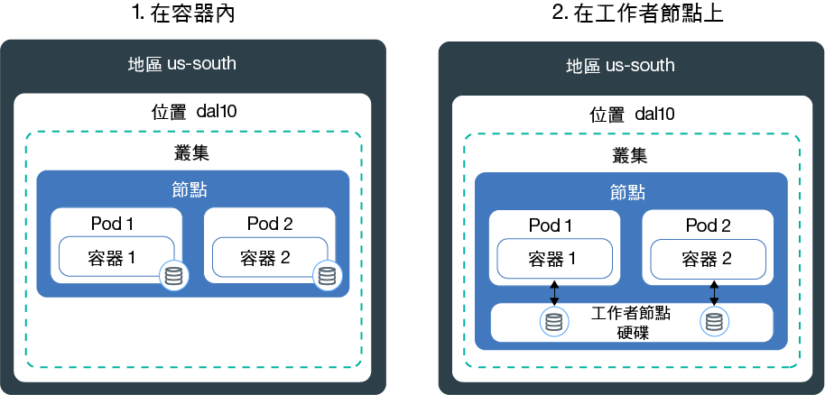
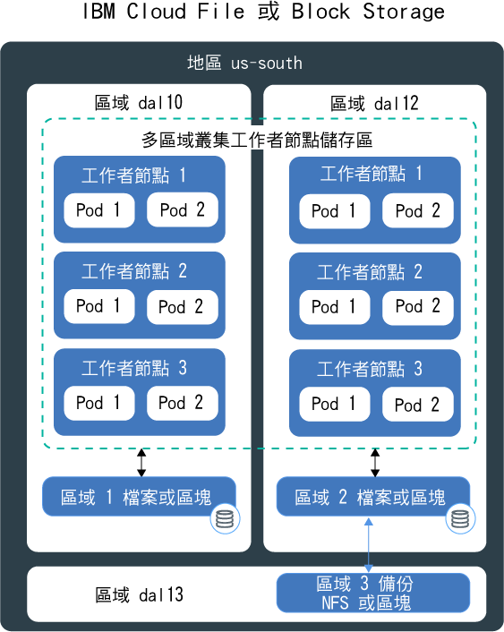
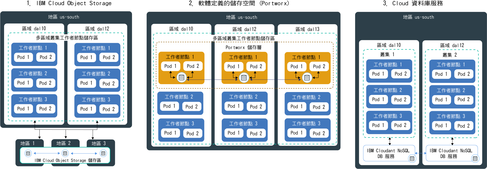

---

copyright:
  years: 2014, 2019
lastupdated: "2019-06-11"

keywords: kubernetes, iks

subcollection: containers

---

{:new_window: target="_blank"}
{:shortdesc: .shortdesc}
{:screen: .screen}
{:pre: .pre}
{:table: .aria-labeledby="caption"}
{:codeblock: .codeblock}
{:tip: .tip}
{:note: .note}
{:important: .important}
{:deprecated: .deprecated}
{:download: .download}
{:preview: .preview}

# 規劃高度可用的持續性儲存空間
{: #storage_planning}

## 選擇儲存空間解決方案
{: #choose_storage_solution}

您必須先瞭解應用程式需求、您要儲存的資料類型，以及您要存取此資料的頻率，才能決定哪種類型的儲存空間是適合您的解決方案。
{: shortdesc}

1. 決定是必須永久儲存資料，還是可以隨時移除資料。
   - **持續性儲存空間：**您的資料仍然必須可用，即使移除容器、工作者節點或叢集也是一樣。在下列情境中，請使用持續性儲存空間：
       - 有狀態的應用程式
       - 核心商業資料
       - 因為法律需求而必須提供的資料（例如定義的保留期間）
       - 審核
       - 必須跨應用程式實例存取及共用的資料
   - **非持續性儲存空間：**移除容器、工作者節點或叢集時，即可移除您的資料。非持續性儲存空間通常用於記載資訊（例如系統日誌或容器日誌）、開發測試，或您要從主機的檔案系統存取資料時。若要尋找可用非持續性儲存空間選項的概觀，請參閱[非持續性儲存空間選項的比較](#non_persistent_overview)。

2. 如果您必須持續保存資料，則請分析應用程式是否需要特定類型的儲存空間。當您使用現有應用程式時，可能設計應用程式以下列其中一種方式儲存資料：  
   - **在檔案系統中：**資料可以儲存為目錄中的檔案。例如，您可以將此檔案儲存至本端硬碟。部分應用程式需要將資料儲存至特定檔案系統（例如 `nfs` 或 `ext4`），以最佳化資料儲存庫並達到效能目標。
   - **在資料庫中：**資料必須儲存至遵循特定綱目的資料庫。部分應用程式附有資料庫介面，供您用來儲存資料。例如，已最佳化 WordPress，以將資料儲存至 MySQL 資料庫。在這些情況下，會為您選取儲存空間類型。

3. 如果您的應用程式未限制您必須使用的儲存空間類型，則請決定您要儲存的資料類型。
   - **結構化資料：**資料可以儲存在具有直欄及列之表格的關聯式資料庫。表格中的資料可以使用索引鍵連接，而且通常基於預先定義的資料模型而容易存取。範例為電話號碼、帳號、社會保險號碼或郵遞區號。
   - **半結構化資料：**資料無法放入關聯式資料庫，但附有一些可用來更輕鬆地讀取及分析此資料的組織內容。範例為標記語言檔案（例如 CSV、XML 或 JSON）。  
   - **非結構化資料：**資料未遵循組織模式，而且複雜到無法將它儲存至具有預先定義資料模型的關聯式資料庫。若要存取此資料，您需要進階工具及軟體。範例為電子郵件訊息、視訊、照片、音訊檔案、簡報、社交媒體資料或網頁。

   如果您有結構化及非結構化資料，請嘗試將每種資料類型個別地儲存至針對此資料類型所設計的儲存空間解決方案。使用適合您資料類型的儲存空間解決方案，可以輕鬆地存取您的資料，並提供效能、可調整性、延續性及一致性的好處。
   {: tip}

4. 分析您要如何存取資料。通常會設計及最佳化儲存空間解決方案，以支援讀取或寫入作業。  
   - **唯讀：**您的資料是唯讀的。您不要寫入或變更資料。
   - **讀取及寫入：**您要讀取、寫入及變更資料。針對已讀取及寫入的資料，請務必瞭解作業是大量讀取、大量寫入還是兩者平衡。

4. 決定您資料的存取頻率。瞭解資料存取頻率可協助您瞭解儲存空間所需的效能。例如，經常存取的資料通常位於快速儲存空間上。
   - **熱資料：**經常存取的資料。常見使用案例是 Web 或行動應用程式。
   - **冷或暖資料：**不常存取的資料（例如一個月一次或更少）常見使用案例是保存檔、短期資料保留或災難回復。
   - **冷資料：**很少存取（或根本未存取）的資料。常見使用案例是保存檔、長期備份、歷程資料。
   - **凍結資料：**未存取且基於法律原因而需要保留的資料。

   如果無法預測頻率，或頻率未遵循嚴格的型樣，請確定工作負載是屬於大量讀取、大量寫入還是兩者平衡。然後，查看適合您工作負載的儲存空間選項，並調查哪個儲存空間層級可為您提供所需的彈性。例如，{{site.data.keyword.cos_full_notm}} 提供了 `flex` 儲存類別，該儲存類別會考慮在一個月內存取資料的頻率，並基於對此度量的考量來最佳化依月計費。
   {: tip}

5. 調查您的資料是否必須跨多個應用程式實例、區域或地區共用。
   - **跨 Pod 存取：**當您使用 Kubernetes 持續性磁區來存取儲存空間時，可以決定可同時裝載磁區的 Pod 數目。部分儲存空間解決方案（例如區塊儲存空間）一次只能有一個 Pod 可以存取。透過其他儲存空間解決方案，可以在多個 Pod 中共用磁區。
   - **跨區域及地區存取：**您可能需要跨區域或地區域存取資料。部分儲存空間解決方案（例如檔案及區塊儲存空間）是資料中心特有的，因此無法跨多區域叢集設定中的區域予以共用。

   如果您要讓資料可跨區域或地區進行存取，請確定洽詢您的法律部門，以驗證您的資料可以儲存在多個區域或不同的國家/地區中。
   {: note}

6. 瞭解影響您選擇的其他儲存空間性質。
   - **一致性：**保證讀取作業傳回檔案的最新版本。當您保證一律會收到檔案的最新版本時，儲存空間解決方案可以提供`強大一致性`，或者，當讀取作業可能未傳回最新版本時，可以提供`最終一致性`。在必須先將寫入作業抄寫到所有實例的地理分散式系統中，您通常會發現最終一致性。
   - **效能：**完成讀取或寫入作業所需的時間。
   - **延續性：**保證確定到儲存空間的寫入作業會永久地存活，而且不會毀損或遺失，即使同時將數 GB 或 TB 的資料寫入至儲存空間也是一樣。
   - **備援：**可以從中斷回復並繼續作業，即使硬體或軟體元件失敗也是一樣。例如，您的實體儲存空間停電、網路中斷，或在天然災害期間毀損。
   - **可用性：**可以存取資料，即使資料中心或地區無法使用也是一樣。透過新增備援以及設定失效接手機制，通常可以達到資料的可用性。
   - **可調整性：**可以根據您的需要來擴充容量以及自訂效能。
   - **加密：**未獲授權的使用者存取資料時，遮罩資料以防止可見性。

7. [檢閱可用的持續性儲存空間解決方案](#persistent_storage_overview)，並挑選最適合您應用程式及資料需求的解決方案。

## 非持續性儲存空間選項的比較
{: #non_persistent_overview}

如果您的資料不需要持續儲存，或要對應用程式元件執行單元測試，您可以使用非持續性儲存空間選項。
{: shortdesc}

下圖顯示 {{site.data.keyword.containerlong_notm}} 中可用的非持續性資料儲存空間選項。這些選項適用於免費叢集和標準叢集。

<table>
<thead>
<th style="text-align:left">特徵</th>
<th style="text-align:left">在容器內</th>
<th style="text-align:left">在工作者節點的主要或次要磁碟上</th>
</thead>
<tbody>
<tr>
<td style="text-align:left">具多區域功能</td>
<td style="text-align:left">否</td>
<td style="text-align:left">否</td>
</tr>
<tr>
<td style="text-align:left">資料類型</td>
<td style="text-align:left">全部</td>
<td style="text-align:left">全部</td>
</tr>
<tr>
<td style="text-align:left">容量</td>
<td style="text-align:left">限制為工作者節點的可用次要磁碟。若要限制 Pod 所使用的次要儲存空間數量，請使用資源要求，並限制[暫時儲存空間 ](https://kubernetes.io/docs/concepts/configuration/manage-compute-resources-container/#local-ephemeral-storage)。</td>
<td style="text-align:left">受限於工作者節點在主要 (`hostPath`) 或次要磁碟 (`emptyDir`) 上的可用空間。若要限制 Pod 所使用的次要儲存空間數量，請使用資源要求，並限制[暫時儲存空間 ](https://kubernetes.io/docs/concepts/configuration/manage-compute-resources-container/#local-ephemeral-storage)。</td>
</tr>
<tr>
<td style="text-align:left">資料存取模式</td>
<td style="text-align:left">任何頻率的讀取及寫入作業</td>
<td style="text-align:left">任何頻率的讀取及寫入作業</td>
</tr>
<tr>
<td style="text-align:left">存取</td>
<td style="text-align:left">透過容器的本端檔案系統</td>
<td style="text-align:left"><ul style="margin:0px 0px 0px 20px; padding:0px"><li style="margin:0px; padding:0px">透過 [Kubernetes <code>hostPath</code> 磁區 ](https://kubernetes.io/docs/concepts/storage/volumes/#hostpath) 來存取工作者節點主要儲存空間。</li><li style="margin:0px; padding:0px">透過 [Kubernetes <code>emptyDir</code> 磁區 ](https://kubernetes.io/docs/concepts/storage/volumes/#emptydir) 來存取工作者節點次要儲存空間。</li></ul></td>
</tr>
<tr>
<td style="text-align:left">效能</td>
<td style="text-align:left">高</td>
<td style="text-align:left">使用 SSD 時，為具有低延遲的高效能</td>
</tr>
<tr>
<td style="text-align:left">一致性</td>
<td style="text-align:left">強大</td>
<td style="text-align:left">強大</td>
</tr>
<tr>
<td style="text-align:left">備援</td>
<td style="text-align:left">低</td>
<td style="text-align:left">低</td>
</tr>
<tr>
<td style="text-align:left">可用性</td>
<td style="text-align:left">容器特有</td>
<td style="text-align:left">工作者節點特有</td>
</tr>
<tr>
<td style="text-align:left">可調整性</td>
<td style="text-align:left">受限於工作者節點的次要磁碟容量，因此很難擴充</td>
<td style="text-align:left">受限於工作者節點的主要及次要磁碟容量，因此很難擴充</td>
</tr>
<tr>
<td style="text-align:left">延續性</td>
<td style="text-align:left">容器損毀或遭移除時，會遺失資料。</td>
<td style="text-align:left">在下列情況下，會遺失 <code>hostPath</code> 或 <code>emptyDir</code> 磁區中的資料：<ul><li>已刪除工作者節點。</li><li>已重新載入或更新工作者節點。</li><li>已刪除叢集。</li><li>{{site.data.keyword.Bluemix_notm}} 帳戶達到暫停狀況。</li></ul>

此外，在下列情況下，會移除 <code>emptyDir</code> 磁區中的資料：<ul><li>已從工作者節點中永久地刪除指派的 Pod。</li><li>已在另一個工作者節點上排定指派的 Pod。</li></ul>
</tr>
<tr>
<td style="text-align:left">常見使用案例</td>
<td style="text-align:left"><ul style="margin:0px 0px 0px 20px; padding:0px"><li style="margin:0px; padding:0px">本端影像快取</li><li style="margin:0px; padding:0px">容器日誌</li></ul></td>
<td style="text-align:left"><ul style="margin:0px 0px 0px 20px; padding:0px"><li style="margin:0px; padding:0px">高性能本端快取</li><li style="margin:0px; padding:0px">從工作者節點檔案系統存取檔案</li><li style="margin:0px; padding:0px">單元測試</li></ul></td>
</tr>
<tr>
<td style="text-align:left">非理想使用案例</td>
<td style="text-align:left"><ul style="margin:0px 0px 0px 20px; padding:0px"><li style="margin:0px; padding:0px">持續資料儲存空間</li><li style="margin:0px; padding:0px">在容器之間共用資料</li></ul></td>
<td style="text-align:left"><ul style="margin:0px 0px 0px 20px; padding:0px"><li style="margin:0px; padding:0px">持續資料儲存空間</li></ul></td>
</tr>
</tbody>
</table>

## 單一區域叢集的持續性儲存空間選項的比較
{: #single_zone_persistent_storage}

如果您具有單一區域叢集，則可以在 {{site.data.keyword.containerlong_notm}} 中提供快速資料存取的下列選項之間進行選擇。若要達到更高的可用性，請使用針對[地理分散式資料](#persistent_storage_overview)所設計的儲存空間選項，而且，可能的話，請針對您的需求建立多區域叢集。
{: shortdesc}

持續資料儲存空間選項僅適用於標準叢集。
{: note}

下圖顯示您在 {{site.data.keyword.containerlong_notm}} 中具有的選項，以永久地將資料儲存在單一叢集裡。

<table>
<thead>
<th style="text-align:left">特徵</th>
<th style="text-align:left">檔案</th>
<th style="text-align:left">區塊</th>
</thead>
<tbody>
<tr>
<td style="text-align:left">具多區域功能</td>
<td style="text-align:left">否，資料中心特有的。除非您實作自己的資料抄寫，否則無法跨區域共用資料。</td>
<td style="text-align:left">否，資料中心特有的。除非您實作自己的資料抄寫，否則無法跨區域共用資料。</td>
</tr>
<tr>
<td style="text-align:left">理想資料類型</td>
<td style="text-align:left">全部</td>
<td style="text-align:left">全部</td>
</tr>
<tr>
<td style="text-align:left">資料使用模式</td>
<td style="text-align:left"><ul style="margin:0px 0px 0px 20px; padding:0px"><li style="margin:0px; padding:0px">隨機讀寫作業</li><li style="margin:0px; padding:0px">循序讀寫作業</li></ul></td>
<td style="text-align:left"><ul style="margin:0px 0px 0px 20px; padding:0px"><li style="margin:0px; padding:0px">隨機讀寫作業</li><li style="margin:0px; padding:0px">寫入密集工作負載</li></ul></td>
</tr>
<tr>
<td style="text-align:left">存取</td>
<td style="text-align:left">透過裝載磁區上的檔案系統</td>
<td style="text-align:left">透過裝載磁區上的檔案系統</td>
</tr>
<tr>
<td style="text-align:left">支援的 Kubernetes 存取寫入</td>
<td style="text-align:left"><ul style="margin:0px 0px 0px 20px; padding:0px"><li style="margin:0px; padding:0px">ReadWriteMany (RWX)</li><li style="margin:0px; padding:0px"> ReadOnlyMany (ROX)</li><li style="margin:0px; padding:0px">ReadWriteOnce (RWO)</li></ul></td>
<td style="text-align:left"><ul style="margin:0px 0px 0px 20px; padding:0px"><li style="margin:0px; padding:0px">ReadWriteOnce (RWO)</li></ul></td>
</tr>
<tr>
<td style="text-align:left">效能</td>
<td style="text-align:left">由於已指派的 IOPS 及大小而可預測。在存取磁區的 Pod 之間共用 IOPS。</td>
<td style="text-align:left">由於已指派的 IOPS 及大小而可預測。在 Pod 之間不共用 IOPS。</td>
</tr>
<tr>
<td style="text-align:left">一致性</td>
<td style="text-align:left">強大</td>
<td style="text-align:left">強大</td>
</tr>
<tr>
<td style="text-align:left">延續性</td>
<td style="text-align:left">高</td>
<td style="text-align:left">高</td>
</tr>
<tr>
<td style="text-align:left">備援</td>
<td style="text-align:left">中，資料中心特有的。IBM 利用備援網路來叢集處理檔案儲存空間伺服器。</td>
<td style="text-align:left">中，資料中心特有的。IBM 利用備援網路來叢集處理區塊儲存空間伺服器。</td>
</tr>
<tr>
<td style="text-align:left">可用性</td>
<td style="text-align:left">中，資料中心特有的。</td>
<td style="text-align:left">中，資料中心特有的。</td>
</tr>
<tr>
<td style="text-align:left">可調整性</td>
<td style="text-align:left">很難擴充到資料中心外部。您無法變更現有的儲存空間層級。</td>
<td style="text-align:left">很難擴充到資料中心外部。您無法變更現有的儲存空間層級。</td>
</tr>
<tr>
<td style="text-align:left">加密</td>
<td style="text-align:left">靜止</td>
<td style="text-align:left">靜止</td>
</tr>
<tr>
<td style="text-align:left">常見使用案例</td>
<td style="text-align:left"><ul style="margin:0px 0px 0px 20px; padding:0px"><li style="margin:0px; padding:0px">大量或單一檔案儲存空間</li><li style="margin:0px; padding:0px">跨單一區域叢集的檔案共用</li></ul></td>
<td style="text-align:left"><ul style="margin:0px 0px 0px 20px; padding:0px"><li style="margin:0px; padding:0px">有狀態的集</li><li style="margin:0px; padding:0px">當您執行自己的資料庫時的後端儲存空間</li><li style="margin:0px; padding:0px">單一 Pod 的高效能存取</li></ul></td>
</tr>
<tr>
<td style="text-align:left">非理想使用案例</td>
<td style="text-align:left"><ul style="margin:0px 0px 0px 20px; padding:0px"><li style="margin:0px; padding:0px">多區域叢集</li><li style="margin:0px; padding:0px">地理分散式資料</li></ul></td>
<td style="text-align:left"><ul style="margin:0px 0px 0px 20px; padding:0px"><li style="margin:0px; padding:0px">多區域叢集</li><li style="margin:0px; padding:0px">地理分散式資料</li><li style="margin:0px; padding:0px">跨多個應用程式實例共用資料</li></ul></td>
</tr>
</tbody>
</table>

## 多區域叢集的持續性儲存空間選項比較
{: #persistent_storage_overview}

如果您有多區域叢集，請在下列持續性儲存空間選項之間進行選擇，以存取分散於各區域之工作者節點中的資料。
{: shortdesc}

持續資料儲存空間選項僅適用於標準叢集。

在尋找如何將叢集連接至內部部署資料庫嗎？請參閱[設定與叢集的 VPN 連線功能](/docs/containers?topic=containers-vpn#vpn)。
{: tip}

下圖顯示您在 {{site.data.keyword.containerlong_notm}} 中具有的選項，以便將資料永久儲存在多區域叢集裡，並讓資料高度可用。您可以在單一區域叢集裡使用這些選項，但可能無法獲得應用程式所需的高可用性優點。

<table>
<thead>
<th style="text-align:left">特徵</th>
<th style="text-align:left">物件</th>
<th style="text-align:left">SDS (Portworx)</th>
<th style="text-align:left">{{site.data.keyword.Bluemix_notm}} 資料庫</th>
</thead>
<tbody>
<tr>
<td style="text-align:left">具多區域功能</td>
<td style="text-align:left">是</td>
<td style="text-align:left">是</td>
<td style="text-align:left">是</td>
</tr>
<tr>
<td style="text-align:left">理想資料類型</td>
<td style="text-align:left">半結構化及非結構化資料</td>
<td style="text-align:left">全部</td>
<td style="text-align:left">與 DBaaS 相依</td>
</tr>
<tr>
<td style="text-align:left">資料使用模式</td>
<td style="text-align:left"><ul style="margin:0px 0px 0px 20px; padding:0px"><li style="margin:0px; padding:0px">讀取密集工作負載</li><li style="margin:0px; padding:0px">少數或沒有寫入作業</li></ul></td>
<td style="text-align:left"><ul style="margin:0px 0px 0px 20px; padding:0px"><li style="margin:0px; padding:0px">寫入密集工作負載</li><li style="margin:0px; padding:0px">隨機讀取及寫入作業</li><li style="margin:0px; padding:0px">循序讀取及寫入作業</li></ul></td>
<td style="text-align:left"><ul style="margin:0px 0px 0px 20px; padding:0px"><li style="margin:0px; padding:0px">讀寫密集工作負載</li></ul></td>
</tr>
<tr>
<td style="text-align:left">存取</td>
<td style="text-align:left">透過裝載磁區上的檔案系統（外掛程式）或透過應用程式中的 REST API</td>
<td style="text-align:left">透過裝載磁區上的檔案系統，或 NFS 用戶端對磁區的存取權</td>
<td style="text-align:left">透過應用程式中的 REST API</td>
</tr>
<tr>
<td style="text-align:left">支援的 Kubernetes 存取寫入</td>
<td style="text-align:left"><ul style="margin:0px 0px 0px 20px; padding:0px"><li style="margin:0px; padding:0px">ReadWriteMany (RWX)</li><li style="margin:0px; padding:0px"> ReadOnlyMany (ROX)</li><li style="margin:0px; padding:0px">ReadWriteOnce (RWO)</li></ul></td>
<td style="text-align:left">全部</td>
<td style="text-align:left"><ul style="margin:0px 0px 0px 20px; padding:0px"><li style="margin:0px; padding:0px">直接從應用程式存取時為 N/A</li></ul></td>
</tr>
<tr>
<td style="text-align:left">效能</td>
<td style="text-align:left">針對讀取作業為高。使用非 SDS 機器時，由於已指派的 IOPS 和大小而可預測。</td>
<td style="text-align:left"><ul style="margin:0px 0px 0px 20px; padding:0px"><li style="margin:0px; padding:0px">使用 SDS 機器時，針對循序讀取及寫入作業具有接近裸機的效能。</li><li style="margin:0px; padding:0px">提供[設定檔 ](https://docs.portworx.com/portworx-install-with-kubernetes/storage-operations/create-pvcs/dynamic-provisioning/#using-dynamic-provisioning) 來執行高性能資料庫</li><li style="margin:0px; padding:0px">可以使用應用程式可從中選擇的不同效能設定檔來建立儲存空間層。</li></ul> </td>
<td style="text-align:left">如果已部署到與應用程式相同的資料中心，則為高。</td>
</tr>
<tr>
<td style="text-align:left">一致性</td>
<td style="text-align:left">最終</td>
<td style="text-align:left">強大</td>
<td style="text-align:left">與 DBaaS 相依</td>
</tr>
<tr>
<td style="text-align:left">延續性</td>
<td style="text-align:left">資料截塊分散到儲存空間節點叢集時為極高。每個節點只會儲存一部分資料。</td>
<td style="text-align:left">隨時維護資料的三個副本時為極高。</td>
<td style="text-align:left">高</td>
</tr>
<tr>
<td style="text-align:left">備援</td>
<td style="text-align:left">資料截塊分散在三個區域或地區時為高。只在單一區域中設定時為中等。</td>
<td style="text-align:left">設定跨三個區域的抄寫時為高。只在單一區域中儲存資料時為中等。</td>
<td style="text-align:left">與 DBaaS 及您的設定相依。</td>
</tr>
<tr>
<td style="text-align:left">可用性</td>
<td style="text-align:left">由於分散到區域或地區而為高。</td>
<td style="text-align:left">在跨不同區域的三個工作者節點中抄寫資料時，可用性高。</td>
<td style="text-align:left">如果您設定多個實例，則為高。</td>
</tr>
<tr>
<td style="text-align:left">可調整性</td>
<td style="text-align:left">自動調整</td>
<td style="text-align:left">重新調整磁區的大小，以增加磁區容量。若要增加整體儲存空間層容量，您必須新增工作者節點或遠端區塊儲存空間。兩個情境都需要使用者監視容量。</td>
<td style="text-align:left">自動調整</td>
</tr>
<tr>
<td style="text-align:left">加密</td>
<td style="text-align:left">傳輸中且靜止</td>
<td style="text-align:left">自帶金鑰，以使用 {{site.data.keyword.keymanagementservicelong_notm}} 保護傳輸中及靜態資料。</td>
<td style="text-align:left">靜止</td>
</tr>
<tr>
<td style="text-align:left">常見使用案例</td>
<td style="text-align:left"><ul style="margin:0px 0px 0px 20px; padding:0px"><li style="margin:0px; padding:0px">多區域叢集</li><li style="margin:0px; padding:0px">地理分散式資料</li><li style="margin:0px; padding:0px">靜態海量資料</li><li style="margin:0px; padding:0px">靜態多媒體內容</li><li style="margin:0px; padding:0px">Web 應用程式</li><li style="margin:0px; padding:0px">備份</li><li style="margin:0px; padding:0px">保存檔</li></ul></td>
<td style="text-align:left"><ul style="margin:0px 0px 0px 20px; padding:0px"><li style="margin:0px; padding:0px">有狀態的集</li><li style="margin:0px; padding:0px">地理分散式資料</li><li style="margin:0px; padding:0px">跨多個雲端提供者執行應用程式時的常用儲存空間解決方案</li><li style="margin:0px; padding:0px">當您執行自己的資料庫時的後端儲存空間</li><li style="margin:0px; padding:0px">單一 Pod 的高效能存取</li><li style="margin:0px; padding:0px">跨多個 Pod 和工作者節點共用儲存空間存取權</li></ul></td>
<td style="text-align:left"><ul style="margin:0px 0px 0px 20px; padding:0px"><li style="margin:0px; padding:0px">多區域叢集</li><li style="margin:0px; padding:0px">關聯式及非關聯式資料庫</li><li style="margin:0px; padding:0px">地理分散式資料</li></ul></td>
</tr>
<tr>
<td style="text-align:left">非理想使用案例</td>
<td style="text-align:left"><ul style="margin:0px 0px 0px 20px; padding:0px"><li style="margin:0px; padding:0px">寫入密集工作負載</li><li style="margin:0px; padding:0px">隨機寫入作業</li><li style="margin:0px; padding:0px">漸進式資料更新</li><li style="margin:0px; padding:0px">交易資料庫</li></ul></td>
<td style="text-align:left">N/A</td>
<td style="text-align:left"><ul style="margin:0px 0px 0px 20px; padding:0px"><li style="margin:0px; padding:0px">設計用來寫入檔案系統的應用程式</li></ul></td>
</tr>
</tbody>
</table>
