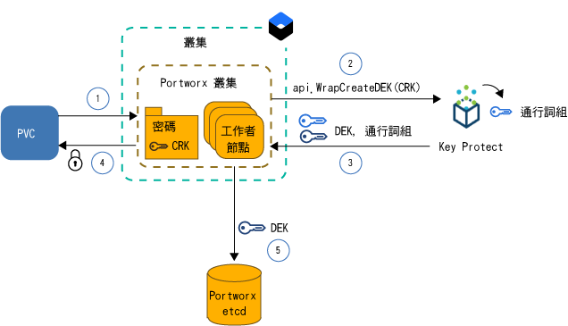
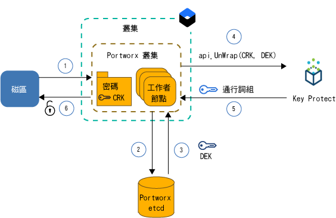

---

copyright:
  years: 2014, 2019
lastupdated: "2019-05-31"

keywords: kubernetes, iks, local persistent storage

subcollection: containers

---

{:new_window: target="_blank"}
{:shortdesc: .shortdesc}
{:screen: .screen}
{:pre: .pre}
{:table: .aria-labeledby="caption"}
{:codeblock: .codeblock}
{:tip: .tip}
{:note: .note}
{:important: .important}
{:deprecated: .deprecated}
{:download: .download}
{:preview: .preview}


# 使用 Portworx 將資料儲存在軟體定義儲存空間 (SDS)
{: #portworx}

[Portworx ](https://portworx.com/products/introduction/) 是一個高可用性軟體定義儲存空間解決方案，可用來管理容器化資料庫及其他有狀態應用程式的本端持續性儲存空間，或在多個區域的 Pod 之間共用資料。
{: shortdesc}

**何謂軟體定義儲存空間 (SDS)？** </br> SDS 解決方案會將各種類型、大小或不同供應商的儲存裝置抽象化，這些裝置連接至您叢集裡的工作者節點。硬碟上具有可用儲存空間的工作者節點會被當成節點新增至儲存空間叢集。在此叢集裡，已虛擬化實體儲存空間，並當成虛擬儲存區呈現給使用者。儲存空間叢集由 SDS 軟體所管理。如果資料必須儲存在儲存空間叢集，則 SDS 軟體會決定資料的儲存位置，以取得最高可用性。虛擬儲存空間隨附一組共同的功能和服務，讓您可以在不需考慮實際基礎儲存空間架構的情況下加以運用。

**Portworx 如何運作？** </br> Portworx 會聚集用於連接至工作者節點的可用儲存空間，並為您要在叢集裡執行的容器化資料庫或其他有狀態應用程式建立統一的持續性儲存空間層。透過跨多個工作者節點使用每個容器層次磁區的磁區抄寫，Portworx 可確保跨區域的資料持續性及資料可存取性。

Portworx 也隨附可用於有狀態應用程式的其他特性（例如，磁區 Snapshot、磁區加密、隔離及整合式 Storage Orchestrator for Kubernetes (Stork)），以確定叢集裡磁區的最佳位置。如需相關資訊，請參閱 [Portworx 文件 ](https://docs.portworx.com/)。

**{{site.data.keyword.containerlong_notm}} 中的哪個工作者節點特性適用於 Portworx？** </br>
{{site.data.keyword.containerlong_notm}} 提供裸機工作者節點特性，這些特性已針對[軟體定義儲存空間 (SDS) 用法](/docs/containers?topic=containers-planning_worker_nodes#sds)最佳化，並且隨附一個以上可用於 Portworx 儲存空間層的原始、未格式化及未裝載的本端磁碟。當您使用隨附 10Gbps 網路速度的 SDS 工作者節點機器時，Portworx 會提供最佳效能。

**如果我要在非 SDS 工作者節點上執行 Portworx，該怎麼辨？** </br> 您可以在非 SDS 工作者節點特性上安裝 Portworx，但可能無法獲得應用程式所需的效能優點。非 SDS 工作者節點可以是虛擬或裸機的。如果您要使用虛擬機器，請使用 `b2c.16x64` 或以上的工作者節點特性。特性為 `b3c.4x16` 或 `u3c.2x4` 的虛擬機器未提供讓 Portworx 正常運作的必要資源。請記住，虛擬機器隨附 1000Mbps，這對於獲得最佳 Portworx 效能而言是不足的。裸機機器隨附 Portworx 的足夠運算資源及網路速度，但是您必須先[新增原始、未格式化及未裝載的區塊儲存空間](#create_block_storage)，才能使用這些機器。

**如何確定以高可用性方式儲存資料？** </br> 您的 Portworx 叢集裡至少需要 3 個工作者節點，Portworx 才可以跨節點抄寫您的資料。透過跨工作者節點抄寫資料，Portworx 能夠確保可將您的有狀態應用程式重新排定為不同的工作者節點，以在失敗時不遺失資料。若要獲得更高的可用性，請使用[多區域叢集](/docs/containers?topic=containers-ha_clusters#multizone)，並且抄寫跨 3 個以上區域的 SDS 工作者節點的磁區。

**哪個磁區拓蹼提供 Pod 的最佳效能？** </br> 在叢集裡執行有狀態應用程式時，最大的挑戰之一是，在容器或整個主機失敗時，確定您的容器可以重新排定至另一個主機。在 Docker 中，必須將容器重新排定至不同的主機時，不會將磁區移至新的主機。Portworx 可以配置成執行 `hyper-converged`，以確保您的運算資源和儲存空間一律放置在相同的工作者節點上。必須重新排定應用程式時，Portworx 會將您的應用程式移至其中一個磁區抄本所在的工作者節點，以確保有狀態應用程式的本端磁碟存取速度和最佳效能。執行 `hyper-converged` 可提供 Pod 的最佳效能，但需要叢集的所有工作者節點上都可以使用儲存空間。

您也可以選擇只將工作者節點的一部分用於 Portworx 儲存空間層。例如，您的工作者節點儲存區可能具有隨附本端原始區塊儲存空間的 SDS 工作者節點，以及另一個工作者節點儲存區可能具有未隨附本端儲存空間的虛擬工作者節點。安裝 Portworx 時，會將 Portworx Pod 排定到叢集裡的每個工作者節點，成為常駐程式集的一部分。因為 SDS 工作者節點具有本端儲存空間，所以這些工作者節點都只會包含在 Portworx 儲存空間層。因為遺漏本端儲存空間，所以您的虛擬工作者節點未包含為儲存空間節點。不過，當您將應用程式 Pod 部署至虛擬工作者節點時，此 Pod 仍然可以使用 Portworx 常駐程式集 Pod 來存取實際儲存在 SDS 工作者節點上的資料。此設定稱為 `storage-heavy`，而且提供的效能比 `hyper-converged` 設定略慢，因為虛擬工作者節點必須透過專用網路與 SDS 工作者節點交談，才能存取資料。

**佈建 Portworx 時需要什麼？** </br> {{site.data.keyword.containerlong}} 提供工作者節點特性，這些特性已針對 SDS 用法最佳化，並且隨附一個以上可用來儲存資料的原始、未格式化及未裝載的本端磁碟。當您使用隨附 10Gbps 網路速度的 [SDS 工作者節點機器](/docs/containers?topic=containers-planning_worker_nodes#sds)時，Portworx 會提供最佳效能。不過，您可以在非 SDS 工作者節點特性上安裝 Portworx，但可能無法獲得應用程式所需的效能優點。要順利執行 Portworx 的最低工作者節點需求包括：
- 4 顆 CPU 核心
- 4GB 記憶體
- 128GB 的原始未格式化儲存空間
- 10Gbps 網路速度

**必須規劃的限制為何？** </br> Portworx 適用於已設定公用網路連線功能的標準叢集。如果叢集無法存取公用網路（例如受防火牆保護的專用叢集，或只啟用專用服務端點的叢集），則除非您在 TCP 埠 443 上開啟所有 Egress 網路資料流量，或啟用公用服務端點，否則無法在叢集裡使用 Portworx。


準備好了嗎？讓我們從[建立具有至少 3 個工作者節點的 SDS 工作者節點儲存區的叢集](/docs/containers?topic=containers-clusters#clusters_ui)開始。如果您要將非 SDS 工作者節點包含在 Portworx 叢集，請[新增原始區塊儲存空間](#create_block_storage)至每個工作者節點。備妥叢集之後，請在叢集裡[安裝 Portworx Helm 圖表](#install_portworx)，並建立第一個 hyper-converged 儲存空間叢集。  

## 針對非 SDS 工作者節點建立原始、未格式化及未裝載的區塊儲存空間
{: #create_block_storage}

當您使用已針對[軟體定義儲存空間 (SDS) 用法](/docs/containers?topic=containers-planning_worker_nodes#sds)最佳化的工作者節點特性時，Portworx 的執行效果最佳。不過，如果您無法或不要使用 SDS 工作者節點，則可以選擇在非 SDS 工作者節點特性上安裝 Portworx。請牢記，非 SDS 工作者節點不會針對 Portworx 進行最佳化，而且可能未提供應用程式所需的效能優點。
{: shortdesc}

若要將非 SDS 工作者節點包含在 Portworx 叢集，您必須使用 {{site.data.keyword.Bluemix_notm}} Block Volume Attacher 外掛程式將原始、未格式化及未裝載的區塊儲存裝置新增至工作者節點。無法使用 Kubernetes 持續性磁區要求 (PVC) 來佈建原始區塊儲存空間，因為 {{site.data.keyword.containerlong_notm}} 會自動格式化區塊儲存裝置。Portworx 僅支援區塊儲存空間。裝載檔案或物件儲存空間的非 SDS 工作者節點無法用於 Portworx 資料層。

如果您的叢集裡有 SDS 工作者節點特性，而且只要使用這些工作者節點來建立 Portworx 儲存空間層，則可以完全跳過此步驟，並繼續[設定 Portworx 資料庫](#portworx_database)。
{: note}

1. [安裝 {{site.data.keyword.Bluemix_notm}} Block Volume Attacher 外掛程式](/docs/containers?topic=containers-utilities#block_storage_attacher)。
2. 如果您要將具有相同配置的區塊儲存空間新增至所有工作者節點，請使用 {{site.data.keyword.Bluemix_notm}} Block Volume Attacher 外掛程式來[自動新增區塊儲存空間](/docs/containers?topic=containers-utilities#automatic_block)。若要新增具有不同配置的區塊儲存空間、只將區塊儲存空間新增至部分工作者節點，或擁有更多的佈建處理程序控制權，[請手動新增區塊儲存空間](/docs/containers?topic=containers-utilities#manual_block)。
3. [將區塊儲存空間連接](/docs/containers?topic=containers-utilities#attach_block)至工作者節點。

## 取得 Portworx 授權
{: #portworx_license}

當您[使用 Helm 圖表安裝 Portworx](#install_portworx) 時，您將獲得 Portworx `px-enterprise` 版本作為試用版。試用版為您提供完整的 Portworx 功能，您可以測試 30 天。試用版到期之後，您必須購買 Portworx 授權，才能繼續使用 Portworx 叢集。
{: shortdesc}

如需可用授權類型以及如何升級試用授權的相關資訊，請參閱 [Portworx 授權 ](https://docs.portworx.com/reference/knowledge-base/px-licensing/)。IBM 員工必須遵循[此處理程序](https://github.ibm.com/alchemy-containers/armada-storage/blob/master/portworx/px-license.md)來訂購 Portworx 授權。

## 設定 Portworx meta 資料的資料庫
{: #portworx_database}

設定 {{site.data.keyword.Bluemix_notm}} 資料庫服務（例如 [Databases for etcd](#databaseetcd) 或 [{{site.data.keyword.composeForEtcd}}](#compose)），以建立 Portworx 叢集 meta 資料的金鑰值儲存庫。
{: shortdesc}

Portworx 金鑰值儲存庫作為 Portworx 叢集的單一事實來源。如果無法使用金鑰值儲存庫，則無法使用 Portworx 叢集來存取或儲存資料。Portworx 資料庫無法使用時，不會變更或移除現有資料。

### 設定 Databases for etcd 服務實例
{: #databaseetcd}

Databases for etcd 是一種受管理的 etcd 服務，可跨三個儲存空間實例安全地儲存及抄寫資料，以提供資料的高可用性和備援。如需相關資訊，請參閱 [Databases for etcd 入門指導教學](/docs/services/databases-for-etcd?topic=databases-for-etcd-getting-started#getting-started)。

下列步驟顯示如何佈建及設定 Portworx 的 Databases for etcd 服務實例。

1. 確定您具有適用於 Databases for etcd 服務之 [{{site.data.keyword.Bluemix_notm}} Identity and Access Management (IAM) 的 `Administrator` 平台存取角色](/docs/iam?topic=iam-iammanidaccser#iammanidaccser)。  

2. 佈建 Databases for etcd 服務實例。
   1. 開啟 [Databases for etcd 型錄頁面](https://cloud.ibm.com/catalog/services/databases-for-etcd)
   2. 輸入服務實例的名稱（例如 `px-etcd`）。
   3. 選取您要部署服務實例的地區。若要達到最佳效能，請選擇您叢集所在的地區。
   4. 選取您叢集所在的相同資源群組。
   5. 使用起始記憶體及磁碟配置的預設值。
   6. 選擇您要使用預設 {{site.data.keyword.keymanagementserviceshort}} 服務實例還是您自己的實例。
   5. 檢閱定價方案。
   6. 按一下**建立**，開始設定服務實例。此設定可能需要幾分鐘的時間才能完成。
3. 建立 Databases for etcd 服務實例的服務認證。
   1. 在「服務詳細資料」頁面的導覽中，按一下**服務認證**。
   2. 按一下**新建認證**。
   3. 輸入服務認證的名稱，然後按一下**新增**。
4. {: #databases_credentials}擷取服務認證和憑證。
   1. 從「服務認證」表格的**動作**直欄中，按一下**檢視認證**。
   2. 尋找服務認證的 `grp.authentication` 區段，並記下 **`username`** 和 **`password`**。使用者名稱和密碼的輸出範例：
      ```
      "grpc": {
      "authentication": {
        "method": "direct",
        "password": "123a4567ab89cde09876vaa543a2bc2a10a123456bcd123456f0a7895aab1de",
        "username": "ibm_cloud_1abd2e3f_g12h_3bc4_1234_5a6bc7890ab"
      }
      ```
      {: screen}
   3. 尋找服務認證的 `composed` 區段，並記下 etcd **`--endpoints`**。  
      `--endpoints` 的輸出範例：
      ```
      --endpoints=https://1ab234c5-12a1-1234-a123-123abc45cde1.123456ab78cd9ab1234a456740ab123c.databases.appdomain.cloud:32059
      ```
      {: screen}

   4. 尋找服務認證的 `certificate` 區段，並記下 **`certificate_base64`**。
      `certificate` 的輸出範例
      ```
      "certificate": {
        "certificate_base64": "AB0cAB1CDEaABcCEFABCDEF1ACB3ABCD1ab2AB0cAB1CDEaABcCEFABCDEF1ACB3ABCD1ab2AB0cAB1CDEaABcCEFABCDEF1ACB3ABCD1ab2..."
      ```
      {: screen}

5. 建立憑證的 Kubernetes 密碼。
   1. 建立密碼的配置檔。
      ```
      apiVersion: v1
      kind: Secret
      metadata:
        name: px-etcd-certs
        namespace: kube-system
      type: Opaque
      data:
        ca.pem: <certificate_base64>
        client-key.pem: ""
        client.pem: ""
      ```
      {: codeblock}

   2. 在叢集裡建立密碼。
      ```
      kubectl apply -f secret.yaml
      ```

6. [在叢集裡安裝 Portworx](#install_portworx)。


### 設定 Compose for etcd 服務實例
{: #compose}

{{site.data.keyword.composeForEtcd}} 隨附一個選項，可將您的資料庫設定為雲端儲存空間叢集的一部分，以在區域失敗時提供高可用性和備援。如需相關資訊，請參閱 {{site.data.keyword.composeForEtcd}} [入門指導教學](/docs/services/ComposeForEtcd?topic=compose-for-etcd-getting-started-tutorial#getting-started-tutorial)。
{: shortdesc}

下列步驟顯示如何佈建及設定 Portworx 的 {{site.data.keyword.composeForEtcd}} 資料庫服務。

1. 確定您具有要在其中建立 {{site.data.keyword.composeForEtcd}} 資料庫服務之[空間的 `Developer` Cloud Foundry 角色](/docs/iam?topic=iam-mngcf#mngcf)。

2. 佈建 {{site.data.keyword.composeForEtcd}} 服務實例。
   1. 開啟 [{{site.data.keyword.composeForEtcd}} 型錄頁面](https://cloud.ibm.com/catalog/services/compose-for-etcd)
   2. 輸入服務實例的名稱（例如 `px-etcd`）。
   3. 選取您要部署服務實例的地區。若要達到最佳效能，請選擇您叢集所在的地區。
   4. 選取 Cloud Foundry 組織和空間。
   5. 檢閱定價方案，然後選取您要的定價方案。
   6. 按一下**建立**，開始設定服務實例。設定完成時，即會開啟「服務詳細資料」頁面。
3. {: #etcd_credentials}擷取 {{site.data.keyword.composeForEtcd}} 服務認證。
   1. 在「服務詳細資料」頁面的導覽中，按一下**管理**。
   2. 移至**概觀**標籤。
   3. 在**連線字串**區段中，選取**指令行**。
   4. 記下 `--endpoints` 和 `--user` 參數的值。
      `--endpoints` 的輸出範例：
      ```
      --endpoints=https://portal-ssl123-34.bmix-dal-yp-12a23b5c-123a-12ab-a1b2-1a2bc3d34567.1234567890.composedb.com:12345,https://portal-ssl123-35.bmix-dal-yp-12a23b5c-123a-12ab-a1b2-1a2bc3d34567.1234567890.composedb.com:12345
      ```
      {: screen}

      `--user` 的輸出範例：
      ```
      --user=root:ABCDEFGHIJKLMNOP
      ```
      {: screen}
   5. 當您[在叢集裡安裝 Portworx](#install_portworx) 時，請使用這些服務認證。


## 在叢集裡安裝 Portworx
{: #install_portworx}

使用 Helm 圖表來安裝 Portworx。Helm 圖表會部署 Portworx 企業版 `px-enterprise` 的試用版本，您可以使用 30 天。此外，也會將 [Stork ](https://docs.portworx.com/portworx-install-with-kubernetes/storage-operations/stork/) 安裝在 Kubernetes 叢集上。Stork 是 Portworx 儲存空間排程器，容許您共同放置 Pod 及其資料，以及建立與還原 Portworx 磁區的 Snapshot。
{: shortdesc}

尋找如何更新或移除 Portworx 的指示？請參閱[更新 Portworx](#update_portworx) 和[移除 Portworx](#remove_portworx)。
{: tip}

開始之前：
- [建立或使用現有叢集](/docs/containers?topic=containers-clusters#clusters_ui)。
- 如果您要對 Portworx 儲存空間層使用非 SDS 工作者節點，則會[將未格式化的區塊儲存裝置新增至非 SDS 工作者節點](#create_block_storage)。
- 建立 [{{site.data.keyword.composeForEtcd}} 服務實例](#portworx_database)，以儲存 Portworx 配置和 meta 資料。
- 決定是否要使用 {{site.data.keyword.keymanagementservicelong_notm}} 來加密 Portworx 磁區。若要加密磁區，您必須[使用 Kubernetes 密碼來設定 {{site.data.keyword.keymanagementservicelong_notm}} 服務實例並儲存服務資訊](#encrypt_volumes)。
- [登入您的帳戶。適用的話，請將適當的資源群組設為目標。設定叢集的環境定義。](/docs/containers?topic=containers-cs_cli_install#cs_cli_configure)

若要安裝 Portworx，請執行下列動作：

1.  [遵循指示](/docs/containers?topic=containers-helm#public_helm_install)，將 Helm 用戶端安裝在本端機器上，並在叢集裡使用服務帳戶安裝 Helm 伺服器 (Tiller)。

2.  驗證已使用服務帳戶安裝 Tiller。

    ```
    kubectl get serviceaccount -n kube-system tiller
    ```
    {: pre}

    輸出範例：

    ```
    NAME                                 SECRETS   AGE
    tiller                               1         2m
    ```
    {: screen}

3. 擷取您先前設定之 Portworx 資料庫的 etcd 端點、使用者名稱及密碼。取決於您使用的資料庫服務類型，請參閱 [{{site.data.keyword.composeForEtcd}}](#etcd_credentials) 或 [Databases for etcd](#databases_credentials)。

4. 下載 Portworx Helm 圖表。
   ```
   git clone https://github.com/portworx/helm.git
   ```
   {: pre}

5. 使用您偏好的編輯器來開啟 `values.yaml` 檔案。此範例使用 `nano` 編輯器。
   ```
   nano helm/charts/portworx/values.yaml
   ```
   {: pre}

6. 更新下列值，並儲存變更。
   - **`etcdEndPoint`**：新增您稍早擷取的 {{site.data.keyword.composeForEtcd}} 服務實例的端點，格式為 `"etcd:<etcd_endpoint1>;etcd:<etcd_endpoint2>"`。如果您有多個端點，請包括所有端點，並以分號 (`;`) 區隔它們。
    - **`imageVersion`**：輸入 Portworx Helm 圖表的最新版本。若要尋找最新版本，請參閱 Portworx [版本注意事項 ](https://docs.portworx.com/reference/release-notes/)。
   - **`clusterName`**：輸入您要安裝 Portworx 的叢集的名稱。
   - **`usedrivesAndPartitions`**：輸入 `true`，讓 Portworx 尋找未裝載的硬碟和分割區。
   - **`usefileSystemDrive`**：輸入 `true`，讓 Portworx 尋找未裝載的硬碟，即使它們已格式化。
   - **`drives`**：輸入 `none`，讓 Portworx 尋找未裝載和未格式化的硬碟。
   - **`etcd.credentials`**：輸入您稍早擷取的 {{site.data.keyword.composeForEtcd}} 服務實例的使用者名稱和密碼，格式為 `<user_name>:<password>`。
   - **`etcd.certPath`**：輸入資料庫服務實例憑證儲存所在的路徑。如果您已設定 Databases for etcd 服務實例，請輸入 `/etc/pwx/etcdcerts`。對於 {{site.data.keyword.composeForEtcd}}，輸入 `none`。
   - **`etcd.ca`**：輸入「憑證管理中心 (CA)」檔案的路徑。如果您已設定 Databases for etcd 服務實例，請輸入 `/etc/pwx/etcdcerts/ca.pem`。對於 {{site.data.keyword.composeForEtcd}}，輸入 `none`。

   如需完整受支援參數清單，請參閱 [Portworx Helm 圖表文件 ](https://github.com/portworx/helm/blob/master/charts/portworx/README.md#configuration)。

   Databases for etcd 的 `values.yaml` 檔案範例：
   ```
   # Please uncomment and specify values for these options as per your requirements.

   deploymentType: oci                     # accepts "oci" or "docker"
   imageType: none                         #
   imageVersion: 2.0.2                   # Version of the PX Image.

   openshiftInstall: false                 # Defaults to false for installing Portworx on Openshift .
   isTargetOSCoreOS: false                 # Is your target OS CoreOS? Defaults to false.
   pksInstall: false                       # installation on PKS (Pivotal Container Service)
   AKSorEKSInstall: false                  # installation on AKS or EKS.
   etcdEndPoint: "etcd:<etcd_endpoint1>;etcd:<etcd_endpoint2>"
                                         # the default value is empty since it requires to be explicity set using either the --set option of -f values.yaml.
   clusterName: <cluster_name>                # This is the default. please change it to your cluster name.
   usefileSystemDrive: true             # true/false Instructs PX to use an unmounted Drive even if it has a file system.
   usedrivesAndPartitions: true          # Defaults to false. Change to true and PX will use unmounted drives and partitions.
   secretType: none                      # Defaults to None, but can be AWS / KVDB / Vault.
   drives: none                          # NOTE: This is a ";" seperated list of drives. For eg: "/dev/sda;/dev/sdb;/dev/sdc" Defaults to use -A switch.
   dataInterface: none                   # Name of the interface <ethX>
   managementInterface: none             # Name of the interface <ethX>
   envVars: none                         # NOTE: This is a ";" seperated list of environment variables. For eg: MYENV1=myvalue1;MYENV2=myvalue2

   stork: true                           # Use Stork https://docs.portworx.com/portworx-install-with-kubernetes/storage-operations/stork/ for hyperconvergence.
   storkVersion: 1.1.3

   customRegistryURL:
   registrySecret:

   lighthouse: false
   lighthouseVersion: 1.4.0

   journalDevice:

   deployOnMaster:  false                # For POC only
   csi: false                            # Enable CSI

   internalKVDB: false                   # internal KVDB
   etcd:
     credentials: <username>:<password>  # Username and password for ETCD authentication in the form user:password
     certPath: /etc/pwx/etcdcerts                      # Base path where the certificates are placed. (example: if the certificates ca,crt and the key are in /etc/pwx/etcdcerts the value should be provided as /etc/pwx/$
     ca: /etc/pwx/etcdcerts/ca.pem                            # Location of CA file for ETCD authentication. Should be /path/to/server.ca
     cert: none                          # Location of certificate for ETCD authentication. Should be /path/to/server.crt
     key: none                           # Location of certificate key for ETCD authentication Should be /path/to/servery.key
   consul:
     token: none                           # ACL token value used for Consul authentication. (example: 398073a8-5091-4d9c-871a-bbbeb030d1f6)

   serviceAccount:
     hook:
       create: true
       name:
   ```
   {: codeblock}

7. 安裝 Portworx Helm 圖表。
   ```
   helm install ./helm/charts/portworx/ --debug --name portworx
   ```
   {: pre}

   輸出範例：
   ```
   LAST DEPLOYED: Mon Sep 17 16:33:01 2018
   NAMESPACE: default
   STATUS: DEPLOYED

   RESOURCES:
   ==> v1/Pod(related)
   NAME                             READY  STATUS             RESTARTS  AGE
   portworx-594rw                   0/1    ContainerCreating  0         1s
   portworx-rn6wk                   0/1    ContainerCreating  0         1s
   portworx-rx9vf                   0/1    ContainerCreating  0         1s
   stork-6b99cf5579-5q6x4           0/1    ContainerCreating  0         1s
   stork-6b99cf5579-slqlr           0/1    ContainerCreating  0         1s
   stork-6b99cf5579-vz9j4           0/1    ContainerCreating  0         1s
   stork-scheduler-7dd8799cc-bl75b  0/1    ContainerCreating  0         1s
   stork-scheduler-7dd8799cc-j4rc9  0/1    ContainerCreating  0         1s
   stork-scheduler-7dd8799cc-knjwt  0/1    ContainerCreating  0         1s

   ==> v1/ConfigMap
   NAME          DATA  AGE
   stork-config  1     1s

   ==> v1/ClusterRoleBinding
   NAME                          AGE
   node-role-binding             1s
   stork-scheduler-role-binding  1s
   stork-role-binding            1s

   ==> v1/ServiceAccount
   NAME                     SECRETS  AGE
   px-account               1        1s
   stork-account            1        1s
   stork-scheduler-account  1        1s

   ==> v1/ClusterRole
   NAME                    AGE
   node-get-put-list-role  1s
   stork-scheduler-role    1s
   stork-role              1s

   ==> v1/Service
   NAME              TYPE       CLUSTER-IP     EXTERNAL-IP  PORT(S)   AGE
   portworx-service  ClusterIP  172.21.50.26   <none>       9001/TCP  1s
   stork-service     ClusterIP  172.21.132.84  <none>       8099/TCP  1s

   ==> v1beta1/DaemonSet
   NAME      DESIRED  CURRENT  READY  UP-TO-DATE  AVAILABLE  NODE SELECTOR  AGE
   portworx  3        3        0      3           0          <none>         1s

   ==> v1beta1/Deployment
   NAME             DESIRED  CURRENT  UP-TO-DATE  AVAILABLE  AGE
   stork            3        3        3           0          1s
   stork-scheduler  3        3        3           0          1s

   ==> v1/StorageClass
   NAME                                    PROVISIONER                    AGE
   px-sc-repl3-iodb-512blk-snap60-15snaps  kubernetes.io/portworx-volume  1s
   px-sc-repl3-iodb-snap60-15snaps         kubernetes.io/portworx-volume  1s

   ==> v1/StorageClass
   stork-snapshot-sc  stork-snapshot  1s

   NOTES:

   Your Release is named "portworx"
   Portworx Pods should be running on each node in your cluster.

   Portworx would create a unified pool of the disks attached to your Kubernetes nodes.
   No further action should be required and you are ready to consume Portworx Volumes as part of your application data requirements.

   For further information on usage of the Portworx in creating Volumes please refer
       https://docs.portworx.com/scheduler/kubernetes/preprovisioned-volumes.html

   For dynamically provisioning volumes for your Stateful applications as they run on Kubernetes please refer
       https://docs.portworx.com/scheduler/kubernetes/dynamic-provisioning.html

   Want to use Storage Orchestration for hyperconvergence, Please look at STork here. (NOTE: This isnt currently deployed as part of the Helm chart)
       https://docs.portworx.com/portworx-install-with-kubernetes/storage-operations/stork/

   Refer application solutions such as Cassandra, Kafka etcetera.
       https://docs.portworx.com/portworx-install-with-kubernetes/application-install-with-kubernetes/cassandra/
       https://docs.portworx.com/portworx-install-with-kubernetes/application-install-with-kubernetes/kafka-with-zookeeper/

   For options that you could provide while installing Portworx on your cluster head over to the README.md
   ```
   {: screen}

8. 驗證已順利安裝 Portworx。
   1. 列出 `kube-system` 名稱空間中的 Portworx Pod。
      ```
      kubectl get pods -n kube-system | grep 'portworx\|stork'
      ```
      {: pre}

            輸出範例：
      ```
      portworx-594rw                          1/1       Running     0          20h
      portworx-rn6wk                          1/1       Running     0          20h
      portworx-rx9vf                          1/1       Running     0          20h
      stork-6b99cf5579-5q6x4                  1/1       Running     0          20h
      stork-6b99cf5579-slqlr                  1/1       Running     0          20h
      stork-6b99cf5579-vz9j4                  1/1       Running     0          20h
      stork-scheduler-7dd8799cc-bl75b         1/1       Running     0          20h
      stork-scheduler-7dd8799cc-j4rc9         1/1       Running     0          20h
      stork-scheduler-7dd8799cc-knjwt         1/1       Running     0          20h
      ```
      {: screen}

      當您看到一個以上的 `portworx`、`stork` 及 `stork-scheduler` Pod 時，安裝即成功。`portworx`、`stork` 及 `stork-scheduler` Pod 數目等於 Portworx 叢集裡所含的工作者節點數目。所有 Pod 都必須處於 **Running** 狀況。

9. 驗證已正確地設定 Portworx 叢集。      
   1. 登入其中一個 `portworx` Pod，並列出 Portworx 叢集的狀態。
      ```
      kubectl exec <portworx_pod> -it -n kube-system -- /opt/pwx/bin/pxctl status
      ```
      {: pre}

      輸出範例：
      ```
      Status: PX is operational
      License: Trial (expires in 30 days)
      Node ID: 10.176.48.67
	      IP: 10.176.48.67
 	      Local Storage Pool: 1 pool
	      POOL	IO_PRIORITY	RAID_LEVEL	USABLE	USED	STATUS	ZONE	REGION
      	0	LOW		raid0		20 GiB	3.0 GiB	Online	dal10	us-south
      	Local Storage Devices: 1 device
      	Device	Path						Media Type		Size		Last-Scan
       	0:1	/dev/mapper/3600a09803830445455244c4a38754c66	STORAGE_MEDIUM_MAGNETIC	20 GiB		17 Sep 18 20:36 UTC
      	total							-			20 GiB
      Cluster Summary
	      Cluster ID: multizone
	      Cluster UUID: a0d287ba-be82-4aac-b81c-7e22ac49faf5
	      Scheduler: kubernetes
	      Nodes: 2 node(s) with storage (2 online), 1 node(s) without storage (1 online)
	      IP		ID		StorageNode	Used	Capacity	Status	StorageStatus	Version		Kernel			OS
	      10.184.58.11	10.184.58.11	Yes		3.0 GiB	20 GiB		Online	Up		1.5.0.0-bc1c580	4.4.0-133-generic	Ubuntu 16.04.5 LTS
	      10.176.48.67	10.176.48.67	Yes		3.0 GiB	20 GiB		Online	Up (This node)	1.5.0.0-bc1c580	4.4.0-133-generic	Ubuntu 16.04.5 LTS
	      10.176.48.83	10.176.48.83	No		0 B	0 B		Online	No Storage	1.5.0.0-bc1c580	4.4.0-133-generic	Ubuntu 16.04.5 LTS
      Global Storage Pool
	      Total Used    	:  6.0 GiB
	      Total Capacity	:  40 GiB
      ```
      {: screen}

   2. 檢閱 CLI 輸出之**叢集摘要**區段中的 **`StorageNode`** 直欄，以驗證已包括您要包含在 Portworx 叢集的所有工作者節點。如果工作者節點包含為 Portworx 叢集裡的儲存空間節點，則此工作者節點會在 **`StorageNode`** 直欄中顯示**是**。如果工作者節點未包含在 Portworx 叢集，則 Portworx 找不到連接至工作者節點的原始和未格式化的區塊儲存裝置。

      因為 Portworx 以常駐程式集形式在叢集裡執行，所以會自動檢查您新增至叢集的新工作者節點中的原始區塊儲存空間，並已新增至 Portworx 資料層。
      {: note}

   3. 檢閱 CLI 輸出之**叢集摘要**區段中的**容量**直欄，以驗證列出的每個儲存空間節點都具有正確的原始區塊儲存空間數量。

   4. 檢閱已指派給屬於 Portworx 叢集之磁碟的 Portworx I/O 分類。設定 Portworx 叢集期間，會檢查每個磁碟，以判定裝置的效能設定檔。設定檔分類取決於工作者節點所連接網路的速度，以及您擁有的儲存裝置類型。SDS 工作者節點的磁碟會分類為 `high`。如果您手動將磁碟連接至虛擬工作者節點，則這些磁碟會分類為 `low`，因為隨附虛擬工作者節點的網路速度較低。

      ```
      kubectl exec -it <portworx_pod> -n kube-system -- /opt/pwx/bin/pxctl cluster provision-status
      ```
      {: pre}

            輸出範例：
      ```
      NODE		NODE STATUS	POOL	POOL STATUS	IO_PRIORITY	SIZE	AVAILABLE	USED	PROVISIONED	RESERVEFACTOR	ZONE	REGION		RACK
      10.184.58.11	Up		0	Online		LOW		20 GiB	17 GiB		3.0 GiB	0 B		0		dal12	us-south	default
      10.176.48.67	Up		0	Online		LOW		20 GiB	17 GiB		3.0 GiB	0 B		0		dal10	us-south	default
      10.176.48.83	Up		0	Online		HIGH		3.5 TiB	3.5 TiB		10 GiB	0 B		0		dal10	us-south	default
      ```
      {: screen}

太棒了！現在，您已設定 Portworx 叢集，所以可以[將叢集裡的儲存空間新增至應用程式](#add_portworx_storage)。

### 更新叢集裡的 Portworx
{: #update_portworx}

您可以將 Portworx 升級至最新版本。
{: shortdesc}

1. 遵循[在叢集裡安裝 Portworx](#install_portworx) 中的步驟 2-5。

2. 尋找 Portworx Helm 圖表的安裝名稱。
   ```
   helm list | grep portworx
   ```
   {: pre}

   輸出範例：
   ```
   <helm_chart_name>            1       	Mon Sep 17 16:33:01 2018	DEPLOYED	portworx-1.0.0     default     
   ```
   {: screen}

3. 更新 Portworx Helm 圖表。
   ```
   helm upgrade <helm_chart_name> ./helm/charts/portworx/
   ```
   {: pre}

### 從叢集移除 Portworx
{: #remove_portworx}

如果您不要在叢集裡使用 Portworx，則可以解除安裝 Helm 圖表。
{: shortdesc}

1. 尋找 Portworx Helm 圖表的安裝名稱。
   ```
   helm list | grep portworx
   ```
   {: pre}

   輸出範例：
   ```
   <helm_chart_name>            1       	Mon Sep 17 16:33:01 2018	DEPLOYED	portworx-1.0.0     default     
   ```
   {: screen}

2. 移除 Helm 圖表，以刪除 Portworx。
   ```
   helm delete --purge <helm_chart_name>
   ```
   {: pre}

3. 驗證已移除 Portworx Pod。
   ```
   kubectl get pod -n kube-system | grep 'portworx\|stork'
   ```
   {: pre}

   如果 CLI 輸出中沒有顯示任何 Pod，則表示已順利移除 Pod。

## 使用 {{site.data.keyword.keymanagementservicelong_notm}} 加密 Portworx 磁區
{: #encrypt_volumes}

若要保護 Portworx 磁區中的資料，您可以選擇使用 {{site.data.keyword.keymanagementservicelong_notm}} 來保護磁區。
{: shortdesc}

{{site.data.keyword.keymanagementservicelong_notm}} 可協助您佈建「FIPS 140-2 層次 2」認證的雲端型硬體安全模組 (HSM) 所保護的加密金鑰。您可以使用這些金鑰，安全地保護資料不受未獲授權的使用者存取。您可以選擇使用一個加密金鑰來加密叢集裡的所有磁區，或是為每個磁區使用一個加密金鑰。將資料傳送至不同的工作者節點時，Portworx 會使用此金鑰來加密靜態資料和傳輸期間的資料。如需相關資訊，請參閱[磁區加密 ](https://docs.portworx.com/portworx-install-with-kubernetes/storage-operations/create-pvcs/create-encrypted-pvcs/#volume-encryption)。為達到更高的安全，請設定每個磁區加密。

請檢閱下列資訊：
- 使用 {{site.data.keyword.keymanagementservicelong_notm}} 進行每個磁區加密的 [Portworx 磁區加密工作流程](#px_encryption)概觀
- 使用 {{site.data.keyword.keymanagementservicelong_notm}} 進行每個磁區加密的 [Portworx 磁區解密工作流程](#decryption)概觀
- 針對 Portworx 磁區[設定每個磁區加密](#setup_encryption)。

### Portworx 每個磁區加密工作流程
{: #px_encryption}

下圖說明當您設定每個磁區加密時 Portworx 中使用 {{site.data.keyword.keymanagementservicelong_notm}} 的加密工作流程。
{: shortdesc}



1. 使用者建立具有 Portworx 儲存空間類別的 PVC，並要求加密儲存空間。
2. Portworx 使用 Portworx 密碼中所儲存的客戶根金鑰 (CRK)，以呼叫 {{site.data.keyword.keymanagementservicelong_notm}} API `WrapCreateDEK` 來建立通行詞組。
3. {{site.data.keyword.keymanagementservicelong_notm}} 服務實例產生 256 位元通行詞組，並將通行詞組包裝在 DEK 中。DEK 會傳回至 Portworx 叢集。
4. Portworx 叢集使用通行詞組來加密磁區。
5. Portworx 叢集將 DEK 以純文字格式儲存在 Portworx etcd 資料庫中，並建立磁區 ID 與 DEK 的關聯，然後從其記憶體移除通行詞組。

### Portworx 每個磁區解密工作流程
{: #decryption}

下圖說明當您設定每個磁區加密時 Portworx 中使用 {{site.data.keyword.keymanagementservicelong_notm}} 的解密工作流程。




1. Kubernetes 傳送解密已加密磁區的要求。
2. Portworx 要求 Portworx etcd 資料庫中磁區的 DEK。
3. Portworx etcd 查閱 DEK，並將 DEK 傳回至 Portworx 叢集。
4. Portworx 叢集提供 Portworx 密碼中所儲存的 DEK 和根金鑰 (CRK)，來呼叫 {{site.data.keyword.keymanagementservicelong_notm}} API `UnWrapDEK`。
5. {{site.data.keyword.keymanagementservicelong_notm}} 解除包裝 DEK 以擷取通行詞組，並將通行詞組傳回至 Portworx 叢集。
6. Portworx 叢集使用通行詞組來解密磁區。磁區在解密之後，會從 Portworx 叢集移除通行詞組。  

### 設定 Portworx 磁區的每個磁區加密
{: #setup_encryption}

遵循下列步驟，以使用 {{site.data.keyword.keymanagementservicelong_notm}} 來設定 Portworx 磁區的加密。
{: shortdesc}

1. 確定您在 {{site.data.keyword.Bluemix_notm}} Identity and Access Management for {{site.data.keyword.keymanagementservicelong_notm}} 中[獲指派 `Editor` 平台存取角色和 `Writer` 服務存取角色](/docs/services/key-protect?topic=key-protect-manage-access#manage-access)。

2. 建立 {{site.data.keyword.keymanagementservicelong_notm}} 服務實例。
   1. 開啟 [{{site.data.keyword.keymanagementservicelong_notm}} 型錄頁面](https://cloud.ibm.com/catalog/services/key-protect)。
   2. 在**服務名稱**欄位中，輸入服務實例的名稱。
   3. 選取您要部署服務實例的地區。若要達到最佳效能，請選擇您叢集所在的地區。
   4. 選取您叢集所在的資源群組。
   5. 檢閱定價方案。
   6. 按一下**建立**，以建立服務實例。建立完成時，即會開啟「服務詳細資料」頁面。

3. 建立 {{site.data.keyword.keymanagementservicelong_notm}} 根金鑰。
   1. 從「服務詳細資料」頁面中，選取**管理**。
   2. 按一下**新增金鑰**。
   3. 輸入金鑰的**名稱**，然後從**金鑰類型**下拉清單中選取**根金鑰**。
   4. 按一下**建立金鑰**。
   5. 記下您所建立根金鑰的 ID。

4. 擷取服務實例的 **GUID**。
   ```
   ibmcloud resource service-instance <service_instance_name_or_ID>
   ```
   {: pre}

   輸出範例：
   ```
   Retrieving service instance portworx in resource group default under account IBM as nspies@us.ibm.com...
   OK

   Name:                  portworx   
   ID:                    crn:v1:bluemix:public:kms:us-south:a/1ab123ab3c456789cde1f1234ab1cd123:a1a2b345-1d12-12ab-a12a-1abc2d3e1234::   
   GUID:                  a1a2b345-1d12-12ab-a12a-1abc2d3e1234  
   Location:              us-south   
   Service Name:          kms   
   Service Plan Name:     tiered-pricing   
   Resource Group Name:   default   
   State:                 active   
   Type:                  service_instance   
   Sub Type:                 
   Tags:                     
   Created at:            2018-10-30T20:24:54Z   
   Updated at:            2018-10-30T20:24:54Z  
   ```
   {: screen}

5. [建立帳戶的服務 ID](/docs/iam?topic=iam-serviceids#serviceids)。  

6. [將服務 ID 許可權指派](/docs/iam?topic=iam-serviceidpolicy#serviceidpolicy)給 {{site.data.keyword.keymanagementservicelong_notm}} 服務實例。

7. [建立服務 ID 的 API 金鑰](/docs/iam?topic=iam-serviceidapikeys#serviceidapikeys)。Portworx 會使用此 API 金鑰來存取 {{site.data.keyword.keymanagementservicelong_notm}} API。

8. 針對在其中建立服務實例的地區，[擷取 {{site.data.keyword.keymanagementservicelong_notm}} API 端點](/docs/services/key-protect?topic=key-protect-regions#regions)。請確定記下 API 端點，格式為 `https://<api_endpoint>`。

9. 將 {{site.data.keyword.keymanagementservicelong_notm}} GUID、API 金鑰、根金鑰及 {{site.data.keyword.keymanagementservicelong_notm}} API 端點編碼為 base64，並記下所有 base64 編碼值。對每個參數重複這個指令，以擷取 base64 編碼值。
   ```
   echo -n "<value>" | base64
   ```
   {: pre}

10. 在叢集裡建立稱為 `portworx` 的名稱空間，並容許 Portworx 存取此名稱空間中儲存的所有 Kubernetes 密碼。
    ```
    apiVersion: v1
    kind: Namespace
    metadata:
      name: portworx
    ---
    # Role to access Kubernetes secrets in the portworx namespace only
    kind: Role
    apiVersion: rbac.authorization.k8s.io/v1
    metadata:
      name: px-role
      namespace: portworx
    rules:
    - apiGroups: [""]
      resources: ["secrets"]
      verbs: ["get", "list", "create", "update", "patch"]
    ---
    # Allow portworx service account to access the secrets in the portworx namespace
    kind: RoleBinding
    apiVersion: rbac.authorization.k8s.io/v1
    metadata:
      name: px-role-binding
      namespace: portworx
    subjects:
    - kind: ServiceAccount
      name: px-account
      namespace: kube-system
    roleRef:
      kind: Role
      name: px-role
      apiGroup: rbac.authorization.k8s.io
    ```
    {: codeblock}

11. 在叢集的 `portworx` 名稱空間中建立名稱為 `px-ibm` 的 Kubernetes 密碼，以儲存 {{site.data.keyword.keymanagementservicelong_notm}} 資訊。
   1. 為具有下列內容的 Kubernetes 密碼建立配置檔。
      ```
      apiVersion: v1
      kind: Secret
      metadata:
        name: px-ibm
        namespace: portworx
      type: Opaque
      data:
        IBM_SERVICE_API_KEY: <base64_apikey>
        IBM_INSTANCE_ID: <base64_guid>
        IBM_CUSTOMER_ROOT_KEY: <base64_rootkey>
	    IBM_BASE_URL: <base64_kp_api_endpoint>
      ```
      {: codeblock}

      <table>
      <caption>瞭解 YAML 檔案元件</caption>
      <thead>
      <th colspan=2> 瞭解 YAML 檔案元件</th>
      </thead>
      <tbody>
      <tr>
      <td><code>metadata.name</code></td>
      <td>輸入 <code>px-ibm</code> 作為 Kubernetes 密碼的名稱。如果您使用不同的名稱，則 Portworx 無法在安裝期間辨識密碼。</td>
      </tr>
      <tr>
      <td><code>data.IBM_SERVICE_API_KEY</code></td>
      <td>輸入您先前擷取的 base64 編碼 {{site.data.keyword.keymanagementservicelong_notm}} API 金鑰。</td>
      </tr>
      <tr>
      <td><code>data.IBM_INSTANCE_ID</code></td>
      <td>輸入您先前擷取的 base64 編碼 {{site.data.keyword.keymanagementservicelong_notm}} GUID。</td>
      </tr>
      <tr>
      <td><code>data.IBM_CUSTOMER_ROOT_KEY</code></td>
      <td>輸入您先前擷取的 base64 編碼 {{site.data.keyword.keymanagementservicelong_notm}} 根金鑰。</td>
      </tr>
      <tr>
      <td><code>data.IBM_BASE_URL</code></td>
      <td>輸入 {{site.data.keyword.keymanagementservicelong_notm}} 服務實例的 base64 編碼 API 端點。</td>
      </tr>
      </tbody>
      </table>

   2. 在叢集的 `portworx` 名稱空間中建立密碼。
      ```
      kubectl apply -f secret.yaml
      ```
      {: pre}

   3. 驗證已順利建立密碼。
      ```
      kubectl get secrets -n portworx
      ```
      {: pre}

12. 如果您已在安裝 Portworx 之前設定加密，則現在可以[在叢集裡安裝 Portworx](#add_portworx_storage)。若要在您已安裝 Portworx 之後將加密新增至叢集，請更新 Portworx 常駐程式集，將 `"-secret_type"` 和 `"ibm-kp"` 新增為 Portworx 容器定義的其他引數。
   1. 更新 Portworx 常駐程式集。
      ```
      kubectl edit daemonset portworx -n kube-system
      ```
      {: pre}

      已更新的常駐程式集範例：
      ```
      containers:
       - args:
       - -c
       - testclusterid
       - -s
       - /dev/sdb
       - -x
       - kubernetes
       - -secret_type
       - ibm-kp
       name: portworx
      ```
      {: codeblock}

      編輯常駐程式集之後，會重新啟動 Portworx Pod，並自動更新工作者節點上的 `config.json` 檔案，以反映該變更。

   2. 列出 `kube-system` 名稱空間中的 Portworx Pod。
      ```
      kubectl get pods -n kube-system | grep portworx
      ```
      {: pre}

   3. 登入其中一個 Portworx Pod。
      ```
      kubectl exec -it <pod_name> -it -n kube-system
      ```
      {: pre}

   4. 導覽至 `pwx` 目錄。
      ```
      cd etc/pwx
      ```
      {: pre}

   5. 檢閱 `config.json` 檔案，驗證 `"secret_type": "ibm-kp"` 已新增至 CLI 輸出的 **secret** 區段。
      ```
      cat config.json
      ```
      {: pre}

            輸出範例：
      ```
      {
      "alertingurl": "",
      "clusterid": "px-kp-test",
      "dataiface": "",
      "kvdb": [
          "etcd:https://portal-ssl748-34.bmix-dal-yp-12a2312v5-123a-44ac-b8f7-5d8ce1d123456.123456789.composedb.com:56963",
          "etcd:https://portal-ssl735-35.bmix-dal-yp-12a2312v5-123a-44ac-b8f7-5d8ce1d123456.12345678.composedb.com:56963"
      ],
      "mgtiface": "",
      "password": "ABCDEFGHIJK",
      "scheduler": "kubernetes",
      "secret": {
         "cluster_secret_key": "",
         "secret_type": "ibm-kp"
      },
      "storage": {
        "devices": [
         "/dev/sdc1"
        ],
        "journal_dev": "",
        "max_storage_nodes_per_zone": 0,
        "system_metadata_dev": ""
      },
      "username": "root",
      "version": "1.0"
      }
      ```
      {: screen}

   6. 結束 Pod。

請參閱如何[加密 Kubernetes 叢集裡的密碼](/docs/containers?topic=containers-encryption#keyprotect)，包括針對 Portworx 儲存空間叢集儲存 {{site.data.keyword.keymanagementserviceshort}} CRK 的密碼。
{: tip}

## 將 Portworx 叢集裡的儲存空間新增至應用程式
{: #add_portworx_storage}

既然 Portworx 叢集已準備就緒，您就可以開始使用 [Kubernetes 動態佈建](/docs/containers?topic=containers-kube_concepts#dynamic_provisioning)來建立 Portworx 磁區。
{: shortdesc}

### 步驟 1：建立或使用 PVC 的現有儲存空間類別
{: #create_storageclass}

若要從 Portworx 叢集要求儲存空間，並在應用程式中使用它，您必須從建立或尋找可用來佈建 Portworx 磁區的儲存空間類別開始。
{: shortdesc}

1. 列出叢集裡的可用儲存空間類別，並檢查您是否可以使用現有 Portworx 儲存空間類別。Portworx 隨附一組預設儲存空間類別，而這組預設儲存空間類別針對資料庫使用情形最佳化，以跨 Pod 共用資料。
   ```
   kubectl get storageclasses | grep portworx
   ```
   {: pre}

   若要檢視儲存空間類別的詳細資料，請執行 `kubectl describe storageclass <storageclass_name>`。
   {: tip}

2. 如果您不要使用現有的儲存空間類別，請為新的儲存空間類別建立一個配置檔。

   如需可在儲存空間類別中指定的完整受支援選項清單，請參閱[使用動態佈建 ](https://docs.portworx.com/portworx-install-with-kubernetes/storage-operations/create-pvcs/dynamic-provisioning/#using-dynamic-provisioning)

   ```
   kind: StorageClass
   apiVersion: storage.k8s.io/v1
   metadata:
       name: <storageclass_name>
   provisioner: kubernetes.io/portworx-volume
   parameters:
      repl: "<replication_factor>"
      secure: "<true_or_false>"
      priority_io: "<io_priority>"
      shared: "<true_or_false>"
   ```
   {: codeblock}

   <table>
   <caption>瞭解 YAML 檔案元件</caption>
   <thead>
   <th colspan=2> 瞭解 YAML 檔案元件</th>
   </thead>
   <tbody>
   <tr>
   <td><code>metadata.name</code></td>
   <td>輸入儲存空間類別的名稱。</td>
   </tr>
   <tr>
   <td><code>parameters.repl</code></td>
   <td>輸入您要跨不同工作者節點儲存之資料的抄本數目。允許的數目為 `1`、`2` 或 `3`。例如，如果您輸入 `3`，則會將資料抄寫至 Portworx 叢集的 3 個不同工作者節點。若要以高可用性方式儲存資料，請使用多區域叢集，並將資料抄寫至不同區域的 3 個工作者節點。<strong>附註：</strong>您必須有足夠的工作者節點，才能滿足抄寫需求。例如，如果您有兩個工作者節點，但指定三個抄本，則建立具有此儲存空間類別的 PVC 會失敗。</td>
   </tr>
   <tr>
   <td><code>parameters.secure</code></td>
   <td>指定您是否要使用 {{site.data.keyword.keymanagementservicelong_notm}} 來加密磁區中的資料。請從下列選項中進行選擇：<ul><li><strong>true</strong>：輸入 <code>true</code>，以啟用 Portworx 磁區的加密。若要加密磁區，您必須具有 {{site.data.keyword.keymanagementservicelong_notm}} 服務實例以及保留客戶根金鑰的 Kubernetes 密碼。如需如何設定 Portworx 磁區加密的相關資訊，請參閱[加密 Portworx 磁區](#encrypt_volumes)。</li><li><strong>false</strong>：當您輸入 <code>false</code> 時，就不會加密 Portworx 磁區。</li></ul> 如果您未指定此選項，則依預設不會加密 Portworx 磁區。<strong>附註：</strong>您可以選擇在 PVC 中啟用磁區加密，即使您已停用儲存空間類別中的加密。您在 PVC 中所做設定的優先順序高於儲存空間類別中的設定。</td>
   </tr>
   <tr>
   <td><code>parameters.priority_io</code></td>
   <td>輸入您要為資料要求的 Portworx I/O 優先順序。可用的選項為 `high`、`medium` 及 `low`。設定 Portworx 叢集期間，會檢查每個磁碟，以判定裝置的效能設定檔。設定檔分類取決於工作者節點的網路頻寬，以及您擁有的儲存裝置類型。SDS 工作者節點的磁碟會分類為 `high`。如果您手動將磁碟連接至虛擬工作者節點，則這些磁碟會分類為 `low`，因為隨附虛擬工作者節點的網路速度較低。</br><br> 當您使用儲存空間類別來建立 PVC 時，<code>parameters/repl</code> 中所指定抄本數目的優先順序會高於 I/O 優先順序。例如，如果您指定要儲存在高速磁碟上的 3 個抄本，但叢集裡只有一個具有高速磁碟的工作者節點，則建立 PVC 仍然會成功。您的資料會同時抄寫至高速及低速磁碟。</td>
   </tr>
   <tr>
   <td><code>parameters.shared</code></td>
   <td>定義是否要容許多個 Pod 存取相同的磁區。請從下列選項中進行選擇：<ul><li><strong>True</strong>：如果您將此選項設為 <code>true</code>，則可以透過配送至不同區域中各工作者節點的多個 Pod 來存取相同的磁區。</li><li><strong>False</strong>：如果您將此選項設為 <code>false</code>，則只有在將 Pod 部署至連接備份磁區的實體磁碟的工作者節點時，才能從多個 Pod 存取磁區。如果您的 Pod 部署至不同的工作者節點，則 Pod 無法存取磁區。</li></ul></td>
   </tr>
   </tbody>
   </table>

3. 建立儲存空間類別。
   ```
   kubectl apply -f storageclass.yaml
   ```
   {: pre}

4. 驗證已建立儲存空間類別。
   ```
   kubectl get storageclasses
   ```
   {: pre}

### 步驟 2：建立持續性磁區要求 (PVC)
{: #create_dynamic_pvc}

當您藉由指定先前建立的儲存空間類別來建立 PVC 時，可以動態佈建持續性磁區 (PV) 以及用於封鎖 Portworx 叢集磁碟上空間的 Portworx 磁區。
{: shortdesc}

1. 建立 PVC 的配置檔。
   ```
   kind: PersistentVolumeClaim
   apiVersion: v1
   metadata:
      name: mypvc
   spec:
      accessModes:
        - <access_mode>
      resources:
        requests:
          storage: <size>
      storageClassName: portworx-shared-sc
    ```
    {: codeblock}

    <table>
    <caption>瞭解 YAML 檔案元件</caption>
    <thead>
    <th colspan=2> 瞭解 YAML 檔案元件</th>
    </thead>
    <tbody>
    <tr>
    <td><code>metadata.name</code></td>
    <td>輸入 PVC 的名稱，例如 <code>mypvc</code>。</td>
    </tr>
    <tr>
    <td><code>spec.accessModes</code></td>
    <td>輸入您要使用的 [Kubernetes 存取模式 ](https://kubernetes.io/docs/concepts/storage/persistent-volumes/#access-modes)。</td>
    </tr>
    <tr>
    <td><code>resources.requests.storage</code></td>
    <td>輸入您要從 Portworx 叢集指派的儲存空間數量（以 GB 為單位）。例如，若要從 Portworx 叢集指派 2 GB，請輸入 `2Gi`。您可指定的儲存空間數量受限於 Portworx 叢集裡可用的儲存空間數量。如果您已在[儲存空間類別](#create_storageclass)中指定高於 1 的抄寫因數，則會在多個工作者節點上保留 PVC 中所指定的儲存空間數量。</td>
    </tr>
    <tr>
    <td><code>spec.storageClassName</code></td>
    <td>輸入您先前選擇或建立的儲存空間類別名稱，以及您要用來佈建 PV 的儲存空間類別名稱。範例 YAML 檔案使用 <code>portworx-shared-sc</code> 儲存空間類別。</td>
    </tr>
    </tbody>
    </table>

2. 建立您的 PVC。
   ```
   kubectl apply -f pvc.yaml
   ```
   {: pre}

3. 驗證已建立您的 PVC，並且已連結至持續性磁區 (PV)。此處理程序可能需要幾分鐘的時間。
   ```
   kubectl get pvc
   ```
   {: pre}

### 步驟 3：將 PVC 裝載至應用程式
{: #mount_pvc}

若要從應用程式存取儲存空間，您必須將 PVC 裝載至應用程式。
{: shortdesc}

1. 為裝載 PVC 的部署建立一個配置檔。

   如需如何使用 Portworx 部署有狀態集合的提示，請參閱 [StatefulSets ](https://docs.portworx.com/portworx-install-with-kubernetes/application-install-with-kubernetes/cassandra/)。Portworx 文件也包括如何部署 [Cassandra ](https://docs.portworx.com/portworx-install-with-kubernetes/application-install-with-kubernetes/cassandra/)、[Kafka ](https://docs.portworx.com/portworx-install-with-kubernetes/application-install-with-kubernetes/kafka-with-zookeeper/)、[使用 Kibana 的 ElasticSearch ](https://docs.portworx.com/portworx-install-with-kubernetes/application-install-with-kubernetes/elastic-search-and-kibana/) 以及[使用 MySQL 的 WordPress ](https://docs.portworx.com/portworx-install-with-kubernetes/application-install-with-kubernetes/wordpress/) 的範例。
   {: tip}

   ```
   apiVersion: apps/v1
   kind: Deployment
   metadata:
     name: <deployment_name>
     labels:
       app: <deployment_label>
   spec:
     selector:
       matchLabels:
         app: <app_name>
     template:
       metadata:
         labels:
           app: <app_name>
       spec:
         schedulerName: stork
         containers:
         - image: <image_name>
           name: <container_name>
	   securityContext:
             fsGroup: <group_ID>
           volumeMounts:
           - name: <volume_name>
             mountPath: /<file_path>
         volumes:
         - name: <volume_name>
           persistentVolumeClaim:
             claimName: <pvc_name>
   ```
   {: codeblock}

   <table>
    <caption>瞭解 YAML 檔案元件</caption>
    <thead>
    <th colspan=2> 瞭解 YAML 檔案元件</th>
    </thead>
    <tbody>
        <tr>
    <td><code>metadata.labels.app</code></td>
    <td>部署的標籤。</td>
      </tr>
      <tr>
        <td><code>spec.selector.matchLabels.app</code> <br/> <code>spec.template.metadata.labels.app</code></td>
        <td>應用程式的標籤。</td>
      </tr>
    <tr>
    <td><code>template.metadata.labels.app</code></td>
    <td>部署的標籤。</td>
      </tr>
    <tr>
    <td><code>spec.schedulerName</code></td>
    <td>使用 [Stork ](https://docs.portworx.com/portworx-install-with-kubernetes/storage-operations/stork/) 作為 Portworx 叢集的排程器。Stork 容許您共同放置 Pod 及其資料、在儲存空間發生錯誤時提供 Pod 的無縫移轉，以及更輕鬆地建立與還原 Portworx 磁區的 Snapshot。</td>
    </tr>
    <tr>
    <td><code>spec.containers.image</code></td>
    <td>您要使用的映像檔的名稱。若要列出 {{site.data.keyword.registryshort_notm}} 帳戶中的可用映像檔，請執行 <code>ibmcloud cr image-list</code>。</td>
    </tr>
    <tr>
    <td><code>spec.containers.name</code></td>
    <td>您要部署至叢集的容器的名稱。</td>
    </tr>
    <tr>
    <td><code>spec.containers.securityContext.fsGroup</code></td>
    <td>選用項目：若要使用非 root 使用者來存取儲存空間，請為 Pod 指定[安全環境定義 ](https://kubernetes.io/docs/tasks/configure-pod-container/security-context/)，並在部署 YAML 的 `fsGroup` 區段中定義您要授與存取權的一組使用者。如需相關資訊，請參閱[使用非 root 使用者存取 Portworx 磁區 ](https://docs.portworx.com/portworx-install-with-kubernetes/storage-operations/create-pvcs/access-via-non-root-users/)。</td>
    </tr>
    <tr>
    <td><code>spec.containers.volumeMounts.mountPath</code></td>
    <td>容器內裝載磁區之目錄的絕對路徑。如果您要在不同的應用程式之間共用磁區，則可以指定每個應用程式的[磁區子路徑 ](https://kubernetes.io/docs/concepts/storage/volumes/#using-subpath)。</td>
    </tr>
    <tr>
    <td><code>spec.containers.volumeMounts.name</code></td>
    <td>要裝載至 Pod 之磁區的名稱。</td>
    </tr>
    <tr>
    <td><code>volumes.name</code></td>
    <td>要裝載至 Pod 之磁區的名稱。此名稱通常與 <code>volumeMounts/name</code> 相同。</td>
    </tr>
    <tr>
    <td><code>volumes.persistentVolumeClaim.claimName</code></td>
    <td>連結您要使用之 PV 的 PVC 名稱。</td>
    </tr>
    </tbody></table>

2. 建立部署。
   ```
   kubectl apply -f deployment.yaml
   ```
   {: pre}

3. 驗證 PV 已順利裝載至應用程式。

   ```
     kubectl describe deployment <deployment_name>
     ```
   {: pre}

   裝載點在 **Volume Mounts**（磁區裝載）欄位中，而磁區在 **Volumes**（磁區）欄位中。

   ```
    Volume Mounts:
         /var/run/secrets/kubernetes.io/serviceaccount from default-token-tqp61 (ro)
         /volumemount from myvol (rw)
   ...
   Volumes:
     myvol:
       Type:	PersistentVolumeClaim (a reference to a PersistentVolumeClaim in the same namespace)
       ClaimName:	mypvc
       ReadOnly:	false
   ```
   {: screen}

4. 驗證您可以將資料寫入至 Portworx 叢集。
   1. 登入可裝載 PV 的 Pod。
      ```
      kubectl exec <pod_name> -it bash
      ```
      {: pre}

   2. 導覽至您在應用程式部署中定義的磁區裝載路徑。
   3. 建立文字檔。
      ```
      echo "This is a test" > test.txt
      ```
      {: pre}

   4. 讀取您所建立的檔案。
      ```
      cat test.txt
      ```
      {: pre}


## 探索其他 Portworx 特性
{: #features}

<dl>
<dt>使用現有 Portworx 磁區</dt>
<dd>如果您具有手動建立的現有 Portworx 磁區，或刪除 PVC 時未自動刪除現有 Portworx 磁區，則可以靜態地佈建對應的 PV 和 PVC，並搭配使用此磁區與您的應用程式。如需相關資訊，請參閱[使用現有磁區 ](https://docs.portworx.com/portworx-install-with-kubernetes/storage-operations/create-pvcs/using-preprovisioned-volumes/#using-the-portworx-volume)。</dd>
<dt>在 Portworx 上執行有狀態集合</dt>
<dd>如果您具有要以有狀態集合形式部署至叢集的有狀態應用程式，則可以設定有狀態集合以使用 Portworx 叢集裡的儲存空間。如需相關資訊，請參閱[建立 MySQL StatefulSet ](https://docs.portworx.com/portworx-install-with-kubernetes/application-install-with-kubernetes/cassandra/#create-a-mysql-statefulset)。</dd>
<dt>以 hyperconverged 方式執行 Pod</dt>
<dd>您可以配置 Portworx 叢集來排程 Pod 磁區所在的相同工作者節點上的 Pod。此設定也稱為 `hyperconverged`，可以改善資料儲存空間效能。如需相關資訊，請參閱[在與磁區相同的主機上執行 Pod ](https://docs.portworx.com/portworx-install-with-kubernetes/storage-operations/hyperconvergence/)。</dd>
<dt>建立 Portworx 磁區的 Snapshot</dt>
<dd>您可以透過建立 Portworx Snapshot，來儲存磁區及其資料的現行狀態。Snapshot 可以儲存在您的本端 Portworx 叢集或「雲端」中。如需相關資訊，請參閱[建立及使用本端 Snapshot ](https://docs.portworx.com/portworx-install-with-kubernetes/storage-operations/create-snapshots/)。</dd>
	<dt>使用 Lighthouse 監視及管理 Portworx 叢集</dt>
	<dd>[Lighthouse ](https://docs.portworx.com/reference/lighthouse/) 是一個直覺式的圖形工具，可協助您管理及監視 Portworx 叢集和磁區 Snapshot。使用 Lighthouse，您可以檢視 Portworx 叢集的性能，包括可用的儲存空間節點數目、磁區及可用容量，以及在 Prometheus、Grafana 或 Kibana 中分析資料。</dd>
</dl>

## 清理 Portworx 磁區及叢集
{: #portworx_cleanup}

如果您不再需要 [Portworx 磁區](#remove_pvc)、[儲存空間節點](#remove_storage_node_cluster)或[整個 Portworx 叢集](#remove_storage_node_cluster)，則請予以移除。
{: shortdesc}

### 從應用程式移除 Portworx 磁區
{: #remove_pvc}

當您將儲存空間從 Portworx 叢集新增至應用程式時，會有三個主要元件：要求儲存空間的 Kubernetes 持續性磁區要求 (PVC)、裝載至 Pod 及 PVC 中所述的 Kubernetes 持續性磁區 (PV)，以及封鎖 Portworx 叢集實體磁碟上空間的 Portworx 磁區。若要從應用程式移除儲存空間，您必須移除所有元件。
{: shortdesc}

1. 列出叢集裡的 PVC，並記下 PVC 的 **NAME**，以及連結至 PVC 並顯示為 **VOLUME** 的 PV 名稱。
    ```
    kubectl get pvc
    ```
    {: pre}

          輸出範例：
      ```
    NAME                  STATUS    VOLUME                                     CAPACITY   ACCESSMODES   STORAGECLASS            AGE
    px-pvc		  Bound     pvc-06886b77-102b-11e8-968a-f6612bb731fb   20Gi       RWO           px-high                 78d
    ```
    {: screen}

2. 檢閱儲存空間類別的 **`ReclaimPolicy`**。
   ```
   kubectl describe storageclass <storageclass_name>
   ```
   {: pre}

   如果收回原則指明為 `Delete`，則在您移除 PVC 時，也會移除 PV 以及 Portworx 叢集之實體儲存空間上的資料。如果收回原則指明為 `Retain`，或者如果您已佈建儲存空間，但沒有儲存空間類別，則在您移除 PVC 時不會移除 PV 及資料。您必須個別移除 PVC、PV 及資料。

3. 移除任何裝載 PVC 的 Pod。
   1. 列出裝載 PVC 的 Pod。
      ```
      kubectl get pods --all-namespaces -o=jsonpath='{range .items[*]}{"\n"}{.metadata.name}{":\t"}{range .spec.volumes[*]}{.persistentVolumeClaim.claimName}{" "}{end}{end}' | grep "<pvc_name>"
      ```
      {: pre}

            輸出範例：
      ```
      blockdepl-12345-prz7b:	claim1-block-bronze  
      ```
      {: screen}

      如果您的 CLI 輸出中未傳回任何 Pod，則您沒有使用 PVC 的 Pod。

   2. 移除使用 PVC 的 Pod。

      如果 Pod 是部署的一部分，便移除部署。
      {: tip}

      ```
      kubectl delete pod <pod_name>
      ```
      {: pre}

   3. 驗證已移除 Pod。
      ```
      kubectl get pods
      ```
      {: pre}

4. 移除 PVC。
   ```
   kubectl delete pvc <pvc_name>
   ```
   {: pre}

5. 檢閱 PV 的狀態。請使用您先前擷取的 PV 名稱 **VOLUME**。
   ```
   kubectl get pv <pv_name>
   ```
   {: pre}

   移除 PVC 時，會釋放連結至 PVC 的 PV。視佈建儲存空間的方式而定，如果自動刪除 PV，您的 PV 會進入 `Deleting` 狀況，或者如果您必須手動刪除 PV，則 PV 會進入 `Released` 狀況。**附註**：若為自動刪除的 PV，則在刪除它之前，狀況可能短暫地顯示為 `Released`。在幾分鐘之後重新執行指令，以查看是否已移除 PV。

6. 如果 PV 未刪除，請手動移除 PV。
   ```
   kubectl delete pv <pv_name>
   ```
   {: pre}

7. 驗證已移除 PV。
   ```
   kubectl get pv
   ```
   {: pre}

8. 驗證已移除 Portworx 磁區。登入叢集裡的其中一個 Portworx Pod，以列出磁區。若要尋找可用的 Portworx Pod，請執行 `kubectl get pods -n kube-system | grep portworx`。
   ```
   kubectl exec <portworx-pod>  -it -n kube-system -- /opt/pwx/bin/pxctl volume list
   ```
   {: pre}

9. 如果未移除 Portworx 磁區，請手動移除該磁區。
   ```
   kubectl exec <portworx-pod>  -it -n kube-system -- /opt/pwx/bin/pxctl volume delete <volume_ID>
   ```
   {: pre}

### 移除 Portworx 叢集裡的工作者節點或移除整個 Portworx 叢集
{: #remove_storage_node_cluster}

如果您不想再使用 Portworx，則可以排除 Portworx 叢集裡的工作者節點，或移除整個 Portworx 叢集。
{: shortdesc}

移除 Portworx 叢集時，會移除 Portworx 叢集裡的所有資料。請務必[建立資料的 Snapshot，並將此 Snapshot 儲存至雲端 ](https://docs.portworx.com/portworx-install-with-kubernetes/storage-operations/create-snapshots/)。
{: important}

- **移除 Portworx 叢集裡的工作者節點：**如果您要移除執行 Portworx 並將資料儲存至 Portworx 叢集的工作者節點，則必須將現有 Pod 移轉至其餘的工作者節點，然後解除安裝節點中的 Portworx。如需相關資訊，請參閱[在 Kubernetes 中解除 Portworx 節點任務 ](https://docs.portworx.com/portworx-install-with-kubernetes/operate-and-maintain-on-kubernetes/uninstall/decommission-a-node/)
- **移除整個 Portworx 叢集：**您可以使用 [`kubectl exec <portworx-pod>  -it -n kube-system -- /opt/pwx/bin/pxctl cluster-delete` 指令 ](https://docs.portworx.com/reference/cli/#pxctl-cluster-delete) 或藉由[解除安裝 Portworx Helm 圖表](#remove_portworx)，來移除 Portworx 叢集。

## 取得協助及支援
{: #portworx_help}

如果使用 Portworx 時遇到問題，或要聊聊特定使用案例的 Portworx 配置，請將問題張貼到 [{{site.data.keyword.containerlong_notm}} Slack ](https://ibm-container-service.slack.com/) 中的 `portworx-on-iks` 頻道。使用 IBM ID 登入 Slack。如果您未使用 IBM ID 作為 {{site.data.keyword.Bluemix_notm}} 帳戶，請[要求邀請以加入此 Slack ](https://bxcs-slack-invite.mybluemix.net/)。
