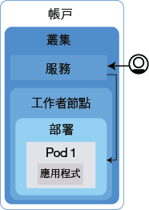
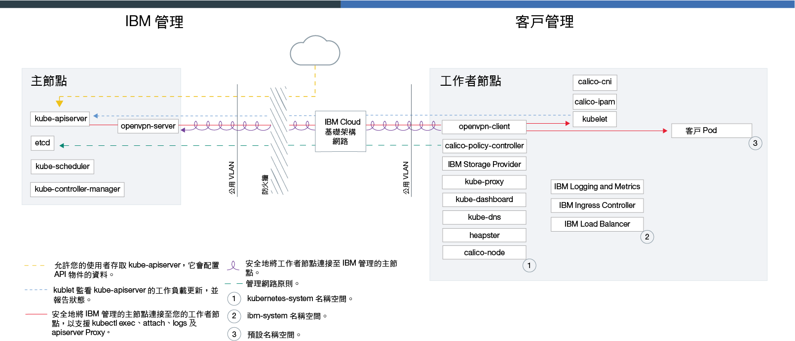

---

copyright:
  years: 2014, 2018
lastupdated: "2018-03-16"

---

{:new_window: target="_blank"}
{:shortdesc: .shortdesc}
{:screen: .screen}
{:pre: .pre}
{:table: .aria-labeledby="caption"}
{:codeblock: .codeblock}
{:tip: .tip}
{:download: .download}

# {{site.data.keyword.containerlong_notm}} 技術

進一步瞭解 {{site.data.keyword.containerlong}} 背後的技術。
{:shortdesc}

## Docker 容器
{: #docker_containers}

建置在現有 Linux 容器技術 (LXC) 上的開放程式碼專案 Docker，已成為快速建置、測試、部署及擴充應用程式用的軟體平台。Docker 會將軟體包裝為稱為容器的標準化單元，其中包括執行應用程式所需要的所有元素。
{:shortdesc}

瞭解一些基本 Docker 概念：

<dl>
<dt>映像檔</dt>
<dd>Docker 映像檔是從 Dockerfile 所建置的，而 Dockerfile 文字檔定義如何建置映像檔，以及要包含在其中的建置構件，例如應用程式、應用程式配置及其相依關係。映像檔一律是從其他映像檔建置而成，使它們可以快速配置。請讓其他人對映像檔執行大量工作，然後調整映像檔以供您使用。</dd>
<dt>登錄</dt>
<dd>映像檔登錄是儲存、擷取及共用 Docker 映像檔的位置。登錄中所儲存的映像檔可公開使用（公用登錄）或供一小群使用者存取（專用登錄）。{{site.data.keyword.containershort_notm}} 提供公用映像檔（例如 ibmliberty），可用來建立第一個容器化應用程式。如果是企業應用程式，請使用專用登錄（例如 {{site.data.keyword.Bluemix_notm}} 中提供的專用登錄）來防止未獲授權的使用者使用您的映像檔。</dd>
<dt>容器</dt>
<dd>每個容器都是從映像檔所建立。容器是具有其所有相依關係的已包裝應用程式，讓應用程式能夠在環境之間移動，並且不需變更即可執行。容器與虛擬機器不同，容器不會將裝置、其作業系統及基礎硬體虛擬化。只有應用程式碼、運行環境、系統工具、程式庫及設定會包裝在容器中。容器會以隔離的處理程序形式在 Ubuntu 運算主機上執行，並共用主機作業系統及其硬體資源。此方式讓容器比虛擬機器更輕量、可攜性更高且更有效率。</dd>
</dl>

### 使用容器的重要優點
{: #container_benefits}

<dl>
<dt>容器靈活多變</dt>
<dd>容器可透過為開發及正式作業部署提供標準化環境來簡化系統管理。輕量型運行環境可讓您快速擴增及縮減部署。透過使用容器協助您在任何基礎架構上快速且可靠地部署及執行任何應用程式，可去除不同作業系統平台及其基礎基礎架構的管理複雜性。</dd>
<dt>容器很小</dt>
<dd>您可以在單一虛擬機器所需的空間量中容納許多容器。</dd>
<dt>容器具有可攜性</dt>
<dd><ul>
  <li>重複使用映像檔的各部分來建置容器。</li>
  <li>將應用程式碼從暫置環境快速移至正式作業環境。</li>
  <li>使用持續交付工具，自動執行處理程序。</li> </ul></dd>
</dl>

 

## Kubernetes 基本概念
{: #kubernetes_basics}

名為 Kubernetes 的開放程式碼專案，結合了容器化基礎架構的執行與正式作業工作負載、開放程式碼提出及 Docker 容器管理工具。Kubernetes 基礎架構提供一個隔離且安全的應用程式平台來管理容器，此平台具有可攜性、可延伸並且在發生失效接手時可自我修復。
{:shortdesc}

瞭解一些基本 Kubernetes 概念，如下圖所示。

<dl>
<dt>帳戶</dt>
<dd>您的帳戶指的是 {{site.data.keyword.Bluemix_notm}} 帳戶。</dd>

<dt>叢集</dt>
<dd>Kubernetes 叢集包含一台以上稱為工作者節點的運算主機。工作者節點是由 Kubernetes 主節點進行管理，Kubernetes 主節點會集中控制及監視叢集中的所有 Kubernetes 資源。因此，當您部署容器化應用程式的資源時，Kubernetes 主節點會考慮部署需求及叢集中的可用容量，來決定要在其上部署這些資源的工作者節點。Kubernetes 資源包括服務、部署及 Pod。</dd>

<dt>服務</dt>
<dd>服務是一種 Kubernetes 資源，可將一組 Pod 分組在一起，並提供這些 Pod 的網路連線功能，而不需要公開每一個 Pod 的實際專用 IP 位址。您可以使用服務，將您的應用程式設為可在叢集內使用或可供公用網際網路使用。</dd>

<dt>部署</dt>
<dd>部署是一種 Kubernetes 資源，您可在其中指定執行應用程式所需的其他資源或功能的相關資訊（例如服務、持續性儲存空間或註釋）。將部署記載在配置 YAML 檔案中，然後再將其套用至叢集。Kubernetes 主節點會配置資源，並將容器部署至具有可用容量之工作者節點上的 Pod。
  
定義應用程式的更新策略，包括您要在漸進式更新期間新增的 Pod 數目，以及每次更新時可能無法使用的 Pod 數目。當您執行漸進式更新時，部署會檢查更新是否正常運作，並且在偵測到失敗時停止推出。</dd>

<dt>Pod</dt>
<dd>稱為 Pod 的 Kubernetes 資源會部署、執行及管理每個部署至叢集的容器化應用程式。Pod 代表 Kubernetes 叢集中的小型可部署單元，並且用來將必須視為單一單元的容器分組在一起。在大部分情況下，每一個容器都會部署至其專屬 Pod。不過，應用程式可能會要求將一個容器及其他協助容器部署至某個 Pod，以便使用相同的專用 IP 位址來為那些容器定址。</dd>

<dt>應用程式</dt>
<dd>應用程式可能指的是完整應用程式或應用程式的元件。您可以在個別 Pod 或個別工作者節點中部署應用程式的元件。
  
若要進一步瞭解 Kubernetes 術語，請<a href="cs_tutorials.html#cs_cluster_tutorial" target="_blank">嘗試指導教學</a>。</dd>

</dl>

 

## 服務架構
{: #architecture}

在 {{site.data.keyword.containershort_notm}} 上執行的 Kubernetes 叢集中，您的容器化應用程式是在稱為工作者節點的運算主機上進行管理。更明確的說法是，它們是在 Pod 執行，而 Pod 是在工作者節點上進行管理。工作者節點是由 Kubernetes 主節點管理。Kubernetes 主節點及工作者節點是透過安全的 TLS 憑證及 openVPN 連線來彼此通訊，以編排叢集配置。
{: shortdesc}

Kubernetes 主節點與工作者節點之間的差異為何？問得好。

<dl>
  <dt>Kubernetes 主節點</dt>
    <dd>Kubernetes 主節點負責管理叢集中的所有運算、網路及儲存空間資源。Kubernetes 主節點確保您的容器化應用程式和服務平均部署至叢集中的工作者節點。取決於您如何配置應用程式及服務，主節點會判斷具有足夠資源來滿足應用程式需求的工作者節點。</dd>
  <dt>工作者節點</dt>
    <dd>每一個工作者節點都是實體機器（裸機）或是在實體硬體上執行的虛擬機器，其在雲端環境中進行管理。當您佈建工作者節點時，要判斷該工作者節點上管理之容器可用的資源。工作者節點預設都已設定 {{site.data.keyword.IBM_notm}} 所管理的 Docker Engine、不同的運算資源、網路及磁區服務。內建安全特性提供隔離、資源管理功能及工作者節點安全規範。</dd>
</dl>

圖. {{site.data.keyword.containershort_notm}} 架構

 

