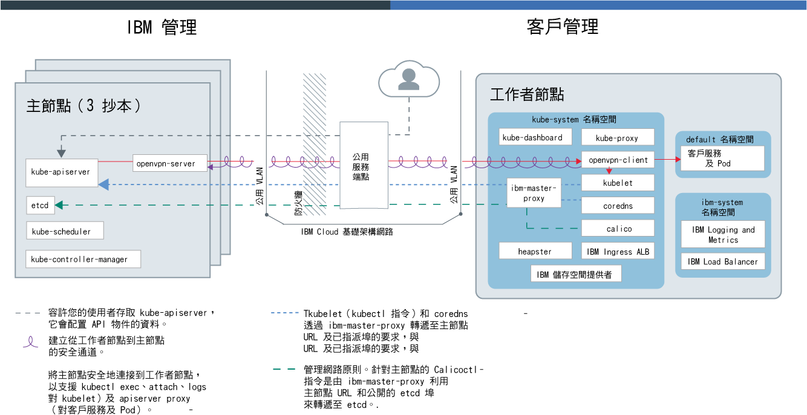
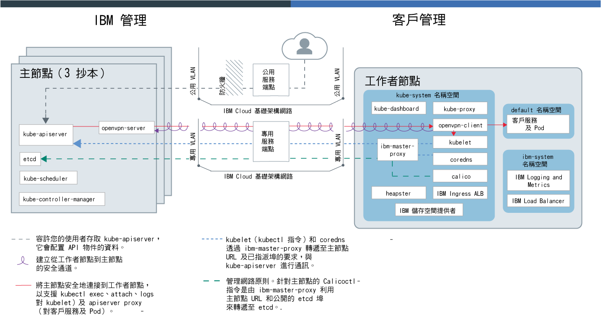

---

copyright:
  years: 2014, 2019
lastupdated: "2019-06-12"

keywords: kubernetes, iks, docker

subcollection: containers

---

{:new_window: target="_blank"}
{:shortdesc: .shortdesc}
{:screen: .screen}
{:pre: .pre}
{:table: .aria-labeledby="caption"}
{:codeblock: .codeblock}
{:tip: .tip}
{:note: .note}
{:important: .important}
{:deprecated: .deprecated}
{:download: .download}
{:preview: .preview}

# {{site.data.keyword.containerlong_notm}} 技術

進一步瞭解 {{site.data.keyword.containerlong}} 背後的技術。
{:shortdesc}

## Docker 容器
{: #docker_containers}

建置在現有 Linux 容器技術 (LXC) 上的開放程式碼專案 Docker，定義了如何將軟體包裝成標準化單位（稱為容器）的範本，容器中包含了執行應用程式所需要的所有元素。
{{site.data.keyword.containerlong_notm}} 使用 `containerd` 作為容器運行環境，將容器從 Docker 容器映像檔部署到叢集裡。
{:shortdesc}

瞭解一些基本 Docker 概念：

<dl>
<dt>映像檔</dt>
<dd>容器映像檔是您要執行的每個容器的基礎。容器映像檔是從 Dockerfile 所建置的，Dockerfile 是一個文字檔，定義了如何建置映像檔，以及要包含在其中的建置構件，例如應用程式、應用程式配置及其相依關係。映像檔一律是從其他映像檔建置而成，這使得它們可以快速地配置。讓其他人對映像檔執行大量工作，然後針對您的用途調整映像檔。</dd>
<dt>登錄</dt>
<dd>映像檔登錄是儲存、擷取及共用容器映像檔的位置。登錄中所儲存的映像檔可公開使用（公用登錄）或供一小群使用者存取（專用登錄）。{{site.data.keyword.containerlong_notm}} 提供公用映像檔（例如 ibmliberty），您可以用來建立第一個容器化應用程式。如果是企業應用程式，請使用專用登錄（例如 {{site.data.keyword.Bluemix_notm}} 中提供的專用登錄）來防止未獲授權的使用者使用您的映像檔。</dd>
<dt>容器</dt>
<dd>每個容器都是從映像檔所建立。容器是具有其所有相依關係的已包裝應用程式，因此應用程式能夠在環境之間移動，並且不需變更即可執行。容器與虛擬機器不同，容器不會將裝置、其作業系統及基礎硬體虛擬化。只有應用程式碼、運行環境、系統工具、程式庫及設定會包裝在容器中。容器會以隔離的處理程序形式在 Ubuntu 運算主機上執行，並且共用主機作業系統及其硬體資源。此方式讓容器比起虛擬機器顯得更輕量、可攜性更高且更有效率。</dd>
</dl>

### 使用容器的重要優點
{: #container_benefits}

<dl>
<dt>容器靈活多變</dt>
<dd>容器可透過為開發及正式作業部署提供標準化環境，來簡化系統管理。輕量型運行環境可讓您快速地擴增及縮減部署。透過使用容器協助您在任何基礎架構上快速且可靠地部署及執行任何應用程式，可去除不同作業系統平台及其基礎基礎架構的管理複雜性。</dd>
<dt>容器很小</dt>
<dd>您可以在單一虛擬機器所需的空間量中容納許多容器。</dd>
<dt>容器具有可攜性</dt>
<dd>
<ul>
  <li>重複使用映像檔的各部分來建置容器。</li>
  <li>將應用程式碼從暫置環境快速移至正式作業環境。</li>
  <li>使用持續交付工具，自動執行處理程序。</li>
  </ul>
  </dd>

進一步瞭解使用容器映像檔時如何[保護個人資訊安全](/docs/containers?topic=containers-security#pi)。

準備好深入瞭解 Docker 嗎？<a href="https://developer.ibm.com/courses/all/docker-essentials-a-developer-introduction/" target="_blank">完成本課程來瞭解 Docker 與 {{site.data.keyword.containerlong_notm}} 如何一起運作。</a>

</dl>

 

## Kubernetes 叢集
{: #kubernetes_basics}

名為 Kubernetes 的開放程式碼專案，結合了容器化基礎架構的執行與正式作業工作負載、開放程式碼提出及 Docker 容器管理工具。Kubernetes 基礎架構提供一個隔離且安全的應用程式平台來管理容器，此平台具有可攜性、可延伸並且在發生失效接手時可自我修復。
{:shortdesc}

瞭解一些基本 Kubernetes 概念，如下圖所示。

<dl>
<dt>帳戶</dt>
<dd>您的帳戶是指 {{site.data.keyword.Bluemix_notm}} 帳戶。</dd>

<dt>叢集</dt>
<dd>Kubernetes 叢集包含一台以上稱為工作者節點的運算主機。工作者節點是由 Kubernetes 主節點進行管理，Kubernetes 主節點會集中控制及監視叢集裡的所有 Kubernetes 資源。因此，當您部署容器化應用程式的資源時，Kubernetes 主節點會考慮部署需求及叢集裡的可用容量，來決定要在其上部署這些資源的工作者節點。Kubernetes 資源包括服務、部署及 Pod。</dd>

<dt>服務</dt>
<dd>服務是一種 Kubernetes 資源，可將一組 Pod 分組在一起，並提供這些 Pod 的網路連線功能，而不需要公開每一個 Pod 的實際專用 IP 位址。您可以使用服務，將您的應用程式設為可在叢集內使用或可供公用網際網路使用。
</dd>

<dt>部署</dt>
<dd>部署是一種 Kubernetes 資源，您可在其中指定執行應用程式所需的其他資源或功能的相關資訊（例如服務、持續性儲存空間或註釋）。將部署記載在配置 YAML 檔案中，然後再將其套用至叢集。Kubernetes 主節點會配置資源，並將容器部署至具有可用容量之工作者節點上的 Pod。
  定義應用程式的更新策略，包括您要在漸進式更新期間新增的 Pod 數目，以及每次更新時可能無法使用的 Pod 數目。當您執行漸進式更新時，部署會檢查更新是否正常運作，並且在偵測到失敗時停止推出。</dd>

<dt>Pod</dt>
<dd>稱為 Pod 的 Kubernetes 資源會部署、執行及管理每個部署至叢集的容器化應用程式。Pod 代表 Kubernetes 叢集裡的小型可部署單元，並且用來將必須視為單一單元的容器分組在一起。在大部分情況下，每一個容器都會部署至其專屬 Pod。不過，應用程式可能會要求將一個容器及其他協助容器部署至某個 Pod，以便使用相同的專用 IP 位址來為那些容器定址。</dd>

<dt>應用程式</dt>
<dd>應用程式可能是指完整應用程式或應用程式的元件。您可以在個別 Pod 或個別工作者節點中部署應用程式的元件。
</dd>

進一步瞭解使用 Kubernetes 資源時如何[保護個人資訊安全](/docs/containers?topic=containers-security#pi)。

準備好深入瞭解 Kubernetes 嗎？

<ul><li><a href="/docs/containers?topic=containers-cs_cluster_tutorial#cs_cluster_tutorial" target="_blank">使用「建立叢集」指導教學</a>，擴充您的術語知識。</li>
<li><a href="https://developer.ibm.com/courses/all/container-kubernetes-essentials-with-ibm-cloud/" target="_blank">完成本課程來瞭解 Kubernetes 與 {{site.data.keyword.containerlong_notm}} 如何一起運作。</a></li></ul>

</dl>

 

## 服務架構
{: #architecture}

在 {{site.data.keyword.containerlong_notm}} 上執行的 Kubernetes 叢集裡，您的容器化應用程式是在稱為工作者節點的運算主機上進行管理。更明確的說法是，應用程式是在 Pod 執行，而 Pod 是在工作者節點上進行管理。工作者節點是由 Kubernetes 主節點管理。Kubernetes 主節點與工作者節點之間的通訊設定，視您如何設定 IBM Cloud 基礎架構 (SoftLayer) 網路而定：具有公用服務端點的帳戶，或者具有公用及專用服務端點且已啟用 VRF 的帳戶。
{: shortdesc}

下圖顯示您的叢集元件，以及在只[啟用公用服務端點](/docs/containers?topic=containers-plan_clusters#workeruser-master)時，這些元件在帳戶中的互動方式。

<figure>
 
 <figcaption>僅啟用公用服務端點時的 {{site.data.keyword.containerlong_notm}} 架構</figcaption> </figure>

下圖顯示您的叢集元件，以及在[啟用公用及專用服務端點](/docs/containers?topic=containers-plan_clusters#workeruser-master)時，這些元件在已啟用 VRF 之帳戶中的互動方式。

<figure>
 
 <figcaption>啟用公用及專用服務端點時的 {{site.data.keyword.containerlong_notm}} 架構</figcaption> </figure>

Kubernetes 主節點與工作者節點之間的差異為何？問得好。

<dl>
  <dt>Kubernetes 主節點</dt>
    <dd>Kubernetes 主節點負責管理叢集裡的所有運算、網路及儲存空間資源。Kubernetes 主節點確保您的容器化應用程式和服務平均部署至叢集裡的工作者節點。視您如何配置應用程式及服務而定，主節點會判斷具有足夠資源可滿足應用程式需求的工作者節點。  下表說明 Kubernetes 主節點的元件。
    <table>
    <caption>Kubernetes 主節點的元件</caption>
    <thead>
    <th>主節點元件</th>
    <th>說明</th>
    </thead>
    <tbody>
    <tr>
    <td>kube-apiserver</td>
    <td>Kubernetes API 伺服器作為從工作者節點到 Kubernetes 主節點的所有叢集管理要求的主要進入點。Kubernetes API 伺服器會驗證並處理變更 Kubernetes 資源（例如 Pod 或服務）之狀況的要求，並將此狀況儲存在 etcd 中。</td>
    </tr>
    <tr>
    <td>openvpn-server</td>
    <td>OpenVPN 伺服器會使用 OpenVPN 用戶端，將主節點安全地連接至工作者節點。此連線支援對 Pod 及服務的 `apiserver proxy` 呼叫，以及對 kubelet 的 `kubectl exec`、`attach` 及 `logs` 呼叫。</td>
    </tr>
    <tr>
    <td>etcd</td>
    <td>etcd 是高度可用的鍵值儲存庫，其中儲存叢集的所有 Kubernetes 資源（例如服務、部署及 Pod）的狀況。etcd 中的資料會備份至 IBM 管理的已加密儲存空間實例。</td>
    </tr>
    <tr>
    <td>kube-scheduler</td>
    <td>Kubernetes 排程器會監看剛建立的 Pod，並根據容量、效能需求、原則限制、反親緣性規格及工作負載需求，來決定要在何處進行部署。如果找不到符合需求的工作者節點，則不會在叢集裡部署 Pod。</td>
    </tr>
    <tr>
    <td>kube-controller-manager</td>
    <td>Kubernetes 控制器管理程式是一種常駐程式，它會監看叢集資源（例如抄本集）的狀況。當資源的狀況變更時，例如，若抄本集中的 Pod 關閉，則控制器管理程式會起始更正動作以達到所需的狀況。</td>
    </tr>
    </tbody></table></dd>
  <dt>工作者節點</dt>
    <dd>每一個工作者節點都是雲端環境中，實體機器（裸機）或是在實體硬體上執行的虛擬機器。當您佈建工作者節點時，要判斷該工作者節點上管理之容器可用的資源。工作者節點預設都已設定 {{site.data.keyword.IBM_notm}} 所管理的 Docker Engine、個別的運算資源、網路及磁區服務。內建安全特性提供隔離、資源管理功能及工作者節點安全法規遵循。  
不支援修改預設工作者節點元件，例如 `kubelet`，可能導致非預期的結果。
下表說明工作者節點的元件。
    <table>
    <caption>工作者節點的元件</caption>
    <thead>
    <th>工作者節點元件</th>
    <th>名稱空間</th>
    <th>說明</th>
    </thead>
    <tbody>
    <tr>
    <td>`ibm-master-proxy`</td>
    <td>kube-system</td>
    <td>`ibm-master-proxy` 會將工作者節點中的要求轉遞至高可用性主節點抄本的 IP 位址。在單一區域叢集裡，主節點在個別主機上具有三個抄本，搭配一個主節點 IP 位址及網域名稱。對於具有多區域功能之區域中的叢集，主節點具有三個分散在各區域之中的抄本。因此，每一個主節點都有向 DNS 登錄的專屬 IP 位址，搭配一個用於整個叢集主節點的網域名稱。</td>
    </tr>
    <tr>
    <td>`openvpn-client`</td>
    <td>kube-system</td>
    <td>OpenVPN 用戶端會使用 OpenVPN 伺服器，將主節點安全地連接至工作者節點。此連線支援對 Pod 及服務的 `apiserver proxy` 呼叫，以及對 kubelet 的 `kubectl exec`、`attach` 及 `logs` 呼叫。</td>
    </tr>
    <tr>
    <td>`kubelet`</td>
    <td>kube-system</td>
    <td>kubelet 是在每個工作者節點上執行的 Pod，負責監視在工作者節點上執行之 Pod 的性能，以及監看 Kubernetes API 伺服器傳送的事件。根據這些事件，kubelet 會建立或移除 Pod、確保存活性及就緒探測，以及向 Kubernetes API 伺服器回報 Pod 的狀態。</td>
    </tr>
    <tr>
    <td>`coredns`</td>
    <td>kube-system</td>
    <td>依預設，Kubernetes 會在叢集上排定 CoreDNS Pod（或 1.12 版及更早版本中的 KubeDNS Pod）及服務。容器在搜尋其他 Pod 及服務時，會自動使用 DNS 服務的 IP 來解析 DNS 名稱。</td>
    </tr>
    <tr>
    <td>`calico`</td>
    <td>kube-system</td>
    <td>Calico 會管理叢集的網路原則，並包含一些元件，如下所示。
    <ul>
    <li>**`calico-cni`**：Calico 容器網路介面 (CNI) 可以管理容器的網路連線功能，並在刪除容器時移除已配置的資源。</li>
    <li>**`calico-ipam`**：Calico IPAM 可管理容器的 IP 位址指派。</li>
    <li>**`calico-node`**：Calico 節點是一種容器，它會將透過網路連接容器與 Calico 所需的各種元件組合在一起。</li>
    <li>**`calico-policy-controller`**：Calico 原則控制器會監看入埠及出埠網路資料流量是否遵循已設定的網路原則。如果叢集裡不容許資料流量，則對叢集的存取會遭到封鎖。Calico 原則控制器也用來建立及設定叢集的網路原則。</li></ul></td>
    </tr>
    <tr>
    <td>`kube-proxy`</td>
    <td>kube-system</td>
    <td>Kubernetes 網路 Proxy 是一種常駐程式，其在每個工作者節點上執行，並為叢集裡執行的服務轉遞 TCP 及 UDP 網路資料流量，或對這些網路資料流量進行負載平衡。</td>
    </tr>
    <tr>
    <td>`kube-dashboard`</td>
    <td>kube-system</td>
    <td>Kubernetes 儀表板是 Web 型 GUI，容許使用者管理及疑難排解叢集和叢集裡執行的應用程式。</td>
    </tr>
    <tr>
    <td>`heapster`</td>
    <td>kube-system</td>
    <td>Heapster 是監視及事件資料的全叢集聚集器。Heapster Pod 會探索叢集裡的所有節點，並從每一個節點的 kubelet 查詢用量資訊。您可以在 Kubernetes 儀表板中找到使用率圖形。</td>
    </tr>
    <tr>
    <td>Ingress ALB</td>
    <td>kube-system</td>
    <td>Ingress 是一種 Kubernetes 服務，可用來將公用或專用要求轉遞給叢集裡的多個應用程式，以平衡叢集裡的網路資料流量工作負載。若要透過公用或專用網路來公開您的應用程式，您必須建立 Ingress 資源，向 Ingress 應用程式負載平衡器 (ALB) 登錄您的應用程式。然後，便可以使用單一 URL 或 IP 位址來存取多個應用程式。</td>
    </tr>
    <tr>
    <td>儲存空間提供者</td>
    <td>kube-system</td>
    <td>每個叢集都會設定一個外掛程式，以佈建檔案儲存空間。您可以選擇安裝其他附加程式，例如區塊儲存空間。</td>
    </tr>
    <tr>
    <td>記載及測量</td>
    <td>ibm-system</td>
    <td>您可以使用整合式 {{site.data.keyword.loganalysislong_notm}} 及 {{site.data.keyword.monitoringlong_notm}} 服務，在使用日誌及度量值時，擴展您的收集和保留功能。</td>
    </tr>
    <tr>
    <td>負載平衡器</td>
    <td>ibm-system</td>
    <td>負載平衡器是一種 Kubernetes 服務，可用來將公用或專用要求轉遞給應用程式，以平衡叢集裡的網路資料流量工作負載。</td>
    </tr>
    <tr>
    <td>應用程式 Pod 及服務</td>
    <td>default</td>
    <td>在 <code>default</code> 名稱空間或在您建立的名稱空間中，您可以在 Pod 及服務中部署應用程式，以便與那些 Pod 進行通訊。</td>
    </tr>
    </tbody></table></dd>
</dl>

想要查看 {{site.data.keyword.containerlong_notm}} 如何與其他產品及服務搭配使用嗎？請參閱部分[整合](/docs/containers?topic=containers-supported_integrations#supported_integrations)。
{: tip}

## 服務限制
{: #tech_limits}

{{site.data.keyword.containerlong_notm}} 和 Kubernetes 開放程式碼專案隨附預設服務設定和限制，以確保提供基本功能以及安全和便利性。您可能可以變更其中註明的一些限制。如果預期會達到下列 {{site.data.keyword.containerlong_notm}} 限制，請透過[內部 ](https://ibm-argonauts.slack.com/messages/C4S4NUCB1) 或[外部 Slack ](https://ibm-container-service.slack.com) 聯絡 IBM 團隊。
{: shortdesc}

<table summary="該表格包含有關 {{site.data.keyword.containerlong_notm}} 限制的資訊。各直欄從左到右閱讀。第一直欄是限制的類型，第二直欄是限制的說明。">
<caption>{{site.data.keyword.containerlong_notm}} 限制</caption>
<thead>
  <tr>
    <th>類型</th>
    <th>說明</th>
  </tr>
</thead>
<tbody>
  <tr>
    <td>API 速率限制</td>
    <td>針對每個唯一來源 IP 位址，每 10 秒向 {{site.data.keyword.containerlong_notm}} API 發出 100 個要求。</td>
  </tr>
  <tr>
    <td>工作者節點容量</td>
    <td>工作者節點在運算資源的[選取特性](/docs/containers?topic=containers-planning_worker_nodes#shared_dedicated_node)中提供。</td>
  </tr>
  <tr>
    <td>工作者節點主機存取</td>
    <td>基於安全，您無法透過 SSH 登錄到工作者節點運算主機。</td>
  </tr>
  <tr>
    <td>最大工作者節點數</td>
    <td>如果計劃每個叢集的工作者節點節點數會超過 900 個，請首先透過[內部 ](https://ibm-argonauts.slack.com/messages/C4S4NUCB1) 或[外部 Slack ](https://ibm-container-service.slack.com) 聯絡 IBM 團隊。
  如果看到針對每個資料中心的實例數或每個月訂購的實例數的 IBM Cloud 基礎架構 (SoftLayer) 容量限制，請聯絡 IBM Cloud 基礎架構 (SoftLayer) 代表。</td>
  </tr>
  <tr>
    <td>最大 Pod 數</td>
    <td>每個工作者節點 110 個 Pod。  pod 數包括在工作者節點上執行的 `kube-system` 和 `ibm-system` Pod。要提高效能，請考慮限制每個運算核心執行的 Pod 數，以便不會過度使用工作者節點。例如，在使用 `b3c.4x16` 特性的工作者節點上，可每個核心執行 10 個 Pod，這些 Pod 使用的容量佔工作者節點總容量的比例不超過 75%。</td>
  </tr>
  <tr>
    <td>最大 Kubernetes 服務數</td>
    <td>在 172.21.0.0/16 範圍內，每個叢集 65,000 個 IP，可以將這些 IP 指派給叢集裡的 Kubernetes 服務。</td>
  </tr>
  <tr>
    <td>Ingress 應用程式負載平衡器 (ALB) 資料流量</td>
    <td>每秒 32,768 個連線。  如果輸入資料流量超過此數目，請在叢集裡[擴增 ALB 抄本數](/docs/containers?topic=containers-ingress#scale_albs)，以處理增加的工作負載。</td>
  </tr>
  <tr>
    <td>儲存空間磁區</td>
    <td>每個帳戶的 IBM Cloud 基礎架構 (SoftLayer) 檔案儲存空間和區塊儲存空間實例的磁區的合併總數 250 個。  如果裝載的數量超過此數量，則在佈建持續性磁區時可能會看到「容量不足」訊息，並且需要聯絡 IBM Cloud 基礎架構 (SoftLayer) 代表。如需更多常見問題，請參閱[檔案](/docs/infrastructure/FileStorage?topic=FileStorage-file-storage-faqs#how-many-volumes-can-i-provision-)儲存空間和[區塊](/docs/infrastructure/BlockStorage?topic=BlockStorage-block-storage-faqs#how-many-instances-can-share-the-use-of-a-block-storage-volume-)儲存空間文件。</td>
  </tr>
</tbody>
</table>
