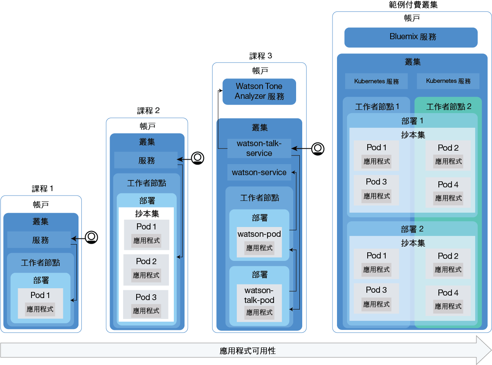
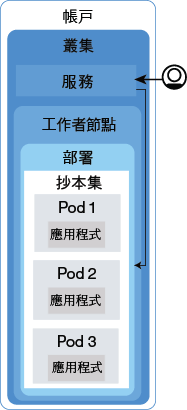
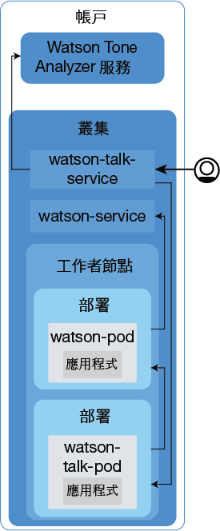

---

copyright:
  years: 2014, 2017
lastupdated: "2017-11-14"

---

{:new_window: target="blank"}
{:shortdesc: .shortdesc}
{:screen: .screen}
{:pre: .pre}
{:table: .aria-labeledby="caption"}
{:codeblock: .codeblock}
{:tip: .tip}
{:download: .download}


# 指導教學：將應用程式部署至叢集
{: #cs_apps_tutorial}

這個第二個指導教學繼續說明如何使用 Kubernetes 來部署運用 {{site.data.keyword.watson}} {{site.data.keyword.toneanalyzershort}} {{site.data.keyword.Bluemix_notm}} 服務的容器化應用程式。虛構的公關公司會使用 {{site.data.keyword.watson}} 來分析其新聞稿，以及接收對其訊息基調的意見。
{:shortdesc}

在此情境中，公關公司的應用程式開發人員將應用程式的 Hello World 版本部署至網路管理者在[第一個指導教學](cs_tutorials.html#cs_cluster_tutorial)中建立的 Kubernetes 叢集。

每一個課程都會教您如何以漸進方式部署相同應用程式的較複雜版本。下圖顯示指導教學中的應用程式部署元件，第四部分除外。



如圖所示，Kubernetes 使用數個不同類型的資源來讓您的應用程式在叢集中開始執行。在 Kubernetes 中，部署及服務會一起運作。部署包括應用程式的定義，例如用於容器的映像檔，以及必須為應用程式公開哪個埠。當您建立部署時，會針對您在部署中定義的每一個容器各建立一個 Kubernetes Pod。為了讓您的應用程式更具復原力，您可以在部署中定義相同應用程式的多個實例，並且讓 Kubernetes 自動為您建立抄本集。抄本集會監視 Pod，並確保隨時都有所需數目的 Pod 在執行。如果其中一個 Pod 變得沒有回應，就會自動重建該 Pod。

服務會將一組 Pod 群組在一起，並且為叢集中的其他服務提供這些 Pod 的網路連線，而不需公開每一個 Pod 的實際專用 IP 位址。您可以使用 Kubernetes 服務，讓叢集內的其他 Pod 能夠使用應用程式，或是將應用程式公開至網際網路。在本指導教學中，您將會使用 Kubernetes 服務，透過自動指派給工作者節點的公用 IP 位址以及公用埠，從網際網路存取執行中的應用程式。

為了讓應用程式具備高可用性，您可以在標準叢集中建立多個工作者節點，以執行更多的應用程式抄本。本指導教學中未討論此作業，但請記住這個概念，以供未來改進應用程式的可用性。

只有其中一個課程討論到將 {{site.data.keyword.Bluemix_notm}} 服務整合至應用程式中，但無論您想像得到的應用程式有多麼簡單或複雜，都可以使用這些服務。

## 目標

* 瞭解基本的 Kubernetes 術語
* 將映像檔推送至 {{site.data.keyword.registryshort_notm}} 中的登錄名稱空間
* 讓應用程式可供公開存取
* 使用 Kubernetes 指令及 Script 將應用程式的單一實例部署在叢集中
* 將應用程式的多個實例部署在性能檢查期間重建的容器中
* 部署使用 {{site.data.keyword.Bluemix_notm}} 服務功能的應用程式

## 所需時間

40 分鐘

## 適用對象

以前從未在 Kubernetes 叢集中部署應用程式的軟體開發人員及網路管理者。

## 必要條件

[指導教學：在 {{site.data.keyword.containershort_notm}} 中建立 Kubernetes 叢集](cs_tutorials.html#cs_cluster_tutorial)。

## 課程 1：將單一實例應用程式部署至 Kubernetes 叢集
{: #cs_apps_tutorial_lesson1}

在本課程中，您會將 Hello World 應用程式的單一實例部署至叢集中。下圖包括您藉由完成本課程所部署的元件。
{:shortdesc}


在前一個指導教學中，您已有一個帳戶和一個具有一個工作者節點的叢集。在本課程中，您將配置一個部署，並在工作者節點的 Kubernet Pod 中部署 Hello World 應用程式。若要讓它可公開使用，請建立 Kubernetes 服務。


1.  登入 {{site.data.keyword.Bluemix_notm}} CLI。系統提示時，請輸入您的 {{site.data.keyword.Bluemix_notm}} 認證。若要指定 {{site.data.keyword.Bluemix_notm}} 地區，請[包括 API 端點](cs_regions.html#bluemix_regions)。

    ```
    bx login
    ```
    {: pre}

    **附註：**如果您具有聯合 ID，請使用 `bx login --sso` 來登入 {{site.data.keyword.Bluemix_notm}} CLI。請輸入使用者名稱，並使用 CLI 輸出中提供的 URL 來擷取一次性密碼。若沒有 `--sso` 時登入失敗，而有 `--sso` 選項時登入成功，即表示您有聯合 ID。

2.  在 CLI 中設定叢集的環境定義。
    1.  取得指令來設定環境變數，並下載 Kubernetes 配置檔。

        ```
        bx cs cluster-config <pr_firm_cluster>
        ```
        {: pre}

        配置檔下載完成之後，會顯示一個指令，可讓您用來將本端 Kubernetes 配置檔的路徑設定為環境變數。

        OS X 的範例：

        ```
        export KUBECONFIG=/Users/<user_name>/.bluemix/plugins/container-service/clusters/<pr_firm_cluster>/kube-config-prod-dal10-pr_firm_cluster.yml
        ```
        {: screen}

    2.  複製並貼上終端機中顯示的指令，以設定 `KUBECONFIG` 環境變數。
    3.  驗證 `KUBECONFIG` 環境變數已適當設定。

        OS X 的範例：

        ```
        echo $KUBECONFIG
        ```
        {: pre}

        輸出：

        ```
        /Users/<user_name>/.bluemix/plugins/container-service/clusters/<pr_firm_cluster>/kube-config-prod-dal10-pr_firm_cluster.yml
        ```
        {: screen}

    4.  檢查 Kubernetes CLI 伺服器版本，驗證叢集已適當地執行 `kubectl` 指令。

        ```
        kubectl version  --short
        ```
        {: pre}

        輸出範例：

        ```
        Client Version: v1.7.4
        Server Version: v1.7.4
        ```
        {: screen}

3.  啟動 Docker。
    * 如果您是使用 Docker CE，則不需要執行任何動作。
    * 如果您是使用 Linux，請遵循 [Docker 文件 ](https://docs.docker.com/engine/admin/)，視您使用的 Linux 發行套件而定，尋找有關如何啟動 Docker 的指示。
    * 如果您是在 Windows 或 OSX 上使用 Docker Toolbox，則可以使用 Docker Quickstart Terminal，它會為您啟動 Docker。在後續幾個步驟中，請使用 Docker Quickstart Terminal 來執行 Docker 指令，然後切回您用來設定 `KUBECONFIG` 階段作業變數的 CLI。
        * 如果您是使用 Docker QuickStart Terminal，請再次執行 {{site.data.keyword.Bluemix_notm}} CLI 登入指令。

          ```
          bx login
          ```
          {: pre}

4.  登入 {{site.data.keyword.registryshort_notm}} CLI。**附註**：請確定您已[安裝](/docs/services/Registry/index.html#registry_cli_install)  container-registry 外掛程式。

    ```
    bx cr login
    ```
    {: pre}

    -   如果您忘記 {{site.data.keyword.registryshort_notm}} 中的名稱空間，請執行下列指令。

        ```
        bx cr namespace-list
        ```
        {: pre}

5.  將 [Hello World 應用程式 ](https://github.com/Osthanes/container-service-getting-started-wt) 的原始碼複製或下載至您的使用者起始目錄。

    ```
    git clone https://github.com/Osthanes/container-service-getting-started-wt.git
    ```
    {: pre}

    如果您已下載儲存庫，請將壓縮檔解壓縮。

    範例：

    * Windows：`C:Users\<my_username>\container-service-getting-started-wt`
    * OS X：`/Users/<my_username>/container-service-getting-started-wt`

    儲存庫中有三個版本的類似應用程式，分別包含在名為 `Stage1`、`Stage2` 及 `Stage3` 的資料夾中。每一個版本都包含下列檔案：
    * `Dockerfile`：映像檔的建置定義
    * `app.js`：Hello World 應用程式
    * `package.json`：應用程式的相關 meta 資料

6.  導覽至第一個應用程式目錄 `Stage1`。

    ```
    cd <username_home_directory>/container-service-getting-started-wt/Stage1
    ```
    {: pre}

7.  建置 Docker 映像檔，其中包括 `Stage1` 目錄的應用程式檔案。如果您未來需要對應用程式進行變更，請重複這些步驟，以建立另一個版本的映像檔。

    1.  在本端建置映像檔，為其標記您要使用的名稱及標籤，以及您在前一個指導教學中於 {{site.data.keyword.registryshort_notm}} 中建立的名稱空間。為映像檔標記名稱空間資訊，可以讓 Docker 知道在稍後的步驟中，要將映像檔推送到哪裡。僅在映像檔名稱中使用小寫英數字元或底線 (`_`)。請不要忘記指令尾端的句點 (`.`)。這個句點告訴 Docker 要在現行目錄中尋找 Dockerfile 及建置構件，以建置映像檔。

        ```
        docker build -t registry.<region>.bluemix.net/<namespace>/hello-world:1 .
        ```
        {: pre}

        當建置完成時，請驗證您看到成功訊息。

        ```
        Successfully built <image_id>
        ```
        {: screen}

    2.  將映像檔推送至登錄名稱空間。

        ```
        docker push registry.<region>.bluemix.net/<namespace>/hello-world:1
        ```
        {: pre}

        輸出：

        ```
        The push refers to a repository [registry.<region>.bluemix.net/<namespace>/hello-world]
        ea2ded433ac8: Pushed
        894eb973f4d3: Pushed
        788906ca2c7e: Pushed
        381c97ba7dc3: Pushed
        604c78617f34: Pushed
        fa18e5ffd316: Pushed
        0a5e2b2ddeaa: Pushed
        53c779688d06: Pushed
        60a0858edcd5: Pushed
        b6ca02dfe5e6: Pushed
        1: digest: sha256:0d90cb73288113bde441ae9b8901204c212c8980d6283fbc2ae5d7cf652405
        43 size: 2398
        ```
        {: screen}

        等待映像檔推送完成後，再繼續下一步。

    3.  如果您是使用 Docker Quickstart Terminal，請切回您用來設定 `KUBECONFIG` 階段作業變數的 CLI。

    4.  驗證映像檔已順利新增至名稱空間。

        ```
        bx cr images
        ```
        {: pre}

        輸出：

        ```
        Listing images...

        REPOSITORY                                  NAMESPACE   TAG       DIGEST         CREATED        SIZE     VULNERABILITY STATUS
        registry.<region>.bluemix.net/<namespace>/hello-world   <namespace>   1   0d90cb732881   1 minute ago   264 MB   OK
        ```
        {: screen}

8.  建立名為 _hello-world-deployment_ 的 Kubernetes 部署，以將應用程式部署至您叢集中的 Pod。部署可用來管理 Pod，而 Pod 中包括應用程式的容器化實例。下列部署會將應用程式部署在單一 Pod 中。

    ```
    kubectl run hello-world-deployment --image=registry.<region>.bluemix.net/<namespace>/hello-world:1
    ```
    {: pre}

    輸出：

    ```
    deployment "hello-world-deployment" created
    ```
    {: screen}

    因為此部署只建立一個應用程式實例，所以部署速度比較快，而在後面的課程中，將會建立多個應用程式實例，所以部署速度會比較慢。

9.  將部署公開成為 NodePort 服務，讓全世界都可以存取此應用程式。服務會套用應用程式的網路功能。因為此叢集只有一個（而不是數個）工作者節點，所以不需要在工作者節點之間進行負載平衡。因此，NodePort 可以用來將應用程式的外部存取權提供給使用者。就像您可能會公開 Cloud Foundry 應用程式的埠，您公開的 NodePort 就是工作者節點用來接聽資料流量的埠。在後面的步驟中，您會看到哪個 NodePort 隨機指派給該服務。

    ```
    kubectl expose deployment/hello-world-deployment --type=NodePort --port=8080 --name=hello-world-service --target-port=8080
    ```
    {: pre}

    輸出：

    ```
    service "hello-world-service" exposed
    ```
    {: screen}

    <table>
    <table summary="expose 指令參數的相關資訊。">
    <caption>表 1. 指令參數</caption>
    <thead>
    <th colspan=2> expose 參數的相關資訊</th>
    </thead>
    <tbody>
    <tr>
    <td><code>expose</code></td>
    <td>將資源公開為 Kubernetes 服務，讓它可供使用者使用。</td>
    </tr>
    <tr>
    <td><code>deployment/<em>&lt;hello-world-deployment&gt;</em></code></td>
    <td>與此服務一起公開之資源的資源類型及名稱。</td>
    </tr>
    <tr>
    <td><code>--name=<em>&lt;hello-world-service&gt;</em></code></td>
    <td>服務的名稱。</td>
    </tr>
    <tr>
    <td><code>--port=<em>&lt;8080&gt;</em></code></td>
    <td>服務應該提供服務的埠。</td>
    </tr>
    <tr>
    <td><code>--type=NodePort</code></td>
    <td>要建立的服務類型。</td>
    </tr>
    <tr>
    <td><code>--target-port=<em>&lt;8080&gt;</em></code></td>
    <td>服務直接傳輸到的目標埠。在這個實例中，target-port 與 port 相同，但您建立的其他應用程式可能不同。</td>
    </tr>
    </tbody></table>

    既然所有部署工作都已完成，您就可以查看所有項目產生的結果。

10. 若要在瀏覽器中測試您的應用程式，請取得構成 URL 的詳細資料。
    1.  取得服務的相關資訊，以查看指派了哪個 NodePort。

        ```
        kubectl describe service <hello-world-service>
        ```
        {: pre}

        輸出：

        ```
        Name:                   hello-world-service
        Namespace:              default
        Labels:                 run=hello-world-deployment
        Selector:               run=hello-world-deployment
        Type:                   NodePort
        IP:                     10.10.10.8
        Port:                   <unset> 8080/TCP
        NodePort:               <unset> 30872/TCP
        Endpoints:              172.30.171.87:8080
        Session Affinity:       None
        No events.
        ```
        {: screen}

        使用 `expose` 指令來產生 NodePort 時，即已將其隨機指派，但範圍落在 30000 到 32767 之間。在此範例中，NodePort 是 30872。

    2.  取得工作者節點在叢集中的公用 IP 位址。

        ```
        bx cs workers <pr_firm_cluster>
        ```
        {: pre}

        輸出：

        ```
        Listing cluster workers...
        OK
        ID                                            Public IP        Private IP      Machine Type   State      Status
        dal10-pa10c8f571c84d4ac3b52acbf50fd11788-w1   169.47.227.138   10.171.53.188   free           normal    Ready
        ```
        {: screen}

11. 開啟瀏覽器，並使用下列 URL 來查看應用程式：`http://<IP_address>:<NodePort>`。使用範例值，URL 為 `http://169.47.227.138:30872`。當您在瀏覽器中輸入該 URL 時，會看到下列文字。

    ```
    Hello world! Your app is up and running in a cluster!
    ```
    {: screen}

    您可以將這個 URL 提供給工作同伴試用，或是在行動電話的瀏覽器中予以輸入，就會看到 Hello World 應用程式真的可以公開使用。

12. 使用預設埠 8001 來啟動 Kubernetes 儀表板。
    1.  使用預設埠號來設定 Proxy。

        ```
        kubectl proxy
        ```
         {: pre}

        ```
        Starting to serve on 127.0.0.1:8001
        ```
        {: screen}

    2.  在 Web 瀏覽器中開啟下列 URL，以查看 Kubernetes 儀表板。

        ```
        http://localhost:8001/ui
        ```
         {: pre}

13. 在**工作負載**標籤中，您可以看到所建立的資源。完成瀏覽 Kubernetes 儀表板之後，請使用 CTRL+C 來結束 `proxy` 指令。

恭喜！您已部署第一個應用程式版本。

本課程中有太多指令？同意。那麼使用配置 Script 來為您執行某些工作怎麼樣呢？若要為第二個應用程式版本使用配置 Script，以及部署該應用程式的多個實例來建立可用性，請繼續進行下一個課程。


## 課程 2：部署及更新具有更高可用性的應用程式
{: #cs_apps_tutorial_lesson2}

在本課程中，您會將 Hello World 應用程式的三個實例部署至叢集中，以獲得比第一個應用程式版本更高的可用性。高可用性代表使用者存取作業會分流至這三個實例。當有太多使用者嘗試存取相同的應用程式實例時，他們可能會注意到回應時間變慢。對您的使用者而言，多個實例代表回應會更快。在本課程中，您也會學到性能檢查及部署更新如何使用 Kubernetes。
{:shortdesc}

下圖包括您藉由完成本課程所部署的元件。



在前一個指導教學中，您有自己的帳戶和一個具有一個工作者節點的叢集。在本課程中，您將配置一個部署，並部署三個 Hello World 應用程式實例。每一個實例都會部署在 Kubernetes Pod 中，作為工作者節點中抄本集的一部分。若要讓它可公開使用，請同時建立 Kubernetes 服務。 

如配置 Script 中所定義，Kubernetes 可以使用可用性檢查來查看 Pod 中的容器是否正在執行中。例如，這些檢查可能會捕捉到死鎖、應用程式的執行位置，但無法繼續進行。將處於此狀況的容器重新啟動，有助於讓應用程式提高可用性，而不管有錯誤。然後，Kubernetes 會使用就緒檢查，以瞭解容器何時準備好，可以重新開始接受資料流量。當 Pod 的容器備妥時，就會將 Pod 視為備妥。當 Pod 備妥時，就會重新啟動。在 Stage2 應用程式中，每 15 秒，應用程式就會逾時。若已在配置 Script 中配置性能檢查，當性能檢查發現應用程式有問題時，就會重建容器。

1.  在 CLI 中，導覽至第二個應用程式目錄 `Stage2`。如果您是使用 Docker Toolbox for Windows 或 OS X，請使用 Docker Quickstart Terminal。

  ```
  cd <username_home_directory>/container-service-getting-started-wt/Stage2
  ```
  {: pre}

2.  在本端將第二個應用程式版本建置並標記為映像檔。同樣地，不要忘記指令尾端的句點 (`.`)。

  ```
  docker build -t registry.<region>.bluemix.net/<namespace>/hello-world:2 .
  ```
  {: pre}

  驗證您看到成功訊息。

  ```
  Successfully built <image_id>
  ```
  {: screen}

3.  在登錄名稱空間中推送第二個映像檔版本。等待映像檔推送完成後，再繼續下一步。

  ```
  docker push registry.<region>.bluemix.net/<namespace>/hello-world:2
  ```
  {: pre}

  輸出：

  ```
  The push refers to a repository [registry.<region>.bluemix.net/<namespace>/hello-world]
  ea2ded433ac8: Pushed
  894eb973f4d3: Pushed
  788906ca2c7e: Pushed
  381c97ba7dc3: Pushed
  604c78617f34: Pushed
  fa18e5ffd316: Pushed
  0a5e2b2ddeaa: Pushed
  53c779688d06: Pushed
  60a0858edcd5: Pushed
  b6ca02dfe5e6: Pushed
  1: digest: sha256:0d90cb73288113bde441ae9b8901204c212c8980d6283fbc2ae5d7cf652405
  43 size: 2398
  ```
  {: screen}

4.  如果您是使用 Docker Quickstart Terminal，請切回您用來設定 `KUBECONFIG` 階段作業變數的 CLI。
5.  驗證映像檔已順利新增至登錄名稱空間。

    ```
    bx cr images
    ```
     {: pre}

    輸出：

    ```
    Listing images...

    REPOSITORY                                 NAMESPACE  TAG  DIGEST        CREATED        SIZE     VULNERABILITY STATUS
    registry.<region>.bluemix.net/<namespace>/hello-world  <namespace>  1    0d90cb732881  30 minutes ago 264 MB   OK
    registry.<region>.bluemix.net/<namespace>/hello-world  <namespace>  2    c3b506bdf33e  1 minute ago   264 MB   OK
    ```
    {: screen}

6.  使用文字編輯器來開啟 `<username_home_directory>/container-service-getting-started-wt/Stage2/healthcheck.yml` 檔案。此配置 Script 結合了前一個課程中的幾個步驟，以同時建立部署和服務。公關公司的應用程式開發人員可以在進行更新後使用這些 Script，或是重建 Pod 來進行問題疑難排解。

    1.  在**部署**區段中，注意 `replicas`。抄本 (replicas) 是應用程式的號碼實例。執行三個實例會讓應用程式的可用性高於只執行一個實例。

        ```
        replicas: 3
        ```
        {: pre}

    2.  在專用登錄名稱空間中更新映像檔的詳細資料。

        ```
        image: "registry.<region>.bluemix.net/<namespace>/hello-world:2"
        ```
        {: pre}

    3.  注意 HTTP 存活性探測，每 5 秒檢查一次容器的性能。

        ```
        livenessProbe:
                    httpGet:
                      path: /healthz
                      port: 8080
                    initialDelaySeconds: 5
                    periodSeconds: 5
        ```
        {: codeblock}

    4.  在**服務**區段中，注意 `NodePort`。不要像前一個課程那樣產生隨機的 NodePort，您可以指定在 30000 到 32767 範圍內的埠。此範例使用 30072。

7.  在叢集中執行配置 Script。建立部署及服務之後，公關公司的使用者即可看到該應用程式。

  ```
  kubectl apply -f <username_home_directory>/container-service-getting-started-wt/Stage2/healthcheck.yml
  ```
  {: pre}

  輸出：

  ```
  deployment "hw-demo-deployment" created
  service "hw-demo-service" created
  ```
  {: screen}

  既然所有部署工作都已完成，請查看所有項目產生的結果。您可能會注意到，因為有較多實例在執行中，執行速度可能會慢一點。

8.  開啟瀏覽器，並查看應用程式。若要構成 URL，請採用您在前一個課程中用於工作者節點的相同公用 IP 位址，將其與配置 Script 中指定的 NodePort 結合。若要取得工作者節點的公用 IP 位址，請執行：

  ```
  bx cs workers <pr_firm_cluster>
  ```
  {: pre}

  使用範例值，URL 為 `http://169.47.227.138:30072`。您可能會在瀏覽器中看到下列文字。如果沒看到這些文字，請不必擔心。此應用程式的設計為會開啟和關閉。


  ```
  Hello world! Great job getting the second stage up and running!
  ```
  {: screen}

  您也可以檢查 `http://169.47.227.138:30072/healthz` 以瞭解狀態。

  在前 10 到 15 秒，傳回了 200 訊息，因此您知道應用程式順利執行中。在這 15 秒之後，會依應用程式中的設計顯示逾時訊息。

  ```
  {
    "error": "Timeout, Health check error!"
  }
  ```
  {: screen}

9.  使用預設埠 8001 來啟動 Kubernetes 儀表板。
    1.  使用預設埠號來設定 Proxy。

        ```
        kubectl proxy
        ```
        {: pre}

        輸出：

        ```
        Starting to serve on 127.0.0.1:8001
        ```
        {: screen}

    2.  在 Web 瀏覽器中開啟下列 URL，以查看 Kubernetes 儀表板。

        ```
        http://localhost:8001/ui
        ```
        {: codeblock}

10. 在**工作負載**標籤中，您可以看到所建立的資源。在此標籤中，您可以反覆重新整理，並看到性能檢查正常運作中。在 **Pod** 區段中，您可以看到，當 Pod 中的容器重建時，Pod 會重新啟動多少次。如果您正好在儀表板中捕捉到下列錯誤，此訊息會指出性能檢查捕捉到問題。請給它幾分鐘時間，然後再重新整理。您會看到每一個 Pod 的重新啟動次數有所變更。

    ```
    Liveness probe failed: HTTP probe failed with statuscode: 500
    Back-off restarting failed docker container
    Error syncing pod, skipping: failed to "StartContainer" for "hw-container" with CrashLoopBackOff: "Back-off 1m20s restarting failed container=hw-container pod=hw-demo-deployment-3090568676-3s8v1_default(458320e7-059b-11e7-8941-56171be20503)"
    ```
    {: screen}

    完成瀏覽 Kubernetes 儀表板之後，請在您的 CLI 中輸入 CTRL+C，以結束 `proxy` 指令。


恭喜！您已部署第二個應用程式版本。您必須使用的指令較少、已瞭解性能檢查如何運作，並編輯了部署，這真是太棒了！Hello World 應用程式已通過公關公司的測試。現在，您可以為公關公司部署更好用的應用程式，以開始分析新聞稿。

準備先刪除您建立的內容後再繼續嗎？這時候，您可以使用相同的配置 Script 來刪除您所建立的這兩項資源。

```
kubectl delete -f <username_home_directory>/container-service-getting-started-wt/Stage2/healthcheck.yml
```
{: pre}

輸出：

```
deployment "hw-demo-deployment" deleted
service "hw-demo-service" deleted
```
{: screen}

## 課程 3：部署及更新 Watson Tone Analyzer 應用程式
{: #cs_apps_tutorial_lesson3}

在前面的課程中，應用程式是在一個工作者節點中部署成單一元件。在本課程中，您會將一個應用程式的兩個元件部署在叢集中，而該叢集會使用您在前一個指導教學中新增至叢集的 Watson Tone Analyzer 服務。將元件分開在不同的容器中，可確保您在更新其中一個元件時，不會影響其他元件。然後，您將會更新應用程式，使用更多抄本將其擴充，以提高可用性。
{:shortdesc}

下圖包括您藉由完成本課程所部署的元件。



在前一個指導教學中，您有自己的帳戶和一個具有一個工作者節點的叢集。在本課程中，您將在 {{site.data.keyword.Bluemix_notm}} 帳戶中建立 Watson Tone Analyzer 服務的實例，並配置兩個部署，分別部署應用程式的每一個元件。每一個元件都會部署在工作者節點的 Kubernetes Pod 中。若要讓這兩個元件可公開使用，請同時對每一個元件建立一個 Kubernetes 服務。 


### 課程 3a：部署 Watson Tone Analyzer 應用程式
{: #lesson3a}

1.  在 CLI 中，導覽至第三個應用程式目錄 `Stage3`。如果您是使用 Docker Toolbox for Windows 或 OS X，請使用 Docker Quickstart Terminal。

  ```
  cd <username_home_directory>/container-service-getting-started-wt/Stage3
  ```
  {: pre}

2.  建置第一個 {{site.data.keyword.watson}} 映像檔。

    1.  導覽至 `watson` 目錄。

        ```
        cd watson
        ```
        {: pre}

    2.  在本端將應用程式的第一部分建置並標記為映像檔。同樣地，不要忘記指令尾端的句點 (`.`)。

        ```
        docker build -t registry.<region>.bluemix.net/<namespace>/watson .
        ```
        {: pre}

        驗證您看到成功訊息。

        ```
        Successfully built <image_id>
        ```
        {: screen}

    3.  在專用登錄名稱空間中，將應用程式的第一部分推送為映像檔。等待映像檔推送完成後，再繼續下一步。

        ```
        docker push registry.<region>.bluemix.net/<namespace>/watson
        ```
        {: pre}

3.  建置第二個 {{site.data.keyword.watson}}-talk 映像檔。

    1.  導覽至 `watson-talk` 目錄。

        ```
        cd <username_home_directory>/container-service-getting-started-wt/Stage3/watson-talk
        ```
        {: pre}

    2.  在本端將應用程式的第二部分建置並標記為映像檔。同樣地，不要忘記指令尾端的句點 (`.`)。

        ```
        docker build -t registry.<region>.bluemix.net/<namespace>/watson-talk .
        ```
        {: pre}

        驗證您看到成功訊息。

        ```
        Successfully built <image_id>
        ```
        {: screen}

    3.  將應用程式的第二部分推送至專用登錄名稱空間。等待映像檔推送完成後，再繼續下一步。

        ```
        docker push registry.<region>.bluemix.net/<namespace>/watson-talk
        ```
        {: pre}

4.  如果您是使用 Docker Quickstart Terminal，請切回您用來設定 `KUBECONFIG` 階段作業變數的 CLI。

5.  驗證這些映像檔都已順利新增至登錄名稱空間。

    ```
    bx cr images
    ```
    {: pre}

    輸出：

    ```
    Listing images...

    REPOSITORY                                  NAMESPACE  TAG            DIGEST         CREATED         SIZE     VULNERABILITY STATUS
    registry.<region>.bluemix.net/namespace/hello-world   namespace  1              0d90cb732881   40 minutes ago  264 MB   OK
    registry.<region>.bluemix.net/namespace/hello-world   namespace  2              c3b506bdf33e   20 minutes ago  264 MB   OK
    registry.<region>.bluemix.net/namespace/watson        namespace  latest         fedbe587e174   3 minutes ago   274 MB   OK
    registry.<region>.bluemix.net/namespace/watson-talk   namespace  latest         fedbe587e174   2 minutes ago   274 MB   OK
    ```
    {: screen}

6.  使用文字編輯器來開啟 `<username_home_directory>/container-service-getting-started-wt/Stage3/watson-deployment.yml` 檔案。針對應用程式的 watson 及 watson-talk 元件，此配置 Script 都有包括部署及服務。

    1.  針對這兩個部署，在登錄名稱空間中更新映像檔的詳細資料。

        watson：

        ```
        image: "registry.<region>.bluemix.net/namespace/watson"
        ```
        {: codeblock}

        watson-talk：

        ```
        image: "registry.<region>.bluemix.net/namespace/watson-talk"
        ```
        {: codeblock}

    2.  在 watson 部署的 volumes 區段中，更新您在前一個指導教學中建立的 {{site.data.keyword.watson}} {{site.data.keyword.toneanalyzershort}} 密碼名稱。將 Kubernetes Secret 當作磁區裝載至您的部署，即可讓您 Pod 中執行的容器使用 {{site.data.keyword.Bluemix_notm}} 服務認證。此指導教學中的 {{site.data.keyword.watson}} 應用程式元件已配置為使用磁區裝載路徑來查閱服務認證。

        ```
        volumes:
                - name: service-bind-volume
                  secret:
                    defaultMode: 420
                    secretName: binding-<mytoneanalyzer>
        ```
        {: codeblock}

        如果您忘記將該 Secret 命名為何，請執行下列指令。

        ```
        kubectl get secrets --namespace=default
        ```
        {: pre}

    3.  在 watson-talk 服務區段中，注意為 `NodePort` 設定的值。此範例使用 30080。

7.  執行配置 Script。

  ```
  kubectl apply -f <username_home_directory>/container-service-getting-started-wt/Stage3/watson-deployment.yml
  ```
  {: pre}

8.  選用項目：驗證 {{site.data.keyword.watson}} {{site.data.keyword.toneanalyzershort}} 密碼已作為磁區裝載至 Pod。

    1.  若要取得 watson pod 的名稱，請執行下列指令。

        ```
        kubectl get pods
        ```
        {: pre}

        輸出：

        ```
        NAME                                 READY     STATUS    RESTARTS  AGE
        watson-pod-4255222204-rdl2f          1/1       Running   0         13h
        watson-talk-pod-956939399-zlx5t      1/1       Running   0         13h
        ```
        {: screen}

    2.  取得有關 Pod 的詳細資料，並尋找 Secret 名稱。

        ```
        kubectl describe pod <pod_name>
        ```
        {: pre}

        輸出：

        ```
        Volumes:
          service-bind-volume:
            Type:       Secret (a volume populated by a Secret)
            SecretName: binding-mytoneanalyzer
          default-token-j9mgd:
            Type:       Secret (a volume populated by a Secret)
            SecretName: default-token-j9mgd
        ```
        {: codeblock}

9.  開啟瀏覽器，並分析部分文字。使用範例 IP 位址，URL 的格式為 `http://<worker_node_IP_address>:<watson-talk-nodeport>/analyze/"<text_to_analyze>"`。範例：

    ```
    http://169.47.227.138:30080/analyze/"Today is a beautiful day"
    ```
    {: codeblock}

    在瀏覽器中，您可以看到對您輸入文字的 JSON 回應。

10. 使用預設埠 8001 來啟動 Kubernetes 儀表板。

    1.  使用預設埠號來設定 Proxy。

        ```
        kubectl proxy
        ```
        {: pre}

        ```
        Starting to serve on 127.0.0.1:8001
        ```
        {: screen}

    2.  在 Web 瀏覽器中開啟下列 URL，以查看 Kubernetes 儀表板。

        ```
        http://localhost:8001/ui
        ```
        {: codeblock}

11. 在**工作負載**標籤中，您可以看到所建立的資源。完成瀏覽 Kubernetes 儀表板之後，請使用 CTRL+C 來結束 `proxy` 指令。

### 課程 3b. 更新執行中的 Watson Tone Analyzer 部署
{: #lesson3b}

部署執行時，您可以編輯部署來變更 Pod 範本中的值。此課程包括更新已使用的映像檔。

1.  變更映像檔的名稱。PR 公司想要在相同的部署中試用不同應用程式，且在新應用程式發生問題時進行回復。

    1.  開啟執行中部署的配置 Script。

        ```
        kubectl edit deployment/watson-talk-pod
        ```
        {: pre}

        視您的作業系統而定，可能會開啟 vi 編輯器或文字編輯器。

    2.  將映像檔的名稱變更為 ibmliberty 映像檔。

        ```
        spec:
              containers:
              - image: registry.<region>.bluemix.net/ibmliberty:latest
        ```
        {: codeblock}

    3.  儲存變更，並結束編輯器。

    4.  將配置 Script 中的變更套用至執行中部署。

        ```
        kubectl rollout status deployment/watson-talk-pod
        ```
        {: pre}

        等待確認推出已完成。

        ```
        deployment "watson-talk-pod" successfully rolled out
        ```
        {: screen}

        當您轉出變更時，Kubernetes 會建立並測試另一個 Pod。測試成功時，會移除舊的 Pod。

    5.  如果變更看起來與預期不同，可以回復變更。可能是公關公司的某個人在變更應用程式時出錯，而他們需要回復至先前的部署。

        1.  檢視修訂版本號碼，以識別前一個部署的編號。最新修訂的版本號碼最高。在此範例中，修訂 1 是原始部署，而修訂 2 是您在前一個步驟中進行的映像檔變更。

            ```
            kubectl rollout history deployment/watson-talk-pod
            ```
            {: pre}

            輸出：

            ```
            deployments "watson-talk-pod"
            REVISION CHANGE-CAUSE
            1          <none>
            2          <none>

            ```
            {: screen}

        2.  執行下列指令，以將部署回復為前一個修訂。同樣地，Kubernetes 會建立並測試另一個 Pod。測試成功時，會移除舊的 Pod。

            ```
            kubectl rollout undo deployment/watson-talk-pod --to-revision=1
            ```
            {: pre}

            輸出：

            ```
            deployment "watson-talk-pod" rolled back
            ```
            {: screen}

        3.  取得 Pod 的名稱，以在下一個步驟中使用。

            ```
            kubectl get pods
            ```
            {: pre}

            輸出：

            ```
            NAME                              READY     STATUS    RESTARTS   AGE
            watson-talk-pod-2511517105-6tckg  1/1       Running   0          2m
            ```
            {: screen}

        4.  檢視 Pod 的詳細資料，並驗證已回復映像檔。

            ```
            kubectl describe pod <pod_name>
            ```
            {: pre}

            輸出：

            ```
            Image: registry.<region>.bluemix.net/namespace/watson-talk
            ```
            {: screen}

2.  選用項目：針對 watson-pod 部署重複這些變更。

[測試您學到的知識，並進行隨堂測驗！](https://ibmcloud-quizzes.mybluemix.net/containers/apps_tutorial/quiz.php)

恭喜！您已部署 Watson Tone Analyzer 應用程式。公關公司可以真的開始使用這個應用程式的部署，以開始分析其新聞稿。

準備刪除您建立的內容嗎？您可以使用配置 Script 來刪除您所建立的資源。

```
kubectl delete -f <username_home_directory>/container-service-getting-started-wt/Stage3/watson-deployment.yml
```
{: pre}

輸出：

```
deployment "watson-pod" deleted
deployment "watson-talk-pod" deleted
service "watson-service" deleted
service "watson-talk-service" deleted
```
{: screen}

如果您不想要保留叢集，可以同時將它刪除。

```
bx cs cluster-rm <pr_firm_cluster>
```
{: pre}

## 下一步為何？

請嘗試探索 [developerWorks ](https://developer.ibm.com/code/journey/category/container-orchestration/) 上的容器編排行程。
