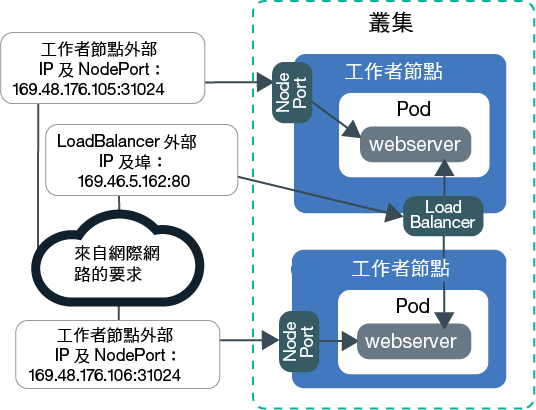
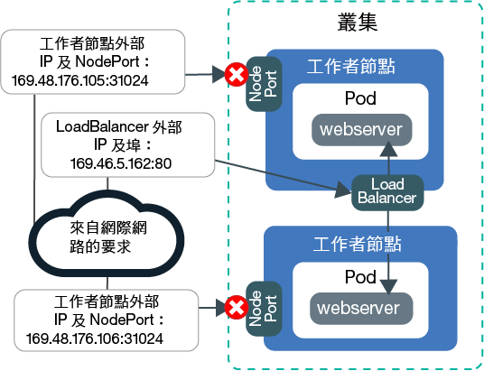
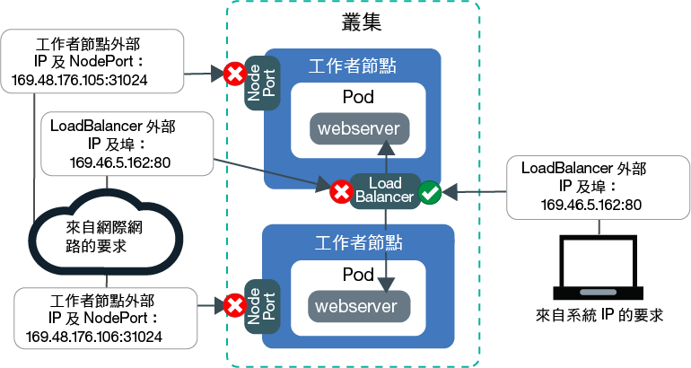
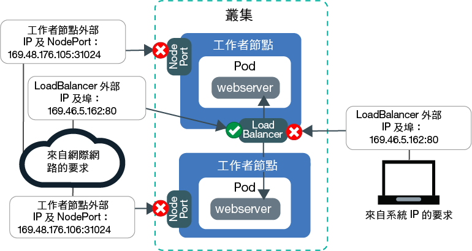

---

copyright:
  years: 2014, 2019
lastupdated: "2019-06-11"

keywords: kubernetes, iks

subcollection: containers

---

{:new_window: target="_blank"}
{:shortdesc: .shortdesc}
{:screen: .screen}
{:pre: .pre}
{:table: .aria-labeledby="caption"}
{:codeblock: .codeblock}
{:tip: .tip}
{:note: .note}
{:important: .important}
{:deprecated: .deprecated}
{:download: .download}
{:preview: .preview}


# 指導教學：使用 Calico 網路原則來封鎖資料流量
{: #policy_tutorial}

依預設，Kubernetes NodePort、LoadBalancer 及 Ingress 服務可讓您的應用程式能夠在所有公用及專用叢集網路介面上使用。`allow-node-port-dnat` 預設 Calico 原則允許從 NodePort、網路負載平衡器 (NLB) 及 Ingress 應用程式負載平衡器 (ALB) 服務送入那些服務所公開之應用程式 Pod 的資料流量。Kubernetes 會使用目的地網址轉譯 (DNAT) 將服務要求轉遞至正確的 Pod。
{: shortdesc}

不過，基於安全理由，您可能需要只容許從特定來源 IP 位址到網路服務的資料流量。您可以使用 [Calico DNAT 前原則 ](https://docs.projectcalico.org/v3.1/getting-started/bare-metal/policy/pre-dnat)，將來自或送至特定 IP 位址的資料流量列入白名單或黑名單。DNAT 前原則可防止指定的資料流量到達您的應用程式，因為在 Kubernetes 使用一般 DNAT 將資料流量轉遞至 Pod 之前，已套用這些原則。建立 Calico DNAT 前原則時，您可以選擇是否要將來源 IP 位址列入白名單或黑名單。對於大部分情境，白名單提供最安全的配置，因為除了來自已知允許之來源 IP 位址的資料流量外，所有資料流量都會遭到封鎖。黑名單通常只用於如下的情境：防止來自小型 IP 位址集的攻擊。

在此情境中，您扮演的是公關公司的網路管理者角色，且您會發現一些不尋常的資料流量正在攻擊您的應用程式。本指導教學中的課程將逐步引導您建立 Web 伺服器應用程式範例、使用網路負載平衡器 (NLB) 服務公開應用程式，以及同時使用白名單和黑名單 Calico 原則來保護應用程式避開不需要且不尋常的資料流量。

## 目標
{: #policies_objectives}

- 學習藉由建立高階 DNAT 前原則，以封鎖送入所有節點埠的所有資料流量。
- 學習藉由建立低階 DNAT 前原則，以容許列入白名單的來源 IP 位址存取 NLB 公用 IP 及埠。低階原則會置換高階原則。
- 學習藉由建立低階 DNAT 前原則，以封鎖列入黑名單的來源 IP 位址，讓它們無法存取 NLB 公用 IP 及埠。

## 所需時間
{: #policies_time}

1 小時

## 適用對象
{: #policies_audience}

本指導教學的適用對象是想要管理送至應用程式之網路資料流量的軟體開發人員及網路管理者。

## 必要條件
{: #policies_prereqs}

- [建立叢集](/docs/containers?topic=containers-clusters#clusters_ui)。
- [將 CLI 的目標設為叢集](/docs/containers?topic=containers-cs_cli_install#cs_cli_configure)。
- [安裝並配置 Calico CLI](/docs/containers?topic=containers-network_policies#cli_install)。
- 確保您具有用於 {{site.data.keyword.containerlong_notm}} 的下列 {{site.data.keyword.Bluemix_notm}} IAM 存取原則：
    - [任何平台角色](/docs/containers?topic=containers-users#platform)
    - [**撰寫者**或**管理員**服務角色](/docs/containers?topic=containers-users#platform)

<br />


## 課程 1：使用 NLB 來部署應用程式並將它公開
{: #lesson1}

第一課告訴您如何從多個 IP 位址及埠公開您的應用程式，以及公用資料流量是從哪裡進入您的叢集。
{: shortdesc}

開始部署要在整個指導教學中使用的 Web 伺服器應用程式範例。`echoserver` Web 伺服器顯示有關從用戶端與叢集建立的連線的資料，並且您可以測試對公關公司叢集的存取。然後，藉由建立網路負載平衡器 (NLB) 1.0 服務來公開應用程式。NLB 1.0 服務可讓您的應用程式透過 NLB 服務 IP 位址及工作者節點的節點埠來使用。

想要使用 Ingress 應用程式負載平衡器 (ALB) 嗎？[建立 Web 伺服器應用程式的服務](/docs/containers?topic=containers-ingress#public_inside_1)以及[建立 Web 伺服器應用程式的 Ingress 資源](/docs/containers?topic=containers-ingress#public_inside_4)，而非在步驟 3 及 4 中建立的 NLB。然後，執行 `ibmcloud ks albs --cluster <cluster_name>` 以取得 ALB 的公用 IP，並在整個指導教學中使用這些 IP 來取代 `<loadbalancer_IP>。`
{: tip}

下圖顯示在課程 1 結束時如何藉由公用節點埠及公用 NLB，在網際網路上公開 Web 伺服器應用程式：



1. 部署 Web 伺服器應用程式範例。與 Web 伺服器應用程式建立連線時，應用程式會以其在連線中收到的 HTTP 標頭回應。
    ```
    kubectl run webserver --image=k8s.gcr.io/echoserver:1.10 --replicas=3
    ```
    {: pre}

2. 驗證 Web 伺服器應用程式 Pod 的 **STATUS** 為 `Running`。
    ```
    kubectl get pods -o wide
    ```
    {: pre}

    輸出範例：
    ```
    NAME                         READY     STATUS    RESTARTS   AGE       IP               NODE
    webserver-855556f688-6dbsn   1/1       Running   0          1m        172.30.xxx.xxx   10.176.48.78
    webserver-855556f688-76rkp   1/1       Running   0          1m        172.30.xxx.xxx   10.176.48.78
    webserver-855556f688-xd849   1/1       Running   0          1m        172.30.xxx.xxx   10.176.48.78
    ```
    {: screen}

3. 若要在公用網際網路上公開應用程式，請在文字編輯器中建立一個稱為 `webserver-lb.yaml` 的 NLB 1.0 服務配置檔。
    ```
    apiVersion: v1
    kind: Service
    metadata:
      labels:
        run: webserver
      name: webserver-lb
    spec:
      type: LoadBalancer
      selector:
        run: webserver
      ports:
      - name: webserver-port
        port: 80
        protocol: TCP
        targetPort: 8080
    ```
    {: codeblock}

4. 部署 NLB。
    ```
    kubectl apply -f filepath/webserver-lb.yaml
    ```
    {: pre}

5. 驗證是否可以從您的電腦使用公用方式存取由 NLB 公開的應用程式。

    1. 取得 NLB 的公用 **EXTERNAL-IP** 位址。
        ```
        kubectl get svc -o wide
        ```
        {: pre}

        輸出範例：
    ```
        NAME           CLUSTER-IP       EXTERNAL-IP        PORT(S)        AGE       SELECTOR
        webserver-lb   172.21.xxx.xxx   169.xx.xxx.xxx     80:31024/TCP   2m        run=webserver
        ```
        {: screen}

    2. 建立提要文字檔，並將 NLB IP 複製到文字檔。提要將協助您在稍後的課程中更快速地使用這些值。

    3. 驗證您可使用公用方式存取 NLB 的外部 IP。
        ```
        curl --connect-timeout 10 <loadbalancer_IP>:80
        ```
        {: pre}

        下列輸出範例確認 NLB 會在 `169.1.1.1` 公用 NLB IP 位址上公開您的應用程式。`webserver-855556f688-76rkp` 應用程式 Pod 收到 Curl 要求：
        ```
        Hostname: webserver-855556f688-76rkp
        Pod Information:
            -no Pod information available-
        Server values:
            server_version=nginx: 1.13.3 - lua: 10008
        Request Information:
            client_address=1.1.1.1
            method=GET
            real path=/
            query=
            request_version=1.1
            request_scheme=http
            request_uri=http://169.1.1.1:8080/
        Request Headers:
            accept=*/*
            host=169.1.1.1
            user-agent=curl/7.54.0
        Request Body:
            -no body in request-
        ```
        {: screen}

6. 驗證是否可以從您的電腦使用公用方式存取由節點埠公開的應用程式。NLB 服務可讓您的應用程式透過 NLB 服務 IP 位址及工作者節點的節點埠來使用。

    1. 取得 NLB 指派給工作者節點的節點埠。節點埠位於 30000 到 32767 範圍內。
        ```
        kubectl get svc -o wide
        ```
        {: pre}

        在下列輸出範例中，節點埠為 `31024`：
        ```
        NAME           CLUSTER-IP       EXTERNAL-IP        PORT(S)        AGE       SELECTOR
        webserver-lb   172.21.xxx.xxx   169.xx.xxx.xxx     80:31024/TCP   2m        run=webserver
        ```
        {: screen}  

    2. 取得工作者節點的**公用 IP** 位址。
        ```
        ibmcloud ks workers --cluster <cluster_name>
        ```
        {: pre}

        輸出範例：
    ```
        ID                                                 Public IP        Private IP     Machine Type        State    Status   Zone    Version   
        kube-dal10-cr18e61e63c6e94b658596ca93d087eed9-w1   169.xx.xxx.xxx   10.176.48.67   u3c.2x4.encrypted   normal   Ready    dal10   1.13.6_1513*   
        kube-dal10-cr18e61e63c6e94b658596ca93d087eed9-w2   169.xx.xxx.xxx   10.176.48.79   u3c.2x4.encrypted   normal   Ready    dal10   1.13.6_1513*   
        kube-dal10-cr18e61e63c6e94b658596ca93d087eed9-w3   169.xx.xxx.xxx   10.176.48.78   u3c.2x4.encrypted   normal   Ready    dal10   1.13.6_1513*   
        ```
        {: screen}

    3. 將工作者節點及節點埠的公用 IP 複製到您的文字提要，以在稍後課程中使用。

    4. 驗證您可以透過節點埠存取工作者節點的公用 IP 位址。
        ```
        curl  --connect-timeout 10 <worker_IP>:<NodePort>
        ```
        {: pre}

        下列輸出範例確認，是透過工作者節點的專用 IP 位址 `10.1.1.1` 及 `31024` 節點埠，對您的應用程式提出要求。`webserver-855556f688-xd849` 應用程式 Pod 收到 Curl 要求：
        ```
        Hostname: webserver-855556f688-xd849
        Pod Information:
            -no Pod information available-
        Server values:
            server_version=nginx: 1.13.3 - lua: 10008
        Request Information:
            client_address=1.1.1.1
            method=GET
            real path=/
            query=
            request_version=1.1
            request_scheme=http
            request_uri=http://10.1.1.1:8080/
        Request Headers:
            accept=*/*
            host=10.1.1.1:31024
            user-agent=curl/7.60.0
        Request Body:
            -no body in request-
        ```
        {: screen}

此時，會從多個 IP 位址及埠公開您的應用程式。其中大部分 IP 都在叢集的內部，而且只能透過專用網路存取。只有公用節點埠及公用 NLB 埠，才會在公用網際網路公開。

接下來，您可以開始建立並套用 Calico 原則來封鎖公用資料流量。

## 課程 2：封鎖送入所有節點埠的所有資料流量
{: #lesson2}

若要保護公關公司的叢集，您必須封鎖對公開您應用程式之 NLB 服務及節點埠兩者的公開存取。首先，封鎖對節點埠的存取。
{: shortdesc}

下圖顯示在課程 2 結束時，如何允許資料流量流至 NLB，但不允許流至節點埠：



1. 在文字編輯器中，建立一個稱為 `deny-nodeports.yaml` 的高階 DNAT 前原則，來拒絕將 TCP 及 UDP 資料流量從任何來源 IP 送入所有節點埠。
    ```
    apiVersion: projectcalico.org/v3
    kind: GlobalNetworkPolicy
    metadata:
      name: deny-nodeports
    spec:
      applyOnForward: true
      preDNAT: true
      ingress:
      - action: Deny
            destination:
              ports:
          - 30000:32767
            protocol: TCP
            source: {}
      - action: Deny
            destination:
              ports:
          - 30000:32767
        protocol: UDP
        source: {}
      selector: ibm.role=='worker_public'
      order: 1100
      types:
      - Ingress
    ```
    {: codeblock}

2. 套用原則。
    - Linux：

      ```
      calicoctl apply -f filepath/deny-nodeports.yaml
      ```
      {: pre}

    - Windows 及 OS X：

      ```
      calicoctl apply -f filepath/deny-nodeports.yaml --config=filepath/calicoctl.cfg
      ```
      {: pre}
輸出範例：
    ```
  Successfully applied 1 'GlobalNetworkPolicy' resource(s)
  ```
  {: screen}

3. 使用來自提要的值，驗證您無法使用公用方式存取工作者節點公用 IP 位址及節點埠。
    ```
    curl  --connect-timeout 10 <worker_IP>:<NodePort>
    ```
    {: pre}

    連線逾時，因為您建立的 Calico 原則封鎖資料流量送入節點埠。
    ```
    curl: (28) Connection timed out after 10016 milliseconds
    ```
    {: screen}

4. 將上一課中建立的 LoadBalancer 的 externalTrafficPolicy 從 `Cluster` 變更為 `Local`。`Local` 可確保在下一步中對 LoadBalancer 的外部 IP 執行 curl 指令時保留系統的來源 IP。
    ```
    kubectl patch svc webserver -p '{"spec":{"externalTrafficPolicy":"Local"}}'
    ```
    {: pre}

5. 使用來自提要的值，驗證您仍然可使用公用方式存取 NLB 外部 IP 位址。
    ```
    curl --connect-timeout 10 <loadbalancer_IP>:80
    ```
    {: pre}

    輸出範例：
    ```
    Hostname: webserver-855556f688-76rkp
    Pod Information:
        -no Pod information available-
    Server values:
        server_version=nginx: 1.13.3 - lua: 10008
    Request Information:
        client_address=1.1.1.1
        method=GET
        real path=/
        query=
        request_version=1.1
        request_scheme=http
        request_uri=http://<loadbalancer_IP>:8080/
    Request Headers:
        accept=*/*
        host=<loadbalancer_IP>
        user-agent=curl/7.54.0
    Request Body:
        -no body in request-
    ```
    {: screen}
    例如，在輸出的 `Request Information` 區段中，來源 IP 位址為 `client_address=1.1.1.1`。來源 IP 位址是您要用來執行 Curl 之系統的公用 IP。否則，如果您是透過 Proxy 或 VPN 連接至網際網路，則 Proxy 或 VPN 可能會遮蔽系統的實際 IP 位址。在任一情況下，NLB 會將您系統的來源 IP 位址看成用戶端 IP 位址。

6. 將您系統的來源 IP 位址（前一個步驟輸出中的 `client_address=1.1.1.1`）複製到您的提要，以在稍後課桯中使用。

太棒了！此時，只會從公用 NLB 埠，在公用網際網路上公開您的應用程式。送入公用節點埠的資料流量會遭到封鎖。已局部鎖定叢集以阻止不需要的資料流量。

接下檢，您可以建立並套用 Calico 原則，將來自特定來源 IP 的資料流量列入白名單。

## 課程 3：容許從列入白名單的 IP 送入 NLB 的資料流量 
{: #lesson3}

您現在決定將資料流量完全鎖定至 PR 公司的叢集，並依白名單僅選取自己的電腦的 IP 位址，以進行測試存取。
{: shortdesc}

首先，除了節點埠之外，您還必須封鎖送入公開應用程式之 NLB 的所有資料流量。然後，您可以建立一個原則，將系統的 IP 位址列入白名單。在課程 3 結束時，將封鎖送入公用節點埠及 NLB 的所有資料流量，而且僅容許來自列入白名單之系統 IP 的資料流量：



1. 在文字編輯器中，建立一個稱為 `deny-lb-port-80.yaml` 的高階 DNAT 前原則，來拒絕從任何來源 IP 送入 NLB IP 位址及埠的所有 TCP 及 UDP 資料流量。將 `<loadbalancer_IP>` 取代為來自提要的 NLB 公用 IP 位址。

    ```
    apiVersion: projectcalico.org/v3
    kind: GlobalNetworkPolicy
    metadata:
      name: deny-lb-port-80
    spec:
      applyOnForward: true
      preDNAT: true
      ingress:
      - action: Deny
        destination:
          nets:
          - <loadbalancer_IP>/32
          ports:
          - 80
        protocol: TCP
        source: {}
      - action: Deny
        destination:
          nets:
          - <loadbalancer_IP>/32
          ports:
          - 80
        protocol: UDP
        source: {}
      selector: ibm.role=='worker_public'
      order: 800
      types:
      - Ingress
    ```
    {: codeblock}

2. 套用原則。
    - Linux：

      ```
      calicoctl apply -f filepath/deny-lb-port-80.yaml
      ```
      {: pre}

    - Windows 及 OS X：

      ```
      calicoctl apply -f filepath/deny-lb-port-80.yaml --config=filepath/calicoctl.cfg
      ```
      {: pre}

3. 使用來自提要的值，驗證您現在無法存取公用 NLB IP 位址。連線逾時，因為您建立的 Calico 原則封鎖送入 NLB 的資料流量。
    ```
    curl --connect-timeout 10 <loadbalancer_IP>:80
    ```
    {: pre}

4. 在文字編輯器中，建立一個稱為 `whitelist.yaml` 的低階 DNAT 前原則，來容許從系統的 IP 送入 NLB IP 位址及埠的資料流量。使用來自提要的值，將 `<loadbalancer_IP>` 取代為 NLB 的公用 IP 位址，並將 `<client_address>` 取代為系統來源 IP 的公用 IP 位址。
    如果記不住系統 IP，可以執行 `curl ifconfig.co`。
    ```
    apiVersion: projectcalico.org/v3
    kind: GlobalNetworkPolicy
    metadata:
      name: whitelist
    spec:
      applyOnForward: true
      preDNAT: true
      ingress:
      - action: Allow
        destination:
          nets:
          - <loadbalancer_IP>/32
          ports:
          - 80
        protocol: TCP
        source:
          nets:
          - <client_address>/32
      selector: ibm.role=='worker_public'
      order: 500
      types:
      - Ingress
    ```
    {: codeblock}

5. 套用原則。
    - Linux：

      ```
      calicoctl apply -f filepath/whitelist.yaml
      ```
      {: pre}

    - Windows 及 OS X：

      ```
      calicoctl apply -f filepath/whitelist.yaml --config=filepath/calicoctl.cfg
      ```
      {: pre}
  您系統的 IP 位址現在已列入白名單。

6. 使用來自提要的值，驗證您現在可以存取公用 NLB IP 位址。
    ```
    curl --connect-timeout 10 <loadbalancer_IP>:80
    ```
    {: pre}

7. 如果您可以存取另一個具有不同 IP 位址的系統，請嘗試從該系統存取 NLB。
    ```
    curl --connect-timeout 10 <loadbalancer_IP>:80
    ```
    {: pre}
    連線逾時，因為該系統的 IP 位址未列入白名單。

此時，所有送入公用節點埠及 NLB 的資料流量都會遭到封鎖。只容許來自已列入白名單之系統 IP 的資料流量。

## 課程 4：拒絕從列入黑名單的 IP 送入 NLB 的資料流量
{: #lesson4}

在前一課中，您已封鎖所有資料流量，並只將少數 IP 列入白名單。當您想要限制只存取少數受管制的來源 IP 位址時，該情境適用於測試目的。不過，公關公司具有需要大眾可以廣泛使用的應用程式。您需要確定允許所有資料流量，但您從少數 IP 位址看到的不尋常資料流量除外。黑名單有助於這類情境，因為它可以協助您防止來自小型 IP 位址集的攻擊。
{: shortdesc}

在本課程中，您將藉由封鎖來自您自己系統之來源 IP 位址的資料流量，來測試黑名單。在課程 4 結束時，將封鎖所有送入公用節點埠的資料流量，而且將容許所有送入公用 NLB 的資料流量。只會封鎖從列入黑名單之系統 IP 送入 NLB 的資料流量：



1. 清除您在前一課中建立的白名單原則。
    
    - Linux：
      ```
      calicoctl delete GlobalNetworkPolicy deny-lb-port-80
      ```
      {: pre}
      ```
      calicoctl delete GlobalNetworkPolicy whitelist
      ```
      {: pre}

    - Windows 及 OS X：
      ```
      calicoctl delete GlobalNetworkPolicy deny-lb-port-80 --config=filepath/calicoctl.cfg
      ```
      {: pre}
      ```
      calicoctl delete GlobalNetworkPolicy whitelist --config=filepath/calicoctl.cfg
      ```
      {: pre}

    現在，再次允許從任何來源 IP 送入 NLB IP 位址及埠的所有 TCP 及 UDP 資料流量。

2. 若要拒絕將從您系統的來源 IP 位址送入 NLB IP 位址及埠的所有 TCP 及 UDP 資料流量，請在文字編輯器中建立一個稱為 `blacklist.yaml` 的低階 DNAT 前原則。使用來自提要的值，將 `<loadbalancer_IP>` 取代為 NLB 的公用 IP 位址，並將 `<client_address>` 取代為系統來源 IP 的公用 IP 位址。
    
  ```
  apiVersion: projectcalico.org/v3
  kind: GlobalNetworkPolicy
  metadata:
    name: blacklist
  spec:
    applyOnForward: true
    preDNAT: true
    ingress:
    - action: Deny
      destination:
        nets:
        - <loadbalancer_IP>/32
        ports:
        - 80
      protocol: TCP
      source:
        nets:
        - <client_address>/32
    - action: Deny
      destination:
        nets:
        - <loadbalancer_IP>/32
        ports:
        - 80
      protocol: UDP
      source:
        nets:
        - <client_address>/32
    selector: ibm.role=='worker_public'
    order: 500
    types:
    - Ingress
  ```
  {: codeblock}

3. 套用原則。
    - Linux：

      ```
      calicoctl apply -f filepath/blacklist.yaml
      ```
      {: pre}

    - Windows 及 OS X：

      ```
      calicoctl apply -f filepath/blacklist.yaml --config=filepath/calicoctl.cfg
      ```
      {: pre}
  您系統的 IP 位址現在已列入黑名單。

4. 使用來自提要的值，從您的系統驗證您無法存取 NLB IP，因為您系統的 IP 已被列入黑名單。
    ```
    curl --connect-timeout 10 <loadbalancer_IP>:80
    ```
    {: pre}
    此時，會封鎖所有送入公用節點埠的資料流量，而且容許所有送入公用 NLB 的資料流量。只會封鎖從列入黑名單之系統 IP 送入 NLB 的資料流量。

做得好！您已透過使用 Calico DNAT 前原則將來源 IP 列入黑名單，順利控制流向應用程式的資料流量。

## 課程 5：記載從列入黑名單的 IP 送入 NLB 的遭封鎖資料流量
{: #lesson5}

在前一課中，您已將從系統 IP 送入 NLB 的資料流量列入黑名單。在本課程中，您可以學習如何記載拒絕的資料流量要求。
{: shortdesc}

在我們的範例情境中，您工作的公關公司想要您設定記載追蹤來記載不斷遭到其中一個網路原則拒絕的任何異常資料流量。若要監視潛在的安全威脅，請設定記載，在每次黑名單原則拒絕對 NLB IP 的嘗試動作時進行記錄。

1. 建立名稱為 `log-denied-packets` 的 Calico NetworkPolicy。此日誌原則會使用與 `blacklist` 原則相同的選取器，以將此原則新增至 Calico Iptables 規則鏈。透過使用更低階的數字（例如，`300`），可確保將此規則新增到 Iptables 規則鏈中 blacklist 原則之前。此原則會先記載來自您 IP 的封包，再嘗試相符 `blacklist` 原則規則，但遭拒絕。
  ```
  apiVersion: projectcalico.org/v3
  kind: GlobalNetworkPolicy
  metadata:
    name: log-denied-packets
  spec:
    applyOnForward: true
    preDNAT: true
    ingress:
    - action: Log
      destination:
        nets:
        - <loadbalancer_IP>/32
        ports:
        - 80
      protocol: TCP
      source:
        nets:
        - <client_address>/32
    - action: Deny
      destination:
        nets:
        - <loadbalancer_IP>/32
        ports:
        - 80
      protocol: UDP
      source:
        nets:
        - <client_address>/32
    selector: ibm.role=='worker_public'
    order: 300
    types:
    - Ingress
  ```
  {: codeblock}

2. 套用原則。
  ```
    calicoctl apply -f log-denied-packets.yaml --config=<filepath>/calicoctl.cfg
    ```
  {: pre}

3. 將要求從系統 IP 傳送至 NLB IP，以產生日誌項目。在拒絕這些要求封包之前，會先行記載。
  ```
    curl --connect-timeout 10 <loadbalancer_IP>:80
    ```
  {: pre}

4. 檢查寫入 `/var/log/syslog` 路徑的日誌項目。日誌項目會與下列內容類似。
  ```
  Sep 5 14:34:40 <worker_hostname> kernel: [158271.044316] calico-packet: IN=eth1 OUT= MAC=08:00:27:d5:4e:57:0a:00:27:00:00:00:08:00 SRC=192.XXX.XX.X DST=192.XXX.XX.XX LEN=60 TOS=0x00 PREC=0x00 TTL=64 ID=52866 DF PROTO=TCP SPT=42962 DPT=22 WINDOW=29200 RES=0x00 SYN URGP=0
  ```
  {: screen}

太棒了！您已設定記載，現在可以更輕鬆地監視列入黑名單的資料流量。

如果您要清除黑名單及日誌原則，請執行下列動作：
1. 清除黑名單原則。
    - Linux：
      ```
      calicoctl delete GlobalNetworkPolicy blacklist
      ```
      {: pre}

    - Windows 及 OS X：
      ```
      calicoctl delete GlobalNetworkPolicy blacklist --config=filepath/calicoctl.cfg
      ```
      {: pre}

2. 清除日誌原則。
    - Linux：
      ```
      calicoctl delete GlobalNetworkPolicy log-denied-packets
      ```
      {: pre}

    - Windows 及 OS X：
      ```
      calicoctl delete GlobalNetworkPolicy log-denied-packets --config=filepath/calicoctl.cfg
      ```
      {: pre}

## 下一步為何？
{: #whats_next}

* 深入閱讀[使用網路原則控制資料流量](/docs/containers?topic=containers-network_policies)。
* 如需其他控制資料流量進出叢集的 Calico 網路原則範例，請參閱[主要原則展示 ](https://docs.projectcalico.org/v3.1/getting-started/kubernetes/tutorials/stars-policy/) 及[進階網路原則 ](https://docs.projectcalico.org/v3.1/getting-started/kubernetes/tutorials/advanced-policy)。
