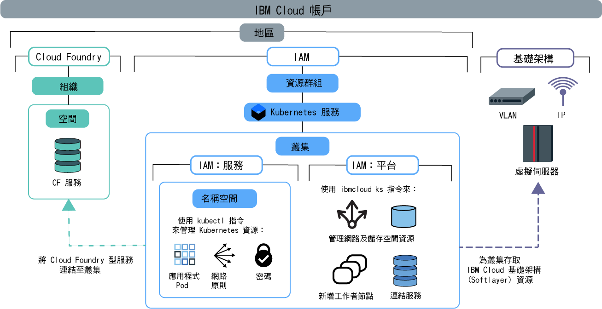

---

copyright:
  years: 2014, 2019
lastupdated: "2019-06-12"

keywords: kubernetes, iks

subcollection: containers

---

{:new_window: target="blank"}
{:shortdesc: .shortdesc}
{:screen: .screen}
{:pre: .pre}
{:table: .aria-labeledby="caption"}
{:codeblock: .codeblock}
{:tip: .tip}
{:note: .note}
{:important: .important}
{:deprecated: .deprecated}
{:download: .download}
{:preview: .preview}


# 指派叢集存取
{: #users}

當您作為叢集管理者時，可以為 {{site.data.keyword.containerlong}} 叢集定義存取原則，以針對不同使用者建立不同的存取層次。例如，您可以授權某些使用者能使用叢集基礎架構資源，而其他使用者則只能部署容器。
{: shortdesc}

自 2019 年 1 月 30 日起，{{site.data.keyword.containerlong_notm}} 提供一個使用 {{site.data.keyword.Bluemix_notm}} IAM 來授權使用者的新方法：[服務存取角色](/docs/containers?topic=containers-access_reference#service)。這些服務角色用來授與對叢集裡資源（例如 Kubernetes 名稱空間）的存取權。如需相關資訊，請參閱部落格 [Introducing service roles and namespaces in IAM for more granular control of cluster access ](https://www.ibm.com/blogs/bluemix/2019/02/introducing-service-roles-and-namespaces-in-iam-for-more-granular-control-of-cluster-access/)。
{: note}

## 瞭解存取原則及角色
{: #access_policies}

存取原則決定 {{site.data.keyword.Bluemix_notm}} 帳戶中使用者對跨 {{site.data.keyword.Bluemix_notm}} 平台之資源的存取層次。原則會將一個以上的角色指派給使用者，而角色定義單一服務的存取範圍，或定義資源群組中組織在一起之一組服務及資源的存取範圍。{{site.data.keyword.Bluemix_notm}} 中的每個服務都可能需要它自己的一組存取原則。
{: shortdesc}

在您開發方案以管理使用者存取時，請考量下列一般步驟：
1.  [挑選使用者的正確存取原則及角色](#access_roles)
2.  [在 {{site.data.keyword.Bluemix_notm}} IAM 中將存取角色指派給個別使用者或使用者群組](#iam_individuals_groups)
3.  [限定使用者存取叢集實例、Kubernetes 名稱空間或資源群組](#resource_groups)

在瞭解如何管理您帳戶中的角色、使用者及資源之後，請參閱[設定叢集存取權](#access-checklist)，以取得如何配置存取權的核對清單。

### 挑選使用者的正確存取原則及角色
{: #access_roles}

您必須針對使用 {{site.data.keyword.containerlong_notm}} 的每一個使用者定義存取原則。存取原則的範圍是根據使用者定義的角色，來決定使用者可以執行的動作。部分原則是預先定義的，但可以自訂其他原則。不論使用者是從 {{site.data.keyword.containerlong_notm}} 主控台還是透過 CLI 提出要求，都會強制執行相同的原則，即使是在 IBM Cloud 基礎架構 (SoftLayer) 中完成動作。
{: shortdesc}

下圖顯示不同類型的許可權及角色、哪個角色可以執行哪種類型的動作，以及角色彼此的關係。



若要查看每個角色的特定 {{site.data.keyword.containerlong_notm}} 許可權，請參閱[使用者存取權](/docs/containers?topic=containers-access_reference)參照主題。
{: tip}

<dl>
<dt><a href="#platform">{{site.data.keyword.Bluemix_notm}} IAM 平台及服務角色</a></dt>
<dd>{{site.data.keyword.containerlong_notm}} 使用 {{site.data.keyword.Bluemix_notm}} Identity and Access Management (IAM) 平台及服務角色，來授與使用者對叢集的存取權。
<ul><li>**平台**：平台角色決定使用者可以藉由使用 {{site.data.keyword.containerlong_notm}} API、主控台及 CLI (`ibmcloud ks`) 對叢集基礎架構執行的動作。平台角色不會授與對 Kubernetes API 的存取權。您可以依資源群組、地區或叢集實例來設定這些角色的原則。雖然平台角色會授權您對叢集執行基礎架構動作，但不會授與對 IBM Cloud 基礎架構 (SoftLayer) 資源的存取權。對 IBM Cloud 基礎架構 (SoftLayer) 資源的存取權，取決於[針對地區所設定的 API 金鑰](#api_key)。平台角色所允許的動作範例包括建立或移除叢集、將服務連結至叢集，管理網路與儲存空間資源，或新增額外的工作者節點。<br><br>如果您僅將平台角色指派給使用者，則他們無法與叢集內的 Kubernetes 資源互動。不過，他們仍然可以執行 `ibmcloud ks cluster-config` [指令](/docs/containers?topic=containers-cli-plugin-kubernetes-service-cli#cs_cluster_config)。然後，您可以使用[自訂 RBAC 原則](/docs/containers?topic=containers-users#role-binding)，授權使用者執行精選的 Kubernetes 動作。如果您的組織目前使用自訂 RBAC 原則來控制 Kubernetes 存取權，並且計劃繼續使用自訂 RBAC 原則，而非服務角色，則您可以執行此動作。</li>
<li>**服務**：服務角色會授與在叢集內提供給使用者的對應 Kubernetes RBAC 原則。因此，服務角色會授與對 Kubernetes API、儀表板及 CLI (`kubectl`) 的存取權。您可以依資源群組、地區或叢集實例來限定服務角色的原則範圍。此外，您還可以將服務角色範圍限定為所有、個別或整個地區之叢集裡的 Kubernetes 名稱空間。當您將服務角色範圍限定為名稱空間時，無法將原則套用至資源群組或同時指派一個平台角色。服務角色所允許的動作範例包括建立應用程式部署、新增名稱空間，或設定 configmap。<br><br>如果您僅將服務角色指派給使用者，則他們無法檢視任何 {{site.data.keyword.containerlong_notm}} 資源，也無法與其互動。為了讓使用者能夠存取叢集，並使用叢集的 Kubernetes 資源，您必須提供使用者叢集名稱和 ID，以便他們可以執行 `ibmcloud ks cluster-config` [指令](/docs/containers?topic=containers-cli-plugin-kubernetes-service-cli#cs_cluster_config)，然後[從 CLI 啟動 Kubernetes 儀表板](/docs/containers?topic=containers-app#db_cli)。如果您想要這些使用者仍然可以存取 {{site.data.keyword.containerlong_notm}} 叢集主控台，以及從 CLI 列出叢集與其他基礎架構資源，則請將平台**檢視者**角色提供給使用者。</li></ul></dd>
<dt><a href="#role-binding">RBAC</a></dt>
<dd>在 Kubernetes 中，角色型存取控制 (RBAC) 是保護叢集內資源的一種方式。RBAC 角色決定使用者可對那些資源執行的 Kubernetes 動作。獲指派服務角色的每位使用者，都會自動獲指派對應的 RBAC 叢集角色。此 RBAC 叢集角色會套用至特定名稱空間或所有名稱空間，視您是否將原則範圍限定為名稱空間而定。</br></br>
RBAC 角色所允許的範例動作是建立 Pod 這類物件或是讀取 Pod 日誌。</dd>
<dt><a href="#api_key">基礎架構</a></dt>
<dd>基礎架構角色可存取您的 IBM Cloud 基礎架構 (SoftLayer) 資源。設定具有**超級使用者**基礎架構角色的使用者，並將此使用者的基礎架構認證儲存在 API 金鑰。然後，在您要建立叢集的每個地區中設定 API 金鑰。設定 API 金鑰之後，您授與 {{site.data.keyword.containerlong_notm}} 存取權的其他使用者就不需要基礎架構角色，因為該地區內的所有使用者都會共用此 API 金鑰。相反地，{{site.data.keyword.Bluemix_notm}} IAM 平台角色決定容許使用者執行的基礎架構動作。如果您未使用完整<strong>超級使用者</strong>基礎架構來設定 API 金鑰，或您需要將特定裝置存取權授與使用者，則可以[自訂基礎架構許可權](#infra_access)。</br></br>
基礎架構角色所允許的範例動作將會檢視叢集工作者節點機器的詳細資料，或編輯網路及儲存空間資源。</dd>
<dt>Cloud Foundry</dt>
<dd>無法使用 {{site.data.keyword.Bluemix_notm}} IAM 來管理所有服務。如果您是使用其中一個服務，則可以繼續使用 Cloud Foundry 使用者角色來控制對這些服務的存取。Cloud Foundry 角色會授與對帳戶內組織及空間的存取權。若要查看 {{site.data.keyword.Bluemix_notm}} 中的 Cloud Foundry 型服務清單，請執行 <code>ibmcloud service list</code>。</br></br>
Cloud Foundry 角色所允許的範例動作是建立新的 Cloud Foundry 服務實例，或是將 Cloud Foundry 服務實例連結至叢集。若要進一步瞭解，請參閱 {{site.data.keyword.Bluemix_notm}} IAM 文件中的可用[組織和空間角色](/docs/iam?topic=iam-cfaccess)或[管理 Cloud Foundry 存取權](/docs/iam?topic=iam-mngcf)的步驟。</dd>
</dl>

### 在 {{site.data.keyword.Bluemix_notm}} IAM 中將存取角色指派給個別使用者或使用者群組
{: #iam_individuals_groups}

當您設定 {{site.data.keyword.Bluemix_notm}} IAM 原則時，可以將角色指派給個別使用者或使用者群組。
{: shortdesc}

<dl>
<dt>個別使用者</dt>
<dd>您可能有一個特定使用者，比您的其餘團隊成員需要更多或更少的許可權。您可以根據個別使用者來自訂許可權，讓每個人員都有完成其作業的必要許可權。您可以將多個 {{site.data.keyword.Bluemix_notm}} IAM 角色指派給每位使用者。</dd>
<dt>存取群組中的多個使用者</dt>
<dd>您可以建立使用者群組，然後將許可權指派給該群組。例如，您可以將所有團隊領導人分組，並將群組的存取權指派給管理者。然後，您可以將所有開發人員分組，並僅指派該群組的寫入權。您可以將多個 {{site.data.keyword.Bluemix_notm}} IAM 角色指派給每個存取群組。將許可權指派給群組時，會影響新增至該群組或從該群組移除的任何使用者。如果您將使用者新增至群組，他們也會有額外的存取權。如果移除他們，則會撤銷其存取權。
</dd>
</dl>

{{site.data.keyword.Bluemix_notm}} IAM 角色無法指派給服務帳戶。相反地，您可以直接[將 RBAC 角色指派給服務帳戶](#rbac)。
{: tip}

您也必須指定使用者是否有權存取資源群組中的某個叢集、資源群組中的所有叢集，或您帳戶中所有資源群組的所有叢集。

### 將使用者存取權限定為叢集實例、名稱空間或資源群組
{: #resource_groups}

在 {{site.data.keyword.Bluemix_notm}} IAM 中，您可以指派使用者對於資源實例、Kubernetes 名稱空間或資源群組的存取角色。
{: shortdesc}

當您建立 {{site.data.keyword.Bluemix_notm}} 帳戶時，會自動建立 default 資源群組。如果您在建立資源時未指定資源群組，則資源實例（叢集）屬於 default 資源群組。在 {{site.data.keyword.Bluemix_notm}} IAM 中，Kubernetes 名稱空間是類型為資源實例（叢集）的資源。如果您要在帳戶中新增資源群組，請參閱[設定帳戶的最佳作法](/docs/account?topic=account-account_setup)及[設定資源群組](/docs/resources?topic=resources-bp_resourcegroups#setuprgs)。

<dl>
<dt>資源實例</dt>
  <dd><p>您帳戶中的每個 {{site.data.keyword.Bluemix_notm}} 服務都是具有實例的資源。實例會依服務而不同。例如，在 {{site.data.keyword.containerlong_notm}} 中，實例是叢集，但在 {{site.data.keyword.cloudcerts_long_notm}} 中，實例是憑證。依預設，資源也屬於您帳戶中的 default 資源群組。在下列情境中，您可以將資源實例的存取角色指派給使用者。
  <ul><li>您帳戶中的所有 {{site.data.keyword.Bluemix_notm}} IAM 服務（包括 {{site.data.keyword.containerlong_notm}} 中的所有叢集，以及 {{site.data.keyword.registrylong_notm}} 中的映像檔）。</li>
  <li>服務內的所有實例（例如 {{site.data.keyword.containerlong_notm}} 中的所有叢集）。</li>
  <li>服務地區內的所有實例（例如 {{site.data.keyword.containerlong_notm}} 之**美國南部**地區中的所有叢集）。</li>
  <li>個別實例（例如某個叢集）。</li></ul></dd>
<dt>Kubernetes 名稱空間</dt>
  <dd><p>作為 {{site.data.keyword.Bluemix_notm}} IAM 中叢集資源實例的一部分，您可以將具有服務存取角色的使用者指派給叢集內的 Kubernetes 名稱空間。</p>
  <p>當您指派對名稱空間的存取權時，原則會套用至您授權之所有叢集裡的所有現行及未來的名稱空間實例。例如，假設您想要隸屬於 `dev` 群組的使用者，能夠針對 AP North 中您所有叢集裡的 `test` 名稱空間，部署其中的 Kubernetes 資源。如果您針對 `default` 資源群組內 AP North 地區中的所有叢集，將用於叢集裡 Kubernetes 名稱空間測試的**撰寫者**服務存取角色，指派給 `dev` 存取群組，則 `dev` 群組可以在 `default` 資源群組中，存取目前擁有或最後會擁有測試名稱空間之任何 AP North 叢集裡的 `test` 名稱空間。</p>
  <p class="important">如果您將服務角色範圍限定為名稱空間，則無法將原則套用至資源群組或同時指派一個平台角色。</p></dd>
<dt>資源群組</dt>
  <dd><p>您可以將帳戶資源組織為可自訂分組，讓您可以一次快速地指派個別使用者或使用者群組對多個資源的存取權。資源群組可以協助操作員及管理者過濾資源，以檢視其現行用量、問題疑難排解以及管理團隊。</p>
  <p class="important">只能在一個資源群組中建立一個叢集，之後就無法進行變更。如果您在錯誤的資源群組中建立叢集，則必須刪除叢集，然後在正確的資源群組中予以重建。此外，如果您需要使用 `ibmcloud ks cluster-service-bind` [指令](/docs/containers-cli-plugin?topic=containers-cli-plugin-kubernetes-service-cli#cs_cluster_service_bind)來進行[與 {{site.data.keyword.Bluemix_notm}} 服務的整合](/docs/containers?topic=containers-service-binding#bind-services)，則該服務必須與叢集位於相同的資源群組中。未使用 {{site.data.keyword.registrylong_notm}} 這類資源群組或不需要 {{site.data.keyword.la_full_notm}} 這類服務連結的服務都會運作，即使叢集位於不同的資源群組中。</p>
  <p>如果您計劃使用 [{{site.data.keyword.monitoringlong_notm}} 取得度量值](/docs/containers?topic=containers-health#view_metrics)，請考量提供叢集的名稱，而該名稱在帳戶的所有資源群組和地區中必須是唯一的，以避免發生度量值命名衝突。您無法重新命名叢集。</p>
  <p>在下列情境中，您可以將資源群組的存取角色指派給使用者。請注意，與資源實例不同，您無法授與資源群組內個別實例的存取權。</p>
  <ul><li>資源群組中的所有 {{site.data.keyword.Bluemix_notm}} IAM 服務（包括 {{site.data.keyword.containerlong_notm}} 中的所有叢集，以及 {{site.data.keyword.registrylong_notm}} 中的映像檔）。</li>
  <li>資源群組中服務內的所有實例（例如 {{site.data.keyword.containerlong_notm}} 中的所有叢集）。</li>
  <li>資源群組中服務地區內的所有實例（例如 {{site.data.keyword.containerlong_notm}} 之**美國南部**地區中的所有叢集）。</li></ul></dd>
</dl>

<br />


## 設定對叢集的存取權
{: #access-checklist}

在您[瞭解如何管理您帳戶中的角色、使用者及資源](#access_policies)之後，請使用下列核對清單來配置叢集裡的使用者存取權。
{: shortdesc}

<p class="tip">不要同時指派 {{site.data.keyword.Bluemix_notm}} IAM 平台角色與服務角色。您必須個別指派平台角色及服務角色。</p>

1. 針對您要建立叢集的所有地區及資源群組，[設定 API 金鑰](#api_key)。
2. 邀請使用者加入您的帳戶，並針對 {{site.data.keyword.containerlong_notm}} [指派其 {{site.data.keyword.Bluemix_notm}} IAM 角色](#platform)。
3. 若要容許使用者將服務連結至叢集，或檢視從叢集記載配置轉遞的日誌，請針對已部署服務或日誌收集所在的組織及空間，[將 Cloud Foundry 角色授與使用者](/docs/iam?topic=iam-mngcf)。
4. 如果您使用 Kubernetes 名稱空間來隔離叢集內的資源，則透過[將名稱空間的 {{site.data.keyword.Bluemix_notm}} IAM 服務角色指派給使用者](#platform)，便可授與對名稱空間的存取權。
5. 對於任何自動化工具（例如在 CI/CD 管線中），設定服務帳戶，以及[將 Kubernetes RBAC 許可權指派給服務帳戶](#rbac)。
6. 如需其他進階配置以控制 Pod 層次對叢集資源的存取權，請參閱[配置 Pod 安全](/docs/containers?topic=containers-psp)。

</br>

如需設定帳戶及資源的相關資訊，請試用本指導教學中[組織使用者、團隊及應用程式的最佳作法](/docs/tutorials?topic=solution-tutorials-users-teams-applications)的相關內容。
{: tip}

<br />


## 設定 API 金鑰以啟用存取基礎架構組合
{: #api_key}

若要順利佈建和使用叢集，必須確保 {{site.data.keyword.Bluemix_notm}} 帳戶已正確設定為存取叢集所在的每個資源群組和地區中的 IBM Cloud 基礎架構 (SoftLayer) 組合。
{: shortdesc}

**大部分情況**：您的 {{site.data.keyword.Bluemix_notm}}「隨收隨付制」帳戶已有權存取 IBM Cloud 基礎架構 (SoftLayer) 組合。若要設定 {{site.data.keyword.containerlong_notm}} 來存取該組合，**帳戶擁有者**必須設定地區及資源群組的 API 金鑰。

1. 以帳戶擁有者身分登入終端機。
    ```
    ibmcloud login [--sso]
    ```
    {: pre}

2. 將您要設定 API 金鑰的資源群組設為目標。如果您未將目標設為資源群組，則會針對 default 資源群組設定 API 金鑰。若要列出可用的資源群組，請執行 `ibmcloud resource groups`。
    ```
    ibmcloud target -g <resource_group_name>
    ```
    {:pre}

3. 設定地區及資源群組的 API 金鑰。
    ```
    ibmcloud ks api-key-reset --region <region>
    ```
    {: pre}    

4. 驗證已設定 API 金鑰。
    ```
        ibmcloud ks api-key-info --cluster <cluster_name_or_ID>
        ```
    {: pre}

5. 針對您要建立叢集的每個地區及資源群組，重複該步驟。

**替代選項及相關資訊**：如需存取 IBM Cloud 基礎架構 (SoftLayer) 組合的不同方式，請參閱下列各節。
* 如果不確定您的帳戶是否已可存取 IBM Cloud 基礎架構 (SoftLayer) 組合，請參閱[瞭解 IBM Cloud 基礎架構 (SoftLayer) 組合存取權](#understand_infra)。
* 如果帳戶擁有者未設定 API 金鑰，請[確定設定 API 金鑰的使用者具有正確許可權](#owner_permissions)。
* 如需使用預設帳戶來設定 API 金鑰的相關資訊，請參閱[使用預設 {{site.data.keyword.Bluemix_notm}} 隨收隨付制帳戶存取基礎架構組合](#default_account)。
* 如果您沒有預設「隨收隨付制」帳戶，或需要使用不同的 IBM Cloud 基礎架構 (SoftLayer) 帳戶，請參閱[存取不同的 IBM Cloud 基礎架構 (SoftLayer) 帳戶](#credentials)。

### 瞭解 IBM Cloud 基礎架構 (SoftLayer) 組合存取權
{: #understand_infra}

判定您的帳戶是否可存取 IBM Cloud 基礎架構 (SoftLayer) 組合，並瞭解 {{site.data.keyword.containerlong_notm}} 如何使用 API 金鑰存取組合。
{: shortdesc}

**我的帳戶是否已有權存取 IBM Cloud 基礎架構 (SoftLayer) 組合？**</br>

若要存取 IBM Cloud 基礎架構 (SoftLayer) 組合，您可以使用 {{site.data.keyword.Bluemix_notm}}「隨收隨付制」帳戶。如果您有不同類型的帳戶，則請檢視下表中的選項。

<table summary="表格依帳戶類型顯示標準叢集建立選項。列應該從左到右閱讀，第一欄為帳戶說明，第二欄為建立標準叢集的選項。">
    <caption>依帳戶類型的標準叢集建立選項</caption>
  <thead>
  <th>帳戶說明</th>
  <th>建立標準叢集的選項</th>
  </thead>
  <tbody>
    <tr>
      <td>**精簡帳戶**無法佈建叢集。</td>
      <td>[將精簡帳戶升級至 {{site.data.keyword.Bluemix_notm}} 隨收隨付制帳戶](/docs/account?topic=account-accounts#paygo)。</td>
    </tr>
    <tr>
      <td>**隨收隨付制**帳戶隨附對基礎架構組合的存取權。</td>
      <td>您可以建立標準叢集。使用 API 金鑰來設定叢集的基礎架構許可權。</td>
    </tr>
    <tr>
      <td>**訂閱帳戶**未設定對 IBM Cloud 基礎架構 (SoftLayer) 組合的存取權。</td>
      <td><p><strong>選項 1：</strong>[建立新的隨收隨付制帳戶](/docs/account?topic=account-accounts#paygo)，其已設定為具有 IBM Cloud 基礎架構 (SoftLayer) 組合的存取權。當您選擇此選項時，會有兩個不同的 {{site.data.keyword.Bluemix_notm}} 帳戶及計費。</p><p>如果您要繼續使用「訂閱」帳戶，則可以使用新的「隨收隨付制」帳戶在 IBM Cloud 基礎架構 (SoftLayer) 中產生 API 金鑰。然後，您必須手動設定「訂閱」帳戶的 IBM Cloud 基礎架構 (SoftLayer) API 金鑰。請記住，IBM Cloud 基礎架構 (SoftLayer) 資源是透過新的「隨收隨付制」帳戶計費。</p><p><strong>選項 2：</strong>如果您已有想要使用的現有 IBM Cloud 基礎架構 (SoftLayer) 帳戶，則可以針對 {{site.data.keyword.Bluemix_notm}} 帳戶手動設定 IBM Cloud 基礎架構 (SoftLayer) 認證。</p><p class="note">當您手動鏈結至 IBM Cloud 基礎架構 (SoftLayer) 帳戶時，會將認證用於您 {{site.data.keyword.Bluemix_notm}} 帳戶中的每個 IBM Cloud 基礎架構 (SoftLayer) 特定動作。您必須確定所設定的 API 金鑰具有[足夠的基礎架構許可權](/docs/containers?topic=containers-users#infra_access)，讓使用者可以建立及使用叢集。</p></td>
    </tr>
    <tr>
      <td>**IBM Cloud 基礎架構 (SoftLayer) 帳戶**，無 {{site.data.keyword.Bluemix_notm}} 帳戶</td>
      <td><p>[建立 {{site.data.keyword.Bluemix_notm}} 隨收隨付制帳戶](/docs/account?topic=account-accounts#paygo)。您有兩個不同的 IBM Cloud 基礎架構 (SoftLayer) 帳戶和帳單。</p><p>依預設，您的新 {{site.data.keyword.Bluemix_notm}} 帳戶會使用新的基礎架構帳戶。若要繼續使用舊的基礎架構帳戶，請手動設定認證。</p></td>
    </tr>
  </tbody>
  </table>

**現在，已設定我的基礎架構組合，{{site.data.keyword.containerlong_notm}} 會如何存取組合？**</br>

{{site.data.keyword.containerlong_notm}} 使用 API 金鑰來存取 IBM Cloud 基礎架構 (SoftLayer) 組合。API 金鑰會儲存具有 IBM Cloud 基礎架構 (SoftLayer) 帳戶存取權的使用者認證。API 金鑰是依資源群組內的地區所設定，並且供該地區中的使用者所共用。
 
若要讓所有使用者存取 IBM Cloud 基礎架構 (SoftLayer) 組合，API 金鑰中儲存其認證的使用者必須在您的 {{site.data.keyword.Bluemix_notm}} 帳戶中具有[**超級使用者**基礎架構角色，以及 {{site.data.keyword.containerlong_notm}} 及 {{site.data.keyword.registryshort_notm}} 的 **管理者**平台角色](#owner_permissions)。然後，讓該使用者執行地區及資源群組中的第一個管理者動作。使用者的基礎架構認證儲存在該地區及資源群組的 API 金鑰中。

帳戶內的其他使用者會共用用於存取基礎架構的 API 金鑰。使用者登入 {{site.data.keyword.Bluemix_notm}} 帳戶時，會針對 CLI 階段作業產生根據 API 金鑰的 {{site.data.keyword.Bluemix_notm}} IAM 記號，並啟用要在叢集裡執行的基礎架構相關指令。

若要查看 CLI 階段作業的 {{site.data.keyword.Bluemix_notm}} IAM 記號，您可以執行 `ibmcloud iam oauth-tokens`。{{site.data.keyword.Bluemix_notm}} IAM 記號也可以用來[直接呼叫 {{site.data.keyword.containerlong_notm}} API](/docs/containers?topic=containers-cs_cli_install#cs_api)。
{: tip}

**如果使用者有權透過 {{site.data.keyword.Bluemix_notm}} IAM 記號存取該組合，則如何限制使用者可以執行哪些指令？**

在對您帳戶中的使用者設定組合的存取權之後，您接著可以指派適當的[平台角色](#platform)，以控制使用者可以執行的基礎架構動作。藉由將 {{site.data.keyword.Bluemix_notm}} IAM 角色指派給使用者，可以限制他們只能針對叢集執行哪些指令。例如，因為 API 金鑰擁有者具有**超級使用者**基礎架構角色，所以所有基礎架構相關指令都可以在叢集裡執行。但是，根據指派給使用者的 {{site.data.keyword.Bluemix_notm}} IAM 角色，使用者只能執行其中部分的基礎架構相關指令。

例如，如果您要在新地區中建立叢集，請確定第一個叢集是由具有**超級使用者**基礎架構角色的使用者所建立（例如帳戶擁有者）。之後，您可以邀請 {{site.data.keyword.Bluemix_notm}} IAM 存取群組中的個別使用者加入該地區，方法是在該地區中設定其平台管理原則。具有**檢視者**平台角色的使用者未獲授權新增工作者節點。因此，`worker-add` 動作會失敗，即使 API 金鑰具有正確的基礎架構權限也是一樣。如果您將使用者的平台角色變更為**操作員**，則會授權使用者新增工作者節點。`worker-add` 動作成功，因為使用者已獲授權，而且 API 金鑰設定正確。您不需要編輯使用者的 IBM Cloud 基礎架構 (SoftLayer) 許可權。

若要審核使用者在您帳戶中執行的動作，您可以使用 [{{site.data.keyword.cloudaccesstrailshort}}](/docs/containers?topic=containers-at_events) 來檢視所有叢集相關事件。
{: tip}

**如果我不想將「超級使用者」基礎架構角色指派給 API 金鑰擁有者或認證擁有者，該怎麼辨？**</br>

基於法規遵循、安全或計費原因，您可能不想將**超級使用者**基礎架構角色指派給設定 API 金鑰的使用者，或使用 `ibmcloud ks credential-set` 指令設定其認證的使用者。不過，如果此使用者沒有**超級使用者**角色，則基礎架構相關動作（例如建立叢集或重新載入工作者節點）可能會失敗。您必須針對使用者[設定特定 IBM Cloud 基礎架構 (SoftLayer) 許可權](#infra_access)，而不是使用 {{site.data.keyword.Bluemix_notm}} IAM 平台角色來控制使用者的基礎架構存取權。

**在為地區和資源群組設定 API 金鑰的使用者離開公司時會發生什麼情況？**

如果使用者離開您的組織，則 {{site.data.keyword.Bluemix_notm}} 帳戶擁有者可以移除該使用者的許可權。不過，在您移除使用者的特定存取許可權，或從您的帳戶中完整移除使用者之前，您必須使用另一個使用者的基礎架構認證來重設 API 金鑰。否則，帳戶中的其他使用者可能無法存取 IBM Cloud 基礎架構 (SoftLayer) 入口網站，而且基礎架構相關指令可能失敗。如需相關資訊，請參閱[移除使用者許可權](#removing)。

**如果我的 API 金鑰受損，如何才能鎖定我的叢集？**

如果針對您叢集裡地區及資源群組設定的 API 金鑰受損，請[刪除它](/docs/iam?topic=iam-userapikey#delete_user_key)，這樣就無法使用 API 金鑰作為鑑別來進一步呼叫。如需安全存取 Kubernetes API 伺服器的相關資訊，請參閱 [Kubernetes API 伺服器及 etcd](/docs/containers?topic=containers-security#apiserver) 安全主題。

**如何設定叢集的 API 金鑰？**</br>

它取決於您將用來存取 IBM Cloud 基礎架構 (SoftLayer) 組合的帳戶類型：
* [預設 {{site.data.keyword.Bluemix_notm}} 隨收隨付制帳戶](#default_account)
* [未鏈結至預設 {{site.data.keyword.Bluemix_notm}} 隨收隨付制帳戶的不同 IBM Cloud 基礎架構 (SoftLayer) 帳戶](#credentials)

### 確保 API 金鑰或基礎架構認證擁有者具有正確許可權
{: #owner_permissions}

為了確保可以在叢集裡順利完成所有基礎架構相關動作，您若要針對 API 金鑰設定其認證的使用者必須具有適當的許可權。
{: shortdesc}

1. 登入 [{{site.data.keyword.Bluemix_notm}} 主控台 ](https://cloud.ibm.com/)。

2. 為了確保可以順利執行所有帳戶相關動作，請驗證使用者具有正確的 {{site.data.keyword.Bluemix_notm}} IAM 平台角色。
    1. 從功能表列，選取**管理 > 存取權 (IAM)**，然後按一下**使用者**頁面。
    2. 按一下您要設定 API 金鑰的使用者名稱，或您要針對 API 金鑰設定其認證的使用者名稱，然後按一下**存取原則**標籤。
    3. 如果使用者沒有所有地區中所有 {{site.data.keyword.containerlong_notm}} 叢集的**管理者**平台角色，請[將該平台角色指派給使用者](#platform)。
    4. 如果使用者沒有您要設定 API 金鑰之資源群組的至少**檢視者**平台角色，請[將該資源群組角色指派給使用者](#platform)。
    5. 若要建立叢集，使用者還需要帳戶層次中 {{site.data.keyword.registrylong_notm}} 的**管理者**平台角色。請不要將 {{site.data.keyword.registryshort_notm}} 的原則限制為資源群組層次。

3. 為了確保可以順利執行叢集裡的所有基礎架構相關動作，請驗證使用者具有正確的基礎架構存取原則。
    1.  從功能表列，選取**管理 > 存取權 (IAM)**。
    2.  選取**使用者**標籤，按一下使用者。
    3. 在 **API 金鑰**窗格中，驗證使用者具有**標準基礎架構 API 金鑰**，或按一下**建立 IBM Cloud API 金鑰**。如需相關資訊，請參閱[管理標準基礎架構 API 金鑰](/docs/iam?topic=iam-classic_keys#classic_keys)。
    4. 按一下**標準基礎架構**標籤，然後按一下**許可權**標籤。
    5. 如果使用者未勾選每個種類，您可以使用**許可權集**下拉清單，來指派**超級使用者**角色。或者，您可以展開每個種類，並授與使用者必要的[基礎架構許可權](/docs/containers?topic=containers-access_reference#infra)。

### 使用預設 {{site.data.keyword.Bluemix_notm}} 隨收隨付制帳戶存取基礎架構組合
{: #default_account}

如果您有 {{site.data.keyword.Bluemix_notm}}「隨收隨付制」帳戶，依預設，可以存取鏈結的 IBM Cloud 基礎架構 (SoftLayer) 組合。API 金鑰用來從此 IBM Cloud 基礎架構 (SoftLayer) 組合訂購基礎架構資源，例如新的工作者節點或 VLAN。
{: shortdec}

您可以執行 [`ibmcloud ks api-key-info --cluster <cluster>`](/docs/containers?topic=containers-cli-plugin-kubernetes-service-cli#cs_api_key_info) 來尋找現行 API 金鑰擁有者。如果發現需要更新為某個地區儲存的 API 金鑰，則可以透過執行 [`ibmcloud ks api-key-reset --region <region>`](/docs/containers?topic=containers-cli-plugin-kubernetes-service-cli#cs_api_key_reset) 指令來執行此操作。這個指令需要 {{site.data.keyword.containerlong_notm}} 管理存取原則，它會將執行這個指令的使用者的 API 金鑰儲存在帳戶中。

請務必重設金鑰，並瞭解這對應用程式的影響。金鑰用於數個不同的地方，如果對其進行不需要的變更，則可能導致岔斷變更。
{: note}

**開始之前**：
- 如果帳戶擁有者未設定 API 金鑰，請[確定設定 API 金鑰的使用者具有正確許可權](#owner_permissions)。
- [登入您的帳戶。適用的話，請將適當的資源群組設為目標。設定叢集的環境定義。](/docs/containers?topic=containers-cs_cli_install#cs_cli_configure)

若要設定 API 金鑰來存取 IBM Cloud 基礎架構 (SoftLayer) 組合，請執行下列動作：

1.  設定叢集所在地區及資源群組的 API 金鑰。
    1.  使用您要使用其基礎架構許可權的使用者身分，登入終端機。
    2.  將您要設定 API 金鑰的資源群組設為目標。如果您未將目標設為資源群組，則會針對 default 資源群組設定 API 金鑰。
        ```
        ibmcloud target -g <resource_group_name>
        ```
        {:pre}
    4.  設定地區的使用者 API 金鑰。
        ```
    ibmcloud ks api-key-reset --region <region>
    ```
        {: pre}    
    5.  驗證已設定 API 金鑰。
        ```
        ibmcloud ks api-key-info --cluster <cluster_name_or_ID>
        ```
        {: pre}

2. [建立叢集](/docs/containers?topic=containers-clusters)。為建立叢集，會使用您針對地區及資源群組所設定的 API 金鑰認證。

### 存取不同的 IBM Cloud 基礎架構 (SoftLayer) 帳戶
{: #credentials}

建議您使用已具有的不同 IBM Cloud 基礎架構 (SoftLayer) 帳戶，而不是使用預設已鏈結的 IBM Cloud 基礎架構 (SoftLayer) 帳戶來訂購地區內叢集的基礎架構。您可以使用 [`ibmcloud ks credential-set`](/docs/containers?topic=containers-cli-plugin-kubernetes-service-cli#cs_credentials_set) 指令，將此基礎架構帳戶鏈結至 {{site.data.keyword.Bluemix_notm}} 帳戶。使用 IBM Cloud 基礎架構 (SoftLayer) 認證，而不是使用針對地區所儲存的預設「隨收隨付制」帳戶認證。
{: shortdesc}

在您的階段作業結束之後，會持續保存 `ibmcloud ks credential-set` 指令所設定的 IBM Cloud 基礎架構 (SoftLayer) 認證。如果使用 [`ibmcloud ks credential-unset --region <region>`](/docs/containers?topic=containers-cli-plugin-kubernetes-service-cli#cs_credentials_unset) 指令移除手動設定的 IBM Cloud 基礎架構 (SoftLayer) 認證，則將使用預設隨收隨付制帳戶認證。不過，基礎架構帳戶認證中的這項變更可能會導致[孤立叢集](/docs/containers?topic=containers-cs_troubleshoot_clusters#orphaned)。
{: important}

**開始之前**：
- 如果您未使用帳戶擁有者的認證，請[確定您要針對 API 金鑰設定其認證的使用者具有正確許可權](#owner_permissions)。
- [登入您的帳戶。適用的話，請將適當的資源群組設為目標。設定叢集的環境定義。](/docs/containers?topic=containers-cs_cli_install#cs_cli_configure)

若要設定基礎架構帳戶認證來存取 IBM Cloud 基礎架構 (SoftLayer) 組合，請執行下列動作：

1. 取得您要用來存取 IBM Cloud 基礎架構 (SoftLayer) 組合的基礎架構帳戶。取決於[現行帳戶類型](#understand_infra)，您會有不同的選項。

2.  使用正確帳戶的使用者來設定基礎架構 API 認證。

    1.  取得使用者的基礎架構 API 認證。請注意，認證不同於 IBM ID。

        1.  從 [{{site.data.keyword.Bluemix_notm}} ](https://cloud.ibm.com/) 主控台，選取**管理** > **存取權 (IAM)** > **使用者**表格，然後按一下使用者名稱。

        2.  在 **API 金鑰**區段中，尋找或建立標準基礎架構 API 金鑰。   

    2.  設定要使用的基礎架構 API 認證。
        ```
        ibmcloud ks credential-set --infrastructure-username <infrastructure_API_username> --infrastructure-api-key <infrastructure_API_authentication_key> --region <region>
        ```
        {: pre}

    3. 驗證已設定正確的認證。
        ```
        ibmcloud ks credential-get --region <region>
        ```
        輸出範例：
        ```
        Infrastructure credentials for user name user@email.com set for resource group default.
        ```
        {: screen}

3. [建立叢集](/docs/containers?topic=containers-clusters)。為建立叢集，會使用您針對地區及資源群組所設定的基礎架構認證。

4. 驗證您的叢集使用您所設定的基礎架構帳戶認證。
  1. 開啟 [{{site.data.keyword.containerlong_notm}} 主控台 ](https://cloud.ibm.com/kubernetes/clusters)，並選取叢集。
  2. 在「概觀」標籤中，尋找**基礎架構使用者**欄位。
  3. 如果您看到該欄位，則不會使用此地區中隨附「隨收隨付制」帳戶的預設基礎架構認證。相反地，此地區設定為使用您所設定的不同基礎架構帳戶認證。

<br />


## 透過 {{site.data.keyword.Bluemix_notm}} IAM 授與使用者對您叢集的存取權
{: #platform}

在 [{{site.data.keyword.Bluemix_notm}} 主控台](#add_users)或 [CLI](#add_users_cli) 中，設定 {{site.data.keyword.Bluemix_notm}} IAM 平台管理及服務存取原則，以便使用者可以在 {{site.data.keyword.containerlong_notm}} 中使用叢集。開始之前，請參閱[瞭解存取原則及角色](#access_policies)，以檢閱什麼是原則、您可以將原則指派給誰，以及哪些資源可獲授與原則。
{: shortdesc}

{{site.data.keyword.Bluemix_notm}} IAM 角色無法指派給服務帳戶。相反地，您可以直接[將 RBAC 角色指派給服務帳戶](#rbac)。
{: tip}

### 使用主控台指派 {{site.data.keyword.Bluemix_notm}} IAM 角色
{: #add_users}

使用 {{site.data.keyword.Bluemix_notm}} 主控台指派 {{site.data.keyword.Bluemix_notm}} IAM 平台管理及服務存取角色，以授與使用者對您叢集的存取權。
{: shortdesc}

<p class="tip">不要同時指派平台角色與服務角色。您必須個別指派平台角色及服務角色。</p>

開始之前，請驗證您已獲指派所使用之 {{site.data.keyword.Bluemix_notm}} 帳戶的**管理者**平台角色。

1. 登入 [{{site.data.keyword.Bluemix_notm}} 主控台 ](https://cloud.ibm.com/)。從功能表列，選取**管理 > 存取權 (IAM)**。

2. 個別選取使用者，或建立使用者的存取群組。
    * **若要將角色指派給個別使用者**，請執行下列動作：
      1. 在左側導覽中，按一下**使用者**頁面，然後按一下您要設定其許可權的使用者名稱。如果未顯示使用者，請按一下**邀請使用者**，將他們新增至帳戶。
      2. 按一下**存取原則**標籤，然後按一下**指派存取權**。
    * **若要將角色指派給存取群組中的多位使用者**，請執行下列動作：
      1. 在左側導覽中，按一下**存取群組**頁面。
      2. 按一下**建立**，並為群組指定一個**名稱**及**說明**。按一下**建立**。
      3. 按一下**新增使用者**，將人員新增至您的存取群組。即會顯示可以存取您帳戶的使用者清單。
      4. 針對您要新增至群組的使用者，勾選旁邊的方框。即會顯示一個對話框。
      5. 按一下**新增至群組**。
      6. 按一下**存取原則**標籤。
      7. 按一下**指派存取權**。

3. 針對資源群組或資源實例指派原則。如果要將原則範圍限定為名稱空間，則必須將原則指派給資源實例（而非資源群組）。
  * **對於資源群組**：
    1. 按一下**指派資源群組內的存取權**。
    2. 選取資源群組名稱。
    3. 在**指派對資源群組的存取權**下拉清單中，選擇要授與使用者對資源群組本身（而非群組內的資源）的許可權層次。例如，若要讓使用者看到他們可以在多個資源群組中存取的叢集，請針對每個資源群組，提供**檢視者**角色給他們。
    4. 從**服務**清單，選取 **{{site.data.keyword.containershort_notm}}**。
    5. 從**地區**清單，選取一個或所有地區。
    6. 選取原則的角色。
       * **平台存取角色**：授與對 {{site.data.keyword.containerlong_notm}} 的存取權，以便使用者可以管理基礎架構資源，例如叢集、工作者節點、工作者節點儲存區、Ingress 應用程式負載平衡器及儲存空間。若要尋找每個角色的支援動作清單，請參閱[平台角色參考頁面](/docs/containers?topic=containers-access_reference#iam_platform)。
       * **服務存取角色**：從叢集內存取時，授與對 Kubernetes 的存取權，以便使用者可以管理 Kubernetes 資源，例如 Pod、部署、服務及名稱空間。若要尋找每個角色的支援動作清單，請參閱[服務角色參考頁面](/docs/containers?topic=containers-access_reference#service)。<p class="note">如果您在資源群組層次指派角色，則無法將服務存取角色範圍限定為名稱空間。請改為指派對資源實例的存取權。此外，不要同時指派平台角色與服務角色。</p>
    7. 按一下**指派**。
    8. **選用**：如果您只將服務角色指派給使用者，則必須為使用者提供叢集名稱和 ID，他們才可以執行 `ibmcloud ks cluster-config` [指令](/docs/containers?topic=containers-cli-plugin-kubernetes-service-cli#cs_cluster_config)，然後[從 CLI 啟動 Kubernetes 儀表板](/docs/containers?topic=containers-app#db_cli)，或者與 Kubernetes API 互動。如果您想要這些使用者仍然可以存取 {{site.data.keyword.containerlong_notm}} 叢集主控台，以及從 CLI 列出叢集與其他基礎架構資源，請重複這些步驟，將平台**檢視者**角色提供給使用者。
  * **對於資源群組內或跨資源群組的資源實例**：
    1. 按一下**指派對資源的存取權**。
    2. 從**服務**清單，選取 **{{site.data.keyword.containershort_notm}}**。
    3. 從**地區**清單，選取一個或所有地區。
    4. 從**叢集**清單，選取一個或所有叢集實例。
    5. 在**名稱空間**欄位中，輸入您要限定_服務存取_ 原則範圍的 Kubernetes 名稱空間名稱。請注意，您無法將_平台存取_ 原則範圍限定為名稱空間。原則會針對您先前選取的所有叢集（例如，某地區內的所有叢集），授與對那些叢集裡之名稱空間的存取權。如果要授與對所有名稱空間的存取權，您可以將名稱空間欄位保留空白。
    6. 選取原則的角色。
       *  **平台存取角色**：授與對 {{site.data.keyword.containerlong_notm}} 的存取權，以便使用者可以管理基礎架構資源，例如叢集、工作者節點、工作者節點儲存區、Ingress 應用程式負載平衡器及儲存空間。若要尋找每個角色的支援動作清單，請參閱[平台角色參考頁面](/docs/containers?topic=containers-access_reference#iam_platform)。
          * 如果您將只針對某個叢集的**管理者**平台角色指派給使用者，則也必須將資源群組中該地區內之所有叢集的**檢視者**平台角色指派給使用者。
          * 如果您將原則範圍限定為名稱空間，則無法同時指派平台角色。如果您也想要使用者具備平台角色，請重複這些步驟，但將名稱空間欄位保留空白，並僅指派一個平台角色（請勿重新指派服務存取角色）。
       * **服務存取角色**：從叢集內存取時，授與對 Kubernetes 的存取權，以便使用者可以管理 Kubernetes 資源，例如 Pod、部署、服務及名稱空間。若要尋找每個角色的支援動作清單，請參閱[服務角色參考頁面](/docs/containers?topic=containers-access_reference#service)。
    7. 按一下**指派**。
    8. **選用**：如果您只將服務角色指派給使用者，則必須為使用者提供叢集名稱和 ID，以便他們可以執行 `ibmcloud ks cluster-config` [指令](/docs/containers?topic=containers-cli-plugin-kubernetes-service-cli#cs_cluster_config)，然後[從 CLI 啟動 Kubernetes 儀表板](/docs/containers?topic=containers-app#db_cli)，或者與 Kubernetes API 互動。如果您想要這些使用者仍然可以存取 {{site.data.keyword.containerlong_notm}} 叢集主控台，以及從 CLI 列出叢集與其他基礎架構資源，請重複這些步驟，將平台**檢視者**角色提供給使用者。

4.  選用項目：如果您希望使用者能夠使用非 default 資源群組中的叢集，則這些使用者需要額外存取權以存取該叢集所在的資源群組。您至少可以將資源群組的**檢視者**平台角色指派給這些使用者（如果您先前未指派的話）。
    1.  按一下**指派資源群組內的存取權**。
    2.  選取資源群組名稱。
    3.  從**指派對資源群組的存取權**清單，選取**檢視者**角色。此角色允許使用者存取資源群組本身，但不能存取群組內的資源。
    4.  按一下**指派**。

5.  對於要新增的使用者，RBAC 許可權必須同步至叢集。獲授與存取權的使用者必須[啟動 Kubernetes 儀表板](/docs/containers?topic=containers-app#db_gui)，才能起始同步。RBAC 許可權會被快取，因此同步可能不會即時發生。

### 使用 CLI 指派 {{site.data.keyword.Bluemix_notm}} IAM 角色
{: #add_users_cli}

使用 CLI 指派 {{site.data.keyword.Bluemix_notm}} IAM 平台管理及服務存取角色，以授與使用者對您叢集的存取權。
{: shortdesc}

**開始之前**：

- 驗證您已獲指派所使用之 {{site.data.keyword.Bluemix_notm}} 帳戶的 `cluster-admin` {{site.data.keyword.Bluemix_notm}} IAM 平台角色。
- 驗證已將使用者新增至帳戶。如果未將使用者新增至帳戶，則請執行 `ibmcloud account user-invite <user@email.com>`，邀請使用者加入帳戶。
- [登入您的帳戶。適用的話，請將適當的資源群組設為目標。設定叢集的環境定義。](/docs/containers?topic=containers-cs_cli_install#cs_cli_configure)
- 決定是否要指派[平台或服務存取](/docs/containers?topic=containers-users#access_policies)角色。CLI 步驟會根據您要指派的存取角色而有所不同：
  * [從 CLI 指派平台角色](#add_users_cli_platform)
  * [從 CLI 指派服務角色](#add_users_cli_service)

**若要從 CLI 指派 {{site.data.keyword.Bluemix_notm}} IAM _平台_ 角色，請執行下列動作：**
{: #add_users_cli_platform}

1.  建立 {{site.data.keyword.Bluemix_notm}} IAM 存取原則來設定 {{site.data.keyword.containerlong_notm}} 的許可權 (**`--service-name containers-kubernetes`**)。根據您要指派存取權的內容來限定存取原則的範圍。

    <table summary="此表格說明存取區域，您可以使用 CLI 旗標來將原則的範圍限定為這些區域。列從左到右閱讀，第一欄為範圍，第二欄為 CLI 旗標，第三欄為說明。">
    <caption>限定存取原則範圍的選項</caption>
      <thead>
      <th>範圍</th>
      <th>CLI 旗標</th>
      <th>說明</th>
      </thead>
      <tbody>
        <tr>
        <td>使用者</td>
        <td>N/A</td>
        <td>您可以將原則指派給個別使用者或使用者群組。請緊接在指令後面放置這個位置引數。<ul><li>**個別使用者**：輸入使用者的電子郵件位址。</li>
        <li>**存取群組**：輸入使用者的存取群組名稱。您可以使用 `ibmcloud iam access-group-create` 指令來建立存取群組。若要列出可用的存取群組，請執行 `ibmcloud iam access-groups`。若要將使用者新增至存取群組，請執行 `ibmcloud iam access-group-user-add <access_group_name> <user_email>`。</li></ul></td>
        </tr>
        <tr>
        <td>資源群組</td>
        <td>`--resource-group-name`</td>
        <td>您可以針對資源群組來授與原則。如果您未指定資源群組或特定的叢集 ID，則該原則適用於所有資源群組的所有叢集。若要列出可用的資源群組，請執行 `ibmcloud resource groups`。</td>
        </tr>
        <tr>
        <td>叢集</td>
        <td>`--service-instance`</td>
        <td>您可以將原則限制為單一叢集。若要列出您的叢集 ID，請執行 `ibmcloud ks clusters`。**附註**：如果您將只針對某個叢集的**管理者**平台角色指派給使用者，則也必須將資源群組內該地區中之所有叢集的**檢視者**平台角色指派給使用者。</td>
        </tr>
        <tr>
        <td>地區</td>
        <td>`--region`</td>
        <td>您可以限定原則的範圍，以套用至特定地區內的叢集。如果您未指定地區或特定的叢集 ID，則該原則會適用於所有地區的所有叢集。若要列出可用的地區，請執行 `ibmcloud ks regions`，並使用**地區別名**直欄中的值。</td>
        </tr>
        <tr>
        <td>角色</td>
        <td>`--role`</td>
        <td>選擇您要指派的[平台角色](/docs/containers?topic=containers-access_reference#iam_platform)。可能值為：`Administrator`、`Operator`、`Editor` 或 `Viewer`。</td>
        </tr>
      </tbody>
      </table>

    **指令範例**：

    *  將 default 資源群組及美國東部地區中某個叢集的**檢視者**平台角色指派給個別使用者：
       ```
       ibmcloud iam user-policy-create user@email.com --resource-group-name default --service-name containers-kubernetes --region us-east --service-instance clusterID-1111aa2b2bb22bb3333c3c4444dd4ee5 --roles Viewer
       ```
       {: pre}

    *  將 `HR` 資源群組中所有叢集的**管理者**平台存取權，指派給個別使用者：
       ```
       ibmcloud iam user-policy-create user@email.com --resource-group-name HR --service-name containers-kubernetes [--region <region>] --roles Administrator
       ```
       {: pre}

    *  將所有資源群組中所有叢集的**檢視者**平台角色指派給隸屬於 `auditors` 群組的使用者：
       ```
       ibmcloud iam access-group-policy-create auditors --service-name containers-kubernetes --roles Viewer
       ```
       {: pre}

2. 如果您要使用者能夠使用非 default 資源群組中的叢集，則這些使用者需要對叢集所在之資源群組的其他存取權。您至少可以將資源群組的**檢視者**角色指派給這些使用者。您可以執行 `ibmcloud resource group <resource_group_name> --id` 來尋找資源群組 ID。
    
    *   對於個別使用者：
        ```
        ibmcloud iam user-policy-create <user@email.com> --resource-type resource-group --resource <resource_group_ID> --roles Viewer
        ```
        {: pre}
    *   對於存取群組：
        ```
        ibmcloud iam access-group-policy-create <access_group> --resource-type resource-group --resource <resource_group_ID> --roles Viewer
        ```
        {: pre}

3.  驗證使用者或存取群組具有已指派的平台角色。
    *   對於個別使用者：
        ```
        ibmcloud iam user-policies <user@email.com>
        ```
        {: pre}
    *   對於存取群組：
        ```
        ibmcloud iam access-group-policies <access_group>
        ```
        {: pre}

<br>
<br>

**若要從 CLI 指派 {{site.data.keyword.Bluemix_notm}} IAM _服務_ 角色，請執行下列動作：**
{: #add_users_cli_service}

1.  取得要向其指派服務角色的個別使用者或存取群組的使用者資訊。

    1.  取得**帳戶 ID**。
        ```
ibmcloud account show
```
        {: pre}
    2.  對於個別使用者，請取得使用者的 **userID** 及 **ibmUniqueId**。
        ```
        ibmcloud account users --account-id <account_ID> --output JSON
        ```
        {: pre}
    3.  對於存取群組，請取得**名稱**及 **ID**。
        ```
        ibmcloud iam access-groups
        ```
        {: pre}

2.  建立 `policy.json` 檔案，以將服務存取角色範圍設為叢集裡的 Kubernetes 名稱空間。

    ```
    {
        "subjects": [
            {
                "attributes": [
                    {
                        "name": "(iam_id|access_group_id)",
                        "value": "<user_or_group_ID>"
                    }
                ]
            }
        ],
        "roles": [
            {
                "role_id": "crn:v1:bluemix:public:iam::::serviceRole:<(Manager|Writer|Reader)>"
            }
        ],
        "resources": [
            {
                "attributes": [
                    {
                        "name": "accountId",
                        "value": "<account_ID>"
                    },
                    {
                        "name": "serviceName",
                        "value": "containers-kubernetes"
                    },
                    {
                        "name": "serviceInstance",
                        "value": "<cluster_ID1,cluster_ID2>"
                    },
                    {
                        "name": "namespace",
                        "value": "<namespace_name>"
                    }
                ]
            }
        ]
    }
    ```
    {: codeblock}

    <table summary="此表格說明要針對 JSON 檔案填寫的欄位。列應該從左到右閱讀，第一欄為範圍，第二欄為 CLI 旗標，第三欄為說明。">
    <caption>瞭解 JSON 檔案元件</caption>
      <thead>
      <th colspan=2> 瞭解 JSON 檔案元件</th>
      </thead>
      <tbody>
        <tr>
        <td>`subjects.attributes`</td>
        <td>針對您先前擷取的個別使用者或存取群組，輸入 {{site.data.keyword.Bluemix_notm}} IAM 詳細資料。
        <ul><li>對於個別使用者，請針對 `name` 欄位設定 `iam_id`。針對 `value` 欄位，輸入先前擷取的 **ibmUniqueId**。</li>
        <li>對於存取群組，請針對 `name` 欄位設定 `access_group_id`。針對 `value` 欄位，輸入先前擷取的 **ID**。</li></ul></td>
        </tr>
        <tr>
        <td>`roles.role_id`</td>
        <td>選擇您要指派的 [IAM 服務存取角色](/docs/containers?topic=containers-access_reference#service)。可能值為：
    <ul><li>`crn:v1:bluemix:public:iam::::serviceRole:Manager`</li>
        <li>`crn:v1:bluemix:public:iam::::serviceRole:Writer`</li>
        <li>`crn:v1:bluemix:public:iam::::serviceRole:Reader`</li></ul></td>
        </tr>
        <tr>
        <td>`resources.attributes`</td>
        <td>配置您帳戶、叢集及名稱空間的原則範圍。保留範例中給定的 `"name"` 欄位，並輸入特定 `"value"` 欄位，如下所示。
        <ul><li>**對於 `"accountId"`**：輸入您先前擷取的 {{site.data.keyword.Bluemix_notm}} 帳戶 ID</li>
        <li>**對於 `"serviceName"`**：保留給定的服務名稱：`containers-kubernetes`。</li>
        <li>**對於 `"serviceInstance"`**：輸入叢集 ID。請以逗點區隔多個叢集。若要取得叢集 ID，請執行 `ibmcloud ks clusters`。</li>
        <li>**對於 `"namespace"`**：輸入叢集裡的 Kubernetes 名稱空間。若要列出叢集裡的名稱空間，請執行 `kubectl get namespaces`。<p class="note">若要將存取原則指派給叢集裡的所有名稱空間，請移除整個 `{"name": "namespace", "value": "<namespace_name"}` 項目。</p></li></td>
        </tr>
      </tbody>
      </table>

3.  將 {{site.data.keyword.Bluemix_notm}} IAM 原則套用至個別使用者或存取群組。
    *   對於個別使用者：
        ```
        ibmcloud iam user-policy-create <user@email.com> --file <filepath>/policy.json
        ```
        {: pre}
    *   對於存取群組：
        ```
        ibmcloud iam access-group-policy-create <access_group> --file <filepath>/policy.json
        ```
        {: pre}

4.  如果您只將服務角色指派給使用者，則必須為使用者提供叢集名稱和 ID，以便他們可以執行 `ibmcloud ks cluster-config` [指令](/docs/containers?topic=containers-cli-plugin-kubernetes-service-cli#cs_cluster_config)，然後[從 CLI 啟動 Kubernetes 儀表板](/docs/containers?topic=containers-app#db_cli)，或者與 Kubernetes API 互動。如果您希望這些使用者仍然可以存取 {{site.data.keyword.containerlong_notm}} 叢集主控台，以及從 CLI 列出叢集與其他基礎架構資源，請[將平台**檢視者**角色提供給使用者](#add_users_cli_platform)。

5.  若要讓變更生效，獲授與存取權的使用者必須重新整理叢集配置。除非使用者個別重新整理叢集配置，否則不會將使用者新增至角色連結，即使是同時新增多個使用者。如果使用者具有較高的許可權，也不會將使用者新增至角色連結。例如，如果使用者具有叢集角色，且位於叢集角色連結中，則也不會將他們新增至每個個別名稱空間角色連結。
    ```
    ibmcloud ks cluster-config --cluster <cluster_name_or_id>
    ```
    {: pre}

6.  **選用**：驗證使用者已新增至對應的 [RBAC 角色連結或叢集角色連結](#role-binding)。請注意，您必須是叢集管理者（所有名稱空間中的**管理員**服務角色），才能檢查角色連結及叢集角色連結。請檢查角色的角色連結或叢集角色連結。
    *   讀者：
        ```
        kubectl get rolebinding ibm-view -o yaml -n <namespace>
        ```
        {: pre}
    *   撰寫者：
        ```
        kubectl get rolebinding ibm-edit -o yaml -n <namespace>
        ```
        {: pre}
    *   管理員，範圍限定為名稱空間：
        ```
        kubectl get rolebinding ibm-operate -o yaml -n <namespace>
        ```
        {: pre}
    *   管理員，所有名稱空間：
        ```
        kubectl get clusterrolebinding ibm-admin -o yaml
        ```
        {: pre}

    **輸出範例**：如果為使用者 `user@email.com` 和存取群組 `team1` 指派了**讀者**服務角色並執行了 `kubectl get rolebinding ibm-view -o yaml -n default`，您將看到下列輸出範例。

    ```
    apiVersion: rbac.authorization.k8s.io/v1
    kind: RoleBinding
    metadata:
      creationTimestamp: 2018-05-23T14:34:24Z
      name: ibm-view
      namespace: default
      resourceVersion: "8192510"
      selfLink: /apis/rbac.authorization.k8s.io/v1/namespaces/default/rolebindings/ibm-view
      uid: 63f62887-5e96-11e8-8a75-b229c11ba64a
    roleRef:
      apiGroup: rbac.authorization.k8s.io
      kind: ClusterRole
      name: view
    subjects:
    - apiGroup: rbac.authorization.k8s.io
      kind: User
      name: IAM#user@email.com
    - apiGroup: rbac.authorization.k8s.io
      kind: group
      name: team1
    ```
    {: screen}

<br />


## 指派 RBAC 許可權
{: #role-binding}

使用 RBAC 角色，來定義使用者可以採取的動作，以在您的叢集裡使用 Kubernetes 資源。
{: shortdesc}

**何謂 RBAC 角色及叢集角色？**</br>
RBAC 角色及叢集角色定義一組有關使用者如何與叢集裡的 Kubernetes 資源互動的許可權。角色限定為特定名稱空間內的資源（例如部署）。叢集角色限定為全叢集資源（例如工作者節點）或可在每個名稱空間中尋找的名稱空間範圍資源（例如 Pod）。

**何謂 RBAC 角色連結及叢集角色連結？**</br>
角色連結會將 RBAC 角色或叢集角色套用至特定的名稱空間。當您使用角色連結來套用角色時，可以將特定名稱空間中特定資源的存取權授與使用者。當您使用角色連結來套用叢集角色時，可以將可在每個名稱空間中找到的名稱空間範圍資源（例如 Pod）的存取權授與使用者，但只限特定名稱空間內。

叢集角色連結會將 RBAC 叢集角色套用至叢集裡的所有名稱空間。當您使用叢集角色連結來套用叢集角色時，可以將全叢集資源（例如工作者節點）或每個名稱空間中名稱空間範圍資源（例如 Pod）的存取權授與使用者。

**這些角色在我的叢集裡看起來像什麼？**</br>
如果您想要使用者能夠與叢集內的 Kubernetes 資源互動，則必須透過 [{{site.data.keyword.Bluemix_notm}} IAM 服務角色](#platform)，將使用者存取權指派給一個以上的名稱空間。獲指派服務角色的每位使用者，都會自動獲指派對應的 RBAC 叢集角色。這些 RBAC 叢集角色已預先定義，並允許使用者與叢集裡的 Kubernetes 資源互動。此外，會建立角色連結以將叢集角色套用至特定的名稱空間，或建立叢集角色連結以將叢集角色套用至所有名稱空間。

若要進一步瞭解每個 RBAC 角色所允許的動作，請查看 [{{site.data.keyword.Bluemix_notm}} IAM 服務角色](/docs/containers?topic=containers-access_reference#service)參考主題。若要查看每個 RBAC 角色授與個別 Kubernetes 資源的許可權，請參閱[每個 RBAC 角色的 Kubernetes 資源許可權](/docs/containers?topic=containers-access_reference#rbac_ref)。
{: tip}

**我可以建立自訂角色或叢集角色嗎？**
`view`、`edit`、`admin` 及 `cluster-admin` 叢集角色是預先定義的角色，這些角色是在您將對應的 {{site.data.keyword.Bluemix_notm}} IAM 服務角色指派給使用者時所自動建立的角色。若要授與其他 Kubernetes 許可權，您可以[建立自訂 RBAC 許可權](#rbac)。自訂 RBAC 角色是另外附加的角色，並不會變更或置換已藉由服務存取角色指派的任何 RBAC 角色。請注意，若要建立自訂 RBAC 許可權，您必須具有 IAM**管理員**服務存取角色，其可提供您 `cluster-admin` Kubernetes RBAC 角色。不過，如果您自行管理自訂 Kubernetes RBAC 角色，則其他使用者不需要 IAM 服務存取角色。

正在建立自己的自訂 RBAC 原則嗎？請切勿編輯叢集裡現有的 IBM 角色連結，或者以相同的名稱命名新的角色連結。對 IBM 提供之 RBAC 角色連結所做的任何變更都會定期遭到改寫。請改為建立您自己的角色連結。
{: tip}

**何時需要使用叢集角色連結以及未關聯至所設定之 {{site.data.keyword.Bluemix_notm}} IAM 許可權的角色連結？**
建議您授權誰可以建立及更新您叢集裡的 Pod。使用 [Pod 安全原則](/docs/containers?topic=containers-psp#psp)，您可以使用叢集隨附的現有叢集角色連結，或建立您自己的叢集角色連結。

也建議您將附加程式整合到叢集。例如，當您[在叢集裡設定 Helm](/docs/containers?topic=containers-helm#public_helm_install) 時，必須在 `kube-system` 名稱空間中建立 Tiller 的服務帳戶，以及建立 `tiller-deploy` Pod 的 Kubernetes RBAC 叢集角色連結。

### 建立使用者、群組或服務帳戶的自訂 RBAC 許可權
{: #rbac}

當您指派對應的 {{site.data.keyword.Bluemix_notm}} IAM 服務角色時，會自動建立 `view`、`edit`、`admin` 及 `cluster-admin` 叢集角色。您是否需要比這些預先定義許可權所容許的更精細叢集存取原則？沒有問題！您可以建立自訂 RBAC 角色及叢集角色。
{: shortdesc}

您可以將自訂 RBAC 角色及叢集角色指派給個別使用者、使用者群組（在執行 Kubernetes 1.11 版或更新版本的叢集裡）或服務帳戶。為群組建立連結後，它會影響已新增至該群組或已從該群組移除的任何使用者。當您將使用者新增至群組時，除了您授與他們的任何個別存取權之外，他們還會取得群組的存取權。如果移除他們，則會撤銷其存取權。
請注意，您無法將服務帳戶新增至存取群組。

如果您要指派對在 Pod 中執行之處理程序（例如，持續交付工具鏈）的存取權，則可以使用 [Kubernetes `ServiceAccounts` ](https://kubernetes.io/docs/reference/access-authn-authz/service-accounts-admin/)。若要遵循指導教學，其示範如何設定 Travis 及 Jenkins 的服務帳戶，以及如何將自訂 RBAC 角色指派給服務帳戶，請參閱部落格文章：[用於自動化系統中的 Kubernetes `ServiceAccounts` ](https://medium.com/@jakekitchener/kubernetes-serviceaccounts-for-use-in-automated-systems-515297974982)。

若要防止岔斷變更，請勿變更預先定義的 `view`、`edit`、`admin` 及 `cluster-admin` 叢集角色。自訂 RBAC 角色是另外附加的角色，並不會變更或置換藉由 {{site.data.keyword.Bluemix_notm}} IAM 服務存取角色指派的任何 RBAC 角色。
{: important}

**我要建立角色還是叢集角色？我要使用角色連結還是叢集角色連結套用它？**

* **名稱空間存取權**：若要容許使用者、存取群組或服務帳戶存取特定名稱空間內的資源，請選擇下列其中一種組合：
  * 建立角色，並使用角色連結套用它。此選項適用於控制存取只存在於某個名稱空間中的唯一資源（例如應用程式部署）。
  * 建立叢集角色，並使用角色連結套用它。此選項適用於控制存取某個名稱空間中的一般資源（例如 Pod）。
* **全叢集存取**：若要容許使用者或存取群組存取全叢集資源或所有名稱空間中的資源，請建立叢集角色，並使用叢集角色連結套用它。此選項適用於控制存取未限定為名稱空間的資源（例如工作者節點）或叢集之所有名稱空間中的資源（例如每個名稱空間中的 Pod）。

**開始之前**：

- 將 [Kubernetes CLI](/docs/containers?topic=containers-cs_cli_install#cs_cli_configure) 的目標設為您的叢集。
- 確定您具有所有名稱空間的[**管理員** {{site.data.keyword.Bluemix_notm}} IAM 服務角色](/docs/containers?topic=containers-users#platform)。
- 若要指派對個別使用者或存取群組中使用者的存取權，請確定使用者或群組已在 {{site.data.keyword.containerlong_notm}} 服務層次獲指派至少一個 [{{site.data.keyword.Bluemix_notm}} IAM 平台角色](#platform)。

**若要建立自訂 RBAC 許可權**，請執行下列動作：

1. 建立具有您要指派之存取權的角色或叢集角色。

    1. 建立 `.yaml` 檔案，以定義角色或叢集角色。

        ```
        kind: Role
        apiVersion: rbac.authorization.k8s.io/v1
        metadata:
          namespace: default
          name: my_role
        rules:
        - apiGroups: [""]
          resources: ["pods"]
          verbs: ["get", "watch", "list"]
        - apiGroups: ["apps", "extensions"]
          resources: ["daemonsets", "deployments"]
          verbs: ["get", "list", "watch", "create", "update", "patch", "delete"]
        ```
        {: codeblock}

        <table>
        <caption>瞭解 YAML 元件</caption>
          <thead>
            <th colspan=2> 瞭解 YAML 元件</th>
          </thead>
          <tbody>
            <tr>
              <td><code>kind</code></td>
              <td>使用 `Role` 來授與對特定名稱空間內資源的存取權。使用 `ClusterRole` 來授與對全叢集資源（例如工作者節點）或名稱空間範圍資源（例如所有名稱空間中的 Pod）的存取權。</td>
            </tr>
            <tr>
              <td><code>apiVersion</code></td>
              <td><ul><li>對於執行 Kubernetes 1.8 或更新版本的叢集，請使用 `rbac.authorization.k8s.io/v1`。</li><li>對於較舊版本，請使用 `apiVersion: rbac.authorization.k8s.io/v1beta1`。</li></ul></td>
            </tr>
            <tr>
              <td><code>metadata.namespace</code></td>
              <td>僅限 `Role` 類型：指定授與存取權的 Kubernetes 名稱空間。</td>
            </tr>
            <tr>
              <td><code>metadata.name</code></td>
              <td>命名角色或叢集角色。</td>
            </tr>
            <tr>
              <td><code>rules.apiGroups</code></td>
              <td>指定您要使用者能夠與其互動的 Kubernetes [API 群組 ](https://kubernetes.io/docs/reference/using-api/api-overview/#api-groups)，例如 `"apps"`、`"batch"` 或 `"extensions"`。若要存取位於 REST 路徑 `apiv1` 的核心 API 群組，請將群組保留空白：`[""]`。</td>
            </tr>
            <tr>
              <td><code>rules.resources</code></td>
              <td>指定您要授與存取權的 Kubernetes [資源類型 ](https://kubernetes.io/docs/reference/kubectl/cheatsheet/)，例如 `"daemonset"`、`"deployments"`、`"events"` 或 `"ingresses"`。如果您指定 `"nodes"`，則類型必須是 `ClusterRole`。</td>
            </tr>
            <tr>
              <td><code>rules.verbs</code></td>
              <td>指定您要使用者能夠執行的[動作類型 ](https://kubectl.docs.kubernetes.io/)，例如 `"get"`、`"list"`、`"describe"`、`"create"` 或 `"delete"`。</td>
            </tr>
          </tbody>
        </table>

    2. 在叢集裡建立角色或叢集角色。

        ```
        kubectl apply -f my_role.yaml
        ```
        {: pre}

    3. 驗證已建立角色或叢集角色。
      * 角色：
          ```
          kubectl get roles -n <namespace>
          ```
          {: pre}

      * 叢集角色：
          ```
          kubectl get clusterroles
          ```
          {: pre}

2. 將使用者連結至角色或叢集角色。

    1. 建立 `.yaml` 檔案，以將使用者連結至您的角色或叢集角色。請注意要用於每一個主題名稱的唯一 URL。

        ```
        kind: RoleBinding
        apiVersion: rbac.authorization.k8s.io/v1
        metadata:
          name: my_role_binding
          namespace: default
        subjects:
        - kind: User
          name: IAM#user1@example.com
          apiGroup: rbac.authorization.k8s.io
        - kind: Group
          name: team1
          apiGroup: rbac.authorization.k8s.io
        - kind: ServiceAccount
          name: <service_account_name>
          namespace: <kubernetes_namespace>
        roleRef:
          kind: Role
          name: my_role
          apiGroup: rbac.authorization.k8s.io
        ```
        {: codeblock}

        <table>
        <caption>瞭解 YAML 元件</caption>
          <thead>
            <th colspan=2> 瞭解 YAML 元件</th>
          </thead>
          <tbody>
            <tr>
              <td><code>kind</code></td>
              <td><ul><li>指定名稱空間特定 `Role` 或 `ClusterRole` 的 `RoleBinding`。</li><li>指定全叢集 `ClusterRole` 的 `ClusterRoleBinding`。</li></ul></td>
            </tr>
            <tr>
              <td><code>apiVersion</code></td>
              <td><ul><li>對於執行 Kubernetes 1.8 或更新版本的叢集，請使用 `rbac.authorization.k8s.io/v1`。</li><li>對於較舊版本，請使用 `apiVersion: rbac.authorization.k8s.io/v1beta1`。</li></ul></td>
            </tr>
            <tr>
              <td><code>metadata.namespace</code></td>
              <td><ul><li>對於 `RoleBinding` 類型：指定授與存取權的 Kubernetes 名稱空間。</li><li>對於 `ClusterRoleBinding` 類型：請不要使用 `namespace` 欄位。</li></ul></td>
            </tr>
            <tr>
              <td><code>metadata.name</code></td>
              <td>命名角色連結或叢集角色連結。</td>
            </tr>
            <tr>
              <td><code>subjects.kind</code></td>
              <td>將類型指定為下列其中一項：
              <ul><li>`User`：將 RBAC 角色或叢集角色連結至您帳戶中的個別使用者。</li>
              <li>`Group`：對於執行 Kubernetes 1.11 或更新版本的叢集，將 RBAC 角色或叢集角色連結至您帳戶中的 [{{site.data.keyword.Bluemix_notm}} IAM 存取群組](/docs/iam?topic=iam-groups#groups)。</li>
              <li>`ServiceAccount`：將 RBAC 角色或叢集角色連結至您叢集之名稱空間中的服務帳戶。</li></ul></td>
            </tr>
            <tr>
              <td><code>subjects.name</code></td>
              <td><ul><li>對於 `User`：將個別使用者的電子郵件位址附加到 `IAM#`，如下所示：<code>IAM#user@email.com</code>。</li>
              <li>對於 `Group`：針對執行 Kubernetes 1.11 或更新版本的叢集，指定您帳戶中 [{{site.data.keyword.Bluemix_notm}} IAM 存取群組](/docs/iam?topic=iam-groups#groups)的名稱。</li>
              <li>對於 `ServiceAccount`：指定服務帳戶名稱。</li></ul></td>
            </tr>
            <tr>
              <td><code>subjects.apiGroup</code></td>
              <td><ul><li>對於 `User` 或 `Group`：使用 `rbac.authorization.k8s.io`。</li>
              <li>對於 `ServiceAccount`：不包括此欄位。</li></ul></td>
            </tr>
            <tr>
              <td><code>subjects.namespace</code></td>
              <td>僅限 `ServiceAccount`：指定在其中部署服務帳戶的 Kubernetes 名稱空間名稱。</td>
            </tr>
            <tr>
              <td><code>roleRef.kind</code></td>
              <td>在角色 `.yaml` 檔案中輸入與 `kind` 相同的值：`Role` 或 `ClusterRole`。</td>
            </tr>
            <tr>
              <td><code>roleRef.name</code></td>
              <td>輸入角色 `.yaml` 檔案的名稱。</td>
            </tr>
            <tr>
              <td><code>roleRef.apiGroup</code></td>
              <td>使用 `rbac.authorization.k8s.io`。</td>
            </tr>
          </tbody>
        </table>

    2. 在叢集裡建立角色連結或叢集角色連結資源。

        ```
        kubectl apply -f my_role_binding.yaml
        ```
        {: pre}

    3.  驗證已建立連結。

        ```
        kubectl get rolebinding -n <namespace>
        ```
        {: pre}

3. 選用項目：若要強制執行其他名稱空間中的相同使用者存取層次，您可以將這些角色或叢集角色的角色連結複製到其他名稱空間。
    1. 將角色連結從某個名稱空間複製到另一個名稱空間。
        ```
        kubectl get rolebinding <role_binding_name> -o yaml | sed 's/<namespace_1>/<namespace_2>/g' | kubectl -n <namespace_2> create -f -
        ```
        {: pre}

        例如，若要將 `custom-role` 角色連結從 `default` 名稱空間複製到 `testns` 名稱空間，請執行下列指令：
    ```
        kubectl get rolebinding custom-role -o yaml | sed 's/default/testns/g' | kubectl -n testns create -f -
        ```
        {: pre}

    2. 驗證已複製角色連結。如果您已將 {{site.data.keyword.Bluemix_notm}} IAM 存取群組新增至角色連結，則會個別新增該群組中的每一個使用者，而不是作為存取群組 ID。
        ```
        kubectl get rolebinding -n <namespace_2>
        ```
        {: pre}

既然您已建立並連結自訂 Kubernetes RBAC 角色或叢集角色，請對使用者採取後續行動。要求他們測試由於該角色而具有許可權可以完成的動作，例如刪除 Pod。

### 透過聚集叢集角色延伸現有許可權 
{: #rbac_aggregate}

可以透過聚集或結合叢集角色及其他叢集角色，延伸使用者的現有許可權。為使用者指派 {{site.data.keyword.Bluemix_notm}} 服務角色時，使用者會新增到[對應的 Kubernetes RBAC 叢集角色](/docs/containers?topic=containers-access_reference#service)。但是，您可能希望容許特定使用者執行其他作業。
{: shortdesc}

例如，具有名稱空間範圍為 `admin` 叢集角色的使用者無法使用 `kubectl top pods` 指令來檢視名稱空間中所有 Pod 的 Pod 度量。您可以聚集叢集角色，以便 `admin` 叢集角色中的使用者有權執行 `top pod` 指令。如需相關資訊，請參閱 [Kubernetes 文件 ](https://kubernetes.io/docs/reference/access-authn-authz/rbac/#aggregated-clusterroles)。

**可用於延伸預設叢集角色許可權的常見作業有哪些？**<br>
請檢閱[每個預設 RBAC 叢集角色允許的作業](/docs/containers?topic=containers-access_reference#rbac_ref)，以瞭解使用者可以執行的作業，然後將允許的作業與您希望使用者能夠執行的作業進行比較。

如果相同叢集角色中的使用者對於相同類型的作業遇到類似下列內容的錯誤，則您可能需要延伸叢集角色以包含此作業。

```
Error from server (Forbidden): pods.metrics.k8s.io is forbidden: User "IAM#myname@example.com" cannot list resource "pods" in API group "metrics.k8s.io" in the namespace "mynamespace"
```
{: screen}

**聚集叢集角色**：

開始之前：[登入您的帳戶。適用的話，請將適當的資源群組設為目標。設定叢集的環境定義。](/docs/containers?topic=containers-cs_cli_install#cs_cli_configure)

1.  建立叢集角色 YAML 檔案。在 `labels` 區段中，指定要將許可權聚集到的現有叢集角色。下列範例延伸了預先定義的 `admin` 叢集角色，以容許使用者執行 `kubectl top pods`。如需相關範例，請參閱 [Kubernetes 文件 ](https://kubernetes.io/docs/reference/access-authn-authz/rbac/#aggregated-clusterroles)。
    ```
    apiVersion: rbac.authorization.k8s.io/v1
    kind: ClusterRole
    metadata:
      name: view-pod-metrics
      labels:
        rbac.authorization.k8s.io/aggregate-to-admin: "true"
    rules:
    - apiGroups:
      - "metrics.k8s.io"
      resources:
      - pods
      verbs:
      - list
    ```
    {: codeblock}
    
    <table>
    <caption>瞭解 YAML 元件</caption>
      <thead>
        <th colspan=2> 瞭解 YAML 元件</th>
      </thead>
      <tbody>
        <tr>
          <td><code>metadata.name</code></td>
          <td>輸入叢集角色的名稱。**不要**使用預先定義的叢集角色名稱：`view`、`edit`、`admin` 和 `cluster-admin`。</td>
        </tr>
        <tr>
          <td><code>metadata.labels</code></td>
          <td>新增與要聚集到的叢集角色相符合的標籤，格式為 `rbac.authorization.k8s.io/aggregate-to-<cluster_role>: "true"`。預先定義叢集角色的標籤如下所示。<ul>
          <li>IAM **管理員**服務角色，範圍限定為名稱空間：`rbac.authorization.k8s.io/aggregate-to-admin: "true"`</li>
          <li>IAM **撰寫者**服務角色：`rbac.authorization.k8s.io/aggregate-to-edit: "true"`</li>
          <li>IAM **讀者**服務角色：`rbac.authorization.k8s.io/aggregate-to-view: "true"`</li></ul></td>
        </tr>
        <tr>
          <td><code>rules.apiGroups</code></td>
          <td>指定您要使用者能夠與其互動的 Kubernetes [API 群組 ](https://kubernetes.io/docs/reference/using-api/api-overview/#api-groups)，例如 `"apps"`、`"batch"` 或 `"extensions"`。若要存取位於 REST 路徑 `apiv1` 的核心 API 群組，請將群組保留空白：`[""]`。</td>
        </tr>
        <tr>
          <td><code>rules.resources</code></td>
          <td>指定您要授與存取權的 Kubernetes [資源類型 ](https://kubernetes.io/docs/reference/kubectl/cheatsheet/)，例如 `"daemonset"`、`"deployments"`、`"events"` 或 `"ingresses"`。</td>
        </tr>
        <tr>
          <td><code>rules.verbs</code></td>
          <td>指定您要使用者能夠執行的[動作類型 ](https://kubectl.docs.kubernetes.io/)，例如 `"get"`、`"list"`、`"describe"`、`"create"` 或 `"delete"`。</td>
        </tr>
      </tbody>
    </table>
2.  在叢集裡建立叢集角色。現在，具有 `admin` 叢集角色的角色連結的任何使用者都具有 `view-pod-metrics` 叢集角色的其他許可權。
    ```
    kubectl apply -f <cluster_role_file.yaml>
    ```
    {: pre}
3.  跟進具有 `admin` 叢集角色的使用者。要求他們[重新整理叢集配置](/docs/containers?topic=containers-cs_cli_install#cs_cli_configure)並測試動作，例如 `kubectl top pods`。


<br />


## 自訂基礎架構許可權
{: #infra_access}

當您將**超級使用者**基礎架構角色指派給設定 API 金鑰或設定其基礎架構認證的管理者時，帳戶內的其他使用者會共用 API 金鑰或認證來執行基礎架構動作。您接著可以指派適當的 [{{site.data.keyword.Bluemix_notm}} IAM 平台角色](#platform)，以控制使用者可以執行的基礎架構動作。您不需要編輯使用者的 IBM Cloud 基礎架構 (SoftLayer) 許可權。
{: shortdesc}

基於法規遵循、安全或計費原因，您可能不想將**超級使用者**基礎架構角色指派給設定 API 金鑰的使用者，或使用 `ibmcloud ks credential-set` 指令設定其認證的使用者。不過，如果此使用者沒有**超級使用者**角色，則基礎架構相關動作（例如建立叢集或重新載入工作者節點）可能會失敗。您必須針對使用者設定特定 IBM Cloud 基礎架構 (SoftLayer) 許可權，而不是使用 {{site.data.keyword.Bluemix_notm}} IAM 平台角色來控制使用者的基礎架構存取權。

例如，如果帳戶未啟用 VRF，則 IBM Cloud 基礎架構 (SoftLayer) 帳戶擁有者必須開啟 VLAN Spanning。帳戶擁有者也可將**網路 > 管理網路 VLAN Spanning** 許可權指派給使用者，讓使用者可以啟用 VLAN Spanning。如需相關資訊，請參閱[用於跨 VLAN 通訊的 VLAN Spanning](/docs/containers?topic=containers-subnets#basics_segmentation)。

<p class="tip">已使用 `ibmcloud ks credential-set` 指令設定基礎架構認證？您可以透過執行 [`ibmcloud ks infra-permissions-get --region <region>` 指令](/docs/containers?topic=containers-cli-plugin-kubernetes-service-cli#infra_permissions_get)來檢查認證是否缺少建議或必要的基礎架構許可權。在輸出中，如果缺少任何建議或必要的許可權，則可以使用此區段中的步驟來指派所需的存取權。</p>

開始之前，請確定您是帳戶擁有者或具有**超級使用者**及所有裝置存取權。您無法將您沒有的存取權授與使用者。

1. 登入 [{{site.data.keyword.Bluemix_notm}} 主控台 ](https://cloud.ibm.com)。從功能表列，選取**管理 > 存取權 (IAM)**。

2. 按一下**使用者**頁面，然後按一下您要設定其許可權的使用者名稱。

3. 按一下**標準基礎架構**標籤，然後按一下**許可權**標籤。

4. 自訂使用者的存取權。使用者需要的許可權取決於他們需要使用的基礎架構資源。您有兩個選項可以指派存取權：
    * 使用**許可權集**下拉清單來指派下列其中一個預先定義的角色。選取角色之後，按一下**設定**。
        * **僅限檢視**僅會提供使用者檢視基礎架構詳細資料的許可權。
        * **基本使用者**會將部分（但並非所有）基礎架構許可權授與使用者。
        * **超級使用者**會將所有基礎架構許可權授與使用者。
    * 針對每個種類選取個別許可權。若要檢閱在 {{site.data.keyword.containerlong_notm}} 中執行一般作業所需的許可權，請參閱[使用者存取權](/docs/containers?topic=containers-access_reference#infra)。

5.  按一下**儲存**。

6.  在**裝置**標籤中，選取要授與其存取權的裝置。

    * 在**選取類型**群組中，您可以授與對所有裸機、專用和虛擬伺服器的存取權，讓使用者可以使用[工作者節點的所有機器類型](/docs/containers?topic=containers-planning_worker_nodes#planning_worker_nodes)。
    * 在**啟用未來存取**群組中，您可以授與使用者對所有未來裸機、專用和虛擬伺服器的存取權。
    * 在裝置的表格中，確定已選取適當的裝置。

7. 若要儲存變更，請按一下**設定**。

8. **重要事項**：如果要指派許可權，以便使用者可以管理叢集和工作者節點，則必須為使用者指派使用支援案例的存取權。
  1. 按一下**存取原則**標籤，然後按一下**指派存取權**。
  2. 按一下**指派對帳戶管理服務的存取權**卡。
  3. 選取**支援中心**。
  4. 若要容許使用者檢視、新增和編輯支援案例，請選取**管理者**。
  5. 按一下**指派**。

要降級許可權嗎？此動作可能需要幾分鐘的時間才能完成。
{: tip}

<br />


## 移除使用者許可權
{: #removing}

如果使用者不再需要特定的存取許可權，或如果使用者離開您的組織，則 {{site.data.keyword.Bluemix_notm}} 帳戶擁有者可以移除該使用者的許可權。
{: shortdesc}

在您移除使用者的特定存取許可權，或從您的帳戶中完整移除使用者之前，請確定使用者的基礎架構認證不是用來設定 API 金鑰，也不是用於 `ibmcloud ks credential-set` 指令。否則，帳戶中的其他使用者可能無法存取 IBM Cloud 基礎架構 (SoftLayer) 入口網站，而且基礎架構相關指令可能失敗。
{: important}

1. 將 CLI 環境定義的目標設為您具有叢集的地區及資源群組。
    ```
    ibmcloud target -g <resource_group_name> -r <region>
    ```
    {: pre}

2. 檢查 API 金鑰的擁有者，或針對該地區及資源群組設定的基礎架構認證。
    * 如果您使用 [API 金鑰來存取 IBM Cloud 基礎架構 (SoftLayer) 組合](#default_account)，請執行下列指令：
        ```
        ibmcloud ks api-key-info --cluster <cluster_name_or_id>
        ```
        {: pre}
    * 如果您設定[基礎架構認證以存取 IBM Cloud 基礎架構 (SoftLayer) 組合](#credentials)，請執行下列指令：
        ```
        ibmcloud ks credential-get --region <region>
        ```
        {: pre}

3. 如果傳回使用者的使用者名稱，請使用另一個使用者的認證，來設定 API 金鑰或基礎架構認證。

  如果帳戶擁有者未設定 API 金鑰，或您未設定帳戶擁有者的基礎架構認證，請[確保設定 API 金鑰的使用者，或您設定其認證的使用者具有正確的許可權](#owner_permissions)。
  {: note}

    * 若要重設 API 金鑰，請執行下列指令：
        ```
    ibmcloud ks api-key-reset --region <region>
    ```
        {: pre}
    * 若要重設基礎架構認證，請執行下列指令：
        ```
        ibmcloud ks credential-set --infrastructure-username <infrastructure_API_username> --infrastructure-api-key <infrastructure_API_authentication_key> --region <region>
        ```
        {: pre}

4. 針對您在其中具有叢集之資源群組及地區的每一種組合，重複這些步驟。

### 從您的帳戶移除使用者
{: #remove_user}

如果您帳戶中的使用者離開您的組織，您必須仔細地移除該使用者的許可權，以確保不會孤立叢集或其他資源。之後，您可以從 {{site.data.keyword.Bluemix_notm}} 帳戶移除使用者。
{: shortdesc}

開始之前：
- [確定使用者的基礎架構認證不是用來設定 API 金鑰，也不是用於 `ibmcloud ks credential-set` 指令](#removing)。
- 如果您在 {{site.data.keyword.Bluemix_notm}} 帳戶中具有使用者可能已佈建的其他服務實例，請檢查這些服務的文件，以找出在移除帳戶中的使用者之前必須完成的所有步驟。

在使用者離開之前，{{site.data.keyword.Bluemix_notm}} 帳戶擁有者必須完成下列步驟，以避免在 {{site.data.keyword.containerlong_notm}} 中發生岔斷變更。

1. 判斷使用者已建立了哪些叢集。
    1.  登入 [{{site.data.keyword.containerlong_notm}} 主控台 ](https://cloud.ibm.com/kubernetes/clusters)。
    2.  從表格中，選取您的叢集。
    3.  在**概觀**標籤中，尋找**擁有者**欄位。

2. 對於使用者所建立的每一個叢集，請遵循下列步驟：
    1. 檢查使用者已使用哪個基礎架構帳戶來佈建叢集。
        1.  在**工作者節點**標籤中，選取工作者節點，並記下其 **ID**。
        2.  開啟功能表 ，然後按一下**標準基礎架構**。
        3.  從基礎架構導覽窗格中，按一下**裝置 > 裝置清單**。
        4.  搜尋您先前記下的工作者節點 ID。
        5.  如果您找不到工作者節點 ID，則未將工作者節點佈建至此基礎架構帳戶。請切換至不同的基礎架構帳戶，然後再試一次。
    2. 判斷在使用者離開之後，使用者用來佈建叢集的基礎架構帳戶將發生什麼情況。
        * 如果使用者未擁有基礎架構帳戶，則其他使用者可以存取此基礎架構帳戶，且會在使用者離開之後持續保存。您可以繼續在帳戶中使用這些叢集。請確定至少有一個其他使用者具有叢集的[**管理者**平台角色](#platform)。
        * 如果使用者擁有基礎架構帳戶，則當使用者離開時，系統會刪除基礎架構帳戶。您無法繼續使用這些叢集。若要防止叢集成為孤立的叢集，使用者必須在離開之前刪除叢集。如果使用者已離開，但未刪除叢集，則您必須使用 `ibmcloud k credential - set` 指令，將基礎架構認證變更為叢集工作者節點佈建所在的帳戶，然後刪除叢集。如需相關資訊，請參閱[無法修改或刪除孤立叢集裡的基礎架構](/docs/containers?topic=containers-cs_troubleshoot_clusters#orphaned)。

3. 移除 {{site.data.keyword.Bluemix_notm}} 帳戶中的使用者。
    1. 從功能表列，選取**管理 > 存取權 (IAM)**。然後按一下**使用者**頁面。
    2. 按一下使用者的使用者名稱。
    3. 在使用者的表格項目中，按一下**動作功能表**  **> 移除使用者**。當您移除使用者時，會自動移除使用者獲指派的 {{site.data.keyword.Bluemix_notm}} IAM 平台角色、Cloud Foundry 角色，以及 IBM Cloud 基礎架構 (SoftLayer) 角色。

4.  移除 {{site.data.keyword.Bluemix_notm}} IAM 平台許可權時，也會從關聯的預先定義 RBAC 角色中自動移除使用者的許可權。不過，如果您已建立自訂 RBAC 角色或叢集角色，請[移除那些 RBAC 角色連結或叢集角色連結的使用者](#remove_custom_rbac)。<p class="note">{{site.data.keyword.Bluemix_notm}} IAM 許可權移除處理程序為非同步，可能需要一點時間才能完成。</p>


### 移除特定的許可權
{: #remove_permissions}

如果您要移除使用者的特定許可權，則可以移除已指派給使用者的個別存取原則。
{: shortdesc}

開始之前，[確定使用者的基礎架構認證不是用來設定 API 金鑰，也不是用於 `ibmcloud ks credential-set` 指令](#removing)。之後，您可以移除：
* [存取群組中的使用者](#remove_access_group)
* [使用者的 {{site.data.keyword.Bluemix_notm}} IAM 平台及關聯的 RBAC 許可權](#remove_iam_rbac)
* [使用者的自訂 RBAC 許可權](#remove_custom_rbac)
* [使用者的 Cloud Foundry 許可權](#remove_cloud_foundry)
* [使用者的基礎架構許可權](#remove_infra)

#### 從存取群組移除使用者
{: #remove_access_group}

1. 登入 [{{site.data.keyword.Bluemix_notm}} 主控台](https://cloud.ibm.com/)。從功能表列，選取**管理 > 存取權 (IAM)**。
2. 按一下**使用者**頁面，然後按一下您要移除其許可權的使用者名稱。
3. 按一下**存取群組**標籤。
4. 在存取群組的表格項目中，按一下**動作功能表**  **> 移除使用者**。移除使用者時，會從使用者移除任何已指派給存取群組的角色。

#### 移除 {{site.data.keyword.Bluemix_notm}} IAM 平台許可權及關聯的預先定義 RBAC 許可權
{: #remove_iam_rbac}

1. 登入 [{{site.data.keyword.Bluemix_notm}} 主控台 ](https://cloud.ibm.com/)。從功能表列，選取**管理 > 存取權 (IAM)**。
2. 按一下**使用者**頁面，然後按一下您要移除其許可權的使用者名稱。
3. 在使用者的表格項目中，按一下**動作功能表**  **> 移除使用者**。
5. 移除 {{site.data.keyword.Bluemix_notm}} IAM 平台許可權時，也會從關聯的預先定義 RBAC 角色中自動移除使用者的許可權。若要使用這些變更來更新 RBAC 角色，請執行 `ibmcloud k cluster-config`。不過，如果您已建立[自訂 RBAC 角色或叢集角色](#rbac)，則必須從 `.yaml` 檔案移除那些 RBAC 角色連結或叢集角色連結的使用者。請參閱以下移除自訂 RBAC 許可權的步驟。

#### 移除自訂 RBAC 許可權
{: #remove_custom_rbac}

如果您不再需要自訂的 RBAC 許可權，則可以將它們移除。
{: shortdesc}

1. 針對您所建立的角色連結或叢集角色連結，開啟 `.yaml` 檔案。
2. 在 `subjects` 區段中，移除使用者的區段。
3. 儲存檔案。
4. 在您的叢集裡套用角色連結或叢集角色連結資源中的變更。
    ```
    kubectl apply -f my_role_binding.yaml
    ```
    {: pre}

#### 移除 Cloud Foundry 許可權
{: #remove_cloud_foundry}

若要移除所有使用者的 Cloud Foundry 許可權，您可以移除使用者的組織角色。如果您只要移除使用者的能力（例如，連結叢集裡的服務），則只會移除使用者的空間角色。
{: shortdesc}

1. 登入 [{{site.data.keyword.Bluemix_notm}} 主控台](https://cloud.ibm.com/)。從功能表列，選取**管理 > 存取權 (IAM)**。
2. 按一下**使用者**頁面，然後按一下您要移除其許可權的使用者名稱。
3. 按一下 **Cloud Foundry 存取權**標籤。
    * 若要移除使用者的空間角色，請執行下列動作：
        1. 展開空間所在組織的表格項目。
        2. 在空間角色的表格項目中，按一下動作功能表，然後選取**編輯空間角色**。
        3. 按一下關閉按鈕來刪除角色。
        4. 若要移除所有空間角色，請在下拉清單中選取**無空間角色**。
        5. 按一下**儲存角色**。
    * 若要移除使用者的組織角色，請執行下列動作：
        1. 在組織角色的表格項目中，按一下動作功能表，然後選取**編輯組織角色**。
        3. 按一下關閉按鈕來刪除角色。
        4. 若要移除所有組織角色，請在下拉清單中選取**無組織角色**。
        5. 按一下**儲存角色**。

#### 移除 IBM Cloud 基礎架構 (SoftLayer) 許可權
{: #remove_infra}

您可以使用 {{site.data.keyword.Bluemix_notm}} 主控台，來移除使用者的 IBM Cloud 基礎架構 (SoftLayer) 許可權。
{: shortdesc}

1. 登入 [{{site.data.keyword.Bluemix_notm}} 主控台 ](https://cloud.ibm.com/)。從功能表列，選取**管理 > 存取權 (IAM)**。
2. 按一下**使用者**頁面，然後按一下您要移除其許可權的使用者名稱。
4. 按一下**標準基礎架構**標籤，然後按一下**許可權、裝置或 VPN 子網路**標籤。
5. 在每一個標籤中，取消選取特定的許可權。
6. 若要儲存變更，請按一下**設定**及**儲存**。在幾分鐘之後，許可權即會降級。
