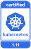

---

copyright:
  years: 2014, 2019
lastupdated: "2019-06-11"

keywords: kubernetes, iks

subcollection: containers

---

{:new_window: target="_blank"}
{:shortdesc: .shortdesc}
{:screen: .screen}
{:pre: .pre}
{:table: .aria-labeledby="caption"}
{:codeblock: .codeblock}
{:tip: .tip}
{:note: .note}
{:important: .important}
{:deprecated: .deprecated}
{:note: .note}


# 版本資訊及更新動作
{: #cs_versions}

## Kubernetes 版本類型
{: #version_types}

{{site.data.keyword.containerlong}} 同時支援多個 Kubernetes 版本。發行最新版本 (n) 時，最多支援到前 2 個 (n-2) 版本。超過最新版本前 2 個版本的版本 (n-3) 會先被淘汰，然後不受支援。
{:shortdesc}

**支援的 Kubernetes 版本**:
*   最新：1.14.2 
*   預設：1.13.6
*   其他：1.12.9

**已淘汰及不受支援的 Kubernetes 版本**：
*   已淘汰：1.11
*   不受支援：1.5、1.7、1.8、1.9、1.10 

</br>

**已淘汰的版本**：當叢集在已淘汰的 Kubernetes 版本上執行時，在版本變成不受支援之前，您有最少 30 天的時間可以檢閱並更新至受支援的 Kubernetes 版本。在淘汰期間，您的叢集仍可運作，但可能需要更新為支援的版本，以修正安全漏洞。例如，距離不支援的日期等於或短於 30 天時，可以新增和重新載入工作者節點，但不能建立使用淘汰版本的新叢集。

**不受支援的版本**：如果您的叢集執行不受支援的 Kubernetes 版本，請檢閱下列可能的更新影響，然後立即[更新叢集](/docs/containers?topic=containers-update#update)，以繼續接收重要的安全更新項目和支援。不受支援的叢集無法新增或重新載入現有的工作者節點。透過在 `ibmcloud ks clusters` 指令的輸出中檢閱 **State** 欄位，或在 [{{site.data.keyword.containerlong_notm}} 主控台 ](https://cloud.ibm.com/kubernetes/clusters) 中檢閱該欄位，可以瞭解叢集是否為**不受支援**。

如果您要等到叢集低於最舊受支援版本三個以上的次要版本時才更新，則無法更新叢集。請改為[建立新叢集](/docs/containers?topic=containers-clusters#clusters)，[部署應用程式](/docs/containers?topic=containers-app#app)至新叢集，然後[刪除](/docs/containers?topic=containers-remove)不支援的叢集。<br><br>若要避免此問題，請將淘汰使用的叢集更新為比現行版本高不超過三個次要版本的受支援的版本，例如先從 1.11 更新到 1.12，然後再更新到最新版本 1.14。如果工作者節點執行的版本低於主節點三個以上的次要版本，則您可能會看到 Pod 失敗並進入某個狀態，例如 `MatchNodeSelector`、`CrashLoopBackOff` 或 `ContainerCreating`，直到您將工作者節點更新為與主節點相同的版本。從淘汰的版本更新為受支援的版本後，叢集可以繼續正常作業並繼續接收支援。
{: important}

</br>

若要檢查叢集的伺服器版本，請執行下列指令。
```
kubectl version  --short | grep -i server
```
{: pre}

輸出範例：
```
Server Version: v1.13.6+IKS
```
{: screen}


## 更新類型
{: #update_types}

您的 Kubernetes 叢集具有三種類型的更新：主要、次要及修補程式。
{:shortdesc}

|更新類型|版本標籤的範例|更新者|影響
|-----|-----|-----|-----|
|主要|1.x.x|您|叢集的作業變更，包括 Script 或部署。|
|次要|x.9.x|您|叢集的作業變更，包括 Script 或部署。|
|修補程式|x.x.4_1510|IBM 與您|Kubernetes 修補程式，以及其他 {{site.data.keyword.Bluemix_notm}} Provider 元件更新，例如安全及作業系統修補程式。IBM 會自動更新主節點，但由您將修補程式套用至工作者節點。如需修補程式的相關資訊，請參閱下節。|
{: caption="Kubernetes 更新的影響" caption-side="top"}

有可用的更新時，會在您檢視工作者節點的相關資訊時，使用如下指令通知您：`ibmcloud ks workers --cluster <cluster>` 或 `ibmcloud ks worker-get --cluster <cluster> --worker <worker>`。
-  **主要及次要更新 (1.x)**：首先，[更新您的主節點](/docs/containers?topic=containers-update#master)，然後[更新工作者節點](/docs/containers?topic=containers-update#worker_node)。工作者節點無法執行大於主節點版本的 Kubernetes 主要或次要版本。
   - 最多只能跨 Kubernetes 主節點的兩個次要版本進行更新。例如，如果現行主節點的版本是 1.11，而您要更新到 1.14，則必須先更新到 1.12。
   - 如果您使用的 `kubectl` CLI 版本未至少符合叢集的 `major.minor` 版本，則您可能會看到非預期的結果。請確定 Kubernetes 叢集和 [CLI 版本](/docs/containers?topic=containers-cs_cli_install#kubectl)保持最新。

-  **修補程式更新 (x.x.4_1510)**：各種修補程式的變更記載於[版本變更日誌](/docs/containers?topic=containers-changelog)。會自動套用主節點修補程式，但您會起始工作者節點的修補程式更新項目。工作者節點也可以執行大於主節點版本的修補程式版本。有可用的更新時，會在您檢視 {{site.data.keyword.Bluemix_notm}} 主控台或 CLI 中主節點及工作者節點的相關資訊時，使用如下指令通知您：`ibmcloud ks clusters`、`cluster-get`、`workers` 或 `worker-get`。
   - **工作者節點修補程式**：每月檢查以查看是否有可用的更新，並使用 `ibmcloud ks worker-update` [指令](/docs/containers?topic=containers-cli-plugin-kubernetes-service-cli#cs_worker_update)或 `ibmcloud ks worker-reload` [指令](/docs/containers?topic=containers-cli-plugin-kubernetes-service-cli#cs_worker_reload)來套用這些安全及作業系統修補程式。在更新或重新載入期間，將重新建立工作者節點機器的映像，並且如果資料未[儲存在工作者節點外部](/docs/containers?topic=containers-storage_planning#persistent_storage_overview)，則將刪除資料。
   - **主節點修補程式**：主節點修補程式會在數天的期間後自動套用，因此，主節點修補程式版本可能會先顯示為可用，再將它套用至您的主節點。更新自動化也會跳過處於性能不佳狀態或目前正在進行作業的叢集。有時，IBM 可能會停用特定主節點修正套件的自動更新（如變更日誌中所述），例如只有在主節點從某個次要版本更新為另一個次要版本時才需要的修補程式。在其中任何情況下，您可以選擇自行安全地使用 `ibmcloud ks cluster-update` [指令](/docs/containers?topic=containers-cli-plugin-kubernetes-service-cli#cs_cluster_update)，而不需要等待套用更新自動化。

</br>

{: #prep-up}
此資訊彙總當您將叢集從舊版更新為新版本時，可能會對已部署的應用程式造成影響的更新。
-  1.14 版 [準備動作](#cs_v114)。
-  1.13 版[準備動作](#cs_v113)。
-  1.12 版[準備動作](#cs_v112)。
-  **淘汰**：1.11 版[準備動作](#cs_v111)。
-  不受支援版本的[保存檔](#k8s_version_archive)。

<br/>

如需完整的變更清單，請檢閱下列資訊：
* [Kubernetes 變更日誌 ](https://github.com/kubernetes/kubernetes/blob/master/CHANGELOG.md)。
* [IBM 版本變更日誌](/docs/containers?topic=containers-changelog)。

</br>

## 發行歷程
{: #release-history}

下表記錄 {{site.data.keyword.containerlong_notm}} 版本發行歷程。您可以使用此資訊進行規劃，例如，當某些版次可能變成不受支援時，可用來預估一般時間範圍。在 Kubernetes 社群版次更新項目之後，IBM 團隊會針對 {{site.data.keyword.containerlong_notm}} 環境，開始進行加強及測試該發行的處理程序。可用性及不支援版本日期取決於這些測試的結果、社群更新項目、安全修補程式，以及版本之間的技術變更。請根據 `n-2` 版本支援原則來計劃更新，以使叢集主節點和工作者節點版本保持最新。
{: shortdesc}

{{site.data.keyword.containerlong_notm}} 一般先與 Kubernetes 1.5 版搭配使用。預計的發行或不支援日期會隨時變更。若要跳至版本更新準備步驟，請按一下版本號碼。

標示劍號 (`†`) 的日期是暫訂的，得隨時變更。
{: important}

<table summary="此表格顯示 {{site.data.keyword.containerlong_notm}} 的發行歷程。">
<caption>{{site.data.keyword.containerlong_notm}} 的發行歷程。</caption>
<col width="20%" align="center">
<col width="20%">
<col width="30%">
<col width="30%">
<thead>
<tr>
<th>是否支援？</th>
<th>版本</th>
<th>{{site.data.keyword.containerlong_notm}}<br>發行日期</th>
<th>{{site.data.keyword.containerlong_notm}}<br>不支援日期</th>
</tr>
</thead>
<tbody>
<tr>
  <td></td>
  <td>[1.14](#cs_v114)</td>
  <td>2019 年 5 月 7 日</td>
  <td>2020 年 3 月 `†`</td>
</tr>
<tr>
  <td></td>
  <td>[1.13](#cs_v113)</td>
  <td>2019 年 2 月 05 日</td>
  <td>2019 年 12 月 `†`</td>
</tr>
<tr>
  <td></td>
  <td>[1.12](#cs_v112)</td>
  <td>2018 年 11 月 07 日</td>
  <td>2019 年 9 月 `†`</td>
</tr>
<tr>
  <td></td>
  <td>[1.11](#cs_v111)</td>
  <td>2018 年 8 月 14 日</td>
  <td>2019 年 6 月 27 日 `†`</td>
</tr>
<tr>
  <td></td>
  <td>[1.10](#cs_v110)</td>
  <td>2018 年 5 月 1 日</td>
  <td>2019 年 5 月 16 日</td>
</tr>
<tr>
  <td></td>
  <td>[1.9](#cs_v19)</td>
  <td>2018 年 2 月 8 日</td>
  <td>2018 年 12 月 27 日</td>
</tr>
<tr>
  <td></td>
  <td>[1.8](#cs_v18)</td>
  <td>2017 年 11 月 8 日</td>
  <td>2018 年 9 月 22 日</td>
</tr>
<tr>
  <td></td>
  <td>[1.7](#cs_v17)</td>
  <td>2017 年 9 月 19 日</td>
  <td>2018 年 1 月 21 日</td>
</tr>
<tr>
  <td></td>
  <td>1.6</td>
  <td>N/A</td>
  <td>N/A</td>
</tr>
<tr>
  <td></td>
  <td>[1.5](#cs_v1-5)</td>
  <td>2017 年 5 月 23 日</td>
  <td>2018 年 4 月 04 日</td>
</tr>
</tbody>
</table>

<br />


## 1.14 版
{: #cs_v114}

<p> {{site.data.keyword.containerlong_notm}} 是 CNCF Kubernetes Software Conformance Certification 計劃下經認證的 1.14 版的 Kubernetes 產品。_Kubernetes® 是 The Linux Foundation 在美國及其他國家或地區的註冊商標，並且根據 The Linux Foundation 的授權予以使用。_</p>

請檢閱從舊版 Kubernetes 更新至 1.14 版時，您可能需要進行的變更。
{: shortdesc}

Kubernetes 1.14 引入了新的功能供您探索。請試用新的 [`kustomize` 專案 ](https://github.com/kubernetes-sigs/kustomize)，此專案可用於協助撰寫、自訂和重複使用 Kubernetes 資源 YAML 配置。或者，請查看新的 [`kubectl` CLI 文件 ](https://kubectl.docs.kubernetes.io/)。
{: tip}

### 在主節點之前更新
{: #114_before}

下表顯示您在更新 Kubernetes 主節點之前必須採取的動作。
{: shortdesc}

<table summary="1.14 版的 Kubernetes 更新">
<caption>將主節點更新至 Kubernetes 1.14 之前要進行的變更</caption>
<thead>
<tr>
<th>類型</th>
<th>說明</th>
</tr>
</thead>
<tbody>
<tr>
<td>CRI Pod 日誌目錄結構變更</td>
<td>容器運行環境介面 (CRI) 將 Pod 日誌目錄結構從 `/var/log/pods/<uid>` 變更為 `/var/log/pods/<NAMESPACE_NAME_UID>`。如果應用程式繞過 Kubernetes 和 CRI 直接存取工作者節點上的 Pod 日誌，請更新應用程式以處理這兩個目錄結構。經由 Kubernetes 存取 Pod 日誌（例如，透過執行 `kubectl logs`）不受此變更的影響。</td>
</tr>
<tr>
<td>性能檢查不再執行重新導向</td>
<td>使用 `HTTPGetAction` 的性能檢查存活性和就緒探測不再遵循與原始探測要求不同主機名稱的重新導向。這些非本端重新導向會改為傳回 `Success` 回應，並且會產生原因為 `ProbeWarning` 的事件，以指示忽略了重新導向。如果先前依賴重新導向來針對不同的主機名稱端點執行性能檢查，則必須在 `kubelet` 外部執行性能檢查邏輯。例如，可以 Proxy 外部端點，而不是重新導向探測器要求。</td>
</tr>
<tr>
<td>不受支援：KubeDNS 叢集 DNS 提供者</td>
<td>現在，對於執行 Kubernetes 1.14 版和更高版本的叢集，CoreDNS 是唯一支援的叢集 DNS 提供者。如果將使用 KubeDNS 作為叢集 DNS 提供者的現有叢集更新為 1.14 版，則在更新期間會自動將 KubeDNS 移轉到 CoreDNS。因此，在更新叢集之前，請考慮[將 CoreDNS 設定為叢集 DNS 提供者](/docs/containers?topic=containers-cluster_dns#set_coredns)，並對其測試。<br><br>CoreDNS 支援[叢集 DNS 規格 ](https://github.com/kubernetes/dns/blob/master/docs/specification.md#25---records-for-external-name-services)，將網域名稱輸入為 Kubernetes 服務 `ExternalName` 欄位。前一個叢集 DNS 提供者 KubeDNS 未遵循叢集 DNS 規格，因此，容許 `ExternalName` 的 IP 位址。如果任何 Kubernetes 服務使用 IP 位址而非 DNS，則必須將 `ExternalName` 更新為 DNS，以繼續支援功能。</td>
</tr>
<tr>
<td>不受支援：Kubernetes `Initializers` Alpha 特性</td>
<td>已移除 Kubernetes `Initializers` Alpha 特性、`admissionregistration.k8s.io/v1alpha` API 版本、`Initializers` 許可控制器外掛程式以及 `metadata.initializers` API 欄位的使用。如果使用 `Initializers`，請在更新叢集之前，先切換為使用 [Kubernetes 許可 Webhook ](https://kubernetes.io/docs/reference/access-authn-authz/extensible-admission-controllers/)，並刪除所有現有 `InitializerConfiguration` API 物件。</td>
</tr>
<tr>
<td>不受支援：Node Alpha 污點</td>
<td>不再支援使用 `node.alpha.kubernetes.io/notReady` 和 `node.alpha.kubernetes.io/unreachable` 污點。如果您依賴這些污點，請更新應用程式以改為使用 `node.kubernetes.io/not-ready` 和 `node.kubernetes.io/unreachable` 污點。</td>
</tr>
<tr>
<td>不受支援：Kubernetes API Swagger 文件</td>
<td>現在，已移除 `swagger/*`、`/swagger.json` 和 `/swagger-2.0.0.pb-v1` 綱目 API 文件，而支援使用 `/openapi/v2` 綱目 API 文件。OpenAPI 文件在 Kubernetes 1.10 版中可用後，已淘汰使用 Swagger 文件。此外，現在 Kubernetes API 伺服器僅從聚集的 API 伺服器的 `/openapi/v2` 端點中聚集 OpenAPI 模式。已移除從 `/swagger.json` 進行聚集的撤回。如果已安裝提供 Kubernetes API 延伸的應用程式，請確保應用程式支援 `/openapi/v2` 綱目 API 文件。</td>
</tr>
<tr>
<td>不受支援且淘汰使用：選取度量值</td>
<td>檢閱[已移除和淘汰使用的 Kubernetes 度量 ](https://github.com/kubernetes/kubernetes/blob/master/CHANGELOG-1.14.md#removed-and-deprecated-metrics)。如果要使用其中任何淘汰的度量，請變更為使用可用的替換度量。</td>
</tr>
</tbody>
</table>

### 在主節點之後更新
{: #114_after}

下表顯示您在更新 Kubernetes 主節點之後必須採取的動作。
{: shortdesc}

<table summary="1.14 版的 Kubernetes 更新">
<caption>在將主節點更新到 Kubernetes 1.14 之後要進行的變更</caption>
<thead>
<tr>
<th>類型</th>
<th>說明</th>
</tr>
</thead>
<tbody>
<tr>
<td>不受支援：`kubectl --show-all`</td>
<td>不再支援 `--show-all` 和簡寫的 `-a` 旗標。如果 Script 依賴於這兩個旗標，請更新這些 Script。</td>
</tr>
<tr>
<td>用於未經鑑別使用者的 Kubernetes 預設 RBAC 原則</td>
<td>Kubernetes 預設的角色型存取控制 (RBAC) 原則不再授與[未經鑑別之使用者的探索及許可權檢查 API ](https://kubernetes.io/docs/reference/access-authn-authz/rbac/#discovery-roles) 存取權。這項變更僅適用於新的 1.14 版叢集。如果您從舊版本更新叢集，未經鑑別的使用者仍可存取探索及許可權檢查 API。如果您想要更新為對未經鑑別的使用者使用更安全的預設值，請從 `system:basic-user` 和 `system:discovery` 叢集角色連結移除 `system:unauthenticated` 群組。</td>
</tr>
<tr>
<td>已淘汰：使用 `pod_name` 和 `container_name` 標籤的 Prometheus 查詢</td>
<td>更新與 `pod_name` 或 `container_name` 標籤相符合的任何 Prometheus 查詢，以改為使用 `pod` 或 `container` 標籤。可能使用這些淘汰標籤的範例查詢包括 kubelet 探測器度量。淘汰使用的 `pod_name` 和 `container_name` 標籤在下一個 Kubernetes 版次中即不再予以支援。</td>
</tr>
</tbody>
</table>

<br />


## 1.13 版
{: #cs_v113}

<p> {{site.data.keyword.containerlong_notm}} 是 CNCF Kubernetes Software Conformance Certification 計劃下經認證的 1.13 版的 Kubernetes 產品。_Kubernetes® 是 The Linux Foundation 在美國及其他國家或地區的註冊商標，並且根據 The Linux Foundation 的授權予以使用。_</p>

請檢閱從舊版 Kubernetes 更新至 1.13 版時，您可能需要進行的變更。
{: shortdesc}

### 在主節點之前更新
{: #113_before}

下表顯示您在更新 Kubernetes 主節點之前必須採取的動作。
{: shortdesc}

<table summary="1.13 版的 Kubernetes 更新">
<caption>在將主節點更新到 Kubernetes 1.13 之前要進行的變更</caption>
<thead>
<tr>
<th>類型</th>
<th>說明</th>
</tr>
</thead>
<tbody>
<tr>
<td>N/A</td>
<td></td>
</tr>
</tbody>
</table>

### 在主節點之後更新
{: #113_after}

下表顯示您在更新 Kubernetes 主節點之後必須採取的動作。
{: shortdesc}

<table summary="1.13 版的 Kubernetes 更新">
<caption>將主節點更新至 Kubernetes 1.13 之後要進行的變更</caption>
<thead>
<tr>
<th>類型</th>
<th>說明</th>
</tr>
</thead>
<tbody>
<tr>
<td>CoreDNS 可作為新的預設叢集 DNS 提供者</td>
<td>現在，CoreDNS 是 Kubernetes 1.13 及更新版本中新叢集的預設叢集 DNS 提供者。如果您將現有的叢集更新至 1.13 版，其使用 KubeDNS 作為叢集 DNS 提供者，則 KubeDNS 會繼續成為叢集 DNS 提供者。不過，您可以選擇[改用 CoreDNS](/docs/containers?topic=containers-cluster_dns#dns_set)。<br><br>CoreDNS 支援[叢集 DNS 規格 ](https://github.com/kubernetes/dns/blob/master/docs/specification.md#25---records-for-external-name-services)，將網域名稱輸入為 Kubernetes 服務 `ExternalName` 欄位。前一個叢集 DNS 提供者 KubeDNS 未遵循叢集 DNS 規格，因此，容許 `ExternalName` 的 IP 位址。如果任何 Kubernetes 服務使用 IP 位址而非 DNS，則必須將 `ExternalName` 更新為 DNS，以繼續支援功能。</td>
</tr>
<tr>
<td>`Deployment` 及 `StatefulSet` 的 `kubectl` 輸出</td>
<td>`Deployment` 及 `StatefulSet` 的 `kubectl` 輸出現在包含 `Ready` 直欄，且更具人類可讀性。如果您的 Script 依賴先前的行為，請予以更新。</td>
</tr>
<tr>
<td>`PriorityClass` 的 `kubectl` 輸出</td>
<td>`PriorityClass` 的 `kubectl` 輸出現在包含 `Value` 直欄。如果您的 Script 依賴先前的行為，請予以更新。</td>
</tr>
<tr>
<td>`kubectl get componentstatuses`</td>
<td>`kubectl get componentstatuses` 指令未適當報告一些 Kubernetes 主節點元件的性能，因為現在無法再從已停用 `localhost` 及安全 (HTTP) 埠的 Kubernetes API 伺服器存取這些元件。在 Kubernetes 1.10 版中引進高可用性 (HA) 主節點之後，每個 Kubernetes 主節點都會以多個 `apisserver`、`controller-manager`、`scheduler` 及 `etcd` 實例來設定。請改為透過檢閱 [{{site.data.keyword.Bluemix_notm}} 主控台 ](https://cloud.ibm.com/kubernetes/landing)，或透過使用 `ibmcloud ks cluster-get` [指令](/docs/containers?topic=containers-cli-plugin-kubernetes-service-cli#cs_cluster_get)的方式，來檢閱叢集性能。</td>
</tr>
<tr>
<tr>
<td>不支援：`kubectl run-container`</td>
<td>已移除 `kubectl run-container` 指令。請改用 `kubectl run` 指令。</td>
</tr>
<tr>
<td>`kubectl rollout undo`</td>
<td>當您針對不存在的修訂執行 `kubbectl rollout undo` 時，會傳回錯誤。如果您的 Script 依賴先前的行為，請予以更新。</td>
</tr>
<tr>
<td>已淘汰：`scheduler.alpha.kubernetes.io/critical-pod` 註釋</td>
<td>`scheduler.alpha.kubernetes.io/critical-pod` 註釋現在已淘汰。將依賴此註釋的所有 Pod 改為使用 [pod priority](/docs/containers?topic=containers-pod_priority#pod_priority)。</td>
</tr>
</tbody>
</table>

### 在工作者節點之後更新
{: #113_after_workers}

下表顯示您在更新工作者節點之後必須採取的動作。
{: shortdesc}

<table summary="1.13 版的 Kubernetes 更新">
<caption>將工作者節點更新至 Kubernetes 1.13 之後要進行的變更</caption>
<thead>
<tr>
<th>類型</th>
<th>說明</th>
</tr>
</thead>
<tbody>
<tr>
<td>containerd `cri` 串流伺服器</td>
<td>在 containerd 1.2 版中，`cri` 外掛程式串流伺服器現在在隨機埠 `http://localhost:0` 上運作。此變更支援 `kubelet` 串流 Proxy，並為容器 `exec`及 `logs` 作業提供更安全的串流介面。先前，`cri` 串流伺服器在工作者節點的專用網路介面上使用埠 10010 進行接聽。如果您的應用程式使用容器 `cri` 外掛程式，並依賴先前的行為，請更新它們。</td>
</tr>
</tbody>
</table>

<br />


## 1.12 版
{: #cs_v112}

<p> {{site.data.keyword.containerlong_notm}} 是 CNCF Kubernetes Software Conformance Certification 計畫下 1.12 版的已認證 Kubernetes 產品。_Kubernetes® 是 The Linux Foundation 在美國及其他國家或地區的註冊商標，並且根據 The Linux Foundation 的授權予以使用。_</p>

請檢閱從舊版 Kubernetes 更新至 1.12 版時，您可能需要進行的變更。
{: shortdesc}

### 在主節點之前更新
{: #112_before}

下表顯示您在更新 Kubernetes 主節點之前必須採取的動作。
{: shortdesc}

<table summary="1.12 版的 Kubernetes 更新">
<caption>在將主節點更新至 Kubernetes 1.12 之前要進行的變更</caption>
<thead>
<tr>
<th>類型</th>
<th>說明</th>
</tr>
</thead>
<tbody>
<tr>
<td>Kubernetes Metrics Server</td>
<td>如果您目前在叢集裡已部署 Kubernetes `metric-server`，則必須先移除 `metric-server`，然後再將叢集更新至 Kubernetes 1.12。此移除可防止與更新期間所部署的 `metric-server` 發生衝突。</td>
</tr>
<tr>
<td>`kube-system` `default` 服務帳戶的角色連結</td>
<td>`kube-system` `default` 服務帳戶不再具有 Kubernetes API 的 **cluster-admin** 存取權。如果您部署的特性或附加程式（例如 [Helm](/docs/containers?topic=containers-helm#public_helm_install)）需要存取叢集裡的處理程序，請設定[服務帳戶 ](https://kubernetes.io/docs/reference/access-authn-authz/service-accounts-admin/)。如果您需要時間來建立及設定具有適當許可權的個別服務帳戶，則可以使用下列叢集角色連結來暫時授與 **cluster-admin** 角色：`kubectl create clusterrolebinding kube-system:default --clusterrole=cluster-admin --serviceaccount=kube-system:default`</td>
</tr>
</tbody>
</table>

### 在主節點之後更新
{: #112_after}

下表顯示您在更新 Kubernetes 主節點之後必須採取的動作。
{: shortdesc}

<table summary="1.12 版的 Kubernetes 更新">
<caption>在將主節點更新至 Kubernetes 1.12 之後要進行的變更</caption>
<thead>
<tr>
<th>類型</th>
<th>說明</th>
</tr>
</thead>
<tbody>
<tr>
<td>Kubernetes 的 API</td>
<td>Kubernetes API 會取代已淘汰的 API，如下所示：
<ul><li><strong>apps/v1</strong>：`apps/v1` Kubernetes API 取代`apps/v1beta1` 及 `apps/v1alpha` API。`apps/v1` API 也會取代 `daemonset`、`deployment`、`replicaset` 及 `statefulset` 資源的 `extensions/v1beta1` API。Kubernetes 專案即將淘汰，並逐步淘汰支援來自 Kubernetes `apiserver` 及 `kubectl` 用戶端的前一個 API。</li>
<li><strong>networking.k8s.io/v1</strong>：`networking.k8s.io/v1` API 取代 NetworkPolicy 資源的 `extensions/v1beta1` API。</li>
<li><strong>policy/v1beta1</strong>：`policy/v1beta1` API 取代 `podsecuritypolicy` 資源的 `extensions/v1beta1` API。</li></ul>
<br><br>在淘汰的 API 變成不受支援之前，請先將所有 YAML `apiVersion` 欄位更新為使用適當的 Kubernetes API。此外，請檢閱 [Kubernetes 文件 ](https://kubernetes.io/docs/concepts/workloads/controllers/deployment/)，以瞭解與 `apps/v1` 相關的變更，例如：<ul><li>在建立部署之後，`.spec.selector` 欄位是不可變的。</li>
<li>`.spec.rollbackTo` 欄位已淘汰。請改用 `kubectl rollout undo` 指令。</li></ul></td>
</tr>
<tr>
<td>CoreDNS 可作為叢集 DNS 提供者</td>
<td>Kubernetes 專案正在進行轉移，以支援 CoreDNS 而非現行 Kubernetes DNS (KubeDNS)。在 1.12 版中，預設叢集 DNS 會保留 KubeDNS，但您可以[選擇使用 CoreDNS](/docs/containers?topic=containers-cluster_dns#dns_set)。</td>
</tr>
<tr>
<td>`kubectl apply --force`</td>
<td>現在，當您在無法更新的資源（例如 YAML 檔案中不可變的欄位）上強制執行套用動作 (`kubbectl apply --force`) 時，即會改為重建資源。如果您的 Script 依賴先前的行為，請予以更新。</td>
</tr>
<tr>
<td>`kubectl get componentstatuses`</td>
<td>`kubectl get componentstatuses` 指令未適當報告一些 Kubernetes 主節點元件的性能，因為現在無法再從已停用 `localhost` 及安全 (HTTP) 埠的 Kubernetes API 伺服器存取這些元件。在 Kubernetes 1.10 版中引進高可用性 (HA) 主節點之後，每個 Kubernetes 主節點都會以多個 `apisserver`、`controller-manager`、`scheduler` 及 `etcd` 實例來設定。請改為透過檢閱 [{{site.data.keyword.Bluemix_notm}} 主控台 ](https://cloud.ibm.com/kubernetes/landing)，或透過使用 `ibmcloud ks cluster-get` [指令](/docs/containers?topic=containers-cli-plugin-kubernetes-service-cli#cs_cluster_get)的方式，來檢閱叢集性能。</td>
</tr>
<tr>
<td>`kubectl logs --interactive`</td>
<td>`kibectl logs` 不再支援 `--interactive` 旗標。請更新任何使用此旗標的自動化。</td>
</tr>
<tr>
<td>`kubectl patch`</td>
<td>如果 `patch` 指令導致沒有變更（冗餘修補程式），則這個指令不再以 `1` 回覆碼結束。如果您的 Script 依賴先前的行為，請予以更新。</td>
</tr>
<tr>
<td>`kubectl version -c`</td>
<td>不再支援 `-c` 速記旗標。請改用完整 `--client` 旗標。請更新任何使用此旗標的自動化。</td>
</tr>
<tr>
<td>`kubectl wait`</td>
<td>如果找不到任何相符的選取器，這個指令現在會列印錯誤訊息，並以 `1` 回覆碼結束。如果您的 Script 依賴先前的行為，請予以更新。</td>
</tr>
<tr>
<td>kubelet cAdvisor 埠</td>
<td>kubelet 藉由啟動 `--cadvisor-port` 而使用的[容器顧問 (cAdvisor) ](https://github.com/google/cadvisor) Web 使用者介面會從 Kubernetes 1.12 移除。如果您仍需要執行 cAdvisor，請[將 cAdvisor 部署為常駐程式集 ](https://github.com/google/cadvisor/tree/master/deploy/kubernetes)。<br><br>在常駐程式集中，指定埠區段，以透過 `http://node-ip:4194` 與 cAdvisor 聯絡，如下所示。在將工作者節點更新為 1.12 之前，cAdvisor Pod 始終會發生故障，因為更低版本的 kuelet 是將主機埠 4194 用於 cAdvisor。
<pre class="screen"><code>ports:
          - name: http
            containerPort: 8080
            hostPort: 4194
            protocol: TCP</code></pre></td>
</tr>
<tr>
<td>Kubernetes 儀表板</td>
<td>如果您透過 `kubectl proxy` 存取儀表板，則會移除登入頁面上的**跳過**按鈕。請改為[使用**記號**來登入](/docs/containers?topic=containers-app#cli_dashboard)。</td>
</tr>
<tr>
<td id="metrics-server">Kubernetes Metrics Server</td>
<td>Kubernetes Metrics Server 取代 Kubernetes Heapster（自 Kubernetes 1.8 版後已淘汰）作為叢集度量值提供者。如果您對叢集裡的每個工作者節點執行超過 30 個 Pod，請[調整效能的 `metrics-server` 配置](/docs/containers?topic=containers-kernel#metrics)。<p>Kubernetes 儀表板不會使用 `metrics-server`。如果您想要在儀表板中顯示度量，請從下列選項中選擇。</p>
<ul><li>使用「叢集監視儀表板」來[設定 Grafana 以分析度量值](/docs/services/cloud-monitoring/tutorials?topic=cloud-monitoring-container_service_metrics#container_service_metrics)。</li>
<li>將 [Heapster ](https://github.com/kubernetes/heapster) 部署至您的叢集。
<ol><li>複製 `heapster-rbac` [YAML ](https://github.com/kubernetes/kubernetes/blob/release-1.12/cluster/addons/cluster-monitoring/heapster-rbac.yaml)、`heapster-service` [YAML ](https://github.com/kubernetes/kubernetes/blob/release-1.12/cluster/addons/cluster-monitoring/standalone/heapster-service.yaml) 及 `heapster-controller` [YAML ](https://github.com/kubernetes/kubernetes/blob/release-1.12/cluster/addons/cluster-monitoring/standalone/heapster-controller.yaml) 檔案。</li>
<li>取代下列字串來編輯 `heapster-controller` YAML。
<ul><li>將 `{{ nanny_memory }}` 取代為 `90Mi`</li>
<li>將 `{{ base_metrics_cpu }}` 取代為 `80m`</li>
<li>將 `{{ metrics_cpu_per_node }}` 取代為 `0.5m`</li>
<li>將 `{{ base_metrics_memory }}` 取代為 `140Mi`</li>
<li>將 `{{ metrics_memory_per_node }}` 取代為 `4Mi`</li>
<li>將 `{{ heapster_min_cluster_size }}` 取代為 `16`</li></ul></li>
<li>執行 `kibectl apply -f` 指令，將 `heapster-rbac`、`heapster-service` 及 `heapster-controller` YAML 檔案套用至您的叢集。</li></ol></li></ul></td>
</tr>
<tr>
<td>`rbac.authorization.k8s.io/v1` Kubernetes API</td>
<td>`rbac.authorization.k8s.io/v1` Kubernetes API（自 Kubernetes 1.8 後支援它）即將取代 `rbac.authorization.k8s.io/v1alpha1` 及 `rbac.authorization.k8s.io/v1beta1` API。您無法再使用不受支援的 `v1alpha` API 來建立 RBAC 物件，例如角色或角色連結。現有的 RBAC 物件會轉換為 `v1` API。</td>
</tr>
</tbody>
</table>

<br />


## 已淘汰：1.11 版
{: #cs_v111}

<p> {{site.data.keyword.containerlong_notm}} 是 CNCF Kubernetes Software Conformance Certification 計畫下 1.11 版的已認證 Kubernetes 產品。_Kubernetes® 是 The Linux Foundation 在美國及其他國家或地區的註冊商標，並且根據 The Linux Foundation 的授權予以使用。_</p>

請檢閱從舊版 Kubernetes 更新至 1.11 版時，您可能需要進行的變更。
{: shortdesc}

Kubernetes 1.11 版已淘汰，自 2019 年 6 月 27 日（暫訂）起不再支援。針對每個 Kubernetes 版本更新，[檢閱潛在影響](/docs/containers?topic=containers-cs_versions#cs_versions)，然後立即[更新您的叢集](/docs/containers?topic=containers-update#update)為至少 1.12。
{: deprecated}

您必須遵循[準備更新至 Calico 第 3 版](#111_calicov3)中所列的步驟，才能順利將叢集從 Kubernetes 1.9 版或更早版本更新至 1.11 版。
{: important}

### 在主節點之前更新
{: #111_before}

下表顯示您在更新 Kubernetes 主節點之前必須採取的動作。
{: shortdesc}

<table summary="1.11 版的 Kubernetes 更新">
<caption>在將主節點更新至 Kubernetes 1.11 之前要進行的變更</caption>
<thead>
<tr>
<th>類型</th>
<th>說明</th>
</tr>
</thead>
<tbody>
<tr>
<td>叢集主節點高可用性 (HA) 配置</td>
<td>已更新叢集主節點配置來增加高可用性 (HA)。叢集現在具有三個 Kubernetes 主節點抄本，而設定這些抄本時，每一個主節點會部署在個別的實體主機上。此外，如果您的叢集是在具有多區域功能的區域中，則主節點會分散在各區域之中。<br><br>如需您必須採取的動作，請參閱[更新為高可用性叢集主節點](#ha-masters)。這些準備動作適用下列情況：<ul>
<li>如果您具有防火牆或自訂 Calico 網路原則。</li>
<li>如果您是在工作者節點上使用主機埠 `2040` 或 `2041`。</li>
<li>如果您已使用叢集主節點 IP 位址，對主節點進行叢集內存取。</li>
<li>如果您具有呼叫 Calico API 或 CLI (`calictl`) 的自動化，例如建立 Calico 原則。</li>
<li>如果您使用 Kubernetes 或 Calico 網路原則，來控制對主節點的 Pod Egress 存取。</li></ul></td>
</tr>
<tr>
<td>`containerd` 新的 Kubernetes 容器運行環境</td>
<td><p class="important">`containerd` 會將 Docker 取代為 Kubernetes 的新容器運行環境。如需您必須採取的動作，請參閱[更新為 `containerd` 作為容器運行環境](#containerd)。</p></td>
</tr>
<tr>
<td>加密 etcd 中的資料</td>
<td>之前，etcd 資料是儲存在主節點的 NFS 檔案儲存空間實例上，而此實例是在靜止時加密。現在，etcd 資料是儲存在主節點的本端磁碟上，並備份至 {{site.data.keyword.cos_full_notm}}。資料是在傳送至 {{site.data.keyword.cos_full_notm}} 期間和靜止時加密。不過，主節點的本端磁碟上的 etcd 資料不會加密。如果您想要將主節點的本端 etcd 資料加密，請[在您的叢集裡啟用 {{site.data.keyword.keymanagementservicelong_notm}}](/docs/containers?topic=containers-encryption#keyprotect)。</td>
</tr>
<tr>
<td>Kubernetes 容器磁區裝載傳播</td>
<td>容器 `VolumeMount` 的 [`mountPropagation` 欄位 ](https://kubernetes.io/docs/concepts/storage/volumes/#mount-propagation) 預設值已從 `HostToContainer` 變更為 `None`。此變更會還原 Kubernetes 1.9 版及更早版本中存在的行為。如果您的 Pod 規格依賴 `HostToContainer` 作為預設值，請予以更新。</td>
</tr>
<tr>
<td>Kubernetes API 伺服器 JSON 解除序列化程式</td>
<td>Kubernetes API 伺服器 JSON 解除序列化程式現在區分大小寫。此變更會還原 Kubernetes 1.7 版及更早版本中存在的行為。如果您 JSON 資源定義使用的大小寫不正確，請予以更新。<br><br>只會影響直接 Kubernetes API 伺服器要求。`kubectl` CLI 已在 Kubernetes 1.7 版及更新版本中繼續強制執行區分大小寫金鑰，因此，如果您使用 `kubectl` 嚴格管理資源，則不受影響。</td>
</tr>
</tbody>
</table>

### 在主節點之後更新
{: #111_after}

下表顯示您在更新 Kubernetes 主節點之後必須採取的動作。
{: shortdesc}

<table summary="1.11 版的 Kubernetes 更新">
<caption>在將主節點更新至 Kubernetes 1.11 之後要進行的變更</caption>
<thead>
<tr>
<th>類型</th>
<th>說明</th>
</tr>
</thead>
<tbody>
<tr>
<td>叢集記載配置</td>
<td>即使停用 `logging-autoupdate`，還是會使用 1.11 版自動更新 `fluentd` 叢集附加程式。<br><br>
容器日誌目錄已從 `/var/lib/docker/` 變更為 `/var/log/pods/`。如果您使用自己的記載解決方案來監視前一個目錄，則請相應地更新。</td>
</tr>
<tr>
<td>{{site.data.keyword.Bluemix_notm}} Identity and Access Management (IAM) 支援</td>
<td>執行 Kubernetes 1.11 版或更新版本的叢集支援 IAM [存取群組](/docs/iam?topic=iam-groups#groups)及[服務 ID](/docs/iam?topic=iam-serviceids#serviceids)。您現在可以使用這些特性來[授權存取叢集](/docs/containers?topic=containers-users#users)。</td>
</tr>
<tr>
<td>重新整理 Kubernetes 配置</td>
<td>已更新叢集 Kubernetes API 伺服器的 OpenID Connect 配置，以支援 {{site.data.keyword.Bluemix_notm}} Identity and Access Management (IAM) 存取群組。因此，您必須在主節點 Kubernetes 1.11 版更新之後，執行 `ibmcloud ks cluster-config --cluster <cluster_name_or_ID>` 來重新整理叢集的 Kubernetes 配置。當使用這個指令時，配置會套用至 `default` 名稱空間中的角色連結。<br><br>如果您未重新整理配置，則叢集動作會失敗，錯誤訊息如下：`You must be logged in to the server (Unauthorized).`</td>
</tr>
<tr>
<td>Kubernetes 儀表板</td>
<td>如果您透過 `kubectl proxy` 存取儀表板，則會移除登入頁面上的**跳過**按鈕。請改為[使用**記號**來登入](/docs/containers?topic=containers-app#cli_dashboard)。</td>
</tr>
<tr>
<td>`kubectl` CLI</td>
<td>Kubernetes 1.11 版的 `kubectl` CLI 需要 `apps/v1` API。因此，1.11 版 `kubectl` CLI 不適用於執行 Kubernetes 1.8 版或更早版本的叢集。請使用與叢集之 Kubernetes API 伺服器版本相符的 `kubectl` CLI 版本。</td>
</tr>
<tr>
<td>`kubectl auth can-i`</td>
<td>現在，使用者未獲授權時，`kubectl auth can-i` 指令會失敗，並出現 `exit code 1`。如果您的 Script 依賴先前的行為，請予以更新。</td>
</tr>
<tr>
<td>`kubectl delete`</td>
<td>現在，依預設，使用選取準則（例如標籤）刪除資源時，`kubectl delete` 指令會忽略 `not found` 錯誤。如果您的 Script 依賴先前的行為，請予以更新。</td>
</tr>
<tr>
<td>Kubernetes `sysctls` 特性</td>
<td>現在已忽略 `security.alpha.kubernetes.io/sysctls` 註釋。相反地，Kubernetes 已將欄位新增至 `PodSecurityPolicy` 及 `Pod` 物件，以指定及控制 `sysctls`。如需相關資訊，請參閱[在 Kubernetes 中使用 sysctls ](https://kubernetes.io/docs/tasks/administer-cluster/sysctl-cluster/)。<br><br>在您更新叢集主節點及工作者節點之後，請更新 `PodSecurityPolicy` 及 `Pod` 物件，以使用新的 `sysctls` 欄位。</td>
</tr>
</tbody>
</table>

### 更新為 Kubernetes 1.11 中的高可用性叢集主節點
{: #ha-masters}

對於執行 Kubernetes 1.10.8_1530、1.11.3_1531 版或更高版本的叢集，將更新叢集主節點配置以提高高可用性 (HA)。叢集現在具有三個 Kubernetes 主節點抄本，而設定這些抄本時，每一個主節點會部署在個別的實體主機上。此外，如果您的叢集是在具有多區域功能的區域中，則主節點會分散在各區域之中。
{: shortdesc}

可以透過在主控台中檢查叢集的主節點 URL，或者透過執行 `ibmcloud ks cluster-get --cluster <cluster_name_or_ID`，檢查叢集是否具有 HA 主節點配置。如果主節點 URL 具有 ` https://c2.us-south.containers.cloud.ibm.com:xxxxx` 等主機名稱，而非 ` https://169.xx.xx.xx:xxxxx` 等 IP 位址，則叢集會有 HA 主要配置。您可能會因為自動主要修補程式更新，或者透過手動套用更新的方式，取得 HA 主要配置。無論哪一種情況，您仍必須檢閱下列項目，以確保您的叢集網路設為充分利用配置。

* 如果您具有防火牆或自訂 Calico 網路原則。
* 如果您是在工作者節點上使用主機埠 `2040` 或 `2041`。
* 如果您已使用叢集主節點 IP 位址，對主節點進行叢集內存取。
* 如果您具有呼叫 Calico API 或 CLI (`calictl`) 的自動化，例如建立 Calico 原則。
* 如果您使用 Kubernetes 或 Calico 網路原則，來控制對主節點的 Pod Egress 存取。

<br>
**針對 HA 主節點更新防火牆或自訂的 Calico 主機網路原則**：</br>
{: #ha-firewall}
如果您使用防火牆或自訂的 Calico 主機網路原則，控制來自工作者節點的 Egress，則容許將資料流量送出至叢集所在地區內所有區域的埠及 IP 位址。請參閱[容許叢集存取基礎架構資源及其他服務](/docs/containers?topic=containers-firewall#firewall_outbound)。

<br>
**保留工作者節點上的主機埠 `2040` 及 `2041`**：</br>
{: #ha-ports}
若要容許存取 HA 配置中的叢集主節點，您必須在所有工作者節點上將主機埠 `2040` 和 `2041` 保留為可用狀態。
* 更新任何 Pod，將 `hostPort` 設為 `2040` 或 `2041` 來使用不同的埠。
* 將 `hostNetwork` 設為 `true`，且將在埠 `2040` 或 `2041` 上進行接聽的任何 Pod，更新為使用不同的埠。

若要檢查 Pod 目前是否正在使用埠 `2040` 或 `2041`，請將叢集設定為目標，然後執行下列指令。

```
kubectl get pods --all-namespaces -o yaml | grep -B 3 "hostPort: 204[0,1]"
```
{: pre}

如果您已有 HA 主節點配置，則會在 `kube-system` 名稱空間中看到 `ibm-master-proxy-*` 的結果，如下列範例所示。如果傳回其他 Pod，則請更新其埠。

```
name: ibm-master-proxy-static
ports:
- containerPort: 2040
  hostPort: 2040
  name: apiserver
  protocol: TCP
- containerPort: 2041
  hostPort: 2041
...
```
{: screen}


<br>
**使用 `kubernetes` 服務叢集 IP 或網域，對主節點進行叢集內存取**：</br>
{: #ha-incluster}
若要從叢集內的 HA 配置中存取叢集主節點，請使用下列其中一項：
* `kubernetes` 服務叢集 IP 位址，預設為：`https://172.21.0.1`
* `kubernetes` 服務網域名稱，預設為：`https://kubernetes.default.svc.cluster.local`

如果您先前已使用叢集主節點 IP 位址，則此方法會繼續運作。不過，為了提高可用性，請更新為使用 `kubernetes` 服務叢集 IP 位址或網域名稱。

<br>
**配置 Calico 對具有 HA 配置的主節點進行叢集外存取**：</br>
{: #ha-outofcluster}
`kin-system` 名稱空間中 `calic-config` ConfigMap 所儲存的資料已變更為支援 HA 主節點配置。尤其，`etcd_endpoints` 值現在僅支援叢集內存取。使用此值來配置 Calico CLI 以從叢集外部進行存取，不再運作。

請改用 `kudo-system` 名稱空間中 `cluster-info` ConfigMap 所儲存的資料。尤其，使用 `etcd_host` 和 `etcd_port` 值來配置 [Calico CLI](/docs/containers?topic=containers-network_policies#cli_install) 的端點，從叢集外部存取具有 HA 配置的主節點。

<br>
**更新 Kubernetes 或 Calico 網路原則**：</br>
{: #ha-networkpolicies}
如果您使用 [Kubernetes 或 Calico 網路原則](/docs/containers?topic=containers-network_policies#network_policies)，來控制對叢集主節點的 Pod Egress 存取，而且您目前正在使用下列項目，則需要採取其他動作：
*  Kubernetes 服務叢集 IP，您可以藉由執行 `kubectl get service kubernetes -o yaml | grep clusterIP` 來取得此 IP。
*  Kubernetes 服務網域名稱，預設為 `https://kubernetes.default.svc.cluster.local`。
*  叢集主節點 IP，您可以藉由執行 `kubectl cluster-info | grep Kubernetes` 來取得此 IP。

下列步驟說明如何更新您的 Kubernetes 網路原則。若要更新 Calico 網路原則，請重複這些步驟，搭配一些次要原則語法變更及 `calicoctl` 來搜尋原則找出影響。
{: note}

開始之前：[登入您的帳戶。適用的話，請將適當的資源群組設為目標。設定叢集的環境定義。](/docs/containers?topic=containers-cs_cli_install#cs_cli_configure)

1.  取得您的叢集主節點 IP 位址。
    ```
    kubectl cluster-info | grep Kubernetes
    ```
    {: pre}

2.  搜尋 Kubernetes 網路原則找出影響。如果未傳回任何 YAML，表示您的叢集未受到影響，因此您不需要進行其他變更。
    ```
    kubectl get networkpolicies --all-namespaces -o yaml | grep <cluster-master-ip>
    ```
    {: pre}

3.  檢閱 YAML。例如，如果您的叢集使用下列 Kubernetes 網路原則，容許 `default` 名稱空間中的 Pod，透過 `kubernetes` 服務叢集 IP 或叢集主節點 IP 存取叢集主節點，則您必須更新原則。
    ```
    apiVersion: networking.k8s.io/v1
    kind: NetworkPolicy
    metadata:
      name: all-master-egress
      namespace: default
    spec:
      egress:
      # Allow access to cluster master using kubernetes service cluster IP address
      # or domain name or cluster master IP address.
      -   ports:

        - protocol: TCP
        to:
        - ipBlock:
            cidr: 161.202.126.210/32
      # Allow access to Kubernetes DNS in order to resolve the kubernetes service
      # domain name.
      -   ports:

        - protocol: TCP
          port: 53
        - protocol: UDP
          port: 53
      podSelector: {}
      policyTypes:
      - Egress
    ```
    {: screen}

4.  修訂 Kubernetes 網路原則，以容許對叢集內主節點 Proxy IP 位址 `172.20.0.1` 進行 Egress。目前，請保留叢集主節點 IP 位址。例如，前一個網路原則範例會變更為下列內容。

    如果您先前已將 Egress 原則設為僅針對單一 Kubernetes 主節點開啟單一 IP 位址及埠，則現在會使用叢集內主節點 Proxy IP 位址範圍 172.20.0.1/32 和埠 2040。
    {: tip}

    ```
    apiVersion: networking.k8s.io/v1
    kind: NetworkPolicy
    metadata:
      name: all-master-egress
      namespace: default
    spec:
      egress:
      # Allow access to cluster master using kubernetes service cluster IP address
      # or domain name.
      -   ports:

        - protocol: TCP
        to:
        - ipBlock:
            cidr: 172.20.0.1/32
        - ipBlock:
            cidr: 161.202.126.210/32
      # Allow access to Kubernetes DNS in order to resolve the kubernetes service domain name.
      -   ports:

        - protocol: TCP
          port: 53
        - protocol: UDP
          port: 53
      podSelector: {}
      policyTypes:
      - Egress
    ```
    {: screen}

5.  將修訂的網路原則套用至您的叢集。
    ```
    kubectl apply -f all-master-egress.yaml
    ```
    {: pre}

6.  在您完成所有[準備動作](#ha-masters)（包括這些步驟）之後，請[將叢集主節點更新為](/docs/containers?topic=containers-update#master) HA 主節點修正套件。

7.  在更新完成之後，請從網路原則移除叢集主節點 IP 位址。例如，從前一個網路原則移除下列這幾行，然後重新套用原則。

    ```
    - ipBlock:
        cidr: 161.202.126.210/32
    ```
    {: screen}

    ```
    kubectl apply -f all-master-egress.yaml
    ```
    {: pre}

### 更新為 `containerd` 作為容器運行環境
{: #containerd}

對於執行 Kubernetes 1.11 版或更新版本的叢集，`containerd` 會將 Docker 取代為 Kubernetes 的新容器運行環境來加強效能。如果您的 Pod 依賴 Docker 作為 Kubernetes 容器運行環境，則您必須更新它們以處理 `containerd` 作為容器運行環境。如需相關資訊，請參閱 [Kubernetes containerd 公告 ](https://kubernetes.io/blog/2018/05/24/kubernetes-containerd-integration-goes-ga/)。
{: shortdesc}

**如何知道應用程式是否依賴於 `docker` 而不是 `containerd`？**<br>
您可能依賴 Docker 作為容器運行環境的情況範例：
*  如果您使用特許容器直接存取 Docker 引擎或 API，則請更新 Pod 以支援 `containerd` 作為運行環境。例如，您可以直接呼叫 Docker Socket，來啟動容器或執行其他 Docker 作業。Docker Socket 已從 `/var/run/docker.sock` 變更為 `/run/containerd/containerd.sock`。`containerd` Socket 中使用的通訊協定，與 Docker 中的通訊協定有些許不同。請嘗試將您的應用程式更新為 `containerd` Socket。如果您要繼續使用 Docker Socket，請使用 [Docker-inside-Docker (DinD) ](https://hub.docker.com/_/docker/) 來查看。
*  您在叢集裡安裝的部分協力廠商附加程式（例如記載及監視工具）可能依賴 Docker 引擎。請檢查提供者以確保工具與 containerd 相容。可能的使用案例包括：
   - 您的記載工具可能使用容器 `stderr/stdout` 目錄 `/var/log/pods/<pod_uuid>/<container_name>/*.log`，來存取日誌。在 Docker 中，此目錄是 `/var/data/cripersistentstorage/containers/<container_uuid>/<container_uuid>-json.log` 的符號鏈結，而在 `containerd` 中，您會在沒有符號鏈結的情況下直接存取目錄。
   - 您的監視工具會直接存取 Docker Socket。Docker Socket 已從 `/var/run/docker.sock` 變更為 `/run/containerd/containerd.sock`。

<br>

**除了依賴運行環境之外，我是否還需要採取其他準備動作？**<br>

**manifest 工具**：如果您的多平台映像檔是使用 Docker 18.06 版之前的實驗性 `docker manifest` [工具 ](https://docs.docker.com/edge/engine/reference/commandline/manifest/) 所建置，則無法使用 `containerd` 從 DockerHub 取回映像檔。

當您檢查 Pod 事件時，可能會看到如下錯誤：
```
failed size validation
```
{: screen}

若要搭配使用利用 manifest 工具所建置的映像檔與 `containerd`，請從下列選項中選擇。

*  使用 [manifest 工具 ](https://github.com/estesp/manifest-tool) 來重建映像檔。
*  在您更新為 Docker 18.06 版或更新版本之後，請使用 `docker-manifest` 工具來重建映像檔。

<br>

**不受影響的項目為何？我需要變更容器的部署方式嗎？**<br>
一般而言，容器部署處理程序不會變更。您仍然可以使用 Dockerfile 來定義 Docker 映像檔，並為您的應用程式建置 Docker 容器。如果您使用 `docker` 指令來建置映像檔，並將其推送至登錄，則可以繼續使用 `docker`，或改為使用 `ibmcloud cr` 指令。

### 準備更新至 Calico 第 3 版
{: #111_calicov3}

如果您要將叢集從 Kubernetes 1.9 版或更早版本更新為 1.11 版，請先準備進行 Calico 第 3 版更新，再更新主節點。在主節點升級至 Kubernetes 1.11 版期間，不會排定新的 Pod 及新的 Kubernetes 或 Calico 網路原則。更新導致無法進行新排程的時間量會不同。小型叢集可能需要數分鐘的時間，而且每 10 個節點需要額外幾分鐘的時間。現有網路原則及 Pod 會繼續執行。
{: shortdesc}

如果您將叢集從 Kubernetes 1.10 版更新為 1.11 版，請跳過這些步驟，因為您在更新為 1.10 時已完成這些步驟。
{: note}

開始之前，您的叢集主節點及所有工作者節點都必須執行 Kubernetes 1.8 版或 1.9 版，且必須至少有一個工作者節點。

1.  驗證 Calico Pod 性能良好。
    ```
    kubectl get pods -n kube-system -l k8s-app=calico-node -o wide
    ```
    {: pre}

2.  如果有任何 Pod 未處於**執行中**狀態，則請刪除 Pod，並先等到它處於**執行中**狀態，再繼續進行。如果 Pod 未回到**執行中**狀態，請執行下列動作：
    1.  檢查工作者節點的**狀況**及**狀態**。
        ```
        ibmcloud ks workers --cluster <cluster_name_or_ID>
        ```
        {: pre}
    2.  如果工作者節點狀況不是**正常**，請遵循[除錯工作者節點](/docs/containers?topic=containers-cs_troubleshoot#debug_worker_nodes)步驟。例如，**嚴重**或**不明**狀況通常藉由[重新載入工作者節點](/docs/containers?topic=containers-cli-plugin-kubernetes-service-cli#cs_worker_reload)來解決。

3.  如果您自動產生 Calico 原則或其他 Calico 資源，則請更新自動化工具，以使用 [Calico 第 3 版語法 ](https://docs.projectcalico.org/v3.1/reference/calicoctl/resources/) 來產生這些資源。

4.  如果您將 [strongSwan](/docs/containers?topic=containers-vpn#vpn-setup) 用於 VPN 連線功能，則 strongSwan 2.0.0 Helm 圖表不會使用 Calico 第 3 版或 Kubernetes 1.11。[更新 strongSwan](/docs/containers?topic=containers-vpn#vpn_upgrade) 至 2.1.0 Helm 圖表，其與 Calico 2.6 及 Kubernetes 1.7、1.8 及 1.9 舊版相容。

5.  [將叢集主節點更新至 Kubernetes 1.11 版](/docs/containers?topic=containers-update#master)。

<br />


## 保存
{: #k8s_version_archive}

尋找 {{site.data.keyword.containerlong_notm}} 中不支援之 Kubernetes 版本的概觀。
{: shortdesc}

### 1.10 版（不受支援）
{: #cs_v110}

自 2019 年 5 月 16 日開始，不支援使用執行 [Kubernetes 1.10 版](/docs/containers?topic=containers-changelog#changelog_archive)的 {{site.data.keyword.containerlong_notm}} 叢集。1.10 版叢集無法接收安全更新或支援，除非更新到下一個最新版本。
{: shortdesc}

針對每個 Kubernetes 版本更新，請[檢閱潛在影響](/docs/containers?topic=containers-cs_versions#cs_versions)，然後[更新叢集](/docs/containers?topic=containers-update#update)至 [Kubernetes 1.12](#cs_v112)，因為 Kubernetes 1.11 已淘汰使用。


### 1.9 版（不受支援）
{: #cs_v19}

自 2018 年 12 月 27 日起，不支援執行 [Kubernetes 1.9 版](/docs/containers?topic=containers-changelog#changelog_archive)的 {{site.data.keyword.containerlong_notm}} 叢集。1.9 版叢集無法接收安全更新或支援，除非更新到下一個最新版本。
{: shortdesc}

針對每個 Kubernetes 版本更新，請[檢閱潛在影響](/docs/containers?topic=containers-cs_versions#cs_versions)，然後[更新叢集](/docs/containers?topic=containers-update#update)，首先更新到[淘汰的 Kubernetes 1.11](#cs_v111)，然後立即更新到 [Kubernetes 1.12](#cs_v112)。


### 1.8 版（不受支援）
{: #cs_v18}

自 2018 年 9 月 22 日起，不支援執行 [Kubernetes 1.8 版](/docs/containers?topic=containers-changelog#changelog_archive)的 {{site.data.keyword.containerlong_notm}} 叢集。1.8 版叢集無法接收安全更新或支援。
{: shortdesc}

若要在 {{site.data.keyword.containerlong_notm}} 中繼續執行應用程式，請[建立新的叢集](/docs/containers?topic=containers-clusters#clusters)，並[部署應用程式](/docs/containers?topic=containers-app#app)至新的叢集。

### 1.7 版（不受支援）
{: #cs_v17}

自 2018 年 6 月 21 日起，不支援執行 [Kubernetes 1.7 版](/docs/containers?topic=containers-changelog#changelog_archive)的 {{site.data.keyword.containerlong_notm}} 叢集。1.7 版叢集無法接收安全更新或支援。
{: shortdesc}

若要在 {{site.data.keyword.containerlong_notm}} 中繼續執行應用程式，請[建立新的叢集](/docs/containers?topic=containers-clusters#clusters)，並[部署應用程式](/docs/containers?topic=containers-app#app)至新的叢集。

### 1.5 版（不受支援）
{: #cs_v1-5}

自 2018 年 4 月 4 日起，不支援執行 [Kubernetes 1.5 版](https://github.com/kubernetes/kubernetes/blob/master/CHANGELOG-1.5.md)的 {{site.data.keyword.containerlong_notm}} 叢集。1.5 版叢集無法接收安全更新或支援。
{: shortdesc}

若要在 {{site.data.keyword.containerlong_notm}} 中繼續執行應用程式，請[建立新的叢集](/docs/containers?topic=containers-clusters#clusters)，並[部署應用程式](/docs/containers?topic=containers-app#app)至新的叢集。
