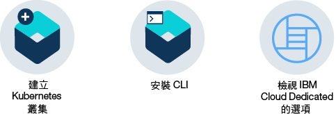

---

copyright:
  years: 2014, 2018
lastupdated: "2018-12-05"

---

{:new_window: target="_blank"}
{:shortdesc: .shortdesc}
{:screen: .screen}
{:pre: .pre}
{:table: .aria-labeledby="caption"}
{:codeblock: .codeblock}
{:tip: .tip}
{:note: .note}
{:important: .important}
{:deprecated: .deprecated}
{:download: .download}

# 開始使用 {{site.data.keyword.containerlong_notm}}
{: #getting-started}

使用 {{site.data.keyword.containerlong}}，藉由在 Kubernetes 叢集執行的 Docker 容器中部署高可用性應用程式，立即行動起來。
{:shortdesc}

容器是包裝應用程式及其所有相依關係的標準方式，而此方式可讓您在環境之間無縫移動應用程式。容器與虛擬機器不同，容器不會搭載作業系統。只有應用程式碼、運行環境、系統工具、程式庫及設定才會包裝在容器中。容器比虛擬機器更輕量、可攜性更高且更有效率。

按一下選項以開始使用：

<map name="home_map" id="home_map">
<area href="#clusters" alt="在 {{site.data.keyword.Bluemix_notm}} 中開始使用 Kubernetes 叢集" title="在 {{site.data.keyword.Bluemix_notm}} 中開始使用 Kubernetes 叢集" shape="rect" coords="-7, -8, 108, 211" />
<area href="cs_cli_install.html" alt="安裝 CLI。" title="安裝 CLI。" shape="rect" coords="155, -1, 289, 210" />
<area href="cs_dedicated.html#dedicated_environment" alt="{{site.data.keyword.Bluemix_dedicated_notm}} 雲端環境" title="{{site.data.keyword.Bluemix_notm}} 雲端環境" shape="rect" coords="326, -10, 448, 218" />
</map>

## 開始使用叢集
{: #clusters}

您要在容器中部署應用程式嗎？等一等！首先，請建立 Kubbernetes 叢集。Kubbernetes 是容器的編排工具。使用 Kubernetes，開發人員可以使用叢集的強大功能和彈性，快速開發高可用性應用程式。
{:shortdesc}

何謂叢集？叢集是一組資源、工作者節點、網路及儲存裝置，可讓應用程式保持高可用性。在您具有叢集之後，即可在容器中部署您的應用程式。

**開始之前**

取得您所適用的 [{{site.data.keyword.Bluemix_notm}} 帳戶](https://console.bluemix.net/registration/)類型：
* **計費（隨收隨付制或訂閱）**：您可以建立免費試用叢集。您也可以佈建要在標準叢集裡建立及使用的 IBM Cloud 基礎架構 (SoftLayer) 資源。
* **精簡**：您無法建立免費或標準叢集。請[升級帳戶](/docs/account/account_faq.html#changeacct)至計費帳戶。
* **試用（適用於教育目的）**：您可以建立一個可使用 30 天的免費叢集，以熟悉服務。

若要建立免費叢集，請執行下列動作：

1.  在 [{{site.data.keyword.Bluemix_notm}} **型錄** ](https://console.bluemix.net/catalog/?category=containers) 中，選取 **{{site.data.keyword.containershort_notm}}**，然後按一下**建立**。即會開啟叢集配置頁面。依預設，會選取**免費叢集**。

2.  為叢集提供唯一名稱。

3.  按一下**建立叢集**。建立的工作者節點儲存區包含 1 個工作者節點。工作者節點可能需要幾分鐘的時間進行佈建，但您可以在**工作者節點**標籤中看到進度。當狀態達到`備妥`時，您可以開始使用您的叢集！

做得好！您已建立第一個 Kubernetes 叢集。以下是關於您的免費叢集的一些詳細資料：

*   **機型**：免費叢集有一個分組到工作者節點儲存區的虛擬工作者節點（具有 2 個 CPU、4 GB 記憶體及單一 100 GB SAN 磁碟）可供應用程式使用。當您建立標準叢集時，您可以選擇實體（裸機）或虛擬機器，以及各種機器大小。
*   **受管理主節點**：工作者節點是由專用及高可用性 {{site.data.keyword.IBM_notm}} 擁有的 Kubernetes 主節點集中監視及管理，這個主節點會控制及監視叢集裡的所有 Kubernetes 資源。您可以著重在工作者節點以及工作者節點中所部署的應用程式，而不需要擔心這個主節點的管理。
*   **基礎架構資源**：執行叢集所需的資源（例如 VLANS 及 IP 位址）是使用 {{site.data.keyword.IBM_notm}} 擁有的 IBM Cloud 基礎架構 (SoftLayer) 帳戶進行管理。當您建立標準叢集時，會使用您自己的 IBM Cloud 基礎架構 (SoftLayer) 帳戶來管理這些資源。建立標準叢集時，您可以進一步瞭解這些資源及[所需的許可權](cs_users.html#infra_access)。
*   **其他選項**：免費叢集將部署在您選取的地區內，但您無法選擇哪個區域。如需對於區域、網路及持續性儲存空間進行控制，請建立標準叢集。[進一步瞭解免費叢集和標準叢集的優點](cs_why.html#cluster_types)。

**下一步為何？** 
在到期之前，請試著使用您的免費叢集來做一些事情。

* 瀏覽[第一個 {{site.data.keyword.containerlong_notm}} 指導教學](cs_tutorials.html#cs_cluster_tutorial)來建立 Kubernetes 叢集、安裝 CLI、建立專用登錄、設定叢集環境，以及將服務新增至叢集。
* 使用將應用程式部署至叢集的[第二個 {{site.data.keyword.containerlong_notm}} 指導教學](cs_tutorials_apps.html#cs_apps_tutorial)持續執行作業。
* [建立標準叢集](cs_clusters.html#clusters_ui)（含多個節點），以提高可用性。

