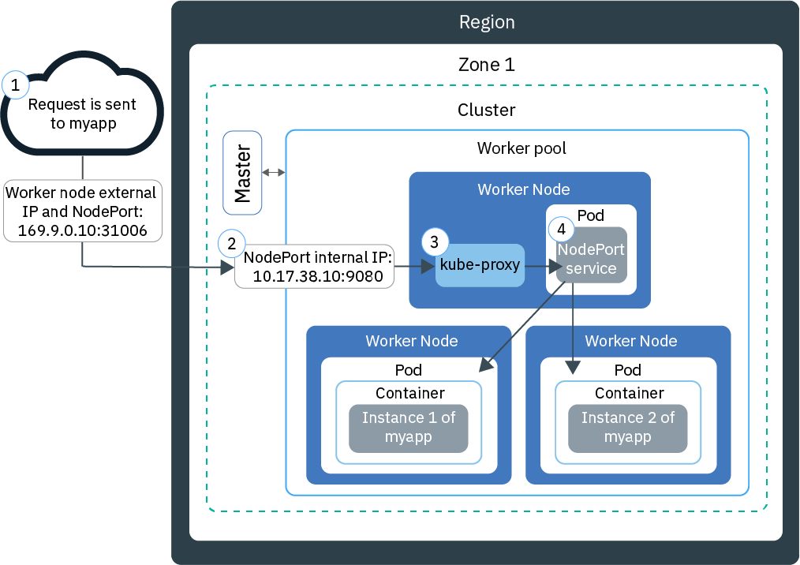

---

copyright: 
  years: 2014, 2022
lastupdated: "2022-12-01"

keywords: kubernetes, app access

subcollection: containers


---

{{site.data.keyword.attribute-definition-list}}


# Testing access to apps with NodePorts
{: #nodeport}

Make your containerized app available to internet access by using the public IP address of any worker node in a Kubernetes cluster and exposing a NodePort. Use this option for testing in {{site.data.keyword.containerlong}} and for short-term public access.
{: shortdesc}


## About NodePorts
{: #nodeport_planning}

Expose a public port on your worker node and use the public IP address of the worker node to access your service in the cluster publicly from the internet.
{: shortdesc}

When you expose your app by creating a Kubernetes service of type NodePort, a NodePort in the range of 30000 - 32767 and an internal cluster IP address is assigned to the service. The NodePort service serves as the external entry point for incoming requests for your app. The assigned NodePort is publicly exposed in the `kubeproxy` settings of each worker node in the cluster. Every worker node starts listening on the assigned NodePort for incoming requests for the service. To access the service from the internet, you can use the public IP address of any worker node that was assigned during cluster creation and the NodePort in the format `<IP_address>:<nodeport>`. If you want to access the service on the private network, use the private IP address of any worker node instead of the public IP address.

The following diagram shows how communication is directed from the internet to an app when a NodePort service is configured.

{: caption="Figure 1. Expose an app by using NodePort" caption-side="bottom"}

1. A request is sent to your app by using the public IP address of your worker node and the NodePort on the worker node.

2. The request is automatically forwarded to the NodePort service's internal cluster IP address and port. The internal cluster IP address is accessible inside the cluster only.

3. `kube-proxy` routes the request to the Kubernetes NodePort service for the app.

4. The request is forwarded to the private IP address of the pod where the app is deployed. If multiple app instances are deployed in the cluster, the NodePort service routes the requests between the app pods.

The public IP address of the worker node is not permanent. When a worker node is removed or re-created, a new public IP address is assigned to the worker node. You can use the NodePort service for testing the public access for your app or when public access is needed for a short amount of time only. When you require a stable public IP address and more availability for your service, expose your app by using a [network load balancer (NLB) service](/docs/containers?topic=containers-loadbalancer) or [Ingress](/docs/containers?topic=containers-ingress-types).
{: note}


## Enabling access to an app by using a NodePort service
{: #nodeport_config}

You can expose your app as a Kubernetes NodePort service for free or standard clusters.
{: shortdesc}

Because worker nodes in VPC clusters don't have a public IP address, you can access an app through a NodePort only if you are connected to your private VPC network, such as through a VPN connection. To access an app from the internet, you must use a [VPC load balancer](/docs/containers?topic=containers-vpc-lbaas) or [Ingress](/docs/containers?topic=containers-ingress-about) service instead.
{: note}

If you don't already have an app ready, you can use a Kubernetes example app called [Guestbook](https://github.com/kubernetes/examples/blob/master/guestbook/all-in-one/guestbook-all-in-one.yaml){: external}.

Before you begin

* [Log in to your account. If applicable, target the appropriate resource group. Set the context for your cluster.](/docs/containers?topic=containers-cs_cli_install#cs_cli_configure)
* VPC clusters: [Allow traffic requests that are routed to NodePorts on your worker nodes](/docs/openshift?topic=openshift-vpc-security-group).

To use a NodePort,

1. In the configuration file for your app, define a [service](https://kubernetes.io/docs/concepts/services-networking/service/){: external} section.

    For the Guestbook example, a front-end service section exists in the configuration file. To make the Guestbook app available externally, add the NodePort type and a NodePort in the range 30000 - 32767 to the front-end service section.
    {: tip}

    Example

    ```yaml
    apiVersion: v1
    kind: Service
    metadata:
      name: <my-nodeport-service>
      labels:
        <my-label-key>: <my-label-value>
    spec:
      selector:
        <my-selector-key>: <my-selector-value>
      type: NodePort
      ports:
       - port: <8081>
         # nodePort: <31514>

    ```
    {: codeblock}
    
    | Component | Description |
    | ----- | -------- |
    | `name` | Replace `<my-nodeport-service>` with a name for your NodePort service. Learn more about [securing your personal information](/docs/containers?topic=containers-security#pi) when you work with Kubernetes resources. |
    | `labels` | Replace `<my-label-key>` and `<my-label-value>` with the label that you want to use for your service. |
    | `selector` | Replace `<my-selector-key>` and `<my-selector-value>` with the key/value pair that you used in the `spec.template.metadata.labels` section of your deployment YAML. To associate the service with the deployment, the selector must match the deployment labels. |
    | `port` | Replace `<8081>` with the port that your service listens on. |
    | `nodePort` | Optional: Replace `<31514>` with a NodePort in the 30000 - 32767 range. Do not specify a NodePort that is already in use by another service. If no NodePort is assigned, a random one is assigned for you. \n To specify a NodePort and see which NodePorts are already in use, run the **`kubectl get svc`** command. Any NodePorts in use appear under the **Ports** field.
    {: caption="Table 1. Understanding the NodePort service components" caption-side="bottom"}

2. Save the updated configuration file.

3. When the app is deployed, you can use the public IP address of any worker node and the NodePort to form the public URL to access the app in a browser. If your worker nodes are connected to a private VLAN only, then a private NodePort service was created and can be accessible through a worker node's private IP address.

    1. Get the public IP address for a worker node in the cluster. If you want to access the worker node on a private network or have a VPC cluster, get the private IP address instead.

        ```sh
        ibmcloud ks worker ls --cluster <cluster_name>
        ```
        {: pre}

        Output

        ```sh
        ID                                                Public IP   Private IP    Size     State    Status
        prod-dal10-pa215dcf5bbc0844a990fa6b0fcdbff286-w1  192.0.2.23  10.100.10.10  u3c.2x4  normal   Ready
        prod-dal10-pa215dcf5bbc0844a990fa6b0fcdbff286-w2  192.0.2.27  10.100.10.15  u3c.2x4  normal   Ready
        ```
        {: screen}

    2. If a random NodePort was assigned, find out which one was assigned.

        ```sh
        kubectl describe service <service_name>
        ```
        {: pre}

        Output

        ```sh
        NAME:                   <service_name>
        Namespace:              default
        Labels:                 run=<deployment_name>
        Selector:               run=<deployment_name>
        Type:                   NodePort
        IP:                     10.10.10.8
        Port:                   <unset> 8080/TCP
        NodePort:               <unset> 30872/TCP
        Endpoints:              172.30.171.87:8080
        Session Affinity:       None
        No events.
        ```
        {: screen}

        In this example, the NodePort is `30872`.

        If the **Endpoints** section displays `<none>`, check the `<selectorkey>` and `<selectorvalue>` that you use in the `spec.selector` section of the NodePort service. Ensure that it is the same as the _key/value_ pair that you used in the `spec.template.metadata.labels` section of your deployment YAML.
        {: note}

    3. Form the URL with one of the worker node IP addresses and the NodePort. Example: `http://192.0.2.23:30872`.
        For VPC clusters, you must be connected to the private network, such as through a VPN connection, to access the worker node private IP address and NodePort.
        {: note}


## Restricting NodePort service access
{: #nodeport-restrict-access}

By default, NodePort services are accessible on all network interfaces that are available to the cluster, for example `0.0.0.0`. Depending on your cluster setup, you might want to limit the available network interfaces for your services, for example in {{site.data.keyword.satelliteshort}} locations where multiple networks are available to the hosts. 

Supported infrastructure providers
:   Classic
:   VPC
:   {{site.data.keyword.satelliteshort}}

You can restrict the listening addresses for NodePort services at the cluster level. This restriction allows the cluster administrator to limit access to a specific network interface by using the IP subnet as the allowed listening address range. Complete the following steps reconfigure the `kube-proxy` component to limit the listening address range for your NodePort services.


Misconfiguring the `node-port-addresses` might isolate your services from valid sources. Make sure you plan for all the required subnets your service needs. {{site.data.keyword.cloud_notm}} doesn't require access to any subnet to manage your clusters.
{: important}


1. [Access your {{site.data.keyword.redhat_openshift_notm}} cluster](/docs/openshift?topic=openshift-access_cluster).
1. Prepare your planned source subnet CIDR list that you want to allow to access the NodePort Services.
1. Run the following command to get the `network.operator.openshift.io` configuration and save a copy in case you need to revert the changes.
    ```sh
    kubectl get network.operator.openshift.io cluster -o yaml
    ```
    {: pre}
    
1. Edit the `network.operator.openshift.io` configuration and set the subnet list under the `spec` section and include the required subnets for your NodePort service.
    ```yaml
    spec:
      kubeProxyConfig:
        proxyArguments:
          node-port-addresses:
          - 192.0.2.0/24
          - 198.51.100.0/24
    ```
    {: codeblock}
    
1. Save your changes and apply them to the cluster.

    ```sh
    kubectl apply -f updated-network-config.yaml
    ```
    {: pre}

1. For cluster version 4.10.x and earlier, set the management state of the cluster network operator to `Unmanaged`.

   ```sh
    kubectl patch network.operator.openshift.io cluster --type=merge --patch  '{"spec": {"managementState": "Unmanaged"}}'
   ```

1. Restart the `kube-proxy` DaemonSet to apply the changes. This operation is not disruptive.

    ```sh
    kubectl rollout restart ds -n openshift-kube-proxy openshift-kube-proxy
    ```
    {: pre}
    
1. Wait until all your `kube-proxy` pods are restarted. Check the status by running the following command.
    ```sh
    kubectl get po -n openshift-kube-proxy --selector app=kube-proxy
    ```
    {: pre}

1. For cluster version of 4.10.x and earlier, reset the management state of the cluster network operator to `Managed`. Note: This might restart the proxy pods again.

   ```sh
    kubectl patch network.operator.openshift.io cluster --type=merge --patch  '{"spec": {"managementState": "Managed"}}'
   ```

After all pods are restarted, your cluster is configured with the restricted subnets. You can repeat these steps to update or remove the subnet list as needed.

You can further restrict the traffic by using `NetworkPolicies` [on a per-service basis](https://kubernetes.io/docs/concepts/services-networking/network-policies/){: external}.
{: tip}

