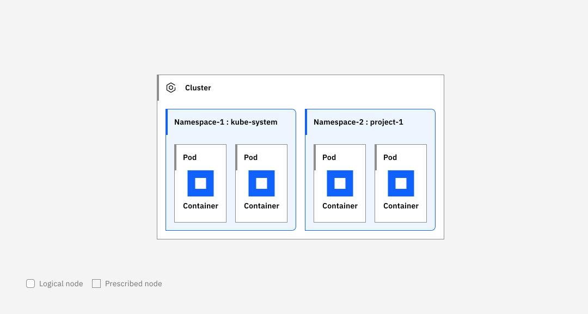

---

copyright: 
  years: 2014, 2024
lastupdated: "2024-09-25"

keywords: containers, {{site.data.keyword.containerlong_notm}}, kubernetes, infrastructure, rbac, policy, providers, benefits

subcollection: containers

---

{{site.data.keyword.attribute-definition-list}}

# Understanding {{site.data.keyword.containerlong_notm}}
{: #overview}

Learn more about [{{site.data.keyword.containerlong}}](https://www.ibm.com/products/kubernetes-service){: external}, its capabilities, and the options that are available to you to customize the cluster to your needs.
{: shortdesc}

{{site.data.keyword.containerlong_notm}} is a managed offering to create your own Kubernetes cluster of compute hosts to deploy and manage containerized apps on {{site.data.keyword.cloud_notm}}. As a certified Kubernetes provider, {{site.data.keyword.containerlong_notm}} provides intelligent scheduling, self-healing, horizontal scaling, service discovery and load balancing, automated rollouts and rollbacks, and secret and configuration management for your apps. Combined with an intuitive user experience, built-in security and isolation, and advanced tools to secure, manage, and monitor your cluster workloads, you can rapidly deliver highly available and secure containerized apps in the public cloud.
{: #overview-iks}

Review frequently asked questions and key technologies that {{site.data.keyword.containerlong_notm}} uses.

## What is Kubernetes?
{: #what-is-kube-overview}

Kubernetes is an open source platform for managing containerized workloads and services across multiple hosts, and offers management tools for deploying, automating, monitoring, and scaling containerized apps with minimal to no manual intervention.

{: caption="Figure 1. This badge indicates Kubernetes certification for IBM Cloud Container Service." caption-side="bottom"}

The open source project, Kubernetes, combines running a containerized infrastructure with production workloads, open source contributions, and Docker container management tools. The Kubernetes infrastructure provides an isolated and secure app platform for managing containers that is portable, extensible, and self-healing in case of a failover. For more information, see [What is Kubernetes?](https://www.ibm.com/topics/kubernetes){: external}.

Learn more about the key concepts of Kubernetes as illustrated in the following image.

{: caption="Figure 2. A description of key concepts for Kubernetes" caption-side="bottom"}

Account
:   Your account refers to your {{site.data.keyword.cloud_notm}} account.

Cluster, worker pool, and worker node
:   A Kubernetes cluster consists of a master and one or more compute hosts that are called worker nodes. Worker nodes are organized into worker pools of the same flavor, or profile of CPU, memory, operating system, attached disks, and other properties. The worker nodes correspond to the Kubernetes `Node` resource, and are managed by a Kubernetes master that centrally controls and monitors all Kubernetes resources in the cluster. So when you deploy the resources for a containerized app, the Kubernetes master decides which worker node to deploy those resources on, accounting for the deployment requirements and available capacity in the cluster. Kubernetes resources include services, deployments, and pods.
{: #overview-clusters}

Namespace
:   Kubernetes namespaces are a way to divide your cluster resources into separate areas that you can deploy apps and restrict access to, such as if you want to share the cluster with multiple teams. For example, system resources that are configured for you are kept in separate namespaces like `kube-system` or `ibm-system`. If you don't designate a namespace when you create a Kubernetes resource, the resource is automatically created in the `default` namespace.

Service
:   A service is a Kubernetes resource that groups a set of pods and provides network connectivity to these pods without exposing the actual private IP address of each pod. You can use a service to make your app available within your cluster or to the public internet.

Deployment
:   A deployment is a Kubernetes resource where you might specify information about other resources or capabilities that are required to run your app, such as services, persistent storage, or annotations. You document a deployment in a configuration YAML file, and then apply it to the cluster. The Kubernetes master configures the resources and deploys containers into pods on the worker nodes with available capacity.

:   Define update strategies for your app, including the number of pods that you want to add during a rolling update and the number of pods that can be unavailable at a time. When you perform a rolling update, the deployment checks whether the update is working and stops the rollout when failures are detected.

:   A deployment is just one type of workload controller that you can use to manage pods. For help choosing among your options, see [What type of Kubernetes objects can I make for my app?](/docs/containers?topic=containers-plan_deploy#object). For more information about deployments, see the [Kubernetes documentation](https://kubernetes.io/docs/concepts/workloads/controllers/deployment/){: external}.
  
Pod
:   Every containerized app that is deployed into a cluster is deployed, run, and managed by a Kubernetes resource called a pod. Pods represent small deployable units in a Kubernetes cluster and are used to group the containers that must be treated as a single unit. Usually, each container is deployed in its own pod. However, an app might require a container and other helper containers to be deployed into one pod so that those containers can be addressed by using the same private IP address.

App
:   An app might refer to a complete app or a component of an app. You might deploy components of an app in separate pods or separate worker nodes. For more information, see [Planning app deployments](/docs/containers?topic=containers-plan_deploy) and [Developing Kubernetes-native apps](/docs/containers?topic=containers-app).

To dive deeper into Kubernetes, see the [Kubernetes documentation](https://kubernetes.io/docs/home/?path=users&persona=app-developer&level=foundational){: external}.
{: tip}

## What are containers?
{: #what-are-containers-overview}

Containers provide a standard way to package your application's code, configurations, and dependencies into a single unit that can run as a resource-isolated process on a compute server. To run your app on {{site.data.keyword.cloud_notm}}, you must first containerize your app by creating a container image that you store in a container registry.

Review the following terms to get more familiar with the concepts.

Container
:   A container is an app that is packaged with all its dependencies so that the app can be moved between environments and run without changes. Unlike virtual machines, containers don't virtualize a device, its operating system, and the underlying hardware. Only the app code, run time, system tools, libraries, and settings are packaged inside the container. Containers run as isolated processes on compute hosts and share the host operating system and its hardware resources. This approach makes a container more lightweight, portable, and efficient than a virtual machine.

Image
:  A container image is a package that includes all of the files, configuration settings, and libraries to run a container. An image is built from a text file called a Dockerfile. Dockerfiles define how to build the image and which artifacts to include in it. The artifacts that are included in a container consist of the app code, configuration settings, and any dependencies.

Registry
:   An image registry is a place to store, retrieve, and share container images. Registries can either be publicly available to anyone or privately available to a small group of users. When it comes to enterprise applications, use a private registry like {{site.data.keyword.cloud_notm}} to protect your images from being used by unauthorized users.

## What compute host infrastructure does {{site.data.keyword.containerlong_notm}} offer?
{: #what-compute-infra-is-offered}

With {{site.data.keyword.containerlong}}, you can create a cluster by using infrastructure from the following providers. All the worker nodes in a cluster must be from the same provider.

| Component | Description | 
| --- | --- |
| Overview | Create clusters on virtual servers in your own Virtual Private Cloud (VPC). |
| Supported container platforms | [{{site.data.keyword.redhat_openshift_notm}}]{: tag-red} or [Kubernetes]{: tag-blue} |
| Compute and worker node resources | Worker nodes are created as virtual machines by using either shared infrastructure or dedicated hosts. Unlike classic clusters, VPC cluster worker nodes on shared hardware don't appear in your infrastructure portal or a separate infrastructure bill. Instead, you manage all maintenance and billing activity for the worker nodes through {{site.data.keyword.containerlong_notm}}. Your worker node instances are connected to certain VPC instances that do reside in your infrastructure account, such as the VPC subnet or storage volumes. For dedicated hosts, the dedicated host price covers the vCPU, memory, and any [instance storage](/docs/vpc?topic=vpc-instance-storage) to be used by any workers placed on the host. Note that all Intel® x86-64 servers have Hyper-Threading enabled by default. For more information, see [Intel Hyper-Threading Technology](/docs/vpc?topic=vpc-profiles#vpc-intel-hyper-threading-technology). |
| Security | Clusters on shared hardware run in an isolated environment in the public cloud. Clusters on dedicated hosts do not run in a shared environment, instead only your clusters are present on your hosts. Network access control lists protect the subnets that provide the floating IPs for your worker nodes. |
| High availability | The master includes three replicas for high availability. Further, if you create your cluster in a multizone metro, the master replicas are spread across zones and you can also spread your worker pools across zones. |
| Reservations | Reservations aren't available for VPC. |
| Cluster administration | VPC clusters can't be reloaded or updated. Instead, use the [`worker replace --update` CLI](/docs/containers?topic=containers-kubernetes-service-cli#cli_worker_replace) or [API operation](https://containers.cloud.ibm.com/global/swagger-global-api/#/beta/replaceWorker){: external} to replace worker nodes that are outdated or in a troubled state. |
| Cluster networking | Unlike classic infrastructure, the worker nodes of your VPC cluster are attached to VPC subnets and assigned private IP addresses. The worker nodes are not connected to the public network, which instead is accessed through a public gateway, floating IP, or VPN gateway. For more information, see [Overview of VPC networking in {{site.data.keyword.containerlong_notm}}](/docs/containers?topic=containers-vpc-subnets#vpc_basics).|
| Apps and container platform | You can choose to create community Kubernetes or {{site.data.keyword.redhat_openshift_notm}} clusters to manage your containerized apps. Your app build processes don't differ because of the infrastructure provider, but how you expose the app does. |
| App networking | All pods that are deployed to a worker node are assigned a private IP address in the 172.30.0.0/16 range and are routed between worker nodes on the worker node private IP address of the private VPC subnet. To expose the app on the public network, you can create a Kubernetes `LoadBalancer` service, which provisions a VPC load balancer and public hostname address for your worker nodes. For more information, see [Exposing apps with VPC load balancers](/docs/containers?topic=containers-vpclb-about). |
| Storage | You can choose from non-persistent and persistent storage solutions such as file, block, object, and software-defined storage. For more information, see [Planning highly available persistent storage](/docs/containers?topic=containers-storage-plan). |
| User access | You can use [{{site.data.keyword.cloud_notm}} IAM access policies](/docs/vpc?topic=vpc-iam-getting-started) to authorize users to create infrastructure, manage your cluster, and access cluster resources. The cluster can be in a different resource group than the VPC. |
| Integrations | VPC supports a select list of supported {{site.data.keyword.cloud_notm}} services, add-ons, and third-party integrations. For a list, see [Supported {{site.data.keyword.cloud_notm}} and third-party integrations](/docs/containers?topic=containers-supported_integrations). |
| Locations and versions | VPC clusters are available worldwide in the [multizone location](/docs/containers?topic=containers-regions-and-zones#zones-vpc).
| Service interface | VPC clusters are supported by the [next version (`v2`) of the {{site.data.keyword.containerlong_notm}} API](/docs/containers?topic=containers-cs_api_install), and you can manage your VPC clusters through the same CLI and console as classic clusters.| 
| Service compliance | See the VPC section in [What standards does the service comply to?](/docs/containers?topic=containers-faqs#standards).
| Service limitations | See [Service limitations](/docs/containers?topic=containers-limitations#tech_limits). For VPC-specific limitations in {{site.data.keyword.containerlong_notm}}, see [VPC cluster limitations](/docs/containers?topic=containers-limitations#ks_vpc_gen2_limits). For general VPC infrastructure provider limitations, see [Limitations](/docs/vpc?topic=vpc-limitations).  |
{: class="simple-tab-table"}
{: caption="Table 1. Infrastructure overview" caption-side="bottom"}
{: #infra-1}
{: tab-title="VPC"}
{: tab-group="infra-table"}

| Component | Description | 
| --- | --- |
| Overview | Create clusters on your own hardware, {{site.data.keyword.cloud_notm}} Classic or VPC, or on virtual servers in another cloud provider like AWS or Azure. |
| Supported container platforms | [{{site.data.keyword.redhat_openshift_notm}}]{: tag-red} |
| Compute and worker node resources | Worker nodes can be virtual machines using either shared infrastructure or dedicated hosts, or even bare metal servers. You manage maintenance and billing activity for the worker nodes through your host infrastructure provider whether that is {{site.data.keyword.cloud_notm}}, your own on-premises hardware, or another cloud provider. You also manage billing through {{site.data.keyword.cloud_notm}}. For more information about pricing, see [What am I charged for when I use {{site.data.keyword.satellitelong_notm}}?](/docs/satellite?topic=satellite-faqs#pricing). |
| Security | See [Security and compliance](/docs/satellite?topic=satellite-compliance). |
| High availability | See [About high availability and recover](/docs/satellite?topic=satellite-ha). |
| Reservations | Reservations aren't available for {{site.data.keyword.satelliteshort}}. |
| Cluster administration | See [Updating hosts that are assigned as worker nodes](/docs/satellite?topic=satellite-host-update-workers). | 
| Cluster networking | If you attach {{site.data.keyword.cloud_notm}} Classic or VPC hosts to your location, refer to those descriptions. |
| Apps and container platform | You can create [{{site.data.keyword.redhat_openshift_notm}} clusters](/docs/containers?topic=containers-faqs#container_platforms) to manage your containerized apps. Your app build processes don't differ because of the infrastructure provider, but how you expose the app does. For more information, see [Choosing an app exposure service](/docs/containers?topic=containers-cs_network_planning). |
| App networking | All pods that are deployed to a worker node are assigned a private IP address in the 172.30.0.0/16 range by default. You can avoid subnet conflicts with the network that you use to connect to your location by specifying a custom subnet CIDR that provides the private IP addresses for your pods. To expose an app, see [Exposing apps in {{site.data.keyword.satelliteshort}} clusters](/docs/openshift?topic=openshift-sat-expose-apps). |
| Storage | Bring your own storage drivers or deploy one of the supported storage templates. For more information, see [Understanding {{site.data.keyword.satelliteshort}} storage](/docs/satellite?topic=satellite-storage-template-ov). | 
| User access | You can use {{site.data.keyword.cloud_notm}} IAM access policies to authorize users to create {{site.data.keyword.cloud_notm}} infrastructure, manage your cluster, and access cluster resources. For more information, see [Managing access overview](/docs/satellite?topic=satellite-iam). You can also further control access to your host infrastructure in policies provided by your infrastructure provider.|
| Integrations | For cluster integrations, see [Supported {{site.data.keyword.cloud_notm}} and third-party integrations](/docs/containers?topic=containers-supported_integrations). For supported {{site.data.keyword.satelliteshort}} service integrations, see [Supported {{site.data.keyword.satelliteshort}} {{site.data.keyword.cloud_notm}} services](/docs/satellite?topic=satellite-managed-services).
| Locations and versions | Clusters are managed from one of the [supported {{site.data.keyword.cloud_notm}} locations](/docs/satellite?topic=satellite-sat-regions). However, you can deploy worker nodes to your own location, an {{site.data.keyword.cloud_notm}} data center, or another cloud provider. For more information see [Understanding locations and hosts](/docs/satellite?topic=satellite-location-host). |
| Service interface | {{site.data.keyword.satelliteshort}} are supported by the global [API](https://containers.cloud.ibm.com/global/swagger-global-api/) [{{site.data.keyword.containerlong_notm}}, the {{site.data.keyword.containerlong_notm}} [CLI](/docs/containers?topic=containers-cli-install) and the {{site.data.keyword.satelliteshort}} [CLI](/docs/satellite?topic=satellite-cli-install). You can also manage your clusters from the [console](https://cloud.ibm.com/satellite/clusters). |
| Service compliance | For clusters, see [What standards does the service comply to?](/docs/containers?topic=containers-faqs#standards). For {{site.data.keyword.satelliteshort}}, see [Security and compliance](/docs/satellite?topic=satellite-compliance). |
| Service limitations | See [Limitations, default settings, and usage requirements](/docs/satellite?topic=satellite-requirements). |
{: class="simple-tab-table"}
{: caption="Table 1. Infrastructure overview" caption-side="bottom"}
{: #infra-2}
{: tab-title="{{site.data.keyword.satelliteshort}}"}
{: tab-group="infra-table"}

| Component | Description | 
| --- | --- |
| Overview | Create clusters in a classic compute, networking, and storage environment in IBM Cloud infrastructure. |
| Supported container platforms | [{{site.data.keyword.redhat_openshift_notm}}]{: tag-red} or [Kubernetes]{: tag-blue} |
| Compute and worker node resources | Virtual, bare metal, and software-defined storage machines are available for your worker nodes. Your worker node instances reside in your IBM Cloud infrastructure account, but you can manage them through {{site.data.keyword.containerlong_notm}}. You own the worker node instances.|
| Security | Built-in security features that help you protect your cluster infrastructure, isolate resources, and ensure security compliance. For more information, see the [classic Network Infrastructure documentation](/docs/cloud-infrastructure?topic=cloud-infrastructure-compare-infrastructure). |
| High availability | For both classic and VPC clusters, the master includes three replicas for high availability. Further, if you create your cluster in a multizone metro, the master replicas are spread across zones and you can also spread your worker pools across zones. For more information, see [High availability for {{site.data.keyword.containerlong_notm}}](/docs/containers?topic=containers-strategy). |
| Reservations | [Create a reservation](/docs/containers?topic=containers-reservations) with contracts for 1 or 3 year terms for classic worker nodes to lock in a reduced cost for the life of the contract. Typical savings range between 30-50% compared to regular worker node costs. | 
| Cluster administration | Classic clusters support the entire set of `v1` API operations, such as resizing worker pools, reloading worker nodes, and updating masters and worker nodes across major, minor, and patch versions. When you delete a cluster, you can choose to remove any attached subnet or storage instances. | 
| Cluster networking | Your worker nodes are provisioned on private VLANs that provide private IP addresses to communicate on the private IBM Cloud infrastructure network. For communication on the public network, you can also provision the worker nodes on a public VLAN. Communication to the cluster master can be on the public or private cloud service endpoint. For more information, see [Understanding VPC cluster network basics](/docs/containers?topic=containers-plan_vpc_basics) or [Understanding Classic cluster network basics](/docs/containers?topic=containers-plan_basics). |
| Apps and container platform | You can choose to create [community Kubernetes or {{site.data.keyword.redhat_openshift_notm}} clusters](/docs/containers?topic=containers-faqs#container_platforms) to manage your containerized apps. Your app build processes don't differ because of the infrastructure provider, but how you expose the app does. For more information, see [Choosing an app exposure service](/docs/containers?topic=containers-cs_network_planning). |
| App networking | All pods that are deployed to a worker node are assigned a private IP address in the 172.30.0.0/16 range and are routed between worker nodes on the worker node private IP address of the private VLAN. To expose the app on the public network, your cluster must have worker nodes on the public VLAN. Then, you can create a NodePort, LoadBalancer (NLB), or Ingress (ALB) service. For more information, see [Planning in-cluster and external networking for apps](/docs/containers?topic=containers-cs_network_planning).
| Storage | You can choose from non-persistent and persistent storage solutions such as file, block, object, and software-defined storage. For more information, see [Planning highly available persistent storage](/docs/containers?topic=containers-storage-plan). |
| User access | To create classic infrastructure clusters, you must set up [infrastructure credentials](/docs/containers?topic=containers-access-creds) for each region and resource group. To let users manage the cluster, use [{{site.data.keyword.cloud_notm}} IAM platform access roles](/docs/containers?topic=containers-iam-platform-access-roles). To grant users access to cluster resources, use [{{site.data.keyword.cloud_notm}} IAM service access roles](/docs/containers?topic=containers-iam-platform-access-roles), which correspond with Kubernetes RBAC roles. |
| Integrations | You can extend your cluster and app capabilities with a variety of {{site.data.keyword.cloud_notm}} services, add-ons, and third-party integrations. For a list, see [Supported {{site.data.keyword.cloud_notm}} and third-party integrations](/docs/containers?topic=containers-supported_integrations). |
| Locations and versions | Classic clusters are available [worldwide](/docs/containers?topic=containers-regions-and-zones#locations). |
| Service interface | Classic clusters are fully supported in the {{site.data.keyword.containershort_notm}} [`v1` API](https://containers.cloud.ibm.com/global/swagger-global-api/#/){: external}, [CLI](/docs/containers?topic=containers-kubernetes-service-cli), and [console](https://cloud.ibm.com/kubernetes/clusters).|
| Service compliance | See the classic section in [What standards does the service comply to?](/docs/containers?topic=containers-faqs#standards). |
| Service limitations | See [Service limitations](/docs/containers?topic=containers-limitations#tech_limits). Feature-specific limitations are documented by section. |
{: class="simple-tab-table"}
{: caption="Table 1. Infrastructure overview" caption-side="bottom"}
{: #infra-3}
{: tab-title="Classic"}
{: tab-group="infra-table"}

## What are the benefits of using the service?
{: #benefits}

{{_include-segments/service-benefits.md}}

## Comparison between {{site.data.keyword.redhat_openshift_notm}} and Kubernetes clusters
{: #openshift_kubernetes}

Both {{site.data.keyword.openshiftlong_notm}} and {{site.data.keyword.containerlong_notm}} clusters are production-ready container platforms that are tailored for enterprise workloads. The following table compares and contrasts some common characteristics that can help you choose which container platform is best for your use case.
{: shortdesc}

|Characteristics|Kubernetes clusters|{{site.data.keyword.redhat_openshift_notm}} clusters|
|---------------|-------------|-----------------|
|Complete cluster management experience through the {{site.data.keyword.containerlong_notm}} automation tools (API, CLI, console)|Yes|Yes|
|Worldwide availability in single and multizones|Yes|Yes|
|Consistent container orchestration across hybrid cloud providers|Yes|Yes|
|Access to {{site.data.keyword.cloud_notm}} services such as AI|Yes|Yes|
|Software-defined storage Portworx solution available for multizone data use cases|Yes|Yes|
|Create a cluster in an IBM Virtual Private Cloud (VPC)|Yes|Yes|
|Latest Kubernetes distribution|Yes| |
|Scope {{site.data.keyword.cloud_notm}} IAM access policies to access groups for service access roles that sync to cluster RBAC |Yes| |
|Classic infrastructure cluster on only the private network|Yes| |
| GPU bare metal worker nodes | Yes | Yes |
|Integrated IBM Cloud Paks and middleware| |Yes|
|Built-in container image streams, builds, and tooling ([read more](https://blog.cloudowski.com/articles/why-managing-container-images-on-openshift-is-better-than-on-kubernetes/){: external})| |Yes|
|Integrated CI/CD with Jenkins| |Yes|
|Stricter app security context set up by default| |Yes|
|Simplified Kubernetes developer experience, with an app console that is suited for beginners| |Yes|
|Supported operating system| [Kubernetes version information](/docs/containers?topic=containers-cs_versions) | [{{site.data.keyword.redhat_openshift_notm}} version information](/docs/openshift?topic=openshift-openshift_versions) |
|Preferred external traffic networking| Ingress | Router |
|Secured routes encrypted with {{site.data.keyword.hscrypto}} | | Yes |
{: caption="Characteristics of Kubernetes and {{site.data.keyword.redhat_openshift_notm}} clusters" caption-side="bottom"}
{: #iks-os-table}

## Related resources
{: #kubernetes-resources}

Review how you can learn about Kubernetes concepts and the terminology.
{: shortdesc}

* Learn how Kubernetes and {{site.data.keyword.containerlong_notm}} work together by completing this [course](https://cognitiveclass.ai/courses/kubernetes-course){: external}.
