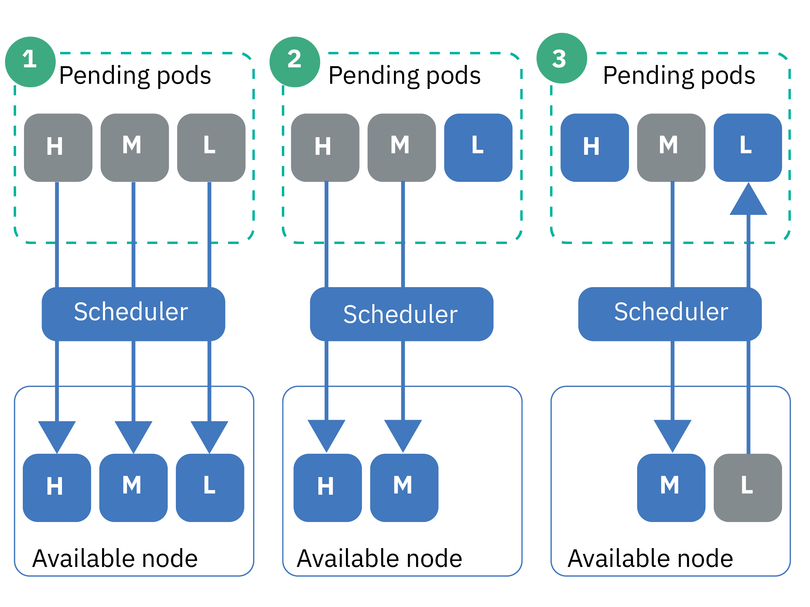

---

copyright: 
  years: 2014, 2024
lastupdated: "2024-02-16"


keywords: kubernetes

subcollection: containers


---

{{site.data.keyword.attribute-definition-list}}


# Setting pod priority
{: #pod_priority}

With pod priority and preemption, you can configure priority classes to indicate the relative priority of the pods that make up your Kubernetes cluster's workload. The Kubernetes scheduler takes into consideration the priority of a pod and can even preempt (remove) pods with lower priority to make room on a worker node for higher priority pods.
{: shortdesc}

Why do I set pod priority?
:   As a cluster administrator, you want to control which pods are more critical to your cluster workload. Priority classes can help you control the Kubernetes scheduler decisions to favor higher priority pods over lower priority pods. The Kubernetes scheduler can even preempt (remove) lower priority pods that are running so that pending higher priority pods can be scheduled.

By setting pod priority, you can help prevent lower priority workloads from impacting critical workloads in your cluster, especially in cases where the cluster starts to reach its resource capacity.


Make sure that you have [set up proper user access](/docs/containers?topic=containers-users#users) to your cluster, and if applicable, [pod security policies (PSPs)](/docs/containers?topic=containers-psp). Access policies and PSPs can help prevent untrusted users from deploying high priority pods that prevent other pods from scheduling.
{: tip}


**How does priority scheduling and preemption work?** {: #priority_scheduling}

In general, pending pods that have a higher priority are scheduled before lower prioritized pods. If you don't have enough resources remaining in your worker nodes, the Kubernetes scheduler can preempt (remove) pods to free up enough resources for the higher prioritized pods to be scheduled. Preemption is also affected by graceful termination periods, pod disruption budgets, and worker node affinity.

If you don't specify a priority for your pod deployment, the default is set to the priority class that is set as the `globalDefault` . If you don't have a `globalDefault` priority class, the default priority for all pods is zero (`0`). By default, {{site.data.keyword.containerlong_notm}} does not set a `globalDefault`, so the pod default priority is zero.

To understand how pod priority and Kubernetes scheduler work together, consider the scenarios in the following figure. You must place prioritized pods on worker nodes with available resources. Otherwise, high priority pods in your cluster can remain in pending at the same time that existing pods are removed, such as in Scenario 3.

{: caption="Figure 1. Pod priority scenarios" caption-side="bottom"}

1. Three pods with high, medium, and low priority are pending scheduling. The Kubernetes scheduler finds an available worker node with room for all three pods, and schedules them in order of priority, with the highest priority pod scheduled first.
2. Three pods with high, medium, and low priority are pending scheduling. The Kubernetes scheduler finds an available worker node, but the worker node has only enough resources to support the high and medium priority pods. The low-priority pod is not scheduled and it remains in pending.
3. Two pods with high and medium priority are pending scheduling. A third pod with low priority exists on an available worker node. However, the worker node does not have enough resources to schedule any of the pending pods. The Kubernetes scheduler preempts, or removes, the low-priority pod, which returns the pod to a pending state. Then, the Kubernetes scheduler tries to schedule the high priority pod. However, the worker node does not have enough resources to schedule the high priority pod, and instead, the Kubernetes scheduler schedules the medium priority pod.

For more information, see the Kubernetes documentation about [pod priority and preemption](https://kubernetes.io/docs/concepts/scheduling-eviction/pod-priority-preemption/){: external}.

Can I disable the pod priority admission controller?
:   No. If you don't want to use pod priority, don't set a `globalDefault` or include a priority class in your pod deployments. Every pod defaults to zero, except the cluster-critical pods that IBM deploys with the [default priority classes](#default_priority_class). Because pod priority is relative, this basic setup ensures that the cluster-critical pods are prioritized for resources, and schedules any other pods by following the existing scheduling policies that you have in place.

How do resource quotas affect pod priority?
:   You can use pod priority in combination with resource quotas, including [quota scopes](https://kubernetes.io/docs/concepts/policy/resource-quotas/#quota-scopes){: external}. With quota scopes, you can set up your resource quotas to account for pod priority. Higher priority pods get to consume system resources that are limited by the resource quota before lower priority pods.


## Understanding default priority classes
{: #default_priority_class}

Your {{site.data.keyword.containerlong}} clusters come with some priority classes by default.
{: shortdesc}

Do not modify the default classes, which are used to properly manage your cluster. You can use these classes in your app deployments, or [create your own priority classes](#create_priority_class).
{: important}

The following table describes the priority classes that are in your cluster by default and why they are used.

| Name | Set by | Priority Value | Purpose |
|---|---|---|---|
| `system-node-critical` | Kubernetes | 2000001000 | Select pods that are [deployed into privileged system namespaces](/docs/containers?topic=containers-pod-security-admission) when you create the cluster use this priority class to protect critical functionality for worker nodes, such as for networking, storage, logging, monitoring, and metrics pods. |
| `system-cluster-critical` | Kubernetes | 2000000000 | Select pods that are [deployed into privileged system namespaces](/docs/containers?topic=containers-pod-security-admission) when you create the cluster use this priority class to protect critical functionality for clusters, such as for networking, storage, logging, monitoring, and metrics pods. |
| `ibm-app-cluster-critical` | {{site.data.keyword.IBM_notm}} | 900000000 | Select pods that are [deployed into privileged system namespaces](/docs/containers?topic=containers-pod-security-admission) when you create the cluster use this priority class to protect critical functionality for apps, such as the load balancer pods. |
{: caption="Default priority classes that you must not modify" caption-side="bottom"}

You can check which pods use the priority classes by running the following command.

```sh
kubectl get pods --all-namespaces -o custom-columns=NAME:.metadata.name,PRIORITY:.spec.priorityClassName
```
{: pre}

## Creating a priority class
{: #create_priority_class}

To set pod priority, you need to use a priority class.
{: shortdesc}

Before you begin:
* [Log in to your account. If applicable, target the appropriate resource group. Set the context for your cluster.](/docs/containers?topic=containers-access_cluster)
* Ensure that you have the [**Writer** or **Manager** {{site.data.keyword.cloud_notm}} IAM service access role](/docs/containers?topic=containers-users#checking-perms) for the `default` namespace.


1. List existing priority classes. You can use an existing priority class as a template for the new class.

    ```sh
    kubectl get priorityclasses
    ```
    {: pre}

2. Choose the priority class that you want to copy and create a local YAML file.

    ```sh
    kubectl get priorityclass <priority_class> -o yaml > Downloads/priorityclass.yaml
    ```
    {: pre}

1. Make your priority class YAML file.

    ```yaml
    apiVersion: scheduling.k8s.io/v1alpha1
    kind: PriorityClass
    metadata:
      name: <priority_class_name>
    value: <1000000>
    globalDefault: <false>
    description: "Use this class for XYZ service pods only."
    ```
    {: codeblock}

    | Components | Description | 
    |---|-------|
    | `name` | Required: The name of the priority class that you want to create. |
    | `value` | Required: Enter an integer less than or equal to 1 billion (1000000000). The higher the value, the higher the priority. Values are relative to the values of other priority classes in the cluster. Reserve very high numbers for system critical pods that you don't want to be preempted (removed). \n \n For example, the [default cluster-critical priority classes](#default_priority_class) range in value from 900000000-2000001000, so enter a value less than these numbers for new priority classes so that nothing is prioritized higher than these pods. |
    | `globalDefault` | Optional: Set the field to `true` to make this priority class the global default that is applied to every pod that is scheduled without a `priorityClassName` value. Only one priority class in your cluster can be set as the global default. If there is no global default, pods with no `priorityClassName` specified have a priority of zero (`0`). \n \n The [default priority classes](#default_priority_class) don't set a `globalDefault`. If you created other priority classes in your cluster, you can check to make sure that they don't set a `globalDefault` by running `kubectl describe priorityclass <name>`. |
    | `description` | Optional: Tell users why to use this priority class. Enclose the string in quotations (`""`). |
    {: caption="Understanding the YAML file components" caption-side="bottom"}

1. Create the priority class in your cluster.

    ```sh
    kubectl apply -f filepath/priorityclass.yaml
    ```
    {: pre}

1. Verify that the priority class is created.

    ```sh
    kubectl get priorityclasses
    ```
    {: pre}

Great! You created a priority class. Let your team know about the priority class and which priority class, if any, that they must use for their pod deployments.  

## Assigning priority to your pods
{: #prioritize}

Assign a priority class to your pod spec to set the pod's priority within your {{site.data.keyword.containerlong_notm}} cluster.
{: shortdesc}

Before you begin:
* [Log in to your account. If applicable, target the appropriate resource group. Set the context for your cluster.](/docs/containers?topic=containers-access_cluster)
* Ensure that you have the [**Writer** or **Manager** {{site.data.keyword.cloud_notm}} IAM service access role](/docs/containers?topic=containers-users#checking-perms) in the namespace that you want to deploy the pods to.
* [Understand how priority scheduling works](#priority_scheduling), as priority can preempt existing pods and affect how your cluster's resources are consumed.


Complete the following steps to check the importance of other deployed pods so that you can choose the correct priority class for your pods in relation to what already is deployed.

1. View the priority classes that other pods in the namespace use.

    ```sh
    kubectl get pods -n <namespace> -o custom-columns=NAME:.metadata.name,PRIORITY:.spec.priorityClassName
    ```
    {: pre}

1. Get the details of the priority class and note the **value** number. Pods with higher numbers are prioritized before pods with lower numbers. Repeat this step for each priority class that you want to review.

    ```sh
    kubectl describe priorityclass <priorityclass_name>
    ```
    {: pre}

1. Get the priority class that you want to use, or [create your own priority class](#create_priority_class).

    ```sh
    kubectl get priorityclasses
    ```
    {: pre}

1. In your pod spec, add the `priorityClassName` field with the name of the priority class that you retrieved in the previous step.

    ```yaml
    apiVersion: apps/v1
    kind: Deployment
    metadata:
      name: ibmliberty
    spec:
      replicas: 1
      selector:
        matchLabels:
          app: ibmliberty
      template:
        metadata:
          labels:
            app: ibmliberty
        spec:
          containers:
          - name: ibmliberty
            image: icr.io/ibm/liberty:latest
            ports:
            - containerPort: 9080
          priorityClassName: <priorityclass_name>
    ```
    {: codeblock}

1. Create your prioritized pods in the namespace that you want to deploy them to.

    ```sh
    kubectl apply -f filepath/pod-deployment.yaml
    ```
    {: pre}


