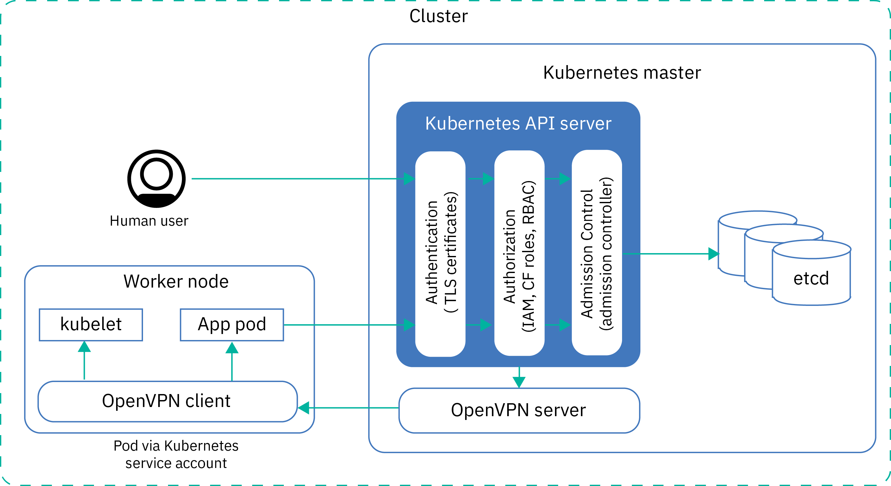
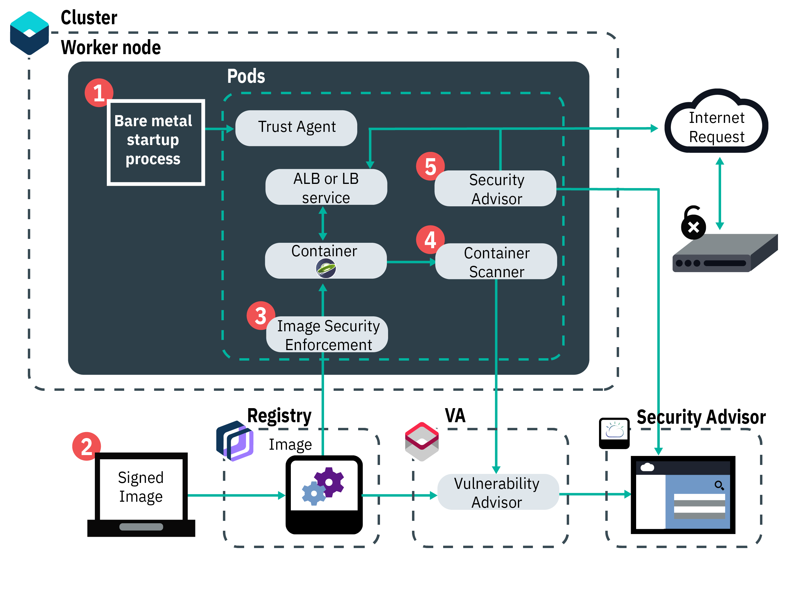
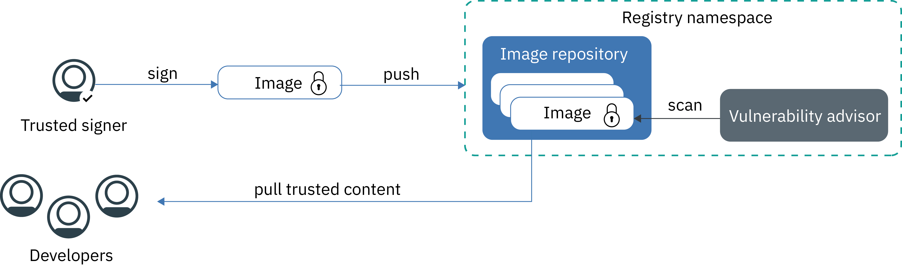

---

copyright: 
  years: 2014, 2022
lastupdated: "2022-12-01"

keywords: kubernetes, containers

subcollection: containers


---

{{site.data.keyword.attribute-definition-list}}


# Security for {{site.data.keyword.containerlong_notm}}
{: #security}

You can use built-in security features in {{site.data.keyword.containerlong}} for risk analysis and security protection. These features help you to protect your cluster infrastructure and network communication, isolate your compute resources, and ensure security compliance across your infrastructure components and container deployments.
{: shortdesc}

For an analysis of security guidelines by product version, see [CIS Kubernetes Benchmark](/docs/containers?topic=containers-cis-benchmark).
{: tip}

## Overview of security threats for your cluster
{: #threats}

To protect your cluster from being compromised, you must understand potential security threats for your cluster and what you can do to reduce the exposure to vulnerabilities.
{: shortdesc}

External attacks
:   Attackers that gain access to your cluster, deployed resources, apps, or personal information.

Vulnerable deployments
:   Known vulnerabilities are exploited to gain access to the cloud environment and run malicious software.

Compromised or lost data
:   Incorrect storage of sensitive data and missing encryption.

Insiders and third party vendors
:   Missing network isolation and segmentation can lead to the misuse of legitimate permissions.


Cloud security and the protection of your systems, infrastructure, and data against attacks became very important over the last couple of years as companies continue to move their workloads into the public cloud. A cluster consists of several components that each can put your environment at risk for malicious attacks. To protect your cluster against these security threats, you must make sure that you apply the latest {{site.data.keyword.containerlong_notm}} and Kubernetes security features and updates in all cluster components.

These components include:
- [Kubernetes API server and etcd data store](#apiserver)
- [Worker nodes](#workernodes)
- [Network](#network)
- [Persistent storage](#storage)
- [Monitoring and Logging](#monitoring_logging)
- [Container images and registry](#images_registry)
- [Container isolation and security](#container)
- [Personal information](#pi)


## Kubernetes API server and etcd
{: #apiserver}

The Kubernetes API server and etcd data store are the most sensitive components that run in your Kubernetes master. You want to prevent unauthorized access to these components because they set and store the configurations for all the resources that run in your cluster, including some security settings of your applications.
{: shortdesc}

Kubernetes provides security controls and limits access to protect these components and reduce the risk of cyber attacks.

### How is access to my API server granted?
{: #api-server-access}

By default, Kubernetes requires every request to go through several stages before access to the API server is granted.

Authentication
:   Validates the identity of a registered user or service account.

Authorization
:   Limits the permissions of authenticated users and service accounts to ensure that they can access and operate only the cluster components that you want them to.

Admission control
:   Validates or mutates requests before they are processed by the Kubernetes API server. Many Kubernetes features require admission controllers to properly function.

### What does {{site.data.keyword.containerlong_notm}} do to secure my API server and etcd data store?
{: #secure-api-server}

The following image shows the default cluster security settings that address authentication, authorization, admission control, and secure connectivity between the Kubernetes master and worker nodes.

{: caption="Figure 1. Security stages when accessing the Kubernetes API server" caption-side="bottom"}


Review the following security features for Kubernetes API server and etcd.

Fully managed and dedicated Kubernetes master
:   Every cluster in {{site.data.keyword.containerlong_notm}} is controlled by a dedicated Kubernetes master that is managed by IBM in an IBM-owned {{site.data.keyword.cloud_notm}} account. The Kubernetes master is set up with the following dedicated components that are not shared with other IBM customers.
    - **etcd data store:** Stores all Kubernetes resources of a cluster, such as `Services`, `Deployments`, and `Pods`. Kubernetes `ConfigMaps` and `Secrets` are app data that is stored as key value pairs so that they can be used by an app that runs in a pod. Data in etcd is stored on the local disk of the Kubernetes master and is backed up to {{site.data.keyword.cos_full_notm}}. Data is encrypted during transit to {{site.data.keyword.cos_full_notm}} and at rest. You can choose to enable encryption for your etcd data on the local disk of your Kubernetes master by [enabling {{site.data.keyword.keymanagementservicelong_notm}} encryption](/docs/containers?topic=containers-encryption#keyprotect) for your cluster. When etcd data is sent to a pod, data is encrypted via TLS to ensure data protection and integrity.
    - **kube-apiserver:** Serves as the main entry point for all cluster management requests from the worker node to the Kubernetes master. The API server validates and processes requests that change the state of cluster resources, such as pods or services, and stores this state in the etcd data store.
    - **kube-scheduler:** Decides where to deploy pods, considering the capacity and performance needs, hardware and software policy constraints, anti-affinity specifications, and workload requirements. If no worker node can be found that matches the requirements, the pod is not deployed in the cluster.
    - **kube-controller-manager:** Responsible for monitoring replica sets, and creating corresponding pods to achieve the specified state.
    - **OpenVPN (Kubernetes version 1.20 or earlier) or Konnectivity (Kubernetes version 1.21 or later):** {{site.data.keyword.containerlong_notm}}-specific component to provide secured network connectivity for all Kubernetes master to worker node communication. The OpenVPN or Konnectivity server works with the OpenVPN client or Konnectivity agent to securely connect the master to the worker node. This connection supports `apiserver proxy` requests to your pods and services, and `kubectl top`, `exec`, `attach`, and `logs` requests to the kubelet. The connection from the worker nodes to the master is automatically secured with TLS certificates.

Continuous monitoring by IBM Site Reliability Engineers (SREs)
:   The Kubernetes master, including all the master components, compute, networking, and storage resources are continuously monitored by IBM Site Reliability Engineers (SREs). The SREs apply the latest security standards, detect and remediate malicious activities, and work to ensure reliability and availability of {{site.data.keyword.containerlong_notm}}.

CIS Kubernetes master benchmark
:   To configure {{site.data.keyword.containerlong_notm}}, IBM engineers follow relevant cybersecurity practices from the Kubernetes master benchmark that is published by the [Center of Internet Security (CIS)](https://www.cisecurity.org/benchmark/kubernetes/){: external}. The cluster master and all worker nodes are deployed with images that meet the benchmark.

Secure communication via TLS
:   To use {{site.data.keyword.containerlong_notm}}, you must authenticate with the service by using your credentials. When you are authenticated, {{site.data.keyword.containerlong_notm}} generates TLS certificates that encrypt the communication to and from the Kubernetes API server and etcd data store to ensure a secure end-to-end communication between the worker nodes and the Kubernetes master. These certificates are never shared across clusters or across Kubernetes master components.

    Need to revoke existing certificates and create new certificates for your cluster? Check out [Rotating CA certificates in your cluster](#cert-rotate).
    {: tip}
    
OpenVPN (Kubernetes version 1.20 or earlier) or Konnectivity (Kubernetes version 1.21 or later) connectivity to worker nodes
:   Although Kubernetes secures the communication between the master and worker nodes by using the `https` protocol, no authentication is provided on the worker node by default. To secure this communication, {{site.data.keyword.containerlong_notm}} automatically sets up an OpenVPN or Konnectivity connection between the Kubernetes master and the worker node when the cluster is created.

Fine-grained access control
:   As the account administrator you can [grant access to other users for {{site.data.keyword.containerlong_notm}}](/docs/containers?topic=containers-users#users) by using {{site.data.keyword.cloud_notm}} Identity and Access Management (IAM). {{site.data.keyword.cloud_notm}} IAM provides secure authentication with the {{site.data.keyword.cloud_notm}} platform, {{site.data.keyword.containerlong_notm}}, and all the resources in your account. Setting up proper user roles and permissions is key to limiting who can access your resources and to limiting the damage that a user can do when legitimate permissions are misused. You can select from the following pre-defined user roles that determine the set of actions that the user can perform: 
    - **Platform access roles:** Determine the cluster and worker node management-related actions that a user can perform in {{site.data.keyword.containerlong_notm}}.  
    - **Service access roles:** Determine the [Kubernetes RBAC role](https://kubernetes.io/docs/reference/access-authn-authz/rbac/){: external} that is assigned to the user and the actions that a user can run against the Kubernetes API server. With RBAC roles, users can create Kubernetes resources, such as  app deployments, namespaces, or configmaps.  For more information about the corresponding RBAC roles that are assigned to a user and associated permissions, see [{{site.data.keyword.cloud_notm}} IAM service access roles](/docs/containers?topic=containers-iam-service-access-roles). 
    - **Classic infrastructure:** Enables access to your classic {{site.data.keyword.cloud_notm}} infrastructure resources. Example actions that are permitted by classic infrastructure roles are viewing the details of cluster worker node machines or editing networking and storage resources.
    - **VPC infrastructure:** Enables access to VPC infrastructure resources. Example actions that are permitted by VPC infrastructure roles are creating a VPC, adding subnets, changing floating IP addresses, and creating VPC Block Storage instances.

    For more information about access control in a cluster, see [Assigning cluster access](/docs/openshift?topic=openshift-users).

Pod access via service account token
:   For clusters that run Kubernetes 1.21 and later, the service account tokens that pods use to communicate with the Kubernetes API server are time-limited, automatically refreshed, scoped to a particular audience of users (the pod), and invalidated after the pod is deleted. To continue communicating with the API server, you must design your apps to read the refreshed token value on a regular basis, such as every minute. For more information, see [Bound Service Account Tokens](https://github.com/kubernetes/enhancements/blob/master/keps/sig-auth/1205-bound-service-account-tokens/README.md){: external}.

Admission controllers
:   Admission controllers are implemented for specific features in Kubernetes and {{site.data.keyword.containerlong_notm}}. With admission controllers, you can set up policies in your cluster that determine whether a particular action in the cluster is allowed or not. In the policy, you can specify conditions when a user can't perform an action, even if this action is part of the general permissions that you assigned the user by using RBAC roles. Therefore, admission controllers can provide an extra layer of security for your cluster before an API request is processed by the Kubernetes API server.
  
When you create a cluster, {{site.data.keyword.containerlong_notm}} automatically installs the default [Kubernetes admission controllers](https://kubernetes.io/docs/reference/access-authn-authz/admission-controllers/){: external} in a particular order in the Kubernetes master, which can't be changed by the user. Review the order of default admission controllers by cluster version in the [`kube-apiserver` component reference information](/docs/containers?topic=containers-service-settings#kube-apiserver).

You can [install your own admission controllers in the cluster](https://kubernetes.io/docs/reference/access-authn-authz/extensible-admission-controllers/#admission-webhooks){: external} or choose an optional admission controller, such as [Portieris](/docs/openshift?topic=openshift-images#portieris-image-sec). With Portieris, you can block container deployments from unsigned images. 

If you manually installed admission controllers and you don't want to use them anymore, make sure to remove them entirely. If admission controllers are not entirely removed, they might block all actions that you want to perform on the cluster.
{: note}

### What else can I do to secure my API server?
{: #api-server-what-else}

You can restrict connections to the master nodes by enabling the private cloud service endpoint, and creating a subnet allowlist. This combination provides the greatest degree of isolation.. Note that your options for service endpoints vary based on your cluster's infrastructure provider. For more information about service endpoints, see worker-to-master and user-to-master communication in [classic clusters](/docs/containers?topic=containers-plan_basics#workeruser-master) and [VPC clusters](/docs/containers?topic=containers-plan_vpc_basics#vpc-workeruser-master).

If you enable the private cloud service endpoint, you can create a subnet allowlist. Only authorized requests to your cluster master that originate from subnets in the allowlist are permitted through the cluster's private cloud service endpoint. For more information, see [Creating an allowlist for the private cloud service endpoint](/docs/containers?topic=containers-access_cluster#private-se-allowlist).

### Rotating CA certificates in your cluster
{: #cert-rotate}

Revoke existing certificate authority (CA) certificates in your cluster and issue new CA certificates.
{: shortdesc}

By default, certificate authority (CA) certificates are administered to secure access to various components of your cluster, such as the master API server. As you use your cluster, you might want to revoke the certificates issued by the existing CA. For example, the administrators of your team might use a certificate signing request (CSR) to manually generate certificates that are signed by the cluster's CA for worker nodes in the cluster. If an administrator leaves your organization, you can ensure that they no longer have admin access to your cluster by creating a new CA and certificates for your cluster, and removing the old CA and certificates.

1. Create a CA for your cluster. Certificates that are signed by this new CA are issued for the cluster master components, and the API server is refreshed.

    ```sh
    ibmcloud ks cluster ca create -c CLUSTER
    ```
    {: pre}

2. Ensure that your cluster's master health is normal, the API server refresh is complete, and any master updates are complete. It might take several minutes for the master API server to refresh.

    ```sh
    ibmcloud ks cluster get --cluster CLUSTER
    ```
    {: pre}

3. Check the status of the CA creation. In the output, note the timestamp in the **Action Completed** field.
    ```sh
    ibmcloud ks cluster ca status -c CLUSTER
    ```
    {: pre}

    Example output

    ```sh
    Status:             CA certificate creation complete. Ensure that your worker nodes are reloaded before you start a CA certificate rotation.
    Action Started:     2020-08-30T16:17:56+0000
    Action Completed:   2020-08-30T16:21:13+0000
    ```
    {: screen}

4. Download the updated Kubernetes configuration data and certificates in your cluster's `kubeconfig` file.

    ```sh
    ibmcloud ks cluster config -c CLUSTER --admin --network
    ```
    {: pre}

5. Update any tooling that relies on the previous certificates.
    * If you use {{site.data.keyword.blockchainfull}}, you must [re-establish connectivity between the {{site.data.keyword.blockchain}} management console and your cluster](/docs/blockchain?topic=blockchain-ibp-console-manage-console#ibp-console-refresh).
    * If you use the certificate from your cluster's `kubeconfig` file in your own service such as Travis or Jenkins, or if you use `calicoctl` to manage Calico network policies, update your services and automation to use the new certificates.

6. Verify that the timestamps on your new certificates are later than the timestamp that you found in step 3. To check the date on your certificates, you can use a tool such as [KeyCDN](https://tools.keycdn.com/ssl){: external}.

7. [Reload your classic worker nodes](/docs/containers?topic=containers-kubernetes-service-cli#cs_worker_reload) or [replace your VPC worker nodes](/docs/containers?topic=containers-kubernetes-service-cli#cli_worker_replace) to pick up the certificates that are signed by the new CA.

8. Rotate the old certificates with the new certificates. The old CA certificates in your cluster are removed.
    ```sh
    ibmcloud ks cluster ca rotate -c CLUSTER
    ```
    {: pre}

9. Check the status of the CA certificate rotation.
    ```sh
    ibmcloud ks cluster ca status -c CLUSTER
    ```
    {: pre}

    Example output
    
    ```sh
    Status:             CA certificate rotation complete.
    Action Started:     2020-08-30T16:37:56+0000
    Action Completed:   2020-08-30T16:41:13+0000
    ```
    {: screen}


## Worker node
{: #workernodes}

Worker nodes carry the deployments and services that make up your app. When you host workloads in the public cloud, you want to ensure that your app is protected from being accessed, changed, or monitored by an unauthorized user or software.
{: shortdesc}

### Who owns the worker node and am I responsible to secure it?
{: #worker-node-owner}

The ownership of a worker node depends on the type of cluster that you create and the infrastructure provider that you choose.

- **Free classic clusters**: Worker nodes are provisioned in to the {{site.data.keyword.cloud_notm}} account that is owned by IBM. You can deploy apps to the worker node but can't change settings or install extra software on the worker node. Due to limited capacity and limited {{site.data.keyword.containerlong_notm}} features, don't run production workloads on free classic clusters. Consider using standard classic or standard VPC clusters for your production workloads.
- **Standard classic clusters**: Worker nodes are provisioned in to your {{site.data.keyword.cloud_notm}} account. The worker nodes are dedicated to you and you are responsible to request timely updates to the worker nodes to ensure that the worker node OS and {{site.data.keyword.containerlong_notm}} components apply the latest security updates and patches.
- **Standard VPC clusters**: Worker nodes are provisioned in to an {{site.data.keyword.cloud_notm}} account that is owned by IBM to enable monitoring of malicious activities and apply security updates. You can't access your worker nodes by using the VPC dashboard. However, you can manage your worker nodes by using the {{site.data.keyword.containerlong_notm}} console, CLI, or API. The virtual machines that make up your worker nodes are dedicated to you and you are responsible to request timely updates so that your worker node OS and {{site.data.keyword.containerlong_notm}} components apply the latest security updates and patches.

For more information, see [Your responsibilities by using {{site.data.keyword.containerlong_notm}}](/docs/containers?topic=containers-responsibilities_iks).

Use the `ibmcloud ks worker update` [command](/docs/containers?topic=containers-kubernetes-service-cli#cs_worker_update) regularly (such as monthly) to deploy updates and security patches to the operating system and to update the Kubernetes version that your worker nodes run. When updates are available, you are notified when you view information about the master and worker nodes in the {{site.data.keyword.cloud_notm}} console or CLI, such as with the `ibmcloud ks clusters ls` or `ibmcloud ks workers ls --cluster <cluster_name>` commands. Worker node updates are provided by IBM as a full worker node image that includes the latest security patches. To apply the updates, the worker node must be reimaged and reloaded with the new image. Keys for the root user are automatically rotated when the worker node is reloaded.
{: important}

### How does my worker node setup look?
{: #worker-node-setup}

The following image shows the components that are set up for every worker node to protect your worker node from malicious attacks.

The image does not include components that ensure secure end-to-end communication to and from the worker node. For more information, see [network security](#network).
{: note}

{: caption="Figure 2. Worker node setup in {{site.data.keyword.containerlong_notm}} excluding network security" caption-side="bottom"}


CIS-compliant Linux image
:   Every worker node is set up with an Ubuntu operating system that implements the benchmarks that are published by the Center of Internet Security (CIS). The user or the owner of the machine can't change this operating system to another operating system. To review the current Ubuntu version, run `kubectl get nodes -o wide`. IBM works with internal and external security advisory teams to address potential security compliance vulnerabilities. Security updates and patches for the operating system are made available through {{site.data.keyword.containerlong_notm}} and must be installed by the user to keep the worker node secure.
    {{site.data.keyword.containerlong_notm}} uses an Ubuntu Linux kernel for worker nodes. You can run containers based on any Linux distribution in {{site.data.keyword.containerlong_notm}}. Check with your container image vendor to verify that your container images can run on an Ubuntu kernel.
    {: important}

Continuous monitoring by Site Reliability Engineers (SREs)
:   The image that is installed on your worker nodes is continuously monitored by IBM Site Reliability Engineers (SREs) to detect vulnerabilities and security compliance issues. To address vulnerabilities, SREs create security patches and fix packs for your worker nodes. Make sure to apply these patches when they are available to ensure a secure environment for your worker nodes and the apps that you run on them.

CIS Kubernetes worker node benchmark
:   To configure {{site.data.keyword.containerlong_notm}}, IBM engineers follow relevant cybersecurity practices from the Kubernetes worker node benchmark that is published by the [Center of Internet Security (CIS)](https://www.cisecurity.org/benchmark/kubernetes/){: external}. You can review the compliance of worker nodes against [CIS Kubernetes benchmark](/docs/containers?topic=containers-cis-benchmark#cis-worker-test) standards.

Compute isolation
:   Worker nodes are dedicated to a cluster and don't host workloads of other clusters. When you create a standard classic cluster, you can choose to provision your worker nodes as [physical machines (bare metal) or as virtual machines](/docs/containers?topic=containers-planning_worker_nodes#planning_worker_nodes) that run on shared or dedicated physical hardware. Worker nodes in a free classic cluster or in a standard VPC compute cluster can be provisioned as virtual machines on shared infrastructure only.</td>

Option to deploy bare metal on classic</td>
:   If you create a standard classic cluster, you can choose to provision your worker nodes on bare metal physical servers (instead of virtual server instances). With bare metal machines, you have additional control over the compute host, such as the memory or CPU. This setup eliminates the virtual machine hypervisor that allocates physical resources to virtual machines that run on the host. Instead, all a bare metal machine's resources are dedicated exclusively to the worker, so you don't need to worry about "noisy neighbors" sharing resources or slowing down performance. Bare metal servers are dedicated to you, with all its resources available for cluster usage.

Encrypted disks {: #encrypted_disk}
:   By default, every worker node is provisioned with two local SSD, AES 256-bit encrypted data partitions. The first partition contains the kernel image that is used to boot the worker node and is not encrypted. The second partition holds the container file system and is unlocked by using LUKS encryption keys. Each worker node in a cluster has its own unique LUKS encryption key, managed by {{site.data.keyword.containerlong_notm}}. When you create a cluster or add a worker node to an existing cluster, the keys are pulled securely and then discarded after the encrypted disk is unlocked.
    Encryption can impact disk I/O performance. For workloads that require high-performance disk I/O, test a cluster with encryption both enabled and disabled to help you decide whether to turn off encryption.
    {: note}

Expert AppArmor policies
:   Every worker node is set up with security and access policies that are enforced by [AppArmor](https://wiki.ubuntu.com/AppArmor){: external} profiles that are loaded into the worker node during bootstrapping. AppArmor profiles can't be changed by the user or owner of the machine. 

SSH disabled
:   By default, SSH access is disabled on the worker node to protect your cluster from malicious attacks. When SSH access is disabled, access to the cluster is forced via the Kubernetes API server. The Kubernetes API server requires every request to be checked against the policies that are set in the authentication, authorization, and admission control module before the request is executed in the cluster.
:   If you have a standard cluster and you want to install more features on your worker node, you can choose between the add-ons that are provided by {{site.data.keyword.containerlong_notm}} or use [Kubernetes daemon sets](https://kubernetes.io/docs/concepts/workloads/controllers/daemonset/){: external} for everything that you want to run on every worker node. For any one-time action that you must execute, use [Kubernetes jobs](https://kubernetes.io/docs/concepts/workloads/controllers/job/){: external}.

## Network
{: #network}

The classic approach to protect a company's network is to set up a firewall and block any unwanted network traffic to your apps. While this is still true, research shows that many malicious attacks come from insiders or authorized users who misuse their assigned permissions.
{: shortdesc}

### Network segmentation and privacy for classic clusters
{: #network_segmentation}

To protect your network and limit the range of damage that a user can do when access to a network is granted, you must make sure that your workloads are as isolated as possible and that you limit the number of apps and worker nodes that are publicly exposed.
{: shortdesc}

### What network traffic is allowed for my Classic cluster by default?
{: #default-network-traffic-allowed}

All containers are protected by [predefined Calico network policy settings](/docs/containers?topic=containers-network_policies#default_policy) that are configured on every worker node during cluster creation. By default, all outbound network traffic is allowed for all worker nodes. Inbound network traffic is blocked with the following exceptions:
- **NodePort**: The [Kubernetes NodePort range](https://kubernetes.io/docs/concepts/services-networking/service/#nodeport){: external} is opened by default so that you can expose apps with [NodePort services](/docs/containers?topic=containers-nodeport). To block inbound network traffic on NodePorts in your cluster, see [Controlling inbound traffic to NLB or NodePort services](/docs/containers?topic=containers-network_policies#block_ingress).
- **IBM monitoring ports**: By default, IBM opens a few ports on your cluster so that network traffic can be monitored by IBM and for IBM to automatically install security updates for the Kubernetes master.

Access from the Kubernetes master to the worker node's kubelet is secured by an OpenVPN (Kubernetes version 1.20 or earlier) or Konnectivity (Kubernetes version 1.21 or later) tunnel. For more information, see the [{{site.data.keyword.containerlong_notm}} architecture](/docs/containers?topic=containers-service-arch).

### What is network segmentation and how can I set it up for a Classic cluster?
{: #network-segmentation-setup}

Network segmentation describes the approach to divide a network into multiple subnetworks. You can group apps and related data to be accessed by a specific group in your organization. Apps that run in one subnetwork can't see or access apps in another subnetwork. Network segmentation also limits the access that is provided to an insider or third-party software and can limit the range of malicious activities.   

{{site.data.keyword.containerlong_notm}} provides {{site.data.keyword.cloud_notm}} VLANs that ensure quality network performance and network isolation for worker nodes. A VLAN configures a group of worker nodes and pods as if they were attached to the same physical wire. VLANs are dedicated to your {{site.data.keyword.cloud_notm}} account and not shared across IBM customers. In classic clusters, if you have multiple VLANs for your cluster, multiple subnets on the same VLAN, or a multizone classic cluster, you must enable a [Virtual Router Function (VRF)](/docs/account?topic=account-vrf-service-endpoint#vrf) for your IBM Cloud infrastructure account so your worker nodes can communicate with each other on the private network. To enable VRF, see [Enabling VRF](/docs/account?topic=account-vrf-service-endpoint#vrf). To check whether a VRF is already enabled, use the `ibmcloud account show` command. If you can't or don't want to enable VRF, enable [VLAN spanning](/docs/vlans?topic=vlans-vlan-spanning#vlan-spanning). To perform this action, you need the **Network > Manage Network VLAN Spanning** [infrastructure permission](/docs/containers?topic=containers-access-creds#infra_access), or you can request the account owner to enable it. To check whether VLAN spanning is already enabled, use the `ibmcloud ks vlan spanning get --region <region>` [command](/docs/containers?topic=containers-kubernetes-service-cli#cs_vlan_spanning_get).

When you enable VRF or VLAN spanning for your account, network segmentation is removed for your clusters.
{: important}

Review the following table to see your options for how to achieve network segmentation when you enable VRF or VLAN spanning for your account.

|Security feature|Description|
|-------|----------------------------------|
|Set up custom network policies with Calico|You can use the built-in Calico interface to [set up custom Calico network policies](/docs/containers?topic=containers-network_policies#network_policies) for your worker nodes. For example, you can allow or block network traffic on specific network interfaces, for specific pods, or services. To set up custom network policies, you must [install the `calicoctl` CLI](/docs/containers?topic=containers-network_policies#cli_install).|
|Support for {{site.data.keyword.cloud_notm}} network firewalls|{{site.data.keyword.containerlong_notm}} is compatible with all [{{site.data.keyword.cloud_notm}} firewall offerings](https://www.ibm.com/cloud/network-security){: external}. For example, you can set up a firewall with custom network policies to provide dedicated network security for your standard cluster and to detect and remediate network intrusion. For example, you might choose to set up a [Virtual Router Appliance](/docs/virtual-router-appliance?topic=virtual-router-appliance-about-the-vra) to act as your firewall and block unwanted traffic. When you set up a firewall, [you must also open up the required ports and IP addresses](/docs/containers?topic=containers-firewall#firewall) for each region so that the master and the worker nodes can communicate.|
{: caption="Network segmentation options" caption-side="bottom"}

### What else can I do to reduce the surface for external attacks for Classic clusters?
{: #external-what-else}

The more apps or worker nodes that you expose publicly, the more steps you must take to prevent external malicious attacks. Review the following table to find options for how to keep apps and worker nodes private.

|Security feature|Description|
|-------|----------------------------------|
|Limit the number of exposed apps|By default, your apps and services that run within the cluster are not reachable over the public internet. You can choose if you want to expose your apps to the public, or if you want your apps and services be reachable on the private network only. When you keep your apps and services private, you can leverage the built-in security features to assure secured communication between worker nodes and pods. To expose services and apps to the public internet, you can leverage the [NLB and Ingress ALB support](/docs/containers?topic=containers-cs_network_planning#public_access) to securely make your services publicly available. Ensure that only necessary services are exposed, and revisit the list of exposed apps regularly to ensure that they are still valid. |
|Keep worker nodes private|When you create a cluster, every cluster is automatically connected to a private VLAN. The private VLAN determines the private IP address that is assigned to a worker node. You can choose to keep your worker nodes private by connecting them to a private VLAN only. Private VLANs in free clusters are managed by IBM, and private VLANs in standard clusters are managed by you in your {{site.data.keyword.cloud_notm}} account. . Keep in mind that to communicate with the Kubernetes master from your local machine and for {{site.data.keyword.containerlong_notm}} to connect to {{site.data.keyword.cloud_notm}} services that don't support a private cloud service endpoint, you must configure public connectivity to [specific URLs and IP addresses](/docs/containers?topic=containers-firewall#firewall_outbound). If the {{site.data.keyword.cloud_notm}} services that you want to connect to have a private cloud service endpoint and your account is enabled for VRF, network traffic to and from these services is automatically routed over the private network and no public network connection is required. To set up public connectivity for cluster that is connected to a private VLAN only, you can configure a firewall, such as a [Virtual Router Appliance](/docs/virtual-router-appliance?topic=virtual-router-appliance-about-the-vra), in front of your worker nodes and enable network traffic to these URLs and IP addresses.|
|Limit public internet connectivity with gateway nodes|Gateway worker nodes help you achieve network connectivity separation between the internet or an on-premises data center and the compute workload that runs in your cluster. When you [create a classic cluster with a gateway](/docs/containers?topic=containers-cluster-create-classic&interface=ui), the cluster is created with a `compute` worker pool of compute worker nodes that are connected to a private VLAN only, and a `gateway` worker pool of gateway worker nodes that are connected to public and private VLANs. The gateway worker pool provides an edge firewall in the form of Calico policies for ingress and egress traffic, load balancers for ingress traffic to the cluster, and a gateway for egress traffic from the cluster. All NLB pods deploy to the gateway worker nodes, which are also tainted so that no compute workloads can be scheduled onto them. Then, if you want to provide another level of network separation between the public network and your worker pools of compute worker nodes, you can optionally [create an edge worker pool](/docs/containers?topic=containers-edge#edge_nodes). When you create an edge node worker pool in a gateway-enabled cluster, ALB pods are deployed to edge worker nodes only. By deploying only ALBs to edge nodes, all layer 7 proxy management is kept separate from the gateway worker nodes so that TLS termination and HTTP request routing is completed by the ALBs on the private network only.|
|Limit public internet connectivity with edge nodes|If you don't create a cluster with a gateway enabled, every worker node is configured to accept app pods and associated load balancer or ingress pods. You can label worker nodes as [edge nodes](/docs/containers?topic=containers-edge#edge) to force load balancer and Ingress pods to be deployed to these worker nodes only. In addition, you can [taint your worker nodes](/docs/containers?topic=containers-edge#edge_workloads) so that app pods can't schedule onto the edge nodes. With edge nodes, you can isolate the networking workload on fewer worker nodes in your cluster and keep other worker nodes in the cluster private.|
{: caption="Private services and worker node options" caption-side="bottom"}

### What if I want to connect my cluster to an on-prem data center?
{: #onprem-network-setup}

To connect your worker nodes and apps to an on-prem data center, you can configure a [VPN IPSec endpoint with a strongSwan service, a Virtual Router Appliance, or with a Fortigate Security Appliance](/docs/containers?topic=containers-vpn#vpn).

### Network segmentation and privacy for VPC clusters
{: #network_segmentation_vpc}

To protect your network and limit the range of damage that a user can do when access to a network is granted, you must make sure that your workloads are as isolated as possible and that you limit the number of apps and worker nodes that are publicly exposed.
{: shortdesc}

### What network traffic is allowed for my VPC cluster by default?
{: #vpc-network-traffic-default}

By default, worker nodes are connected to [VPC subnets](/docs/containers?topic=containers-vpc-subnets) on the private network only and don't have a public network interface. All public ingress to your worker nodes is blocked. Public egress from your worker nodes is only allowed if the workers are connected to a VPC subnet that has a public gateway.

If your worker nodes must access a public endpoint outside of the cluster, you can attach a [public gateway](/docs/vpc?topic=vpc-about-networking-for-vpc#public-gateway-for-external-connectivity) to the VPC subnet that the worker nodes are deployed to. For example, your VPC cluster can automatically connect to other [{{site.data.keyword.cloud_notm}} services that support private cloud service endpoints](/docs/account?topic=account-vrf-service-endpoint), such as {{site.data.keyword.registrylong_notm}}. However, if you need to access {{site.data.keyword.cloud_notm}} services that support only public cloud service endpoints, you can attach a public gateway to the subnet so that your pods can send requests over the public network. All egress is permitted for worker nodes on a subnet with an attached public gateway, but all ingress is still blocked.

If you deploy apps in your cluster that must receive traffic requests from the internet, you can [create a VPC load balancer](/docs/containers?topic=containers-vpc-lbaas) to expose your apps. To allow ingress network traffic to your apps, you must configure your VPC load balancer for the ingress network traffic that you want to receive. 

Security groups are applied to your VPC instance and VPC ALBs by default. For more information, see [Controlling traffic with VPC security groups](/docs/containers?topic=containers-vpc-security-group).
{: note}

### What is network segmentation and how can I set it up for a VPC cluster?
{: #network-segment-what-is}

Network segmentation describes the approach to divide a network into multiple subnetworks. You can group apps and related data to be accessed by a specific group in your organization. Apps that run in one subnetwork can't see or access apps in another subnetwork. Network segmentation also limits the access that is provided to an insider or third-party software and can limit the range of malicious activities.  

{{site.data.keyword.containerlong_notm}} provides {{site.data.keyword.vpc_short}} subnets that ensure quality network performance and network isolation for worker nodes. A VPC subnet consists of a specified private IP address range (CIDR block) and configures a group of worker nodes and pods as if they were attached to the same physical wire. VPC subnets are dedicated to your {{site.data.keyword.cloud_notm}} account and not shared across IBM customers.

VPC subnets provide a channel for connectivity among the worker nodes within the cluster. Any system that is connected to any of the private subnets in the same VPC can communicate with workers. For example, all subnets in one VPC can communicate through private layer 3 routing with a built-in VPC router. If your clusters don't need to communicate, you can achieve the best network segmentation by creating the clusters in separate VPCs. If you have multiple clusters that must communicate with each other, you can create the clusters in the same VPC. Although subnets within one VPC can be shared by multiple clusters in that VPC, you can achieve better network segmentation by using different subnets for clusters within one VPC.

To achieve further private network segmentation between VPC subnets for your account, you can set up custom network policies with VPC access control lists (ACLs). When you create a VPC, a default ACL is created in the format `allow-all-network-acl-<VPC_ID>` for the VPC. Any subnet that you create in the VPC is attached to this ACL by default. The ACL includes an inbound rule and an outbound rule that allow all traffic between your worker nodes on a subnet and any system on the subnets in the same VPC. If you want to specify which private network traffic is permitted to the worker nodes on your VPC subnets, you can create a custom ACL for each subnet in the VPC. For example, you can [create a set of ACL rules](/docs/openshift?topic=openshift-vpc-acls) to block most inbound and outbound private network traffic of a cluster, while allowing communication that is necessary for the cluster to function.

### What else can I do to reduce the surface for external attacks for VPC clusters?
{: #vpc-external-what-else}

The more apps or worker nodes that you expose publicly, the more steps you must take to prevent external malicious attacks. Review the following table to find options for how to keep apps and worker nodes private.

|Security feature|Description|
|-------|----------------------------------|
|Limit the number of exposed apps|By default, your apps and services that run within the cluster are not reachable over the public internet. You can choose if you want to expose your apps to the public, or if you want your apps and services be reachable on the private network only. When you keep your apps and services private, you can leverage the built-in security features to assure secured communication between worker nodes and pods. To expose services and apps to the public internet, you can leverage the [VPC load balancer and Ingress ALB support](/docs/containers?topic=containers-cs_network_planning#pattern_public_vpc) to securely make your services publicly available. Ensure that only necessary services are exposed, and revisit the list of exposed apps regularly to ensure that they are still valid. |
|Limit public network egress to one subnet with a public gateway|If pods on your worker nodes need to connect to a public external endpoint, you can attach a public gateway to the subnet that those worker nodes are on. You can isolate this network traffic in your cluster by attaching a public gateway to only one subnet in your cluster. Then, you can [set affinity rules](/docs/containers?topic=containers-vpc-subnets#vpc-restrict-gateway) to deploy app pods that require access to external endpoints to only the subnet with an attached public gateway.|
{: caption="VPC network security options" caption-side="bottom"}

Depending on the network that you want to connect your worker nodes to, you can [choose a VPN solution](/docs/containers?topic=containers-vpc-vpnaas).

### Securely expose apps with LoadBalancer and Ingress services
{: #network_lb_ingress}

You can use network load balancer (NLB) and Ingress application load balancer (ALB) networking services to connect your apps to the public internet or to external private networks. Review the following optional settings for NLBs and ALBs that you can use to meet back-end app security requirements or encrypt traffic as it moves through your cluster.
{: shortdesc}

### Can I use security groups to manage my cluster's network traffic?
{: #can-i-use-security-groups}

Classic clusters: {{site.data.keyword.cloud_notm}} [security groups](/docs/security-groups?topic=security-groups-about-ibm-security-groups#about-ibm-security-groups) are applied to the network interface of a single virtual server to filter traffic at the hypervisor level. If you want to manage traffic for each worker node, you can use security groups. When you create a security group, you must allow the VRRP protocol, which {{site.data.keyword.containerlong_notm}} uses to manage NLB IP addresses. To uniformly manage traffic for your cluster across all your worker nodes, use [Calico and Kubernetes policies](/docs/containers?topic=containers-network_policies).

VPC clusters: VPC security groups are applied to the network interface of a single virtual server to filter traffic at the hypervisor level. You can add inbound and outbound rules to the default security group for your cluster to manage inbound and outbound traffic to a VPC cluster. The default rules of the security group for your cluster differs with your cluster's VPC generation and version.
* VPC clusters that run Kubernetes version 1.19 or later:
    * The default security group for the VPC is applied to your worker nodes. This security group allows incoming ICMP packets (pings) and incoming traffic from other worker nodes in your cluster.
    * Additionally, a unique security group that is named in the format `kube-<cluster_ID>` is automatically created and applied to the worker nodes for that cluster. This security group allows incoming traffic requests to the 30000 - 32767 port range on your worker nodes, and ensures that all inbound and outbound traffic to the pod subnet is permitted so that worker nodes can communicate with each other across subnets. Do not modify or delete this security group.
* VPC clusters that run Kubernetes version 1.18 or earlier: The default security group for the VPC is applied to your worker nodes. This security group denies all incoming traffic requests to your worker nodes.

Because the worker nodes of your VPC cluster exist in a service account and are not listed in the VPC infrastructure dashboard, you can't create a security group and apply it to your worker node instances. You can only modify existing security groups that are created for you.
{: note}


### How can I secure the source IP within the cluster?
{: #secure-source-ip-cluster}

In version 2.0 NLBs, the source IP address of the client request is preserved by default. However, in version 1.0 NLBs and in all Ingress ALBs, the source IP address of the client request is not preserved. When a client request to your app is sent to your cluster, the request is routed to a pod for the NLB 1.0 or ALB. If no app pod exists on the same worker node as the load balancer service pod, the NLB or ALB forwards the request to an app pod on a different worker node. The source IP address of the package is changed to the public IP address of the worker node where the app pod runs.

Preserving the client’s IP is useful, for example, when app servers have to apply security and access-control policies. To preserve the original source IP address of the client request, you can enable source IP preservation for [version 1.0 NLBs](/docs/containers?topic=containers-loadbalancer#lb_source_ip) or [Ingress ALBs](/docs/containers?topic=containers-comm-ingress-annotations#preserve_source_ip).

### How can I do TLS termination with LoadBalancer and Ingress services?
{: #tls-termination-lb}

The Ingress service offers TLS termination at two points in the traffic flow:
* [Decrypt package upon arrival](/docs/containers?topic=containers-ingress-types#alb-comm-create): By default, the Ingress ALB load balances HTTP network traffic to the apps in your cluster. To also load balance incoming HTTPS connections, you can configure the ALB to decrypt the network traffic and forward the decrypted request to the apps that are exposed in your cluster. If you use the IBM-provided Ingress subdomain, you can use the IBM-provided TLS certificate. If you use a custom domain, you can use your own TLS certificate to manage TLS termination.
* [Re-encrypt package before you forward it to upstream apps](/docs/containers?topic=containers-comm-ingress-annotations#ssl-services-support): The ALB decrypts HTTPS requests before forwarding traffic to your apps. If you have apps that require HTTPS and need traffic to be encrypted before it is forwarded to those upstream apps, you can use the `ssl-services` annotation. If your upstream apps can handle TLS, you can optionally provide a certificate that is contained in a one-way or mutual-authentication TLS secret.

To secure the service-to-service communication, you can use [Istio's mutual TLS authentication](https://istio.io/latest/docs/concepts/security/#mutual-tls-authentication){: external}. Istio is an open source service that gives developers a way to connect, secure, manage, and monitor a network of microservices, also known a service mesh, on cloud orchestration platforms like Kubernetes.


## Persistent storage
{: #storage}

Review supported options for encrypting and protecting your data on persistent storage in {{site.data.keyword.cloud_notm}}.
{: shortdesc}

By default, all {{site.data.keyword.cloud_notm}} storage solutions automatically encrypt your data at rest with an IBM-managed encryption key at no additional cost. For more information, see the following links.
- [Classic NFS {{site.data.keyword.filestorage_short}}](/docs/FileStorage?topic=FileStorage-mng-data#encryptvolume)
- [Classic Block Storage](/docs/BlockStorage?topic=BlockStorage-mng-data)
- [VPC Block Storage](/docs/vpc?topic=vpc-block-storage-about#vpc-storage-encryption)
- [{{site.data.keyword.cos_full_notm}}](/docs/cloud-object-storage?topic=cloud-object-storage-encryption)


Depending on the type of storage that you choose, you can set up additional encryption with {{site.data.keyword.keymanagementservicelong_notm}} to protect your data in transit and at rest with your own encryption key.
- [VPC Block Storage](/docs/containers?topic=containers-vpc-block#vpc-block-encryption)
- [{{site.data.keyword.cos_full_notm}}](/docs/cloud-object-storage?topic=cloud-object-storage-encryption)
- [Portworx](/docs/containers?topic=containers-portworx#encrypt_volumes)

You can also use an {{site.data.keyword.cloud_notm}} database service, such as [{{site.data.keyword.cloudant}} NoSQL DB](/docs/Cloudant?topic=Cloudant-getting-started-with-cloudant), to persist data in a managed database outside the cluster. Data that is stored with a cloud database service can be accessed across clusters, zones, and regions. For security-related information, see the database service-specific {{site.data.keyword.cloud_notm}} documentation.


## Monitoring and logging
{: #monitoring_logging}

The key to detect malicious attacks in your cluster is the proper monitoring and logging of metrics and all the events that happen in the cluster. Monitoring and logging can also help you understand the cluster capacity and availability of resources for your app so that you can plan accordingly to protect your apps from a downtime.
{: shortdesc}

Does IBM monitor my cluster?
:   Every cluster master is continuously monitored by IBM to control and remediate process level Denial-Of-Service (DOS) attacks. {{site.data.keyword.containerlong_notm}} automatically scans every node where the master is deployed for vulnerabilities that are found in Kubernetes and OS-specific security fixes. If vulnerabilities are found, {{site.data.keyword.containerlong_notm}} automatically applies fixes and resolves vulnerabilities on behalf of the user to ensure master node protection.  

What information is logged?
:   By default, {{site.data.keyword.containerlong_notm}} automatically collects logs for the following cluster components:
    - **Containers**: Logs that are written to `STDOUT` or `STDERR`.
    - **Apps**: Logs that are written to a specific path inside your app.
    - **Workers**: Logs from the Ubuntu operating system that are sent to `/var/log/syslog` and `/var/log/auth.log`.
    - **Kubernetes API server**: Every cluster-related action that is sent to the Kubernetes API server is logged for auditing reasons, including the time, the user, and the affected resource. For more information, see [Kubernetes audit logs](https://kubernetes.io/docs/tasks/debug/debug-cluster/audit/){: external}. You can access these logs by using {{site.data.keyword.at_full_notm}}. For more information, see the [getting started tutorial](/docs/activity-tracker?topic=activity-tracker-getting-started). 
    - **Ingress**: Logs for an Ingress application load balancer (ALB) that manages inbound network traffic.
    - **Kubernetes system components**: Logs from the `kubelet`, the `kube-proxy`, and other components that run in the `kube-system` namespace.

To access cluster component logs, you can choose to forward your logs to {{site.data.keyword.la_full_notm}}, an external server, or a third-party logging solution. For more information, see [Choosing a logging solution](/docs/containers?topic=containers-health#logging_overview).

How can I monitor the health and performance of my cluster?
:   You can verify the health, capacity, and performance of your apps, services, and worker nodes by monitoring your cluster components and compute resources from the {{site.data.keyword.containerlong_notm}} console or CLI, such as the CPU and memory usage. To view more in-depth metrics for a standard cluster or your apps, you can configure a monitoring agent in your cluster to send metrics to {{site.data.keyword.mon_full_notm}}. You can also install third-party monitoring solutions, such as Prometheus or Weave Scope, or use the metrics that are provided in the Kubernetes dashboard. For more information, see [Choosing a monitoring solution](/docs/containers?topic=containers-health-monitor#view_metrics).

To set up a host-based intrusion detection system (HIDS) and security event log monitoring (SELM), install third-party tools that are designed to monitor your cluster and containerized apps to detect intrusion or misuse, such as [Twistlock](https://www.paloaltonetworks.com/prisma/cloud){: external} or the [Sysdig Falco project](https://sysdig.com/opensource/falco/){: external}.

How can I audit events that happen in my cluster?
:   You can [set up {{site.data.keyword.cloudaccesstraillong}} in your {{site.data.keyword.containerlong_notm}} cluster](/docs/containers?topic=containers-at_events#at_events). For more information, view the [{{site.data.keyword.cloudaccesstrailshort}} documentation](/docs/activity-tracker?topic=activity-tracker-getting-started).

What are my options to enable trust in my cluster?
:   By default, {{site.data.keyword.containerlong_notm}} provides many features for your cluster components so that you can deploy your containerized apps in a security-rich environment. Extend your level of trust in your cluster to better ensure that what happens within your cluster is what you intended to happen. You can implement trust in your cluster in various ways, as shown in the following diagram.

{: caption="Figure 1. Deploying containers with trusted content" caption-side="bottom"}

1. **Content Trust for your images**: Ensure the integrity of your images by enabling content trust in your {{site.data.keyword.registrylong_notm}}. With trusted content, you can control who can sign images as trusted. After trusted signers push an image to your registry, users can pull the signed content so that they can verify the source of the image. For more information, see [Signing images for trusted content](/docs/Registry?topic=Registry-registry_trustedcontent#registry_trustedcontent).

2. **Container Image Security Enforcement**: Use an admission controller with custom policies so that you can verify container images before you deploy them. With a container image security enforcement project like [Portieris](/docs/openshift?topic=openshift-images#portieris-image-sec), you control where the images are deployed from and ensure that they meet [content trust](/docs/Registry?topic=Registry-registry_trustedcontent#registry_trustedcontent) requirements. If a deployment does not meet the policies that you set, security enforcement prevents modifications to your cluster.

3. **Image Vulnerability Scanner**: By default, Vulnerability Advisor scans images that are stored in {{site.data.keyword.registrylong_notm}} to find potential security vulnerabilities. For more information, see [Managing image security with Vulnerability Advisor](/docs/Registry?topic=va-va_index).

4. **{{site.data.keyword.compliance_long}}**: When you enable {{site.data.keyword.compliance_long}}, you can view reports about suspicious incoming and outgoing network traffic. For more information, see [What is {{site.data.keyword.compliance_long}}?](/docs/security-compliance?topic=security-compliance-getting-started).

5. **{{site.data.keyword.secrets-manager_full}}**: You can store your Ingress and Kubernetes secrets in {{site.data.keyword.secrets-manager_full}}. When you integrate {{site.data.keyword.secrets-manager_short}} into your cluster, you set a default {{site.data.keyword.secrets-manager_short}} instance where all Ingress subdomain secrets are uploaded. For more information, see [Setting up {{site.data.keyword.secrets-manager_short}} in your Kubernetes Service cluster](/docs/containers?topic=containers-secrets-mgr).


## Image and registry
{: #images_registry}

Every deployment is based on an image that holds the instructions for how to spin up the container that runs your app. These instructions include the operating system inside the container and extra software that you want to install. To protect your app, you must protect the image and establish checks to ensure the image's integrity.
{: shortdesc}

Should I use a public or a private registry to store my images?
:   Public registries, such as Docker Hub, can be used to get started with Docker images and Kubernetes to create your first containerized app in a cluster. But when it comes to enterprise applications, avoid registries that you don't know or don't trust to protect your cluster from malicious images. Keep your images in a private registry, like the one provided in {{site.data.keyword.registrylong_notm}} and make sure to control access to the registry and the image content that can be pushed.

Why is it important to check images against vulnerabilities?
:   Research shows that most malicious attacks leverage known software vulnerabilities and weak system configurations. When you deploy a container from an image, the container spins up with the OS and extra binaries that you described in the image. Just like you protect your virtual or physical machine, you must eliminate known vulnerabilities in the OS and binaries that you use inside the container to protect your app from being accessed by unauthorized users.

To protect your apps, consider to address the following areas:

1. **Automate the build process and limit permissions**: Automate the process to build your container image from your source code to eliminate source code variations and defects. By integrating the build process into your CI/CD pipeline, you can ensure that your image is scanned and built only if the image passes the security checks that you specified. To avoid that developers apply hot fixes to sensitive images, limit the number of people in your organization who have access to the build process.

2. **Scan images before they deploy into production:**  Make sure to scan every image before you deploy a container from it. For example, if you use {{site.data.keyword.registrylong_notm}}, all images are automatically scanned for vulnerabilities when you push the image to your namespace. If vulnerabilities are found, consider eliminating the vulnerabilities or block deployment for those images. Find a person or team in your organization who is responsible for monitoring and removing vulnerabilities. Depending on your organizational structure, this person might be part of a security, operations, or deployment team. Enable [content trust](/docs/Registry?topic=Registry-registry_trustedcontent#registry_trustedcontent) so that images must be approved by a trusted signer before they can be pushed to the container registry. Then, [install the open source Portieris project](https://github.com/IBM/portieris){: external} admission controller to block container deployments from unsigned images.

3. **Regularly scan running containers:**. Even if you deployed a container from an image that passes the vulnerability check, the operating system or binaries that run in the container might get vulnerable over time. To protect your app, you must ensure that running containers are regularly scanned so that you can detect and remediate vulnerabilities. Depending on the app, to add extra security, you can establish a job that takes down vulnerable containers after they are detected.

{: caption="Figure 1. Deploying containers with trusted content" caption-side="bottom"})


|Security feature|Description|
|--|--|
|Secured Docker private image repository in {{site.data.keyword.registrylong_notm}}|Set up your own Docker [image repository](/docs/Registry?topic=Registry-getting-started#getting-started) in a multi-tenant, highly available, and scalable private image registry that is hosted and managed by IBM. By using the registry, you can build, securely store, and share Docker images across cluster users.  /n Learn more about [securing your personal information](/docs/containers?topic=containers-security#pi) when you work with container images.|
|Push images with trusted content only|Ensure the integrity of your images by enabling [content trust](/docs/Registry?topic=Registry-registry_trustedcontent#registry_trustedcontent) in your image repository. With trusted content, you can control who can sign images as trusted and push images to a specific registry namespace. After trusted signers push an image to a registry namespace, users can pull the signed content so that they can verify the publisher and the integrity of the image.|
|Automatic vulnerability scans|When you use {{site.data.keyword.registrylong_notm}}, you can leverage the built-in security scanning that is provided by [Vulnerability Advisor](/docs/va?topic=va-va_index#va_registry_cli). Every image that is pushed to your registry namespace is automatically scanned for vulnerabilities against a database of known CentOS, Debian, Red Hat, and Ubuntu issues. If vulnerabilities are found, Vulnerability Advisor provides instructions for how to resolve them to ensure image integrity and security.|
|Block deployments from vulnerable images or untrusted users|Create an admission controller with custom policies so that you can verify container images before you deploy them. With the [open source Portieris project](https://github.com/IBM/portieris){: external}, you control where the images are deployed from and ensure that they meet content trust requirements. If a deployment does not meet the policies that you set, the admission controller blocks the deployment in your cluster.|
{: caption="Security for images and deployments" caption-side="bottom"}


What options do I have to scan running containers for vulnerabilities?
:   You can install third-party solutions in your cluster, such as [Twistlock](https://www.paloaltonetworks.com/prisma/cloud){: external} or [StackRox](https://www.stackrox.com){: external} to scan running containers and block malicious activities when they are detected.


## Container isolation and security
{: #container}

When you run multiple apps in your cluster, you want to make sure that your workloads run isolated from each other and that you restrict the permissions of your pods within the cluster to avoid noisy neighbors or denial-of-service attacks.
{: shortdesc}

What is a Kubernetes namespace and why should I use it?
:   Kubernetes namespaces are a way to virtually partition a cluster and provide isolation for your deployments and the groups of users that want to move their workload onto the cluster. With namespaces, you can organize resources across worker nodes and also across zones in multizone clusters.  
:   Every cluster is set up with a set of default Kubernetes namespaces that include the deployments and services that are required for {{site.data.keyword.containerlong_notm}} to run properly and manage the cluster. For more information, see the [service architecture](/docs/containers?topic=containers-service-arch). 
:   Cluster administrators automatically have access to these namespaces and can set up additional namespaces in the cluster. 

For every namespace that you have in the cluster, make sure to set up proper [RBAC policies](/docs/containers?topic=containers-users#rbac) to limit access to this namespace, control what gets deployed, and to set proper [resource quotas](https://kubernetes.io/docs/concepts/policy/resource-quotas/){: external} and [limit ranges](https://kubernetes.io/docs/tasks/administer-cluster/manage-resources/memory-default-namespace/){: external}.
{: important}

### Should I set up a single-tenant or a multi-tenant cluster?
{: #single-tenant-or-multi}

In a single-tenant cluster, you create one cluster for every group of people that must run workloads in a cluster. Usually, this team is responsible to manage the cluster and to properly configure and secure it. Multi-tenant clusters use multiple namespaces to isolate tenants and their workloads.

{: caption="Figure 1. Single tenant versus multi-tenant cluster" caption-side="bottom"}

Deciding between single-tenant and multi-tenant clusters depends on the number of teams that must run workloads in a cluster, their service requirements, the size of the service, and the level of isolation that you want to achieve for your workloads.

A single-tenant cluster might be your option if you have many teams with complex services that each must have control over the lifecycle of the cluster. This includes having the freedom to decide when a cluster is updated or what resources can be deployed to the cluster. You can also configure a single-tenant cluster to allow privileged pods without putting other tenants at risk of being compromised. Keep in mind that managing a cluster requires in-depth Kubernetes and infrastructure knowledge to ensure cluster capacity and security for your deployments.  

Multi-tenant clusters use Kubernetes namespaces to isolate tenants and are usually managed by a separate team that does not belong to one of the tenants. A multi-tenant cluster might be your option if you have multiple teams that must run small workloads in a cluster, and where creating a single-tenant cluster that is highly available across multiple zones does not bring the cost benefits that you want. While multi-tenant clusters usually require fewer people to manage and administer the cluster, they might not provide the level of isolation that you need and add more complexity in the following areas:

- **Access:** When you set up multiple namespaces, you must configure proper RBAC policies for each namespace to ensure resource isolation. RBAC policies are complex and require in-depth Kubernetes knowledge.
- **Privileged pods:** If one tenant in a multi-tenant cluster requires to run privileged pods, this pod can access other namespaces in the cluster or damage the shared compute host. Controlling privileged pods is a complex task that requires effort and deep technical expertise. Use [pod security policies (PSPs)](/docs/containers?topic=containers-psp) to control what resources your tenants can deploy in the cluster.
- **Network policies:** Because your worker nodes are connected to the same private network, you must make sure that you have strict network policies in place to prevent pods from accessing pods in other namespaces.
- **Compute resource limitation:** To ensure that every team has the necessary resources to deploy services and run apps in the cluster, you must set up [resource quotas](https://kubernetes.io/docs/concepts/policy/resource-quotas/){: external} for every namespace. Resource quotas determine the deployment constraints for a namespace, such as the number of Kubernetes resources that you can deploy, and the amount of CPU and memory that can be consumed by those resources. After you set a quota, users must include resource requests and limits in their deployments.
- **Shared cluster resources:** If you run multiple tenants in one cluster, some cluster resources, such as the Ingress application load balancer (ALB) or available portable IP addresses are shared across tenants. Smaller services might have a hard time using shared resources if they must compete against large services in the cluster.
- **Updates:** You can run one Kubernetes API version at a time only. All apps that run in a cluster must comply with the current Kubernetes API version independent of the team that owns the app. When you want to update a cluster, you must ensure that all teams are ready to switch to a new Kubernetes API version and that apps are updated accordingly. This also means that individual teams have less control over the Kubernetes API version they want to run.
- **Changes in cluster setup:** If you want to change the cluster setup or reschedule workloads onto new worker nodes, you must roll out this change across tenants. This roll out requires more reconciliation and testing than in a single-tenant cluster.
- **Communication process:** When you manage multiple tenants, consider setting up a communication process so that tenants know where to go when an issue with the cluster exists, or when they need more resources for their services. This communication process also includes informing your tenants about all changes in the cluster setup or planned updates.

Although single-tenant and multi-tenant clusters come with roughly the same costs, single-tenant clusters provide a higher level of isolation than the namespaces in a multi-tenant cluster. For better workload isolation, use single-tenant clusters.
{: important}

By default, any pod has access to any other pod in the cluster. Additionally, any pod has access to any services that are exposed by the pod network, such as a metrics service, the cluster DNS, the API server, or any services that you manually create in your cluster. [Kubernetes network policies](/docs/containers?topic=containers-network_policies#isolate_services) protect pods from internal network traffic. For example, if most or all pods don't require access to specific pods or services, and you want to ensure that pods by default can't access those pods or services, you can create a Kubernetes network policy to block ingress traffic to those pods or services. Kubernetes network policies can also help you enforce workload isolation between namespaces by controlling how pods and services in different namespaces can communicate.

How can I control pod permissions?
:   By default, every cluster enables the [Kubernetes pod security policy admission controller](https://kubernetes.io/docs/concepts/security/pod-security-policy/){: external} that you can use to define what requirements a pod must meet to get deployed in a namespace. With pod security policies, you can control the usage of privileged containers, root namespaces, host networking and ports, volume types, host file systems, and Linux permissions such as read-only or group IDs. For more information, see [Configuring pod security policies](/docs/containers?topic=containers-psp).

What else can I do to protect my container?
:   Limit the number of privileged containers. Containers run as a separate Linux process on the compute host that is isolated from other processes. Although users have root access inside the container, the permissions of this user are limited outside the container to protect other Linux processes, the host file system, and host devices. Some apps require access to the host file system or advanced permissions to run properly. You can run containers in privileged mode to allow the container the same access as the processes running on the compute host.
:   Keep in mind that privileged containers can cause huge damage to the cluster and the underlying compute host if they become compromised. Try to limit the number of containers that run in privileged mode and consider changing the configuration for your app so that the app can run without advanced permissions. 

If you want to block privileged containers from running in your cluster, consider setting up custom [pod security policies](/docs/containers?topic=containers-psp#customize_psp).
{: important}

Apply OS security settings to pods
:   You can add the [`securityContext` section](https://kubernetes.io/docs/tasks/configure-pod-container/security-context/){: external} to your pods to control the user ID and group ID that can run inside the container, or the user ID and group ID that owns the volume mount path. Setting a specific user ID helps facilitate a least privilege model. If the security context does not specify a user, Kubernetes automatically uses the user that is specified in the container image. 
:   If you want to use `securityContext` to set the `runAsUser` user ID or `fsGroup` group ID, consider using block storage when you [create persistent storage](/docs/containers?topic=containers-block_storage#add_block). NFS storage does not support `fsGroup`, and `runAsUser`must be set at the container level, not the pod level.
    {: tip}

Set CPU and memory limits for containers
:   Every container requires a specific amount of CPU and memory to properly start and to continue to run. You can define [Kubernetes resource requests and resource limits](https://kubernetes.io/docs/concepts/configuration/manage-resources-containers/){: external} for your containers or pods to limit the amount of CPU and memory that they can consume. If no limits for CPU and memory are set, and the container is busy, the container uses all the resources that are available. This high consumption of resources might affect other containers on the worker node that don't have enough resources to properly start or run, and puts your worker node at risk for denial-of-service attacks.

Enforce policy-driven authentication
:   You can add an Ingress annotation to your deployments to control access to your services and APIs. By using {{site.data.keyword.appid_short_notm}} and declarative security, you can ensure user authentication and token validation.


## Storing personal information
{: #pi}

You are responsible for ensuring the security of your personal information in Kubernetes resources and container images. Personal information includes your name, address, phone number, email address, or other information that might identify, contact, or locate you, your customers, or anyone else.
{: shortdesc}

Use a Kubernetes secret to store personal information
:   Store personal information only in Kubernetes resources that are designed to hold personal information. For example, don't use your name in the name of a Kubernetes namespace, deployment, service, or config map. For proper protection and encryption, store personal information in [secrets](https://kubernetes.io/docs/concepts/configuration/secret/){: external} instead.

:   For centralized management of all your secrets across clusters and injection at application runtime, try [{{site.data.keyword.secrets-manager_full_notm}}](/docs/secrets-manager?topic=secrets-manager-tutorial-kubernetes-secrets).
    {: tip}

Use a Kubernetes `imagePullSecret` to store image registry credentials
:   Do not store personal information in container images or registry namespaces. For proper protection and encryption, store registry credentials in [Kubernetes `imagePullSecrets`](/docs/containers?topic=containers-registry#other) and other personal information in [secrets](https://kubernetes.io/docs/concepts/configuration/secret/){: external} instead. Remember that if personal information is stored in a previous layer of an image, deleting an image might not be sufficient to delete this personal information.

To set up encryption for your secrets, see [Encrypting Kubernetes secrets by using  a key management service (KMS) provider](/docs/containers?topic=containers-encryption#keyprotect).

On SGX-enabled bare metal worker nodes, you can encrypt your data in use by using [{{site.data.keyword.datashield_short}}](/docs/data-shield?topic=data-shield-getting-started). Similar to the way encryption works for data at rest and data in motion, Fortanix Runtime Encryption that is integrated with {{site.data.keyword.datashield_short}} protects keys, data, and apps from external and internal threats. The threats might include malicious insiders, cloud providers, OS-level hacks, or network intruders.

## Kubernetes security bulletins
{: #security_bulletins}

If vulnerabilities are found in Kubernetes, Kubernetes releases CVEs in security bulletins to inform users and to describe the actions that users must take to remediate the vulnerability. Kubernetes security bulletins that affect {{site.data.keyword.containerlong_notm}} users or the {{site.data.keyword.cloud_notm}} platform are published in the [{{site.data.keyword.cloud_notm}} security bulletin](https://cloud.ibm.com/status?component=containers-kubernetes&selected=security).

Some CVEs require the latest patch update for a Kubernetes version that you can install as part of the regular [cluster update process](/docs/containers?topic=containers-update#update) in {{site.data.keyword.containerlong_notm}}. Make sure to apply security patches in time to protect your cluster from malicious attacks. For more information about what is included in a security patch, refer to the [version changelog](/docs/containers?topic=containers-changelog).


