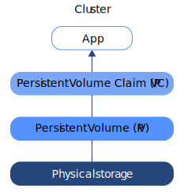
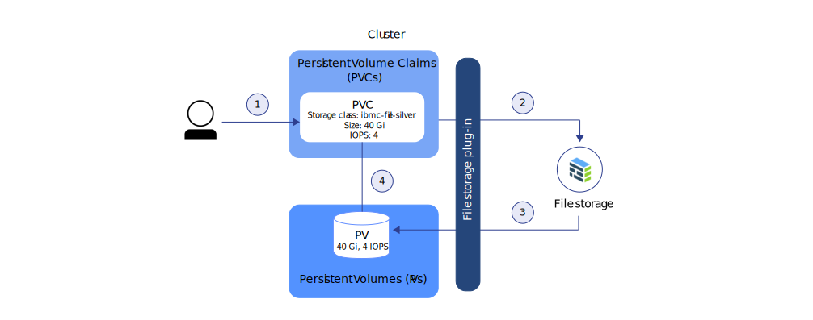
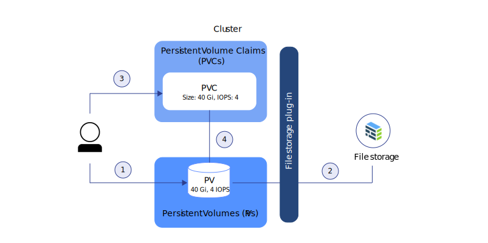

---

copyright: 
  years: 2014, 2023
lastupdated: "2023-07-13"

keywords: kubernetes

subcollection: containers

---

{{site.data.keyword.attribute-definition-list}}

# Understanding Kubernetes storage basics
{: #kube_concepts}

Before you get started with provisioning storage, it is important to understand the Kubernetes concepts for storage, dynamic provisioning, static provisioning, as well as the storage classes that are available to you.
{: shortdesc}

## Persistent volumes and persistent volume claims
{: #pvc_pv}

Before you get started with provisioning storage, it is important to understand the Kubernetes concepts of a persistent volume and a persistent volume claim and how they work together in a cluster.
{: shortdesc}

The following image shows the storage components in a cluster.

{: caption="Figure 1. Storage components in a cluster" caption-side="bottom"}

Cluster
:    By default, every cluster is set up with a plug-in to [provision file storage](/docs/containers?topic=containers-file_storage#add_file). You can choose to install other add-ons, such as the one for [block storage](/docs/containers?topic=containers-block_storage). To use storage in a cluster, you must create a persistent volume claim, a persistent volume and a physical storage instance. When you delete the cluster, you have the option to delete related storage instances.

App
:    To read from and write to your storage instance, you must mount the persistent volume claim (PVC) to your app. Different storage types have different read-write rules. For example, you can mount multiple pods to the same PVC for file storage. Block storage comes with a RWO (ReadWriteOnce) access mode so that you can mount the storage to one pod only.

Persistent volume claim (PVC)
:    A PVC is the request to provision persistent storage with a specific type and configuration. To specify the persistent storage flavor that you want, you use [Kubernetes storage classes](#storageclasses). The cluster admin can define storage classes, or you can choose from one of the predefined storage classes in {{site.data.keyword.containerlong_notm}}. When you create a PVC, the request is sent to the {{site.data.keyword.Bluemix}} storage provider. Depending on the configuration that is defined in the storage class, the physical storage device is ordered and provisioned into your IBM Cloud infrastructure account. If the requested configuration does not exist, the storage is not created.

Persistent volume (PV)
:    A PV is a virtual storage instance that is added as a volume to the cluster. The PV points to a physical storage device in your IBM Cloud infrastructure account and abstracts the API that is used to communicate with the storage device. To mount a PV to an app, you must have a matching PVC. Mounted PVs appear as a folder inside the container's file system.

Physical storage
:    A physical storage instance that you can use to persist your data. Examples of physical storage in {{site.data.keyword.cloud_notm}} include [{{site.data.keyword.filestorage_short}}](/docs/containers?topic=containers-file_storage#file_storage), [Block Storage](/docs/containers?topic=containers-block_storage#block_storage), [Object Storage](/docs/containers?topic=containers-storage-cos-understand), and local worker node storage that you can use as SDS storage with [Portworx](/docs/containers?topic=containers-storage_portworx_about). {{site.data.keyword.cloud_notm}} provides high availability for physical storage instances. However, data that is stored on a physical storage instance is not backed up automatically. Depending on the type of storage that you use, different methods exist to set up backup and restore solutions.

For more information about how to create and use PVCs, PVs, and the physical storage device, see the following topics.
- [Dynamic provisioning](#dynamic_provisioning)
- [Static provisioning](#static_provisioning)

## Dynamic provisioning
{: #dynamic_provisioning}

Use dynamic provisioning if you want to give developers the freedom to provision storage when they need it.
{: shortdesc}

Dynamic provisioning is a feature that is native to Kubernetes and that allows a cluster developer to order storage with a pre-defined type and configuration without knowing all the details about how to provision the physical storage device. To abstract the details for the specific storage type, the cluster admin must create [storage classes](#storageclasses) that the developer can use, or use the storage classes that are provided with the {{site.data.keyword.Bluemix}} storage plug-ins.

To order the storage, you must create a PVC. The PVC determines the specification for the storage that you want to provision. After the PVC is created, the storage device and the PV are automatically created for you.  

The following image shows how file storage is dynamically provisioned in a cluster. This sample flow works similarly with other storage types, such as block storage.

{: caption="Figure 1. Sample flow to dynamically provision file storage in a cluster" caption-side="bottom"}

1. The user creates a persistent volume claim (PVC) that specifies the storage type, storage class, size in gigabytes, number of IOPS, and billing type. The storage class determines the type of storage that is provisioned and the allowed ranges for size and IOPS. Creating a PVC in a cluster automatically triggers the storage plug-in for the requested type of storage to provision storage with the given specification.
2. The storage device is automatically ordered and provisioned into your IBM Cloud infrastructure account. The billing cycle for your storage device starts.
3. The storage plug-in automatically creates a persistent volume (PV) in the cluster, a virtual storage device that points to the actual storage device in your IBM Cloud infrastructure account.
4. The PVC and PV are automatically connected to each other. The status of the PVC and the PV changes to `Bound`. You can now use the PVC to mount persistent storage to your app. If you delete the PVC, the PV and related storage instance are also deleted. 

Review the following common use cases for dynamic provisioning:
1. **Provision storage when needed:** Instead of pre-providing persistent storage for developers and paying for storage that is not used, you can give developers the freedom to provision storage when they need it. To determine the type of storage that the developer can provision, you can define storage classes.
2. **Automate the creation of PVC, PV, and storage device:** You want to automatically provision and deprovision storage without manual intervention from a cluster admin.
3. **Create and delete storage often:** You have an app or set up a continuous delivery pipeline that creates and removes persistent storage regularly. Persistent storage that is dynamically provisioned with a non-retaining storage class can be removed by deleting the PVC.

## Static provisioning
{: #static_provisioning}

If you have an existing persistent storage device in your IBM Cloud infrastructure account, you can use static provisioning to make the storage instance available to your cluster.
{: shortdesc}

Static provisioning is a feature that is native to Kubernetes and that allows cluster administrators to make existing storage devices available to a cluster. As a cluster administrator, you must know the details of the storage device, its supported configurations, and mount options.  

To make existing storage available to a cluster user, you must manually create the storage device, a PV, and a PVC.  

The following image shows how to statically provision file storage in a cluster. This sample flow works similar with other storage types, such as block storage.

{: caption="Figure 1. Sample flow to statically provision file storage in a cluster" caption-side="bottom"}

1. The cluster admin gathers all the details about the existing storage device and creates a persistent volume (PV) in the cluster.
2. Based on the storage details in the PV, the storage plug-in connects the PV with the storage device in your IBM Cloud infrastructure account.
3. The cluster admin or a developer creates a PVC. Because the PV and the storage device already exist, no storage class is specified in the PVC.
4. After the PVC is created, the storage plug-in tries to match the PVC to an existing PV. The PVC and the PV match when the same values for the size, IOPS, and access mode are used in the PVC and the PV. When PVC and PV match, the status of the PVC and the PV changes to `Bound`. You can now use the PVC to mount persistent storage to your app. When you delete the PVC, the PV and the physical storage instance are not removed. You must remove the PVC, PV, and the physical storage instance separately.  

Review the following common use cases for static provisioning of persistent storage.
1. **Make retained data available to the cluster:** You provisioned persistent storage with a retain storage class by using dynamic provisioning. You removed the PVC, but the PV, the physical storage in IBM Cloud infrastructure, and the data still exist. You want to access the retained data from an app in your cluster.
2. **Use an existing storage device:** You provisioned persistent storage directly in your IBM Cloud infrastructure account and want to use this storage device in your cluster.
3. **Share persistent storage across clusters in the same zone:** You provisioned persistent storage for your cluster. To share the same persistent storage instance with other clusters in the same zone, you must manually create the PV and matching PVC in the other cluster. **Note:** Sharing persistent storage across clusters is available only if the cluster and the storage instance are located in the same zone.
4. **Share persistent storage across namespaces in the same cluster:** You provisioned persistent storage in a namespace of your cluster. You want to use the same storage instance for an app pod that is deployed to a different namespace in your cluster.

## Storage classes
{: #storageclasses}

To dynamically provision persistent storage, you must define the type and configuration of the storage that you want.
{: shortdesc}

A [Kubernetes storage class](https://kubernetes.io/docs/concepts/storage/storage-classes/){: external} is used to abstract the underlying storage platform that is supported in {{site.data.keyword.cloud_notm}} so that you don't have to know all the details about supported sizes, IOPS, or retention policies to successfully provision persistent storage in a cluster. {{site.data.keyword.containerlong_notm}} provides pre-defined storage classes for every type of storage that is supported. Each storage class is designed to abstract the supported storage tier while giving you the choice to decide on the size, IOPS, and retention policy that you want.

Not finding what you are looking for? You can also create your own customized storage class to provision the type of storage that you want.
{: tip}

## Next steps
{: #next-steps-storage}

Get started using storage in your cluster by reviewing the following docs.

- [{{site.data.keyword.blockstorageshort}}](/docs/containers?topic=containers-block_storage)
- [{{site.data.keyword.block_storage_is_short}}](/docs/containers?topic=containers-vpc-block)
- [{{site.data.keyword.filestorage_short}} for Classic clusters](/docs/containers?topic=containers-file_storage)
- [{{site.data.keyword.filestorage_vpc_short}}](/docs/containers?topic=containers-storage-file-vpc-install)
- [{{site.data.keyword.cos_full_notm}}](/docs/containers?topic=containers-storage-cos-understand)
- [Portworx](/docs/containers?topic=containers-storage_portworx_about)

