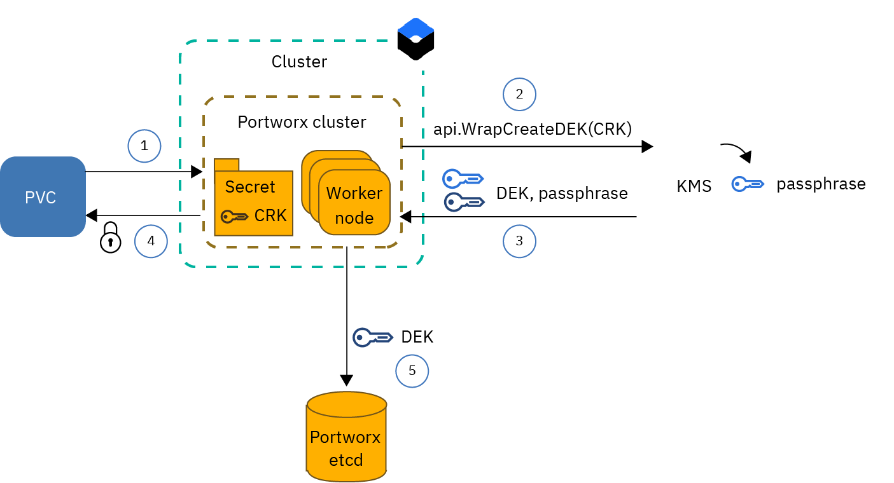
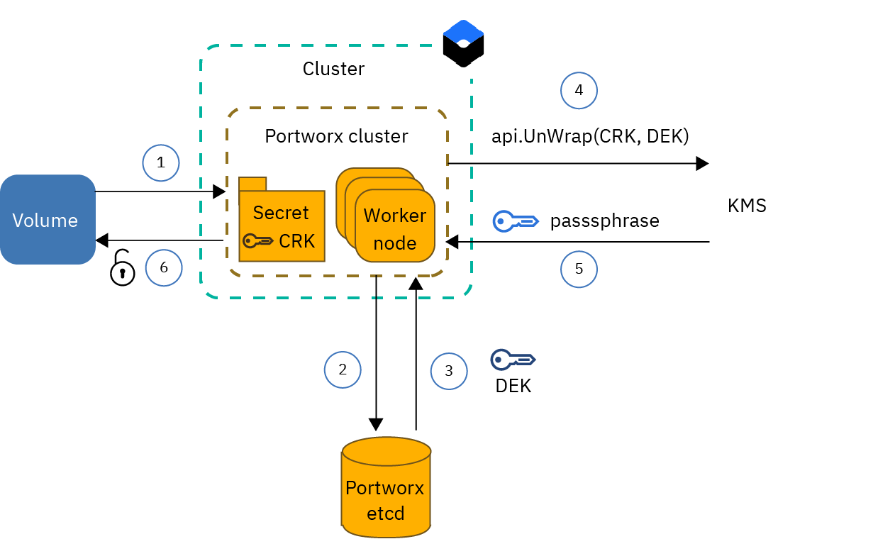

---

copyright: 
  years: 2014, 2024
lastupdated: "2024-01-03"


keywords: portworx, kubernetes

subcollection: containers


---

{{site.data.keyword.attribute-definition-list}}

# Understanding encryption for Portworx
{: #storage_portworx_encryption}

## Encryption overview
{: #px_encryption}

The following image illustrates the encryption workflow in Portworx when you set up per-volume encryption.
{: shortdesc}


{: caption="Figure 1. Encrypting Portworx volumes" caption-side="bottom"}


1. The user creates a PVC with a Portworx storage class and requests the storage to be encrypted.
2. Portworx invokes the {{site.data.keyword.keymanagementservicelong_notm}} or {{site.data.keyword.hscrypto}} API `WrapCreateDEK` to create a passphrase by using the customer root key (CRK) that is stored in the Portworx secret.
3. The {{site.data.keyword.keymanagementservicelong_notm}} or {{site.data.keyword.hscrypto}} service instance generates a 256-bit passphrase and wraps the passphrase in the DEK. The DEK is returned to the Portworx cluster.
4. The Portworx cluster uses the passphrase to encrypt the volume.
5. The Portworx cluster stores the DEK in plain text in the Portworx etcd database, associates the volume ID with the DEK, and removes the passphrase from its memory.

## Decryption overview
{: #decryption-ov}

The following image illustrates the decryption workflow in Portworx when you set up per-volume encryption.

{: caption="Figure 2. Decrypting Portworx volumes" caption-side="bottom"}

1. Kubernetes sends a request to decrypt an encrypted volume.
2. Portworx requests the DEK for the volume from the Portworx etcd database.
3. The Portworx etcd looks up the DEK and returns the DEK to the Portworx cluster.
4. The Portworx cluster calls the {{site.data.keyword.keymanagementservicelong_notm}} or {{site.data.keyword.hscrypto}} API `UnWrapDEK` by providing the DEK and the root key (CRK) that is stored in the Portworx secret.
5. {{site.data.keyword.keymanagementservicelong_notm}} or {{site.data.keyword.hscrypto}} unwraps the DEK to extract the passphrase and returns the passphrase to the Portworx cluster.
6. The Portworx cluster uses the passphrase to decrypt the volume. After the volume is decrypted, the passphrase is removed from the Portworx cluster.  


## Setting up volume encryption 
{: #storage-portworx-volume-encryption}

To protect your data in a Portworx volume, you can create an instance of a KMS provider such as {{site.data.keyword.keymanagementservicelong_notm}} or {{site.data.keyword.hscrypto}}. 
{: shortdesc}

If you don't want to use {{site.data.keyword.keymanagementservicelong_notm}} or {{site.data.keyword.hscrypto}} root keys to encrypt your volumes, you can select **Kubernetes Secret** as your Portworx secret store type during the Portworx installation. This setting gives you the option to store your own custom encryption key in a Kubernetes secret after you install Portworx. For more information, see the [Portworx documentation](https://docs.portworx.com/portworx-enterprise/operations/key-management/kubernetes-secrets){: external}.
{: tip}

### Getting your KMS instance and credentials
{: #storage-portworx-credentials}

#### Setting up volume encryption with {{site.data.keyword.hscrypto}}
{: #storage-portworx-encryption-hpcs}

1. [Create a service instance](/docs/hs-crypto?topic=hs-crypto-provision&interface=ui).

1. [Create a root key](/docs/hs-crypto?topic=hs-crypto-create-root-keys&interface=ui).

1. [Create a service ID](/docs/account?topic=account-serviceids&interface=cli#serviceids).

1. [Retrieve the Key Management public endpoint URL](/docs/hs-crypto?topic=hs-crypto-regions#service-endpoints). Make sure that you note your endpoint in the correct format; for example, `https://api.us-south.hs-crypto.cloud.ibm.com:<port>`. For more information, see the [{{site.data.keyword.hscrypto}} API documentation](https://cloud.ibm.com/apidocs/hs-crypto#getinstance){: external}.

#### Setting up volume encryption with {{site.data.keyword.keymanagementservicelong_notm}}
{: #storage-portowrx-encryption-kms}

1. [Create a service instance](/docs/key-protect?topic=key-protect-provision#provision-overview).

1. [Create a root key](/docs/key-protect?topic=key-protect-create-root-keys&interface=ui).

1. [Create a service ID](/docs/account?topic=account-serviceids&interface=cli#serviceids).

1. [Retrieve the region](/docs/key-protect?topic=key-protect-regions#regions) where you created your service instance and make a note. You need this value later when you create your secret.


#### Creating a secret in your cluster
{: #storage-portworx-encryption-secret}

1. Encode the credentials that you retrieved in the previous section to base64 and note all the base64 encoded values. Repeat this command for each parameter to retrieve the base64 encoded value.
    ```sh
    echo -n "<value>" | base64
    ```
    {: pre}

2. Create a namespace in your cluster called `portworx`.
    ```sh
    kubectl create ns portworx
    ```
    {: pre}

3. Create a Kubernetes secret named `px-ibm` in the `portworx` namespace of your cluster to store your {{site.data.keyword.keymanagementservicelong_notm}} information.
    1. Create a configuration file for your Kubernetes secret with the following content.
        ```yaml
        apiVersion: v1
        kind: Secret
        metadata:
          name: px-ibm
          namespace: portworx
        type: Opaque
        data:
          IBM_SERVICE_API_KEY: <base64_apikey>
          IBM_INSTANCE_ID: <base64_guid>
          IBM_CUSTOMER_ROOT_KEY: <base64_rootkey>
          IBM_BASE_URL: <base64_endpoint>
        ```
        {: codeblock}

        `metadata.name`
        :   Enter `px-ibm` as the name for your Kubernetes secret. If you use a different name, Portworx does not recognize the secret during installation.
        
        `data.IBM_SERVICE_API_KEY`
        :   Enter the base64 encoded {{site.data.keyword.keymanagementservicelong_notm}} or {{site.data.keyword.hscrypto}} API key that you retrieved earlier.
        
        `data.IBM_INSTANCE_ID`
        :   Enter the base64 encoded service instance GUID that you retrieved earlier.
        
        `data.IBM_CUSTOMER_ROOT_KEY`
        :   Enter the base64 encoded root key that you retrieved earlier.
        
        `data.IBM_BASE_URL`
        :   {{site.data.keyword.keymanagementservicelong_notm}}: Enter the base64 encoded API endpoint of your service instance.
        :   {{site.data.keyword.hscrypto}}: Enter the base64 encoded Key Management public endpoint.

    2. Create the secret in the `portworx` namespace of your cluster.
        ```sh
        kubectl apply -f secret.yaml
        ```
        {: pre}

    3. Verify that the secret is created successfully.
        ```sh
        kubectl get secrets -n portworx
        ```
        {: pre}


