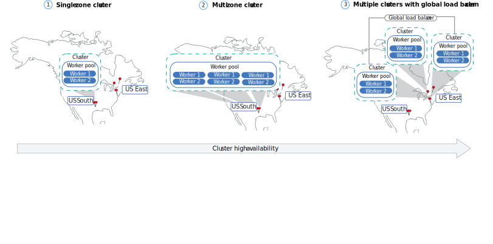
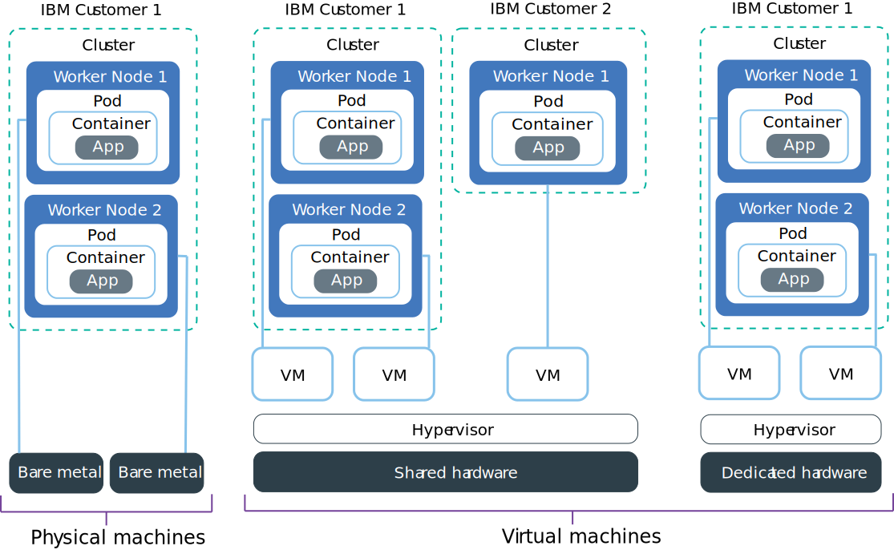

---

copyright: 
  years: 2014, 2025
lastupdated: "2025-04-15"

keywords: kubernetes, kubernetes environment, moving to kubernetes, moving to containers, clusters, cluster sizing, containers, {{site.data.keyword.containerlong_notm}}

subcollection: containers

---

{{site.data.keyword.attribute-definition-list}}

# Creating a highly available cluster strategy
{: #strategy}

Design your standard cluster for maximum availability and capacity for your app with {{site.data.keyword.containerlong}}. Use the built-in features to make your cluster more highly available and to protect your app from downtime when a component in your cluster fails. But figuring out what your cluster setup must be to support your workload is not an exact science. You might need to test different configurations and adapt.
{: shortdesc}

High availability (HA) is a core discipline in an IT infrastructure to keep your apps up and running, even after a partial or full site failure. The main purpose of high availability is to eliminate potential points of failures in an IT infrastructure. For example, you can prepare for the failure of one system by adding redundancy and setting up failover mechanisms. See [How {{site.data.keyword.cloud_notm}} ensures high availability and disaster recovery](/docs/resiliency?topic=resiliency-ha-redundancy).

To get started planning and sizing your cluster, review these decision points before creating a cluster.

When you're done, [try out the quiz](https://quizzes.12dekrh4l1b4.us-south.codeengine.appdomain.cloud/containers/strategy/quiz.php).
{: tip}

## Decide how many clusters to create
{: #env_multicluster}

Your users are less likely to experience downtime when you distribute your apps across multiple worker nodes, zones, and clusters. Built-in capabilities, like load balancing and isolation, increase resiliency against potential failures with hosts, networks, or apps. 

{: caption="High availability for clusters" caption-side="bottom"}

The number of clusters that you create depends on your workload, company policies and regulations, business requirements, the Service Level Agreements that you have with your customers, the resources that you want to expend, and what you want to do with the computing resources.

- **Multiple clusters**: Multiple clusters are generally more complex to manage, but can help you achieve important goals such as the following.
    * Comply with security policies that require you to isolate workloads.
    * Test how your app runs in a different version of Kubernetes or other cluster software such as Calico.
    * Achieve higher performance for users in different geographical areas.
    * Simplify user access to control access within a cluster by configuring access on the cluster-instance level instead of customizing and managing multiple RBAC policies at the namespace level.
    * Keep the number of worker nodes lower. Network bandwidth on scaling virtual machines is around 1000 Mbps. If you need hundreds of worker nodes in a cluster, you can split the configuration up into multiple clusters with fewer nodes, or order bare metal nodes.
    * Allow for a larger number of [services integrations](/docs/containers?topic=containers-supported_integrations#supported_integrations), such as more than 5,000 service.
    * Provide higher availability to an app. Similar to using 3 zones in multizone clusters, you can provide more availability to your app by setting up three clusters across zones.
    * Reduce costs by purchasing smaller machines to handle your workload.

- **One cluster with more worker nodes**: Fewer clusters can help you to reduce operational effort and per-cluster costs for fixed resources. Instead of making more clusters, you can add worker pools to one cluster for different flavors of computing resources available for your app and service components. When you develop the app, the resources it uses are in the same zone, or otherwise closely connected in a multizone, so that you can make assumptions about latency, bandwidth, or correlated failures. However, it becomes even more important for you to organize your cluster by using namespaces, resource quotas, and labels when you have only one cluster.

## Determine how many locations are needed
{: #plan_locations}

A cluster can either distribute replicas across worker nodes in a single location or across multiple locations. This choice can impact the cluster types that are available to you in the next section.

Distributing your workload across three zones ensures high availability for your app in case a zone becomes unavailable. You must have your worker nodes spread evenly across all three availability zones to meet the [{{site.data.keyword.cloud_notm}} service level agreement (SLA)](/docs/overview?topic=overview-slas) for HA configuration.
{: important}

A zone failure affects all physical compute hosts and NFS storage. Failures include power, cooling, networking, or storage outages, and natural disasters, like flooding, earthquakes, and hurricanes. To protect against a zone failure, you must have clusters in two different zones that are load balanced by an external load balancer, create a cluster in a multizone location, which spreads the master across zones, or consider setting up a second cluster in another zone.

### Multizone clusters
{: #mz-strategy}

[Classic]{: tag-classic-inf} [VPC]{: tag-vpc}

Multizone clusters distribute workloads across multiple worker nodes and zones, creating additional protection against zone failures. Worker nodes are automatically deployed with three replicas spread across multiple zones. If an entire zone experiences an outage, your workload is scheduled onto worker nodes in the other zones, protecting your app from the outage.

Every region is set up with a highly available load balancer that is accessible from the region-specific API endpoint. The load balancer routes incoming and outgoing requests to clusters in the regional zones. The likelihood of a full regional failure is low. However, to account for this failure, you can set up multiple clusters in different regions and connect them by using an external load balancer. If an entire region fails, the cluster in the other region can take over the workload.

For example, you deploy your multizone cluster [in a metro region](https://cloud.ibm.com/docs/containers?topic=containers-regions-and-zones#zones-vpc), such as `sydney`, and three replicas are automatically spread across the three zones of the metro, such as `au-syd-1`, `au-syd-2`, and  `au-syd-3`. If resources in one zone go down, your cluster workloads continue to run in the other zones. 

A multi-region cluster requires several cloud resources, and depending on your app, can be complex and expensive. Check whether you need a multi-region setup or if you can accommodate a potential service disruption. If you want to set up a multi-region cluster, ensure that your app and the data can be hosted in another region, and that your app can handle global data replication.

### Multiple clusters linked with load balancers
{: #mz-cluster-strategy}

[Classic]{: tag-classic-inf} [VPC]{: tag-vpc}

To protect your app from a master failure, you can create multiple clusters in different zones within a region, and connect them with a global load balancer. This option is useful if you must provision a cluster in Classic data center with only one zone, but you still want the benefits of multizone availability. 

To connect multiple clusters with a global load balancer, the clusters must be set up with public network connectivity and your apps must be exposed through [Ingress](/docs/containers?topic=containers-managed-ingress-about), [routes](/docs/openshift?topic=openshift-openshift_routes), or with a [Kubernetes load balancer service](/docs/containers?topic=containers-cs_network_planning).

To balance your workload across multiple clusters, you must [set up a global load balancer](/docs/cis?topic=cis-configure-glb) through [{{site.data.keyword.cis_short}}](/docs/cis?topic=cis-getting-started) and add the public IP addresses of your ALBs or load balancer services to your domain. By adding these IP addresses, you can route incoming traffic between your clusters. 

For the global load balancer to detect if one of your clusters is unavailable, consider adding a ping-based health check to every IP address. When you set up this check, your DNS provider regularly pings the IP addresses that you added to your domain. If one IP address becomes unavailable, then traffic is not sent to this IP address anymore. However, Kubernetes does not automatically restart pods from the unavailable cluster on worker nodes in available clusters. If you want Kubernetes to automatically restart pods in available clusters, consider setting up a multizone cluster.

### Single zone clusters
{: #sz-single-zone-strategy}

[Classic]{: tag-classic-inf}

Worker nodes are distributed across separate physical hosts within a single zone. This option protects against certain outages, such as during a master update, and is simpler to manage. However, it does not protect your apps if an entire zone experiences an outage. If you later find availability to be a problem, single zone clusters deployed in certain locations can later be converted to multizone clusters.

If your cluster is created with all worker nodes in a single zone, the Kubernetes master of your classic cluster is highly available and includes separate physical hosts for your master API server, etcd, scheduler, and controller manager to protect against an outage, such as during a master update. You can add additional worker nodes to your single zone cluster to improve availability and add protection in the case that one worker node fails. 

If one worker node goes down, app instances on available worker nodes continue to run. Kubernetes automatically reschedules pods from unavailable worker nodes to ensure performance and capacity for your app. To ensure that your pods are evenly distributed across worker nodes, implement [pod affinity](https://kubernetes.io/docs/concepts/scheduling-eviction/assign-pod-node/){: external}.

## Select a cluster type
{: #env_flavors}

The worker node flavors and isolation levels that are available to you depend on your container platform, cluster type, the infrastructure provider that you want to use, and the {{site.data.keyword.containerlong_notm}} location where you want to create your cluster. You can choose between Classic, VPC, or {{site.data.keyword.satelliteshort}} clusters. The type of cluster you need is determined by the decisions you made for the number of clusters, locations.

{: caption="Hardware options for worker nodes in a standard cluster" caption-side="bottom"}

VPC clusters
:   Worker nodes can be provisioned using virtual worker nodes on standard infrastructure or dedicated hosts. If speed is a big consideration for you, VPC clusters might be the best choice.

{{site.data.keyword.satelliteshort}} clusters
:   Worker nodes can be provisioned on virtual machines in cloud providers such as AWS, Azure, GCP and more. Worker nodes can also be provisioned using your own, on-premises, infrastructure.

Classic clusters
:   Worker nodes can be created on virtual and bare metal worker nodes. If you require additional local disks, you can also choose one of the bare metal flavors that are designed for software-defined storage solutions, such as Portworx. 

## Select an operating system for the cluster
{: #os}

The operating systems available to you depend on the cluster type you chose.

Ubuntu 20.04 [Deprecated]{: tag-deprecated}
:   Ubuntu 20 is deprecated and support ends on 31 May 2025. Migrate your worker nodes to Ubuntu 24 before support for Ubuntu 20 ends. Migrate your worker nodes to Ubuntu 24 before support ends. Make sure you understand the [limitations for Ubuntu 24](/docs/containers?topic=containers-ubuntu-migrate#ubuntu-24-lim) before you begin migration. For more information, see [Migrating to a new Ubuntu version](/docs/containers?topic=containers-ubuntu-migrate).

Ubuntu 24
:   For more information, see the [Ubuntu 24.04 release notes](https://discourse.ubuntu.com/t/ubuntu-24-04-lts-noble-numbat-release-notes/39890){: external}. Note that with Ubuntu 24, NTP uses `timesyncd` and related commands might be updated.

Migrating to a new OS? See [Migrating to a new Ubuntu version](/docs/containers?topic=containers-ubuntu-migrate).
{: tip}

## Define a cluster naming strategy
{: #naming}

Consider giving clusters unique names across resource groups and regions in your account to avoid naming conflicts. You can't rename a cluster after it is created.

## Decide how many worker nodes for each cluster
{: #sizing_workers}

The level of availability that you set up for your cluster impacts your coverage under the [{{site.data.keyword.cloud_notm}} HA service level agreement terms](/docs/overview?topic=overview-slas). For example, to receive full HA coverage under the SLA terms, you must set up a multizone cluster with a total of at least 6 worker nodes, two worker nodes per zone that are evenly spread across three zones.
{: important}

The total number of worker nodes in a cluster determine the compute capacity that is available to your apps in the cluster. You can protect your setup during a worker node failure by setting up multiple worker nodes in your cluster. Worker node failures can include hardware outages, such as power, cooling, or networking, and issues on the VM itself. 

* **Multizone clusters** [Classic]{: tag-classic-inf} [VPC]{: tag-vpc}: Plan to have at least two worker nodes per zone, so six nodes across three zones in total. Additionally, plan for the total capacity of your cluster to be at least 150% of your total workload's required capacity, so that if one zone goes down, you have resources available to maintain the workload.

* **Single zone clusters** Plan to have at least three worker nodes in your cluster. Further, you want one extra node's worth of CPU and memory capacity available within the cluster. If your apps require less resources than the resources that are available on the worker node, you might be able to limit the number of pods that you deploy to one worker node. 

Keep in mind:
- You can try out [the cluster autoscaler](/docs/containers?topic=containers-cluster-scaling-install-addon) to be sure that you always have enough worker nodes to cover your workload.
- Kubernetes limits the maximum number of worker nodes that you can have in a cluster. Review [worker node and pod quotas](https://kubernetes.io/docs/setup/best-practices/cluster-large/){: external} for more information.

## Select worker node flavors
{: #env_flavors_node}

A worker node is a VM that runs on physical hardware. A worker node flavor describes the compute resources, such as CPU, memory, and disk capacity that you get when you provision your worker node. Worker nodes of the same flavor are grouped in worker node pools. 

As you were choosing a cluster type, you already thought about how worker node flavor location and machine type impact your decision. As you choose between worker node flavors, consider the following.

- **Tenancy**: Depending on the level of hardware isolation that you need, virtual worker nodes can be set up as shared by multiple {{site.data.keyword.IBM_notm}} customers (multi tenancy) or dedicated to you only (single tenancy) nodes. Bare metal machines are always set up as dedicated. When you decide between shared and dedicated nodes, you might want to check with your legal department to discuss the level of infrastructure isolation and compliance that your app environment requires.
    - **Shared**: Physical resources, such as CPU and memory, are shared across all virtual machines that are deployed to the same physical hardware. To ensure that every virtual machine can run independently, a virtual machine monitor, also referred to as the hypervisor, segments the physical resources into isolated entities and allocates them as dedicated resources to a virtual machine (hypervisor isolation). Shared nodes are usually less costly than dedicated nodes because the costs for the underlying hardware are shared among multiple customers.
    - **Dedicated**: All physical resources are dedicated to you only. You can deploy multiple worker nodes as virtual machines on the same physical host. Similar to the multi-tenant setup, the hypervisor assures that every worker node gets its share of the available physical resources.

- **Machine type**: You have a mix of machine types that you can choose from.
    - **Virtual machines**: For greater flexibility, quicker provisioning times, more automatic scalability features, and a more cost-effective price, use VMs. You can use VMs for most general-purpose use cases such as testing and development environments, staging, and prod environments, microservices, and business apps. However, there is a tradeoff in performance.   

    - **Bare metal (physical) machines**: If you need high-performance computing for data- or RAM-intensive workloads, consider creating classic clusters with bare metal worker nodes. Because you have full control over the isolation and resource consumption for your workloads, you can use bare metal machines to achieve HIPAA and PCI compliance for your environment. Bare metal gives you direct access to the physical resources on the machine, such as the memory or CPU. This setup eliminates the virtual machine hypervisor that allocates physical resources to virtual machines that run on the host. Instead, all a bare metal machine's resources are dedicated exclusively to the worker, so you don't need to worry about "noisy neighbors" sharing resources or slowing down performance. Physical flavors have more local storage than virtual, and some have RAID to increase data availability. Local storage on the worker node is for short-term processing only, and the primary and auxiliary disks are wiped when you update or reload the worker node. Physical machines are available for classic clusters only and are not supported in VPC clusters.

      Bare metal servers are billed monthly. If you cancel a bare metal server before the end of the month, you are charged through the end of that month. After you order or cancel a bare metal server, the process is completed manually in your IBM Cloud infrastructure account. Therefore, it can take more than one business day to complete.
      {: important}

    - **SDS machines**: Software-defined storage (SDS) flavors have additional raw disks for physical local storage. Unlike the primary and auxiliary local disk, these raw disks are not wiped during a worker node update or reload. Because data is co-located with the compute node, SDS machines are suited for high-performance workloads. Software-defined storage flavor are available for classic clusters only and are not supported in VPC clusters. 

      Because you have full control over the isolation and resource consumption for your workloads, you can use SDS machines to achieve HIPAA and PCI compliance for your environment.

      You typically use SDS machines in the following cases:
          *  If you use an SDS add-on such as [Portworx](/docs/containers?topic=containers-storage_portworx_about), use an SDS machine.
          *  If your app is a [StatefulSet](https://kubernetes.io/docs/concepts/workloads/controllers/statefulset/){: external} that requires local storage, you can use SDS machines and provision [Kubernetes local persistent volumes](https://kubernetes.io/docs/concepts/storage/volumes/#local){: external}.
          *  If you have custom apps that require additional raw local storage.

- **Cost**: In general, your intensive workloads are more suited to run on bare metal physical machines, whereas for cost-effective testing and development work, you might choose virtual machines on shared or dedicated hardware.

- **Location**: Decide which locations you want to have a cluster in. Where you want it might also inform how many clusters or the type of clusters you need. For example, if you know you need the location to be in Montreal, then that helps narrow down your choices. Check out the available [locations](/docs/containers?topic=containers-regions-and-zones).

- **Size**: Larger nodes can be more cost efficient than smaller nodes, particularly for workloads that are designed to gain efficiency when they process on a high-performance machine. However, if a large worker node goes down, you need to be sure that your cluster has enough capacity to safely reschedule all the workload pods onto other worker nodes in the cluster. Smaller worker nodes can help you scale safely. [Learn more about capacity](#env_resources_worker_capacity).

- **GPUs**: You can use a GPU machine to speed up the processing time required for compute intensive workloads such as AI, machine learning, inferencing, and more.

- **Storage**: Every VM comes with an attached disk for storage of information that the VM needs to run, such as OS file system, container runtime, and the `kubelet`.  Local storage on the worker node is for short-term processing only, and the storage disks are wiped when you delete, reload, replace, or update the worker node. Additionally, classic and VPC infrastructure differ in the disk setup.

    * **Classic VMs**: Classic VMs have two attached disks. The primary storage disk has 25 GB for the OS file system, and the auxiliary storage disk has 100 GB for data such as the container runtime and the `kubelet`. For reliability, the primary and auxiliary storage volumes are local disks instead of storage area networking (SAN). Reliability benefits include higher throughput when serializing bytes to the local disk and reduced file system degradation due to network failures. The auxiliary disk is encrypted by default.
    * **VPC compute VMs**: VPC VMs have one primary disk that is a block storage volume that is attached via the network. The storage layer is not separated from the other networking layers, and both network and storage traffic are routed on the same network. The primary storage disk is used for storing data such as the OS file system, container runtime, and `kubelet`, and is [encrypted by default](/docs/vpc?topic=vpc-block-storage-about#vpc-storage-encryption). For VPC clusters, you can also provision a secondary disk on your worker nodes. This optional disk is provisioned in your account and you can can see them in VPC console. The charges for these disks are separate to the cost of each worker and show as a different line item on your bill. These secondary volumes also count toward the quota usage for the your account. To prevent default pod evictions, 10% of the Kubernetes data disk (auxiliary disk in classic, primary boot disk in VPC) is reserved for system components.

    In a stateful app, data plays an important role to keep your app up and running. Make sure that your data is highly available so that you can recover from a potential failure. In {{site.data.keyword.containerlong_notm}}, you can choose from several options to persist your data. For example, you can provision NFS storage by using Kubernetes native persistent volumes, or store your data by using an {{site.data.keyword.cloud_notm}} database service. For more information, see [Planning highly available data](/docs/containers?topic=containers-storage-plan).

    Choose a flavor, or machine type, with the correct storage configuration to support your workload. Some flavors have a mix of the following disks and storage configurations. For example, some flavors might have a SATA primary disk with a raw SSD secondary disk.

For a list of available flavors, see [VPC Gen 2 flavors](/docs/containers?topic=containers-vpc-flavors) or [Classic flavors](/docs/containers?topic=containers-classic-flavors).

## Determine worker node capacity for the resources
{: #env_resources_worker_capacity}

To get the most out of your worker node's performance, consider the following as you set up your resources:

- **Consider what your app is doing**: Start by aligning the app size with the capacity of one of the available worker node flavors. Also consider thing like whether your app pulls large or many images, since they can take up local storage on the worker node.

- **Keep up your core strength**: Each machine has a certain number of cores. Depending on your app's workload, set a limit for the number of pods per core, such as 10. 

- **Avoid node overload**: Keep your worker node at around 75% capacity to leave space for other pods that might need to be scheduled. If your apps require more resources than you have available on your worker node, use a different worker node flavor that can fulfill these requirements. Depending on your app's workload, set a limit for the number of pods per node, such as 40. 

- **Choose services**: How many service integrations did you decide to include when you were thinking about how many clusters to create? These integrated services and add-ons can spin up pods that consume and impact cluster resources.

- **Replicas of your app**: To determine the number of worker nodes that you want, you can also consider how many replicas of your app that you want to run. For example, if you know that your workload requires 32 CPU cores, and you plan to run 16 replicas of your app, each replica pod needs 2 CPU cores. If you want to run only one app pod per worker node, you can order an appropriate number of worker nodes for your cluster type to support this configuration.

- **Leave room for runtime requirements**: [Worker nodes must reserve certain amounts of CPU and memory resources](/docs/containers?topic=containers-resource-limit-node) to run required components, such as the operating system or container runtime. 

    [Reserved capacity and reserved instances](/docs/virtual-servers?topic=virtual-servers-provisioning-reserved-capacity-and-instances) are not supported.
    {: tip}

## Choose how many namespaces to create within the cluster
{: #env_resources_multiple_namespaces}

Set up multiple namespaces when you have multiple teams and projects that share the cluster. Namespaces are a way to divide up cluster resources by using [resource quotas](https://kubernetes.io/docs/concepts/policy/resource-quotas/){: external} and [default limits](https://kubernetes.io/docs/tasks/administer-cluster/manage-resources/memory-default-namespace/){: external}. When you make new namespaces, be sure to set up proper [RBAC policies](/docs/containers?topic=containers-understand-rbac) to control access. For more information, see [Share a cluster with namespaces](https://kubernetes.io/docs/tasks/administer-cluster/namespaces){: external} in the Kubernetes documentation.

If you have a small cluster, a couple dozen users, and resources that are similar (such as different versions of the same software), you probably don't need multiple namespaces. You can use labels instead.

Review security information about this decision in [Container isolation and security](/docs/containers?topic=containers-security#container).

## Establish resource requests and limits for the namespaces
{: #env_resources_resource_quotas}

To ensure that every team has the necessary resources to deploy services and run apps in the cluster, you must set up [resource quotas](https://kubernetes.io/docs/concepts/policy/resource-quotas/){: external} for every namespace. Resource quotas determine the deployment constraints, such as the number of Kubernetes resources that you can deploy, and the amount of CPU and memory that can be consumed by those resources. After you set a quota, users must include resource requests and limits in their deployments.

When you create a deployment, also limit it so that your app's pod deploys only on machines with the best mix of resources. For example, you might want to limit a database application to a bare metal machine with a significant amount of local disk storage like the `md1c.28x512.4x4tb`.

## Make your apps highly available too
{: #apps-ha}

Containers and pods are, by design, short-lived and can fail unexpectedly. For example, a container or pod might crash if an error occurs in your app. To make your app highly available, you must ensure that you have enough instances to handle the workload plus additional instances in the case of a failure. You can ensure that there are enough instances by setting up [automatic scaling](/docs/containers?topic=containers-update_app#app_scaling). 

## Next steps
{: #plan-network-next}

[Test your knowledge with a quiz](https://quizzes.12dekrh4l1b4.us-south.codeengine.appdomain.cloud/containers/strategy/quiz.php).
{: tip}

To continue the planning process, choose between [VPC cluster networking](/docs/containers?topic=containers-plan_vpc_basics) and [Classic cluster networking](/docs/containers?topic=containers-plan_basics). If you're ready to get started creating a cluster, first start by [Preparing your account to create clusters](/docs/containers?topic=containers-clusters).
