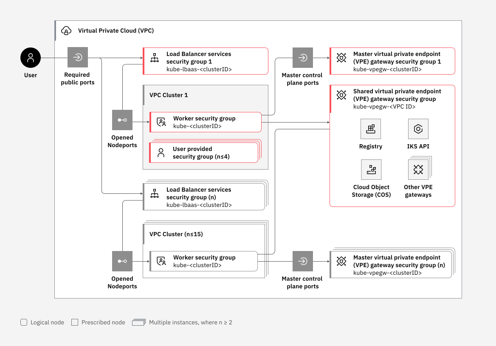

---

copyright: 
  years: 2023, 2024
lastupdated: "2024-09-19"

keywords: containers, {{site.data.keyword.containerlong_notm}}, firewall, rules, security group, 1.30, networking, secure by default, outbound traffic protection

subcollection: containers

---

{{site.data.keyword.attribute-definition-list}}

# Understanding Secure by Default Cluster VPC Networking
{: #vpc-security-group-reference}
{: help}
{: support}

[Virtual Private Cloud]{: tag-vpc}
[1.30 and later]{: tag-blue}

Beginning with new VPC clusters that are created at version 1.30, {{site.data.keyword.containerlong_notm}} introduced a new security feature called Secure by Default Cluster VPC Networking. With Secure by Default, there are new VPC settings, such as managed security groups, security group rules, and virtual private endpoint gateways (VPEs) that are created automatically when you create a VPC cluster. Review the following details about the VPC components that are created and managed for you when you create a version 1.30 and later cluster.
{: shortdesc}

## Overview
{: #sbd-overview}

With Secure by Default Networking, when you provision a new {{site.data.keyword.containerlong_notm}} VPC cluster at version 1.30 or later, only the traffic that is necessary for the cluster to function is allowed and all other access is blocked. To implement Secure by Default Networking, {{site.data.keyword.containerlong_notm}} uses various security groups and security group rules to protect cluster components. These security groups and rules are automatically created and attached to your worker nodes, load balancers, and cluster-related VPE gateways.

{: caption="Figure 1. This image shows the VPC security groups applied to your VPC and clusters." caption-side="bottom"}

Virtual Private Cloud security groups filter traffic at the hypervisor level. Security group rules are not applied in a particular order. However, requests to your worker nodes are only permitted if the request matches one of the rules that you specify. When you allow traffic in one direction by creating an inbound or outbound rule, responses are also permitted in the opposite direction. Security groups are additive, meaning that if your worker nodes are attached to more than one security group, all rules included in the security groups are applied to the worker nodes. Newer cluster versions might have more rules in the `kube-<clusterID>` security group than older cluster versions. Security group rules are added to improve the security of the service and do not break functionality.

## Virtual private endpoint (VPE) gateways
{: #sbd-managed-vpe-gateways}

When the first VPC cluster at {{site.data.keyword.containerlong_notm}} 1.28+ is created in a given VPC, or a cluster in that VPC has its master updated to 1.28+, then several shared VPE Gateways are created for various IBM Cloud services. Only one of each of these types of shared VPE Gateways is created per VPC. All the clusters in the VPC share the same VPE Gateway for these services. These shared VPE Gateways are assigned a single Reserved IP from each zone that the cluster workers are in.

The following VPE gateways are created automatically when you create a VPC cluster. 

| VPE Gateway | Description |
| --- | --- |
| {{site.data.keyword.registrylong_notm}} | [Shared]{: tag-cool-gray} Pull container images from {{site.data.keyword.registrylong_notm}} to apps running in your cluster. 
| {{site.data.keyword.cos_full_notm}} s3 gateway | [Shared]{: tag-cool-gray} Access the COS APIs. |
| {{site.data.keyword.cos_full_notm}} config gateway | [Shared]{: tag-cool-gray} Backup container images to {{site.data.keyword.cos_full_notm}} |
| {{site.data.keyword.containerlong_notm}} | Access the {{site.data.keyword.containerlong_notm}} APIs to interact with and manage your cluster. † |
{: caption="Table 1. VPE gateways" caption-side="bottom"}
{: summary="The table shows the VPE gateways created for VPC clusters. The first column includes name of the gateway. The second column includes a brief description."}

† All supported VPC clusters have a VPE Gateway for the cluster master that gets created at in the your account when the cluster gets created. This VPE Gateway is used by the cluster workers, and can be used by other things in the VPC, to connect to the cluster's master API server. This VPE Gateway is assigned a single Reserved IP from each zone that the cluster workers are in, and this IP is created in one of the VPC subnets in that zone that has cluster workers. For example, if the cluster has workers in only a single zone region (`us-east-1`) and single VPC subnet, then a single IP is created in that subnet and assigned to the VPE Gateway. If a cluster has workers in all three zones like `us-east-1`, `us-east-2`, and `us-east-3` and these workers are spread out among 4 VPC subnets in each zone, then 12 VPC subnets altogether, three IPs are created, one in each zone, in one of the four VPC subnets in that zone. Note that the subnet is chosen at random.

## Managed security groups
{: #sbd-managed-groups}

{{site.data.keyword.containerlong_notm}} automatically creates and updates the following security groups and rules for VPC clusters.

- [Worker security group](#vpc-sg-kube-clusterid) (`kube-<clusterID>`).
- [Master VPE gateway security group](#vpc-sg-kube-vpegw-cluster-id) (`kube-vpegw-<clusterID>`).
- [Shared VPE gateway security group](#vpc-sg-kube-vpegw-vpc-id) (`kube-vpegw-<vpcID>`).
- [Load balancer services security group](#vpc-sg-kube-vpegw-vpc-id) (`kube-lbaas-<clusterID>`).

### Worker security group
{: #vpc-sg-kube-clusterid}

When you create an {{site.data.keyword.containerlong_notm}} VPC cluster, a security group is created for all the workers, or nodes, for the given cluster. The name of the security group is `kube-<clusterID>` where `<clusterID>` is the ID of the cluster. If new nodes are added to the cluster later, those nodes are added to the cluster security group automatically.

Do not modify the rules in the `kube-<clusterID>` security group as doing so might cause disruptions in network connectivity between the workers of the cluster and the control cluster.

| Description | Direction | Protocol | Ports or values | Source or destination |
| --- | --- | --- | --- | --- |
| Allows inbound traffic to the pod subnet. | Inbound | All | All | Either 172.17.0.0/18 (the default subnet range) or a custom subnet range that you specify when you create your cluster. |
| Allows inbound access to self which allows worker-to-worker communication. | Inbound | All | All | `kube-<clusterID>` |
| Allows inbound ICMP (ping) access. | Inbound | ICMP | type=8 | 0.0.0.0/0 |
| Allows inbound traffic from nodeports opened by your loadbalancers (ALBs/NLBs). As load balancers are added or removed rules are dynamically added or removed. | Inbound | TCP | Loadbalancer node ports.  | `kube-lbaas-<clusterID>` |
| Allows outbound traffic to the pod subnet. | Outbound | All | All | Either 172.17.0.0/18 (the default subnet range) or a custom subnet range that you specify when you create your cluster. |
| Allows outbound traffic to the master control plane which allows workers to be provisioned. | Outbound | All | All | 161.26.0.0/16 |
| Allows outbound access to self which allows worker-to-worker communication. | Outbound | All | All | `kube-<clusterID>` |
| Allows outbound traffic to the master VPE gateway security group. | Outbound | All | All | `kube-vpegw-<clusterID>` |
| Allows outbound traffic to the shared VPE gateway security group. | Outbound | All | All | `kube-vpegw-<vpcID>` |
| Allows TCP traffic through Ingress ALB | Outbound | TCP | Ports:Min=443,Max=443 | ALB Public IP address `n` |
| Allows TCP and UDP traffic through custom DNS resolver for zone `n`.`**` | Outbound | TCP/UDP | Min=53,Max=53 | DNS resolver IP address in zone `n`. |
| Allows traffic to the entire CSE service range. | Outbound | All | All | 166.8.0.0/14 |
| Allows traffic to the IAM private endpoint for all zones. The IPs might vary by region. One rule is added per zone the cluster is in. | Outbound | All | All | IAM private endpoint IP address for all zones. |
{: caption="Table 2. Rules in the kube-clusterID security group" caption-side="bottom"}
{: summary="The table shows the rules applied to the cluster worker security group. The first column includes protocol of the rule. The second column includes the ports and types. The third column includes remote destination of the rule. The fourth column includes a brief description of the rule."}

`**` Hub and Spoke VPCs use custom DNS resolvers on the VPC. Traffic must flow through the IP addresses of each DNS resolver. There are two rules per zone (TCP and UDP) through port 53.

### Master VPE gateway security group
{: #vpc-sg-kube-vpegw-cluster-id}

When you create a VPC cluster, a Virtual Private Endpoint (VPE) gateway is created in the same VPC as the cluster. The name of the security is `kube-vpegw-<clusterID>` where `<clusterID>` is the ID of the cluster. The purpose of this VPE gateway is to serve as a gateway to the cluster master which is managed by IBM Cloud. The VPE gateway is assigned a single IP address in each zone in the VPC in which the cluster has workers.

To allow access to a cluster's master only from its worker nodes a security group is created for each cluster master VPE gateway. A remote rule is then created that allows Ingress connectivity from the cluster worker security group to the required ports on the cluster master VPE gateway.

| Description | Direction | Protocol | Ports or values | Source or destination |
| ---- | ---- | ---- | ---- | ---- |
| Allow inbound traffic from the cluster worker security group to the server nodeport.  | Inbound | TCP | Server URL node port | `kube-<clusterID>` |
| Allow inbound traffic from the cluster worker security group to the Konnectivity port.  | Inbound | TCP | Konnectivity port | `kube-<clusterID>` |
{: caption="Table 3. Inbound rules in the Master VPE gateway security group" caption-side="bottom"}
{: summary="The table shows the inbound rules applied to the Master VPE gateway security group. The first column includes protocol of the rule. The second column includes the ports and types. The third column includes remote destination of the rule. The fourth column includes a brief description of the rule."}

 

### Shared VPE gateway security group
{: #vpc-sg-kube-vpegw-vpc-id}

Shared VPE gateways are created when the first cluster in a VPC is provisioned.The shared VPE gateway security group is created when you create a cluster (if it doesn't already exist from previous clusters). The name of the security group is `kube-vpegw-<vpcID>` where `<vpcID>` is the the ID of your VPC. A remote rule is then created that allows Ingress connectivity from the cluster worker security group for the given cluster. The shared VPE gateway security group contains the VPE gateways that are shared by all clusters in that VPC. Shared VPE gateways might be added in later versions to allow connections to other IBM Cloud Services.

If this shared VPE gateway security group already exists when a cluster is provisioned, it is recognized by the provisioning process and is not recreated. However, a remote rule is still added between the existing shared VPE gateway security group and the new worker security group. This is done so that connectivity is allowed from all clusters in the given VPC. One rule is created for each cluster in the VPC. 

There is a maximum of 15 rules that can target other security groups as their source or destination. By default, {{site.data.keyword.containerlong_notm}} applies 1 rule that targets the `kube-<clusterID>` security group for each cluster in the VPC. Because of this quota, only 15 clusters can be created in a given VPC. For more information, see [VPC quotas](/docs/vpc?topic=vpc-quotas).
{: important}

| Description | Direction | Protocol | Source or destination |
| ---- | ---- | ---- | ---- | 
| Allows inbound traffic from the specified cluster. | Inbound | TCP | `kube-<clusterID>` |
{: caption="Table 5. Inbound rules in the shared VPE gateway security group" caption-side="bottom"}
{: summary="The table shows the inbound rules applied to the shared VPE gateway security group. The first column includes the purpose of the rule. The second column includes the direction of the rule. The third column includes the protocol. The fourth column includes remote destination of the rule."}

### Load balancer services security group
{: #vpc-sg-kube-lbaas-cluster-ID}

The default security group that is attached to all load balancers (ALBs and NLBs). The name of the security group is `kube-lbaas-<clusterID>` where `<clusterID>` is the ID of your cluster. Each cluster gets their own unique security group which is shared by all the load balancers in the cluster. The following example show the rules added to the load balancer security group by a cluster that uses a single ALB. The rules on this security group are added or deleted dynamically as load balancers are added, removed, or updated. Note that SDNLBs do not support attaching security groups.

| Description | Direction | Protocol | Port or value | Source or destination |
| ---- | ---- | ---- | ---- | ---- |
| Allows outbound access to node port opened by the load balancer. Depending on the load balancer you might have multiple rules. | Outbound | TCP | Node port(s) opened by the load balancer. | `kube-<clusterID>` |
| Load balancer listens on port 80 allowing inbound access from that port. | Inbound | TCP | Public LB port. Example `80` | 0.0.0.0/0 |
| Load balancer listens on port 443 allowing inbound access from that port. | Inbound | TCP | Public LB port. Example `443` | 0.0.0.0/0 |
{: caption="Table 6. Load balancer security group rules" caption-side="bottom"}
{: summary="The table shows the rules applied to the Load balancer security group. The first column includes purpose of the rule. The second column includes the direction of the rule. The third column includes the protocol. The fourth column includes the ports or values. The fifth column includes remote destination of the rule."}

## Limitations
{: #vpc-sg-limitations}

Worker node security groups
:   Because the worker nodes in your VPC cluster exist in a service account and aren't listed in the VPC infrastructure dashboard, you can't create a security group and apply it to your worker node instances. You can only modify the existing `kube-<clusterID>` security group.

Logging and monitoring
:   When setting up logging and monitoring on a 1.30 or later cluster, you must use the private service endpoint when installing the logging agent in your cluster. Log data is not be saved if the public endpoint is used.

Monitoring clusters with RHCOS worker nodes
:   The monitoring agent relies on kernel headers in the operating system, however RHCOS doesn't have kernel headers. In this scenario, the agent reaches back to `sysdig.com` to use the pre-compiled agent. In clusters with no public network access this process fails. To allow monitoring on RHCOS clusters, you must either allow outbound traffic or see the Sysdig documentation for [installing the agent on air-gapped environments](https://docs.sysdig.com/en/docs/installation/agent-install-for-on-prem/airgapped-installation/){: external}.

VPC cluster quotas
:   There is a maximum of 15 rules that can target other security groups as their source or destination. By default, {{site.data.keyword.containerlong_notm}} applies 1 rule that targets the `kube-<clusterID>` security group for each cluster in the VPC. Because of this quota, only 15 clusters can be created in a given VPC. For more information, see [VPC quotas](/docs/vpc?topic=vpc-quotas).

Backup communication over the public network
:   VPC cluster workers use the private network to communicate with the cluster master. Previously, for VPC clusters that had the public service endpoint enabled, if the private network was blocked or unavailable, then the cluster workers could fall back to using the public network to communicate with the cluster master. In Secure by Default clusters, falling back to the public network is not an option because public outbound traffic from the cluster workers is blocked. You might want to disable outbound traffic protection to allow this public network backup option, however, there is a better alternative. Instead, if there a temporary issue with the worker-to-master connection over the private network, then, at that time, you can add a temporary security group rule to the `kube-clusterID` security group to allow outbound traffic to the cluster master `apiserver` port. Later, when the problem is resolved, you can remove the temporary rule.

OpenShift Data Foundation and Portworx encryption
:   If you plan to use OpenShift Data Foundation or Portworx in a cluster with no public network access, and you want to use {{site.data.keyword.hscrypto}} or {{site.data.keyword.keymanagementserviceshort}} for encryption, you must create a virtual private endpoint gateway (VPE) that allows access to your KMS instance. Make sure to bind at least 1 IP address from each subnet in your VPC to the VPE.
