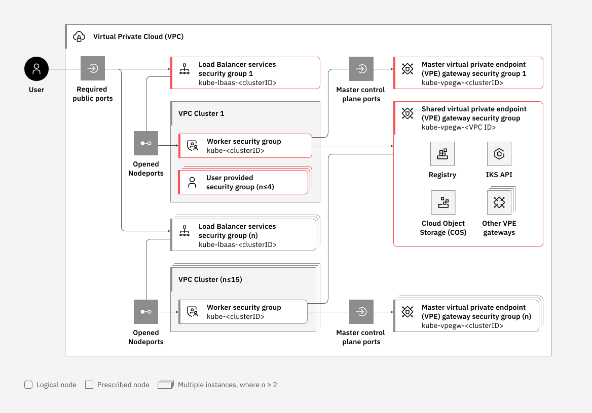

---

copyright: 
  years: 2023, 2026
lastupdated: "2026-10-09"

keywords: containers, {{site.data.keyword.containerlong_notm}}, firewall, rules, security group, 1.30, networking, secure by default, outbound traffic protection

subcollection: containers

---

{{site.data.keyword.attribute-definition-list}}

# Understanding secure by default Cluster VPC Networking
{: #vpc-security-group-reference}
{: help}
{: support}

[Virtual Private Cloud]{: tag-vpc}
[1.30 and later]{: tag-blue}

Beginning with new VPC clusters that are created at version 1.30, {{site.data.keyword.containerlong_notm}} introduced a new security feature called Secure by Default Cluster VPC Networking. With Secure by Default, there are new VPC settings, such as managed security groups, security group rules, and virtual private endpoint gateways (VPEs) that are created automatically when you create a VPC cluster. Review the following details about the VPC components that are created and managed for you when you create a version 1.30 and later cluster.
{: shortdesc}

## Overview
{: #sbd-overview}

With Secure by Default Networking, when you provision a new {{site.data.keyword.containerlong_notm}} VPC cluster at version 1.30 or later, only the traffic that is necessary for the cluster to function is allowed and all other access is blocked. To implement Secure by Default Networking, {{site.data.keyword.containerlong_notm}} uses various security groups and security group rules to protect cluster components. These security groups and rules are automatically created and attached to your worker nodes, load balancers, and cluster-related VPE gateways.

{: caption="This image shows the VPC security groups applied to your VPC and clusters." caption-side="bottom"}

Virtual Private Cloud security groups filter traffic at the hypervisor level. Security group rules are not applied in a particular order. However, requests to your worker nodes are only permitted if the request matches one of the rules that you specify. When you allow traffic in one direction by creating an inbound or outbound rule, responses are also permitted in the opposite direction. Security groups are additive, meaning that if your worker nodes are attached to more than one security group, all rules included in the security groups are applied to the worker nodes. Newer cluster versions might have more rules in the `kube-<clusterID>` security group than older cluster versions. Security group rules are added to improve the security of the service and do not break functionality.

## Virtual private endpoint (VPE) gateways
{: #sbd-managed-vpe-gateways}

When the first VPC cluster at {{site.data.keyword.containerlong_notm}} 1.28+ is created in a given VPC, or a cluster in that VPC has its master updated to 1.28+, then several shared VPE Gateways are created for various IBM Cloud services. Only one of each of these types of shared VPE Gateways is created per VPC. All the clusters in the VPC share the same VPE Gateway for these services. These shared VPE Gateways are assigned a single Reserved IP from each zone that the cluster workers are in.

### Shared VPE gateways
{: #shared-gateways}

The following VPE gateways are created automatically when you create a VPC cluster.

| VPE Gateway | Description | DNS Names |
| --- | --- | --- |
| {{site.data.keyword.registrylong_notm}} | Pull container images from {{site.data.keyword.registrylong_notm}} to apps running in your cluster. | `icr.io`, `*.icr.io` |
| {{site.data.keyword.cos_full_notm}} s3 gateway | Access the {{site.data.keyword.cos_full_notm}} APIs. | `s3.direct.<region>.cloud-object-storage.appdomain.cloud`, `*.s3.direct.<region>.cloud-object-storage.appdomain.cloud` |
| {{site.data.keyword.cos_full_notm}} config gateway | Backup container images to {{site.data.keyword.cos_full_notm}} | `config.direct.cloud-object-storage.cloud.ibm.com` |
| {{site.data.keyword.containerlong_notm}} (ca-mon, in-che, in-mum) | Access the {{site.data.keyword.containerlong_notm}} APIs to create clusters, add worker pools, and more. | `private.<region>.containers.cloud.ibm.com` |
| {{site.data.keyword.containerlong_notm}} (other regions) | Access the {{site.data.keyword.containerlong_notm}} APIs to create clusters, add worker pools, and more. | `api.<region>.containers.cloud.ibm.com` |
| {{site.data.keyword.vpc_short}} | Access VPC APIs to provision and manage resources that are part of the VPC Infrastructure as a Service (IaaS). | `<region>.private.iaas.cloud.ibm.com` |
{: caption="Shared VPE gateways" caption-side="bottom"}
{: summary="The table shows the VPE gateways created for VPC clusters. The first column includes name of the gateway. The second column includes a brief description. The third column includes the DNS names."}

### Non-shared VPE gateways
{: #non-shared-gateways}

All supported VPC clusters have a VPE Gateway for the cluster master that gets created in your account when the cluster gets created.

| VPE Gateway | Description |
| --- | --- |
| {{site.data.keyword.containerlong_notm}} cluster master | This VPE Gateway is used by the cluster workers, and can be used by other things in the VPC, to connect to the cluster's master API server. This VPE Gateway is assigned a single Reserved IP from each zone that the cluster workers are in, and this IP is created in one of the VPC subnets in that zone that has cluster workers. † |
{: caption="Non-shared VPE gateways" caption-side="bottom"}
{: summary="The table shows the VPE gateways created for VPC clusters. The first column includes name of the gateway. The second column includes a brief description."}

† For example, if the cluster has workers in only a single zone region (`us-east-1`) and single VPC subnet, then a single IP is created in that subnet and assigned to the VPE Gateway. If a cluster has workers in all three zones like `us-east-1`, `us-east-2`, and `us-east-3` and these workers are spread out among 4 VPC subnets in each zone, then 12 VPC subnets altogether, three IPs are created, one in each zone, in one of the four VPC subnets in that zone. Note that the subnet is chosen at random.

### Accessing the cluster master VPE gateway from another VPC
{: #non-shared-gateway-cross-vpc}

The cluster master VPE gateway is used by cluster workers and by any resource in the same VPC to access the cluster master API server over the private network. If you need to connect to the cluster master privately from a different VPC in the same account, you can create an additional VPE gateway in that other VPC that targets the same cluster master.

To do this, use the target CRN from the cluster master VPE gateway that {{site.data.keyword.containerlong_notm}} creates. You must supply your own Reserved IPs for the new gateway, and you must create and manage the security group and its rules. Outbound rules on a VPE gateway have no effect — only inbound rules are evaluated. {{site.data.keyword.containerlong_notm}} does not manage or modify the VPE gateway or security group that you create.
{: note}

## Managed security groups
{: #sbd-managed-groups}

{{site.data.keyword.containerlong_notm}} automatically creates and updates the following security groups and rules for VPC clusters.

| Security Group | Naming convention |
| --- | --- |
| [Worker security group](#vpc-sg-kube-clusterid) | `kube-<clusterID>` |
| [Master VPE gateway security group](#vpc-sg-kube-vpegw-cluster-id) | `kube-vpegw-<clusterID>` |
| [Shared VPE gateway security group](#vpc-sg-kube-vpegw-vpc-id) | `kube-vpegw-<vpcID>` |
| [Load balancer services security group](#vpc-sg-kube-lbaas-cluster-ID) | `kube-lbaas-<clusterID>` |
{: caption="Managed security groups" caption-side="bottom"}
{: summary="The table shows the managed security groups created for VPC clusters. The first column includes name of the security group. The second column includes the naming convention."}

### Worker security group
{: #vpc-sg-kube-clusterid}

When you create an {{site.data.keyword.containerlong_notm}} VPC cluster, a security group is created for all the workers, or nodes, for the given cluster.

- The name of the security group is `kube-<clusterID>` where `<clusterID>` is the ID of the cluster.
- If new nodes are added to the cluster later, those nodes are added to the cluster security group automatically.
- Rules are dynamically added or removed as needed by load balancers.
- {{site.data.keyword.containerlong_notm}} monitors only inbound TCP and UDP rules in the node port range on the `kube-<clusterID>` security group. If {{site.data.keyword.containerlong_notm}} detects a rule in the node port range and there is no corresponding node port service, it removes the rule. To allow inbound traffic to a node port service, add the required rule to the `kube-<clusterID>` security group after the node port service is created, not before.
- Extra rules that you add to the `kube-<clusterID>` security group outside of the node port range are ignored by {{site.data.keyword.containerlong_notm}} and left in place.
- Do not modify or remove the default rules in the `kube-<clusterID>` security group as doing so might cause disruptions in network connectivity between the workers of the cluster and the control plane.

| Description | Direction | Protocol | Ports or values | Source or destination |
| --- | --- | --- | --- | --- |
| Allows inbound traffic to the pod subnet. | Inbound | ICMP/TCP/UDP | All | Either 172.17.0.0/18 (the default subnet range) or a custom subnet range that you specify when you create your cluster. |
| Allows inbound access to self which allows worker-to-worker communication. | Inbound | ICMP/TCP/UDP | All | `kube-<clusterID>` |
| Allows inbound ICMP (ping) access. | Inbound | ICMP | type=8 | 0.0.0.0/0 |
| Allows inbound traffic from nodeports opened by your load balancers (ALBs/NLBs). As load balancers are added or removed rules are dynamically added or removed. | Inbound | TCP | Loadbalancer node ports.  | `kube-lbaas-<clusterID>` |
| Allows outbound traffic to the pod subnet. | Outbound | ICMP/TCP/UDP | All | Either 172.17.0.0/18 (the default subnet range) or a custom subnet range that you specify when you create your cluster. |
| Allows outbound traffic to the master control plane which allows workers to be provisioned. | Outbound | ICMP/TCP/UDP | All | 161.26.0.0/16 |
| Allows outbound access to self which allows worker-to-worker communication. | Outbound | ICMP/TCP/UDP | All | `kube-<clusterID>` |
| Allows outbound traffic to the master VPE gateway security group. | Outbound | ICMP/TCP/UDP | All | `kube-vpegw-<clusterID>` |
| Allows outbound traffic to the shared VPE gateway security group. | Outbound | ICMP/TCP/UDP | All | `kube-vpegw-<vpcID>` |
| Allows TCP traffic through Ingress ALB | Outbound | TCP | Ports:Min=443,Max=443 | ALB Public IP address `n` |
| Allows TCP and UDP traffic through custom DNS resolver for zone `n`.`**` | Outbound | TCP/UDP | Min=53,Max=53 | DNS resolver IP address in zone `n`. |
| Allows traffic to the entire CSE service range. | Outbound | ICMP/TCP/UDP | All | 166.8.0.0/14 |
| Allows traffic to the IAM private endpoint for all zones. The IPs might vary by region. One rule is added per zone the cluster is in. | Outbound | ICMP/TCP/UDP | All | IAM private endpoint IP address for all zones. |
| [1.33 and later]{: tag-blue} Allows outbound traffic to the instance metadata API. | Outbound | ICMP/TCP/UDP | All | 169.254.169.254 |
| [4.18 and later]{: tag-red} Allows outbound traffic to the instance metadata API. | Outbound | ICMP/TCP/UDP | All | 169.254.169.254 |
{: caption="Rules in the kube-clusterID security group" caption-side="bottom"}
{: summary="The table shows the rules applied to the cluster worker security group. The first column includes protocol of the rule. The second column includes the ports and types. The third column includes remote destination of the rule. The fourth column includes a brief description of the rule."}

`**` Hub and Spoke VPCs use custom DNS resolvers on the VPC. Traffic must flow through the IP addresses of each DNS resolver. There are two rules per zone (TCP and UDP) through port 53.

### Master VPE gateway security group
{: #vpc-sg-kube-vpegw-cluster-id}

When you create a VPC cluster, a Virtual Private Endpoint (VPE) gateway is created in the same VPC as the cluster. The name of the security is `kube-vpegw-<clusterID>` where `<clusterID>` is the ID of the cluster. The purpose of this VPE gateway is to serve as a gateway to the cluster master which is managed by IBM Cloud. The VPE gateway is assigned a single IP address in each zone in the VPC in which the cluster has workers.

To allow access to a cluster's master only from its worker nodes a security group is created for each cluster master VPE gateway. A remote rule is then created that allows Ingress connectivity from the cluster worker security group to the required ports on the cluster master VPE gateway. For private connections, including connections coming through a VPC VPN, to connect to the cluster's private service endpoint VPE gateway, TCP traffic is allowed from the subnet CIDRs for every active worker pool of your cluster.  

| Description | Direction | Protocol | Ports or values | Source or destination |
| ---- | ---- | ---- | ---- | ---- |
| Allow inbound traffic from the cluster worker security group to the server nodeport.  | Inbound | TCP | Server URL node port | `kube-<clusterID>` |
| Allow inbound traffic from the cluster worker security group to the Konnectivity port.  | Inbound | TCP | Konnectivity port | `kube-<clusterID>` |
| Allows inbound traffic from the subnet of every active worker pool in your cluster.`*`  | Inbound | TCP | Server URL node port | Subnet CIDR |
{: caption="Inbound rules in the Master VPE gateway security group" caption-side="bottom"}
{: summary="The table shows the inbound rules applied to the Master VPE gateway security group. The first column includes protocol of the rule. The second column includes the ports and types. The third column includes remote destination of the rule. The fourth column includes a brief description of the rule."}

 

`*` One rule is added for the subnet of every active worker pool. If you have workers in three zones, then three rules will be added (one for each subnet in that zone).

### Shared VPE gateway security group
{: #vpc-sg-kube-vpegw-vpc-id}

The shared VPE gateway security group is created when you provision the first cluster in a VPC. The name of the security group is `kube-vpegw-<vpcID>` where `<vpcID>` is the ID of your VPC. This security group is attached to all the shared VPE gateways in the VPC, and it controls which resources are allowed to send traffic through those gateways.

When each additional cluster is provisioned in the same VPC, a single inbound remote rule is added to this security group that allows traffic from the new cluster's `kube-<clusterID>` worker security group. One rule is created for each cluster in the VPC. If the `kube-vpegw-<vpcID>` security group already exists when a cluster is provisioned, it is recognized and reused — it is not recreated.

Each cluster creation also adds security groups, and a VPC supports a maximum of 100 security groups. This limit is reached around 33 clusters, so a maximum of 25 clusters per VPC is recommended. For more information, see [VPC quotas](/docs/vpc?topic=vpc-quotas).
{: important}

| Description | Direction | Protocol | Source or destination |
| ---- | ---- | ---- | ---- |
| Allows inbound traffic from the specified cluster. | Inbound | TCP | `kube-<clusterID>` |
{: caption="Inbound rules in the shared VPE gateway security group" caption-side="bottom"}
{: summary="The table shows the inbound rules applied to the shared VPE gateway security group. The first column includes the purpose of the rule. The second column includes the direction of the rule. The third column includes the protocol. The fourth column includes remote destination of the rule."}

You can add inbound rules to the `kube-vpegw-<vpcID>` security group, for example to allow VSIs or other resources in your VPC to access the shared VPE gateways. {{site.data.keyword.containerlong_notm}} does not remove rules that you add during normal cluster operations, including when additional clusters are provisioned in the VPC. For guidance on allowing VSIs to access shared VPE gateways, see [Why can't my VSIs access the VPE gateway?](/docs/containers?topic=containers-ts-sbd-vsi-vpe).

Running `ibmcloud ks security-group reset` deletes all rules in the security group, including any rules that you added, and restores only the default {{site.data.keyword.containerlong_notm}} rules.
{: important}

If your VPC contains VSIs or other resources that need access to shared cloud service endpoints (such as `icr.io` or `s3.direct`) before any cluster is provisioned, you can create the `kube-vpegw-<vpcID>` security group and the shared VPE gateways yourself. When a {{site.data.keyword.containerlong_notm}} cluster is later provisioned in the VPC, it finds the existing security group and reuses it, and adds a new inbound rule for the new cluster's worker security group.

When you create a shared VPE gateway yourself, attach the `kube-vpegw-<vpcID>` security group to it. {{site.data.keyword.containerlong_notm}} does not automatically attach its security group to gateways that it did not create.
{: note}

{{site.data.keyword.containerlong_notm}} identifies the shared VPE gateways it manages by their name prefix. Gateways created by {{site.data.keyword.containerlong_notm}} use the `iks-` naming convention. Shared VPE gateways and the `kube-vpegw-<vpcID>` security group are not deleted when a cluster is removed from the VPC. {{site.data.keyword.containerlong_notm}} does not modify the Reserved IPs of shared VPE gateways that it did not create. If you rename a gateway that {{site.data.keyword.containerlong_notm}} created (removing the `iks-` prefix), {{site.data.keyword.containerlong_notm}} stops managing that gateway's Reserved IPs. This is the supported way to take ownership of a gateway created by {{site.data.keyword.containerlong_notm}} without disrupting existing connectivity.

In a hub and spoke VPC configuration where spoke VPCs delegate DNS resolution to a hub VPC, {{site.data.keyword.containerlong_notm}} always creates shared VPE gateways in the spoke VPC when a cluster is provisioned there. This ensures connectivity if the spoke is ever disconnected from the hub. If DNS delegation routes spoke endpoints through the hub, the spoke gateways are not used for DNS resolution. You must still configure the security groups on the hub's shared VPE gateways to allow inbound traffic from the spoke VPC subnets. For more information, see [Considerations for hub and spoke VPCs with outbound traffic protection](/docs/containers?topic=containers-sbd-allow-outbound#sbd-example-hubspoke).

### Load balancer services security group
{: #vpc-sg-kube-lbaas-cluster-ID}

Each cluster has one `kube-lbaas-<clusterID>` security group that is attached to all of its load balancers (ALBs and NLBs). Private Path NLBs do not support attaching security groups.

Rules in this security group are generated and updated dynamically as load balancers are added, updated, or removed. {{site.data.keyword.containerlong_notm}} monitors all inbound and outbound rules in this security group and automatically removes any extra rules that it does not recognize as required. If you run `ibmcloud ks security-group reset`, all rules are deleted and only the default {{site.data.keyword.containerlong_notm}} rules are restored.

Outbound rules in this security group route traffic to the worker node ports that the external ports (such as ports 80 and 443) are mapped to. Do not modify or delete any outbound rules in the `kube-lbaas-<clusterID>` security group.

#### Restricting inbound traffic to public load balancers
{: #restricting-inbound-lbaas}

A common scenario is restricting which source IP addresses can send traffic to a public load balancer. To limit inbound traffic for a specific port (such as TCP port 443):

1. Add inbound rules to the `kube-lbaas-<clusterID>` security group for that port specifying the allowed source IP addresses or CIDR blocks. You can create multiple rules to allow multiple source IP addresses.
2. After your allowed source IP rules are created, delete the default inbound rule that allows all IP addresses (`0.0.0.0/0`) on that port.

Every inbound port exposed by the load balancer must have at least one rule — either the default rule allowing all IPs or one or more custom source IP rules. If you delete the default "allow all IPs" rule without first adding an allowed source IP rule for that port, {{site.data.keyword.containerlong_notm}} automatically recreates the "allow all IPs" rule.
{: important}

#### Custom LBaaS security groups
{: #custom-lbaas-sgs}

If you have both public and private load balancers and want different firewall rules for each (for example, restricting source IPs for public load balancers while allowing all traffic to private load balancers), you can attach a custom security group to specific load balancers by using the `service.kubernetes.io/ibm-load-balancer-cloud-provider-vpc-security-group` annotation instead of using the cluster default.

When you use a custom LBaaS security group:
- {{site.data.keyword.containerlong_notm}} still automatically creates any required inbound rules that are missing.
- {{site.data.keyword.containerlong_notm}} never removes rules that you add to the custom security group.

| Description | Direction | Protocol | Port or value | Source or destination |
| ---- | ---- | ---- | ---- | ---- |
| Allows outbound access to node port opened by the load balancer. Depending on the load balancer you might have multiple rules. | Outbound | TCP | Node port(s) opened by the load balancer. | `kube-<clusterID>` |
| Load balancer listens on port 80 allowing inbound access from that port. | Inbound | TCP | Public LB port. Example `80` | 0.0.0.0/0 |
| Load balancer listens on port 443 allowing inbound access from that port. | Inbound | TCP | Public LB port. Example `443` | 0.0.0.0/0 |
{: caption="Load balancer security group rules" caption-side="bottom"}
{: summary="The table shows the rules applied to the Load balancer security group. The first column includes purpose of the rule. The second column includes the direction of the rule. The third column includes the protocol. The fourth column includes the ports or values. The fifth column includes remote destination of the rule."}

## User-provided {{site.data.keyword.security-groups}}
{: #user-provided-sgs}

When you create a VPC cluster, you can provide up to four additional security groups that you own.

You can also attach a custom security group to a load balancer by adding the `service.kubernetes.io/ibm-load-balancer-cloud-provider-vpc-security-group` annotation to your load balancer resource. This is useful if you have both public and private facing load balancers and you want to limit who can send traffic to the public load balancer. When you use a custom LBaaS security group, {{site.data.keyword.containerlong_notm}} automatically creates rules for incoming traffic, but does not automatically delete extra rules that you add. For more information, see [Custom LBaaS security groups](#custom-lbaas-sgs).

For more information, see [Creating and managing VPC security groups](/docs/containers?topic=containers-vpc-security-group-manage).

## Limitations
{: #vpc-sg-limitations}

Worker node security groups
:   Because the worker nodes in your VPC cluster exist in a service account and aren't listed in the VPC infrastructure dashboard, you can't create a security group and apply it to your worker node instances. You can only modify the existing `kube-<clusterID>` security group.

Logging and monitoring
:   When setting up logging and monitoring on a 1.30 or later cluster, you must use the private service endpoint when installing the logging agent in your cluster. Log data is not be saved if the public endpoint is used.

Monitoring clusters with RHCOS worker nodes
:   The monitoring agent relies on kernel headers in the operating system, however RHCOS doesn't have kernel headers. In this scenario, the agent reaches back to `sysdig.com` to use the pre-compiled agent. In clusters with no public network access this process fails. eBPF is now enabled by default for new Sysdig deployments. However, if you are experiencing issues on an existing cluster, [verify whether eBPF is enabled and enable it if necessary](/docs/openshift?topic=openshift-ts-cluster-sysdig-ebpf). Alternatively, you can allow outbound traffic or see the Sysdig documentation for [installing the agent on air-gapped environments](https://docs.sysdig.com/en/docs/administration/on-premises-deployments/installation/airgapped-installation/){: external}.

VPC cluster quotas
:   Each cluster creation adds security groups to your VPC, which has a maximum of 100 security groups. This limit is reached around 33 clusters, so a maximum of 25 clusters per VPC is recommended. For more information, see [VPC quotas](/docs/vpc?topic=vpc-quotas).

Encryption in-transit for VPC File Storage.
:   To use EIT with Secure by Default clusters, you must add the following outbound rule to the `kube-<clusterID>` security group.
    - **Protocol**: Any 
    - **Source type**: Any
    - **Source**: 0.0.0.0/0 
    - **Destination** 169.254.169.254.

Backup communication over the public network
:   VPC cluster workers use the private network to communicate with the cluster master. Previously, for VPC clusters that had the public service endpoint enabled, if the private network was blocked or unavailable, then the cluster workers could fall back to using the public network to communicate with the cluster master. In Secure by Default clusters, falling back to the public network is not an option because public outbound traffic from the cluster workers is blocked. You might want to disable outbound traffic protection to allow this public network backup option, however, there is a better alternative. Instead, if there a temporary issue with the worker-to-master connection over the private network, then, at that time, you can add a temporary security group rule to the `kube-clusterID` security group to allow outbound traffic to the cluster master `apiserver` port. Later, when the problem is resolved, you can remove the temporary rule.

OpenShift Data Foundation and Portworx encryption
:   If you plan to use OpenShift Data Foundation or Portworx in a cluster with no public network access, and you want to use {{site.data.keyword.hscrypto}} or {{site.data.keyword.keymanagementserviceshort}} for encryption, you must create a virtual private endpoint gateway (VPE) that allows access to your KMS instance. Make sure to bind at least 1 IP address from each subnet in your VPC to the VPE.
