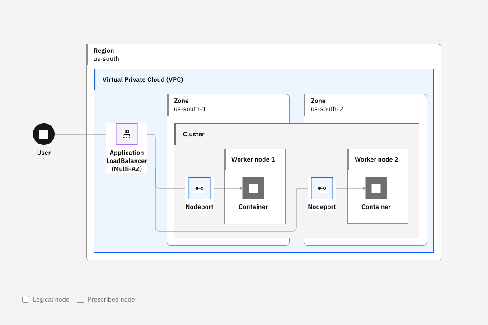

---

copyright: 
  years: 2014, 2023
lastupdated: "2023-07-20"

keywords: kubernetes, app protocol, application protocol

subcollection: containers


---

{{site.data.keyword.attribute-definition-list}}


# Exposing apps with load balancers for VPC 
{: #vpc-lbaas}

[Virtual Private Cloud]{: tag-vpc}

Set up a Load Balancer for VPC to expose your app on the public or private network.
{: shortdesc}

VPC load balancers can be created for VPC clusters only, and can't be created for classic clusters. To load balance in classic clusters, see [Classic: About network load balancers (NLBs)](/docs/containers?topic=containers-loadbalancer-about).

To expose an app in a VPC cluster, you can create a layer 7 Application Load Balancer for VPC. You can optionally create a layer 4 Network Load Balancer for VPC.


The following table describes the basic characteristics of each load balancing option.

|Characteristic|Application Load Balancer for VPC|Network Load Balancer for VPC|
|--------------|---------------------|-----------------------------|
|Supported Kubernetes version|All versions|All versions|
|Transport layer|Layer 7|Layer 4|
|Types of load balancers|Public and private|Public and private|
|Supported protocols|TCP|TCP, UDP|
|Application access|Hostname|Hostname and static IP address|
|Source IP preservation|Configurable*|Yes|
|Improved performance with direct server return|No|Yes|
|Multizone routing|Yes|No|
|Port ranges|No| Public only|
|Security groups|Yes|Public only|
{: caption="Load balancing options for VPC clusters"}


## Network Load Balancer for VPC
{: #nlb_vpc}

In VPC clusters, set up a layer-4 [Network Load Balancer for VPC](/docs/vpc?topic=vpc-network-load-balancers) (VPC NLB) in each zone of your cluster to serve as the external entry point for incoming requests to an app.
{: shortdesc}

VPC NLBs provide several advantages, such as providing higher throughput and better performance by utilizing direct server return (DSR). With DSR, the worker node can send app response packets directly to the client IP address and skip the VPC NLB, decreasing the amount of traffic that the VPC NLB must handle. Additionally, the VPC NLB supports source IP address preservation on all client requests by default.

When you create a Kubernetes `LoadBalancer` service for an app in your cluster and include the `service.kubernetes.io/ibm-load-balancer-cloud-provider-enable-features: "nlb"` annotation, a VPC NLB is created in your VPC outside of your cluster. The VPC NLB routes requests for your app through the private NodePorts that are automatically opened on your worker nodes.
* If you create a **public** Kubernetes `LoadBalancer` service, you can access your app from the internet through the external, public IP address that is assigned by the VPC NLB to the Kubernetes `LoadBalancer` service. Even though your worker nodes are connected to only a private VPC subnet, the VPC NLB can receive and route public requests to the service that exposes your app. Note that no public gateway is required on your VPC subnet to allow public requests to your VPC NLB. However, if your app must access a public URL, you must attach public gateways to the VPC subnets that your worker nodes are connected to.
* If you create a **private** Kubernetes `LoadBalancer` service, your app is accessible only to systems that are connected to your private subnets within the same region and VPC. If you are connected to your private VPC network, you can access your app through the external, private IP address that is assigned by the VPC NLB to the Kubernetes `LoadBalancer` service.

The following diagram illustrates how a user accesses an app from the internet through the VPC NLB.

{: caption="Figure 1. VPC load balancing for a cluster through the VPC NLB" caption-side="bottom"}

1. A request to your app uses the external IP address that is assigned to the Kubernetes `LoadBalancer` service by the VPC NLB.
2. The request is automatically forwarded by the VPC NLB to one of the node ports on the worker node, and then to the private IP address of the app pod.
3. If app instances are deployed to multiple worker nodes in the cluster, the VPC NLB routes the requests between the app pods on various worker nodes within the same zone.

## Application Load Balancer for VPC
{: #lb_vpc}

Set up a layer-7, multizone [Application Load Balancer for VPC](/docs/vpc?topic=vpc-load-balancers) (VPC ALB) to serve as the external entry point for incoming requests to an app in your cluster.
{: shortdesc}

Do not confuse the Application Load Balancer for VPC with {{site.data.keyword.containerlong_notm}} Ingress applications load balancers. Application Load Balancers for VPC (VPC ALBs) run outside your cluster in your VPC and are configured by Kubernetes `LoadBalancer` services that you create. [Ingress applications load balancers (ALBs)](/docs/containers?topic=containers-comm-ingress-annotations) are Ingress controllers that run on worker nodes in your cluster.
{: note}

By default, when you create a Kubernetes `LoadBalancer` service for an app in your cluster, an Application Load Balancer for VPC is created in your VPC outside of your cluster. The VPC ALB routes requests to your app through the private NodePorts that are automatically opened on your worker nodes.
* If you create a **public** Kubernetes `LoadBalancer` service, you can access your app from the internet through the hostname that is assigned by the VPC ALB to the Kubernetes `LoadBalancer` service in the format `1234abcd-<region>.lb.appdomain.cloud`. Even though your worker nodes are connected to only a private VPC subnet, the VPC ALB can receive and route public requests to the service that exposes your app. Note that no public gateway is required on your VPC subnet to allow public requests to your VPC ALB. However, if your app must access a public URL, you must attach public gateways to the VPC subnets that your worker nodes are connected to.
* If you create a **private** Kubernetes `LoadBalancer` service, your app is accessible only to systems that are connected to your private subnets within the same region and VPC. If you are connected to your private VPC network, you can access your app through the hostname that is assigned by the VPC ALB to the Kubernetes `LoadBalancer` service in the format `1234abcd-<region>.lb.appdomain.cloud`.

The following diagram illustrates how a user accesses an app from the internet through the VPC ALB.

{: caption="Figure 2. Load balancing for a cluster through the VPC ALB" caption-side="bottom"}

1. A request to your app uses the hostname that is assigned to the Kubernetes `LoadBalancer` service by the VPC ALB, such as `1234abcd-<region>.lb.appdomain.cloud`.
2. The request is automatically forwarded by the VPC ALB to one of the node ports on the worker node, and then to the private IP address of the app pod.
3. If app instances are deployed to multiple worker nodes in the cluster, the load balancer routes the requests between the app pods on various worker nodes. Additionally, if you have a multizone cluster, the VPC ALB routes requests to worker nodes across all subnets and zones in your cluster.

## Setting up a Network Load Balancer for VPC
{: #setup_vpc_nlb}

Expose your app to the public or to the private network by setting up a [public](#setup_vpc_nlb_pub) or [private](#setup_vpc_nlb_priv) Kubernetes `LoadBalancer` service in each zone of your VPC cluster. Then, you can optionally [register the VPC NLB with a DNS record and TLS certificate](#vpc_nlb_dns).
{: shortdesc}

### Setting up a public VPC NLB
{: #setup_vpc_nlb_pub}

Expose your app to public network traffic by setting up a Kubernetes `LoadBalancer` service in each zone of your cluster. When you create the Kubernetes `LoadBalancer` service, a public Network Load Balancer for VPC (VPC NLB) that routes requests to your app is automatically created for you in your VPC outside of your cluster.
{: shortdesc}

* Ensure that you have the [**Writer** or **Manager** {{site.data.keyword.cloud_notm}} IAM service access role](/docs/containers?topic=containers-users#checking-perms) for the namespace in which you deploy the Kubernetes `LoadBalancer` service for the VPC NLB.
* [Log in to your account. If applicable, target the appropriate resource group. Set the context for your cluster.](/docs/containers?topic=containers-access_cluster)
* To view VPC NLBs, install the `infrastructure-service` plug-in. The prefix for running commands is `ibmcloud is`.
    ```sh
    ibmcloud plugin install infrastructure-service
    ```
    {: pre}

* When cluster nodes are reloaded or when a cluster master update includes a new `keepalived` image,  the load balancer virtual IP is moved to the network interface of a new node. When this occurs, any long-lasting connections to your load balancer must be re-established. Consider including retry logic in your application so that attempts to re-establish the connection are made quickly.


1. [Deploy your app to the cluster](/docs/containers?topic=containers-deploy_app#app_cli). Ensure that you add a label in the metadata section of your deployment configuration file. This custom label identifies all pods where your app runs to include them in the load balancing.

2. Create a configuration YAML file for your Kubernetes `LoadBalancer` service. Consider naming the service in the format `<app_name>-vpc-nlb-<VPC_zone>`.

    Mixed protocol load balancer services are not currently supported in IBM Cloud Kubernetes Service. Do not specify both TCP and UDP ports in your load balancer definition, as doing so causes an error that prevents the load balancer service from provisioning. Note that specifying the `service.kubernetes.io/ibm-load-balancer-cloud-provider-vpc-health-check-udp` annotation with a TCP port does not create this conflict. 
    {: important}
    
    ```yaml
    apiVersion: v1
    kind: Service
    metadata:
      name: <app_name>-vpc-nlb-<VPC_zone>
      annotations:
        service.kubernetes.io/ibm-load-balancer-cloud-provider-vpc-lb-name: "my-load-balancer"
        service.kubernetes.io/ibm-load-balancer-cloud-provider-enable-features: "nlb"
        service.kubernetes.io/ibm-load-balancer-cloud-provider-ip-type: "public"
        service.kubernetes.io/ibm-load-balancer-cloud-provider-vpc-node-selector: "<key>=<value>"
        service.kubernetes.io/ibm-load-balancer-cloud-provider-vpc-subnets: "<subnet1_ID,subnet2_ID>"
        service.kubernetes.io/ibm-load-balancer-cloud-provider-zone: "<zone>"
        service.kubernetes.io/ibm-load-balancer-cloud-provider-vpc-health-check-udp: "<tcp_port>"
        service.kubernetes.io/ibm-load-balancer-cloud-provider-vpc-health-check-protocol: "<protocol>"
        service.kubernetes.io/ibm-load-balancer-cloud-provider-vpc-health-check-port: "<port>"
        service.kubernetes.io/ibm-load-balancer-cloud-provider-vpc-health-check-path: "<url_path>"
        service.kubernetes.io/ibm-load-balancer-cloud-provider-vpc-health-check-delay: "<value>"
        service.kubernetes.io/ibm-load-balancer-cloud-provider-vpc-health-check-timeout: "<value>"
        service.kubernetes.io/ibm-load-balancer-cloud-provider-vpc-health-check-timeout: "<value>"
    spec:
      type: LoadBalancer
      selector:
        <selector_key>: <selector_value>
      ports:
       - name: http
         protocol: TCP
         port: 8080
         targetPort: 8080 # Optional. By default, the `targetPort` is set to match the `port` value unless specified otherwise. 
       - name: https
         protocol: TCP
         port: 443
         targetPort: 443 # Optional. By default, the `targetPort` is set to match the `port` value unless specified otherwise. 
      externalTrafficPolicy: Local # Specify Local or Cluster.
    ```
    {: codeblock}

    `service.kubernetes.io/ibm-load-balancer-cloud-provider-vpc-lb-name: "my-load-balancer"`
    :   Optional. **Versions 1.24 and later**: Include a unique name to make your VPC load balancer persistent. Persistent VPC load balancers are not deleted when the cluster they belong to is deleted. For more information, see [Persistent VPC load balancers](#vpc_lb_persist).

    `service.kubernetes.io/ibm-load-balancer-cloud-provider-enable-features: "nlb"`
    :    Required: Annotation to create a VPC NLB.
    
    `service.kubernetes.io/ibm-load-balancer-cloud-provider-ip-type`
    :    Optional: Annotation to specify a service that accepts public requests. If you don't include this annotation, a public VPC NLB is created. 
    
    `service.kubernetes.io/ibm-load-balancer-cloud-provider-vpc-node-selector`
    :    Optional: Annotation to specify a worker node label selector. To identify the worker nodes that receive traffic, you can select one of the supported label selector keys. Note that you can include only one label selector in the annotation, and that the selector must be specified in the `"key=value"` format. If this annotation is not specified, all worker nodes in the same zone as the VPC NLB are configured to receive traffic from the VPC NLB. If specified, this annotation takes precedence over the `service.kubernetes.io/ibm-load-balancer-cloud-provider-zone` annotation, and any `dedicated: edge` labels on worker nodes are ignored. To limit traffic to a specific zone, you can use this annotation to specify worker nodes in that zone. 
    :    The following keys are permitted.
        - `ibm-cloud.kubernetes.io/internal-ip`
        - `ibm-cloud.kubernetes.io/machine-type`
        - `ibm-cloud.kubernetes.io/os`
        - `ibm-cloud.kubernetes.io/region`
        - `ibm-cloud.kubernetes.io/subnet-id`
        - `ibm-cloud.kubernetes.io/worker-pool-id`
        - `ibm-cloud.kubernetes.io/worker-pool-name`
        - `ibm-cloud.kubernetes.io/zone`
        - `kubernetes.io/arch`
        - `kubernetes.io/hostname`
        - `kubernetes.io/os`
        - `node.kubernetes.io/instance-type`
        - `topology.kubernetes.io/region`
        - `topology.kubernetes.io/zone`

    `service.kubernetes.io/ibm-load-balancer-cloud-provider-vpc-subnets`
    :   Optional: Annotation to specify one or more subnets in one zone that the VPC NLB deploys to. Values can be specified as VPC subnet IDs, VPC subnet names, or VPC subnet CIDRs. If specified, this annotation takes precedence over the `service.kubernetes.io/ibm-load-balancer-cloud-provider-zone` annotation. Note that you can specify a different subnet in the same VPC than the subnets that your cluster is attached to. In this case, even though the VPC NLB deploys to a different subnet in the same VPC, the VPC NLB can still route traffic to your worker nodes on the cluster subnets in the same zone. To see subnets in all resource groups, run `ibmcloud ks subnets --provider vpc-gen2 --vpc-id <vpc> --zone <zone>`.

    `service.kubernetes.io/ibm-load-balancer-cloud-provider-zone`
    :   Optional: Annotation to specify a VPC zone that your cluster is attached to. The VPC NLB is deployed to the same subnet in that zone that your worker nodes are connected to. Because the VPC NLB is single-zone, only worker nodes in your cluster in this zone are configured to receive traffic.
    :   To see zones, run `ibmcloud ks zone ls --provider vpc-gen2`. If you later change this annotation to a different zone, the VPC NLB is not moved to the new zone.
    :   Note that if you don't specify this annotation or the `service.kubernetes.io/ibm-load-balancer-cloud-provider-vpc-subnets` annotation, the VPC NLB is deployed to the most optimal zone. For example, the VPC NLB is deployed only to zones in which worker nodes exist and are in the `Ready` state.

    `service.kubernetes.io/ibm-load-balancer-cloud-provider-vpc-health-check-udp`
    :    Optional: Specify a TCP port to use for TCP health checks in a UDP load balancer. Required for UDP load balancers that have `externalTrafficPolicy` set to `Cluster`. For more information on setting port values, see [Configuring TCP health checks for UDP load balancers](#vpc_lb_health_udp).

    `service.kubernetes.io/ibm-load-balancer-cloud-provider-vpc-health-check-protocol`
    :  Optional. The protocol type to use for the custom health checks. Choose `http`, `https`, or `tcp`. This annotation overrides the TCP or HTTP configuration set with the `externalTrafficPolicy` annotation. However, if `externalTrafficPolicy` is set to `Local`, the incoming traffic rules still apply.

    `service.kubernetes.io/ibm-load-balancer-cloud-provider-vpc-health-check-port`
    :  Optional. The TCP port that is used for the health checks. This annotation applies only if `ibm-load-balancer-cloud-provider-vpc-health-check-protocol` is also specified. 
    - If the specified TCP port is outside of the Kubernetes node port range (30,000-32,767), the VPC security group applied to the cluster worker nodes must be [modified](/docs/containers?topic=containers-vpc-security-group#vpc-sg-create-rules) to allow inbound traffic on the port. 
    - If this annotation is applied to a Kubernetes load balancer service associated with a VPC ALB, the outbound rules of the security group assigned to the VPC ALB must be [modified](/docs/containers?topic=containers-vpc-security-group#vpc-sg-create-rules) to allow outbound traffic to the specified TCP port. 

    `service.kubernetes.io/ibm-load-balancer-cloud-provider-vpc-health-check-path`
    :   Optional. The health check URL path for HTTP and HTTPS health checks. This annotation applies only if `ibm-load-balancer-cloud-provider-vpc-health-check-protocol` is set to `http` or `https`.
    - The URL path must be in the format of an [origin-form request target](https://www.rfc-editor.org/rfc/rfc7230#section-5.3.1){: external}.
    - If this annotation is not specified and the `ibm-load-balancer-cloud-provider-vpc-health-check-protocol` annotation is set to `http` or `https`, the  default value `/` is applied.

    `service.kubernetes.io/ibm-load-balancer-cloud-provider-vpc-health-check-delay`
    :   Optional. The number of seconds to wait between health check attempts. By default, this value is set to `5`, and has a minimum of `2` and a maximum of `60`. This value must be greater than the `ibm-load-balancer-cloud-provider-vpc-health-check-timeout` value, which is set to `2` by default. 

    `service.kubernetes.io/ibm-load-balancer-cloud-provider-vpc-health-check-timeout`
    :   Optional. The number of seconds to wait for a response to a health check. By default, this value is set to `2`, and has a minimum of `1` and a maximum of `59`. This value must be less than the `ibm-load-balancer-cloud-provider-vpc-health-check-delay`, which is set to `5` by default. 

    `service.kubernetes.io/ibm-load-balancer-cloud-provider-vpc-health-check-retries`
    :   The maximum number of health check retries for the VPC load balancer. By default, this value is set to `2`, and has a minimum of `1` and a maximum of `10`.
    
    `selector`
    :   The label key (<selector_key>) and value (<selector_value>) that you used in the `spec.template.metadata.labels` section of your app deployment YAML. This custom label identifies all pods where your app runs to include them in the load balancing.

    `port`
    :   The port that the service listens on.
    
    `targetPort`
    :   Optional: The port to which the service directs traffic.
    
    `externalTrafficPolicy`
    :   Set to `Local` to preserve the source IP address of client requests to your apps. This setting also prevents traffic from forwarding to a different zone. You must ensure that an app pod exists on each worker node in the zone that the VPC NLB deploys to, such as by using a DaemonSet. This option also configures HTTP health checks. 
    :   If `Cluster` is set, DSR is implemented only from the worker node that the VPC NLB initially forwards the incoming request to. After the incoming request arrives, the request is forwarded to a worker node that contains the app pod, which may be in a different zone. The response from the app pod is sent to the original worker node, and that worker node uses DSR to send the response directly back to the client, bypassing the VPC NLB. This option also configures TCP health checks. For UDP load balancers, the `service.kubernetes.io/ibm-load-balancer-cloud-provider-vpc-health-check-udp` must be set with a TCP port value. For more information, see [Configuring TCP health checks for UDP load balancers](#vpc_lb_health_udp).

3. Create the Kubernetes `LoadBalancer` service in your cluster.
    ```sh
    kubectl apply -f <filename>.yaml -n <namespace>
    ```
    {: pre}

4. Verify that the Kubernetes `LoadBalancer` service is created successfully in your cluster. When the service is created, the **LoadBalancer Ingress** field is populated with an external IP address that is assigned by the VPC NLB.

    **The VPC NLB takes a few minutes to provision in your VPC.** The external IP address of your Kubernetes `LoadBalancer` service might be `pending` until the VPC NLB is fully provisioned.
    {: note}

    ```sh
    kubectl describe svc myloadbalancer -n <namespace>
    ```
    {: pre}

    Example CLI output for a public `LoadBalancer` service:
    ```sh
    NAME:                     myvpcnlb
    Namespace:                default
    Labels:                   <none>
    Annotations:              service.kubernetes.io/ibm-load-balancer-cloud-provider-enable-features: nlb
    Selector:                 app=echo-server
    Type:                     LoadBalancer
    IP:                       172.21.204.12
    LoadBalancer Ingress:     169.XXX.XXX.XXX
    Port:                     tcp-80  80/TCP
    TargetPort:               8080/TCP
    NodePort:                 tcp-80  32022/TCP
    Endpoints:                172.17.17.133:8080,172.17.22.68:8080,172.17.34.18:8080 + 3 more...
    Session Affinity:         None
    External Traffic Policy:  Local
    HealthCheck NodePort:     30882
    Events:
        Type     Reason                           Age                  From                Message
    ----     ------                           ----                 ----                -------
    Warning  SyncLoadBalancerFailed           13m (x5 over 15m)    service-controller  Error syncing load balancer: failed to ensure load balancer: kube-bqcssbbd0bsui62odcdg-2d93b07decf641d2ad3f9c2985122ec1 for service default/myvpcnlb is busy: offline/create_pending
    Normal   EnsuringLoadBalancer             9m27s (x7 over 15m)  service-controller  Ensuring load balancer
    Normal   EnsuredLoadBalancer              9m20s                service-controller  Ensured load balancer
    Normal   CloudVPCLoadBalancerNormalEvent  8m17s                ibm-cloud-provider  Event on cloud load balancer myvpcnlb for service default/myvpcnlb with UID 2d93b07d-ecf6-41d2-ad3f-9c2985122ec1: The VPC load balancer that routes requests to this Kubernetes LoadBalancer service is currently online/active.
    ```
    {: screen}

5. Verify that the VPC NLB is created successfully in your VPC. In the output, verify that the VPC NLB has an **Operating Status** of `online` and a **Provision Status** of `active`.

    Persistent VPC NLB names have a format `kube-<cluster_ID>-<kubernetes_lb_service_UID>`. To see your cluster ID, run `ibmcloud ks cluster get --cluster <cluster_name>`. To see the Kubernetes `LoadBalancer` service UID, run `kubectl get svc myloadbalancer -o yaml` and look for the **metadata.uid** field in the output. The dashes (-) are removed from the Kubernetes `LoadBalancer` service UID in the VPC NLB name.
    {: tip}
    
    The VPC NLB name has a format `kube-<cluster_ID>-<kubernetes_lb_service_UID>`. To see your cluster ID, run `ibmcloud oc cluster get --cluster <cluster_name>`. To see the Kubernetes `LoadBalancer` service UID, run `oc get svc myloadbalancer -o yaml` and look for the **metadata.uid** field in the output. The dashes (-) are removed from the Kubernetes `LoadBalancer` service UID in the VPC NLB name.
    {: tip}

     Do not rename any VPC NLBs that are created automatically for `LoadBalancer` services. If you rename a VPC NLB, {{site.data.keyword.containerlong_notm}} automatically creates another VPC NLB for the `LoadBalancer` service.
    {: important}

    ```sh
    ibmcloud is load-balancers
    ```
    {: pre}

    In the following example CLI output, the VPC NLB that is named `kube-bh077ne10vqpekt0domg-046e0f754d624dca8b287a033d55f96e` is created for the Kubernetes `LoadBalancer` service:
    ```sh
    ID                                     Name                                                         Created          Host Name                                  Is Public   Listeners                               Operating Status   Pools                                   Private IPs              Provision Status   Public IPs                    Subnets                                Resource Group
    06496f64-a689-4693-ba23-320959b7b677   kube-bh077ne10vqpekt0domg-046e0f754d624dca8b287a033d55f96e   8 minutes ago    1234abcd-us-south.lb.appdomain.cloud       yes         95482dcf-6b9b-4c6a-be54-04d3c46cf017    online             717f2122-5431-403c-b21d-630a12fc3a5a    10.241.0.7               active             169.63.99.184                 c6540331-1c1c-40f4-9c35-aa42a98fe0d9   00809211b934565df546a95f86160f62
    ```
    {: screen}

6. Access the IP address of the Kubernetes `LoadBalancer` service that you found in step 4 and your app port in the format `<external_IP>:<app_port>`.

7. Optional: Repeat these steps to deploy a public VPC NLB in each zone where you want to expose your app. Then, you can register the external IP addresses of the VPC NLB in each zone with one [DNS subdomain](#vpc_nlb_dns).

Do not delete the subnets that you attached to your cluster during cluster creation or when you add worker nodes in a zone. If you delete a VPC subnet that your cluster used, any VPC NLBs that use IP addresses from the subnet might experience issues, and you might be unable to create new load balancers.
{: important}

### Setting up an NLB using port range
{: #nlb-setup-portrange}


Port ranges can be used in  public NLBs when there is a need to host a service from a single host name that has multiple backend applications, each listening on a separate port number. To use port ranges in your Kubernetes cluster, some manual configuration must be performed. First, the `ibm-load-balancer-cloud-provider-vpc-port-range` option must be set.  It can include one or multiple ranges, each delimited by a comma. The `spec.ports.port` value must also be set to the minimum value in the port range.

In the following example, a port range of `30000-30010` is used.


Nodeport services must be manually created for each deployment in which the NLB service forwards the request. The port number of each of these Nodeport services must be within the port range that is configured in the NLB service.

In the following example diagram, a Nodeport service with port 30000 is created for Deployment 1 while a Nodeport service with port 30001 is created for Deployment 2.

The user makes a request to port 30001 of the NLB containing the port range. This request is directed to the VPC NLB service that directs the request to the Nodeport service in the cluster that is also listening on port 30001, which in this case is for Deployment 2. The Nodeport service then directs the request to the target port of the selected pods of Deployment 2.

{: caption="Figure 3. VPC NLB with port range" caption-side="bottom"}

Create an NLB that uses a port range by using the following example. The selector and backend pods must be associated with the port range load balancer service so that health checks return success and data is delivered to the ports in the port range. To use port range, you must create additional NodePort services that have port values in the range that is defined by the load balancer service.

1. Save the following example `LoadBalancer` configuration as a file called `loadbalancer.yaml`.

    ```yaml
    apiVersion: v1
    kind: Service
    metadata:
      annotations:
        service.kubernetes.io/ibm-load-balancer-cloud-provider-enable-features: nlb
        service.kubernetes.io/ibm-load-balancer-cloud-provider-vpc-port-range: 30000-30010
      name: nlb-port-range
    spec:
      externalTrafficPolicy: Cluster
      ports:
      - port: 30000 # Must match min from the port range 
        protocol: TCP
        nodePort: 30011 # Can be port in range or not
        targetPort: 8080
      selector:
        app: echo-server  # Must be valid for health checks to work
      type: LoadBalancer
    ```
    {: codeblock}
    
1. Create the service.
    ```sh
    kubectl apply -f loadbalancer.yaml
    ```
    {: pre}

1. Create a `NodePort` service with port values that are in the port range specified in the `LoadBalancer` you created earlier.

    ```yaml
    apiVersion: v1
    kind: Service
    metadata:
      name: echo-server-node-port
    spec:
      ports:
      - port: 80
        protocol: TCP # The protocol of the port range
        nodePort: 30003 # Node port in the port range
        targetPort: 8080
      selector:
        app: echo-server
      type: NodePort
    ```
    {: codeblock}

1. Create the NodePort service.

    ```sh
    kubectl apply -f nodeport.yaml
    ```
    {: pre}

1. To access a port that is in the range provided by NLB.
    ```sh
    curl https://<public ip assigned to NLB>:30003
    ```
    {: pre}

    - `30003` = Is a node port in the range that responds to request
    - Other ports in the range do not respond unless additional node port services are created.


### Setting up a private VPC NLB
{: #setup_vpc_nlb_priv}

Expose your app to private network traffic by setting up a Kubernetes `LoadBalancer` service in each zone of your cluster. When you create the Kubernetes `LoadBalancer` service, a private Network Load Balancer for VPC (VPC NLB) that routes requests to your app is automatically created for you in your VPC outside of your cluster.
{: shortdesc}

Before you begin

- Ensure that you have the [**Writer** or **Manager** {{site.data.keyword.cloud_notm}} IAM service access role](/docs/containers?topic=containers-users#checking-perms) for the namespace in which you deploy the Kubernetes `LoadBalancer` service for the VPC NLB.
- Connect to your VPC private network, such as through a [VPC VPN connection](/docs/containers?topic=containers-vpc-vpnaas).
- [Log in to your account. If applicable, target the appropriate resource group. Set the context for your cluster.](/docs/containers?topic=containers-access_cluster)
- To view VPC NLBs, install the `infrastructure-service` plug-in. The prefix for running commands is `ibmcloud is`.
    ```sh
    ibmcloud plugin install infrastructure-service
    ```
    {: pre}

* When cluster nodes are reloaded or when a cluster master update includes a new `keepalived` image,  the load balancer virtual IP is moved to the network interface of a new node. When this occurs, any long-lasting connections to your load balancer must be re-established. Consider including retry logic in your application so that attempts to re-establish the connection are made quickly.


To enable your app to receive private network requests,

1. Create a VPC subnet that is dedicated to your VPC NLB. This subnet must exist in the same VPC and location as your cluster, but can't be attached to your cluster or any worker nodes.
    1. From the [VPC subnet dashboard](https://cloud.ibm.com/vpc/network/subnets){: external}, click **New subnet**.
    2. Enter a name for your subnet.
    3. Select the location where your cluster exists and the zone where you want to create the VPC NLB.
    4. Select the name of the VPC where your cluster exists.
    5. Specify the number of IP addresses to create. Because this subnet is dedicated to the VPC NLB, you might choose a smaller size, such as 16. You can't change the number of IPs that a VPC subnet has later. If you enter a specific IP range, don't use the following reserved ranges: `172.16.0.0/16`, `172.18.0.0/16`, `172.19.0.0/16`, and `172.20.0.0/16`.
    6. Click **Create subnet**. After the subnet is provisioned, note its **ID**.

2. If the client that must connect to your app through the VPC NLB exists outside of the VPC and zone that you created the dedicated VPC subnet in, you must create a custom ingress routing table. Private VPC NLBs might add rules to the custom routing table to ensure service availability for some failure conditions. For more information, see the table in the [known limitations](/docs/vpc?topic=vpc-nlb-limitations) and [About routing tables and routes](/docs/vpc?topic=vpc-about-custom-routes).
    1. From the [VPC routing tables dashboard](https://cloud.ibm.com/vpc-ext/network/routingTables){: external}, click **Create**.
    2. Enter a name for your routing table.
    3. Select the location and zone where you created the dedicated subnet.
    4. Select the name of the VPC where your subnet exists.
    5. For the **Traffic type**, select **Ingress**.
    6. Depending from where the client is accessing your app, choose a **Traffic source**. For more information about setting up connections to your VPC private network, see the [documentation](/docs/containers?topic=containers-vpc-vpnaas) for choosing the {{site.data.keyword.vpc_short}} VPN, {{site.data.keyword.tg_short}}, or {{site.data.keyword.dl_short}} for VPC connectivity.
        * On-premises network: **Direct link**
        * Another VPC or classic infrastructure: **Transit gateway**
        * Another zone within the same VPC:    **VPC zone**

3. [Deploy your app to the cluster](/docs/containers?topic=containers-deploy_app#app_cli). Ensure that you add a label in the metadata section of your deployment configuration file. This custom label identifies all pods where your app runs to include them in the load balancing.

4. Create a configuration YAML file for your Kubernetes `LoadBalancer` service. Consider naming the service in the format `<app_name>-vpc-nlb-<VPC_zone>`.

    Mixed protocol load balancer services are not currently supported in IBM Cloud Kubernetes Service. Do not specify both TCP and UDP ports in your load balancer definition, as doing so causes an error that prevents the load balancer service from provisioning. Note that specifying the `service.kubernetes.io/ibm-load-balancer-cloud-provider-vpc-health-check-udp` annotation with a TCP port does not create this conflict. 
    {: important}

    ```yaml
    apiVersion: v1
    kind: Service
    metadata:
      name: <app_name>-vpc-nlb-<VPC_zone>
      annotations:
        service.kubernetes.io/ibm-load-balancer-cloud-provider-vpc-lb-name: "my-load-balancer"
        service.kubernetes.io/ibm-load-balancer-cloud-provider-enable-features: "nlb"
        service.kubernetes.io/ibm-load-balancer-cloud-provider-ip-type: "private"
        service.kubernetes.io/ibm-load-balancer-cloud-provider-vpc-subnets: "<subnet_ID>"
        service.kubernetes.io/ibm-load-balancer-cloud-provider-vpc-node-selector: "<key>=<value>"
        service.kubernetes.io/ibm-load-balancer-cloud-provider-vpc-health-check-udp: "<tcp_port"
        service.kubernetes.io/ibm-load-balancer-cloud-provider-vpc-health-check-protocol: "<protocol>"
        service.kubernetes.io/ibm-load-balancer-cloud-provider-vpc-health-check-port: "<port>"
        service.kubernetes.io/ibm-load-balancer-cloud-provider-vpc-health-check-path: "<url_path>"
        service.kubernetes.io/ibm-load-balancer-cloud-provider-vpc-health-check-delay: "<value>"
        service.kubernetes.io/ibm-load-balancer-cloud-provider-vpc-health-check-timeout: "<value>"
        service.kubernetes.io/ibm-load-balancer-cloud-provider-vpc-health-check-timeout: "<value>"
    spec:
      type: LoadBalancer
      selector:
        <selector_key>: <selector_value>
      ports:
       - name: http
         protocol: TCP
         port: 8080
         targetPort: 8080
         targetPort: 8080 # Optional. By default, the `targetPort` is set to match the `port` value unless specified otherwise. 
       - name: https
         protocol: TCP
         port: 443
         targetPort: 443 # Optional. By default, the `targetPort` is set to match the `port` value unless specified otherwise. 
      externalTrafficPolicy: Local # Specify Local or Cluster. 
    ```
    {: codeblock}

    `service.kubernetes.io/ibm-load-balancer-cloud-provider-vpc-lb-name: "my-load-balancer"`
    :   Optional. **Versions 1.24 and later**: Include a unique name to make your VPC load balancer persistent. Persistent VPC load balancers are not deleted when the cluster they belong to is deleted. For more information, see [Persistent VPC load balancers](#vpc_lb_persist).

    `service.kubernetes.io/ibm-load-balancer-cloud-provider-enable-features: "nlb"`
    :   Required: Annotation to create a VPC NLB.
    
    `service.kubernetes.io/ibm-load-balancer-cloud-provider-ip-type: "private"`
    :   Required: Annotation to specify a service that accepts private requests.
    
    `service.kubernetes.io/ibm-load-balancer-cloud-provider-vpc-subnets`
    :   Required: Annotation to specify the dedicated subnet that the VPC NLB deploys to. The value can be specified as a VPC subnet ID, VPC subnet name, or VPC subnet CIDR. You must specify only one subnet. The subnet must exist in the same VPC as your cluster and in a zone where your cluster has worker nodes, but no worker nodes can be attached to this subnet. The worker nodes that exist in the same zone as this subnet are configured to receive traffic from the VPC NLB. To see subnets in all resource groups, run `ibmcloud ks subnets --provider vpc-gen2 --vpc-id <vpc> --zone <zone>`.

    `service.kubernetes.io/ibm-load-balancer-cloud-provider-vpc-node-selector`
    :   Optional: Annotation to specify a worker node label selector. Within the same zone as the dedicated subnet for the VPC NLB, you can configure specific worker nodes to receive traffic by selecting one of the supported label selector keys. Note that you can include only one label selector in the annotation, and that the selector must be specified in the `"key=value"` format. If this annotation is not specified, all worker nodes in the same zone as the VPC subnet that you specified in the `service.kubernetes.io/ibm-load-balancer-cloud-provider-vpc-subnets` annotation are configured to receive traffic from the VPC NLB. If specified, any `dedicated: edge` labels on worker nodes are ignored.
    :   The following keys are permitted.
        - `ibm-cloud.kubernetes.io/internal-ip`
        - `ibm-cloud.kubernetes.io/machine-type`
        - `ibm-cloud.kubernetes.io/os`
        - `ibm-cloud.kubernetes.io/region`
        - `ibm-cloud.kubernetes.io/subnet-id`
        - `ibm-cloud.kubernetes.io/worker-pool-id`
        - `ibm-cloud.kubernetes.io/worker-pool-name`
        - `ibm-cloud.kubernetes.io/zone`
        - `kubernetes.io/arch`
        - `kubernetes.io/hostname`
        - `kubernetes.io/os`
        - `node.kubernetes.io/instance-type`
        - `topology.kubernetes.io/region`
        - `topology.kubernetes.io/zone`

    `service.kubernetes.io/ibm-load-balancer-cloud-provider-vpc-health-check-udp`
    :    Optional: Specify a TCP node port to use for TCP health checks in a UDP load balancer. Required for UDP load balancers that have `externalTrafficPolicy` set to `Cluster`. See [Configuring TCP health checks for UDP load balancers](#vpc_lb_health_udp) for more considerations before setting a port value.

    `service.kubernetes.io/ibm-load-balancer-cloud-provider-vpc-health-check-protocol`
    :  Optional. The protocol type to use for the custom health checks. Choose `http`, `https`, or `tcp`. This annotation overrides the TCP or HTTP configuration set with the `externalTrafficPolicy` annotation. However, if `externalTrafficPolicy` is set to `Local`, the incoming traffic rules still apply.

    `service.kubernetes.io/ibm-load-balancer-cloud-provider-vpc-health-check-port`
    :  Optional. The TCP port that is used for the health checks. This annotation applies only if `ibm-load-balancer-cloud-provider-vpc-health-check-protocol` is also specified. 
    - If the specified TCP port is outside of the Kubernetes node port range (30,000-32,767), the VPC security group applied to the cluster worker nodes must be [modified](/docs/containers?topic=containers-vpc-security-group#vpc-sg-create-rules) to allow inbound traffic on the port. 
    - If this annotation is applied to a Kubernetes load balancer service associated with a VPC ALB, the outbound rules of the security group assigned to the VPC ALB must be [modified](/docs/containers?topic=containers-vpc-security-group#vpc-sg-create-rules) to allow outbound traffic to the specified TCP port. 

    `service.kubernetes.io/ibm-load-balancer-cloud-provider-vpc-health-check-path`
    :   Optional. The health check URL path for HTTP and HTTPs health checks. This annotation applies only if `ibm-load-balancer-cloud-provider-vpc-health-check-protocol` is set to `http` or `https`.
    - The URL path must be in the format of an [origin-form request target](https://www.rfc-editor.org/rfc/rfc7230#section-5.3.1){: external}.
    - If this annotation is not specified and the `ibm-load-balancer-cloud-provider-vpc-health-check-protocol` annotation is set to `http` or `https`, the  default value `/` is applied.

    `service.kubernetes.io/ibm-load-balancer-cloud-provider-vpc-health-check-delay`
    :   Optional. The number of seconds to wait between health check attempts. By default, this value is set to `5`, and has a minimum of `2` and a maximum of `60`. This value must be greater than the `ibm-load-balancer-cloud-provider-vpc-health-check-timeout` value, which is set to `2` by default. 

    `service.kubernetes.io/ibm-load-balancer-cloud-provider-vpc-health-check-timeout`
    :   Optional. The number of seconds to wait for a response to a health check. By default, this value is set to `2`, and has a minimum of `1` and a maximum of `59`. This value must be less than the `ibm-load-balancer-cloud-provider-vpc-health-check-delay`, which is set to `5` by default. 

    `service.kubernetes.io/ibm-load-balancer-cloud-provider-vpc-health-check-retries`
    :   The maximum number of health check retries for the VPC load balancer. By default, this value is set to `2`, and has a minimum of `1` and a maximum of `10`.

    `selector`
    :   The label key (`<selector_key>`) and value (`<selector_value>`) that you used in the `spec.template.metadata.labels` section of your app deployment YAML. This custom label identifies all pods where your app runs to include them in the load balancing.
    
    `port`
     :   The port that the service listens on.

    `targetPort`
    :   Optional: The port to which the service directs traffic.

    `externalTrafficPolicy`
    :   Set to `Local` to preserve the source IP address of client requests to your apps. This setting also prevents traffic from forwarding to a different zone. You must ensure that an app pod exists on each worker node in the zone that the VPC NLB deploys to, such as by using a DaemonSet. This option also configures HTTP health checks. 
    :   If `Cluster` is set, DSR is implemented only from the worker node that the VPC NLB initially forwards the incoming request to. After the incoming request arrives, the request is forwarded to a worker node that contains the app pod, which may be in a different zone. The response from the app pod is sent to the original worker node, and that worker node uses DSR to send the response directly back to the client, bypassing the VPC NLB. This option also configures TCP health checks. For UDP load balancers, the `service.kubernetes.io/ibm-load-balancer-cloud-provider-vpc-health-check-udp` must be set with a TCP port value. For more information, see [Configuring TCP health checks for UDP load balancers](#vpc_lb_health_udp).


5. Create the Kubernetes `LoadBalancer` service in your cluster.
    ```sh
    kubectl apply -f <filename>.yaml -n <namespace>
    ```
    {: pre}

6. Verify that the Kubernetes `LoadBalancer` service is created successfully in your cluster. When the service is created, the **LoadBalancer Ingress** field is populated with an external IP address that is assigned by the VPC NLB.

    **The VPC NLB takes a few minutes to provision in your VPC.** The external IP address of your Kubernetes `LoadBalancer` service might be `pending` until the VPC NLB is fully provisioned.
    {: note}

    ```sh
    kubectl describe svc myloadbalancer -n <namespace>
    ```
    {: pre}

    Example CLI output for a private `LoadBalancer` service:
    ```sh
    NAME:                     myvpcnlb
    Namespace:                default
    Labels:                   <none>
    Annotations:              service.kubernetes.io/ibm-load-balancer-cloud-provider-enable-features: nlb
    Selector:                 app=echo-server
    Type:                     LoadBalancer
    IP:                       172.21.204.12
    LoadBalancer Ingress:     10.XXX.XXX.XXX
    Port:                     tcp-80  80/TCP
    TargetPort:               8080/TCP
    NodePort:                 tcp-80  32022/TCP
    Endpoints:                172.17.17.133:8080,172.17.22.68:8080,172.17.34.18:8080 + 3 more...
    Session Affinity:         None
    External Traffic Policy:  Local
    HealthCheck NodePort:     30882
    Events:
        Type     Reason                           Age                  From                Message
    ----     ------                           ----                 ----                -------
    Warning  SyncLoadBalancerFailed           13m (x5 over 15m)    service-controller  Error syncing load balancer: failed to ensure load balancer: kube-bqcssbbd0bsui62odcdg-2d93b07decf641d2ad3f9c2985122ec1 for service default/myvpcnlb is busy: offline/create_pending
    Normal   EnsuringLoadBalancer             9m27s (x7 over 15m)  service-controller  Ensuring load balancer
    Normal   EnsuredLoadBalancer              9m20s                service-controller  Ensured load balancer
    Normal   CloudVPCLoadBalancerNormalEvent  8m17s                ibm-cloud-provider  Event on cloud load balancer myvpcnlb for service default/myvpcnlb with UID 2d93b07d-ecf6-41d2-ad3f-9c2985122ec1: The VPC load balancer that routes requests to this Kubernetes LoadBalancer service is currently online/active.
    ```
    {: screen}

7. Verify that the VPC NLB is created successfully in your VPC. In the output, verify that the VPC NLB has an **Operating Status** of `online` and a **Provision Status** of `active`.

    Persistent VPC NLB names have a format `kube-<cluster_ID>-<kubernetes_lb_service_UID>`. To see your cluster ID, run `ibmcloud ks cluster get --cluster <cluster_name>`. To see the Kubernetes `LoadBalancer` service UID, run `kubectl get svc myloadbalancer -o yaml` and look for the **metadata.uid** field in the output. The dashes (-) are removed from the Kubernetes `LoadBalancer` service UID in the VPC NLB name.
    {: tip}

    ```sh
    ibmcloud is load-balancers
    ```
    {: pre}

    In the following example CLI output, the VPC NLB that is named `kube-bh077ne10vqpekt0domg-046e0f754d624dca8b287a033d55f96e` is created for the Kubernetes `LoadBalancer` service:
    ```sh
    ID                                     Name                                                         Created          Host Name                                  Is Public   Listeners                               Operating Status   Pools                                   Private IPs              Provision Status   Public IPs                    Subnets                                Resource Group
    06496f64-a689-4693-ba23-320959b7b677   kube-bh077ne10vqpekt0domg-046e0f754d624dca8b287a033d55f96e   8 minutes ago    1234abcd-us-south.lb.appdomain.cloud       no         95482dcf-6b9b-4c6a-be54-04d3c46cf017    online             717f2122-5431-403c-b21d-630a12fc3a5a    10.XXX.XXX.XXX           active             -               c6540331-1c1c-40f4-9c35-aa42a98fe0d9   00809211b934565df546a95f86160f62
    ```
    {: screen}

8. From your connection to the VPC private network, access the IP address of the Kubernetes `LoadBalancer` service that you found in step 6 and your app port in the format `<external_IP>:<app_port>`.

9. Optional: Repeat these steps to deploy a private VPC NLB in each zone where you want to expose your app. Then, you can register the external IP addresses of the VPC NLB in each zone with one [DNS subdomain](#vpc_nlb_dns).

### Registering a DNS record and TLS certificate
{: #vpc_nlb_dns}

VPC NLBs provide static external IP addresses through which you can access your app. To register an SSL certificate for your app domain to support HTTPS, you can create an IBM-provided subdomain or bring your own custom domain.
{: shortdesc}

For example, say that you have a multizone cluster, and run replicas of your app on worker nodes in each zone of your cluster. You [create one VPC NLB](#setup_vpc_nlb) per zone to expose the app replicas. Then, you can register the external IP addresses provided by each VPC NLB with one DNS entry.

After you create a DNS subdomain for VPC NLBs, you can't use `nlb-dns health-monitor` commands to create a custom health check. Instead, the default VPC health check is used. For more information, see the [VPC documentation](/docs/vpc?topic=vpc-nlb-health-checks).
{: note}

- [Create one VPC NLB](#setup_vpc_nlb) per zone for your app. Ensure that you define an HTTPS port in your Kubernetes `LoadBalancer` service that configures the VPC NLB.
- To use the SSL certificate to access your app via HTTPS, your app must be able to terminate TLS connections.

To register VPC NLB IP addresses with a DNS subdomain,

1. Retrieve the external IP address of your load balancer.

    ```sh
    kubectl get svc -o wide
    ```
    {: pre}

    Example output
    ```sh
    NAME                      TYPE           CLUSTER-IP       EXTERNAL-IP       PORT(S)            AGE      SELECTOR
    ...
    myapp-vpc-nlb-jp-tok-3    LoadBalancer   172.21.xxx.xxx   169.xx.xxx.xx     8080:30532/TCP     1d       run=webserver
    ```
    {: screen}

2. Create a custom or IBM-provided DNS subdomain for the IP address.

    - **Custom domain**:
        1. Register a custom domain by working with your Domain Name Service (DNS) provider or [{{site.data.keyword.cloud_notm}} DNS](/docs/dns?topic=dns-getting-started).
        2. Define an alias for your custom domain by specifying the load balancer IP addresses as A records.

    - **IBM-provided subdomain**: Use `nlb-dns` commands to generate a subdomain with an SSL certificate for the IP addresses. {{site.data.keyword.cloud_notm}} takes care of generating and maintaining the wildcard SSL certificate for the subdomain for you.

        1. Create a DNS subdomain and SSL certificate.
            ```sh
            ibmcloud ks nlb-dns create vpc-gen2 --type public --cluster <cluster_name_or_id> --ip <vpc_nlb1_ip> --ip <vpc_nlb2_ip> --ip <vpc_nlb3_ip>
            ```
            {: pre}
            
        2. Verify that the subdomain is created. For more information, see [Understanding the subdomain format](/docs/containers?topic=containers-loadbalancer_hostname#loadbalancer_hostname_format).
            ```sh
            ibmcloud ks nlb-dns ls --cluster <cluster_name_or_id>
            ```
            {: pre}

            Example output
            ```sh
            Subdomain                                                                               IP(s)                                        Health Monitor   SSL Cert Status           SSL Cert Secret Name
            mycluster-a1b2cdef345678g9hi012j3kl4567890-0001.us-south.containers.appdomain.cloud     169.46.xx.x,169.48.xxx.xx,169.48.xxx.xx      None             created                   <certificate>
            ```
            {: screen}

3. Open a web browser and enter the URL to access your app through the subdomain.

To use the SSL certificate to access your app via HTTPS, ensure that you defined an HTTPS port in your [Kubernetes `LoadBalancer` service](#setup_vpc_ks_vpc_lb). You can verify that requests are correctly routing through the HTTPS port by running `curl -v --insecure https://<domain>`. A connection error indicates that no HTTPS port is open on the service. Also, ensure that TLS connections can be terminated by your app. You can verify that your app terminates TLS properly by running `curl -v https://<domain>`. A certificate error indicates that your app is not properly terminating TLS connections.
{: tip}


## Setting up an Application Load Balancer for VPC
{: #setup_vpc_ks_vpc_lb}

Expose your app to the public or to the private network by setting up a Kubernetes `LoadBalancer` service in your cluster. When you expose your app, an Application Load Balancer for VPC (VPC ALB) that routes requests to your app is automatically created for you in your VPC outside of your cluster.
{: shortdesc}

Do not confuse the Application Load Balancer for VPC with {{site.data.keyword.containerlong_notm}} Ingress applications load balancers. Application Load Balancers for VPC (VPC ALBs) run outside your cluster in your VPC and are configured by Kubernetes `LoadBalancer` services that you create. [Ingress applications load balancers (ALBs)](/docs/containers?topic=containers-comm-ingress-annotations) are Ingress controllers that run on worker nodes in your cluster.
{: note}

### Setting up a public or private VPC ALB
{: #setup_vpc_alb_pub_priv}

Before you begin

- Ensure that you have the [**Writer** or **Manager** {{site.data.keyword.cloud_notm}} IAM service access role](/docs/containers?topic=containers-users#checking-perms) for the namespace in which you deploy the Kubernetes `LoadBalancer` service for the VPC NLB.
- [Log in to your account. If applicable, target the appropriate resource group. Set the context for your cluster.](/docs/containers?topic=containers-access_cluster)
- To view VPC ALBs, install the `infrastructure-service` plug-in. The prefix for running commands is `ibmcloud is`.
    ```sh
    ibmcloud plugin install infrastructure-service
    ```
    {: pre}

* When cluster nodes are reloaded or when a cluster master update includes a new `keepalived` image,  the load balancer virtual IP is moved to the network interface of a new node. When this occurs, any long-lasting connections to your load balancer must be re-established. Consider including retry logic in your application so that attempts to re-establish the connection are made quickly.

To enable your app to receive public or private requests,

1. [Deploy your app to the cluster](/docs/containers?topic=containers-deploy_app#app_cli). Ensure that you add a label in the metadata section of your deployment configuration file. This custom label identifies all pods where your app runs to include them in the load balancing.

2. Create a configuration YAML file for your Kubernetes `LoadBalancer` service and name the file `myloadbalancer.yaml`.

    ```yaml
    apiVersion: v1
    kind: Service
    metadata:
      name: myloadbalancer
      annotations:
        service.kubernetes.io/ibm-load-balancer-cloud-provider-vpc-lb-name: "my-load-balancer"
        service.kubernetes.io/ibm-load-balancer-cloud-provider-enable-features: "proxy-protocol"
        service.kubernetes.io/ibm-load-balancer-cloud-provider-ip-type: "<public_or_private>"
        service.kubernetes.io/ibm-load-balancer-cloud-provider-vpc-node-selector: "<key>=<value>"
        service.kubernetes.io/ibm-load-balancer-cloud-provider-vpc-subnets: "<subnet1_ID,subnet2_ID>"
        service.kubernetes.io/ibm-load-balancer-cloud-provider-zone: "<zone>"
        service.kubernetes.io/ibm-load-balancer-cloud-provider-vpc-health-check-protocol: "<protocol>"
        service.kubernetes.io/ibm-load-balancer-cloud-provider-vpc-health-check-port: "<port>"
        service.kubernetes.io/ibm-load-balancer-cloud-provider-vpc-health-check-path: "<url_path>"
        service.kubernetes.io/ibm-load-balancer-cloud-provider-vpc-health-check-delay: "<value>"
        service.kubernetes.io/ibm-load-balancer-cloud-provider-vpc-health-check-timeout: "<value>"
        service.kubernetes.io/ibm-load-balancer-cloud-provider-vpc-health-check-retries: "<value>"
        service.kubernetes.io/ibm-load-balancer-cloud-provider-vpc-idle-connection-timeout: "<value>"
   spec:
     type: LoadBalancer
     selector:
     
        <selector_key>: <selector_value>
     ports:
       - name: http
         protocol: TCP
         port: 8080
         targetPort: 8080 # Optional. By default, the `targetPort` is set to match the `port` value unless specified otherwise. 
       - name: https
         protocol: TCP
         port: 443
         targetPort: 443 # Optional. By default, the `targetPort` is set to match the `port` value unless specified otherwise. 
      externalTrafficPolicy: Local # Specify Local or Cluster. 
    ```
    {: codeblock}

    `service.kubernetes.io/ibm-load-balancer-cloud-provider-vpc-lb-name: "my-load-balancer"`
    :   Optional. **Versions 1.24 and later**: Include a unique name to make your VPC load balancer persistent. Persistent VPC load balancers are not deleted when the cluster they belong to is deleted. For more information, see [Persistent VPC load balancers](#vpc_lb_persist).

    `service.kubernetes.io/ibm-load-balancer-cloud-provider-enable-features: "proxy-protocol"`
    :   Enable the PROXY protocol. The load balancer passes client connection information, including the client IP address, the proxy server IP address, and both port numbers, in request headers to your back-end app. Note that your back-end app must be configured to accept the PROXY protocol. For example, you can configure an NGINX app to accept the PROXY protocol by following [these steps](https://docs.nginx.com/nginx/admin-guide/load-balancer/using-proxy-protocol/){: external}.

    `service.kubernetes.io/ibm-load-balancer-cloud-provider-ip-type`
    :   Annotation to specify a service that accepts public or private requests. If you don't include this annotation, a public `LoadBalancer` is created.

    `service.kubernetes.io/ibm-load-balancer-cloud-provider-vpc-node-selector`
    :   Annotation to specify a worker node label selector. To identify the worker nodes that receive traffic, you can select one of the supported label selector keys. Note that you can include only one label selector in the annotation, and that the selector must be specified in the `"key=value"` format. If this annotation is not specified, all worker nodes in your cluster are configured to receive traffic from the VPC ALB. If specified, this annotation takes precedence over the `service.kubernetes.io/ibm-load-balancer-cloud-provider-zone` annotation, and any `dedicated: edge` labels on worker nodes are ignored.
    :   The following keys are permitted:
        - `ibm-cloud.kubernetes.io/internal-ip`
        - `ibm-cloud.kubernetes.io/machine-type`
        - `ibm-cloud.kubernetes.io/os`
        - `ibm-cloud.kubernetes.io/region`
        - `ibm-cloud.kubernetes.io/subnet-id`
        - `ibm-cloud.kubernetes.io/worker-pool-id`
        - `ibm-cloud.kubernetes.io/worker-pool-name`
        - `ibm-cloud.kubernetes.io/zone`
        - `kubernetes.io/arch`
        - `kubernetes.io/hostname`
        - `kubernetes.io/os`
        - `node.kubernetes.io/instance-type`
        - `topology.kubernetes.io/region`
        - `topology.kubernetes.io/zone`
        
    `service.kubernetes.io/ibm-load-balancer-cloud-provider-vpc-subnets`
    :   Annotation to specify one or more subnets that the VPC ALB service deploys to. If specified, this annotation takes precedence over the `service.kubernetes.io/ibm-load-balancer-cloud-provider-zone` annotation. Note that you can specify a different subnet in the same VPC than the subnets that your cluster is attached to. In this case, even though the VPC ALB deploys to a different subnet in the same VPC, the VPC ALB can still route traffic to your worker nodes on the cluster subnets. To see subnets in all resource groups, run `ibmcloud ks subnets --provider vpc-gen2 --vpc-id <vpc> --zone <zone>`.

    `service.kubernetes.io/ibm-load-balancer-cloud-provider-zone`
    :   Annotation to specify a VPC zone that your cluster is attached to. When you specify a zone in this annotation, two processes occur.
        1. The VPC ALB is deployed to the same subnet in that zone that your worker nodes are connected to.
        2. Only worker nodes in your cluster in this zone are configured to receive traffic from the VPC ALB.
        
     :  To see zones, run `ibmcloud ks zone ls --provider vpc-gen2`.
     :   To place the load balancer in a specific zone, you must specify this annotation when you create the load balancer. If you later change this annotation to a different zone, the load balancer itself is not moved to the new zone. However, the load balancer is reconfigured to send traffic to only worker nodes in the new zone.
     :   If the `dedicated: edge` label is set on worker nodes and you specify this annotation, then only edge nodes in the specified zone are configured to receive traffic. Edge nodes in other zones and non-edge nodes in the specified zone don't receive traffic from the load balancer.

     `service.kubernetes.io/ibm-load-balancer-cloud-provider-vpc-health-check-protocol`
    :  Optional. The protocol type to use for the custom health checks. Choose `http`, `https`, or `tcp`. This annotation overrides the TCP or HTTP configuration set with the `externalTrafficPolicy` annotation. However, if `externalTrafficPolicy` is set to `Local`, the incoming traffic rules still apply.

    `service.kubernetes.io/ibm-load-balancer-cloud-provider-vpc-health-check-port`
    :  Optional. The TCP port that is used for the health checks. This annotation applies only if `ibm-load-balancer-cloud-provider-vpc-health-check-protocol` is also specified. 
    - If the specified TCP port is outside of the Kubernetes node port range (30,000-32,767), the VPC security group applied to the cluster worker nodes must be [modified](/docs/containers?topic=containers-vpc-security-group#vpc-sg-create-rules) to allow inbound traffic on the port. 
    - If this annotation is applied to a Kubernetes load balancer service associated with a VPC ALB, the outbound rules of the security group assigned to the VPC ALB must be [modified](/docs/containers?topic=containers-vpc-security-group#vpc-sg-create-rules) to allow outbound traffic to the specified TCP port. 

    `service.kubernetes.io/ibm-load-balancer-cloud-provider-vpc-health-check-path`
    :   Optional. The health check URL path for HTTP and HTTPs health checks. This annotation applies only if `ibm-load-balancer-cloud-provider-vpc-health-check-protocol` is set to `http` or `https`.
    - The URL path must be in the format of an [origin-form request target](https://www.rfc-editor.org/rfc/rfc7230#section-5.3.1){: external}.
    - If this annotation is not specified and the `ibm-load-balancer-cloud-provider-vpc-health-check-protocol` annotation is set to `http` or `https`, the  default value `/` is applied.

    `service.kubernetes.io/ibm-load-balancer-cloud-provider-vpc-health-check-delay`
    :   Optional. The number of seconds to wait between health check attempts. By default, this value is set to `5`, and has a minimum of `2` and a maximum of `60`. This value must be greater than the `ibm-load-balancer-cloud-provider-vpc-health-check-timeout` value, which is set to `2` by default. 

    `service.kubernetes.io/ibm-load-balancer-cloud-provider-vpc-health-check-timeout`
    :   Optional. The number of seconds to wait for a response to a health check. By default, this value is set to `2`, and has a minimum of `1` and a maximum of `59`. This value must be less than the `ibm-load-balancer-cloud-provider-vpc-health-check-delay`, which is set to `5` by default.

    `service.kubernetes.io/ibm-load-balancer-cloud-provider-vpc-health-check-retries`
    :   The maximum number of health check retries for the VPC load balancer. By default, this value is set to `2`, and has a minimum of `1` and a maximum of `10`.

    `service.kubernetes.io/ibm-load-balancer-cloud-provider-vpc-idle-connection-timeout`
    :   Optional. The idle connection timeout of the listener in seconds. The default is `50`. The minimum is `50`. The maximum is `7200`.
    
    `selector`
    :   The label key (<selector_key>) and value (<selector_value>) that you used in the `spec.template.metadata.labels` section of your app deployment YAML. This custom label identifies all pods where your app runs to include them in the load balancing.

    `port`
    :   The port that the service listens on.

    `targetPort`
    :   The port to which the service directs traffic.

    `externalTrafficPolicy`
    :   Set to `Local` to preserve the source IP address of client requests to your apps. This setting also prevents traffic from forwarding to a different zone. You must ensure that an app pod exists on each worker node in the zone that the VPC NLB deploys to, such as by using a DaemonSet. This option also configures HTTP health checks. 
    :   Set to `Cluster` to configure TCP health checks. For UDP load balancers, the `service.kubernetes.io/ibm-load-balancer-cloud-provider-vpc-health-check-udp` must be set with a TCP port value. For more information, see [Configuring TCP health checks for UDP load balancers](#vpc_lb_health_udp).

3. Create the Kubernetes `LoadBalancer` service in your cluster.
    ```sh
    kubectl apply -f myloadbalancer.yaml -n <namespace>
    ```
    {: pre}

4. Verify that the Kubernetes `LoadBalancer` service is created successfully in your cluster. When the service is created, the **LoadBalancer Ingress** field is populated with a hostname that is assigned by the VPC ALB.

    **The VPC ALB takes a few minutes to provision in your VPC.** You can't access your app by using the hostname of your Kubernetes `LoadBalancer` service until the VPC ALB is fully provisioned.
    {: note}

    ```sh
    kubectl describe svc myloadbalancer -n <namespace>
    ```
    {: pre}

    Example CLI output for a public `LoadBalancer` service:
    ```sh
    NAME:                     myvpcalb
    Namespace:                default
    Labels:                   <none>
    Annotations:              
    Selector:                 app=echo-server
    Type:                     LoadBalancer
    IP:                       172.21.XX.XX
    LoadBalancer Ingress:     1234abcd-us-south.lb.appdomain.cloud
    Port:                     tcp-80  80/TCP
    TargetPort:               8080/TCP
    NodePort:                 tcp-80  30610/TCP
    Endpoints:                172.17.17.133:8080,172.17.22.68:8080,172.17.34.18:8080 + 3 more...
    Session Affinity:         None
    External Traffic Policy:  Local
    HealthCheck NodePort:     31438
    Events:
        Type    Reason                           Age   From                Message
    ----    ------                           ----  ----                -------
    Normal  EnsuringLoadBalancer             16m   service-controller  Ensuring load balancer
    Normal  EnsuredLoadBalancer              15m   service-controller  Ensured load balancer
    Normal  CloudVPCLoadBalancerNormalEvent  13m   ibm-cloud-provider  Event on cloud load balancer myvpcalb for service default/myvpcalb with UID 08cbacf0-2c93-4186-84b6-c4ab88a2faf9: The VPC load balancer that routes requests to this Kubernetes LoadBalancer service is currently online/active.
    ```
    {: screen}

5. Verify that the VPC ALB is created successfully in your VPC. In the output, verify that the VPC ALB has an **Operating Status** of `online` and a **Provision Status** of `active`.

    Non-persistent VPC ALB names has a format `kube-<cluster_ID>-<kubernetes_lb_service_UID>`. To see your cluster ID, run `ibmcloud ks cluster get --cluster <cluster_name>`. To see the Kubernetes `LoadBalancer` service UID, run `kubectl get svc myloadbalancer -o yaml` and look for the **metadata.uid** field in the output. The dashes (-) are removed from the Kubernetes `LoadBalancer` service UID in the VPC ALB name.
    {: tip}
    
    The VPC ALB name has a format `kube-<cluster_ID>-<kubernetes_lb_service_UID>`. To see your cluster ID, run `ibmcloud oc cluster get --cluster <cluster_name>`. To see the Kubernetes `LoadBalancer` service UID, run `oc get svc myloadbalancer -o yaml` and look for the **metadata.uid** field in the output. The dashes (-) are removed from the Kubernetes `LoadBalancer` service UID in the VPC ALB name.
    {: tip}

    Do not rename any VPC ALBs that are created automatically for `LoadBalancer` services. If you rename a VPC ALB, {{site.data.keyword.containerlong_notm}} automatically creates another VPC ALB for the `LoadBalancer` service.
    {: important}

    ```sh
    ibmcloud is load-balancers
    ```
    {: pre}

    In the following example CLI output, the VPC ALB that is named `kube-bsaucubd07dhl66e4tgg-1f4f408ce6d2485499bcbdec0fa2d306` is created for the Kubernetes `LoadBalancer` service:
    ```sh
    ID                                          Name                                                         Family        Subnets               Is public   Provision status   Operating status   Resource group
    r006-d044af9b-92bf-4047-8f77-a7b86efcb923   kube-bsaucubd07dhl66e4tgg-1f4f408ce6d2485499bcbdec0fa2d306   Application   mysubnet-us-south-3   true        active             online             default
    ```
    {: screen}

6. If you created a public `LoadBalancer` service, curl the hostname of the Kubernetes `LoadBalancer` service that is assigned by the VPC ALB that you found in step 4.
    Example:
    ```sh
    curl 06496f64-us-south.lb.appdomain.cloud:8080
    ```
    {: pre}

    Example output

    ```sh
    Hello world from hello-world-deployment-5fd7787c79-sl9hn! Your app is up and running in a cluster!
    ```
    {: screen}

    If you created a private `LoadBalancer` service, you must be [connected to your private VPC network](/docs/vpc?topic=vpc-vpn-onprem-example) to curl the hostname.
    {: tip}

Do not delete the subnets that you attached to your cluster during cluster creation or when you add worker nodes in a zone. If you delete a VPC subnet that your cluster used, any load balancers that use IP addresses from the subnet might experience issues, and you might be unable to create new load balancers.
{: important}

### Registering a DNS record and TLS certificate
{: #vpc_lb_dns}

The Application Load Balancer for VPC (VPC ALB) provides a default HTTP hostname in the format `1234abcd-<region>.lb.appdomain.cloud` through which you can access your app. However, if you want a TLS certificate for your app domain to support HTTPS, you can create an IBM-provided subdomain or bring your own custom domain for both public and private VPC ALBs.
{: shortdesc}

After you create a DNS subdomain for a VPC ALB hostname, you can't use `nlb-dns health-monitor` commands to create a custom health check. Instead, the default VPC load balancer health check that is provided for the default VPC ALB hostname is used. For more information, see the [VPC documentation](/docs/vpc?topic=vpc-alb-health-checks).
{: note}

Before you begin

- [Set up a VPC ALB](#setup_vpc_ks_vpc_lb). Ensure that you define an HTTPS port in your Kubernetes `LoadBalancer` service that configures the VPC ALB.
- To use the TLS certificate to access your app via HTTPS, your app must be able to terminate TLS connections.

To register a VPC ALB hostname with a DNS subdomain,

1. Retrieve the hostname for your VPC ALB by running the `get svc` command. In the output, look for the hostname in the **EXTERNAL-IP** column. For example, `1234abcd-us-south.lb.appdomain.cloud`. 
    ```sh
    kubectl get svc -o wide
    ```
    {: pre}

    Example output

    ```sh
    NAME            TYPE           CLUSTER-IP       EXTERNAL-IP                            PORT(S)     AGE       SELECTOR
    ...
    webserver-lb    LoadBalancer   172.21.xxx.xxx   1234abcd-us-south.lb.appdomain.cloud   8080:30532/TCP     1d       run=webserver
    ```
    {: screen}

2. Create a custom or IBM-provided DNS subdomain for the load balancer hostname.
    - **Custom domain**: Provide your own custom domain and give it an alias by specifying the load balancer external IP, in the format `1234abcd-us-south.lb.appdomain.cloud` as a Canonical Name record (CNAME).
        1. Register a custom domain by working with your Domain Name Service (DNS) provider or [{{site.data.keyword.cloud_notm}} DNS](/docs/dns?topic=dns-getting-started).
        2. Define an alias for your custom domain by specifying the load balancer external IP as a Canonical Name record (CNAME). In the following example, the load balancer with the external IP of `1234abcd-us-south.lb.appdomain.cloud` is reachable at `www.your-custom-domain.com`.
        
        Host/Service
        :   The prefix where you want to reach your app such as, `www`.
        
        Resource Type
        :   Select `CNAME`.
        
        TTL
        :   Select a time to live.
        
        Value/Target
        :   The LoadBalancer external IP that you retrieved earlier. For example `1234abcd-us-south.lb.appdomain.cloud.`. Note that when using {{site.data.keyword.cloud_notm}} DNS, make sure to enter a trailing period.

    - **IBM-provided subdomain**: Use `nlb-dns` commands to generate a subdomain with a TLS certificate for the VPC ALB hostname. {{site.data.keyword.cloud_notm}} takes care of generating and maintaining the wildcard TLS certificate for the subdomain for you.
        1. Create a DNS subdomain and TLS certificate.
            ```sh
            ibmcloud ks nlb-dns create vpc-gen2 --cluster <cluster_name_or_id> --lb-host <vpc_lb_hostname> --type (public|private)
            ```
            {: pre}
            
        2. Verify that the subdomain is created. For more information, see [Understanding the subdomain format](/docs/containers?topic=containers-loadbalancer_hostname#loadbalancer_hostname_format).
            ```sh
            ibmcloud ks nlb-dns ls --cluster <cluster_name_or_id>
            ```
            {: pre}

            Example output
            ```sh
            Subdomain                                                                               Load Balancer Hostname                        Health Monitor   SSL Cert Status           SSL Cert Secret Name
            mycluster-a1b2cdef345678g9hi012j3kl4567890-0001.us-south.containers.appdomain.cloud     ["1234abcd-us-south.lb.appdomain.cloud"]      None             created                   <certificate>
            ```
            {: screen}

3. If you created a subdomain for a public VPC ALB, open a web browser and enter the URL to access your app through the subdomain such as the example `www.your-custom-domain.com`. If you created a subdomain for a private VPC ALB, you must be [connected to your private VPC network](/docs/vpc?topic=vpc-vpn-onprem-example) to test access to your subdomain.

To use the TLS certificate to access your app via HTTPS, ensure that you defined an HTTPS port in your [Kubernetes `LoadBalancer` service](#setup_vpc_ks_vpc_lb). You can verify that requests are correctly routing through the HTTPS port by running `curl -v --insecure https://<domain>`. A connection error indicates that no HTTPS port is open on the service. Also, ensure that TLS connections can be terminated by your app. You can verify that your app terminates TLS properly by running `curl -v https://<domain>`. A certificate error indicates that your app is not properly terminating TLS connections.
{: tip}

## Persistent VPC load balancers
{: #vpc_lb_persist}

By default, VPC load balancers are deleted when the cluster they are associated with is deleted. However, when you create a `LoadBalancer` service definition, you can make your load balancer persistent so that it remains available even after your cluster is deleted. A persistent VPC load balancer can be applied to a different cluster after its previous cluster is deleted. 
{: shortdesc}

The `service.kubernetes.io/ibm-load-balancer-cloud-provider-vpc-lb-name` annotation is supported only on cluster versions 1.24 and later.
{: note}

VPC load balancer names are formatted as `kube-<cluster_ID>-<kubernetes_lb_service_UID>` by default. When a cluster is deleted, this name format specifies the associated load balancers that are then also deleted. To make sure that your load balancer is not deleted when you delete a cluster, include the `service.kubernetes.io/ibm-load-balancer-cloud-provider-vpc-lb-name` annotation in your `LoadBalancer` service definition to give your load balancer a unique name. The load balancer name must be unique within your VPC, and can include only lowercase alphanumeric characters and dashes (`-`). The annotation can be applied to all VPC load balancer types. 

You are responsible for deleting persistent VPC load balancers when they are no longer needed. To delete a persistent VPC load balancer, delete the Kubernetes `LoadBalancer` service definition that the VPC load balancer is associated with. 

## Moving a VPC load balancer from one cluster to another
{: #vpc_lb_move}

[Persistent VPC load balancers](#vpc_lb_persist) can be detached from one VPC cluster and then attached to another. The new cluster must be within the same VPC as the original cluster.
{: shortdesc}

### Detaching a VPC load balancer from a cluster
{: #vpc_lb_move_detach}

VPC load balancers are linked to the Kubernetes `LoadBalancer` service definition that they were created with. To detach a persistent VPC load balancer from a cluster, you must break the link with the `LoadBalancer` service by [renaming the VPC load balancer](/docs/vpc-infrastructure-cli-plugin?topic=vpc-infrastructure-cli-plugin-vpc-reference#load-balancer-update), or by removing the `service.kubernetes.io/ibm-load-balancer-cloud-provider-vpc-lb-name` annotation from the original `LoadBalancer` service definition. You can also detach a persistent VPC load balancer from a cluster by [deleting the cluster](/docs/containers?topic=containers-remove).
{: shortdesc}

If you remove the annotation, the original `LoadBalancer` service reverts and creates a non-persistent VPC load balancer in the original cluster. This non-persistent VPC load balancer follows the `kube-<cluster_ID>-<kubernetes_lb_service_UID>` naming convention.
{: note}

### Attaching a VPC load balancer to a cluster
{: #vpc_lb_move_attach}

After a persistent VPC load balancer is detached from a cluster, you can attach to a different cluster by creating a new Kubernetes `LoadBalancer` service definition that references the VPC load balancer, or by updating an existing Kubernetes `LoadBalancer` service that exists on the new cluster. 
{: shortdesc}

**Versions 1.24 and later**: If you create a new `LoadBalancer` service on the new cluster, you can use the `service.kubernetes.io/ibm-load-balancer-cloud-provider-vpc-lb-name` annotation to specify the name of the VPC load balancer you want to attach.

Whether you create a new `LoadBalancer` service or update an existing one, the VPC load balancer type (ALB, NLB) and IP type (public, private) must match the specifications in the `LoadBalancer` service. For instance, an existing `LoadBalancer` service on the new cluster that specifies an NLB type cannot be used to attach a VPC ALB to the cluster. The annotations that specify the load balancer type and IP type are `service.kubernetes.io/ibm-load-balancer-cloud-provider-enable-features` and `service.kubernetes.io/ibm-load-balancer-cloud-provider-ip-type`, respectively.

The port and node ports specified in the `LoadBalancer` service do not need to match those that the VPC load balancer was created with. The VPC load balancer re-configures with the port definitions of whichever `LoadBalancer` service it is associated with in the new cluster.

## Health checks for load balancers
{: #vpc_lb_health}

VPC load balancers are automatically configured with health checks, which you configure with the `externalTrafficPolicy` annotation. You can use additional annotations to [customize health checks](#vpc_lb_health_custom) on your load balancers.
{: shortdesc} 

- If `externalTrafficPolicy` is set to `Cluster`, TCP health checks are applied. If you are configuring a UDP load balancer, [you must make additional port specifications](#vpc_lb_health_udp).
- If `externalTrafficPolicy` is set to `Local`, HTTP health checks are applied. You must ensure that an app pod exists on each worker node in the same zone that the VPC NLB deploys to, such as by using a DaemonSet, and the source of requests to your apps must exist outside of the cluster. Incoming traffic is delivered only to the application pod residing on that specific node. If there is no application pod on that specific node, the incoming traffic is dropped.

### Customizing health checks for VPC load balancers
{: #vpc_lb_health_custom}

For more control over your VPC load balancer health checks, you can use optional annotations to customize your health checks with advanced configurations for test intervals, timeouts, and retries. You can change or remove these customizations at any time.
{: shortdesc}


`service.kubernetes.io/ibm-load-balancer-cloud-provider-vpc-health-check-protocol`
:  Optional. The protocol type to use for the custom health checks. Choose either `http`, `https`, or `tcp`. This annotation overrides the TCP or HTTP configuration set with the `externalTrafficPolicy` annotation. However, if `externalTrafficPolicy` is set to `Local`, the incoming traffic rules still apply.

`service.kubernetes.io/ibm-load-balancer-cloud-provider-vpc-health-check-port`
:  Optional. The TCP port that is used for the health checks. This annotation applies only if `ibm-load-balancer-cloud-provider-vpc-health-check-protocol` is also specified. 
   - If the specified TCP port is outside of the Kubernetes node port range (30,000-32,767), the VPC security group applied to the cluster worker nodes must be [modified](/docs/containers?topic=containers-vpc-security-group#vpc-sg-create-rules) to allow inbound traffic on the port. 
   - If this annotation is applied to a Kubernetes load balancer service associated with a VPC ALB, the outbound rules of the security group assigned to the VPC ALB must be [modified](/docs/containers?topic=containers-vpc-security-group#vpc-sg-create-rules) to allow outbound traffic to the specified TCP port. 

`service.kubernetes.io/ibm-load-balancer-cloud-provider-vpc-health-check-path`
:   Optional. The health check URL path for HTTP and HTTPs health checks. This annotation applies only if `ibm-load-balancer-cloud-provider-vpc-health-check-protocol` is set to `http` or `https`.
   - The URL path must be in the format of an [origin-form request target](https://www.rfc-editor.org/rfc/rfc7230#section-5.3.1){: external}.
   - If this annotation is not specified and the `ibm-load-balancer-cloud-provider-vpc-health-check-protocol` annotation is set to `http` or `https`, the  default value `/` is applied.

`service.kubernetes.io/ibm-load-balancer-cloud-provider-vpc-health-check-delay`
:   Optional. The number of seconds to wait between health check attempts. By default, this value is set to `5`, and has a minimum of `2` and a maximum of `60`. This value must be greater than the `ibm-load-balancer-cloud-provider-vpc-health-check-timeout` value, which is set to `2` by default. 

`service.kubernetes.io/ibm-load-balancer-cloud-provider-vpc-health-check-timeout`
:   Optional. The number of seconds to wait for a response to a health check. By default, this value is set to `2`, and has a minimum of `1` and a maximum of `59`. This value must be less than the `ibm-load-balancer-cloud-provider-vpc-health-check-delay` value, which is set to `5` by default. 

`service.kubernetes.io/ibm-load-balancer-cloud-provider-vpc-health-check-retries`
:   The maximum number of health check retries for the VPC load balancer. By default, this value is set to `2`, and has a minimum of `1` and a maximum of `10`.

### Enabling TCP health checks for UDP load balancers
{: #vpc_lb_health_udp}

Because there are no UDP health checks, UDP load balancers that use TCP health checks must have an additional TCP port specified with the `service.kubernetes.io/ibm-load-balancer-cloud-provider-vpc-health-check-udp` annotation. 
{: shortdesc}

Mixed protocol load balancers, which specify both UPD and TCP ports, are not currently supported in IBM Cloud Kubernetes Service. However, specifying a TCP port specifically for health checks does not create this conflict. 
{: note}

You can specify the TCP node port for another load balancer or NodePort running in your cluster. However, if the node port resides outside of the `30000-32767` range you must [modify the VPC cluster security group `kube-<cluster-ID>` to allow incoming traffic](/docs/containers?topic=containers-vpc-security-group#vpc-sg-create-rules) to the specified port. 

Note that if the specified port value is for a service that unexpectedly goes down or has its port value reconfigured, the TCP health checks stop working until the service is back up or you reconfigure the `service.kubernetes.io/ibm-load-balancer-cloud-provider-vpc-health-check-udp` annotation with a new TCP port value. To avoid this, you can specify the `kubelet` port `10250`, which is a static port value that does not experience service disruptions. However, you must [modify the VPC cluster security group `kube-<cluster-ID>`](/docs/containers?topic=containers-vpc-security-group#vpc-sg-create-rules) to accept incoming traffic from the `kubelet` port. 

Want to avoid the complexity of specifying additional TCP ports for health checks in a UDP load balancer? Set `externalTrafficPolicy` to `Local` to use HTTP health checks, which require no additional port specifications.
{: tip}

## Changing load balancer subnets or zones
{: #lbaas_change_subnets}

Once you have created a VPC NLB or VPC ALB, you cannot reconfigure its subnets or zones. If you want to change the subnets or zone for an existing VPC load balancer, you must delete, update, and reapply the corresponding Kubernetes `LoadBalancer` service.
{: shortdesc}

1. [Log in to your account. If applicable, target the appropriate resource group. Set the context for your cluster.](/docs/containers?topic=containers-access_cluster)

1. List your Kubernetes services and find the name of the `LoadBalancer` service you want to change.

    ```sh
    kubectl get services
    ```
    {: pre}

    Example output.

    ```sh
    NAME                     TYPE           CLUSTER-IP      EXTERNAL-IP      PORT(S)                        AGE
    my-load-balancer         LoadBalancer   172.21.77.198   52.118.150.107   8080:32767/TCP,443:30943/TCP   5d
    ```
    {: screen}

1. Find the VPC load balancer that corresponds with the Kubernetes `LoadBalancer` service.

    VPC load balancer names are in the format `kube-<cluster_ID>-<kubernetes_lb_service_UID>`. To see your cluster ID, run `ibmcloud ks cluster get --cluster <cluster_name>`. To see the Kubernetes LoadBalancer service UID, run `kubectl get svc <load-balancer-name> -o yaml` and look for the metadata.uid field in the output. The dashes (-) are removed from the Kubernetes `LoadBalancer` service UID in the VPC load balancer name.
    {: tip}

    ```sh
    ibmcloud is load-balancers
    ```
    {: pre}

    Example output.

    ```sh
    ID                                          Name                                                         Family        Subnets                                       Is public   Provision status   Operating status   Resource group      
    r000-5aaaa11f6-c111-111f-b2e0-1c11aaaaf0dc0   kube-c441c43d02mb8mg00r70-3e25d0b5bf11111111fe4ca3f11111cb   Network       subnet-1                                  true        active             online             default                                                    Application      
    ```
    {: pre}


1. Get the Kubernetes `LoadBalancer` service definition and save the output as a yaml file called `my-lb.yaml`.

    ```sh
    kubectl describe service my-load-balancer -o yaml
    ```
    {: pre}

1. Delete the Kubernetes `LoadBalancer` service. This also deletes the corresponding VPC load balancer. 

    ```sh
    kubectl delete service my-load-balancer
    ```
    {: pre}

1. Update the Kubernetes `LoadBalancer` service definition file with the subnet or zone changes you want to implement. Do not change the name of the `LoadBalancer` service. For details on specifying subnets or zones for network load balancers, see [Setting up a Network Load Balancer for VPC](/docs/containers?topic=containers-vpc-lbaas#setup_vpc_nlb). For details on specifying subnets or zones for application load balancers, see [Setting up an Application Load Balancer for VPC](/docs/containers?topic=containers-vpc-lbaas#setup_vpc_ks_vpc_lb).

1. Apply the new `LoadBalancer` definition file.

    ```sh
    kubectl apply -f my-lb.yaml
    ```

1. Verify that the Kubernetes `LoadBalancer` service is recreated successfully in your cluster. When the service is created, the **LoadBalancer Ingress** field is populated with either an external IP address for NLBs or a hostname for ALBs. Note that it takes a few minutes to provision the load balancer and you may see a `pending` status until it is fully provisioned.

    ```sh
    kubectl describe service my-load-balancer
    ```
    {: pre}

    Example output.

    ```sh
    NAME:                     my-load-balancer
    Namespace:                default
    Labels:                   <none>
    Annotations:              service.kubernetes.io/ibm-load-balancer-cloud-provider-enable-features: nlb
    Selector:                 app=echo-server
    Type:                     LoadBalancer
    IP:                       172.X.XXX.XX
    LoadBalancer Ingress:     169.XXX.XXX.XXX
    Port:                     tcp-80  80/TCP
    TargetPort:               8080/TCP
    NodePort:                 tcp-80  32022/TCP
    Endpoints:                172.XX.XX.XXX:8080,172.XX.XX.XX:8080,172.XX.XX.XX:8080 + 3 more...
    Session Affinity:         None
    External Traffic Policy:  Local
    HealthCheck NodePort:     30882
    Events:
        Type     Reason                           Age                  From                Message
    ----     ------                           ----                 ----                -------
    Normal   EnsuringLoadBalancer             9m27s (x7 over 15m)  service-controller  Ensuring load balancer
    Normal   EnsuredLoadBalancer              9m20s                service-controller  Ensured load balancer
    Normal   CloudVPCLoadBalancerNormalEvent  8m17s                ibm-cloud-provider  Event on cloud load balancer myvpcnlb for service default/my-load-balancer with UID 2d93b07d-ecf6-41d2-ad3f-9c2985122ec1: The VPC load balancer that routes requests to this Kubernetes LoadBalancer service is currently online/active.
    ```
    {: screen}


1. Verify that the VPC load balancer is recreated and that the subnet or zone is updated. Note that it takes a few minutes to provision the VPC load balancer and you may see a `create_pending` status until it is fully provisioned.

    ```sh
    ibmcloud is load-balancers
    ```
    {: pre}

    Example output.

    ```sh
    ID                                          Name                                                         Family        Subnets                                       Is public   Provision status   Operating status   Resource group     
    r006-5ecc68f6-c751-409f-b2e0-1c69babf0dc0   kube-c441c43d02mb8mg00r70-3e25d0b5bf03445796fe4ca3f73885cb   Network       subnet-2                                  true        active             online             default  
    ```
    {: pre}


## Limitations
{: #lbaas_limitations}

Review the following default settings and limitations.
{: shortdesc}

* Review [known limitations for VPC ALBs](/docs/vpc?topic=vpc-lb-limitations) and [known limitations for VPC NLBs](/docs/vpc?topic=vpc-nlb-limitations).
* Private VPC ALBs don't accept all traffic, only RFC 1918 traffic.
* Private VPC NLBs must be created on a dedicated VPC subnet that must exist in the same VPC and location as your cluster, but the subnet can't be attached to your cluster or any worker nodes.
* Kubernetes 1.23 or later: Although the Kubernetes [SCTP protocol](https://kubernetes.io/docs/concepts/services-networking/service/#sctp){: external} is generally available in the Kubernetes community release, creating load balancers that use this protocol is not supported in {{site.data.keyword.containerlong_notm}} clusters.
* One VPC load balancer is created for each Kubernetes `LoadBalancer` service that you create, and it routes requests to that Kubernetes `LoadBalancer` service only. Across all your VPC clusters in your VPC, a maximum of 50 VPC load balancers can be created. For more information, see the [VPC quotas documentation](/docs/vpc?topic=vpc-quotas).
* The VPC load balancer can route requests to a limited number of worker nodes. The maximum number of nodes you can route requests to depends on how you set the `externalTrafficPolicy` annotation. 
    * If you set `externalTrafficPolicy: Cluster` in your load balancer configuration:
        * [Versions 1.25 and later]{: tag-warm-gray} The VPC load balancer routes to the first 8 worker nodes that are discovered in each zone. For a single-zone cluster, the load balancer routes to 8 worker nodes total. The `kube-proxy` configures IP tables to route the incoming traffic from the worker node to the application pod on whichever node the application pod resides on. 
        * [Versions 1.24 and earlier]{: tag-warm-gray} The VPC load balancer only routes to the first 50 worker nodes that are returned in the cluster's API call to the VPC load balancer. The `kube-proxy` configures IP tables to route the incoming traffic from the worker node to the application pod on whichever node the application pod resides on.  
    * If you set `externalTrafficPolicy: Local` in your load balancer configuration, the VPC load balancer is created only if there are 50 or fewer worker nodes on the cluster. This limit is set by VPC quota limitations of 50 pool members per VPC load balancer pool. To avoid this limitation, use the `service.kubernetes.io/ibm-load-balancer-cloud-provider-vpc-node-selector` annotation to limit which worker nodes are in the load balancer pool. For instance, you can use this annotation to force incoming traffic to a specific worker pool. If you use this annotation to force traffic to a specific worker pool, you must also ensure that the application pod also runs in the same worker pool. 
* When you define the configuration YAML file for a Kubernetes `LoadBalancer` service, the following annotations and settings are not supported:
    * `service.kubernetes.io/ibm-load-balancer-cloud-provider-vlan: "<vlan_id>"`
    * `service.kubernetes.io/ibm-load-balancer-cloud-provider-enable-features: "ipvs"`
    * `service.kubernetes.io/ibm-load-balancer-cloud-provider-ipvs-scheduler: "<algorithm>"`
    * `spec.loadBalancerIP`
    * `spec.loadBalancerSourceRanges`
    * VPC NLBs only: `service.kubernetes.io/ibm-load-balancer-cloud-provider-enable-features: "proxy-protocol"`
    * VPC ALBs only: The `externalTrafficPolicy: Local` setting is supported, but the setting does not preserve the source IP of the request.
* When you delete a VPC cluster, any non-persistent VPC load balancers, which are named in the `kube-<cluster_ID>-<kubernetes_lb_service_UID>` format and are automatically created by {{site.data.keyword.containerlong_notm}} for the Kubernetes `LoadBalancer` services in that cluster, are also automatically deleted. However, [persistent load balancers](#vpc_lb_persist) with unique names and VPC load balancers that you manually created in your VPC are not deleted.
* You can register up to 128 subdomains for VPC load balancer hostnames. This limit can be lifted on request by opening a [support case](/docs/get-support?topic=get-support-using-avatar).
* Subdomains that you register for VPC load balancers are limited to 130 characters or fewer.
* VPC ALBs listen on the same VPC subnets that the cluster worker nodes are allocated on unless the Kubernetes load balancer service is created with the `service.kubernetes.io/ibm-load-balancer-cloud-provider-vpc-subnets` or `service.kubernetes.io/ibm-load-balancer-cloud-provider-zone` annotations, which limit traffic to specific nodes.
    * [Versions 1.25 and later]{: tag-warm-gray} The subnets and zones of the VPC ALB can be updated or modified after the ALB is created. If you add more zones to the cluster or update the Kubernetes load balancer service with the `service.kubernetes.io/ibm-load-balancer-cloud-provider-vpc-subnets` or `service.kubernetes.io/ibm-load-balancer-cloud-provider-zone` annotations, the VPC ALB is updated to listen on the new subnets. 
    * [Versions 1.24 and earlier]{: tag-warm-gray} The subnets and zones of the VPC ALB cannot be changed after the ALB is created. If you add more zones to the cluster, the VPC ALB is not updated to listen for incoming traffic on the new zones. You can route incoming traffic to all backend worker nodes in the cluster across all zones, but you cannot change the VPC subnets that the VPC ALB listens on. 
* VPC NLBs listen only on a single VPC subnet in a single zone. They cannot be configured to listen on multiple VPC subnets or to listen on multiple zones. You can specify the single subnet for an NLB to listen on with the `service.kubernetes.io/ibm-load-balancer-cloud-provider-vpc-subnets` or `service.kubernetes.io/ibm-load-balancer-cloud-provider-zone` annotations. 
    * [Versions 1.25 and later]{: tag-warm-gray} VPC NLBs forward incoming traffic to all worker nodes in the cluster unless you restrict incoming traffic to specific worker nodes with the `service.kubernetes.io/ibm-load-balancer-cloud-provider-vpc-node-selector` or `service.kubernetes.io/ibm-load-balancer-cloud-provider-zone annotations`. To limit traffic to a specific zone, you can use these annotations to specify worker nodes in that zone. 
    * [Versions 1.24 and earlier]{: tag-warm-gray} VPC NLBs forward incoming traffic only to the cluster worker nodes that are in the same zone the ALB listens in.
* Disabling load balancer NodePort allocation is not supported for VPC load balancers. 
* VPC ALBs only: Mixed protocol load balancer services are not currently supported in IBM Cloud Kubernetes Service. You cannot specify both TCP and UDP ports in your load balancer definition.
* 1.24 or later: VPC NLBs can be set up with both UDP and TCP on the same VPC LB, but the listening port must be different.


