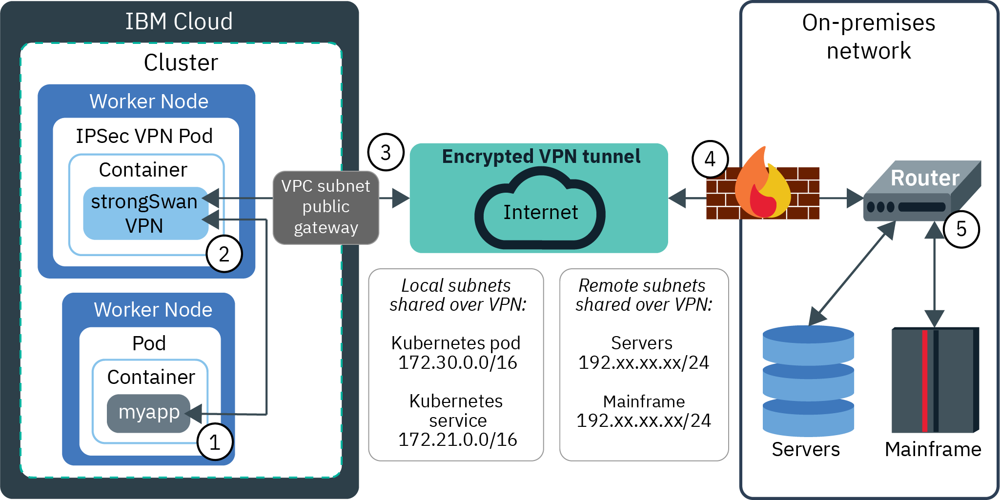

---

copyright:
  years: 2014, 2020
lastupdated: "2020-04-08"

keywords: kubernetes, iks, strongswan, ipsec, on-prem, vpnaas, direct link

subcollection: containers

---

{:codeblock: .codeblock}
{:deprecated: .deprecated}
{:download: .download}
{:external: target="_blank" .external}
{:faq: data-hd-content-type='faq'}
{:gif: data-image-type='gif'}
{:help: data-hd-content-type='help'}
{:important: .important}
{:new_window: target="_blank"}
{:note: .note}
{:pre: .pre}
{:preview: .preview}
{:screen: .screen}
{:shortdesc: .shortdesc}
{:support: data-reuse='support'}
{:table: .aria-labeledby="caption"}
{:tip: .tip}
{:troubleshoot: data-hd-content-type='troubleshoot'}
{:tsCauses: .tsCauses}
{:tsResolve: .tsResolve}
{:tsSymptoms: .tsSymptoms}


# VPC: Setting up VPN connectivity
{: #vpc-vpnaas}

 This VPN information is specific to VPC clusters. For VPN information for classic clusters, see [Setting up VPN connectivity](/docs/containers?topic=containers-vpn).
{: note}

With VPN connectivity, you can securely connect apps and services in a VPC cluster in {{site.data.keyword.containerlong}} to on-premises networks, other VPCs, and {{site.data.keyword.cloud_notm}} classic infrastructure resources. You can also connect apps that are external to your cluster to an app that runs inside your cluster.
{: shortdesc}

## Choosing a VPN solution
{: #options}

Choose a VPN connection solution based on which resources or networks you want to connect your cluster to.
{: shortdesc}

### Communication with resources in on-premises data centers
{: #onprem}

To connect your cluster with your on-premises data center, you can set up the {{site.data.keyword.vpc_short}} VPN service or a strongSwan IPSec VPN service.
{: shortdesc}

* With the {{site.data.keyword.vpc_short}} VPN, you connect an entire VPC to an on-premises data center or to another VPC. This option allows you to remain VPC-native in you VPN connection setup. To get started by creating a VPC gateway for your subnets, see [Using VPN with your VPC](/docs/vpc?topic=vpc-vpn-onprem-example). Note that if you have a multizone cluster, you must create a VPC gateway on a subnet in each zone where you have worker nodes.
* With the [strongSwan IPSec VPN service](https://www.strongswan.org/about.html){: external}, you set up a VPN load balancer directly in your cluster. To get started, [configure and deploy the strongSwan IPSec VPN service](/docs/containers?topic=containers-vpn#vpn-setup).

If you plan to connect your cluster to on-premises networks, you might have subnet conflicts with the IBM-provided default 172.30.0.0/16 range for pods and 172.21.0.0/16 range for services. You can avoid subnet conflicts when you [create a cluster in the CLI](/docs/containers?topic=containers-cli-plugin-kubernetes-service-cli#cli_cluster-create-vpc-classic) by specifying a custom subnet CIDR for pods in the `--pod-subnet` flag and a custom subnet CIDR for services in the `--service-subnet` flag.
{: tip}

### Communication with resources in other VPCs
{: #vpc-vpc}

To connect an entire VPC to another VPC in your account, you can use the {{site.data.keyword.vpc_short}} VPN.
{: shortdesc}

For example, you can connect subnets in a VPC in one region through a VPN connection to subnets in a VPC in another region. To get started by creating a VPC gateway for your subnets, see [Using VPN with your VPC](/docs/vpc?topic=vpc-vpn-onprem-example). Note that if you use [access control lists (ACLs)](/docs/containers?topic=containers-vpc-network-policy) for your VPC subnets, you must create inbound or outbound rules to allow your worker nodes to communicate with the subnets in other VPCs.

### Communication with {{site.data.keyword.cloud_notm}} classic resources
{: #vpc-classic}

If you need to connect your cluster to resources in your {{site.data.keyword.cloud_notm}} classic infrastructure, you can set up access between a VPC and one {{site.data.keyword.cloud_notm}} classic infrastructure account.
{: shortdesc}

Before you connect a VPC to a classic infrastructure account, note the following limitations and requirements:
* You must enable the VPC for classic access when you create the VPC. You cannot convert an existing VPC to use classic access.
* You can set up classic infrastructure access for only one VPC per region. You cannot set up more than one VPC with classic infrastructure access in a region.
* [Virtual Routing and Forwarding (VRF)](/docs/resources?topic=direct-link-overview-of-virtual-routing-and-forwarding-vrf-on-ibm-cloud) is required in your {{site.data.keyword.cloud_notm}} account.

To get started, see [Setting up access to your Classic Infrastructure from VPC](/docs/vpc-on-classic-network?topic=vpc-on-classic-setting-up-access-to-your-classic-infrastructure-from-vpc).

When you create a VPC with classic infrastructure access, you can set up an [{{site.data.keyword.cloud_notm}} Direct Link](/docs/direct-link?topic=direct-link-get-started-with-ibm-cloud-direct-link) connection between your classic infrastructure and your remote networks. Any clusters that you create in the VPC with classic infrastructure access can access the Direct Link connection.
{: tip}

<br />


## Using the strongSwan IPSec VPN service Helm chart
{: #vpc-vpn-setup}

Use a Helm chart to configure and deploy the strongSwan IPSec VPN service inside of a Kubernetes pod.
{:shortdesc}

When VPN connectivity is established, routes are automatically configured on all of the worker nodes in the cluster. These routes allow two-way connectivity through the VPN tunnel between pods on any worker node and the remote system. The inbound and outbound VPN traffic flows through the public gateway on the VPC subnet where the strongSwan pod is deployed to a worker node.

For example, the following diagram shows how an app in {{site.data.keyword.containerlong_notm}} can communicate with an on-premises server via a strongSwan VPN connection:



1. An app in your cluster, `myapp`, receives a request from an Ingress or LoadBalancer service and needs to securely connect to data in your on-premises network.

2. The request to the on-premises data center is forwarded to the IPSec strongSwan VPN pod. The destination IP address is used to determine which network packets to send to the IPSec strongSwan VPN pod.

3. The request is encrypted and sent through the VPC subnet's public gateway and over the VPN tunnel to the on-premises data center.

4. The incoming request passes through the on-premises firewall and is delivered to the VPN tunnel endpoint (router) where it is decrypted.

5. The VPN tunnel endpoint (router) forwards the request to the on-premises server or mainframe, depending on the destination IP address that was specified in step 2. The necessary data is sent back over the VPN connection to `myapp` through the same process.

<br />


### strongSwan VPN service considerations
{: #vpc-strongswan_limitations}

Before using the strongSwan Helm chart, review the following considerations and limitations.
{: shortdesc}

* The strongSwan Helm chart requires NAT traversal to be enabled by the remote VPN endpoint. NAT traversal requires UDP port 4500 in addition to the default IPSec UDP port of 500. Both UDP ports need to be allowed through any firewall that is configured.
* The strongSwan Helm chart does not support route-based IPSec VPNs.
* The strongSwan Helm chart supports IPSec VPNs that use preshared keys, but does not support IPSec VPNs that require certificates.
* The strongSwan Helm chart does not allow multiple clusters and other IaaS resources to share a single VPN connection.
* The strongSwan Helm chart runs as a Kubernetes pod inside of the cluster. The VPN performance is affected by the memory and network usage of Kubernetes and other pods that are running in the cluster. If you have a performance-critical environment, consider using a VPN solution that runs outside of the cluster on dedicated hardware.
* The strongSwan Helm chart runs a single VPN pod as the IPSec tunnel endpoint. If the pod fails, the cluster restarts the pod. However, you might experience a short down time while the new pod starts and the VPN connection is re-established. If you require faster error recovery or a more elaborate high availability solution, consider using a VPN solution that runs outside of the cluster on dedicated hardware.
* The strongSwan Helm chart does not provide metrics or monitoring of the network traffic flowing over the VPN connection. For a list of supported monitoring tools, see [Logging and monitoring services](/docs/containers?topic=containers-supported_integrations#health_services).
* **Limitations specific to VPC clusters**:
  * Only outbound VPN connections from the cluster can be established.
  * Because VPC clusters do not support UDP load balancers, the following `config.yaml` options are not supported:
    * `enableServiceSourceIP`
    * `loadBalancerIP`
    * `zoneLoadBalancer`
    * `connectUsingLoadBalancerIP`
  * In multizone clusters, you cannot use the strongSwan VPN to connect to Cisco or other hardware that requires the local and remote IDs to be set to the specific public IP of the tunnel.

<br />


### Using the strongSwan VPN in a multizone cluster
{: #vpc-vpn_multizone}

Multizone clusters provide high availability for apps in the event of an outage by making app instances available on worker nodes in multiple zones. You can deploy a single outbound VPN connection that floats between different worker nodes across all availability zones in your cluster. If a worker node is removed or experiences downtime, `kubelet` reschedules the VPN pod onto a new worker node. If an availability zone experiences an outage, `kubelet` reschedules the VPN pod onto a new worker node in a different zone.
{: shortdesc}

Only one strongSwan Helm chart deployment is required. When you [configure the Helm chart](#vpc-vpn_configure), ensure that you specify the following settings:
- `local.id`: Specify a fixed value that is supported by your remote VPN endpoint. Some remote VPN endpoints have settings such as `leftid` or `rightid` in the `ipsec.conf` file. If you have these settings, check whether you must set the `leftid` to the IP address of the VPN IPSec tunnel. If the remote VPN endpoint requires you to set the `local.id` option (`leftid` value in `ipsec.conf`) to the public IP address of the VPN IPSec tunnel, set `local.id` to `%loadBalancerIP`. This value automatically configures the `leftid` value in `ipsec.conf` to the load balancer IP address that is used for the connection.
- Optional: Hide all of the cluster IP addresses behind a single IP address in each zone by setting `enableSingleSourceIP` to `true`. This option provides one of the most secure configurations for the VPN connection because no connections from the remote network back into the cluster are permitted. You must also set `local.subnet` to the `%zoneSubnet` variable, and use the `local.zoneSubnet` to specify an IP address as a /32 subnet for each zone of the cluster.

Because the `zoneLoadBalancer` and `connectUsingLoadBalancerIP`, you cannot use the strongSwan VPN in multizone clusters to connect to Cisco or other hardware that requires the local and remote IDs to be set to the specific public IP of the tunnel.
{: note}

## Configuring the strongSwan Helm chart
{: #vpc-vpn_configure}

Before you install the strongSwan Helm chart, you must decide on your strongSwan configuration.
{: shortdesc}

Before you begin:
* Review the [considerations and limitations](#vpc-strongswan_limitations).
* Install an IPSec VPN gateway in your on-premises data center.
* Ensure you have the [**Writer** or **Manager** {{site.data.keyword.cloud_notm}} IAM service role](/docs/containers?topic=containers-users#platform) for the `default` namespace.
* [Log in to your account. If applicable, target the appropriate resource group. Set the context for your cluster.](/docs/containers?topic=containers-cs_cli_install#cs_cli_configure)

### Step 1: Enable a public gateway on the subnet
{: #vpc_ss_1}

In VPC cluster, only outbound VPN connections are permitted. The cluster initiates the VPN connection, and the on-premises VPN endpoint from the remote network listens for the connection. To allow worker nodes to access the on-premises VPN endpoint, you must enable a public gateway on the VPC subnet that the worker nodes are deployed to. The outbound VPN request is routed through the public gateway in order to reach the internet. The public IP address of the public gateway is used for the cluster VPN endpoint.

1. From the [VPC **Subnets** dashboard](https://cloud.ibm.com/kubernetes/clusters){: external}, click the subnet that your worker nodes are attached to.
2. Under **Public Gateway**, select **Attached**.

### Step 2: Get the strongSwan Helm chart
{: #vpc_ss_2}

Install Helm and get the strongSwan Helm chart to view possible configurations.
{: shortdesc}

1.  [Follow the instructions](/docs/containers?topic=containers-helm#install_v3) to install the version 3 Helm client on your local machine.

3. Save the default configuration settings for the strongSwan Helm chart in a local YAML file.

    ```
    helm show values iks-charts/strongswan > config.yaml
    ```
    {: pre}

4. Open the `config.yaml` file.

### Step 3: Configure basic IPSec settings
{: #vpc_ss_3}

To control the establishment of the VPN connection, modify the following basic IPSec settings.
{: shortdesc}

For more information about each setting, read the documentation provided within the `config.yaml` file for the Helm chart.
{: tip}

1. If your on-premises VPN tunnel endpoint does not support `ikev2` as a protocol for initializing the connection, change the value of `ipsec.keyexchange` to `ikev1`.
2. Set `ipsec.esp` to a list of ESP encryption and authentication algorithms that your on-premises VPN tunnel endpoint uses for the connection.
    * If `ipsec.keyexchange` is set to `ikev1`, this setting must be specified.
    * If `ipsec.keyexchange` is set to `ikev2`, this setting is optional.
    * If you leave this setting blank, the default strongSwan algorithms `aes128-sha1,3des-sha1` are used for the connection.
3. Set `ipsec.ike` to a list of IKE/ISAKMP SA encryption and authentication algorithms that your on-premises VPN tunnel endpoint uses for the connection. The algorithms must be specific in the format `encryption-integrity[-prf]-dhgroup`.
    * If `ipsec.keyexchange` is set to `ikev1`, this setting must be specified.
    * If `ipsec.keyexchange` is set to `ikev2`, this setting is optional.
    * If you leave this setting blank, the default strongSwan algorithms `aes128-sha1-modp2048,3des-sha1-modp1536` are used for the connection.
4. Change the value of `local.id` to any string that you want to use to identify the local Kubernetes cluster side that your VPN tunnel endpoint uses. The default is `ibm-cloud`. Some VPN implementations require that you use the public IP address for the local endpoint.
5. Change the value of `remote.id` to any string that you want to use to identify the remote on-premises side that your VPN tunnel endpoint uses. The default is `on-prem`. Some VPN implementations require that you use the public IP address for the remote endpoint.
6. Change the value of `preshared.secret` to the pre-shared secret that your on-premises VPN tunnel endpoint gateway uses for the connection. This value is stored in `ipsec.secrets`.
7. Change `ipsec.auto` to `start`. In VPC cluster, only outbound VPN connections are permitted. The cluster initiates the VPN connection, and the on-premises VPN endpoint from the remote network listens for the connection. The outbound VPN request is routed through the public gateway in order to reach the internet. The public IP address of the public gateway is used for the cluster VPN endpoint.
8. Set `remote.gateway` to the public IP address for the on-premises VPN endpoint in the remote network.
9. Optional: Set `remote.privateIPtoPing` to any private IP address in the remote subnet to ping as part of the Helm connectivity validation test.

Do not specify an IP address for `loadBalancerIP`. Leave this setting blank. By default, the public IP address of the public gateway is used for the cluster VPN endpoint.
{: note}

### Step 4: Access cluster resources over the VPN connection
{: #vpc_ss_4}

Determine which cluster resources must be accessible by the remote network over the VPN connection.
{: shortdesc}

1. Add the CIDRs of one or more cluster subnets to the `local.subnet` setting. You must configure the local subnet CIDRs on the on-premises VPN endpoint. This list can include the following subnets:
    * The Kubernetes pod subnet CIDR: `172.30.0.0/16`. Bidirectional communication is enabled between all cluster pods and any of the hosts in the remote network subnets that you list in the `remote.subnet` setting. If you must prevent any `remote.subnet` hosts from accessing cluster pods for security reasons, do not add the Kubernetes pod subnet to the `local.subnet` setting.
    * The Kubernetes service subnet CIDR: `172.21.0.0/16`. Service IP addresses provide a way to expose multiple app pods that are deployed on several worker nodes behind a single IP.
    * The subnets that your worker nodes are attached to. To find these values, run `ibmcloud ks worker ls -c <cluster_name_or_ID>` and note one worker node ID per each zone. For each zone, use the worker node ID to run `ibmcloud ks worker get -c <cluster_name_or_ID> -w <worker_node_ID>`. In the output, note the CIDR of the subnet that the worker is attached to.

2. Optional: Remap cluster subnets by using the `localSubnetNAT` setting. Network Address Translation (NAT) for subnets provides a workaround for subnet conflicts between the cluster network and on-premises remote network. You can use NAT to remap the cluster's private local IP subnets, the pod subnet (172.30.0.0/16), or the pod service subnet (172.21.0.0/16) to a different private subnet. The VPN tunnel sees remapped IP subnets instead of the original subnets. Remapping happens before the packets are sent over the VPN tunnel as well as after the packets arrive from the VPN tunnel. You can expose both remapped and non-remapped subnets at the same time over the VPN. To enable NAT, you can either add an entire subnet or individual IP addresses.
    * If you add an entire subnet in the format `10.171.42.0/24=10.10.10.0/24`, remapping is 1-to-1: all of the IP addresses in the internal network subnet are mapped over to external network subnet and vice versa.
    * If you add individual IP addresses in the format `10.171.42.17/32=10.10.10.2/32,10.171.42.29/32=10.10.10.3/32`, only those internal IP addresses are mapped to the specified external IP addresses.

3. Optional for version 2.2.0 and later strongSwan Helm charts: Hide all of the cluster IP addresses behind a single IP address by setting `enableSingleSourceIP` to `true`. This option provides one of the most secure configurations for the VPN connection because no connections from the remote network back into the cluster are permitted.
    <br>
    * This setting requires that all data flow over the VPN connection must be outbound regardless of whether the VPN connection is established from the cluster or from the remote network.
    * If you install strongSwan into a single-zone cluster, you must set `local.subnet` to only one IP address as a /32 subnet. If you install strongSwan in a multizone cluster, you can set `local.subnet` to the `%zoneSubnet` variable, and use the `local.zoneSubnet` to specify an IP address as a /32 subnet for each zone of the cluster.

4. Optional for version 2.2.0 and later strongSwan Helm charts: Enable the strongSwan service to route incoming requests from the remote network to a service that exists outside of the cluster by using the `localNonClusterSubnet` setting.
    <br>
    * The non-cluster service must exist on the same private network or on a private network that is reachable by the worker nodes.
    * The non-cluster worker node cannot initiate traffic to the remote network through the VPN connection, but the non-cluster node can be the target of incoming requests from the remote network.
    * You must list the CIDRs of the non-cluster subnets in the `local.subnet` setting.

### Step 5: Access remote network resources over the VPN connection
{: #vpc_ss_5}

Determine which remote network resources must be accessible by the cluster over the VPN connection.
{: shortdesc}

1. Add the CIDRs of one or more on-premises private subnets to the `remote.subnet` setting. **Note**: If `ipsec.keyexchange` is set to `ikev1`, you can specify only one subnet.
2. Optional for version 2.2.0 and later strongSwan Helm charts: Remap remote network subnets by using the `remoteSubnetNAT` setting. Network Address Translation (NAT) for subnets provides a workaround for subnet conflicts between the cluster network and on-premises remote network. You can use NAT to remap the remote network's IP subnets to a different private subnet. Remapping happens before the packets are sent over the VPN tunnel. Pods in the cluster see the remapped IP subnets instead of the original subnets. Before the pods send data back through the VPN tunnel, the remapped IP subnet is switched back to the actual subnet that is being used by the remote network. You can expose both remapped and non-remapped subnets at the same time over the VPN.

### Step 6 (optional): Enable monitoring with the Slack webhook integration
{: #vpc_ss_6}

To monitor the status of the strongSwan VPN, you can set up a webhook to automatically post VPN connectivity messages to a Slack channel.
{: shortdesc}

1. Sign in to your Slack workspace.

2. Go to the [Incoming WebHooks app page](https://slack.com/apps/A0F7XDUAZ-incoming-webhooks){: external}.

3. Click **Request to Install**. If this app is not listed in your Slack setup, contact your Slack workspace owner.

4. After your request to install is approved, click **Add Configuration**.

5. Choose a Slack channel or create a new channel to send the VPN messages to.

6. Copy the webhook URL that is generated. The URL format looks similar to the following:
  ```
  https://hooks.slack.com/services/A1AA11A1A/AAA1AAA1A/a1aaaaAAAaAaAAAaaaaaAaAA
  ```
  {: screen}

7. To verify that the Slack webhook is installed, send a test message to your webhook URL by running the following command:
    ```
    curl -X POST -H 'Content-type: application/json' -d '{"text":"VPN test message"}' <webhook_URL>
    ```
    {: pre}

8. Go to the Slack channel you chose to verify that the test message is successful.

9. In the `config.yaml` file for the Helm chart, configure the webhook to monitor your VPN connection.
    1. Change `monitoring.enable` to `true`.
    2. Add private IP addresses or HTTP endpoints in the remote subnet that you want ensure are reachable over the VPN connection to `monitoring.privateIPs` or `monitoring.httpEndpoints`. For example, you might add the IP from the `remote.privateIPtoPing` setting to `monitoring.privateIPs`.
    3. Add the webhook URL to `monitoring.slackWebhook`.
    4. Change other optional `monitoring` settings as needed.

### Step 7: Deploy the Helm chart
{: #vpc_ss_7}

Deploy the strongSwan Helm chart in your cluster with the configurations that you chose earlier.
{: shortdesc}

1. If you need to configure more advanced settings, follow the documentation provided for each setting in the Helm chart.

3. Save the updated `config.yaml` file.

4. Install the Helm chart to your cluster with the updated `config.yaml` file.

    If you have multiple VPN deployments in a single cluster, you can avoid naming conflicts and differentiate between your deployments by choosing more descriptive release names than `vpn`. To avoid the truncation of the release name, limit the release name to 35 characters or less.
    {: tip}

    ```
    helm install vpn iks-charts/strongswan -f config.yaml
    ```
    {: pre}

5. Check the chart deployment status. When the chart is ready, the **STATUS** field near the top of the output has a value of `DEPLOYED`.

    ```
    helm status vpn
    ```
    {: pre}

6. Once the chart is deployed, verify that the updated settings in the `config.yaml` file were used.

    ```
    helm get values vpn
    ```
    {: pre}

    <br />


## Testing and verifying strongSwan VPN connectivity
{: #vpc-vpn_test}

After you deploy your Helm chart, test the VPN connectivity.
{:shortdesc}

1. If the VPN on the on-premises gateway is not active, start the VPN.

2. Set the `STRONGSWAN_POD` environment variable.

    ```
    export STRONGSWAN_POD=$(kubectl get pod -l app=strongswan,release=vpn -o jsonpath='{ .items[0].metadata.name }')
    ```
    {: pre}

3. Check the status of the VPN. A status of `ESTABLISHED` means that the VPN connection was successful.

    ```
    kubectl exec $STRONGSWAN_POD -- ipsec status
    ```
    {: pre}

    Example output:

    ```
    Security Associations (1 up, 0 connecting):
    k8s-conn[1]: ESTABLISHED 17 minutes ago, 172.30.xxx.xxx[ibm-cloud]...192.xxx.xxx.xxx[on-premises]
    k8s-conn{2}: INSTALLED, TUNNEL, reqid 12, ESP in UDP SPIs: c78cb6b1_i c5d0d1c3_o
    k8s-conn{2}: 172.21.0.0/16 172.30.0.0/16 === 10.91.152.xxx/26
    ```
    {: screen}

    * When you try to establish VPN connectivity with the strongSwan Helm chart, it is likely that the VPN status is not `ESTABLISHED` the first time. You might need to check the on-premises VPN endpoint settings and change the configuration file several times before the connection is successful:
        1. Run `helm uninstall <helm_chart_name> -n <namespace>`
        2. Fix the incorrect values in the configuration file.
        3. Run `helm install vpn iks-charts/strongswan -f config.yaml`
      You can also run more checks in the next step.

    * If the VPN pod is in an `ERROR` state or continues to crash and restart, it might be due to parameter validation of the `ipsec.conf` settings in the chart's configmap.
        1. Check for any validation errors in the strongSwan pod logs by running `kubectl logs $STRONGSWAN_POD`.
        2. If validation errors exist, run `helm uninstall <release_name> -n <namespace>`
        3. Fix the incorrect values in the configuration file.
        4. Run `helm install vpn iks-charts/strongswan -f config.yaml`

4. You can further test the VPN connectivity by running the five Helm tests that are included in the strongSwan chart definition.

    ```
    helm test vpn
    ```
    {: pre}

    * If all of the tests pass, your strongSwan VPN connection is successfully set up.
    * If any of the tests fail, continue to the next step.

5. View the output of a failed test by looking at the logs of the test pod.

    ```
    kubectl logs <test_program>
    ```
    {: pre}

    Some of the tests have requirements that are optional settings in the VPN configuration. If some of the tests fail, the failures might be acceptable depending on whether you specified these optional settings. Refer to the following table for information about each test and why it might fail.
    {: note}

    {: #vpc-vpn_tests_table}
    <table>
    <caption>Understanding the Helm VPN connectivity tests</caption>
    <thead>
    <th colspan=2> Understanding the Helm VPN connectivity tests</th>
    </thead>
    <tbody>
    <tr>
    <td><code>vpn-strongswan-check-config</code></td>
    <td>Validates the syntax of the <code>ipsec.conf</code> file that is generated from the <code>config.yaml</code> file. This test might fail due to incorrect values in the <code>config.yaml</code> file.</td>
    </tr>
    <tr>
    <td><code>vpn-strongswan-check-state</code></td>
    <td>Checks that the VPN connection has a status of <code>ESTABLISHED</code>. This test might fail for the following reasons:<ul><li>Differences between the values in the <code>config.yaml</code> file and the on-premises VPN endpoint settings.</li><li>If the cluster is in "listen" mode (<code>ipsec.auto</code> is set to <code>add</code>), the connection is not established on the on-premises side.</li></ul></td>
    </tr>
    <tr>
    <td><code>vpn-strongswan-ping-remote-gw</code></td>
    <td>Pings the <code>remote.gateway</code> public IP address that you configured in the <code>config.yaml</code> file. If the VPN connection has the <code>ESTABLISHED</code> status, you can ignore the result of this test. If the VPN connection does not have the <code>ESTABLISHED</code> status, this test might fail for the following reasons:<ul><li>You did not specify an on-premises VPN gateway IP address. If <code>ipsec.auto</code> is set to <code>start</code>, the <code>remote.gateway</code> IP address is required.</li><li>ICMP (ping) packets are being blocked by a firewall.</li></ul></td>
    </tr>
    <tr>
    <td><code>vpn-strongswan-ping-remote-ip-1</code></td>
    <td>Pings the <code>remote.privateIPtoPing</code> private IP address of the on-premises VPN gateway from the VPN pod in the cluster. This test might fail for the following reasons:<ul><li>You did not specify a <code>remote.privateIPtoPing</code> IP address. If you intentionally did not specify an IP address, this failure is acceptable.</li><li>You did not specify the cluster pod subnet CIDR, <code>172.30.0.0/16</code>, in the <code>local.subnet</code> list.</li></ul></td>
    </tr>
    <tr>
    <td><code>vpn-strongswan-ping-remote-ip-2</code></td>
    <td>Pings the <code>remote.privateIPtoPing</code> private IP address of the on-premises VPN gateway from the worker node in the cluster. This test might fail for the following reasons:<ul><li>You did not specify a <code>remote.privateIPtoPing</code> IP address. If you intentionally did not specify an IP address, this failure is acceptable.</li><li>You did not specify the cluster worker node private subnet CIDR in the <code>local.subnet</code> list.</li></ul></td>
    </tr>
    </tbody></table>

6. Delete the current Helm chart.

    ```
    helm uninstall vpn -n <namespace>
    ```
    {: pre}

7. Open the `config.yaml` file and fix the incorrect values.

8. Save the updated `config.yaml` file.

9. Install the Helm chart to your cluster with the updated `config.yaml` file. The updated properties are stored in a configmap for your chart.

    ```
    helm install vpn iks-charts/strongswan -f config.yaml
    ```
    {: pre}

10. Check the chart deployment status. When the chart is ready, the **STATUS** field near the top of the output has a value of `DEPLOYED`.

    ```
    helm status vpn
    ```
    {: pre}

11. Once the chart is deployed, verify that the updated settings in the `config.yaml` file were used.

    ```
    helm get values vpn
    ```
    {: pre}

12. Clean up the current test pods.

    ```
    kubectl get pods -a -l app=strongswan-test
    ```
    {: pre}

    ```
    kubectl delete pods -l app=strongswan-test
    ```
    {: pre}

13. Run the tests again.

    ```
    helm test vpn
    ```
    {: pre}

<br />


## Limiting strongSwan VPN traffic by namespace or worker node
{: #vpc-limit}

If you have a single-tenant cluster, or if you have a multi-tenant cluster in which cluster resources are shared among the tenants, you can [limit VPN traffic for each strongSwan deployment to pods in certain namespaces](#vpc-limit_namespace). If you have a multi-tenant cluster in which cluster resources are dedicated to tenants, you can [limit VPN traffic for each strongSwan deployment to the worker nodes dedicated to each tenant](#vpc-limit_worker).
{: shortdesc}

### Limiting strongSwan VPN traffic by namespace
{: #vpc-limit_namespace}

When you have a single-tenant or multi-tenant cluster, you can limit VPN traffic to pods in only certain namespaces.
{: shortdesc}

For example, say that you want pods in only a specific namespace, `my-secure-namespace`, to send and receive data over the VPN. You do not want pods in other namespaces, such as `kube-system`, `ibm-system`, or `default`, to access your on-premises network. To limit the VPN traffic to only `my-secure-namespace`, you can create Calico global network policies.

Before you use this solution, review the following considerations and limitations.
* You do not need to deploy the strongSwan Helm chart into the specified namespace. The strongSwan VPN pod and the routes daemon set can be deployed into `kube-system` or any other namespace. If the strongSwan VPN is not deployed into the specified namespace, then the `vpn-strongswan-ping-remote-ip-1` Helm test fails. This failure is expected and acceptable. The test pings the `remote.privateIPtoPing` private IP address of the on-premises VPN gateway from a pod which is not in the namespace that has direct access to the remote subnet. However, the VPN pod is still able to forward traffic to pods in the namespaces that do have routes to the remote subnet, and traffic can still flow correctly. The VPN state is still `ESTABLISHED` and pods in the specified namespace can connect over the VPN.

* The Calico global network policies in the following steps do not prevent Kubernetes pods that use host networking from sending and receiving data over the VPN. When a pod is configured with host networking, the app running in the pod can listen on the network interfaces of the worker node that it is on. These host networking pods can exist in any namespace. To determine which pods have host networking, run `kubectl get pods --all-namespaces -o wide` and look for any pods that do not have a `172.30.0.0/16` pod IP address. If you want to prevent host networking pods from sending and receiving data over the VPN, you can set the following options in your `values.yaml` deployment file: `local.subnet: 172.30.0.0/16` and `enablePodSNAT: false`. These configuration settings expose all of the Kubernetes pods over the VPN connection to the remote network. However, only the pods that are located in the specified secure namespace are reachable over the VPN.

Before you begin:
* [Deploy the strongSwan Helm chart](#vpc-vpn_configure) and [ensure that VPN connectivity is working correctly](#vpc-vpn_test).
* [Install and configure the Calico CLI](/docs/containers?topic=containers-network_policies#cli_install).

To limit VPN traffic to a certain namespace:

1. Create a Calico global network policy named `allow-non-vpn-outbound.yaml`. This policy allows all namespaces to continue to send outbound traffic to all destinations, except to the remote subnet that the strongSwan VPN accesses. Replace `<remote.subnet>` with the `remote.subnet` that you specified in the Helm `values.yaml` configuration file. To specify multiple remote subnets, see the [Calico documentation](https://docs.projectcalico.org/v3.3/reference/calicoctl/resources/globalnetworkpolicy){: external}.
    ```yaml
    apiVersion: projectcalico.org/v3
    kind: GlobalNetworkPolicy
    metadata:
      name: allow-non-vpn-outbound
    spec:
      selector: has(projectcalico.org/namespace)
      egress:
      - action: Allow
        destination:
          notNets:
          - <remote.subnet>
      order: 900
      types:
      - Egress
    ```
    {: codeblock}

2. Apply the policy.

    ```
    calicoctl apply -f allow-non-vpn-outbound.yaml --config=filepath/calicoctl.cfg
    ```
    {: pre}

3. Create another Calico global network policy named `allow-vpn-from-namespace.yaml`. This policy allows only a specified namespace to send outbound traffic to the remote subnet that the strongSwan VPN accesses. Replace `<namespace>` with the namespace that can access the VPN and `<remote.subnet>` with the `remote.subnet` that you specified in the Helm `values.yaml` configuration file. To specify multiple namespaces or remote subnets, see the [Calico documentation](https://docs.projectcalico.org/v3.3/reference/calicoctl/resources/globalnetworkpolicy){: external}.
    ```yaml
    apiVersion: projectcalico.org/v3
    kind: GlobalNetworkPolicy
    metadata:
      name: allow-vpn-from-namespace
    spec:
      selector: projectcalico.org/namespace == "<namespace>"
      egress:
      - action: Allow
        destination:
          nets:
          - <remote.subnet>
      order: 900
      types:
      - Egress
    ```
    {: codeblock}

4. Apply the policy.

    ```
    calicoctl apply -f allow-vpn-from-namespace.yaml --config=filepath/calicoctl.cfg
    ```
    {: pre}

5. Verify that the global network policies are created in your cluster.
    ```
    calicoctl get GlobalNetworkPolicy -o wide --config=filepath/calicoctl.cfg
    ```
    {: pre}

### Limiting strongSwan VPN traffic by worker node
{: #vpc-limit_worker}

When you have multiple strongSwan VPN deployments in a multi-tenant cluster, you can limit VPN traffic for each deployment to specific worker nodes that are dedicated to each tenant.
{: shortdesc}

When you deploy a strongSwan Helm chart, a strongSwan VPN deployment is created. The strongSwan VPN pods are deployed to any untainted worker nodes. Additionally, a Kubernetes daemon set is created. This daemon set automatically configures routes on all untainted worker nodes in the cluster to each of the remote subnets. The strongSwan VPN pod uses the routes on worker nodes to forward requests to the remote subnet in the on-premises network.

Routes are not configured on tainted nodes unless you specify the taint in the `tolerations` setting in the `value.yaml` file. By tainting worker nodes, you can prevent any VPN routes from being configured on those workers. Then, you can specify the taint in the `tolerations` setting for only the VPN deployment that you do want to permit on the tainted workers. In this way, the strongSwan VPN pods for one tenant's Helm chart deployment only use the routes on that tenant's worker nodes to forward traffic over the VPN connection to the remote subnet.

Before you use this solution, review the following considerations and limitations.
* By default, Kubernetes places app pods onto any untainted worker nodes that are available. To make sure that this solution works correctly, each tenant must first ensure that they deploy their app pods only to workers that are tainted for the correct tenant. Additionally, each tainted worker node must also have a toleration to allow the app pods to be placed on the node. For more information about taints and tolerations, see the [Kubernetes documentation](https://kubernetes.io/docs/concepts/configuration/taint-and-toleration/){: external}.
* Cluster resources might not be optimally utilized because neither tenant can place app pods on the shared non-tainted nodes.

The following steps for limiting strongSwan VPN traffic by worker node use this example scenario: Say that you have a multi-tenant {{site.data.keyword.containerlong_notm}} cluster with six worker nodes. The cluster supports tenant A and tenant B. You taint the worker nodes in the following ways:
* Two worker nodes are tainted so that only tenant A pods are scheduled on the workers.
* Two worker nodes are tainted so that only tenant B pods are scheduled on the workers.
* Two worker nodes are not tainted because at least 2 worker nodes are required for the strongSwan VPN pods and the load balancer IP to run on.

To limit VPN traffic to tainted nodes for each tenant:

1. To limit the VPN traffic to only workers dedicated to tenant A in this example, you specify the following `toleration` in the `values.yaml` file for the tenant A strongSwan Helm chart:
    ```yaml
    tolerations:
     - key: dedicated
       operator: "Equal"
       value: "tenantA"
       effect: "NoSchedule"
    ```
    {: codeblock}
    This toleration allows the route daemon set to run on the two worker nodes that have the `dedicated="tenantA"` taint and on the two untainted worker nodes. The strongSwan VPN pods for this deployment run on the two untainted worker nodes.

2. To limit the VPN traffic to only workers dedicated to tenant B in this example, you specify the following `toleration` in the `values.yaml` file for the tenant B strongSwan Helm chart:
    ```yaml
    tolerations:
     - key: dedicated
       operator: "Equal"
       value: "tenantB"
       effect: "NoSchedule"
    ```
    {: codeblock}
    This toleration allows the route daemon set to run on the two worker nodes that have the `dedicated="tenantB"` taint and on the two untainted worker nodes. The strongSwan VPN pods for this deployment also run on the two untainted worker nodes.

<br />


## Upgrading or disabling the strongSwan Helm chart
{: #vpc-vpn_upgrade}

Make sure your strongSwan Helm chart is up-to-date by upgrading it.
{:shortdesc}

To upgrade your strongSwan Helm chart to the latest version:

  ```
  helm upgrade -f config.yaml <release_name> ibm/strongswan
  ```
  {: pre}

You can disable the VPN connection by deleting the Helm chart.
{:shortdesc}

  ```
  helm uninstall <release_name> -n <namespace>
  ```
  {: pre}

