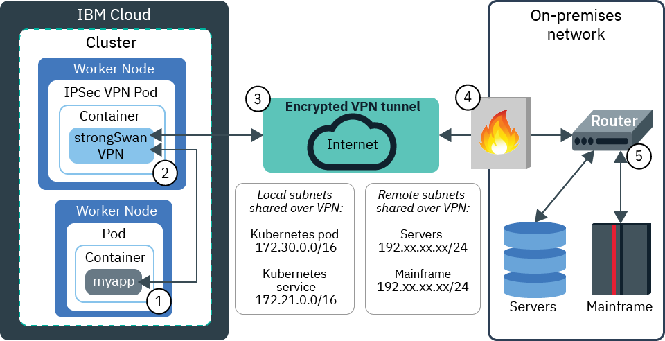
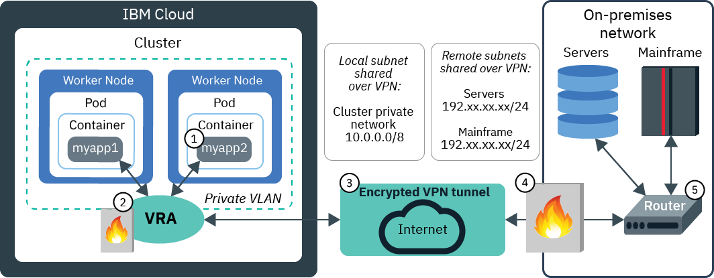

---

copyright: 
  years: 2014, 2024
lastupdated: "2024-09-17"


keywords: kubernetes, vyatta, strongswan, ipsec, on-prem

subcollection: containers


---

{{site.data.keyword.attribute-definition-list}}


# Setting up classic VPN connectivity
{: #vpn}

This VPN information is specific to classic clusters. For VPN information for VPC clusters, see [Setting up VPC VPN connectivity](/docs/containers?topic=containers-vpc-vpnaas).
{: note}

With VPN connectivity, you can securely connect apps in a Kubernetes cluster on {{site.data.keyword.containerlong}} to an on-premises network. You can also connect apps that are external to your cluster to an app that runs inside your cluster.
{: shortdesc}

To connect your worker nodes and apps to an on-premises data center, you can configure one of the following options.

- **strongSwan IPSec VPN Service**: You can set up a [strongSwan IPSec VPN service](https://www.strongswan.org/about.html){: external} that securely connects your Kubernetes cluster with an on-premises network. The strongSwan IPSec VPN service provides a secure end-to-end communication channel over the internet that is based on the industry-standard Internet Protocol Security (IPSec) protocol suite. To set up a secure connection between your cluster and an on-premises network, [configure and deploy the strongSwan IPSec VPN service](#vpn-setup) directly in a pod in your cluster.

- **{{site.data.keyword.BluDirectLink}}**: [{{site.data.keyword.dl_full_notm}}](/docs/dl?topic=dl-dl-about) allows you to create a direct, private connection between your remote network environments and {{site.data.keyword.containerlong_notm}} without routing over the public internet. The {{site.data.keyword.dl_full_notm}} offerings are useful when you must implement hybrid workloads, cross-provider workloads, large or frequent data transfers, or private workloads. To choose an {{site.data.keyword.dl_full_notm}} offering and set up an {{site.data.keyword.dl_full_notm}} connection, see [Get Started with IBM Cloud {{site.data.keyword.dl_full_notm}}](/docs/dl?topic=dl-get-started-with-ibm-cloud-dl) in the {{site.data.keyword.dl_full_notm}} documentation.

- **Virtual Router Appliance (VRA)**: You might choose to set up a [VRA (Vyatta)](/docs/virtual-router-appliance?topic=virtual-router-appliance-about-the-vra) to configure an IPSec VPN endpoint. This option is useful when you have a larger cluster, want to access multiple clusters over a single VPN, or need a route-based VPN. To configure a VRA, see [Setting up VPN connectivity with VRA](#vyatta).

If you plan to connect your cluster to on-premises networks, check out the following helpful features.

- You might have subnet conflicts with the IBM-provided default 172.30.0.0/16 range for pods and 172.21.0.0/16 range for services. You can avoid subnet conflicts when you [create a cluster from the CLI](/docs/containers?topic=containers-kubernetes-service-cli#cs_cluster_create) by specifying a custom subnet CIDR for pods in the `--pod-subnet` option and a custom subnet CIDR for services in the `--service-subnet` option.

- If your VPN solution preserves the source IP addresses of requests, you can [create custom static routes](/docs/containers?topic=containers-static-routes) to ensure that your worker nodes can route responses from your cluster back to your on-premises network.</p>

The `172.16.0.0/16`, `172.18.0.0/16`, `172.19.0.0/16`, and `172.20.0.0/16` subnet ranges are prohibited because they are reserved for {{site.data.keyword.containerlong_notm}} control plane functionality.
{: note}

## Using the strongSwan IPSec VPN service Helm chart
{: #vpn-setup}

Use a Helm chart to configure and deploy the strongSwan IPSec VPN service inside of a Kubernetes pod.
{: shortdesc}

Because strongSwan is integrated within your cluster, you don't need an external gateway appliance. When VPN connectivity is established, routes are automatically configured on all the worker nodes in the cluster. These routes allow two-way connectivity through the VPN tunnel between pods on any worker node and the remote system. For example, the following diagram shows how an app in {{site.data.keyword.containerlong_notm}} can communicate with an on-premises server via a strongSwan VPN connection.

{: caption="Figure 1. Flow of traffic through the strongSwan VPN service" caption-side="bottom"}

1. An app in your cluster, `myapp`, receives a request from an Ingress or LoadBalancer service and needs to securely connect to data in your on-premises network.

2. The request to the on-premises data center is forwarded to the IPSec strongSwan VPN pod. The destination IP address is used to determine which network packets to send to the IPSec strongSwan VPN pod.

3. The request is encrypted and sent over the VPN tunnel to the on-premises data center.

4. The incoming request passes through the on-premises firewall and is delivered to the VPN tunnel endpoint (router) where it is decrypted.

5. The VPN tunnel endpoint (router) forwards the request to the on-premises server or mainframe, depending on the destination IP address that was specified in step 2. The necessary data is sent back over the VPN connection to `myapp` through the same process.

## strongSwan VPN service considerations
{: #strongswan_limitations}

Before using the strongSwan Helm chart, review the following considerations and limitations.
{: shortdesc}

- The strongSwan Helm chart is supported only for classic clusters, and is not supported for VPC clusters. For VPN information for VPC clusters, see [Setting up VPC VPN connectivity](/docs/containers?topic=containers-vpc-vpnaas).
- The strongSwan Helm chart requires NAT traversal to be enabled by the remote VPN endpoint. NAT traversal requires UDP port 4500 in addition to the default IPSec UDP port of 500. Both UDP ports need to be allowed through any firewall that is configured.
- The strongSwan Helm chart does not support route-based IPSec VPNs.
- The strongSwan Helm chart supports IPSec VPNs that use pre-shared keys, but does not support IPSec VPNs that require certificates.
- The strongSwan Helm chart does not allow multiple clusters and other IaaS resources to share a single VPN connection.
- The strongSwan Helm chart runs as a Kubernetes pod inside of the cluster. The VPN performance is affected by the memory and network usage of Kubernetes and other pods that are running in the cluster. If you have a performance-critical environment, consider using a VPN solution that runs outside of the cluster on dedicated hardware.
- The strongSwan Helm chart runs a single VPN pod as the IPSec tunnel endpoint. If the pod fails, the cluster restarts the pod. However, you might experience a short down time while the new pod starts and the VPN connection is re-established. If you require faster error recovery or a more elaborate high availability solution, consider using a VPN solution that runs outside of the cluster on dedicated hardware.
- The strongSwan Helm chart does not provide metrics or monitoring of the network traffic flowing over the VPN connection. For a list of supported monitoring tools, see [Logging and monitoring services](/docs/containers?topic=containers-health).
- Only strongSwan Helm chart versions that were released in the last 6 months are supported. Ensure that you consistently [upgrade your strongSwan Helm chart](#vpn_upgrade) for the latest features and security fixes.

Your cluster users can use the strongSwan VPN service to connect to your Kubernetes master through the private cloud service endpoint. However, communication with the Kubernetes master over the private cloud service endpoint must go through the `166.X.X.X` IP address range, which is not routable from a VPN connection. You can expose the private cloud service endpoint of the master for your cluster users by [using a private network load balancer (NLB)](/docs/containers?topic=containers-access_cluster#access_private_se). The private NLB exposes the private cloud service endpoint of the master as an internal `172.21.x.x` cluster IP address that the strongSwan VPN pod can access. If you enable only the private cloud service endpoint, you can use the Kubernetes dashboard or temporarily enable the public cloud service endpoint to create the private NLB.
{: tip}


## Configuring the strongSwan VPN in a multizone cluster
{: #vpn_multizone}

Multizone clusters provide high availability for apps in the event of an outage by making app instances available on worker nodes in multiple zones. However, configuring the strongSwan VPN service in a multizone cluster is more complex than configuring strongSwan in a single-zone cluster.
{: shortdesc}

Before you configure strongSwan in a multizone cluster, first try to deploy a strongSwan Helm chart into a single-zone cluster. When you first establish a VPN connection between a single-zone cluster and an on-premises network, you can more easily determine remote network firewall settings that are important for a multizone strongSwan configuration.

- Some remote VPN endpoints have settings such as `leftid` or `rightid` in the `ipsec.conf` file. If you have these settings, check whether you must set the `leftid` to the IP address of the VPN IPSec tunnel.
- If the connection is inbound to the cluster from the remote network, check whether the remote VPN endpoint can re-establish the VPN connection to a different IP address in case of load balancer failure in one zone.

To get started with strongSwan in a multizone cluster, choose one of the following options.

- If you can use an outbound VPN connection, you can choose to configure only one strongSwan VPN deployment. See [Configuring one outbound VPN connection from a multizone cluster](#multizone_one_outbound).
- If you require an inbound VPN connection, the configuration settings you can use vary depending on whether the remote VPN endpoint can be configured to re-establish the VPN connection to a different public load balancer IP when an outage is detected.
    - If the remote VPN endpoint can automatically re-establish the VPN connection to a different IP, you can choose to configure only one strongSwan VPN deployment. See [Configuring one inbound VPN connection to a multizone cluster](#multizone_one_inbound).
    - If the remote VPN endpoint can't automatically re-establish the VPN connection to a different IP, you must deploy a separate inbound strongSwan VPN service in each zone. See [Configuring a VPN connection in each zone of a multizone cluster](#multizone_multiple).

Try to set up your environment so that you need only one strongSwan VPN deployment for an outbound or inbound VPN connection to your multizone cluster. If you must set up separate strongSwan VPNs in each zone, make sure that you plan how to manage this added complexity and increased resource usage.
{: note}

### Configuring a single outbound VPN connection from a multizone cluster
{: #multizone_one_outbound}

The simplest solution for configuring the strongSwan VPN service in a multizone cluster is to use a single outbound VPN connection that floats between different worker nodes across all availability zones in your cluster.
{: shortdesc}

When the VPN connection is outbound from the multizone cluster, only one strongSwan deployment is required. If a worker node is removed or experiences downtime, `kubelet` reschedules the VPN pod onto a new worker node. If an availability zone experiences an outage, `kubelet` reschedules the VPN pod onto a new worker node in a different zone.

1. [Configure one strongSwan VPN Helm chart](/docs/containers?topic=containers-vpn#vpn_configure). When you follow the steps in that section, ensure that you specify the following settings.
    - `ipsec.auto`: Change to `start`. Connections are outbound from the cluster.
    - `loadBalancerIP`: Do not specify an IP address. Leave this setting blank.
    - `zoneLoadBalancer`: Specify a public load balancer IP address for each zone where you have worker nodes. [You can check to see your available public IP addresses](/docs/containers?topic=containers-subnets#review_ip) or [free up a used IP address](/docs/containers?topic=containers-subnets#free). Because the strongSwan VPN pod can be scheduled to a worker node in any zone, this list of IPs ensures that a load balancer IP can be used in any zone where the VPN pod is scheduled.
    - `connectUsingLoadBalancerIP`: Set to `true`. When the strongSwan VPN pod is scheduled onto a worker node, the strongSwan service selects the load balancer IP address that is in the same zone and uses this IP to establish the outbound connection.
    - `local.id`: Specify a fixed value that is supported by your remote VPN endpoint. If the remote VPN endpoint requires you to set the `local.id` option (`leftid` value in `ipsec.conf`) to the public IP address of the VPN IPSec tunnel, set `local.id` to `%loadBalancerIP`. This value automatically configures the `leftid` value in `ipsec.conf` to the load balancer IP address that is used for the connection.
    - Optional: Hide all the cluster IP addresses behind a single IP address in each zone by setting `enableSingleSourceIP` to `true`. This option provides one of the most secure configurations for the VPN connection because no connections from the remote network back into the cluster are permitted. You must also set `local.subnet` to the `%zoneSubnet` variable, and use the `local.zoneSubnet` to specify an IP address as a /32 subnet for each zone of the cluster.

2. In your remote network firewall, allow incoming IPSec VPN connections from the public IP addresses you listed in the `zoneLoadBalancer` setting.

3. Configure the remote VPN endpoint to allow an incoming VPN connection from each of the possible load balancer IPs that you listed in the `zoneLoadBalancer` setting.

### Configuring a single inbound VPN connection to a multizone cluster
{: #multizone_one_inbound}

When you require incoming VPN connections and the remote VPN endpoint can automatically re-establish the VPN connection to a different IP when a failure is detected, you can use a single inbound VPN connection that floats between different worker nodes across all availability zones in your cluster.
{: shortdesc}

The remote VPN endpoint can establish the VPN connection to any of the strongSwan load balancers in any of the zones. The incoming request is sent to the VPN pod regardless of which zone the VPN pod is in. Responses from the VPN pod are sent back through the original load balancer to the remote VPN endpoint. This option ensures high availability because `kubelet` reschedules the VPN pod onto a new worker node if a worker node is removed or experiences downtime. Additionally, if an availability zone experiences an outage, the remote VPN endpoint can re-establish the VPN connection to the load balancer IP address in a different zone so that the VPN pod can still be reached.

1. [Configure one strongSwan VPN Helm chart](/docs/containers?topic=containers-vpn#vpn_configure). When you follow the steps in that section, ensure that you specify the following settings.
    - `ipsec.auto`: Change to `add`. Connections are inbound to the cluster.
    - `loadBalancerIP`: Do not specify an IP address. Leave this setting blank.
    - `zoneLoadBalancer`: Specify a public load balancer IP address for each zone where you have worker nodes. [You can check to see your available public IP addresses](/docs/containers?topic=containers-subnets#review_ip) or [free up a used IP address](/docs/containers?topic=containers-subnets#free).
    - `local.id`: If the remote VPN endpoint requires you to set the `local.id` option (`leftid` value in `ipsec.conf`) to the public IP address of the VPN IPSec tunnel, set `local.id` to `%loadBalancerIP`. This value automatically configures the `leftid` value in `ipsec.conf` to the load balancer IP address that is used for the connection.

2. In your remote network firewall, allow outgoing IPSec VPN connections to the public IP addresses you listed in the `zoneLoadBalancer` setting.

### Configuring an inbound VPN connection in each zone of a multizone cluster
{: #multizone_multiple}

When you require incoming VPN connections and the remote VPN endpoint can't re-establish the VPN connection to a different IP, you must deploy a separate strongSwan VPN service in each zone.
{: shortdesc}

The remote VPN endpoint must be updated to establish a separate VPN connection to a load balancer in each of the zones. Additionally, you must configure zone-specific settings on the remote VPN endpoint so that each of these VPN connections is unique. Ensure that these multiple incoming VPN connections remain active.

After you deploy each Helm chart, each strongSwan VPN deployment starts up as a Kubernetes load balancer service in the correct zone. Incoming requests to that public IP are forwarded to the VPN pod that is also allocated in the same zone. If the zone experiences an outage, the VPN connections that are established in the other zones are unaffected.

1. [Configure a strongSwan VPN Helm chart](/docs/containers?topic=containers-vpn#vpn_configure) for each zone. When you follow the steps in that section, ensure that you specify the following settings:
    - `loadBalancerIP`: Specify an available public load balancer IP address that is in the zone where you deploy this strongSwan service. [You can check to see your available public IP addresses](/docs/containers?topic=containers-subnets#review_ip) or [free up a used IP address](/docs/containers?topic=containers-subnets#free).
    - `zoneSelector`: Specify the zone where you want the VPN pod to be scheduled.
    - Additional settings, such as `zoneSpecificRoutes`, `remoteSubnetNAT`, `localSubnetNAT`, or `enableSingleSourceIP`, might be required depending on which resources must be accessible over the VPN. See the next step for more details.

2. Configure zone-specific settings on both sides of the VPN tunnel to ensure that each VPN connection is unique. Depending on which resources must be accessible over the VPN, you have two options for making the connections distinguishable:
    * If pods in the cluster must access services on the remote on-premises network,
        - `zoneSpecificRoutes`: Set to `true`. This setting restricts the VPN connection to a single zone in the cluster. Pods in a specific zone use only the VPN connection that is set up for that specific zone. This solution reduces the number of strongSwan pods that are required to support multiple VPNs in a multizone cluster, improves VPN performance because the VPN traffic only flows to worker nodes located in the current zone, and ensures that VPN connectivity for each zone is unaffected by VPN connectivity, crashed pods, or zone outages in other zones. Note that you don't need to configure `remoteSubnetNAT`. Multiple VPNs that use the `zoneSpecificRoutes` setting can have the same `remote.subnet` because the routing is setup on a per-zone basis.
        - `enableSingleSourceIP`: Set to `true` and set the `local.subnet` to a single /32 IP address. This combination of settings hides all the cluster private IP addresses behind a single /32 IP address. This unique /32 IP address allows the remote on-premises network to send replies back over the correct VPN connection to the correct pod in the cluster that initiated the request. Note that the single /32 IP address that is configured for the `local.subnet` option must be unique in each strongSwan VPN configuration.
    * If applications in the remote on-premises network must access services in the cluster,
        - `localSubnetNAT`: Ensure that an application in the on-premises remote network can select a specific VPN connection to send and receive traffic to the cluster. In each strongSwan Helm configuration, use `localSubnetNAT` to uniquely identify the cluster resources that can be accessed by the remote on-premises application. Because multiple VPNs are established from the remote on-premises network to the cluster, you must add logic to the application on the on-premises network so that it can select which VPN to use when it accesses services in the cluster. Note that the services in the cluster are accessible through multiple different subnets depending on what you configured for `localSubnetNAT` in each strongSwan VPN configuration.
        - `remoteSubnetNAT`: Ensure that a pod in your cluster uses the same VPN connection to return traffic to the remote network. In each strongSwan deployment file, map the remote on-premises subnet to a unique subnet using the `remoteSubnetNAT` setting. Traffic that is received by a pod in the cluster from a VPN-specific `remoteSubnetNAT` is sent back to that same VPN-specific `remoteSubnetNAT` and then over that same VPN connection.
    * If pods in the cluster must access services on the remote on-premises network and applications in the remote on-premises network must access services in the cluster, configure the `localSubnetNAT` and `remoteSubnetNAT` settings listed in the second bullet point. Note that if a pod in the cluster initiates a request to the remote on-premises network, you must add logic to the pod so that it can select which VPN connection to use to access the services on the remote on-premises network.

3. Configure the remote VPN endpoint software to establish a separate VPN connection to the load balancer IP in each zone.


## Configuring the strongSwan Helm chart
{: #vpn_configure}

Before you install the strongSwan Helm chart, you must decide on your strongSwan configuration.
{: shortdesc}

Before you begin
- Install an IPSec VPN gateway in your on-premises data center.
- Ensure you have the [**Writer** or **Manager** {{site.data.keyword.cloud_notm}} IAM service access role](/docs/containers?topic=containers-iam-platform-access-roles) for the `default` namespace.
- [Log in to your account. If applicable, target the appropriate resource group. Set the context for your cluster.](/docs/containers?topic=containers-access_cluster)
    All strongSwan configurations are permitted in standard clusters.
    {: note}

### Step 1: Get the strongSwan Helm chart
{: #strongswan_1}

Install Helm and get the strongSwan Helm chart to view possible configurations.
{: shortdesc}

1. [Follow the instructions](/docs/containers?topic=containers-helm#install_v3) to install the version 3 Helm client on your local machine.

2. Save the default configuration settings for the strongSwan Helm chart in a local YAML file.

    ```sh
    helm show values iks-charts/strongswan > config.yaml
    ```
    {: pre}

3. Open the `config.yaml` file.

### Step 2: Configure basic IPSec settings
{: #strongswan_2}

To control the establishment of the VPN connection, modify the following basic IPSec settings.
{: shortdesc}

For more information about each setting, read the documentation provided within the `config.yaml` file for the Helm chart.
{: tip}

1. If your on-premises VPN tunnel endpoint does not support `ikev2` as a protocol for initializing the connection, change the value of `ipsec.keyexchange` to `ikev1`.
2. Set `ipsec.esp` to a list of ESP encryption and authentication algorithms that your on-premises VPN tunnel endpoint uses for the connection.
    - If `ipsec.keyexchange` is set to `ikev1`, this setting must be specified.
    - If `ipsec.keyexchange` is set to `ikev2`, this setting is optional.
    - If you leave this setting blank, the default strongSwan algorithms `aes128-sha1,3des-sha1` are used for the connection.
3. Set `ipsec.ike` to a list of IKE/ISAKMP SA encryption and authentication algorithms that your on-premises VPN tunnel endpoint uses for the connection. The algorithms must be specific in the format `encryption-integrity[-prf]-dhgroup`.
    - If `ipsec.keyexchange` is set to `ikev1`, this setting must be specified.
    - If `ipsec.keyexchange` is set to `ikev2`, this setting is optional.
    - If you leave this setting blank, the default strongSwan algorithms `aes128-sha1-modp2048,3des-sha1-modp1536` are used for the connection.
4. Change the value of `local.id` to any string that you want to use to identify the local Kubernetes cluster side that your VPN tunnel endpoint uses. The default is `ibm-cloud`. Some VPN implementations require that you use the public IP address for the local endpoint.
5. Change the value of `remote.id` to any string that you want to use to identify the remote on-premises side that your VPN tunnel endpoint uses. The default is `on-prem`. Some VPN implementations require that you use the public IP address for the remote endpoint.
6. Change the value of `preshared.secret` to the pre-shared secret that your on-premises VPN tunnel endpoint gateway uses for the connection. This value is stored in `ipsec.secrets`.
7. Optional: Set `remote.privateIPtoPing` to any private IP address in the remote subnet to ping as part of the Helm connectivity validation test.

### Step 3: Select inbound or outbound VPN connection
{: #strongswan_3}

When you configure a strongSwan VPN connection, you choose whether the VPN connection is inbound to the cluster or outbound from the cluster.
{: shortdesc}

Inbound
: The on-premises VPN endpoint from the remote network initiates the VPN connection, and the cluster listens for the connection.

Outbound
: The cluster initiates the VPN connection, and the on-premises VPN endpoint from the remote network listens for the connection.

To establish an inbound VPN connection, modify the following settings.

1. Verify that `ipsec.auto` is set to `add`.
2. Optional: Set `loadBalancerIP` to a portable public IP address for the strongSwan VPN service. Specifying an IP address is useful when you need a stable IP address, such as when you must designate which IP addresses are permitted through an on-premises firewall. The cluster must have at least one available public load balancer IP address. [You can check to see your available public IP addresses](/docs/containers?topic=containers-subnets#review_ip) or [free up a used IP address](/docs/containers?topic=containers-subnets#free).
    - If you leave this setting blank, one of the available portable public IP addresses is used.
    - You must also configure the public IP address that you select for or the public IP address that is assigned to the cluster VPN endpoint on the on-premises VPN endpoint.

To establish an outbound VPN connection, modify the following settings.

1. Change `ipsec.auto` to `start`.
2. Set `remote.gateway` to the public IP address for the on-premises VPN endpoint in the remote network.
3. Choose one of the following options for the IP address for the cluster VPN endpoint:
    - **Public IP address of the cluster's private gateway**: If your worker nodes are connected to a private VLAN only, then the outbound VPN request is routed through the private gateway to reach the internet. The public IP address of the private gateway is used for the VPN connection.
    - **Public IP address of the worker node where the strongSwan pod runs**: If the worker node where the strongSwan pod runs is connected to a public VLAN, then the worker node's public IP address is used for the VPN connection.
        
        - If the strongSwan pod is deleted and rescheduled onto a different worker node in the cluster, then the public IP address of the VPN changes. The on-premises VPN endpoint of the remote network must allow the VPN connection to be established from the public IP address of any of the cluster worker nodes.
        - If the remote VPN endpoint can't handle VPN connections from multiple public IP addresses, limit the nodes that the strongSwan VPN pod deploys to. Set `nodeSelector` to the IP addresses of specific worker nodes or a worker node label. For example, the value `kubernetes.io/hostname: 10.232.xx.xx` allows the VPN pod to deploy to that worker node only. The value `strongswan: vpn` restricts the VPN pod to running on any worker nodes with that label. You can use any worker node label. To allow different worker nodes to be used with different helm chart deployments, use `strongswan: <release_name>`. For high availability, select at least two worker nodes.
    - **Public IP address of the strongSwan service**: To establish connection by using the IP address of the strongSwan VPN service, set `connectUsingLoadBalancerIP` to `true`. The strongSwan service IP address is either a portable public IP address you can specify in the `loadBalancerIP` setting, or an available portable public IP address that is automatically assigned to the service.
        
        - If you choose to select an IP address using the `loadBalancerIP` setting, the cluster must have at least one available public load balancer IP address. [You can check to see your available public IP addresses](/docs/containers?topic=containers-subnets#review_ip) or [free up a used IP address](/docs/containers?topic=containers-subnets#free).
        - all the cluster worker nodes must be on the same public VLAN. Otherwise, you must use the `nodeSelector` setting to ensure that the VPN pod deploys to a worker node on the same public VLAN as the `loadBalancerIP`.
        - If `connectUsingLoadBalancerIP` is set to `true` and `ipsec.keyexchange` is set to `ikev1`, you must set `enableServiceSourceIP` to `true`.

### Step 4: Access cluster resources over the VPN connection
{: #strongswan_4}

Determine which cluster resources must be accessible by the remote network over the VPN connection.
{: shortdesc}

1. Add the CIDRs of one or more cluster subnets to the `local.subnet` setting. You must configure the local subnet CIDRs on the on-premises VPN endpoint. This list can include the following subnets.
    - The Kubernetes pod subnet CIDR: `172.30.0.0/16`. Bidirectional communication is enabled between all cluster pods and any of the hosts in the remote network subnets that you list in the `remote.subnet` setting. If you must prevent any `remote.subnet` hosts from accessing cluster pods for security reasons, don't add the Kubernetes pod subnet to the `local.subnet` setting.
    - The Kubernetes service subnet CIDR: `172.21.0.0/16`. Service IP addresses provide a way to expose multiple app pods that are deployed on several worker nodes behind a single IP.
    - If your apps are exposed by a NodePort service on the private network or a private Ingress ALB, add the worker node's private subnet CIDR. Retrieve the first three octets of your worker's private IP address by running `ibmcloud ks worker <cluster_name>`. For example, if it is `10.176.48.xx` then note `10.176.48`. Next, get the worker private subnet CIDR by running the following command, replacing `<xxx.yyy.zz>` with the octet that you previously retrieved: `ibmcloud sl subnet list | grep <xxx.yyy.zzz>`. **Note**: If a worker node is added on a new private subnet, you must add the new private subnet CIDR to the `local.subnet` setting and the on-premises VPN endpoint. Then, the VPN connection must be restarted.
    - If you have apps that are exposed by LoadBalancer services on the private network, add the cluster's private user-managed subnet CIDRs. To find these values, run `ibmcloud ks cluster get --cluster <cluster_name> --show-resources`. In the **VLANs** section, look for CIDRs that have a **Public** value of `false`. **Note**: If `ipsec.keyexchange` is set to `ikev1`, you can specify only one subnet. However, you can use the `localSubnetNAT` setting to combine multiple cluster subnets into a single subnet.

2. Optional: Remap cluster subnets by using the `localSubnetNAT` setting. Network Address Translation (NAT) for subnets provides a workaround for subnet conflicts between the cluster network and on-premises remote network. You can use NAT to remap the cluster's private local IP subnets, the pod subnet (172.30.0.0/16), or the pod service subnet (172.21.0.0/16) to a different private subnet. The VPN tunnel sees remapped IP subnets instead of the original subnets. Remapping happens before the packets are sent over the VPN tunnel as well as after the packets arrive from the VPN tunnel. You can expose both remapped and non-remapped subnets at the same time over the VPN. To enable NAT, you can either add an entire subnet or individual IP addresses.
    - If you add an entire subnet in the format `10.171.42.0/24=10.10.10.0/24`, remapping is 1-to-1: all the IP addresses in the internal network subnet are mapped over to external network subnet and vice versa.
    - If you add individual IP addresses in the format `10.171.42.17/32=10.10.10.2/32,10.171.42.29/32=10.10.10.3/32`, only those internal IP addresses are mapped to the specified external IP addresses.

3. Optional for version 2.2.0 and later strongSwan Helm charts: Hide all the cluster IP addresses behind a single IP address by setting `enableSingleSourceIP` to `true`. This option provides one of the most secure configurations for the VPN connection because no connections from the remote network back into the cluster are permitted.
    
    - This setting requires that all data flow over the VPN connection must be outbound regardless of whether the VPN connection is established from the cluster or from the remote network.
    - If you install strongSwan into a single-zone cluster, you must set `local.subnet` to only one IP address as a /32 subnet. If you install strongSwan in a multizone cluster, you can set `local.subnet` to the `%zoneSubnet` variable, and use the `local.zoneSubnet` to specify an IP address as a /32 subnet for each zone of the cluster.

4. Optional for version 2.2.0 and later strongSwan Helm charts: Enable the strongSwan service to route incoming requests from the remote network to a service that exists outside of the cluster by using the `localNonClusterSubnet` setting.
    
    - The non-cluster service must exist on the same private network or on a private network that is reachable by the worker nodes.
    - The non-cluster worker node can't initiate traffic to the remote network through the VPN connection, but the non-cluster node can be the target of incoming requests from the remote network.
    - You must list the CIDRs of the non-cluster subnets in the `local.subnet` setting.

### Step 5: Access remote network resources over the VPN connection
{: #strongswan_5}

Determine which remote network resources must be accessible by the cluster over the VPN connection.
{: shortdesc}

1. Add the CIDRs of one or more on-premises private subnets to the `remote.subnet` setting. **Note**: If `ipsec.keyexchange` is set to `ikev1`, you can specify only one subnet.
2. Optional for version 2.2.0 and later strongSwan Helm charts: Remap remote network subnets by using the `remoteSubnetNAT` setting. Network Address Translation (NAT) for subnets provides a workaround for subnet conflicts between the cluster network and on-premises remote network. You can use NAT to remap the remote network's IP subnets to a different private subnet. Remapping happens before the packets are sent over the VPN tunnel. Pods in the cluster see the remapped IP subnets instead of the original subnets. Before the pods send data back through the VPN tunnel, the remapped IP subnet is switched back to the actual subnet that is being used by the remote network. You can expose both remapped and non-remapped subnets at the same time over the VPN.

### Step 6 (optional): Enable monitoring with the Slack webhook integration
{: #strongswan_6}

To monitor the status of the strongSwan VPN, you can set up a webhook to automatically post VPN connectivity messages to a Slack channel.
{: shortdesc}

1. Sign in to your Slack workspace.

2. Go to the [Incoming WebHooks app page](https://slack.com/marketplace/A0F7XDUAZ-incoming-webhooks){: external}.

3. Click **Request to Install**. If this app is not listed in your Slack setup, contact your Slack workspace owner.

4. After your request to install is approved, click **Add Configuration**.

5. Choose a Slack channel or create a new channel to send the VPN messages to.

6. Copy the webhook URL that is generated. The URL format looks similar to the following:
    ```sh
    https://hooks.slack.com/services/A1AA11A1A/AAA1AAA1A/a1aaaaAAAaAaAAAaaaaaAaAA
    ```
    {: screen}

7. To verify that the Slack webhook is installed, send a test message to your webhook URL by running the following command:
    ```sh
    curl -X POST -H 'Content-type: application/json' -d '{"text":"VPN test message"}' <webhook_URL>
    ```
    {: pre}

8. Go to the Slack channel you chose to verify that the test message is successful.

9. In the `config.yaml` file for the Helm chart, configure the webhook to monitor your VPN connection.
    1. Change `monitoring.enable` to `true`.
    2. Add private IP addresses or HTTP endpoints in the remote subnet that you want ensure are reachable over the VPN connection to `monitoring.privateIPs` or `monitoring.httpEndpoints`. For example, you might add the IP from the `remote.privateIPtoPing` setting to `monitoring.privateIPs`.
    3. Add the webhook URL to `monitoring.slackWebhook`.
    4. Change other optional `monitoring` settings as needed.

### Step 7: Deploy the Helm chart
{: #strongswan_7}

Deploy the strongSwan Helm chart in your cluster with the configurations that you chose earlier.
{: shortdesc}

1. If you need to configure more advanced settings, follow the documentation provided for each setting in the Helm chart.

2. Save the updated `config.yaml` file.

3. Install the Helm chart to your cluster with the updated `config.yaml` file.

    If you have multiple VPN deployments in a single cluster, you can avoid naming conflicts and differentiate between your deployments by choosing more descriptive release names than `vpn`. To avoid the truncation of the release name, limit the release name to 35 characters or less.
    {: tip}

    ```sh
    helm install vpn iks-charts/strongswan -f config.yaml
    ```
    {: pre}

4. Check the chart deployment status. When the chart is ready, the **STATUS** field near in the output has a value of `DEPLOYED`.

    ```sh
    helm status vpn
    ```
    {: pre}

5. After the chart is deployed, verify that the updated settings in the `config.yaml` file were used.

    ```sh
    helm get values vpn
    ```
    {: pre}

Only strongSwan Helm chart versions that were released in the last 6 months are supported. Ensure that you consistently [upgrade your strongSwan Helm chart](#vpn_upgrade) for the latest features and security fixes.
{: important}


## Testing and verifying strongSwan VPN connectivity
{: #vpn_test}

After you deploy your Helm chart, test the VPN connectivity.
{: shortdesc}

1. If the VPN on the on-premises gateway is not active, start the VPN.

2. Set the `STRONGSWAN_POD` environment variable.

    ```sh
    export STRONGSWAN_POD=$(kubectl get pod -l app=strongswan,release=vpn -o jsonpath='{ .items[0].metadata.name }')
    ```
    {: pre}

3. Check the status of the VPN. A status of `ESTABLISHED` means that the VPN connection was successful.

    ```sh
    kubectl exec $STRONGSWAN_POD -- sudo ipsec status
    ```
    {: pre}

    Example output

    ```sh
    Security Associations (1 up, 0 connecting):
    k8s-conn[1]: ESTABLISHED 17 minutes ago, 172.30.xxx.xxx[ibm-cloud]...192.xxx.xxx.xxx[on-premises]
    k8s-conn{2}: INSTALLED, TUNNEL, reqid 12, ESP in UDP SPIs: c78cb6b1_i c5d0d1c3_o
    k8s-conn{2}: 172.21.0.0/16 172.30.0.0/16 === 10.91.152.xxx/26
    ```
    {: screen}

    - When you try to establish VPN connectivity with the strongSwan Helm chart, it is likely that the VPN status is not `ESTABLISHED` the first time. You might need to check the on-premises VPN endpoint settings and change the configuration file several times before the connection is successful.
    
        1. Run `helm uninstall <release_name> -n <namespace>`
        2. Fix the incorrect values in the configuration file.
        3. Run `helm install vpn iks-charts/strongswan -f config.yaml`
            
        You can also run more checks in the next step.

    - If the VPN pod is in an `ERROR` state or continues to crash and restart, it might be due to parameter validation of the `ipsec.conf` settings in the chart's ConfigMap.
    
        1. Check for any validation errors in the strongSwan pod logs by running `kubectl logs $STRONGSWAN_POD`.
        2. If validation errors exist, run `helm uninstall <release_name> -n <namespace>`
        3. Fix the incorrect values in the configuration file.
        4. Run `helm install vpn iks-charts/strongswan -f config.yaml`

4. You can further test the VPN connectivity by running the five Helm tests that are in the strongSwan chart definition.

    ```sh
    helm test vpn
    ```
    {: pre}

    - If all the tests pass, your strongSwan VPN connection is successfully set up.
    - If any of the tests fail, continue to the next step.

5. View the output of a failed test by looking at the logs of the test pod.

    ```sh
    kubectl logs <test_program>
    ```
    {: pre}

    Some tests have requirements that are optional settings in the VPN configuration. If some tests fail, the failures might be acceptable depending on whether you specified these optional settings. Refer to the following table for information about each test and why it might fail.
    {: note}


    `vpn-strongswan-check-config`
    :   Validates the syntax of the `ipsec.conf` file that is generated from the `config.yaml` file. This test might fail due to incorrect values in the `config.yaml` file.
    
    `vpn-strongswan-check-state`
    :   Checks that the VPN connection has a status of `ESTABLISHED`. This test might fail for the following reasons.
        - Differences between the values in the `config.yaml` file and the on-premises VPN endpoint settings.
        - If the cluster is in "listen" mode (`ipsec.auto` is set to `add`), the connection is not established on the on-premises side.
    
    `vpn-strongswan-ping-remote-gw`
    :   Pings the `remote.gateway` public IP address that you configured in the `config.yaml` file. If the VPN connection has the `ESTABLISHED` status, you can ignore the result of this test. If the VPN connection does not have the `ESTABLISHED` status, this test might fail for the following reasons. 
        - You did not specify an on-premises VPN gateway IP address. If `ipsec.auto` is set to `start`, the `remote.gateway` IP address is required.
        - ICMP (ping) packets are being blocked by a firewall.
    
    `vpn-strongswan-ping-remote-ip-1`
    :   Pings the `remote.privateIPtoPing` private IP address of the on-premises VPN gateway from the VPN pod in the cluster. This test might fail for the following reasons. \n - You did not specify a `remote.privateIPtoPing` IP address. If you intentionally did not specify an IP address, this failure is acceptable. \n - You did not specify the cluster pod subnet CIDR, `172.30.0.0/16`, in the `local.subnet` list.
    
    `vpn-strongswan-ping-remote-ip-2`
    :   Pings the `remote.privateIPtoPing` private IP address of the on-premises VPN gateway from the worker node in the cluster. This test might fail for the following reasons. \n - You did not specify a `remote.privateIPtoPing` IP address. If you intentionally did not specify an IP address, this failure is acceptable. \n - You did not specify the cluster worker node private subnet CIDR in the `local.subnet` list. |
    {: caption="Table 1. Understanding the Helm VPN connectivity tests" caption-side="bottom"}

6. Delete the current Helm chart.

    ```sh
    helm uninstall vpn -n <namespace>
    ```
    {: pre}

7. Open the `config.yaml` file and fix the incorrect values.

8. Save the updated `config.yaml` file.

9. Install the Helm chart to your cluster with the updated `config.yaml` file. The updated properties are stored in a ConfigMap for your chart.

    ```sh
    helm install vpn iks-charts/strongswan -f config.yaml
    ```
    {: pre}

10. Check the chart deployment status. When the chart is ready, the **STATUS** field in the output has a value of `DEPLOYED`.

    ```sh
    helm status vpn
    ```
    {: pre}

11. After the chart is deployed, verify that the updated settings in the `config.yaml` file were used.

    ```sh
    helm get values vpn
    ```
    {: pre}

12. Clean up the current test pods.

    ```sh
    kubectl get pods -a -l app=strongswan-test
    ```
    {: pre}

    ```sh
    kubectl delete pods -l app=strongswan-test
    ```
    {: pre}

13. Run the tests again.

    ```sh
    helm test vpn
    ```
    {: pre}


## Limiting strongSwan VPN traffic by namespace or worker node
{: #limit}

If you have a single-tenant cluster, or if you have a multi-tenant cluster in which cluster resources are shared among the tenants, you can [limit VPN traffic for each strongSwan deployment to pods in certain namespaces](#limit_namespace). If you have a multi-tenant cluster in which cluster resources are dedicated to tenants, you can [limit VPN traffic for each strongSwan deployment to the worker nodes dedicated to each tenant](#limit_worker).
{: shortdesc}

### Limiting strongSwan VPN traffic by namespace
{: #limit_namespace}

When you have a single-tenant or multi-tenant cluster, you can limit VPN traffic to pods in only certain namespaces.
{: shortdesc}

For example, say that you want pods in only a specific namespace, `my-secure-namespace`, to send and receive data over the VPN. You don't want pods in other namespaces, such as `kube-system`, `ibm-system`, or `default`, to access your on-premises network. To limit the VPN traffic to only `my-secure-namespace`, you can create Calico global network policies.

Before you use this solution, review the following considerations and limitations.

- You don't need to deploy the strongSwan Helm chart into the specified namespace. The strongSwan VPN pod and the routes daemon set can be deployed into `kube-system` or any other namespace. If the strongSwan VPN is not deployed into the specified namespace, then the `vpn-strongswan-ping-remote-ip-1` Helm test fails. This failure is expected and acceptable. The test pings the `remote.privateIPtoPing` private IP address of the on-premises VPN gateway from a pod which is not in the namespace that has direct access to the remote subnet. However, the VPN pod is still able to forward traffic to pods in the namespaces that do have routes to the remote subnet, and traffic can still flow correctly. The VPN state is still `ESTABLISHED` and pods in the specified namespace can connect over the VPN.

- The Calico global network policies in the following steps don't prevent Kubernetes pods that use host networking from sending and receiving data over the VPN. When a pod is configured with host networking, the app running in the pod can listen on the network interfaces of the worker node that it is on. These host networking pods can exist in any namespace. To determine which pods have host networking, run `kubectl get pods --all-namespaces -o wide` and look for any pods that don't have a `172.30.0.0/16` pod IP address. If you want to prevent host networking pods from sending and receiving data over the VPN, you can set the following options in your `values.yaml` deployment file: `local.subnet: 172.30.0.0/16` and `enablePodSNAT: false`. These configuration settings expose all the Kubernetes pods over the VPN connection to the remote network. However, only the pods that are located in the specified secure namespace are reachable over the VPN.

Before you begin

- [Deploy the strongSwan Helm chart](#vpn_configure) and [ensure that VPN connectivity is working correctly](#vpn_test).
- [Install and configure the Calico CLI](/docs/containers?topic=containers-network_policies#cli_install).

To limit VPN traffic to a certain namespace,

1. Create a Calico global network policy named `allow-non-vpn-outbound.yaml`. This policy allows all namespaces to continue to send outbound traffic to all destinations, except to the remote subnet that the strongSwan VPN accesses. Replace `<remote.subnet>` with the `remote.subnet` that you specified in the Helm `values.yaml` configuration file. To specify multiple remote subnets, see the [Calico documentation](https://docs.tigera.io/calico/latest/reference/resources/globalnetworkpolicy){: external}.
    ```yaml
    apiVersion: projectcalico.org/v3
    kind: GlobalNetworkPolicy
    metadata:
      name: allow-non-vpn-outbound
    spec:
      selector: has(projectcalico.org/namespace)
      egress:
      - action: Allow
        destination:
          notNets:
          - <remote.subnet>
      order: 900
      types:
      - Egress
    ```
    {: codeblock}

2. Apply the policy.

    ```sh
    calicoctl apply -f allow-non-vpn-outbound.yaml --config=filepath/calicoctl.cfg
    ```
    {: pre}

3. Create another Calico global network policy named `allow-vpn-from-namespace.yaml`. This policy allows only a specified namespace to send outbound traffic to the remote subnet that the strongSwan VPN accesses. Replace `<namespace>` with the namespace that can access the VPN and `<remote.subnet>` with the `remote.subnet` that you specified in the Helm `values.yaml` configuration file. To specify multiple namespaces or remote subnets, see the [Calico documentation](https://docs.tigera.io/calico/latest/reference/resources/globalnetworkpolicy){: external}.
    ```yaml
    apiVersion: projectcalico.org/v3
    kind: GlobalNetworkPolicy
    metadata:
      name: allow-vpn-from-namespace
    spec:
      selector: projectcalico.org/namespace == "<namespace>"
      egress:
      - action: Allow
        destination:
          nets:
          - <remote.subnet>
    order: 900
    types:
      - Egress
    ```
    {: codeblock}

4. Apply the policy.

    ```sh
    calicoctl apply -f allow-vpn-from-namespace.yaml --config=filepath/calicoctl.cfg
    ```
    {: pre}

5. Verify that the global network policies are created in your cluster.
    ```sh
    calicoctl get GlobalNetworkPolicy -o wide --config=filepath/calicoctl.cfg
    ```
    {: pre}

### Limiting strongSwan VPN traffic by worker node
{: #limit_worker}

When you have multiple strongSwan VPN deployments in a multi-tenant cluster, you can limit VPN traffic for each deployment to specific worker nodes that are dedicated to each tenant.
{: shortdesc}

When you deploy a strongSwan Helm chart, a strongSwan VPN deployment is created. The strongSwan VPN pods are deployed to any untainted worker nodes. Additionally, a Kubernetes daemon set is created. This daemon set automatically configures routes on all untainted worker nodes in the cluster to each of the remote subnets. The strongSwan VPN pod uses the routes on worker nodes to forward requests to the remote subnet in the on-premises network.

Routes are not configured on tainted nodes unless you specify the taint in the `tolerations` setting in the `value.yaml` file. By tainting worker nodes, you can prevent any VPN routes from being configured on those workers. Then, you can specify the taint in the `tolerations` setting for only the VPN deployment that you do want to permit on the tainted workers. In this way, the strongSwan VPN pods for one tenant's Helm chart deployment only use the routes on that tenant's worker nodes to forward traffic over the VPN connection to the remote subnet.

Before you use this solution, review the following considerations and limitations.

- By default, Kubernetes places app pods onto any untainted worker nodes that are available. To make sure that this solution works correctly, each tenant must first ensure that they deploy their app pods only to workers that are tainted for the correct tenant. Additionally, each tainted worker node must also have a toleration to allow the app pods to be placed on the node. For more information about taints and tolerations, see the [Kubernetes documentation](https://kubernetes.io/docs/concepts/scheduling-eviction/taint-and-toleration/){: external}.
- Cluster resources might not be optimally utilized because neither tenant can place app pods on the shared non-tainted nodes.

The following steps for limiting strongSwan VPN traffic by worker node use this example scenario: Say that you have a multi-tenant {{site.data.keyword.containerlong_notm}} cluster with six worker nodes. The cluster supports tenant A and tenant B. You taint the worker nodes in the following ways.

- Two worker nodes are tainted so that only tenant A pods are scheduled on the workers.
- Two worker nodes are tainted so that only tenant B pods are scheduled on the workers.
- Two worker nodes are not tainted because at least 2 worker nodes are required for the strongSwan VPN pods and the load balancer IP to run on.

To limit VPN traffic to tainted nodes for each tenant.

1. To limit the VPN traffic to only workers dedicated to tenant A in this example, you specify the following `toleration` in the `values.yaml` file for the tenant A strongSwan Helm chart.
    ```yaml
    tolerations:
        - key: dedicated
    operator: "Equal"
    value: "tenantA"
    effect: "NoSchedule"
    ```
    {: codeblock}

    This toleration allows the route daemon set to run on the two worker nodes that have the `dedicated="tenantA"` taint and on the two untainted worker nodes. The strongSwan VPN pods for this deployment run on the two untainted worker nodes.

2. To limit the VPN traffic to only workers dedicated to tenant B in this example, you specify the following `toleration` in the `values.yaml` file for the tenant B strongSwan Helm chart.
    ```yaml
    tolerations:
        - key: dedicated
    operator: "Equal"
    value: "tenantB"
    effect: "NoSchedule"
    ```
    {: codeblock}

    This toleration allows the route daemon set to run on the two worker nodes that have the `dedicated="tenantB"` taint and on the two untainted worker nodes. The strongSwan VPN pods for this deployment also run on the two untainted worker nodes.


## Upgrading or disabling the strongSwan Helm chart
{: #vpn_upgrade}

Ensure that you consistently upgrade your strongSwan Helm chart for the latest features and security fixes.
{: shortdesc}

Review the supported versions of the strongSwan Helm chart. Typically, a chart version becomes deprecated 6 months after its release date.
- **Supported**: 2.7.9, 2.7.8, 2.7.7, 2.7.6, 2.7.5, 2.7.4, 2.7.3, 2.7.2
- **Deprecated**: 2.7.1, 2.7.0, 2.6.9, 2.6.8, 2.6.7
- **Unsupported**: 2.6.6 and earlier

For release dates and change logs for each strongSwan Helm chart version, run `helm show readme iks-charts/strongswan` and look for the `Version History` section.

To upgrade your strongSwan Helm chart to the latest version, use the **`helm upgrade`** command.

```sh
helm upgrade -f config.yaml <release_name> iks-charts/strongswan
```
{: pre}

You can disable the VPN connection by deleting the Helm chart.

```sh
helm uninstall <release_name> -n <namespace>
```
{: pre}


## Using a Virtual Router Appliance
{: #vyatta}

The [Virtual Router Appliance (VRA)](/docs/virtual-router-appliance?topic=virtual-router-appliance-about-the-vra) provides the latest Vyatta 5600 operating system for x86 bare metal servers. You can use a VRA as VPN gateway to securely connect to an on-premises network.
{: shortdesc}

All public and private network traffic that enters or exits the cluster VLANs is routed through a VRA. You can use the VRA as a VPN endpoint to create an encrypted IPSec tunnel between servers in IBM Cloud infrastructure and on-premises resources. For example, the following diagram shows how an app on a private-only worker node in {{site.data.keyword.containerlong_notm}} can communicate with an on-premises server via a VRA VPN connection:

{: caption="Figure 2. Expose an app in {{site.data.keyword.containerlong_notm}} by using a load balancer" caption-side="bottom"}

1. An app in your cluster, `myapp2`, receives a request from an Ingress or LoadBalancer service and needs to securely connect to data in your on-premises network.

2. Because `myapp2` is on a worker node that is on a private VLAN only, the VRA acts as a secure connection between the worker nodes and the on-premises network. The VRA uses the destination IP address to determine which network packets to send to the on-premises network.

3. The request is encrypted and sent over the VPN tunnel to the on-premises data center.

4. The incoming request passes through the on-premises firewall and is delivered to the VPN tunnel endpoint (router) where it is decrypted.

5. The VPN tunnel endpoint (router) forwards the request to the on-premises server or mainframe, depending on the destination IP address that was specified in step 2. The necessary data is sent back over the VPN connection to `myapp2` through the same process.

To set up a Virtual Router Appliance,

1. [Order a VRA](/docs/virtual-router-appliance).

2. [Configure the private VLAN on the VRA](/docs/virtual-router-appliance?topic=virtual-router-appliance-managing-vlans-and-gateway-appliances).

3. To enable a VPN connection by using the VRA, [configure VRRP on the VRA](/docs/virtual-router-appliance?topic=virtual-router-appliance-working-with-high-availability-and-vrrp#high-availability-vpn-with-vrrp).

If you have an existing router appliance and then add a cluster, the new portable subnets that are ordered for the cluster are not configured on the router appliance. To use networking services, you must enable routing between the subnets on the same VLAN by [enabling VLAN spanning or VRF](/docs/containers?topic=containers-plan_basics#worker-worker).
{: important}
