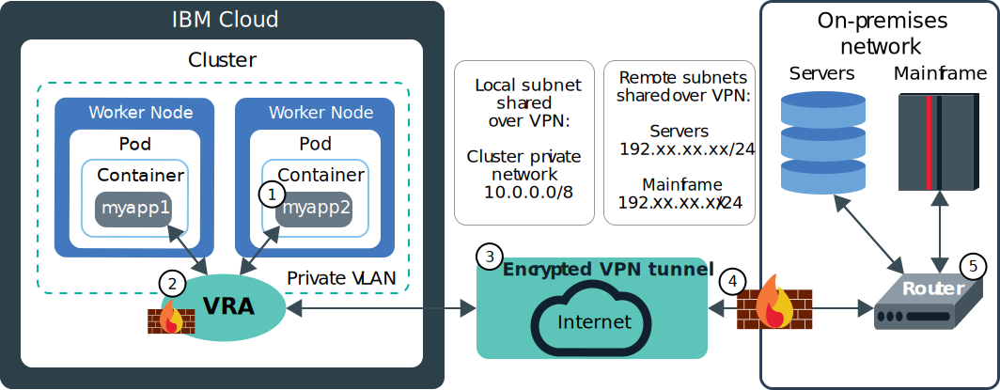

---

copyright: 
  years: 2014, 2025
lastupdated: "2025-12-19"

keywords: containers, kubernetes, vyatta, ipsec, on-prem

subcollection: containers

---

{{site.data.keyword.attribute-definition-list}}

# Setting up classic VPN connectivity
{: #vpn}

This VPN information is specific to classic clusters. For VPN information for VPC clusters, see [Setting up VPC VPN connectivity](/docs/containers?topic=containers-vpc-vpnaas).
{: note}

With VPN connectivity, you can securely connect apps in a Kubernetes cluster on {{site.data.keyword.containerlong}} to an on-premises network. You can also connect apps that are external to your cluster to an app that runs inside your cluster.
{: shortdesc}

To connect your worker nodes and apps to an on-premises data center, you can configure one of the following options.

- **{{site.data.keyword.BluDirectLink}}**: [{{site.data.keyword.dl_full_notm}}](/docs/dl?topic=dl-dl-about) allows you to create a direct, private connection between your remote network environments and {{site.data.keyword.containerlong_notm}} without routing over the public internet. The {{site.data.keyword.dl_full_notm}} offerings are useful when you must implement hybrid workloads, cross-provider workloads, large or frequent data transfers, or private workloads. To choose an {{site.data.keyword.dl_full_notm}} offering and set up an {{site.data.keyword.dl_full_notm}} connection, see [Get Started with IBM Cloud {{site.data.keyword.dl_full_notm}}](/docs/dl?topic=dl-get-started-with-ibm-cloud-dl) in the {{site.data.keyword.dl_full_notm}} documentation.

- **Virtual Router Appliance (VRA)**: You might choose to set up a [VRA (Vyatta)](/docs/virtual-router-appliance?topic=virtual-router-appliance-about-the-vra) to configure an IPSec VPN endpoint. This option is useful when you have a larger cluster, want to access multiple clusters over a single VPN, or need a route-based VPN. To configure a VRA, see [Setting up VPN connectivity with VRA](#vyatta).

If you plan to connect your cluster to on-premises networks, check out the following helpful features.

- You might have subnet conflicts with the IBM-provided default 172.30.0.0/16 range for pods and 172.21.0.0/16 range for services. You can avoid subnet conflicts when you [create a cluster from the CLI](/docs/containers?topic=containers-kubernetes-service-cli#cs_cluster_create) by specifying a custom subnet CIDR for pods in the `--pod-subnet` option and a custom subnet CIDR for services in the `--service-subnet` option.

- If your VPN solution preserves the source IP addresses of requests, you can [create custom static routes](/docs/containers?topic=containers-static-routes) to ensure that your worker nodes can route responses from your cluster back to your on-premises network.

The `172.16.0.0/16`, `172.18.0.0/16`, `172.19.0.0/16`, and `172.20.0.0/16` subnet ranges are prohibited because they are reserved for {{site.data.keyword.containerlong_notm}} control plane functionality.
{: note}

## Using a Virtual Router Appliance
{: #vyatta}

The [Virtual Router Appliance (VRA)](/docs/virtual-router-appliance?topic=virtual-router-appliance-about-the-vra) provides the latest Vyatta 5600 operating system for x86 bare metal servers. You can use a VRA as VPN gateway to securely connect to an on-premises network.
{: shortdesc}

All public and private network traffic that enters or exits the cluster VLANs is routed through a VRA. You can use the VRA as a VPN endpoint to create an encrypted IPSec tunnel between servers in IBM Cloud infrastructure and on-premises resources. For example, the following diagram shows how an app on a private-only worker node in {{site.data.keyword.containerlong_notm}} can communicate with an on-premises server via a VRA VPN connection:

{: caption="Expose an app in {{site.data.keyword.containerlong_notm}} by using a load balancer" caption-side="bottom"}

1. An app in your cluster, `myapp2`, receives a request from an Ingress or LoadBalancer service and needs to securely connect to data in your on-premises network.

2. Because `myapp2` is on a worker node that is on a private VLAN only, the VRA acts as a secure connection between the worker nodes and the on-premises network. The VRA uses the destination IP address to determine which network packets to send to the on-premises network.

3. The request is encrypted and sent over the VPN tunnel to the on-premises data center.

4. The incoming request passes through the on-premises firewall and is delivered to the VPN tunnel endpoint (router) where it is decrypted.

5. The VPN tunnel endpoint (router) forwards the request to the on-premises server or mainframe, depending on the destination IP address that was specified in step 2. The necessary data is sent back over the VPN connection to `myapp2` through the same process.

To set up a Virtual Router Appliance,

1. [Order a VRA](/docs/virtual-router-appliance).

2. [Configure the private VLAN on the VRA](/docs/virtual-router-appliance?topic=virtual-router-appliance-managing-vlans-and-gateway-appliances).

3. To enable a VPN connection by using the VRA, [configure VRRP on the VRA](/docs/virtual-router-appliance?topic=virtual-router-appliance-working-with-high-availability-and-vrrp#high-availability-vpn-with-vrrp).

If you have an existing router appliance and then add a cluster, the new portable subnets that are ordered for the cluster are not configured on the router appliance. To use networking services, you must enable routing between the subnets on the same VLAN by [enabling VLAN spanning or VRF](/docs/containers?topic=containers-plan_basics#worker-worker).
{: important}
