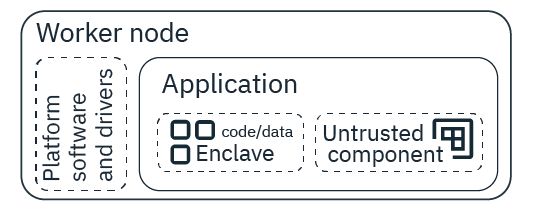

---

copyright: 
  years: 2014, 2023
lastupdated: "2023-07-18"

keywords: kubernetes, clusters, worker nodes, worker pools, delete

subcollection: containers


---

{{site.data.keyword.attribute-definition-list}}


# Adding worker nodes and zones to clusters
{: #add_workers}

To increase the availability of your apps, you can add worker nodes to an existing zone or multiple existing zones in your cluster. To help protect your apps from zone failures, you can add zones to your cluster.
{: shortdesc}

When you create a cluster, the worker nodes are provisioned in a worker pool. After cluster creation, you can add more worker nodes to a pool by resizing it or by adding more worker pools. By default, the worker pool exists in one zone. Clusters that have a worker pool in only one zone are called single zone clusters. When you add more zones to the cluster, the worker pool exists across the zones. Clusters that have a worker pool that is spread across more than one zone are called multizone clusters.

If you have a multizone cluster, keep its worker node resources balanced. Make sure that all the worker pools are spread across the same zones, and add or remove workers by resizing the pools instead of adding individual nodes. After you set up your worker pool, you can [set up the cluster autoscaler](/docs/containers?topic=containers-cluster-scaling-classic-vpc) to automatically add or remove worker nodes from your worker pools based on your workload resource requests.
{: tip}


## Adding worker nodes by resizing an existing worker pool
{: #resize_pool}

You can add or reduce the number of worker nodes in your cluster by resizing an existing worker pool, regardless of whether the worker pool is in one zone or spread across multiple zones.
{: shortdesc}

For example, consider a cluster with one worker pool that has three worker nodes per zone.
* If the cluster is single zone and exists in `dal10`, then the worker pool has three worker nodes in `dal10`. The cluster has a total of three worker nodes.
* If the cluster is multizone and exists in `dal10` and `dal12`, then the worker pool has three worker nodes in `dal10` and three worker nodes in `dal12`. The cluster has a total of six worker nodes.

For bare metal worker pools, keep in mind that billing is monthly. If you resize up or down, it impacts your costs for the month. When you add worker nodes by resizing a worker pool, the new worker nodes run the same `major.minor` version as the cluster master, but the latest worker node patch of that `major.minor` version.
{: tip}

Before you begin, make sure that you have the [**Operator** or **Administrator** {{site.data.keyword.cloud_notm}} IAM platform access role](/docs/openshift?topic=openshift-users).

To resize the worker pool, change the number of worker nodes that the worker pool deploys in each zone:

1. Get the name of the worker pool that you want to resize.
    ```sh
    ibmcloud ks worker-pool ls --cluster <cluster_name_or_ID>
    ```
    {: pre}

1. Resize the worker pool by designating the number of worker nodes that you want to deploy in each zone. The minimum value is 1. For more information, see [What is the smallest size cluster that I can make?](/docs/containers?topic=containers-faqs#smallest_cluster).
    ```sh
    ibmcloud ks worker-pool resize --cluster <cluster_name_or_ID> --worker-pool <pool_name>  --size-per-zone <number_of_workers_per_zone>
    ```
    {: pre}

1. Verify that the worker pool is resized.
    ```sh
    ibmcloud ks worker ls --cluster <cluster_name_or_ID> --worker-pool <pool_name>
    ```
    {: pre}

    Example output for a worker pool that is in two zones, `dal10` and `dal12`, and is resized to two worker nodes per zone:
    ```sh
    ID                                                 Public IP        Private IP      Machine Type      State    Status  Zone    Version
    kube-dal10-crb20b637238ea471f8d4a8b881aae4962-w7   169.xx.xxx.xxx   10.xxx.xx.xxx   b3c.4x16          normal   Ready   dal10   1.26
    kube-dal10-crb20b637238ea471f8d4a8b881aae4962-w8   169.xx.xxx.xxx   10.xxx.xx.xxx   b3c.4x16          normal   Ready   dal10   1.26
    kube-dal12-crb20b637238ea471f8d4a8b881aae4962-w9   169.xx.xxx.xxx   10.xxx.xx.xxx   b3c.4x16          normal   Ready   dal12   1.26
    kube-dal12-crb20b637238ea471f8d4a8b881aae4962-w10  169.xx.xxx.xxx   10.xxx.xx.xxx   b3c.4x16          normal   Ready   dal12   1.26
    ```
    {: screen}


## Adding worker nodes in VPC clusters
{: #vpc_pools}

Add worker nodes to your VPC cluster.
{: shortdesc}

### Creating a new worker pool
{: #vpc_add_pool}

You can add worker nodes to your VPC cluster by creating a new worker pool.
{: shortdesc}


Want to create a new worker pool on dedicated hosts? See [Setting up dedicated hosts in the CLI](/docs/containers?topic=containers-dedicated-hosts#setup-dedicated-host-cli).
{: tip}


Before you begin, make sure that you have the [**Operator** or **Administrator** {{site.data.keyword.cloud_notm}} IAM platform access role](/docs/openshift?topic=openshift-users).

1. Retrieve the **VPC ID** and **Worker Zones** of your cluster and choose the zone where you want to deploy the worker nodes in your worker pool. You can choose any of the existing **Worker Zones** of your cluster, or add one of the [multizone locations](/docs/containers?topic=containers-regions-and-zones#zones-vpc) for the region that your cluster is in. You can list available zones by running `ibmcloud ks zone ls --provider vpc-gen2`.
    ```sh
    ibmcloud ks cluster get --cluster <cluster_name_or_ID>
    ```
    {: pre}

    Example output

    ```sh
    ...
    VPC ID:        <VPC_ID>
    ...
    Worker Zones: us-south-1, us-south-2, us-south-3
    ```
    {: screen}

1. For each zone, note the ID of VPC subnet that you want to use for the worker pool. If you don't have a VPC subnet in the zone, [create a VPC subnet](/docs/vpc?topic=vpc-creating-vpc-resources-with-cli-and-api&interface=cli#create-a-subnet-cli). VPC subnets provide IP addresses for your worker nodes and load balancer services in the cluster, so [create a VPC subnet with enough IP addresses](/docs/containers?topic=containers-vpc-subnets#vpc_basics_subnets), such as 256.
    ```sh
    ibmcloud ks subnets --zone <ZONE> --provider vpc-gen2 --vpc-id <VPC_ID>
    ```
    {: pre}

1. For each zone, review the [available flavors for worker nodes](/docs/containers?topic=containers-planning_worker_nodes#vm).
    ```sh
    ibmcloud ks flavors --zone <ZONE> --provider vpc-gen2
    ```
    {: pre}

1. Optional: To encrypt the local disk of each worker node in the worker pool, get the details of your key management service (KMS) provider. If you want to use a KMS instance from a different account, you need to do these steps under the account where the KMS instance resides.
    1. Complete the steps in [VPC worker nodes](/docs/containers?topic=containers-encryption#worker-encryption-vpc) to create your KMS instance and to authorize your service in IAM. 

    1. List available KMS instances and note the **ID**.

        ```sh
        ibmcloud ks kms instance ls
        ```
        {: pre}

    1. List the available root keys for the KMS instance that you want to use and note the **ID**.

        ```sh
        ibmcloud ks kms crk ls --instance-id <KMS_instance_ID>
        ```
        {: pre}

1. Create a worker pool. Include the `--label` option to automatically label worker nodes that are in the pool with the label `key=value`. Include the `--vpc-id` option if the worker pool is the first in the cluster. Optionally include the `--kms-instance` and `--crk` options with the values you previously retrieved  and if the KMS instance resides in a different account, include the `--kms-account-id` option as well. To attach additional security groups to the workers in the worker pool, [specify the security group IDs with the `--security-group` option](/docs/containers?topic=containers-vpc-security-group#vpc-sg-worker-pool). For more options, see the [CLI documentation](/docs/containers?topic=containers-kubernetes-service-cli#cli_worker_pool_create_vpc_gen2).  Note that the new worker nodes run the same `major.minor` version as the cluster master, but the latest worker node patch of that `major.minor` version.
    If you want to create your worker pool on dedicated hosts, make sure to specify the `--dedicated-host-pool` option.
    {: note}

    ```sh
    ibmcloud ks worker-pool create vpc-gen2 --name <name> --cluster <cluster_name_or_ID> --flavor <flavor> --size-per-zone <number_of_worker_nodes_min_1> [--label <key>=<value>] [--vpc-id] [[--kms-account-id <KMS_account_ID>] --kms-instance <KMS_instance_ID> --crk <root_key_ID>] [--dedicated-host-pool <dedicated-host-pool>] [--security-group <group-id>]
    ```
    {: pre}

1. Verify that the worker pool is created.
    ```sh
    ibmcloud ks worker-pool ls --cluster <cluster_name_or_ID>
    ```
    {: pre}

1. By default, adding a worker pool creates a pool with no zones. To deploy worker nodes in a zone, you must add the zones that you previously retrieved to the worker pool. If you want to spread your worker nodes across multiple zones, repeat this command for each zone.
    ```sh
    ibmcloud ks zone add vpc-gen2 --zone <zone> --subnet-id <subnet_id> --cluster <cluster_name_or_ID> --worker-pool <worker_pool_name>
    ```
    {: pre}

1. Verify that worker nodes provision in the zone that you added. Your worker nodes are ready when the **State** changes from `provisioning` to `normal`.
    ```sh
    ibmcloud ks worker ls --cluster <cluster_name_or_ID> --worker-pool <pool_name>
    ```
    {: pre}

    Example output

    ```sh
    ID                                                     Primary IP     Flavor   State          Status                                        Zone       Version   
    kube-<ID_string>-<cluster_name>-<pool_name>-00000002   10.xxx.xx.xxx   c2.2x4   provisioning   Infrastructure instance status is 'pending'   us-south-1   -   
    kube-<ID_string>-<cluster_name>-<pool_name>-00000003   10.xxx.xx.xxx   c2.2x4   normal   Ready   us-south-1   1.26_1511   
    ```
    {: screen}


### Adding a zone to a worker pool
{: #vpc_add_zone}

You can span your VPC cluster across multiple zones within one region by adding a zone to your existing worker pool.
{: shortdesc}

When you add a zone to a worker pool, the worker nodes that are defined in your worker pool are provisioned in the new zone and considered for future workload scheduling. {{site.data.keyword.containerlong_notm}} automatically adds the `failure-domain.beta.kubernetes.io/region` label for the region and the `failure-domain.beta.kubernetes.io/zone` label for the zone to each worker node. The Kubernetes scheduler uses these labels to spread pods across zones within the same region.

If you have multiple worker pools in your cluster, add the zone to all them so that worker nodes are spread evenly across your cluster. Note that when you add worker nodes to your cluster, the new worker nodes run the same `major.minor` version as the cluster master, but the latest worker node patch of that `major.minor` version.

**Before you begin**: Make sure that you have the [**Operator** or **Administrator** {{site.data.keyword.cloud_notm}} IAM platform access role](/docs/openshift?topic=openshift-users).

1. Get the **Location** of your cluster, and note the existing **Worker Zones** and **VPC ID**.
    ```sh
    ibmcloud ks cluster get --cluster <cluster_name_or_ID>
    ```
    {: pre}

    Example output

    ```sh
    ...
    VPC ID:        <VPC_ID>
    Workers:       3
    Worker Zones:  us-south-1
    ...
    Location:      Dallas   
    ```
    {: screen}

1. List available zones for your cluster's location to see what other zones you can add.
    ```sh
    ibmcloud ks zone ls --provider vpc-gen2 | grep <location>
    ```
    {: pre}

1. List available VPC subnets for each zone that you want to add. If you don't have a VPC subnet in the zone, [create a VPC subnet](/docs/vpc?topic=vpc-creating-vpc-resources-with-cli-and-api&interface=cli#create-a-subnet-cli). VPC subnets provide IP addresses for your worker nodes and load balancer services in the cluster, so [create a VPC subnet with enough IP addresses](/docs/containers?topic=containers-vpc-subnets#vpc_basics_subnets), such as 256. You can't change the number of IP addresses that a VPC subnet has later.
    ```sh
    ibmcloud ks subnets --zone <zone> --provider vpc-gen2 --vpc-id <VPC_ID>
    ```
    {: pre}

1. List the worker pools in your cluster and note their names.
    ```sh
    ibmcloud ks worker-pool ls --cluster <cluster_name_or_ID>
    ```
    {: pre}

1. Add the zone to your worker pool. Repeat this step for each zone that you want to add to your worker pool. If you have multiple worker pools, add the zone to all your worker pools so that your cluster is balanced in all zones. Include the `--worker-pool` option for each worker pool.

    If you want to use different VPC subnets for different worker pools, repeat this command for each subnet and its corresponding worker pools. Any new worker nodes are added to the VPC subnets that you specify, but the VPC subnets for any existing worker nodes are not changed.
    {: tip}

    ```sh
    ibmcloud ks zone add vpc-gen2 --zone <zone> --subnet-id <subnet_id> --cluster <cluster_name_or_ID> --worker-pool <worker_pool_name>
    ```
    {: pre}

1. Verify that the zone is added to your cluster. Look for the added zone in the **Worker Zones** field of the output. Note that the total number of workers in the **Workers** field has increased as new worker nodes are provisioned in the added zone.
    ```sh
    ibmcloud ks cluster get --cluster <cluster_name_or_ID>
    ```
    {: pre}

    Example output

    ```sh
    Workers:       9
    Worker Zones:  us-south-1, us-south-2, us-south-3
    ```
    {: screen}


## Adding worker nodes in classic clusters
{: #classic_pools}

Add worker nodes to your classic cluster.
{: shortdesc}

Want to save on your classic worker node costs? [Create a reservation](/docs/containers?topic=containers-reservations) to lock in a discount over 1 or 3 year terms! Then, create your worker pool by using the reserved instances. Note that autoscaling can't be enable on worker pools that use reservations.
{: tip}

### Creating a new worker pool
{: #add_pool}

You can add worker nodes to your classic cluster by creating a new worker pool.
{: shortdesc}

Before you begin, make sure that you have the [**Operator** or **Administrator** {{site.data.keyword.cloud_notm}} IAM platform access role](/docs/openshift?topic=openshift-users).

1. Retrieve the **Worker Zones** of your cluster and choose the zone where you want to deploy the worker nodes in your worker pool. If you have a single zone cluster, you must use the zone that you see in the **Worker Zones** field. For multizone clusters, you can choose any of the existing **Worker Zones** of your cluster, or add one of the [multizone locations](/docs/containers?topic=containers-regions-and-zones#zones-mz) for the region that your cluster is in. You can list available zones by running `ibmcloud ks zone ls`.
    ```sh
    ibmcloud ks cluster get --cluster <cluster_name_or_ID>
    ```
    {: pre}

    Example output

    ```sh
    ...
    Worker Zones: dal10, dal12, dal13
    ```
    {: screen}

1. For each zone, list available private and public VLANs. Note the private and the public VLAN that you want to use. If you don't have a private or a public VLAN, the VLAN is automatically created for you when you add a zone to your worker pool.
    ```sh
    ibmcloud ks vlan ls --zone <zone>
    ```
    {: pre}

1. For each zone, review the [available flavors for worker nodes](/docs/containers?topic=containers-planning_worker_nodes#planning_worker_nodes).

    ```sh
    ibmcloud ks flavors --zone <zone>
    ```
    {: pre}

1. Create a worker pool. For more options, see the [CLI documentation](/docs/containers?topic=containers-kubernetes-service-cli#cs_worker_pool_create).  
    * The minimum number of worker nodes per zone is 1. For more information, see [What is the smallest size cluster that I can make?](/docs/containers?topic=containers-faqs#smallest_cluster).
    * Include the `--label` option to automatically label worker nodes that are in the pool with the label `key=value`.
    * If you provision a bare metal or dedicated VM worker pool, specify `--hardware dedicated`.
    * The new worker nodes run the same `major.minor` version as the cluster master, but the latest worker node patch of that `major.minor` version.

    ```sh
    ibmcloud ks worker-pool create classic --name <pool_name> --cluster <cluster_name_or_ID> --flavor <flavor> --size-per-zone <number_of_workers_per_zone_min_1> [--operating-system UBUNTU_20_64|UBUNTU_18_64] [--label key=value]
    ```
    {: pre}

1. Verify that the worker pool is created.
    ```sh
    ibmcloud ks worker-pool ls --cluster <cluster_name_or_ID>
    ```
    {: pre}

1. By default, adding a worker pool creates a pool with no zones. To deploy worker nodes in a zone, you must add the zones that you previously retrieved to the worker pool. If you want to spread your worker nodes across multiple zones, repeat this command for each zone.
    ```sh
    ibmcloud ks zone add classic --zone <zone> --cluster <cluster_name_or_ID> --worker-pool <pool_name> --private-vlan <private_VLAN_ID> --public-vlan <public_VLAN_ID>
    ```
    {: pre}

1. Verify that worker nodes provision in the zone that you added. Your worker nodes are ready when the status changes from `provision_pending` to `normal`.
    ```sh
    ibmcloud ks worker ls --cluster <cluster_name_or_ID> --worker-pool <pool_name>
    ```
    {: pre}

    Example output

    ```sh
    ID                                                 Public IP        Private IP      Machine Type      State    Status  Zone    Version
    kube-dal10-crb20b637238ea471f8d4a8b881aae4962-w7   169.xx.xxx.xxx   10.xxx.xx.xxx   b3c.4x16          provision_pending   Ready   dal10   1.26
    kube-dal10-crb20b637238ea471f8d4a8b881aae4962-w8   169.xx.xxx.xxx   10.xxx.xx.xxx   b3c.4x16          provision_pending   Ready   dal10   1.26
    ```
    {: screen}


### Adding a zone to a worker pool
{: #add_zone}

You can span your classic cluster across multiple zones within one region by adding a zone to your existing worker pool.
{: shortdesc}

When you add a zone to a worker pool, the worker nodes that are defined in your worker pool are provisioned in the new zone and considered for future workload scheduling. {{site.data.keyword.containerlong_notm}} automatically adds the `failure-domain.beta.kubernetes.io/region` label for the region and the `failure-domain.beta.kubernetes.io/zone` label for the zone to each worker node. The Kubernetes scheduler uses these labels to spread pods across zones within the same region.

If you have multiple worker pools in your cluster, add the zone to all them so that worker nodes are spread evenly across your cluster. Note that when you add worker nodes to your cluster, the new worker nodes run the same `major.minor` version as the cluster master, but the latest worker node patch of that `major.minor` version.

Before you begin:
*  To add a zone to your worker pool, your worker pool must be in a [multizone-capable zone](/docs/containers?topic=containers-regions-and-zones#zones-mz). If your worker pool is not in a multizone-capable zone, consider [creating a new worker pool](#add_pool).
*  Make sure that you have the [**Operator** or **Administrator** {{site.data.keyword.cloud_notm}} IAM platform access role](/docs/openshift?topic=openshift-users).
*  In classic clusters, if you have multiple VLANs for your cluster, multiple subnets on the same VLAN, or a multizone classic cluster, you must enable a [Virtual Router Function (VRF)](/docs/account?topic=account-vrf-service-endpoint#vrf) for your IBM Cloud infrastructure account so your worker nodes can communicate with each other on the private network. To enable VRF, see [Enabling VRF](/docs/account?topic=account-vrf-service-endpoint#vrf). To check whether a VRF is already enabled, use the `ibmcloud account show` command. If you can't or don't want to enable VRF, enable [VLAN spanning](/docs/vlans?topic=vlans-vlan-spanning#vlan-spanning). To perform this action, you need the **Network > Manage Network VLAN Spanning** [infrastructure permission](/docs/containers?topic=containers-access-creds#infra_access), or you can request the account owner to enable it. To check whether VLAN spanning is already enabled, use the `ibmcloud ks vlan spanning get --region <region>` [command](/docs/containers?topic=containers-kubernetes-service-cli#cs_vlan_spanning_get).

To add a zone with worker nodes to your worker pool:

1. List available zones and pick the zone that you want to add to your worker pool. The zone that you choose must be a multizone-capable zone.
    ```sh
    ibmcloud ks zone ls
    ```
    {: pre}

1. List available VLANs in that zone. If you don't have a private or a public VLAN, the VLAN is automatically created for you when you add a zone to your worker pool.
    ```sh
    ibmcloud ks vlan ls --zone <zone>
    ```
    {: pre}

1. List the worker pools in your cluster and note their names.
    ```sh
    ibmcloud ks worker-pool ls --cluster <cluster_name_or_ID>
    ```
    {: pre}

1. Add the zone to your worker pool. If you have multiple worker pools, add the zone to all your worker pools so that your cluster is balanced in all zones.

    A private and a public VLAN must exist before you can add a zone to multiple worker pools. If you don't have a private and a public VLAN in that zone, add the zone to one worker pool first so that a private and a public VLAN is created for you. Then, you can add the zone to other worker pools by specifying the private and the public VLAN that was created for you.
    {: note}

    If you want to use different VLANs for different worker pools, repeat this command for each VLAN and its corresponding worker pools. Any new worker nodes are added to the VLANs that you specify, but the VLANs for any existing worker nodes are not changed.
    {: tip}

    ```sh
    ibmcloud ks zone add classic --zone <zone> --cluster <cluster_name_or_ID> -p <pool_name> [-p <pool2_name>] --private-vlan <private_VLAN_ID> --public-vlan <public_VLAN_ID>
    ```
    {: pre}

1. Verify that the zone is added to your cluster. Look for the added zone in the **Worker zones** field of the output. Note that the total number of workers in the **Workers** field has increased as new worker nodes are provisioned in the added zone.
    ```sh
    ibmcloud ks cluster get --cluster <cluster_name_or_ID>
    ```
    {: pre}

    Example output

    ```sh
    NAME:                           mycluster
    ID:                             df253b6025d64944ab99ed63bb4567b6
    State:                          normal
    Status:                         healthy cluster
    Created:                        2018-09-28T15:43:15+0000
    Location:                       dal10
    Pod Subnet:                     172.30.0.0/16
    Service Subnet:                 172.21.0.0/16
    Master URL:                     https://c3.<region>.containers.cloud.ibm.com:30426
    Public Service Endpoint URL:    https://c3.<region>.containers.cloud.ibm.com:30426
    Private Service Endpoint URL:   https://c3-private.<region>.containers.cloud.ibm.com:31140
    Master Location:                Dallas
    Master Status:                  Ready (21 hours ago)
    Ingress Subdomain:              mycluster-<hash>-0000.us-south.containers.appdomain.cloud
    Ingress Secret:                 mycluster-<hash>-0000
    Workers:                        6
    Worker Zones:                   dal10, dal12
    Version:                        1.26_1524
    Owner:                          owner@email.com
    Resource Group ID:              a8a12accd63b437bbd6d58fb6a462ca7
    Resource Group Name:            Default
    ```
    {: screen}


## Deprecated: Adding stand-alone worker nodes
{: #standalone}

If you have a cluster that was created before worker pools were introduced, you can use the deprecated commands to add stand-alone worker nodes.
{: deprecated}

If you have a cluster that was created after worker pools were introduced, you can't add stand-alone worker nodes. Instead, you can [create a worker pool](#add_pool), [resize an existing worker pool](#resize_pool), or [add a zone to a worker pool](#add_zone) to add worker nodes to your cluster.
{: note}

1. List available zones and pick the zone where you want to add worker nodes.
    ```sh
    ibmcloud ks zone ls
    ```
    {: pre}

1. List available VLANs in that zone and note their ID.
    ```sh
    ibmcloud ks vlan ls --zone <zone>
    ```
    {: pre}

1. List available flavors in that zone.
    ```sh
    ibmcloud ks flavors --zone <zone>
    ```
    {: pre}

1. Add stand-alone worker nodes to the cluster. For bare metal flavors, specify `dedicated`.
    ```sh
    ibmcloud ks worker add --cluster <cluster_name_or_ID> --workers <number_of_worker_nodes> --public-vlan <public_VLAN_ID> --private-vlan <private_VLAN_ID> --flavor <flavor> --hardware <shared_or_dedicated>
    ```
    {: pre}

1. Verify that the worker nodes are created.
    ```sh
    ibmcloud ks worker ls --cluster <cluster_name_or_ID>
    ```
    {: pre}


## Installing SGX drivers and platform software on SGX-capable worker nodes
{: #install-sgx}

Intel Software Guard Extensions (SGX) is a technology that can protect data-in-use through hardware-based server security. With Intel SGX, you can protect select code and data from disclosure or modification. Through the use of trusted execution environments (TEE), known as enclaves, you can encrypt the pieces of your app memory that contain sensitive data while the data or code is being used. To use Intel SGX, you must install the SGX drivers and platform software on SGX-capable worker nodes. Then, design your app to run in an SGX environment.
{: shortdesc}

{: caption="Figure. Example SGX application set up" caption-side="bottom"}

When you develop a confidential computing application, you must design it in a way that you can segment the information that needs to be encrypted. At runtime, the segmented information is kept confidential through attestation. When a request for information from the segmented code or app data is received, the enclave verifies that the request comes from the part of the application that exists outside of the enclave within the same application before sharing any information. Through the attestation process, information is kept confidential and data leakage is prevented.


### Installing with a script
{: #intel-sgx-script}

Before you begin, [create a worker pool](/docs/containers?topic=containers-add_workers#add_pool) with SGX-capable worker nodes. To work with Intel SGX, you must use one of the following machine types: `mb2c.4x32` and `ms2c.4x32.1.9tb.ssd`.


1. [Log in to your account. If applicable, target the appropriate resource group. Set the context for your cluster.](/docs/containers?topic=containers-access_cluster)

1. Create a daemon set to install the drivers and platform software on your SGX-capable worker nodes.

    ```sh
    kubectl create -f https://raw.githubusercontent.com/ibm-cloud-security/data-shield-reference-apps/master/scripts/sgx-driver-psw/install_sgx/deployment_install_sgx_iks.yaml
    ```
    {: codeblock}

1. Verify that the drivers and platform software were installed by running the following command to check for a pod that begins with `sgx-installer`.

    ```sh
    kubectl get pods
    ```
    {: codeblock}

1. Get the logs for your `sgx-installer` pod to verify that you see the messages `SGX driver installed` and `PSW installed`.

    ```sh
    kubectl logs <name_of_SGX_installer_pod>
    ```

1. Now that the drivers and platform software are installed, remove the daemon set.

    ```sh
    kubectl delete daemonset sgx-installer
    ```
    {: codeblock}

Now, you can develop your confidential computing app to use the enclave for sensitive data.

To uninstall the drivers and platform software, you can follow the same steps, but with the following installation command: `kubectl create -f https://raw.githubusercontent.com/ibm-cloud-security/data-shield-reference-apps/master/scripts/sgx-driver-psw/uninstall_sgx/deployment_uninstall_sgx_iks.yaml`
{: note}


## Adding tags to existing clusters
{: #cluster_tags}


You can assign a tag to {{site.data.keyword.containerlong_notm}} clusters to help manage your {{site.data.keyword.cloud_notm}} resources. For example, you might add `key:value` tags to your cluster and other cloud resources so that your billing department track resources, such as `costctr:1234`. Tags are visible account-wide. For more information, see [Working with tags](/docs/account?topic=account-tag).
{: shortdesc}

Tags are not the same thing as Kubernetes labels. [Kubernetes labels](https://kubernetes.io/docs/concepts/overview/working-with-objects/labels/){: external} are `key:value` pairs that can be used as selectors for the resources that are in your cluster, such as [adding a label to worker pool](#worker_pool_labels) to [deploy an app to only certain worker nodes](/docs/containers?topic=containers-deploy_app#node_affinity). Tags are an {{site.data.keyword.cloud_notm}} tool that you can use to filter your {{site.data.keyword.cloud_notm}} resources, such as clusters, storage devices, or {{site.data.keyword.watson}} services.
{: note}

Do not include personal information in your tags. Learn more about [securing your personal information](/docs/containers?topic=containers-security#pi) when you work with Kubernetes resources.
{: important}

Choose among the following options:

*   [Create a cluster in the console](/docs/containers?topic=containers-clusters) with a tag. You can't create a cluster with a tag in the CLI.
*   Add tags to an existing cluster in the console or CLI.

### Adding tags to clusters with the console
{: #add-tags-console}

1. Log in to the [{{site.data.keyword.cloud_notm}} clusters console](https://cloud.ibm.com/kubernetes/clusters){: external}.
1. Select a cluster with existing tags.
1. Next to the cluster name and status, click the **Edit tags** pencil icon. If your cluster does not have any existing tags, you don't have an **Edit tags** pencil icon. Instead, use the [resource list](/docs/account?topic=account-tag) or CLI.

1. Enter the tag that you want to add to your cluster. To assign a key-value pair, use a colon such as `costctr:1234`.


### Adding tags to clusters with the CLI
{: #add-tags-cli}

1. Log in to the [{{site.data.keyword.cloud_notm}} CLI](/docs/cli?topic=cli-ibmcloud_cli#ibmcloud_login){: external}.
    ```sh
    ibmcloud login [--sso]
    ```
    {: pre}

1. [Tag your cluster](/docs/cli?topic=cli-ibmcloud_commands_resource#ibmcloud_resource_tag_attach). Replace the `--resource-name` with the name of your cluster. To list available clusters, run `ibmcloud ks cluster ls`. If you want to check your existing tags so as not to duplicate any, run `ibmcloud resource tags`.

    ```sh
    ibmcloud resource tag-attach --resource-name <cluster_name> --tag-names <tag1,tag2>
    ```
    {: pre}
    
    If you have more than one resource of the same name in your {{site.data.keyword.cloud_notm}} account, the error message lists the resource CRNs and details, and instructs you to try again with the `--resource-id`option.
    {: note}


## Adding labels to existing worker pools
{: #worker_pool_labels}

You can assign a worker pool a label when you [create the worker pool](#add_pool), or later by following these steps. After a worker pool is labeled, all existing and subsequent worker nodes get this label. You might use labels to deploy specific workloads only to worker nodes in the worker pool, such as [edge nodes for load balancer network traffic](/docs/containers?topic=containers-edge).
{: shortdesc}

Do not include personal information in your labels. Learn more about [securing your personal information](/docs/containers?topic=containers-security#pi) when you work with Kubernetes resources.
{: important}

Before you begin: [Log in to your account. If applicable, target the appropriate resource group. Set the context for your cluster.](/docs/containers?topic=containers-access_cluster)

1. List the worker pools in your cluster.
    ```sh
    ibmcloud ks worker-pool ls --cluster <cluster_name_or_ID>
    ```
    {: pre}

1. List the existing custom labels on worker nodes in the worker pool that you want to label.
    ```sh
    ibmcloud ks worker-pool get --cluster <cluster_name_or_ID> --worker-pool <pool>
    ```
    {: pre}

1. Label the worker pool with a `key=value` label. When you set a worker pool label, all the existing custom labels are replaced. To keep any existing custom labels on the worker pool, include those labels with this option.

    You can also rename an existing label by assigning the same key a new value. However, don't modify the worker pool or worker node labels that are provided by default because these labels are required for worker pools to function properly. Modify only custom labels that you previously added.
    {: important}

    ```sh
    ibmcloud ks worker-pool label set --cluster <cluster_name_or_ID> --worker-pool <worker_pool_name_or_ID> --label <key=value>
    ```
    {: pre}

    Example to set `<key>: <value>` as a new custom label in a worker pool with existing labels `team: DevOps` and `app: test`:
    ```sh
    ibmcloud ks worker-pool label set --cluster <cluster_name_or_ID> --worker-pool <worker_pool_name_or_ID> --label <key=value> --label team=DevOps --label app=test
    ```
    {: pre}

1. Verify that the worker pool and worker node have the `key=value` label that you assigned.
    *   To check worker pools:
        ```sh
        ibmcloud ks worker-pool get --cluster <cluster_name_or_ID> --worker-pool <worker_pool_name_or_ID>
        ```
        {: pre}

    *   To check worker nodes:
        1. List the worker nodes in the worker pool and note the **Private IP**.
            ```sh
            ibmcloud ks worker ls --cluster <cluster_name_or_ID> --worker-pool <worker_pool_name_or_ID>
            ```
            {: pre}

        1. Review the **Labels** field of the output.
            ```sh
            kubectl describe node <worker_node_private_IP>
            ```
            {: pre}

            Example output for an added label (`app=test`):
            ```sh
            Labels:   app=test
            arch=amd64
            ...
            ```
            {: screen}

            Example output for a removed label (the `app=test` label is gone):
            ```sh
            Labels:   arch=amd64
            ...
            ```
            {: screen}            

1. **Optional**: To remove an individual label from a worker pool, you can run the `ibmcloud ks worker-pool label set` command with only the custom labels that you want to keep. To remove all custom labels from a worker pool, you can run the `ibmcloud ks worker-pool label rm` command.

    Do not remove the worker pool and worker node labels that are provided by default because these labels are required for worker pools to function properly. Remove only custom labels that you previously added.
    {: important}

    Example to keep only the `team: DevOps` and `app: test` labels and remove all other custom labels from a worker pool:
    ```sh
    ibmcloud ks worker-pool label set --cluster <cluster_name_or_ID> --worker-pool <worker_pool_name_or_ID> --label team=DevOps --label app=test
    ```
    {: pre}

    Example to remove all custom label from a worker pool:
    ```sh
    ibmcloud ks worker-pool label rm --cluster <cluster_name_or_ID> --worker-pool <worker_pool_name_or_ID>
    ```
    {: pre}

After you label your worker pool, you can use the [label in your app deployments](/docs/containers?topic=containers-app#label) so that your workloads run on only these worker nodes, or [taints](https://kubernetes.io/docs/concepts/scheduling-eviction/taint-and-toleration/){: external} to prevent deployments from running on these worker nodes.


## Automatically resolving issues for your worker nodes
{: #planning_autorecovery}

Critical components, such as `containerd`, `kubelet`, `kube-proxy`, and `calico`, must be functional to have a healthy Kubernetes worker node. Over time these components can break and might leave your worker node in a nonfunctional state. Nonfunctional worker nodes decrease total capacity of the cluster and can result in downtime for your app.
{: shortdesc}

You can [configure health checks for your worker node and enable Autorecovery](/docs/containers?topic=containers-health-monitor#autorecovery). If Autorecovery detects an unhealthy worker node based on the configured checks, Autorecovery triggers a corrective action like an OS reload on the worker node. For more information about how Autorecovery works, see the [Autorecovery blog](https://www.ibm.com/cloud/blog/autorecovery-utilizes-consistent-hashing-high-availability){: external}.


