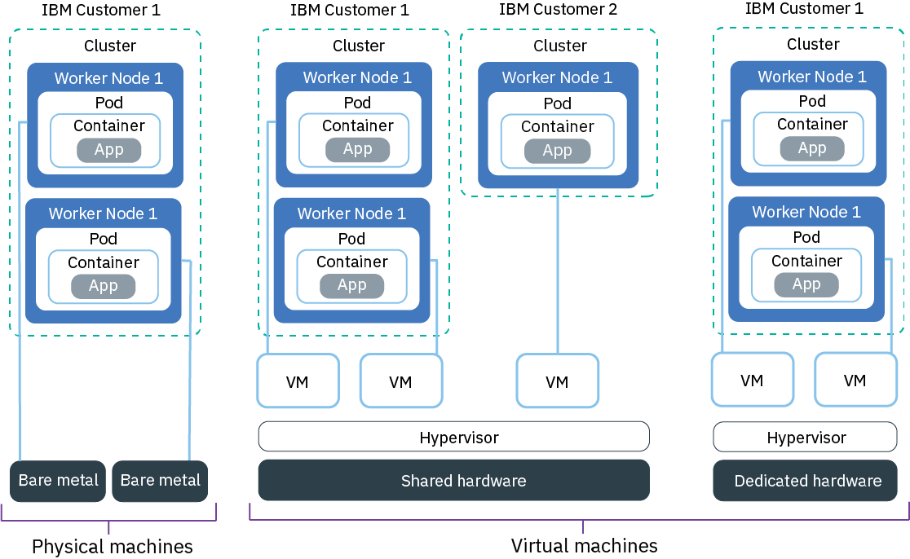

---

copyright: 
  years: 2014, 2023
lastupdated: "2023-04-21"

keywords: kubernetes, hardware, flavor, machine type, vm, bm

subcollection: containers


---

{{site.data.keyword.attribute-definition-list}}


# Planning your worker node setup
{: #planning_worker_nodes}

{{site.data.keyword.containerlong}} provides different worker node flavors and isolation levels so that you can choose the flavor and isolation that best meet the requirements of the workloads that you want to run in the cloud.
{: shortdesc}

A worker node flavor describes the compute resources, such as CPU, memory, and disk capacity that you get when you provision your worker node. Worker nodes of the same flavor are grouped in worker node pools. The total number of worker nodes in a cluster determine the compute capacity that is available to your apps in the cluster.

Want to save on your classic worker node costs? [Create a reservation](/docs/containers?topic=containers-reservations) to lock in a discount over 1 or 3 year terms! Then, create your worker pool by using the reserved instances. Note that autoscaling can't be enable on worker pools that use reservations.
{: tip}

Trying to plan how many worker nodes your need in your cluster? Check out [Sizing your Kubernetes cluster to support your workload](/docs/containers?topic=containers-strategy#sizing) to find information about the default worker node setup and how you can determine the resource requirements of your workloads.
{: tip}

## Available hardware for worker nodes
{: #shared_dedicated_node}

The worker node flavors and isolation levels that are available to you depend on your container platform, cluster type, the infrastructure provider that you want to use, and the {{site.data.keyword.containerlong_notm}} location where you want to create your cluster.
{: shortdesc}

{: caption="Figure 1. Hardware options for worker nodes in a standard cluster" caption-side="bottom"}

### What flavors are available to me?
{: #available-flavors}

Classic standard clusters can be created on [virtual](#vm) and [bare metal](#bm) worker nodes. If you require additional local disks, you can also choose one of the bare metal flavors that are designed for [software-defined storage](#sds) solutions, such as Portworx. Depending on the level of hardware isolation that you need, virtual worker nodes can be set up as shared or dedicated nodes, whereas bare metal machines are always set up as dedicated nodes. If you create a free classic cluster, your cluster is provisioned with the smallest virtual worker node flavor on shared infrastructure.

VPC clusters can be provisioned as standard clusters on shared [virtual](#vm) worker nodes only, and must be created in one of the supported [multizone locations](/docs/containers?topic=containers-regions-and-zones#zones-vpc). Free VPC clusters are not supported.

VPC clusters can be provisioned using virtual worker nodes on standard infrastructure or dedicated hosts. Free VPC clusters are not supported.


Gateway-enabled classic clusters are created with a `compute` pool of compute worker nodes and a `gateway` pool of gateway worker nodes by default. During cluster creation you can specify the isolation and flavor for the compute worker nodes, but by default the gateway worker nodes are created on shared virtual machines with the `u3c.2x4` flavor. If you want to change the isolation and flavor of the gateway worker nodes, you can [create a new gateway worker pool](/docs/containers?topic=containers-add_workers#gateway_replace) to replace the `gateway` worker pool.

### Can I combine different flavors in a cluster?
{: #combine-flavors}

Yes. To add different flavors to your cluster, you must [create another worker pool](/docs/containers?topic=containers-kubernetes-service-cli#cs_worker_pool_create). You can't resize existing worker pools to have different compute resources such as CPU or memory.

### How can I change worker node flavors?
{: #change-flavors}

See [updating flavors](/docs/containers?topic=containers-update#machine_type).

### Are the worker nodes encrypted?
{: #encrypted-flavors}

The secondary disk of the worker node is encrypted. For more information, see [Overview of cluster encryption](/docs/containers?topic=containers-encryption#encrypt_ov). After you create a worker pool, you might notice that the worker node flavor has `.encrypted` in the name, such as `b3c.4x16.encrypted`.

### How do I manage my worker nodes?
{: #flavor-manage}

Worker nodes in classic clusters are provisioned into your {{site.data.keyword.cloud_notm}} account. You can manage your worker nodes by using {{site.data.keyword.containerlong_notm}}, but you can also use the [classic infrastructure dashboard](https://cloud.ibm.com/classic/) in the {{site.data.keyword.cloud_notm}} console to work with your worker node directly.  

Unlike classic clusters, the worker nodes of your VPC cluster are not listed in the [VPC infrastructure dashboard](https://cloud.ibm.com/vpc/overview). Instead, you manage your worker nodes with {{site.data.keyword.containerlong_notm}} only. However, your worker nodes might be connected to other VPC infrastructure resources, such as VPC subnets or VPC Block Storage. These resources are in the VPC infrastructure dashboard and can be managed separately from there.

### What limitations do I need to be aware of?
{: #flavor-limitations}

Kubernetes limits the maximum number of worker nodes that you can have in a cluster. Review [worker node and pod quotas](https://kubernetes.io/docs/setup/best-practices/cluster-large/){: external} for more information.

[Reserved capacity and reserved instances](/docs/virtual-servers?topic=virtual-servers-provisioning-reserved-capacity-and-instances) are not supported.

{{site.data.keyword.containerlong_notm}} also sets compute resource reserves that limit available compute resources on each worker node. For more information, see [worker node resource reserves](#resource_limit_node).

Want to be sure that you always have enough worker nodes to cover your workload? Try out [the cluster autoscaler](/docs/containers?topic=containers-cluster-scaling-classic-vpc).
{: tip}


### How can I check the operating system that my worker nodes run?
{: #flavor-os-check}

When you create a worker pool, you choose the flavor, which describes the operating system along with the compute resources of the worker nodes. Supported operating systems are Ubuntu 18.04 x86_64, 16.04 x86_64 (deprecated). To update the version of the operating system that a worker node uses, such as from Ubuntu 16 to 18, you can [replace the flavor of the worker pool](/docs/containers?topic=containers-update#machine_type).

You can also log in to your cluster to check the operating system of the worker nodes.
1. [Log in to your account. If applicable, target the appropriate resource group. Set the context for your cluster.](/docs/containers?topic=containers-cs_cli_install#cs_cli_configure)
2. List your worker nodes.
    ```sh
    kubectl get nodes
    ```
    {: pre}

3. Describe your worker node and check for the operating system label that IBM applies, or the **OS Image** and **Operating System** fields in the **System Info** section.
    ```sh
    kubectl describe node <node>
    ```
    {: pre}

    Example output

    ```sh
    NAME:               10.xxx.xx.xxx
    Roles:              <none>
    Labels:             arch=amd64
                        ...
                        ibm-cloud.kubernetes.io/os=UBUNTU_18_64
                        ...
                        kubernetes.io/arch=amd64
                        kubernetes.io/hostname=10.189.33.198
                        kubernetes.io/os=linux
    ...
    System Info:
        OS Image:                   Ubuntu 18.04.5 LTS
        Operating System:           linux
        Architecture:               amd64
        ...
    ```
    {: screen}

## Virtual machines
{: #vm}

With VMs, you get greater flexibility, quicker provisioning times, and more automatic scalability features than bare metal, at a more cost-effective price. You can use VMs for most general-purpose use cases such as testing and development environments, staging, and prod environments, microservices, and business apps. However, there is a tradeoff in performance. If you need high-performance computing for data- or RAM-intensive workloads, consider creating classic clusters with [bare metal](#bm) worker nodes.
{: shortdesc}

### Planning considerations for VMs
{: #vm-planning}

#### Do I want to use shared or dedicated hardware?
{: #shared_or_dedicated_vms}


When you create a standard classic cluster, you must choose whether you want the underlying hardware to be shared by multiple {{site.data.keyword.IBM_notm}} customers (multi tenancy) or to be dedicated to you only (single tenancy). VPC standard clusters can be provisioned on shared infrastructure (multi tenancy) only.


When you create a standard cluster, you must choose whether you want the underlying hardware to be shared by multiple {{site.data.keyword.IBM_notm}} customers (multi tenancy) or to be dedicated to you only (single tenancy).


* **In a multi-tenant, shared hardware setup**: Physical resources, such as CPU and memory, are shared across all virtual machines that are deployed to the same physical hardware. To ensure that every virtual machine can run independently, a virtual machine monitor, also referred to as the hypervisor, segments the physical resources into isolated entities and allocates them as dedicated resources to a virtual machine (hypervisor isolation).
* **In a single-tenant, dedicated hardware setup**: All physical resources are dedicated to you only. You can deploy multiple worker nodes as virtual machines on the same physical host. Similar to the multi-tenant setup, the hypervisor assures that every worker node gets its share of the available physical resources.

Shared nodes are usually less costly than dedicated nodes because the costs for the underlying hardware are shared among multiple customers. However, when you decide between shared and dedicated nodes, you might want to check with your legal department to discuss the level of infrastructure isolation and compliance that your app environment requires.

Some classic worker node flavors are available for only one type of tenancy setup. For example, `m3c` VMs can be provisioned in a shared tenancy setup only.
{: note}

#### How does bandwidth allocation work for VPC Gen 2 worker nodes?
{: #vm_bandwidth_allocation}

Note that {{site.data.keyword.containerlong_notm}} doesn't support adjusting the bandwidth profile that is associated with the underlying VPC instance profile.

When you provision a worker node on a VPC Gen 2 cluster, you get the default bandwidth allocation for that instance profile. For more information, see [Bandwidth profiles](/docs/vpc?topic=vpc-bandwidth-allocation-profiles){: external}.

#### How does storage work for VMs?
{: #vm_storage_vpc}

Every VM comes with an attached disk for storage of information that the VM needs to run, such as OS file system, container runtime, and the `kubelet`.  Local storage on the worker node is for short-term processing only, and the storage disks are wiped when you delete, reload, replace, or update the worker node. For persistent storage solutions for your apps, see [Planning highly available persistent storage](/docs/containers?topic=containers-storage-plan). Additionally, classic and VPC infrastructure differ in the disk setup.

* **Classic VMs**: Classic VMs have two attached disks. The primary storage disk has 25 GB for the OS file system, and the auxiliary storage disk has 100 GB for data such as the container runtime and the `kubelet`. For reliability, the primary and auxiliary storage volumes are local disks instead of storage area networking (SAN). Reliability benefits include higher throughput when serializing bytes to the local disk and reduced file system degradation due to network failures. The auxiliary disk is encrypted by default.
* **VPC compute VMs**: VPC VMs have one primary disk that is a block storage volume that is attached via the network. The storage layer is not separated from the other networking layers, and both network and storage traffic are routed on the same network. The primary storage disk is used for storing data such as the OS file system, container runtime, and `kubelet`, and is [encrypted by default](/docs/vpc?topic=vpc-block-storage-about#vpc-storage-encryption).
* To prevent default pod evictions, 10% of the Kubernetes data disk (auxiliary disk in classic, primary boot disk in VPC) is reserved for system components.


### Available flavors for VMs
{: #vm-table}

The following table shows available worker node flavors for classic and VPC clusters. Worker node flavors vary by cluster type, the zone where you want to create the cluster, the container platform, and the infrastructure provider that you want to use. To see the flavors available in your zone, run `ibmcloud ks flavors --zone <zone>`.


To view a list of available VM flavors by zone, review the following pages.
- [Classic flavors](/docs/containers?topic=containers-classic-flavors)
- [VPC Gen 2 flavors](/docs/containers?topic=containers-vpc-flavors)*

`*` VPC: For more information about network performance caps for virtual machines, see [VPC profiles](/docs/vpc?topic=vpc-profiles). The network speeds refer to the speeds of the worker node network interfaces. The maximum speed available to your worker nodes is `25Gbps`. Because IP in IP encapsulation is required for traffic between pods that are on different VPC worker nodes, data transfer speeds between pods on different worker nodes might be slower, about half the compute profile network speed. Overall network speeds for apps that you deploy to your cluster depend on the worker node size and application's architecture.


## Physical machines (bare metal)
{: #bm}

You can provision your worker node as a single-tenant physical server, also referred to as bare metal.
{: shortdesc}

Physical machines are available for classic clusters only and are not supported in VPC clusters.
{: note}

### Planning considerations for bare metal
{: #bm-planning}

How is bare metal different than VMs?
:   Bare metal gives you direct access to the physical resources on the machine, such as the memory or CPU. This setup eliminates the virtual machine hypervisor that allocates physical resources to virtual machines that run on the host. Instead, all a bare metal machine's resources are dedicated exclusively to the worker, so you don't need to worry about "noisy neighbors" sharing resources or slowing down performance. Physical flavors have more local storage than virtual, and some have RAID to increase data availability. Local storage on the worker node is for short-term processing only, and the primary and auxiliary disks are wiped when you update or reload the worker node. For persistent storage solutions, see [Planning highly available persistent storage](/docs/containers?topic=containers-storage-plan).

Because you have full control over the isolation and resource consumption for your workloads, you can use bare metal machines to achieve HIPAA and PCI compliance for your environment.
{: important}

Bare metal seems awesome! What's stopping me from ordering one immediately?
:   Bare metal servers are more expensive than virtual servers, and are best suited for high-performance apps that need more resources and host control. Bare metal worker nodes are also not available for VPC clusters.

Bare metal servers are billed monthly. If you cancel a bare metal server before the end of the month, you are charged through the end of that month. After you order or cancel a bare metal server, the process is completed manually in your IBM Cloud infrastructure account. Therefore, it can take more than one business day to complete.
{: important}

### Available flavors for bare metal
{: #bm-table}

Worker node flavors vary by cluster type, the zone where you want to create the cluster, the container platform, and the infrastructure provider that you want to use. To see the flavors available in your zone, run `ibmcloud ks flavors --zone <zone>`. You can also review available [VM](#vm) or [SDS](#sds) flavors.

Bare metal machines are optimized for different use cases such as data-, GPU-, or RAM-intensive workloads.


Choose a flavor, or machine type, with the correct storage configuration to support your workload. Some flavors have a mix of the following disks and storage configurations. For example, some flavors might have a SATA primary disk with a raw SSD secondary disk.

* **SATA**: A magnetic spinning disk storage device that is often used for the primary disk of the worker node that stores the OS file system.
* **SSD**: A solid-state drive storage device for high-performance data.
* **SAN**: For select virtual machines, the storage device is mounted via software area network (SAN).
* **Raw**: The storage device is unformatted and the full capacity is available for use.
* **RAID**: A storage device with data distributed for redundancy and performance that varies depending on the RAID level. As such, the disk capacity that is available for use varies.

| Name and use case | Cores / Memory | Primary / Auxiliary disk | Network speed |
| --- | --- | --- | --- |
| **RAM-intensive bare metal, mb4c.20x64**: Maximize the RAM available to your worker nodes. This bare metal includes 2nd Generation Intel® Xeon® Scalable Processors with Intel® C620 Series chip sets for better performance for workloads such as machine learning, AI, and IoT. | 20 / 64 GB | 2 TB HDD / 960 GB SSD | 10000 Mbps |
| **RAM-intensive bare metal, mb4c.20x192**: Maximize the RAM available to your worker nodes. This bare metal includes 2nd Generation Intel® Xeon® Scalable Processors with Intel® C620 Series chip sets for better performance for workloads such as machine learning, AI, and IoT. | 20 / 192 GB | 2 TB HDD / 960 GB SSD | 10000 Mbps |
| **RAM-intensive bare metal, mb4c.20x384**: Maximize the RAM available to your worker nodes. This bare metal includes 2nd Generation Intel® Xeon® Scalable Processors with Intel® C620 Series chip sets for better performance for workloads such as machine learning, AI, and IoT. | 20 / 384 GB | 2 TB HDD / 960 GB SSD | 10000 Mbps |
| **GPU bare metal, mg4c.32x384.2xp100**: Choose this type for mathematically intensive workloads such as high-performance computing, machine learning, deep learning, or 3D applications. This flavor has two Tesla P100 physical cards that have two GPUs per card for a total of four GPUs. Note that this Pascal GPU flavor does not support the Data Center GPU Manager because of a known issue from NVIDIA. | 32 / 384 GB | 2 TB HDD / 960 GB SSD | 10000 Mbps |
| **Balanced bare metal, me4c.4x32**: Use for balanced workloads that require more compute resources than virtual machines offer. This bare metal includes 2nd Generation Intel® Xeon® Scalable Processors with Intel® C620 Series chip sets for better performance for workloads such as machine learning, AI, and IoT. | 4 / 32 GB | 2 TB HDD / 2 TB HDD | 10000 Mbps |
{: caption="Available bare metal flavors in {{site.data.keyword.containerlong_notm}}."}


## Software-defined storage (SDS) machines
{: #sds}

Software-defined storage (SDS) flavors have additional raw disks for physical local storage. Unlike the primary and auxiliary local disk, these raw disks are not wiped during a worker node update or reload. Because data is co-located with the compute node, SDS machines are suited for high-performance workloads.
{: shortdesc}

Software-defined storage flavor are available for classic clusters only and are not supported in VPC clusters.
{: note}

### Planning considerations for SDS
{: #sds-planning}

Because you have full control over the isolation and resource consumption for your workloads, you can use SDS machines to achieve HIPAA and PCI compliance for your environment.
{: important}

You typically use SDS machines in the following cases:
*  If you use an SDS add-on such as [Portworx](/docs/containers?topic=containers-portworx#portworx), use an SDS machine.
*  If your app is a [StatefulSet](https://kubernetes.io/docs/concepts/workloads/controllers/statefulset/){: external} that requires local storage, you can use SDS machines and provision [Kubernetes local persistent volumes](https://kubernetes.io/docs/concepts/storage/volumes/#local){: external}.
*  If you have custom apps that require additional raw local storage.

For more storage solutions, see [Planning highly available persistent storage](/docs/containers?topic=containers-storage-plan).

### Available flavors for SDS
{: #sds-table}

Worker node flavors vary by cluster type, the zone where you want to create the cluster, the container platform, and the infrastructure provider that you want to use. To see the flavors available in your zone, run `ibmcloud ks flavors --zone <zone>`. You can also review available [bare metal](#bm) or [VM](#vm) flavors.

Choose a flavor, or machine type, with the correct storage configuration to support your workload. Some flavors have a mix of the following disks and storage configurations. For example, some flavors might have a SATA primary disk with a raw SSD secondary disk.

* **SATA**: A magnetic spinning disk storage device that is often used for the primary disk of the worker node that stores the OS file system.
* **SSD**: A solid-state drive storage device for high-performance data.
* **SAN**: For select virtual machines, the storage device is mounted via software area network (SAN).
* **Raw**: The storage device is unformatted and the full capacity is available for use.
* **RAID**: A storage device with data distributed for redundancy and performance that varies depending on the RAID level. As such, the disk capacity that is available for use varies.

| Name and use case | Cores / Memory | Primary / Secondary disk | Additional raw disks | Network speed |
| --- | --- | --- | --- | --- |
| **Data-intensive bare metal with SDS, me4c.4x32.1.9tb.ssd**: If you need extra local storage for performance, use this disk-heavy flavor that supports software-defined storage (SDS). This bare metal includes 2nd Generation Intel® Xeon® Scalable Processors with Intel® C620 Series chip sets for better performance for workloads such as machine learning, AI, and IoT. | 4 / 32 GB | 2 TB HDD / 960 GB SSD | 1.9 TB Raw SSD (device paths: `/dev/sdc`) | 10000 Mbps |
| **RAM-intensive bare metal with SDS, mb4c.20x64.2x1.9tb.ssd**: If you need extra local storage for performance, use this disk-heavy flavor that supports software-defined storage (SDS). Maximize the RAM available to your worker nodes. This bare metal includes 2nd Generation Intel® Xeon® Scalable Processors with Intel® C620 Series chip sets for better performance for workloads such as machine learning, AI, and IoT. | 20 / 64 GB | 2 TB HDD / 960 GB SSD | 2 disks, 1.9 TB Raw SSD (device paths: `/dev/sdc`, `/dev/sdd`) | 10000 Mbps |
| **RAM-intensive bare metal with SDS, mb4c.32x384.3.8tb.ssd**: If you need extra local storage for performance, use this disk-heavy flavor that supports software-defined storage (SDS). Maximize the RAM available to your worker nodes. This bare metal includes 2nd Generation Intel® Xeon® Scalable Processors with Intel® C620 Series chip sets for better performance for workloads such as machine learning, AI, and IoT. | 32 / 384 GB | 2 TB HDD / 960 GB SSD | 3.8 TB Raw SSD (device paths: `/dev/sdc`) | 10000 Mbps |
| **RAM-intensive bare metal with SDS, mb4c.32x384.6x3.8tb.ssd**: If you need extra local storage for performance, use this disk-heavy flavor that supports software-defined storage (SDS). Maximize the RAM available to your worker nodes. This bare metal includes 2nd Generation Intel® Xeon® Scalable Processors with Intel® C620 Series chip sets for better performance for workloads such as machine learning, AI, and IoT. | 32 / 384 GB | 2 TB HDD / 960 GB SSD | 6 disks, 3.8 TB Raw SSD (device paths: `/dev/sdc`, `/dev/sdd`, `/dev/sde`, `/dev/sdf`, `/dev/sdg`, `/dev/sdh`) | 10000 Mbps |
| **RAM-intensive bare metal with SDS, mb4c.32x768.3.8tb.ssd**: If you need extra local storage for performance, use this disk-heavy flavor that supports software-defined storage (SDS). Maximize the RAM available to your worker nodes. This bare metal includes 2nd Generation Intel® Xeon® Scalable Processors with Intel® C620 Series chip sets for better performance for workloads such as machine learning, AI, and IoT. | 32 / 768 GB | 2 TB HDD / 960 GB SSD | 3.8 TB Raw SSD (device paths: `/dev/sdc`) | 10000 Mbps |
{: caption="Available SDS flavors in {{site.data.keyword.containerlong_notm}}."}


## Worker node resource reserves
{: #resource_limit_node}

{{site.data.keyword.containerlong_notm}} sets compute resource reserves that limit available compute resources on each worker node. Reserved memory, CPU resources, and process IDs (PIDs) can't be used by pods on the worker node, and reduces the allocatable resources on each worker node. When you initially deploy pods, if the worker node does not have enough allocatable resources, the deployment fails. Further, if pods exceed the worker node resource limit for memory and CPU, the pods are evicted. In Kubernetes, this limit is called a [hard eviction threshold](https://kubernetes.io/docs/concepts/scheduling-eviction/node-pressure-eviction/#hard-eviction-thresholds){: external}. For pods that exceed the PID limit, the pods receive as many PIDs as allocatable, but are not evicted based on PIDs.
{: shortdesc}

If less PIDs, CPU or memory is available than the worker node reserves, Kubernetes starts to evict pods to restore sufficient compute resources and PIDs. The pods reschedule onto another worker node if a worker node is available. If your pods are evicted frequently, add more worker nodes to your cluster or set [resource limits](https://kubernetes.io/docs/concepts/configuration/manage-resources-containers/#resource-requests-and-limits-of-pod-and-container){: external} on your pods.

The resources that are reserved on your worker node depend on the amount of PIDs, CPU and memory that your worker node comes with. {{site.data.keyword.containerlong_notm}} defines PIDs, CPU and memory tiers as shown in the following tables. If your worker node comes with compute resources in multiple tiers, a percentage of your PIDs, CPU and memory resources is reserved for each tier.

: Clusters also have process ID (PID) reservations and limits, to prevent a pod from using too many PIDs or ensure that enough PIDs exist for the `kubelet` and other {{site.data.keyword.containerlong_notm}} system components. If the PID reservations or limits are reached, Kubernetes does not create or assign new PIDs until enough processes are removed to free up existing PIDs. The total amount of PIDs on a worker node approximately corresponds to 8,000 PIDs per GB of memory on the worker node. For example, a worker node with 16 GB of memory has approximately 128,000 PIDs (`16 × 8,000 = 128,000`).

To review how much compute resources are currently used on your worker node, run [`kubectl top node`](https://kubernetes.io/docs/reference/generated/kubectl/kubectl-commands#top){: external}.
{: tip}

| Memory tier | % or amount reserved | `b3c.4x16` worker node (16 GB) example | `mg1c.28x256` worker node (256 GB) example|
|:-----------------|:-----------------|:-----------------|:-----------------|
| First 4 GB (0 - 4 GB) | 25% of memory | 1 GB | 1 GB|
| Next 4 GB (5 - 8 GB) | 20% of memory | 0.8 GB | 0.8 GB|
| Next 8 GB (9 - 16 GB) | 10% of memory | 0.8 GB | 0.8 GB|
| Next 112 GB (17 - 128 GB) | 6% of memory | N/A | 6.72 GB|
| Remaining GB (129 GB+) | 2% of memory | N/A | 2.54 GB|
| Additional reserve for [`kubelet` eviction](https://kubernetes.io/docs/concepts/scheduling-eviction/node-pressure-eviction/){: external} | 100 MB | 100 MB (flat amount) | 100 MB (flat amount)|
| **Total reserved** | **(varies)** | **2.7 GB of 16 GB total** | **11.96 GB of 256 GB total**|
{: class="simple-tab-table"}
{: caption="Worker node memory reserves by tier" caption-side="bottom"}
{: #worker-memory-reserves}
{: tab-title="Worker node memory reserves by tier"}
{: tab-group="Worker Node"}

| CPU tier | % or amount reserved | `b3c.4x16` worker node (four cores) example | `mg1c.28x256` worker node (28 cores) example|
|:-----------------|:-----------------|:-----------------|:-----------------|
| First core (Core 1) | 6% cores | 0.06 cores | 0.06 cores|
| Next two cores (Cores 2 - 3) | 1% cores | 0.02 cores | 0.02 cores|
| Next two cores (Cores 4 - 5) | 0.5% cores | 0.005 cores | 0.01 cores|
| Remaining cores (Cores 6+) | 0.25% cores | N/A | 0.0575 cores|
| **Total reserved** | **(varies)** | **0.085 cores of four cores total** | **0.1475 cores of 28 cores total**|
{: class="simple-tab-table"}
{: caption="Worker node CPU reserves by tier" caption-side="bottom"}
{: #worker-cpu-reserves}
{: tab-title="Worker node CPU reserves by tier"}
{: tab-group="Worker Node"}

| Total PIDs | % reserved | % available to pod |
|:-----------------|:-----------------|:-----------------|
| < 200,000 | 20% PIDs | 35% PIDs |
| 200,000 - 499,999 | 10% PIDs  | 40% PIDs |
| ≥ 500,000 | 5% PIDs  | 45% PIDs  |
| `b3c.4x16` worker node: 126,878 PIDs | 25,376 PIDs (20%) | 44,407 PIDS (35%)  |
| `mg1c.28x256` worker node: 2,062,400 PIDs| 103,120 PIDs (5%) | 928,085 PIDs (45%) |
{: class="simple-tab-table"}
{: caption="Worker node PID reserves by tier" caption-side="bottom"}
{: #worker-pid-reserves}
{: tab-title="Worker node PID reserves by tier"}
{: tab-group="Worker Node"}

| Infrastructure provider | Versions | Disk | % of disk reserved |
|:------------------------|:---------|:-----|:-------------------|
| Classic | Kubernetes 1.19 | Secondary disk | 10% |
| VPC | Kubernetes 1.19 | Boot disk | 10% |
{: class="simple-tab-table"}
{: caption="Worker node disk ephemeral storage reserves" caption-side="bottom"}
{: #worker-memory-reserves-infra}
{: tab-title="Worker node disk reserves"}
{: tab-group="Worker Node"}

Sample worker node values are provided for example only. Your actual usage might vary slightly.
{: note}


